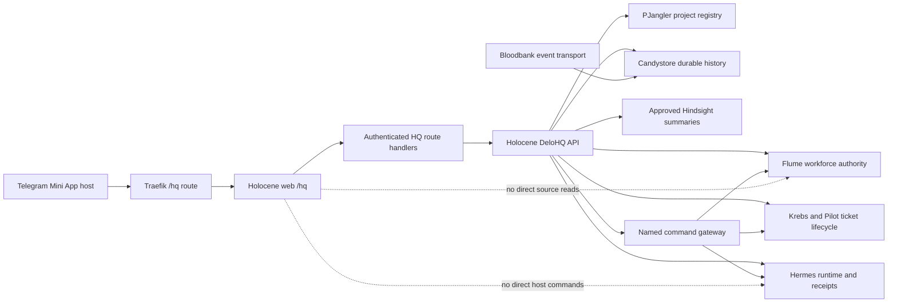
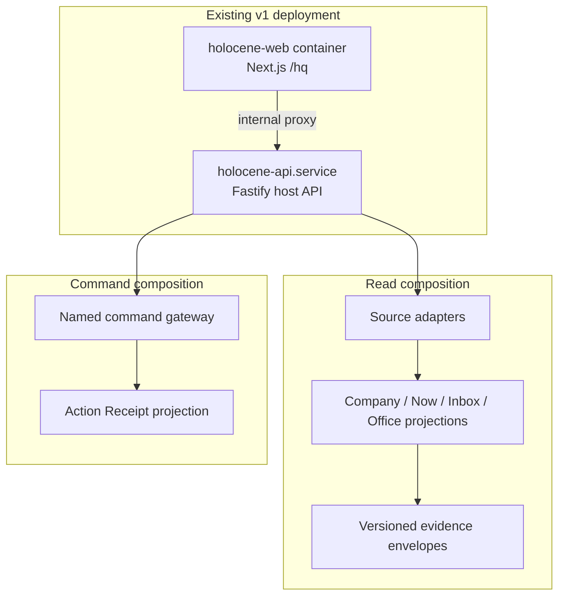

# Architecture Spine — DeloHQ

## Design Paradigm

DeloHQ is a projection-oriented anti-corruption layer with an explicit command
gateway. Canonical systems own domain facts and mutations; Holocene adapts them
into DeloHQ view models and named commands; the Telegram Mini App renders those
models and reports receipts. The web surface never reads source files, event
stores, or runtime control paths directly.

## Invariants & Rules

### AD-1 — Canonical authority boundary [ADOPTED]

- **Binds:** all DeloHQ capabilities
- **Prevents:** DeloHQ, Holocene, or a UI component becoming a second owner of workforce, project, ticket, event, runtime, or history state
- **Rule:** Flume owns workforce identity and policy; PJangler owns project identity; Krebs and Pilot own ticket lifecycle; Bloodbank and Candystore own event transport and durable history; Hermes owns runtime execution and receipts. DeloHQ may project, explain, link, acknowledge, and request a bounded command, but only the owning system may mutate or complete its fact.

### AD-2 — Holocene is the v1 host and composition boundary [ADOPTED]

- **Binds:** FR-1 through FR-16, UJ-1 through UJ-4
- **Prevents:** a parallel DeloHQ repository, service, API, database, or event stream diverging from Holocene mission control
- **Rule:** Extend `holocene/apps/web/app/hq/`, `holocene/apps/api/`, and the shared Holocene packages. The web container serves the Mini App; `holocene-api.service` performs host-side reads and commands; the root `33god-platform/compose.yaml` remains the web deployment owner. v1 creates no DeloHQ-owned durable store or runtime service.

### AD-3 — All browser data crosses one DeloHQ API seam

- **Binds:** FR-1 through FR-11 and FR-15 through FR-16
- **Prevents:** separately built screens choosing different source files, endpoints, auth behavior, or interpretation of the same company fact
- **Rule:** The browser consumes only DeloHQ view models from authenticated `/hq/api/*` routes. Those routes call Holocene API adapters; the browser never reads `org.yaml`, Hermes registries, systemd, Candystore, Bloodbank, Flume stores, or internal Fastify routes directly. Each route returns a versioned, typed envelope and an explicit error or degraded state.

### AD-4 — Canonical identifiers survive every projection

- **Binds:** FR-1, FR-3, FR-5, FR-7, FR-9, FR-10, FR-14, FR-15, and FR-16
- **Prevents:** display-name joins, ambiguous ownership, and links that land on a different employee, project, ticket, event, or receipt
- **Rule:** Use opaque canonical references throughout the DeloHQ API: Flume Employee or Agent identity, PJangler Project identity, Krebs/Pilot ticket identity, Bloodbank/Candystore event identity, Hermes execution identity, and DeloHQ Action/receipt correlation identity. Display names, repository labels, and Telegram usernames are labels or destinations, never join keys.

### AD-5 — Workforce identity is projected from Flume, with a bounded migration overlay

- **Binds:** FR-1 through FR-3, FR-9, FR-10, and SM-5
- **Prevents:** the existing `org.yaml` presentation overlay or scattered registry reads silently becoming workforce authority
- **Rule:** The Company and Agent Office projection takes Employee identity, role, hierarchy, delegation, escalation, and workforce policy from a Flume-backed contract. Until the Flume projection transport is selected, Holocene may read the existing registry and `org.yaml` only through one transitional adapter: registry values are operational references, `org.yaml` values are presentation metadata, and neither is writable by DeloHQ. Every workforce response carries one projection identifier and generation timestamp, and Company and Office views use the same snapshot for a response cycle.

### AD-6 — Now, Inbox, and history are composed from canonical evidence

- **Binds:** FR-4 through FR-8, FR-13, FR-14, SM-2, SM-3, and SM-6
- **Prevents:** raw event volume, empty history, chat volume, or UI polling order being mistaken for company meaning or completed work
- **Rule:** Holocene composes Now items, Inbox items, and receipt history from canonical event and outcome evidence. Bloodbank transports events; Candystore is the durable history source; DeloHQ does not create a second event store. Related facts are grouped by canonical correlation or causation identity. The shared DeloHQ contract owns item identity, grouping key, attention class, and precedence; surfaces may filter or order items but may not independently reclassify them. Absence, timeout, or an empty source response remains unavailable or Unknown until evidence supports a stronger claim.

### AD-7 — Consequential operations use named commands and durable receipts

- **Binds:** FR-11 through FR-14, UJ-2, UJ-3, and SM-2
- **Prevents:** arbitrary path proxying, duplicate actions, success-only toasts, and a DeloHQ state machine that disagrees with the canonical executor
- **Rule:** Every consequential operation is a named capability with typed input, an allowlisted target, an originating Inbox item or Agent Office, an idempotency key, and a correlation ID. The Holocene command gateway dispatches only to the owning Canonical System. The shared DeloHQ contract defines the normalized receipt states and mapping from each source state while preserving the source state and evidence. The canonical system owns transitions; DeloHQ renders `accepted`, `in_progress`, `completed`, `failed`, `expired`, `rejected`, or `unknown` from evidence. The current path-pinned Hermes proxy is a transitional adapter, not the long-term command contract.

### AD-8 — Telegram identity is verified at the public `/hq` boundary

- **Binds:** FR-12, FR-15, FR-16, the audience/data boundary, and all state-changing routes
- **Prevents:** browser-supplied identity, a second login model, or an authenticated Mini App reaching arbitrary host operations
- **Rule:** The `/hq` route handlers verify Telegram Mini App `initData` with the bot token, freshness policy, and operator allowlist on every request, then derive the actor context. Public routes forward only named DeloHQ reads or commands; the internal Fastify API is not the browser's trust boundary. Every command envelope carries `actor_ref`, `auth_observed_at`, and originating route metadata; the command gateway rejects a missing or unverified actor context.

### AD-9 — Freshness and Unknown are part of every projection contract

- **Binds:** FR-2, FR-4, FR-6, FR-9, FR-13, SM-1, SM-2, and SM-6
- **Prevents:** stale, missing, contradictory, or partially collected data being rendered as healthy, current, or completed
- **Rule:** Every DeloHQ projection envelope carries `schema_version`, `source`, `generated_at`, `observed_at`, freshness state, and an explanation or evidence reference when the state is stale, unavailable, contradictory, or Unknown. Each surface has one declared max-age policy owned by the Holocene API. If the policy or evidence cannot support a stronger claim, the API returns Unknown or stale and the UI preserves that state.

### AD-10 — The split deployment remains observable and fail-closed

- **Binds:** FR-2, FR-8, FR-13, FR-15, and the operational envelope of v1
- **Prevents:** a healthy-looking Mini App masking an unavailable host API, stale source, broken auth, or unobserved command outcome
- **Rule:** Traefik routes `/hq` and its static assets to `holocene-web`; the web proxies DeloHQ requests to the host API; `holocene-api.service` remains the host-side authority for filesystem, runtime, and source integrations. Health, source freshness, proxy failures, and command receipts are visible as distinct states. A failed or unavailable dependency degrades to an explicit error or Unknown state and never to fabricated success.

### AD-11 — DeloHQ seams are versioned and contract-tested

- **Binds:** all DeloHQ API view models, commands, receipts, and cross-component handoffs
- **Prevents:** independently built adapters accepting incompatible shapes while appearing locally healthy
- **Rule:** `holocene/packages/delohq-contracts/` is the one committed registry for DeloHQ envelopes, view models, item identity, freshness vocabulary, attention precedence, command inputs, normalized receipt states, and error shapes. DeloHQ adapters, routes, and views import those definitions and contract tests. A source adapter may preserve upstream fields internally, but the browser-facing contract is owned by Holocene and changes only with a versioned migration.

## Dependency Direction



## Consistency Conventions

| Concern | Convention |
| --- | --- |
| Naming and identity | Canonical references use opaque `*_id` values; `*_at` timestamps are ISO-8601 UTC; display names and usernames are labels only. DeloHQ names an Employee, Project, Action, and Receipt explicitly rather than overloading `agent` or `status`. |
| Data and formats | Browser-facing payloads are JSON envelopes with `schema_version`, `source`, `generated_at`, `observed_at`, state, and evidence or error details. Upstream field naming stays inside adapters; DeloHQ view models use the existing TypeScript camelCase convention. |
| State and mutation | GET/read paths are side-effect free. POST commands are named capabilities with typed input, target allowlists, correlation IDs, idempotency keys, and receipt polling or streaming. No command is represented as completed from HTTP acceptance alone. |
| Auth and failure | Telegram `initData` is verified at every public `/hq` route. Source failure, stale evidence, missing receipt, expired target, and invalid deep link are distinct user-visible states; none is silently converted to healthy or empty. |
| Observability | Every source adapter and command records source, correlation, outcome, timestamp, and a concise failure reason without exposing prompts, raw private memory, credentials, or arbitrary command text. |

## Stack

| Name | Version |
| --- | --- |
| Holocene web | Next.js 15.0.0 / React 18.3.1 |
| Holocene API | Fastify 5.1 / TypeScript 5.6 |
| Runtime | Node.js 22 Compose target; Node.js 26.5 live API |
| Workspace | pnpm 10.0.0 / Turbo 2.x |
| Workforce contract | Flume handbook schema 5 / contract 1.4.0 |
| Telegram bridge | Official versionless WebApp SDK URL already used by `/hq` |
| Deployment | 33god-platform Compose plus `holocene-api.service` |

## Structural Seed



```text
holocene/
  apps/web/app/hq/
    api/                 # public Telegram-verified DeloHQ route boundary
    lib/                 # Mini App verification and shared route helpers
    hq-client.tsx        # navigation and rendering; no source-system reads
  apps/api/src/
    org.ts               # transitional workforce/org projection adapter
    fleet.ts             # Hermes runtime projection adapter
    server.ts            # internal API routes and named command boundary
  packages/org-model/    # pure Company projection vocabulary and resolver
  packages/delohq-contracts/ # one versioned browser and command contract
flume/contracts/handbook.yaml
  # workforce authority and one-directional projection declarations
33god-platform/compose.yaml
  # holocene-web deployment and /hq Traefik route
```

## Capability → Architecture Map

| Capability / Area | Lives in | Governed by |
| --- | --- | --- |
| FR-1 to FR-3 Company | Holocene API source adapters + `@holocene/org-model` + `/hq` Company view | AD-1, AD-2, AD-4, AD-5, AD-9 |
| FR-4 to FR-5 Now | Holocene API evidence/history composition + `/hq` Now view | AD-3, AD-6, AD-9, AD-11 |
| FR-6 to FR-8 Executive Inbox | Holocene API attention projection + `/hq` Inbox views | AD-3, AD-6, AD-9, AD-11 |
| FR-9 to FR-11 Agent Office | Holocene API joined Employee/Project/runtime projection + `/hq` Office view | AD-1, AD-4, AD-5, AD-9 |
| FR-12 to FR-14 bounded Actions and receipts | Holocene named command gateway + canonical command/receipt adapters | AD-1, AD-7, AD-9, AD-11 |
| FR-15 to FR-16 Telegram entry and conversation handoff | Holocene `/hq` route handlers and Telegram bridge | AD-2, AD-3, AD-8, AD-10 |
| Cross-cutting mobile, truthfulness, and failure states | Shared DeloHQ envelopes, API error model, and Mini App state model | AD-3, AD-8, AD-9, AD-10, AD-11 |

## Deferred

- Numeric freshness budgets per surface. The contract and fallback state are
  fixed by AD-9; Architecture and UX choose values before projection work.
- The Flume-to-Holocene transport and migration sequence. The adapter boundary
  is fixed by AD-5; the transport can wait until the Flume runtime surface is
  selected and must not make `org.yaml` authoritative.
- The first bounded Action catalog beyond approve, reject, and acknowledge,
  including each Canonical System's receipt contract.
- Exact Now/Inbox grouping, notification classes, and retained versus retired
  capabilities of the current `/hq` UI.
- Company Memory fields and the Hindsight summarization policy.
- A separate DeloHQ repository, service, deployment, or durable database. This
  becomes relevant only when independent release cadence or deployment
  isolation is required.
- A general event-reducer platform or DeloHQ-owned event store. v1 uses
  canonical Bloodbank/Candystore evidence through Holocene adapters.
- Host package-manager convergence. The repository declares pnpm 10.0.0 while
  the current Node 26.5 host shim fails before pnpm starts; the platform
  handoff must make the declared toolchain executable before implementation
  evidence relies on it.

## Open Questions

1. **Freshness budgets:** What max age makes each Company, Now, Inbox, and Agent
   Office projection stale or Unknown? Owner: Architecture + UX. Revisit before
   projection implementation.
2. **Command catalog:** Which bounded Actions and receipt providers are in the
   first release? Owner: Architecture + PM. Revisit before story acceptance
   criteria.
3. **Flume transport:** Which supported Flume read surface supplies the
   workforce projection, and how is the current presentation overlay retired?
   Owner: Architecture + Flume. Revisit before FR-1 implementation.
4. **Surface migration:** Which current `/hq` controls and capabilities remain,
   change, or retire under the DeloHQ navigation model? Owner: UX + Holocene.
   Revisit during the first `/hq` experience audit.
5. **Company Memory:** Which Hindsight summaries can be shown in Agent Office
   without exposing raw private runtime memory? Owner: Architecture + UX.
   Revisit before Agent Office exposes memory.
