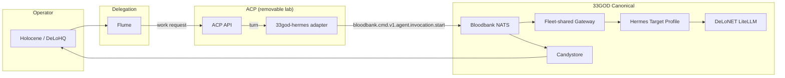

# Architecture Spine — LiteLLM Agent Control Plane Integration

## Design Paradigm

**Delegation-through-Adapter.** ACP is a removable, subordinate session broker
beneath Flume's workforce hierarchy and above canonical Bloodbank dispatch.
All managed-agent turns follow the path:

```
Flume org/delegation → ACP session API → 33god-hermes adapter →
Bloodbank cmd → fleet-shared gateway → target profile
```

ACP normalizes session operations (create, turn, stream, terminate) without
owning permanent identity, event contracts, model credentials, or agent memory.
Each of those remains with its canonical 33GOD owner. The paradigm is not
"ACP replaces" but "ACP bridges" — it translates between Flume work requests
and runtime-native sessions, then routes outcomes back through canonical
Bloodbank events.



## Inherited Invariants

These ADs from the parent 33GOD architecture spine
([`architecture.md`](../architecture.md))
bind the ACP integration:

| Inherited | From parent | Binds here |
|-----------|-------------|------------|
| AD(platform/1) — Bloodbank is event-contract and event-transport authority | Parent architecture | ACP adapter publishes `bloodbank.v1.agent.invocation.start`; no ACP-private event schema |
| AD(platform/2) — Candystore is canonical durable event-history projection | Parent architecture | ACP holds only session projection/cache; Candystore is audit source of truth |
| AD(platform/3) — Holocene is operator-facing control plane | Parent architecture | ACP supplies live session data to Holocene; never becomes the control surface |
| AD(platform/4) — PJangler/`.project.json` are permanent identity authority | Parent architecture | ACP owns disposable runtime/session identity only |
| AD(platform/5) — Component manifests and registry gates control `components.yaml` membership | Parent architecture | ACP not added to registry until repo/contract/gates exist |
| AD(platform/6) — Agent runtimes must not dirty source repos (FR4) | Parent architecture | ACP with its own DB and no tracked runtime state satisfies this |
| AD(platform/7) — Runtime backups through forever-ago (FR5) | Parent architecture | Data classification plus a successful backup/restore test is a blocking gate before Stage 2 |
| AD(platform/8) — Hindsight is durable memory owner | Parent architecture | ACP memory is optional session-local scratch only |
| AD(platform/9) — No hidden runtime dirt; FR4/FR5 extend to new services | Parent architecture | ACP deployment uses its own database, no tracked state |

## Invariants & Rules

### AD-ACP-1 — ACP is a subordinate, removable broker

- **Binds:** FR16, all ACP epics (ACP-E1 through ACP-E6)
- **Prevents:** ACP being treated as the 33GOD control plane or a permanent infrastructure dependency
- **Rule:** Every ACP deployment must have a documented kill switch that disables the
  adapter without touching the fleet-shared gateway. Stopping ACP must leave
  every existing PM, heartbeat, gateway, and Bloodbank route operational.

### AD-ACP-2 — No permanent identity in ACP

- **Binds:** FR16-AC2, ACP-E1
- **Prevents:** ACP creating a second project, fleet, or permanent agent identity source of truth
- **Rule:** ACP may own only disposable runtime/session identity. Permanent identity
  remains in `.project.json`, PJangler registry, and Hermes fleet registry.

### AD-ACP-3 — One canonical command per ACP turn

- **Binds:** FR16-AC3, ACP-E2
- **Prevents:** ACP publishing multiple, partial, or schema-invalid commands for a single turn
- **Rule:** The `33god-hermes` adapter must publish exactly one
  `bloodbank.v1.agent.invocation.start` command per ACP turn with stable
  `correlationid`, `causationid`, `command_id`, and `idempotency_key`.

### AD-ACP-4 — Assistant result is a governed Bloodbank contract

- **Binds:** FR16-AC4, ACP-E2
- **Prevents:** ACP chat being considered complete without a canonical assistant result path
- **Rule:** ACP turn completion requires schema-conformant
  `bloodbank.v1.conversation.message.appended` event or equivalent governed
  response stream. This is a known gap requiring Bloodbank contract work.

### AD-ACP-5 — DeLoNET LiteLLM is sole credential owner

- **Binds:** FR16-AC5, ACP-E1
- **Prevents:** Provider credentials leaking into ACP configuration
- **Rule:** ACP receives only a scoped virtual key with bounded budget and distinct
  LiteLLM identity. No direct OpenAI, Anthropic, Kimi, Google, or OpenRouter
  credentials for the managed-Hermes path.

### AD-ACP-6 — Hindsight is durable memory owner

- **Binds:** FR16-AC6, ACP-E5
- **Prevents:** ACP becoming the canonical memory system
- **Rule:** ACP memory is optional session-local scratch only. Hindsight remains the
  durable memory owner. Candystore remains the durable audit owner.

### AD-ACP-7 — Flume owns hierarchy, delegation, authority

- **Binds:** FR16, ACP-E6
- **Prevents:** ACP developing an org model or delegation policy
- **Rule:** ACP is an execution port beneath Flume. Flume work requests map to ACP
  sessions; ACP never models employees, teams, budgets, or escalation paths.

### AD-ACP-8 — OpenNotebook is read model only

- **Binds:** FR16-AC7
- **Prevents:** Notebook output being treated as authoritative decisions
- **Rule:** All ACP planning artifacts, decisions, and evidence live in Git and BMAD.
  OpenNotebook indexes with provenance and is searchable research material only.

### AD-ACP-9 — Stage-gated progression

- **Binds:** All ACP epics
- **Prevents:** Deploying ACP capabilities without preceding gate evidence
- **Rule:** Each pilot stage (0-4) requires the prior stage's acceptance criteria to be
  evidenced before work on the next stage begins. Stage 0 traceability is complete on
  the active `33GOD Platform` Plane board: `33GOD-4` through `33GOD-32` represent the
  initiative container, seven epics, and 21 stories, and all 28 requested parent links
  passed authoritative readback. This does not authorize Stage 1 deployment; its
  security, source-freshness, database, network, key, and manifest gates still apply.

### AD-ACP-10 — Honest platform validation baseline

- **Binds:** Evidence and decision ledger
- **Prevents:** ACP claiming to repair unrelated pre-existing validation failures
- **Rule:** The HeyMa RED status (missing Compose manifest) is recorded as pre-existing
  and not ACP-caused. ACP's own validation status is evaluated independently.

## Consistency Conventions

| Concern | Convention |
|---------|------------|
| Session identity | ACP session ID → `data.thread_id` in Bloodbank command |
| Turn identity | ACP turn ID → `data.turn_id` in Bloodbank command |
| Correlation | Stable `correlationid`, `causationid` on every command |
| Routing | `data.target_agent_id` for consumer selection |
| Idempotency | `idempotency_key` on every command |
| Actor | ACP adapter identity, never provider name in event type |
| Delivery model | `single_consumer` for each command |
| Adapter name | `33god-hermes` for managed-Hermes runtime adapter |

## Structural Seed — ACP integration topology

```text
ACP deployment (isolated lab):
  acp-db/                           # Separate PostgreSQL database
  acp-api/                          # ACP session API on internal hostname
  acp-adapter-33god-hermes/         # Managed-Hermes runtime adapter

Integration surfaces:
  → bloodbank/cmd/v1/agent/invocation.start     # Command publication
  → bloodbank/event/v1/agent/invocation.started  # Consumed events
  → bloodbank/event/v1/agent/invocation.completed
  → bloodbank/event/v1/agent/invocation.failed
  → bloodbank/event/v1/conversation/turn.started
  → bloodbank/event/v1/conversation/turn.completed
  → bloodbank/event/v1/conversation/message.appended  # GAP — not yet published
  → holocene/status/acp-health                          # Stage 3
  → delonet/litellm/virtual-key-scoped                  # Model gateway
```

## Capability → Architecture Map

| Capability / Area | Lives in | Governed by |
|-------------------|----------|-------------|
| Session lifecycle | ACP API | AD-ACP-1, AD-ACP-3 |
| Command publication | `33god-hermes` adapter | AD-ACP-3 |
| Assistant result | Bloodbank (gap) | AD-ACP-4 |
| Permanent identity | PJangler / .project.json | AD-ACP-2 |
| Model credentials | DeLoNET LiteLLM | AD-ACP-5 |
| Agent memory | Hindsight | AD-ACP-6 |
| Audit trail | Candystore | Inherited AD(platform/2) |
| Mission control | Holocene | Inherited AD(platform/3) |
| Executive surface | DeLoHQ (Holocene /hq) | Inherited AD(platform/3) |
| Flume delegation | Flume (planned) | AD-ACP-7 |
| Research corpus | OpenNotebook | AD-ACP-8 |
| Platform validation | `33god-platform` | AD-ACP-10 |

## Deferred

| Decision | Why deferred | Revisit condition |
|----------|-------------|-------------------|
| ACP's `components.yaml` membership | Registry gate not satisfied; no repository or deployment contract | After Stage 1 proves pinned deployment |
| ACP data classification and successful backup/restore test | Mechanism depends on classification, but this is a blocking gate/story rather than an optional deferral | Must pass before Stage 2 begins |
| ACP upstream pin refresh | Current pin is `53bfd20e2fec51fc8f665fb614512c6b138367da`; needs security review before Stage 1 | Before Stage 1 |
| Flume-to-ACP enforcement implementation | Flume has no repository or contract; ACP-E6 acceptance is design/specification-only | Explicitly blocked until Flume has a repository, versioned contract, and implementation owner |
| OpenNotebook custody freshness check/re-ingestion | Current receipt records ingestion, not continued freshness | Before Stage 1, compare canonical source revisions with the receipt and re-ingest stale sources or record a blocking exception |
| OpenNotebook encryption key injection | Secret debt exists; no provider credentials stored yet | Before provider credentials are added to OpenNotebook |
