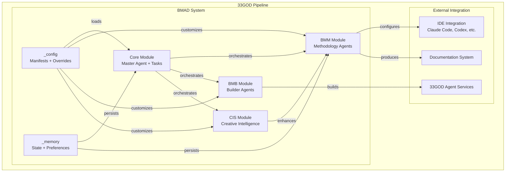
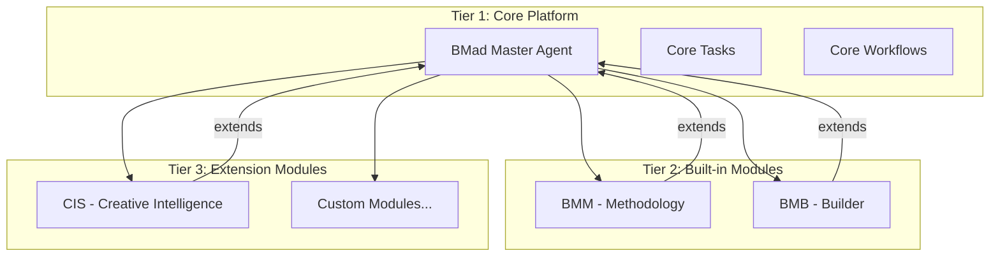

# BMAD - GOD Document

> **Guaranteed Organizational Document** - Developer-facing reference for BMAD
>
> **Last Updated**: 2026-02-02
> **Domain**: Development Tools
> **Status**: Production

---

## Product Overview

**BMAD (Business, Management, Architecture, Development)** is a comprehensive methodology configuration system that orchestrates AI-assisted software development through a structured, phase-based approach. BMAD provides a framework of specialized agents, guided workflows, and configuration management that ensures consistent, high-quality software delivery across projects of any complexity.

Unlike traditional development methodologies that rely on human interpretation, BMAD encodes methodology rules directly into AI agent personas and workflows. This enables AI coding assistants to follow established practices automatically, maintain project context across sessions, and produce artifacts that align with organizational standards.

**Key Capabilities:**

- **Phase-Based Development**: Enforces structured progression through Business, Management, Architecture, and Development phases
- **Agent Personas**: 20+ specialized AI agents with distinct roles, communication styles, and principles
- **Workflow Orchestration**: 40+ guided workflows for everything from brainstorming to code review
- **Configuration Management**: Project-level settings with agent override capabilities
- **Multi-IDE Support**: Works with Claude Code, Codex, Auggie, Gemini, GitHub Copilot, and more
- **Module System**: Extensible architecture supporting core, BMM (methodology), BMB (builder), and CIS (creative intelligence) modules

---

## Architecture Position



**Role in Pipeline**: BMAD sits at the methodology layer, providing configuration and behavioral enforcement for all AI-assisted development activities in the 33GOD ecosystem. It does not emit or consume Bloodbank events but instead provides static configuration that other components read to understand project context and agent behavior.

---

## Event Contracts

### Bloodbank Events Emitted

_BMAD does not emit Bloodbank events. It is a static configuration system._

BMAD operates as a configuration provider rather than an active service. Other components read BMAD configuration files directly to determine:
- Project methodology settings
- Agent persona definitions
- Workflow orchestration rules
- Output folder locations

### Bloodbank Events Consumed

_BMAD does not consume Bloodbank events._

Future integration considerations:
- `workflow.step.completed` - Could trigger automatic phase transitions
- `agent.session.started` - Could load agent-specific configuration
- `sprint.completed` - Could trigger retrospective workflows

---

## Non-Event Interfaces

### YAML Configuration Interface

BMAD's primary interface is through YAML configuration files that define project settings, module configurations, and agent customizations.

**Configuration Hierarchy:**

```
_bmad/
├── _config/
│   ├── manifest.yaml              # Installation metadata
│   ├── agent-manifest.csv         # Agent registry
│   ├── workflow-manifest.csv      # Workflow registry
│   ├── task-manifest.csv          # Task registry
│   ├── bmad-help.csv              # Help system data
│   ├── files-manifest.csv         # File integrity hashes
│   └── agents/                    # Agent customization files
│       └── *.customize.yaml       # Per-agent overrides
├── _memory/
│   ├── config.yaml                # User preferences
│   └── {agent}-sidecar/           # Agent-specific memory
├── core/
│   └── config.yaml                # Core module config
├── bmm/
│   └── config.yaml                # BMM module config
├── bmb/
│   └── config.yaml                # BMB module config
└── cis/
    └── config.yaml                # CIS module config (if exists)
```

**Project Configuration** (`bmm/config.yaml`):
```yaml
project_name: "33GOD"
user_skill_level: intermediate
planning_artifacts: "{project-root}/_bmad-output/planning-artifacts"
implementation_artifacts: "{project-root}/_bmad-output/implementation-artifacts"
project_knowledge: "{project-root}/docs"
user_name: Jarad
communication_language: English
document_output_language: English
output_folder: "{project-root}/_bmad-output"
```

### Agent Override Interface

Agent behavior can be customized per-project through override files in `_config/agents/`:

```yaml
# _config/agents/bmm-architect.customize.yaml

# Override agent name
agent:
  metadata:
    name: ""  # Empty = use default

# Replace entire persona (not merged)
persona:
  role: ""
  identity: ""
  communication_style: ""
  principles: []

# Add custom critical actions (appended after standard config loading)
critical_actions: []

# Add persistent memories for the agent
memories: []

# Add custom menu items (appended to base menu)
menu: []

# Add custom prompts (for action="#id" handlers)
prompts: []
```

### CLI Slash Commands

BMAD workflows are invoked via slash commands in supported IDEs:

**Core Commands:**
| Command | Description | Module |
|---------|-------------|--------|
| `/bmad-help` | Get contextual help and workflow recommendations | core |
| `/bmad-brainstorming` | Facilitate interactive brainstorming sessions | core |
| `/bmad-party-mode` | Multi-agent group discussions | core |

**BMM Methodology Commands:**
| Command | Description | Phase |
|---------|-------------|-------|
| `/bmad-bmm-create-brief` | Create product brief through guided discovery | 1-Analysis |
| `/bmad-bmm-research` | Conduct market, domain, or technical research | 1-Analysis |
| `/bmad-bmm-prd` | Create/validate Product Requirements Document | 2-Planning |
| `/bmad-bmm-create-ux-design` | Design UX patterns with expert guidance | 2-Planning |
| `/bmad-bmm-create-architecture` | Document architectural decisions | 3-Solutioning |
| `/bmad-bmm-create-epics-and-stories` | Break requirements into implementable stories | 3-Solutioning |
| `/bmad-bmm-check-implementation-readiness` | Validate PRD/Architecture/Stories alignment | 3-Solutioning |
| `/bmad-bmm-sprint-planning` | Generate sprint plan for implementation | 4-Implementation |
| `/bmad-bmm-create-story` | Prepare next story for development | 4-Implementation |
| `/bmad-bmm-dev-story` | Execute story implementation | 4-Implementation |
| `/bmad-bmm-code-review` | Adversarial senior developer code review | 4-Implementation |
| `/bmad-bmm-quick-spec` | Quick tech spec for simple features | Anytime |
| `/bmad-bmm-quick-dev` | Quick development without extensive planning | Anytime |
| `/bmad-bmm-document-project` | Analyze and document existing projects | Anytime |

**BMB Builder Commands:**
| Command | Description |
|---------|-------------|
| `/bmad-bmb-agent` | Create, edit, or validate BMAD agents |
| `/bmad-bmb-module` | Create, edit, or validate BMAD modules |
| `/bmad-bmb-workflow` | Create, edit, or validate BMAD workflows |

**CIS Creative Intelligence Commands:**
| Command | Description |
|---------|-------------|
| `/bmad-cis-innovation-strategy` | Identify disruption opportunities |
| `/bmad-cis-problem-solving` | Systematic problem-solving methodologies |
| `/bmad-cis-design-thinking` | Human-centered design processes |
| `/bmad-cis-storytelling` | Craft compelling narratives |

---

## Technical Deep-Dive

### Technology Stack

- **Configuration Format**: YAML (primary), CSV (manifests), Markdown (agents, workflows)
- **Agent Definition**: XML embedded in Markdown with structured persona and activation sections
- **Template Engine**: Handlebars-style placeholders (`{variable}`)
- **Schema Validation**: Module-level YAML schemas
- **IDE Integration**: Claude Code, Codex, Auggie, Gemini, GitHub Copilot, Antigravity, Kilo, OpenCode

### Architecture Pattern

BMAD follows a **modular plugin architecture** with three tiers:



**Module Structure:**
```
{module}/
├── config.yaml           # Module configuration
├── agents/               # Agent definitions
│   └── {agent}.md        # Agent persona + activation
├── workflows/            # Guided workflows
│   └── {workflow}/
│       ├── workflow.md   # Workflow definition (or .yaml)
│       ├── steps/        # Step-by-step instructions
│       └── data/         # Supporting data files
├── tasks/                # Standalone tasks
├── data/                 # Shared data resources
└── templates/            # Output templates
```

### Agent Architecture

Agents are defined using an XML schema embedded in Markdown files:

```xml
<agent id="analyst.agent.yaml" name="Mary" title="Business Analyst" icon="📊">
  <activation critical="MANDATORY">
    <step n="1">Load persona from this current agent file</step>
    <step n="2">🚨 IMMEDIATE ACTION REQUIRED - BEFORE ANY OUTPUT:
        - Load and read {project-root}/_bmad/bmm/config.yaml NOW
        - Store ALL fields as session variables
    </step>
    <step n="3">Remember: user's name is {user_name}</step>
    <step n="4">Show greeting, then display numbered list of ALL menu items</step>
    <step n="5">STOP and WAIT for user input</step>
    <step n="6">On user input: Number → process menu item[n] | Text → fuzzy match</step>
    <step n="7">When processing a menu item: Check menu-handlers section</step>

    <menu-handlers>
      <handler type="exec">
        When menu item has: exec="path/to/file.md":
        1. Read fully and follow the file at that path
        2. Process the complete file and follow all instructions
      </handler>
      <handler type="workflow">
        When menu item has: workflow="path/to/workflow.yaml":
        1. CRITICAL: Always LOAD {project-root}/_bmad/core/tasks/workflow.xml
        2. Pass the yaml path as 'workflow-config' parameter
      </handler>
    </menu-handlers>
  </activation>

  <persona>
    <role>Strategic Business Analyst + Requirements Expert</role>
    <identity>Senior analyst with deep expertise in market research...</identity>
    <communication_style>Speaks with the excitement of a treasure hunter...</communication_style>
    <principles>- Channel expert business analysis frameworks...</principles>
  </persona>

  <menu>
    <item cmd="CB">[CB] Create Brief: A guided experience</item>
    <item cmd="RS">[RS] Research: Market, domain, or technical</item>
    <!-- ... more menu items ... -->
  </menu>
</agent>
```

**Agent Types:**

| Type | Description | Example Agents |
|------|-------------|----------------|
| Simple | Single-purpose, minimal menu | Editorial Review, Index Docs |
| Expert | Full persona with rich menu | Analyst, Architect, PM |
| Module | Specialized for a module | Agent Builder, Module Builder |

### Workflow Architecture

Workflows guide users through multi-step processes:

**Workflow Definition** (`workflow.md` or `workflow.yaml`):
```markdown
---
id: create-architecture
title: Create Architecture
agent: architect
description: Guided workflow to document technical decisions
mode: create | validate | edit
---

## Steps

1. step-01-discovery.md - Gather context
2. step-02-requirements.md - Extract requirements
3. step-03-design.md - Make architectural decisions
4. step-04-review.md - Validate decisions
5. step-05-document.md - Produce architecture doc
```

**Step Files** contain detailed instructions for each workflow phase:
```markdown
# Step 01: Discovery

## Objective
Understand the current system state and requirements.

## Instructions
1. Load `{project-root}/_bmad-output/planning-artifacts/prd.md`
2. Extract key requirements
3. Identify technical constraints
4. Present findings to user for confirmation

## Next Step
→ step-02-requirements.md
```

### Module System

**Core Module** (built-in):
- BMad Master agent - orchestrates all other agents
- Core tasks (help, editorial review, document sharding)
- Core workflows (brainstorming, party mode)
- Excalidraw diagram helpers

**BMM Module** (built-in):
- Methodology agents (Analyst, Architect, PM, Dev, SM, TEA, Tech Writer, UX Designer, Quick Flow Solo Dev)
- Phase 1: Analysis workflows (research, create brief)
- Phase 2: Planning workflows (PRD, UX design)
- Phase 3: Solutioning workflows (architecture, epics & stories, implementation readiness)
- Phase 4: Implementation workflows (sprint planning, story creation, development, code review, retrospective)
- Anytime workflows (quick spec, quick dev, document project, Excalidraw diagrams)

**BMB Module** (external - `bmad-builder`):
- Agent Builder - create, edit, validate BMAD agents
- Module Builder - create, edit, validate BMAD modules
- Workflow Builder - create, edit, validate BMAD workflows

**CIS Module** (external - `bmad-creative-intelligence-suite`):
- Brainstorming Coach - ideation facilitation
- Creative Problem Solver - systematic problem solving
- Design Thinking Coach - human-centered design
- Innovation Strategist - business model innovation
- Presentation Master - visual communication
- Storyteller - narrative crafting

### Data Models

**Installation Manifest** (`_config/manifest.yaml`):
```yaml
installation:
  version: 6.0.0-Beta.2
  installDate: 2026-02-01T22:52:49.673Z
  lastUpdated: 2026-02-01T22:52:49.673Z
modules:
  - name: core
    version: 6.0.0-Beta.2
    source: built-in
  - name: bmm
    version: 6.0.0-Beta.2
    source: built-in
  - name: bmb
    version: 0.1.4
    source: external
    npmPackage: bmad-builder
    repoUrl: https://github.com/bmad-code-org/bmad-builder
  - name: cis
    version: 0.1.4
    source: external
    npmPackage: bmad-creative-intelligence-suite
    repoUrl: https://github.com/bmad-code-org/bmad-module-creative-intelligence-suite
ides:
  - claude-code
  - codex
  - auggie
  - gemini
  - github-copilot
  # ... more IDEs
```

**Agent Manifest** (`_config/agent-manifest.csv`):
```csv
name,displayName,title,icon,role,identity,communicationStyle,principles,module,path
"analyst","Mary","Business Analyst","📊","Strategic Business Analyst","Senior analyst...","Speaks with excitement...","- Channel expert frameworks...","bmm","_bmad/bmm/agents/analyst.md"
```

**Workflow Manifest** (`_config/workflow-manifest.csv`):
```csv
name,description,module,path
"create-prd","PRD tri-modal workflow - Create, Validate, or Edit","bmm","_bmad/bmm/workflows/2-plan-workflows/create-prd/workflow.md"
```

### Configuration Variables

BMAD uses a variable substitution system for dynamic configuration:

| Variable | Description | Example Value |
|----------|-------------|---------------|
| `{project-root}` | Absolute path to project root | `/home/user/33GOD` |
| `{user_name}` | User's name from config | `Jarad` |
| `{communication_language}` | Communication language | `English` |
| `{document_output_language}` | Output document language | `English` |
| `{output_folder}` | Output folder path | `{project-root}/_bmad-output` |
| `{planning_artifacts}` | Planning outputs | `{project-root}/_bmad-output/planning-artifacts` |
| `{implementation_artifacts}` | Implementation outputs | `{project-root}/_bmad-output/implementation-artifacts` |

---

## BMAD Methodology Phases

### Phase 1: Analysis

**Focus**: Problem definition, market research, user needs discovery

**Agents**: Mary (Business Analyst)

**Workflows**:
- **Brainstorm Project**: Expert-facilitated ideation using multiple techniques
- **Market Research**: Competitive landscape, customer needs, trends
- **Domain Research**: Industry deep-dive, terminology, best practices
- **Technical Research**: Feasibility, architecture options, implementation approaches
- **Create Brief**: Guided product brief creation

**Artifacts Produced**:
- Product brief
- Research documents
- Brainstorming session reports

### Phase 2: Planning

**Focus**: Requirements formalization, UX design, stakeholder alignment

**Agents**: John (Product Manager), Sally (UX Designer)

**Workflows**:
- **Create PRD**: Product Requirements Document creation
- **Validate PRD**: PRD completeness check
- **Create UX Design**: UX patterns and look/feel planning
- **Validate UX**: UX design validation

**Artifacts Produced**:
- Product Requirements Document (PRD)
- UX Design Document
- User journey maps
- Wireframes (via Excalidraw workflows)

### Phase 3: Solutioning

**Focus**: System design, technical specification, story breakdown

**Agents**: Winston (Architect), John (Product Manager), Murat (Test Architect)

**Workflows**:
- **Create Architecture**: Technical decision documentation
- **Validate Architecture**: Architecture completeness check
- **Create Epics and Stories**: Requirements breakdown
- **Validate Epics and Stories**: Story completeness check
- **Test Design**: System-level testability review
- **Check Implementation Readiness**: PRD/Architecture/Stories alignment

**Artifacts Produced**:
- Architecture Document
- Epics and Stories listing
- Test design document
- Implementation readiness report

### Phase 4: Implementation

**Focus**: Sprint execution, coding, testing, review

**Agents**: Bob (Scrum Master), Amelia (Developer), Murat (Test Architect)

**Workflows**:
- **Sprint Planning**: Generate sprint plan
- **Sprint Status**: Summarize progress, route to next workflow
- **Create Story**: Prepare story for development
- **Validate Story**: Check story readiness
- **Dev Story**: Execute story implementation
- **Code Review**: Adversarial review finding 3-10 issues
- **Retrospective**: Post-epic review

**Artifacts Produced**:
- Sprint status file (`sprint-status.yaml`)
- Individual story files
- Implemented code
- Test suites
- Code review reports
- Retrospective documents

### Anytime Workflows

**Available at any phase**:

- **Quick Spec** (Barry): Rapid tech spec for simple features
- **Quick Dev** (Barry): Direct implementation without planning
- **Correct Course** (Bob): Navigate significant changes mid-sprint
- **Document Project** (Mary): Analyze existing codebase
- **Excalidraw Diagrams** (Sally): Dataflow, architecture, flowchart, wireframe

---

## Agent Registry

### Core Module Agents

| Agent | Name | Role | Icon |
|-------|------|------|------|
| bmad-master | BMad Master | Master Task Executor + Workflow Orchestrator | 🧙 |

### BMM Module Agents

| Agent | Name | Role | Icon |
|-------|------|------|------|
| analyst | Mary | Strategic Business Analyst | 📊 |
| pm | John | Product Manager | 📋 |
| architect | Winston | System Architect | 🏗️ |
| dev | Amelia | Senior Software Engineer | 💻 |
| sm | Bob | Technical Scrum Master | 🏃 |
| tea | Murat | Master Test Architect | 🧪 |
| tech-writer | Paige | Technical Documentation Specialist | 📚 |
| ux-designer | Sally | User Experience Designer | 🎨 |
| quick-flow-solo-dev | Barry | Elite Full-Stack Developer | 🚀 |

### BMB Module Agents

| Agent | Name | Role | Icon |
|-------|------|------|------|
| agent-builder | Bond | Agent Architecture Specialist | 🤖 |
| module-builder | Morgan | Module Architecture Specialist | 🏗️ |
| workflow-builder | Wendy | Workflow Architecture Specialist | 🔄 |

### CIS Module Agents

| Agent | Name | Role | Icon |
|-------|------|------|------|
| brainstorming-coach | Carson | Elite Brainstorming Specialist | 🧠 |
| creative-problem-solver | Dr. Quinn | Master Problem Solver | 🔬 |
| design-thinking-coach | Maya | Design Thinking Maestro | 🎨 |
| innovation-strategist | Victor | Disruptive Innovation Oracle | ⚡ |
| presentation-master | Caravaggio | Visual Communication Expert | 🎨 |
| storyteller | Sophia | Master Storyteller | 📖 |

---

## Development

### Adding a New Agent

1. **Create agent file** in appropriate module:
   ```bash
   cp _bmad/bmm/agents/dev.md _bmad/bmm/agents/new-agent.md
   ```

2. **Define persona and activation** using XML schema:
   ```xml
   <agent id="new-agent.agent.yaml" name="AgentName" title="Agent Title" icon="🆕">
     <activation critical="MANDATORY">
       <!-- activation steps -->
     </activation>
     <persona>
       <!-- persona definition -->
     </persona>
     <menu>
       <!-- menu items -->
     </menu>
   </agent>
   ```

3. **Register in manifest**:
   Add entry to `_config/agent-manifest.csv`

4. **Create customization template**:
   ```bash
   cp _bmad/_config/agents/bmm-dev.customize.yaml _bmad/_config/agents/{module}-{agent}.customize.yaml
   ```

### Adding a New Workflow

1. **Create workflow directory**:
   ```bash
   mkdir -p _bmad/bmm/workflows/{phase}/{workflow-name}
   ```

2. **Create workflow definition** (`workflow.md` or `workflow.yaml`):
   ```markdown
   ---
   id: workflow-id
   title: Workflow Title
   agent: primary-agent
   description: What this workflow does
   ---
   ```

3. **Create step files** in `steps/` subdirectory

4. **Register in manifest**:
   Add entry to `_config/workflow-manifest.csv`

### Creating Agent Customizations

1. **Edit customization file**:
   ```bash
   vim _bmad/_config/agents/bmm-{agent}.customize.yaml
   ```

2. **Add custom memories**:
   ```yaml
   memories:
     - "User prefers detailed technical explanations"
     - "Current project uses React and TypeScript"
   ```

3. **Add custom menu items**:
   ```yaml
   menu:
     - trigger: my-workflow
       workflow: "{project-root}/custom/my.yaml"
       description: My custom workflow
   ```

### Running Tests

BMAD modules can include validation workflows:

```bash
# Validate an agent
/bmad-bmb-agent  # Select "Validate Mode"

# Validate a workflow
/bmad-bmb-workflow  # Select "Validate Mode"

# Validate a module
/bmad-bmb-module  # Select "Validate Mode"
```

---

## Deployment

BMAD is deployed as a **static configuration system** that lives in the repository alongside project code. There is no separate deployment process - BMAD configuration is committed to version control and loaded by IDEs at runtime.

**Deployment Considerations:**

1. **Repository Structure**: BMAD lives in `_bmad/` directory at project root
2. **IDE Configuration**: IDE-specific settings in `_config/ides/`
3. **Output Isolation**: All generated artifacts go to `_bmad-output/` (gitignored)
4. **Version Locking**: `manifest.yaml` tracks module versions

**Installation**:
BMAD is installed via the BMAD installer which:
1. Creates `_bmad/` directory structure
2. Installs core and built-in modules
3. Optionally installs external modules (BMB, CIS)
4. Configures IDE integration
5. Creates initial configuration files

**Upgrade Process**:
1. Run BMAD installer with `--upgrade` flag
2. Installer updates module versions in `manifest.yaml`
3. New agent/workflow definitions are merged
4. Custom overrides are preserved

---

## Troubleshooting

### Common Issues

| Issue | Cause | Solution |
|-------|-------|----------|
| Agent not loading config | Missing config.yaml | Ensure `_bmad/{module}/config.yaml` exists |
| Workflow step not found | Wrong path in workflow.md | Check step file paths relative to workflow directory |
| Menu item not working | Invalid handler type | Verify handler type matches (exec, workflow, action) |
| Custom override not applied | YAML syntax error | Validate YAML with online validator |
| Output folder not created | Missing permission | Check write permissions on project root |

### Debug Mode

Enable verbose output by adding to agent activation:
```xml
<step n="debug">Output all loaded configuration values</step>
```

### Verifying Installation

```bash
# Check manifest
cat _bmad/_config/manifest.yaml

# Verify module structure
ls -la _bmad/bmm/
ls -la _bmad/bmb/
ls -la _bmad/cis/

# Check agent registry
head _bmad/_config/agent-manifest.csv

# Verify config loading
cat _bmad/bmm/config.yaml
```

---

## References

- **Domain Doc**: `docs/domains/development-tools/GOD.md`
- **System Doc**: `docs/GOD.md`
- **Source**: `_bmad/`
- **BMAD Core Repository**: https://github.com/bmad-code-org/bmad-core
- **BMB Builder Module**: https://github.com/bmad-code-org/bmad-builder
- **CIS Creative Intelligence Suite**: https://github.com/bmad-code-org/bmad-module-creative-intelligence-suite

---

## Appendices

### Appendix A: Complete Workflow Reference

#### Phase 1: Analysis Workflows

| Code | Name | Agent | Description |
|------|------|-------|-------------|
| BP | Brainstorm Project | Mary | Expert-guided ideation |
| MR | Market Research | Mary | Market analysis, competitive landscape |
| DR | Domain Research | Mary | Industry deep-dive |
| TR | Technical Research | Mary | Technical feasibility |
| CB | Create Brief | Mary | Guided product brief creation |
| VB | Validate Brief | Mary | Brief completeness validation |

#### Phase 2: Planning Workflows

| Code | Name | Agent | Description |
|------|------|-------|-------------|
| CP | Create PRD | John | PRD creation |
| VP | Validate PRD | John | PRD validation |
| CU | Create UX | Sally | UX design planning |
| VU | Validate UX | Sally | UX validation |

#### Phase 3: Solutioning Workflows

| Code | Name | Agent | Description |
|------|------|-------|-------------|
| CA | Create Architecture | Winston | Architecture documentation |
| VA | Validate Architecture | Winston | Architecture validation |
| CE | Create Epics and Stories | John | Requirements breakdown |
| VE | Validate Epics and Stories | John | Stories validation |
| TD | Test Design | Murat | System-level test design |
| IR | Implementation Readiness | Winston | Alignment validation |

#### Phase 4: Implementation Workflows

| Code | Name | Agent | Description |
|------|------|-------|-------------|
| SP | Sprint Planning | Bob | Sprint plan generation |
| SS | Sprint Status | Bob | Status summary and routing |
| CS | Create Story | Bob | Story preparation |
| VS | Validate Story | Bob | Story validation |
| DS | Dev Story | Amelia | Story implementation |
| CR | Code Review | Amelia | Adversarial code review |
| ER | Retrospective | Bob | Post-epic review |

#### Anytime Workflows

| Code | Name | Agent | Description |
|------|------|-------|-------------|
| TS | Quick Spec | Barry | Rapid tech spec |
| QD | Quick Dev | Barry | Direct implementation |
| CC | Correct Course | Bob | Navigate changes |
| DP | Document Project | Mary | Codebase analysis |
| CDF | Create Dataflow | Sally | Excalidraw DFD |
| CED | Create Diagram | Sally | Excalidraw architecture |
| CFC | Create Flowchart | Sally | Excalidraw flowchart |
| CEW | Create Wireframe | Sally | Excalidraw wireframe |

### Appendix B: IDE Configuration

BMAD supports multiple IDEs through configuration files in `_config/ides/`:

| IDE | Config File | Install Location |
|-----|-------------|------------------|
| Claude Code | claude-code.yaml | project |
| Codex | codex.yaml | project |
| Auggie | auggie.yaml | project |
| Gemini | gemini.yaml | project |
| GitHub Copilot | github-copilot.yaml | project |
| Antigravity | antigravity.yaml | project |
| Kilo | kilo.yaml | project |
| OpenCode | opencode.yaml | project |
| Crush | crush.yaml | project |

### Appendix C: Variable Reference

| Variable | Scope | Description |
|----------|-------|-------------|
| `{project-root}` | Global | Absolute path to project root |
| `{user_name}` | Session | User's configured name |
| `{communication_language}` | Session | Language for communication |
| `{document_output_language}` | Session | Language for output documents |
| `{output_folder}` | Module | Output folder path |
| `{planning_artifacts}` | BMM | Planning phase output |
| `{implementation_artifacts}` | BMM | Implementation phase output |
| `{project_knowledge}` | BMM | Project documentation folder |
| `{bmb_creations_output_folder}` | BMB | Builder creations output |
| `{data}` | Workflow | Data passed to handler |

### Appendix D: File Integrity

BMAD maintains file integrity through SHA-256 hashes in `_config/files-manifest.csv`. This enables:
- Detection of manual file modifications
- Verification during upgrades
- Module validation checks

Example entry:
```csv
type,name,module,path,hash
"yaml","config","bmm","bmm/config.yaml","c2099eae065536423c699e66cbfe78464cf53b8fc9347a4829aa075e62fc6ebc"
```
