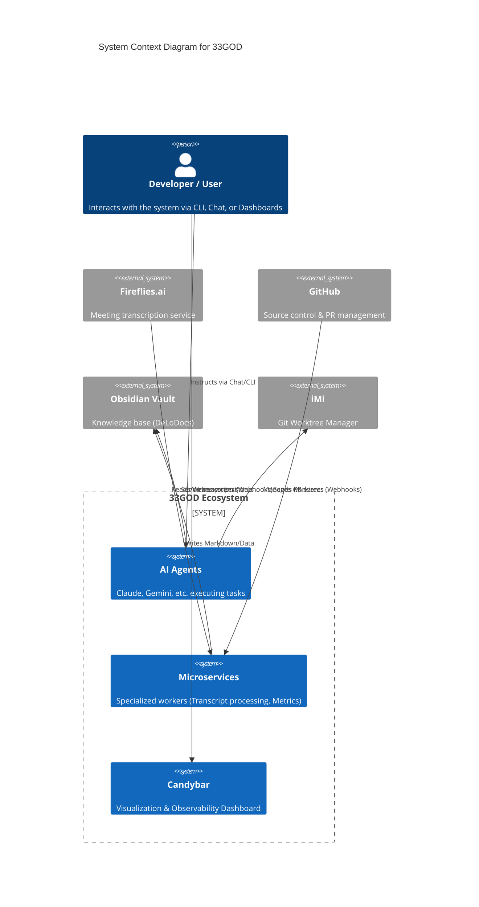
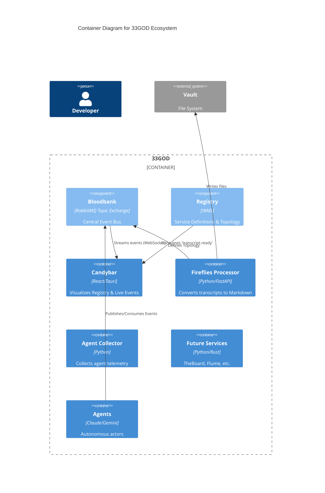

# 33GOD Architecture

**33GOD** is an event-driven, agentic ecosystem designed to orchestrate software development, knowledge management, and automated workflows. It leverages a central event bus (**Bloodbank**) to decouple components, allowing autonomous agents and microservices to collaborate asynchronously.

## Core Principles

1.  **Everything is an Event**: All significant state changes (Git commits, PRs, transcripts ready, agent thoughts) are emitted as events.
2.  **Registry as Truth**: `services/registry.yaml` is the single source of truth for service discovery, topology, and event routing.
3.  **Modular & Autonomous**: Services are small, focused, and independently deployable. They react to events rather than being called directly.
4.  **Agent-Centric**: The system is designed to support AI agents (Claude, Gemini) as first-class citizens that consume and emit events.

## System Context (C4 Level 1)

The following diagram illustrates the high-level interactions between the User, the 33GOD Ecosystem, and external systems.

## Container Diagram (C4 Level 2)

This diagram zooms into the **33GOD Ecosystem** to show the logical containers and their communication via **Bloodbank**.

## The Registry

The **Registry** (`services/registry.yaml`) is the heartbeat of the architecture. It defines:

*   **Services**: Name, description, type, and owner.
*   **Queues & Routing**: Which events a service listens to.
*   **Topology**: How services are layered and connected.

**Candybar** reads this registry to generate a dynamic network graph, allowing developers to see the system's architecture in real-time.

## Key Components

### Bloodbank (Event Bus)
*   **Technology**: RabbitMQ + Pydantic Models
*   **Role**: Guarantees delivery, handles routing patterns (Topic Exchange), and enforces schema validation for payloads.

### iMi (Worktree Manager)
*   **Role**: Manages Git worktrees for parallel development.
*   **Integration**: Emits events when worktrees are created/deleted, allowing agents to switch contexts automatically.

### TheBoard (Meeting Sync)
*   **Role**: Manages meeting lifecycles and "The Board" context.
*   **Integration**: Emits `meeting.started`, `meeting.converged` events to trigger recording or note-taking services.

### Flume (Orchestration)
*   **Role**: Handles complex, multi-step workflows (often via n8n).
*   **Integration**: Listens for high-level triggers (e.g., `feature.requested`) and orchestrates the sequence of agent tasks.
