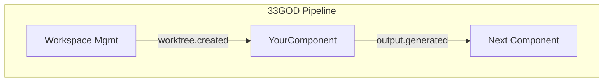

# GOD Document System Guide

> **Guaranteed Organizational Documents** - Long-lived, template-based, developer-facing architecture references

---

## What Are GOD Documents?

GOD Documents are **developer-facing architectural references** that:

1. **Always Exist**: Guaranteed to be present at system, domain, and component levels
2. **Template-Based**: Follow consistent structure defined in `docs/templates/`
3. **Frequently Updated**: Maintained in parity with implementation changes
4. **Multi-Level**: Provide drill-down from system → domain → component detail

**Distinction from READMEs:**
- READMEs are **user-facing** (getting started, usage)
- GOD docs are **developer-facing** (architecture, events, integration)

---

## Document Hierarchy

```
33GOD/
├── docs/
│   ├── GOD.md                              # System-level GOD doc
│   ├── domains/
│   │   ├── infrastructure/
│   │   │   └── GOD.md                      # Domain-level GOD doc
│   │   ├── agent-orchestration/
│   │   │   └── GOD.md
│   │   ├── workspace-management/
│   │   │   └── GOD.md
│   │   ├── meeting-collaboration/
│   │   │   └── GOD.md
│   │   ├── dashboards-voice/
│   │   │   └── GOD.md
│   │   └── development-tools/
│   │       └── GOD.md
│   └── templates/
│       ├── COMPONENT-GOD-TEMPLATE.md       # Template for component docs
│       └── DOMAIN-GOD-TEMPLATE.md          # Template for domain docs
├── bloodbank/
│   └── GOD.md                              # Component-level GOD doc
├── iMi/
│   └── GOD.md
└── ... (other components)
```

---

## GOD Document Structure

### System-Level (docs/GOD.md)

**Purpose**: High-level system architecture and cross-domain coordination

**Sections:**
- System Overview & Principles
- System Topology (Mermaid diagram)
- Domain Reference Table
- Component Registry
- System-Wide Event Contracts
- Cross-Domain Dependencies
- Infrastructure Requirements

### Domain-Level (docs/domains/{domain}/GOD.md)

**Purpose**: Domain-specific architecture and inter-component contracts

**Sections:**
- Domain Overview & Responsibilities
- Component Map (Mermaid diagram)
- Component Summaries (with links to component GOD docs)
- Domain Event Contracts (internal + external)
- Shared Infrastructure
- Development Guidelines

### Component-Level ({component}/GOD.md)

**Purpose**: Deep technical reference for individual components

**Sections:**
- Product Overview (non-technical)
- Architecture Position (pipeline diagram)
- Event Contracts (emitted + consumed)
- Non-Event Interfaces (CLI/API)
- Technical Deep-Dive
- Development & Deployment

---

## GOD Document Sections Explained

### Component-Level Diagram

Shows how the component fits into the overall pipeline:



### Bloodbank Events Emitted

Documents all events published by this component:

| Event Name | Routing Key | Payload Schema | Trigger Condition |
|------------|-------------|----------------|-------------------|
| `component.action.completed` | `component.action.completed` | `ActionPayload` | When action finishes |

### Bloodbank Events Consumed

Documents all events subscribed to by this component:

| Event Name | Routing Key | Handler | Purpose |
|------------|-------------|---------|---------|
| `upstream.event.triggered` | `upstream.event.#` | `handle_upstream_event()` | Process upstream event |

### Non-Event Interfaces

Documents CLI and API interfaces:

**CLI:**
```bash
component-cli start --config <path>
component-cli status
```

**API:**
```
GET  /health
POST /actions
GET  /results/{id}
```

---

## Update Workflow

### Manual Update

```bash
# From 33GOD root
/bmad-bmm-document-project

# Or update specific component GOD doc
# (Edit component/GOD.md directly)
```

### Git Hook (Automatic Prompt)

Git hooks in `.githooks/pre-commit` detect component changes and prompt:

```
[GOD Hook] Components changed:
  - bloodbank
  - holyfields

Would you like to:
  [1] Update GOD docs now (recommended)
  [2] Skip for now (commit with manual update required)
  [3] Abort commit

Choice [1/2/3]:
```

**To enable git hooks:**
```bash
git config core.hooksPath .githooks
```

---

## Creating a New Component GOD Doc

### Step 1: Copy Template

```bash
cp docs/templates/COMPONENT-GOD-TEMPLATE.md {component}/GOD.md
```

### Step 2: Fill Placeholders

Replace all `{{VARIABLE}}` placeholders:

- `{{COMPONENT_NAME}}`: Component name (e.g., "Bloodbank")
- `{{DATE}}`: Current date (YYYY-MM-DD)
- `{{DOMAIN}}`: Domain name (e.g., "Infrastructure")
- `{{STATUS}}`: Development status (Planning/Development/Production)
- `{{NON_TECHNICAL_OVERVIEW}}`: Product description
- `{{PIPELINE_ROLE}}`: How it fits in pipeline
- `{{EMITTED_EVENTS}}`: List of events emitted
- `{{CONSUMED_EVENTS}}`: List of events consumed
- `{{CLI_EXAMPLES}}`: CLI usage examples
- `{{API_ENDPOINTS_TABLE}}`: API reference
- `{{LANGUAGE}}`: Primary language (Python/TypeScript/Rust)
- `{{FRAMEWORK}}`: Framework used (FastAPI/React/etc)
- `{{IMPLEMENTATION_NOTES}}`: Technical details

### Step 3: Generate Diagrams

Use Mermaid for:
- Architecture Position diagram
- Component data flow
- State machines

### Step 4: Link from Domain GOD Doc

Update `docs/domains/{domain}/GOD.md` to include component:

```markdown
### YourComponent

**Purpose**: Brief description
**Status**: Development

[📄 Component GOD Doc](../../your-component/GOD.md)
```

### Step 5: Link from System GOD Doc

Update `docs/GOD.md` component registry:

```markdown
| YourComponent | Domain | Type | Status | GOD Doc |
|---------------|--------|------|--------|---------|
| YourComponent | Infrastructure | Service | Development | [GOD.md](your-component/GOD.md) |
```

---

## GOD Document Naming Convention

**Always** use `GOD.md` (all caps):

✅ Correct:
- `docs/GOD.md`
- `docs/domains/infrastructure/GOD.md`
- `bloodbank/GOD.md`

❌ Incorrect:
- `docs/god.md`
- `docs/domains/infrastructure/GOD-DOC.md`
- `bloodbank/ARCHITECTURE.md`

---

## Event Contract Documentation

### Event Naming Pattern

```
{domain}.{entity}.{action}
```

Examples:
- `bloodbank.message.published`
- `imi.worktree.claimed`
- `theboard.meeting.converged`

### Payload Schema Reference

Reference Holyfields schemas:

```markdown
**Schema**: `holyfields/schemas/bloodbank/message_published.json`

```json
{
  "message_id": "uuid",
  "routing_key": "string",
  "payload": "object"
}
```
```

---

## Maintenance Best Practices

### When to Update GOD Docs

**Immediate Update Required:**
- Adding/removing Bloodbank events
- Changing CLI/API interfaces
- Major architectural changes
- Adding/removing component dependencies

**Update Within Sprint:**
- Implementation detail changes
- Configuration changes
- Performance optimizations

**Update Quarterly:**
- General refreshes
- Diagram updates
- Example updates

### Review Checklist

Before merging changes that affect GOD docs:

- [ ] Component GOD doc updated
- [ ] Domain GOD doc links updated
- [ ] System GOD doc component registry updated
- [ ] Event contracts documented in Holyfields
- [ ] Mermaid diagrams reflect current architecture
- [ ] CLI/API examples tested and current

---

## Examples

See existing GOD documents:
- **System**: `docs/GOD.md`
- **Domain**: `docs/domains/infrastructure/GOD.md`
- **Component**: `bloodbank/GOD.md` _(To be created)_

---

## Tools

### GOD Doc Generation

```bash
# Generate all GOD docs from current state
/bmad-bmm-document-project

# Validate GOD doc structure
# (Tool to be created)
```

### GOD Doc Linting

```bash
# Check for missing placeholders
grep -r "{{" docs/domains/*/GOD.md

# Validate Mermaid syntax
# (Tool to be created)
```

---

## References

- **Templates**: `docs/templates/`
- **Git Hooks**: `.githooks/pre-commit`
- **Holyfields Schemas**: `holyfields/schemas/`
- **BMM Workflow**: `/bmad-bmm-document-project`
