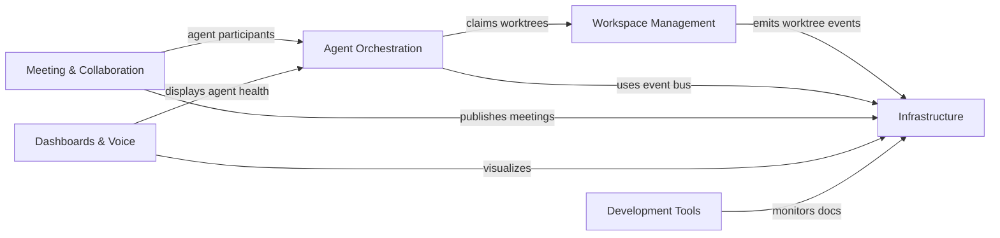

# 33GOD System - GOD Document

> **Guaranteed Organizational Document** - System-wide developer reference
>
> **Last Updated**: 2026-02-01
> **Architecture**: Event-Driven Microservices
> **Domains**: 6

---

## System Overview

**33GOD** is an event-driven agentic pipeline for orchestrating software development, knowledge management, and automated workflows. The system uses **Bloodbank** (RabbitMQ) as its central nervous system, enabling autonomous agents and microservices to collaborate asynchronously.

**Core Value Proposition:**
- Reduce cognitive load through event-driven automation
- Enable multi-agent collaboration with clear contracts
- Maintain composable, independently deployable components

---

## Architecture Principles

1. **Everything is an Event**: State changes emit events, not synchronous calls
2. **Registry as Truth**: `services/registry.yaml` defines service topology
3. **Modular & Autonomous**: Components are small, focused, independently deployable
4. **Agent-Centric**: AI agents are first-class citizens
5. **Observable by Default**: All events flow through Bloodbank for tracing

---

## System Topology

```mermaid
graph TB
    subgraph "Infrastructure Domain"
        BB[Bloodbank<br/>Event Bus]
        HF[Holyfields<br/>Schema Registry]
        CS[Candystore<br/>Event Persistence]
        CB[Candybar<br/>Service Registry UI]
    end

    subgraph "Agent Orchestration Domain"
        FL[Flume<br/>Agent Protocol]
        YI[Yi<br/>Agent Adapter]
        AF[AgentForge<br/>Team Builder]
        HC[Holocene<br/>Agent Repository]
    end

    subgraph "Workspace Management Domain"
        IM[iMi<br/>Worktree Manager]
        JM[Jelmore<br/>Session Manager]
        ZD[Zellij-Driver<br/>Terminal Context]
        PT[Perth<br/>Zellij Distribution]
    end

    subgraph "Meeting & Collaboration Domain"
        TB[TheBoard<br/>Brainstorming System]
        BR[TheBoard Room<br/>3D Visualization]
    end

    subgraph "Dashboards & Voice Domain"
        HC2[Holocene<br/>Mission Control]
        TT[HeyMa<br/>Voice Interface]
    end

    subgraph "Development Tools Domain"
        DG[Degenerate<br/>Doc Drift Detection]
        BM[BMAD<br/>Methodology Config]
    end

    %% Infrastructure connections
    BB -.->|registers with| CB
    HF -->|type defs| BB
    BB -->|persists| CS

    %% Agent connections
    FL -->|publishes/subscribes| BB
    YI -->|wraps| FL
    AF -->|builds teams via| FL
    HC -->|stores agents| BB

    %% Workspace connections
    IM -->|emits worktree events| BB
    JM -->|emits session events| BB
    ZD -->|terminal context| BB
    PT -->|multiplexer| ZD

    %% Meeting connections
    TB -->|meeting events| BB
    BR -->|visualizes| TB

    %% Dashboard connections
    HC2 -->|monitors| BB
    TT -->|voice commands| BB

    %% Dev Tools connections
    DG -->|drift alerts| BB
    BM -->|methodology| BB
```



---

## Domain Reference

| Domain | Purpose | Components | GOD Doc |
|--------|---------|------------|---------|
| **Infrastructure** | Event backbone, schemas, persistence | Bloodbank, Holyfields, Candystore, Candybar | [Infrastructure GOD](domains/infrastructure/GOD.md) |
| **Agent Orchestration** | Agent lifecycle, teams, protocols | Flume, Yi, AgentForge, Holocene | [Agent Orchestration GOD](domains/agent-orchestration/GOD.md) |
| **Workspace Management** | Git worktrees, sessions, terminals | iMi, Jelmore, Zellij-Driver, Perth | [Workspace Management GOD](domains/workspace-management/GOD.md) |
| **Meeting & Collaboration** | Brainstorming, convergence, visualization | TheBoard, TheBoard Room | [Meeting & Collaboration GOD](domains/meeting-collaboration/GOD.md) |
| **Dashboards & Voice** | UI, voice interface, monitoring | Holocene, HeyMa, Candybar | [Dashboards & Voice GOD](domains/dashboards-voice/GOD.md) |
| **Development Tools** | Doc sync, methodology, coding sessions | Jelmore, Degenerate, BMAD | [Development Tools GOD](domains/development-tools/GOD.md) |

---

## System-Wide Event Contracts

### Critical Event Flows

**Agent Task Execution:**
```
agent.task.created → agent.task.claimed → agent.task.progress → agent.task.completed
```

**Git Worktree Lifecycle:**
```
worktree.created → session.started → commit.created → worktree.released
```

**Meeting Flow:**
```
meeting.started → discussion.round → convergence.detected → meeting.ended
```

**Transcript Processing:**
```
transcript.ready → transcript.processed → notes.generated → vault.updated
```

### Event Schema Registry

All event schemas are defined in **Holyfields** and validated by Bloodbank.

**Schema Locations:**
- Python (Pydantic): `holyfields/python/models/`
- TypeScript (Zod): `holyfields/typescript/schemas/`
- JSON Schema: `holyfields/schemas/`

---

## Component Registry

### Active Components

| Component | Domain | Type | Status | GOD Doc |
|-----------|--------|------|--------|---------|
| Bloodbank | Infrastructure | Event Bus | Production | [bloodbank/GOD.md](bloodbank/GOD.md) |
| Holyfields | Infrastructure | Schema Registry | Production | [holyfields/GOD.md](holyfields/GOD.md) |
| Candystore | Infrastructure | Event Store | Development | _(To be created)_ |
| Candybar | Infrastructure | Dashboard | Development | [candybar/GOD.md](candybar/GOD.md) |
| Flume | Agent Orchestration | Protocol | Development | _(To be created)_ |
| Yi | Agent Orchestration | Adapter | Planning | _(To be created)_ |
| AgentForge | Agent Orchestration | Team Builder | Planning | _(To be created)_ |
| Holocene | Agent Orchestration | Agent Store | Development | [holocene/GOD.md](holocene/GOD.md) |
| iMi | Workspace Management | CLI | Production | [iMi/GOD.md](iMi/GOD.md) |
| Jelmore | Workspace Management | API/CLI | Development | [jelmore/GOD.md](jelmore/GOD.md) |
| Zellij-Driver | Workspace Management | CLI | Development | _(To be created)_ |
| Perth | Workspace Management | Distribution | Development | _(To be created)_ |
| TheBoard | Meeting & Collaboration | Orchestrator | Planning | _(To be created)_ |
| TheBoard Room | Meeting & Collaboration | UI | Planning | [theboardroom/GOD.md](theboardroom/GOD.md) |
| HeyMa | Dashboards & Voice | Voice UI | Development | [HeyMa/GOD.md](HeyMa/GOD.md) |
| Degenerate | Development Tools | Doc Sync | Planning | _(To be created)_ |
| BMAD | Development Tools | Methodology | Production | _(To be created)_ |

---

## Cross-Domain Dependencies



---

## Infrastructure Requirements

### Bloodbank (RabbitMQ)
- **Connection**: `amqp://localhost:5672`
- **Exchange**: `bloodbank.events` (topic)
- **Management UI**: `http://localhost:15672`

### Services Registry
- **Location**: `/home/delorenj/code/33GOD/services/registry.yaml`
- **Purpose**: Single source of truth for service topology

### Authentication
- **iMi Identity**: `$IMI_IDENTITY_TOKEN` for workspace access
- **Agent Tokens**: Per-agent authentication for Bloodbank

---

## Development Workflow

### Setting Up 33GOD Environment

```bash
# Clone repository with submodules
git clone --recurse-submodules https://github.com/delorenj/33GOD.git
cd 33GOD

# Start infrastructure
docker-compose up -d bloodbank

# Install component dependencies (per component)
cd bloodbank && uv sync
cd ../iMi && cargo build
cd ../jelmore && uv sync
# ... etc
```

### Adding a New Component

1. Define component in `services/registry.yaml`
2. Create component GOD.md from template
3. Register event contracts in Holyfields
4. Implement Bloodbank pub/sub
5. Update domain GOD.md
6. Update system GOD.md component registry

### Event Development Pattern

1. Define schema in Holyfields
2. Generate types: `cd holyfields && make generate`
3. Implement event emission in producer
4. Implement event handler in consumer
5. Test via Candybar event stream

---

## Observability

### Event Monitoring
- **Candybar**: Real-time event stream visualization
- **RabbitMQ Management**: Queue depths, routing stats

### Service Health
- **Registry**: Service status in `registry.yaml`
- **Holocene**: Agent health dashboard

### Tracing
- **Correlation IDs**: All events carry `correlation_id` for tracing
- **Bloodbank**: Dead-letter queue for failed events

---

## References

- **Architecture Doc**: `docs/ARCHITECTURE.md`
- **Domain Index**: `docs/domains/DOMAINS.md`
- **Services Registry**: `services/registry.yaml`
- **Event Schemas**: `holyfields/`

---

## Maintenance

This GOD document is updated:
- **Manually**: Via `/bmad-bmm-document-project` workflow
- **Automatically**: Git hooks on component changes (`.githooks/pre-commit`)
- **Frequency**: On component addition/removal, major architecture changes

**Update Command:**
```bash
# From 33GOD root
/bmad-bmm-document-project
```

**Documentation:**
- **GOD System Guide**: `docs/GOD-SYSTEM-GUIDE.md`
- **Templates**: `docs/templates/`
- **Git Hooks**: `.githooks/`
