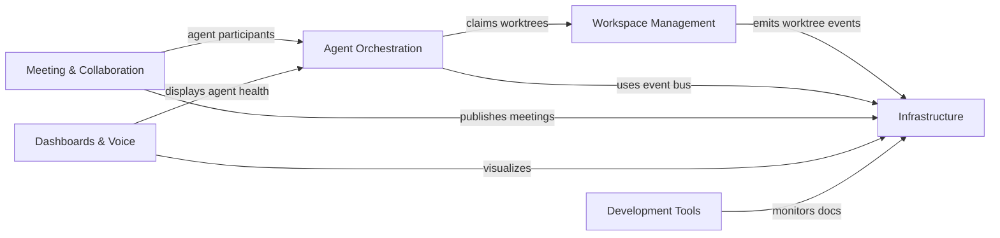

# 33GOD System - GOD Document

> **Guaranteed Organizational Document** - System-wide developer reference
>
> **Last Updated**: 2026-02-22
> **Architecture**: Event-Driven Microservices
> **Domains**: 6

---

## System Overview

**33GOD** is an **event-driven agentic pipeline** for orchestrating software development, knowledge management, and automated workflows. At its core, **Bloodbank Events are the absolute lifeblood** of the ecosystem—what sets 33GOD apart as the most powerful agentic pipeline. Every state change, every agent action, every system heartbeat flows through Bloodbank as an immutable, typed event.

**The Event-Driven Architecture Flow:**

```
┌─────────────────────────────────────────────────────────────────────────────┐
│  HOLYFIELDS          BLOODBANK           CANDYSTORE         HOLOCENE        │
│  (Definition)   →    (Transport)    →    (Persistence) →    (Visibility)    │
│       │                   │                   │                   │         │
│       │                   │                   │                   ▼         │
│       │                   │                   │            AGENT INBOX      │
│       │                   │                   │                   │         │
│       │                   │                   │                   ▼         │
│       │                   │                   │           HEARTBEATROUTER   │
│       │                   │                   │                   │         │
│       │                   │                   │                   ▼         │
│       │                   │                   │            AGENT ACTION     │
└─────────────────────────────────────────────────────────────────────────────┘
```

**Core Value Proposition:**
- **Bloodbank Events** — Immutable facts that drive the entire system
- **Holyfields Contracts** — Schema-first event definitions (the law)
- **Persistent History** — Every event stored in Candystore (PostgreSQL) forever
- **Real-Time Visibility** — Holocene displays live and historical events
- **Agent Heartbeats** — `system.heartbeat.tick` drives agent orchestration every 60s
- **Composable Architecture** — Components are small, focused, event-driven

---

## Architecture Principles

1. **Bloodbank Events are Everything**: State changes emit events, not synchronous calls. If it didn't emit an event, it didn't happen.

2. **Holyfields Defines the Law**: All event schemas are defined in Holyfields. No inline Pydantic models without corresponding schemas.

3. **Events are Immutable**: Non-mutable events are added, triggered, and consumed. Mutable commands are fired. Events are facts; commands are requests.

4. **Candystore is the Memory**: All events persist in PostgreSQL. Query history from Candystore API; get real-time updates from WebSocket relay.

5. **Heartbeats Drive Agents**: `system.heartbeat.tick` fires every 60s. Agents consume via `agent.{name}.inbox`. HeartbeatRouter processes and injects into agent sessions via OpenClaw hooks.

6. **Holocene Provides Visibility**: Real-time dashboard fetches history from Candystore API and subscribes to live events via WS relay.

7. **Registry as Truth**: `services/registry.yaml` defines service topology

8. **Modular & Autonomous**: Components are small, focused, independently deployable

9. **Agent-Centric**: AI agents are first-class citizens with their own event domains

10. **Observable by Default**: All events flow through Bloodbank for tracing

---

## System Topology

```mermaid
graph TB
    subgraph "1. HOLYFIELDS — Definition"
        HF[Schema Registry<br/>JSON Schemas<br/>Type Bindings]
    end

    subgraph "2. BLOODBANK — Transport"
        BB[Event Bus<br/>RabbitMQ Exchange<br/>bloodbank.events.v1]
        HBR[HeartbeatRouter<br/>system.heartbeat.tick]
    end

    subgraph "3. CANDYSTORE — Persistence"
        CS[Event Store<br/>PostgreSQL<br/>Permanent History]
    end

    subgraph "4. HOLOCENE — Visibility"
        HC[Mission Control<br/>Real-time Dashboard<br/>WS Relay]
    end

    subgraph "5. AGENTS — Action"
        AGENTS[Agent Pool<br/>agent.{name}.inbox]
    end

    subgraph "Event Producers"
        AO[Agent Orchestration<br/>Flume/Yi/AgentForge]
        WM[Workspace Management<br/>Zellij-Driver/Perth]
        MC[Meeting & Collaboration<br/>TheBoard]
        DT[Development Tools<br/>Degenerate/BMAD]
    end

    subgraph "Domain Services"
        HEY[HeyMa<br/>Voice Interface]
        TB[TheBoard<br/>Brainstorming]
        CB[Candybar<br/>Registry UI]
        DG[Degenerate<br/>Doc Drift]
    end

    %% Flow: Holyfields → Bloodbank
    HF -.->|defines schemas| BB

    %% Flow: Producers → Bloodbank
    AO -->|publishes/subscribes| BB
    WM -->|worktree events| BB
    MC -->|meeting events| BB
    DT -->|drift alerts| BB
    HEY -->|voice commands| BB
    TB -->|meeting events| BB

    %% Flow: Bloodbank → Candystore
    BB -->|persists all| CS

    %% Flow: Candystore → Holocene
    CS -->|query history| HC

    %% Flow: Bloodbank → Holocene (real-time)
    BB -->|WS relay| HC

    %% Flow: Heartbeat → Agents
    HBR -->|injects every 60s| AGENTS
    BB -->|agent.{name}.inbox| AGENTS

    %% Domain services
    HC -->|displays| CB
    HC -->|displays| HEY
```

**The Event Flow:**
1. **Holyfields** defines all event schemas (the contract)
2. **Bloodbank** transports events via RabbitMQ (the nervous system)
3. **Candystore** persists all events to PostgreSQL (the memory)
4. **Holocene** visualizes events via API + WebSocket (the eyes)
5. **HeartbeatRouter** drives agent orchestration (the pulse)

---

## Domain Reference

| Domain | Purpose | Components | GOD Doc |
|--------|---------|------------|---------|
| **Infrastructure** | Event backbone, schemas, persistence | Bloodbank, Holyfields, Candystore, Candybar | [Infrastructure GOD](domains/infrastructure/GOD.md) |
| **Agent Orchestration** | Agent lifecycle, teams, protocols | Flume, Yi, AgentForge, Holocene | [Agent Orchestration GOD](domains/agent-orchestration/GOD.md) |
| **Workspace Management** | Git worktrees, sessions, terminals | ~~iMi (Retired)~~, ~~Jelmore (Retired)~~, Zellij-Driver, Perth | [Workspace Management GOD](domains/workspace-management/GOD.md) |
| **Meeting & Collaboration** | Brainstorming, convergence, visualization | TheBoard, TheBoard Room | [Meeting & Collaboration GOD](domains/meeting-collaboration/GOD.md) |
| **Dashboards & Voice** | UI, voice interface, monitoring | Holocene, HeyMa, Candybar | [Dashboards & Voice GOD](domains/dashboards-voice/GOD.md) |
| **Development Tools** | Doc sync, methodology, coding sessions | Jelmore, Degenerate, BMAD | [Development Tools GOD](domains/development-tools/GOD.md) |

### Infrastructure Domain Deep-Dive

The **Infrastructure Domain** is the foundation of 33GOD's event-driven architecture:

| Component | Role in Event Flow | Status | GOD Doc |
|-----------|-------------------|--------|---------|
| **Holyfields** | Defines all event schemas (Schema Registry) | Production | [holyfields/GOD.md](../holyfields/GOD.md) |
| **Bloodbank** | Transports events via RabbitMQ (Event Bus) | Production | [bloodbank/GOD.md](../bloodbank/GOD.md) |
| **Candystore** | Persists events to PostgreSQL (Event Store) | Development | [candystore/GOD.md](../candystore/GOD.md) |
| **Candybar** | UI for service registry (Registry Dashboard) | Development | [candybar/GOD.md](../candybar/GOD.md) |

---

## System-Wide Event Contracts

### The Event Lifecycle

```
┌──────────────────────────────────────────────────────────────────────────────┐
│                        EVENT LIFECYCLE IN 33GOD                              │
├──────────────────────────────────────────────────────────────────────────────┤
│                                                                              │
│   1. DEFINED          2. PUBLISHED         3. PERSISTED       4. CONSUMED   │
│      (Holyfields)       (Bloodbank)         (Candystore)        (Agents)    │
│         │                    │                   │                  │       │
│         ▼                    ▼                   ▼                  ▼       │
│   ┌──────────┐        ┌──────────┐        ┌──────────┐       ┌──────────┐   │
│   │  Schema  │   →    │ RabbitMQ │   →    │ PostgreSQL│  →   │ Handler  │   │
│   │  (JSON)  │        │ Exchange │        │   (JSONB) │       │ (Code)   │   │
│   └──────────┘        └──────────┘        └──────────┘       └──────────┘   │
│                                                                              │
│   IMMUTABLE FACT:     TRANSPORT:           MEMORY:            ACTION:       │
│   - Schema is law     - Topic exchange     - Query via API    - React       │
│   - Versioned         - Routing keys       - Historical        - Transform   │
│   - Never changes     - Durable queues     - Searchable        - Emit new    │
│                                                                              │
└──────────────────────────────────────────────────────────────────────────────┘
```

### Critical Event Flows

**Agent Task Execution:**
```
agent.task.created → agent.task.claimed → agent.task.progress → agent.task.completed
```

**Heartbeat-Driven Agent Orchestration:**
```
system.heartbeat.tick (every 60s)
    ↓
agent.{name}.inbox (consumed by agent)
    ↓
HeartbeatRouter.process_tick()
    ↓
Injected into agent session via OpenClaw hooks
```

The **heartbeat system** is the pulse of 33GOD:
- `system.heartbeat.tick` fires every 60 seconds from Bloodbank
- Agents subscribe to `agent.{name}.inbox` routing key
- HeartbeatRouter processes ticks and routes to appropriate agents
- OpenClaw hooks inject heartbeat context into agent sessions
- Agents consume heartbeats to trigger periodic tasks, health checks, and coordination

**Git Worktree Lifecycle:**
```
worktree.created → session.started → commit.created → worktree.released
```

**Meeting Flow:**
```
meeting.started → discussion.round → convergence.detected → meeting.ended
```

**Transcript Processing:**
```
transcript.ready → transcript.processed → notes.generated → vault.updated
```

### Event Schema Registry

All event schemas are defined in **Holyfields** and validated by Bloodbank.

**Schema Locations:**
- **Canonical (JSON Schema)**: `holyfields/schemas/`
- **Python (Pydantic)**: `holyfields/python/models/`
- **TypeScript (Zod)**: `holyfields/typescript/schemas/`

**Key Principle**: Holyfields defines the law. If it's not in Holyfields, it doesn't exist.

---

## Component Registry

### Active Components

| Component | Domain | Role in Event Flow | Status | GOD Doc |
|-----------|--------|-------------------|--------|---------|
| **Holyfields** | Infrastructure | Schema Registry — defines all events | Production | [holyfields/GOD.md](holyfields/GOD.md) |
| **Bloodbank** | Infrastructure | Event Bus — transports all events | Production | [bloodbank/GOD.md](bloodbank/GOD.md) |
| **Candystore** | Infrastructure | Event Store — persists to PostgreSQL | Development | [candystore/GOD.md](candystore/GOD.md) |
| **Candybar** | Infrastructure | Registry UI — displays service topology | Development | [candybar/GOD.md](candybar/GOD.md) |
| **Flume** | Agent Orchestration | Protocol | Development | _(To be created)_ |
| **Yi** | Agent Orchestration | Adapter | Planning | _(To be created)_ |
| **AgentForge** | Agent Orchestration | Team Builder | Planning | _(To be created)_ |
| **Holocene** | Agent Orchestration / Dashboards | Mission Control — displays events | Development | [holocene/GOD.md](holocene/GOD.md) |
| **iMi** | Workspace Management | CLI | **Retired** | [iMi/GOD.md](iMi/GOD.md) |
| **Jelmore** | Workspace Management | API/CLI | **Retired** | [jelmore/GOD.md](jelmore/GOD.md) |
| **Zellij-Driver** | Workspace Management | CLI | Development | _(To be created)_ |
| **Perth** | Workspace Management | Distribution | Development | _(To be created)_ |
| **TheBoard** | Meeting & Collaboration | Orchestrator | Planning | _(To be created)_ |
| **TheBoard Room** | Meeting & Collaboration | UI | Planning | [theboardroom/GOD.md](theboardroom/GOD.md) |
| **HeyMa** | Dashboards & Voice | Voice UI | Development | [HeyMa/GOD.md](HeyMa/GOD.md) |
| **Degenerate** | Development Tools | Doc Sync | Planning | _(To be created)_ |
| **BMAD** | Development Tools | Methodology | Production | _(To be created)_ |

### Infrastructure Components Explained

**The Foundation of 33GOD's Event-Driven Architecture:**

```
┌─────────────────────────────────────────────────────────────────────────────┐
│                         INFRASTRUCTURE STACK                                 │
├─────────────────────────────────────────────────────────────────────────────┤
│                                                                              │
│   HOLYFIELDS                                                                 │
│   ┌─────────────────────────────────────────────────────────────────────┐   │
│   │  Schema Registry (JSON Schemas)                                      │   │
│   │  • Defines all event types                                           │   │
│   │  • Generates Python Pydantic models                                  │   │
│   │  • Generates TypeScript Zod schemas                                  │   │
│   └─────────────────────────────────────────────────────────────────────┘   │
│                              ↓                                               │
│   BLOODBANK                                                                  │
│   ┌─────────────────────────────────────────────────────────────────────┐   │
│   │  RabbitMQ Event Bus                                                  │   │
│   │  • Exchange: bloodbank.events.v1 (TOPIC)                             │   │
│   │  • Routing keys: domain.resource.action                              │   │
│   │  • Durable queues with retry + DLQ                                   │   │
│   └─────────────────────────────────────────────────────────────────────┘   │
│                              ↓                                               │
│   CANDYSTORE                                                                 │
│   ┌─────────────────────────────────────────────────────────────────────┐   │
│   │  PostgreSQL Event Store                                              │   │
│   │  • Persists ALL events (wildcard binding #)                          │   │
│   │  • Query API for historical data                                     │   │
│   │  • JSONB payload storage                                             │   │
│   └─────────────────────────────────────────────────────────────────────┘   │
│                              ↓                                               │
│   HOLOCENE                                                                   │
│   ┌─────────────────────────────────────────────────────────────────────┐   │
│   │  Real-time Dashboard                                                 │   │
│   │  • Candystore API for history                                        │   │
│   │  • WebSocket relay for live events                                   │   │
│   │  • Agent constellation visualization                                 │   │
│   └─────────────────────────────────────────────────────────────────────┘   │
│                                                                              │
└─────────────────────────────────────────────────────────────────────────────┘
```

---

## Cross-Domain Dependencies



---

## Infrastructure Requirements

### Holyfields (Schema Registry)
- **Location**: `~/code/33GOD/holyfields/`
- **Schemas**: `holyfields/schemas/`
- **Python Bindings**: `holyfields/python/`
- **TypeScript Bindings**: `holyfields/typescript/`
- **Generate**: `cd holyfields && make generate`

### Bloodbank (RabbitMQ)
- **Connection**: `amqp://localhost:5673` (host-mapped from container 5672)
- **Exchange**: `bloodbank.events.v1` (topic, durable)
- **API**: `http://localhost:8682` (FastAPI publisher)
- **WS Relay**: `ws://localhost:8683` (real-time broadcast)
- **Management UI**: `http://localhost:15673`
- **Credentials**: `~/code/33GOD/.env` (`RABBITMQ_USER` / `RABBITMQ_PASS`)

### Candystore (Event Persistence)
- **API**: `http://localhost:8683` (FastAPI query interface)
- **Database**: PostgreSQL (configurable, defaults to SQLite for dev)
- **Purpose**: Stores ALL events via wildcard binding (`#`)
- **Query**: REST API with filtering by session, type, source, time range
- **Metrics**: Prometheus on port 9090

### Holocene (Mission Control)
- **URL**: `http://localhost:3000` (development)
- **Production**: `https://holocene.delo.sh`
- **Features**: Real-time event stream, agent constellation, project timeline
- **Data Sources**: 
  - Candystore API (historical events)
  - WebSocket relay (live events)

### Heartbeat System
- **Event**: `system.heartbeat.tick` fires every 60 seconds
- **Routing**: `agent.{name}.inbox` for agent-specific delivery
- **Router**: HeartbeatRouter processes and routes ticks
- **Injection**: OpenClaw hooks inject heartbeat context into agent sessions
- **Purpose**: Drives agent orchestration, health checks, periodic tasks

### Services Registry
- **Location**: `/home/delorenj/code/33GOD/services/registry.yaml`
- **Purpose**: Single source of truth for service topology

### Authentication
- **iMi Identity**: `$IMI_IDENTITY_TOKEN` for workspace access
- **Agent Tokens**: Per-agent authentication for Bloodbank

---

## Development Workflow

### Setting Up 33GOD Environment

```bash
# Clone repository with submodules
git clone --recurse-submodules https://github.com/delorenj/33GOD.git
cd 33GOD

# Start infrastructure
docker-compose up -d bloodbank

# Install component dependencies (per component)
cd bloodbank && uv sync
cd ../iMi && cargo build
cd ../jelmore && uv sync
# ... etc
```

### Adding a New Component

1. Define component in `services/registry.yaml`
2. Create component GOD.md from template
3. Register event contracts in Holyfields
4. Implement Bloodbank pub/sub
5. Update domain GOD.md
6. Update system GOD.md component registry

### Event Development Pattern

1. Define schema in Holyfields
2. Generate types: `cd holyfields && make generate`
3. Implement event emission in producer
4. Implement event handler in consumer
5. Test via Candybar event stream

---

## Observability

### Event Monitoring
- **Candybar**: Real-time event stream visualization
- **RabbitMQ Management**: Queue depths, routing stats

### Service Health
- **Registry**: Service status in `registry.yaml`
- **Holocene**: Agent health dashboard

### Tracing
- **Correlation IDs**: All events carry `correlation_id` for tracing
- **Bloodbank**: Dead-letter queue for failed events

---

## References

- **Architecture Doc**: `docs/ARCHITECTURE.md`
- **Domain Index**: `docs/domains/DOMAINS.md`
- **Services Registry**: `services/registry.yaml`
- **Event Schemas**: `holyfields/`

---

## Maintenance

This GOD document is updated:
- **Manually**: Via `/bmad-bmm-document-project` workflow
- **Automatically**: Git hooks on component changes (`.githooks/pre-commit`)
- **Frequency**: On component addition/removal, major architecture changes

**Update Command:**
```bash
# From 33GOD root
/bmad-bmm-document-project
```

**Documentation:**
- **GOD System Guide**: `docs/GOD-SYSTEM-GUIDE.md`
- **Templates**: `docs/templates/`
- **Git Hooks**: `.githooks/`
