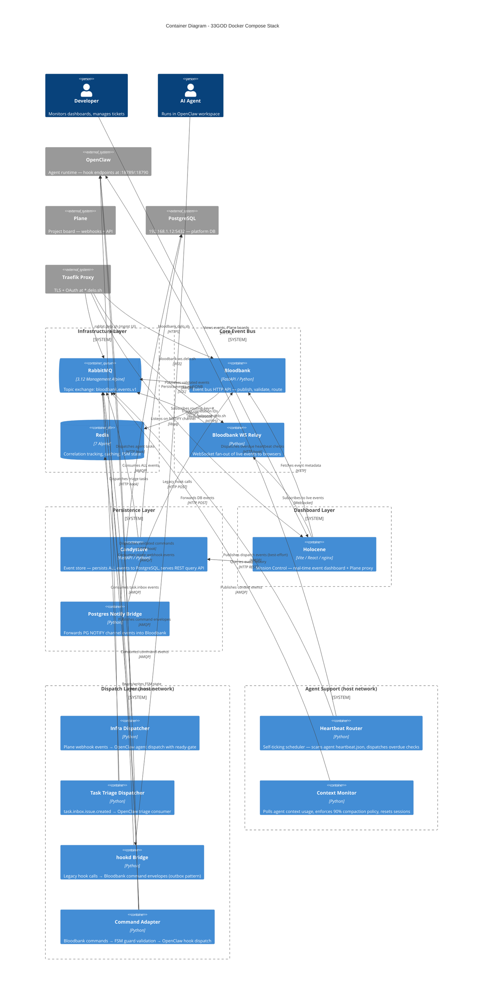

# C4 Level 2: Container Diagram - 33GOD Compose Stack

> Every service in compose.yml and the external systems they depend on.

## Service Summary

| Service | Image/Build | Network | Ports (host) | Depends On |
|---------|-------------|---------|--------------|------------|
| **redis** | `redis:7-alpine` | 33god-network | 6381 | — |
| **rabbitmq** | `rabbitmq:3.12-management-alpine` | 33god-network + proxy | 5673, 15673 | — |
| **bloodbank** | `bloodbank/Dockerfile` | 33god-network + proxy | 8682 | redis, rabbitmq |
| **bloodbank-ws-relay** | `bloodbank/websocket-relay/Dockerfile` | 33god-network + proxy | 8683 | — |
| **candystore** | `services/candystore/Dockerfile` | 33god-network | 8684 | bloodbank |
| **postgres-notify-bridge** | `services/postgres-notify-bridge/Dockerfile` | 33god-network | — | bloodbank |
| **holocene** | `holocene/Dockerfile` | 33god-network + proxy | 11819 | bloodbank, candystore |
| **infra-dispatcher** | `bloodbank/Dockerfile` | host | — | — |
| **task-triage-dispatcher** | `bloodbank/Dockerfile` | host | — | — |
| **hookd-bridge** | `bloodbank/Dockerfile` | host | 18790 | — |
| **command-adapter** | `bloodbank/Dockerfile` | host | — | — |
| **heartbeat-router** | `bloodbank/Dockerfile` | host | — | — |
| **context-monitor** | `bloodbank/Dockerfile` | host | — | — |
