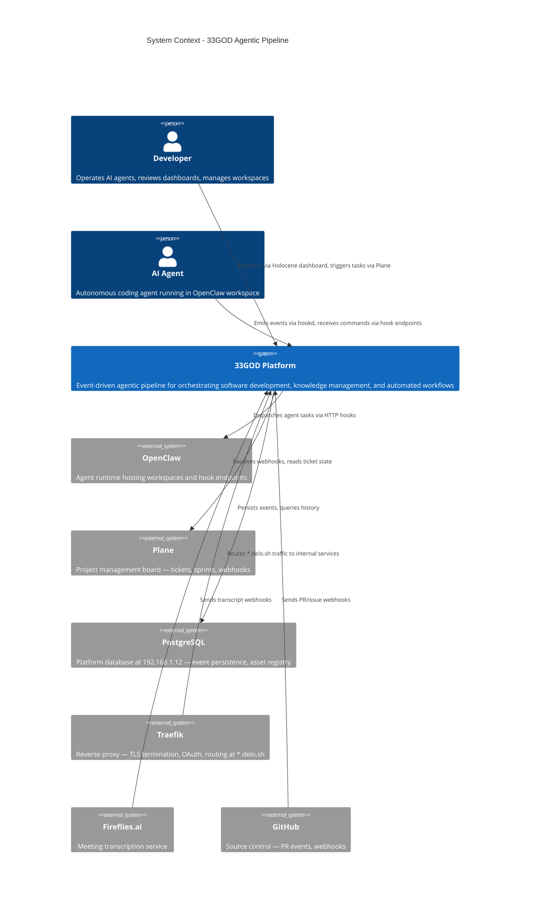

# C4 Level 1: System Context - 33GOD Platform

> Who uses 33GOD and what external systems does it interact with?

```mermaid
C4Context
  title System Context - 33GOD Agentic Pipeline

  Person(dev, "Developer", "Operates AI agents, reviews dashboards, manages workspaces")
  Person(agent, "AI Agent", "Autonomous coding agent running in OpenClaw workspace")

  System(god, "33GOD Platform", "Event-driven agentic pipeline for orchestrating software development, knowledge management, and automated workflows")

  System_Ext(openclaw, "OpenClaw", "Agent runtime hosting workspaces and hook endpoints")
  System_Ext(plane, "Plane", "Project management board — tickets, sprints, webhooks")
  System_Ext(postgres, "PostgreSQL", "Platform database at 192.168.1.12 — event persistence, asset registry")
  System_Ext(traefik, "Traefik", "Reverse proxy — TLS termination, OAuth, routing at *.delo.sh")
  System_Ext(fireflies, "Fireflies.ai", "Meeting transcription service")
  System_Ext(github, "GitHub", "Source control — PR events, webhooks")

  Rel(dev, god, "Monitors via Holocene dashboard, triggers tasks via Plane")
  Rel(agent, god, "Emits events via hookd, receives commands via hook endpoints")
  Rel(god, openclaw, "Dispatches agent tasks via HTTP hooks")
  Rel(god, postgres, "Persists events, queries history")
  Rel(god, plane, "Receives webhooks, reads ticket state")
  Rel(traefik, god, "Routes *.delo.sh traffic to internal services")
  Rel(fireflies, god, "Sends transcript webhooks")
  Rel(github, god, "Sends PR/issue webhooks")

  UpdateLayoutConfig($c4ShapeInRow="3", $c4BoundaryInRow="1")
```
