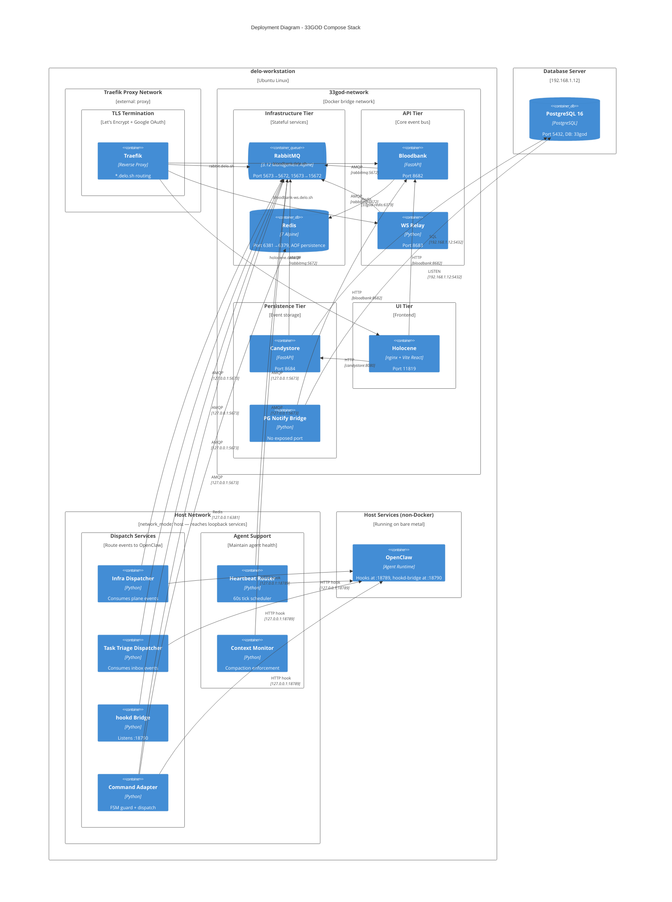

# C4 Level 4: Deployment Diagram - 33GOD Stack

> How services map to Docker networks and host networking.

## Network Topology

| Network | Type | Services | Why |
|---------|------|----------|-----|
| **33god-network** | Docker bridge | redis, rabbitmq, bloodbank, ws-relay, candystore, pg-notify-bridge, holocene | Internal service mesh with DNS resolution |
| **proxy** | External (Traefik) | rabbitmq, bloodbank, ws-relay, holocene | TLS-terminated public routing at *.delo.sh |
| **host** | network_mode: host | heartbeat-router, context-monitor, infra-dispatcher, task-triage-dispatcher, hookd-bridge, command-adapter | Must reach OpenClaw on 127.0.0.1:18789 (loopback-bound) |

## Port Map

| Host Port | Container Port | Service | Protocol |
|-----------|---------------|---------|----------|
| 5673 | 5672 | RabbitMQ | AMQP |
| 15673 | 15672 | RabbitMQ | HTTP (Management UI) |
| 6381 | 6379 | Redis | Redis |
| 8682 | 8682 | Bloodbank | HTTP |
| 8683 | 8683 | WS Relay | WebSocket |
| 8684 | 8080 | Candystore | HTTP |
| 11819 | 80 | Holocene | HTTP (nginx) |
| 18790 | — (host) | hookd Bridge | HTTP |
