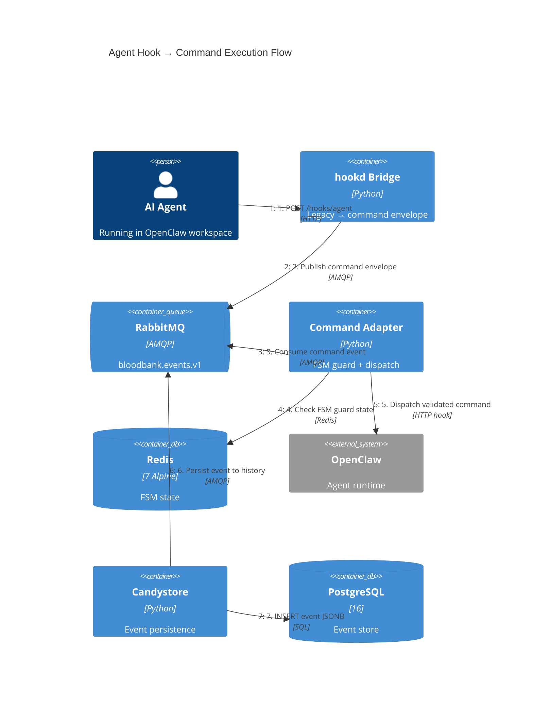
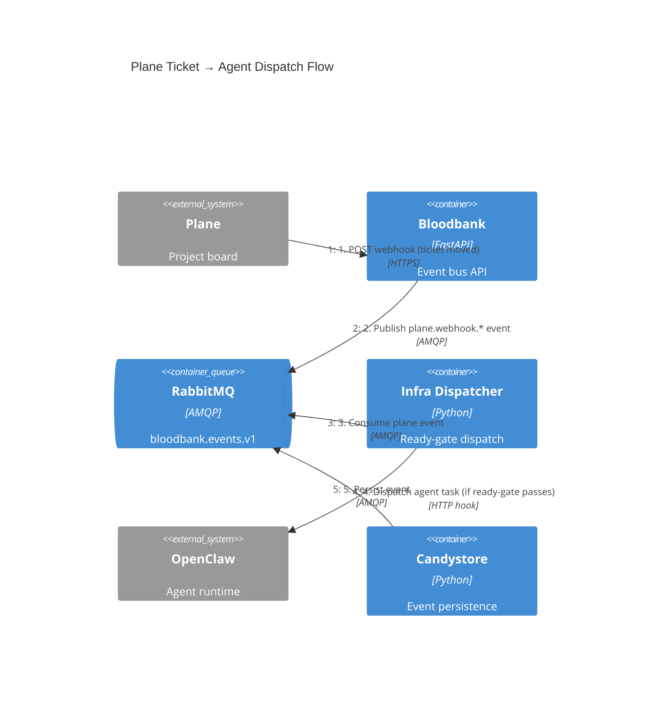
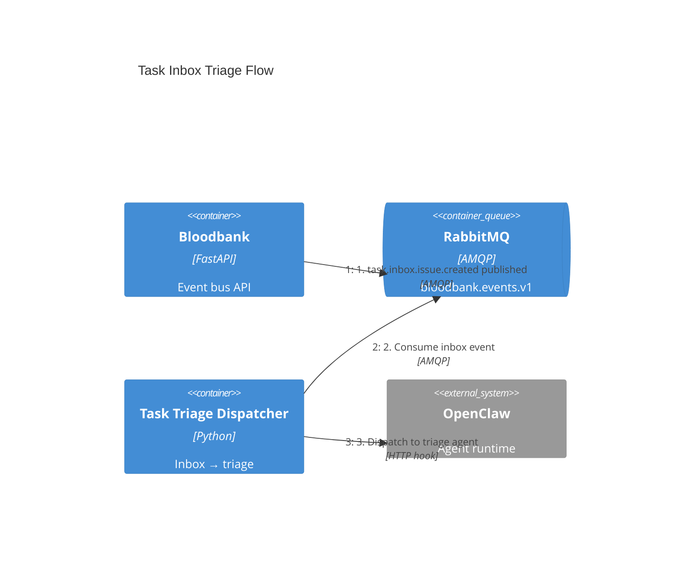
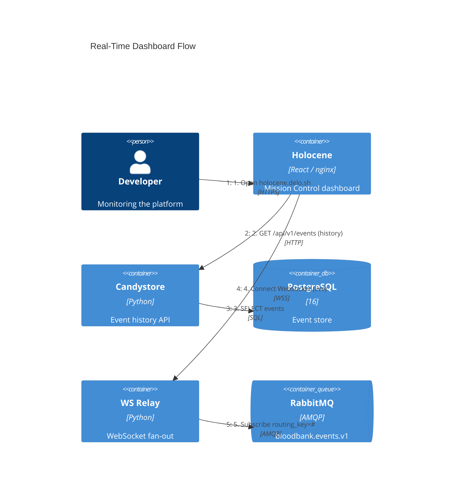
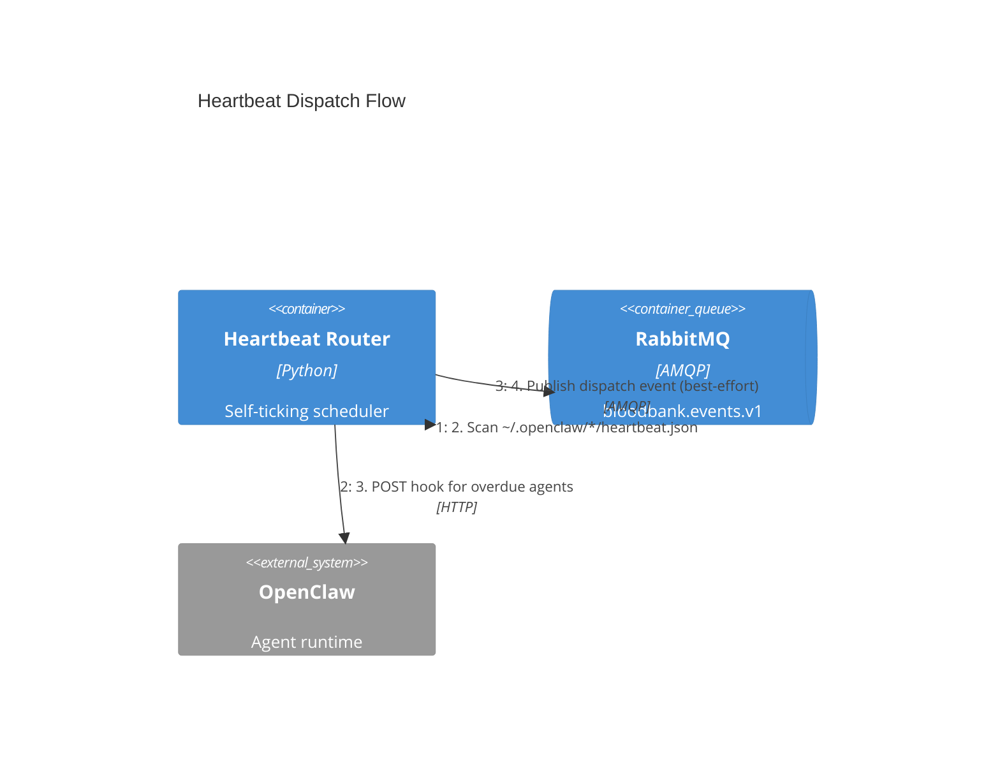
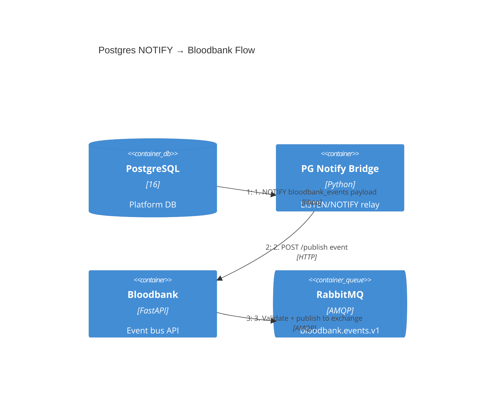

# C4 Dynamic: Event Flow Through 33GOD

> Numbered request flows showing how events move through the system.

## Flow 1: Agent Hook Call → Command Execution

An AI agent makes a legacy hook call that gets translated, validated, and dispatched.

## Flow 2: Plane Ticket → Agent Dispatch

A Plane webhook triggers infra-dispatcher to spin up an agent via OpenClaw.

## Flow 3: Task Inbox Triage

A new task enters the inbox and gets triaged to the appropriate agent.

## Flow 4: Real-Time Dashboard

Developer views live events flowing through the system.

## Flow 5: Heartbeat Check Dispatch

The heartbeat router scans agent workspaces and dispatches overdue checks.

## Flow 6: Database Change → Event Pipeline

A Postgres NOTIFY triggers an event through the pipeline.

