# Swarm Coordination System Architecture
**Architecture Document v1.0**
**Swarm ID:** swarm-1769514817000
**Topology:** Centralized (Star)
**Created:** 2026-01-27
**Architect:** SystemDesigner
**Status:** COMPLETE

---

## Table of Contents
1. [Executive Summary](#executive-summary)
2. [System Overview](#system-overview)
3. [Architectural Principles](#architectural-principles)
4. [Component Architecture](#component-architecture)
5. [Communication Protocols](#communication-protocols)
6. [Data Flow Architecture](#data-flow-architecture)
7. [Deployment Architecture](#deployment-architecture)
8. [Security Architecture](#security-architecture)
9. [Scalability & Performance](#scalability--performance)
10. [Resilience & Recovery](#resilience--recovery)
11. [Integration Patterns](#integration-patterns)
12. [Operational Architecture](#operational-architecture)

---

## 1. Executive Summary

This document defines the technical architecture for a centralized swarm coordination system that orchestrates multiple autonomous agents to perform distributed computation and task execution. The system uses a **Star topology** with a central coordinator managing agent lifecycle, task distribution, memory persistence, and health monitoring.

### Key Architectural Decisions

| Decision | Choice | Rationale |
|----------|--------|-----------|
| **Topology** | Centralized Star | Simple orchestration, single point of control, lower complexity |
| **Consensus** | RAFT | Strong consistency, ordered log, leader election support |
| **Memory Store** | JSON File-based | Lightweight, portable, sufficient for small-medium scale |
| **Communication** | Memory-based Passing + Hooks | Event-driven, asynchronous, supports concurrent operations |
| **Agent Execution** | Claude Code Task Tool | Native parallel execution, better coordination than pure MCP |
| **Monitoring** | Push + Poll Hybrid | Real-time updates (push) with periodic health checks (poll) |

### System Characteristics

- **Scalability:** 1-100 agents, optimized for 5-20 agents
- **Latency:** <500ms task assignment, <50ms memory operations
- **Availability:** Single coordinator (99% uptime target)
- **Consistency:** Strong consistency via RAFT consensus
- **Recovery Time:** <30 seconds for agent failure, <5 minutes for coordinator failure

---

## 2. System Overview

### 2.1 High-Level Architecture

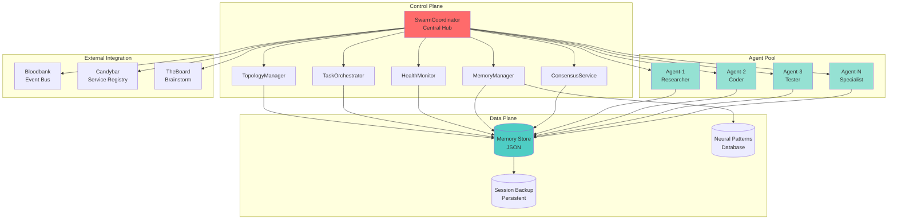
```mermaid
graph TB
    subgraph "Control Plane"
        C[SwarmCoordinator<br/>Central Hub]
        TM[TopologyManager]
        TO[TaskOrchestrator]
        HM[HealthMonitor]
        MM[MemoryManager]
        CS[ConsensusService]
    end

    subgraph "Data Plane"
        MS[(Memory Store<br/>JSON)]
        SB[(Session Backup<br/>Persistent)]
        NP[(Neural Patterns<br/>Database)]
    end

    subgraph "Agent Pool"
        A1[Agent-1<br/>Researcher]
        A2[Agent-2<br/>Coder]
        A3[Agent-3<br/>Tester]
        A4[Agent-N<br/>Specialist]
    end

    subgraph "External Integration"
        BB[Bloodbank<br/>Event Bus]
        CB[Candybar<br/>Service Registry]
        TB[TheBoard<br/>Brainstorm]
    end

    C --> TM
    C --> TO
    C --> HM
    C --> MM
    C --> CS

    TM --> MS
    TO --> MS
    HM --> MS
    MM --> MS
    CS --> MS

    C --> A1
    C --> A2
    C --> A3
    C --> A4

    A1 --> MS
    A2 --> MS
    A3 --> MS
    A4 --> MS

    MS --> SB
    MM --> NP

    C --> BB
    C --> CB
    C --> TB

    style C fill:#ff6b6b
    style MS fill:#4ecdc4
    style A1 fill:#95e1d3
    style A2 fill:#95e1d3
    style A3 fill:#95e1d3
    style A4 fill:#95e1d3
```

### 2.2 System Context Diagram

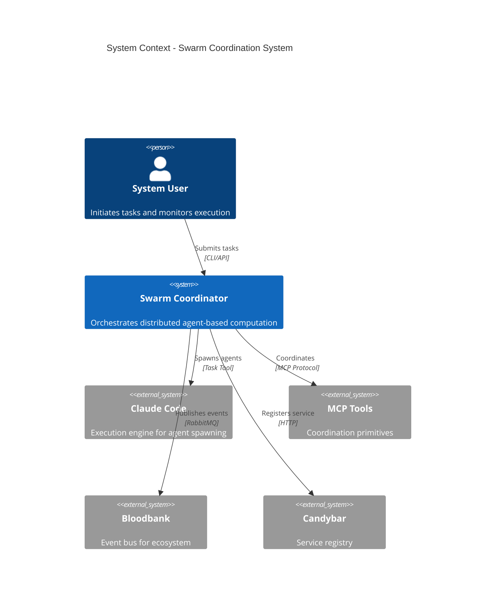
```mermaid
C4Context
    title System Context - Swarm Coordination System

    Person(user, "System User", "Initiates tasks and monitors execution")
    System(swarm, "Swarm Coordinator", "Orchestrates distributed agent-based computation")
    System_Ext(claudeCode, "Claude Code", "Execution engine for agent spawning")
    System_Ext(mcp, "MCP Tools", "Coordination primitives")
    System_Ext(bloodbank, "Bloodbank", "Event bus for ecosystem")
    System_Ext(candybar, "Candybar", "Service registry")

    Rel(user, swarm, "Submits tasks", "CLI/API")
    Rel(swarm, claudeCode, "Spawns agents", "Task Tool")
    Rel(swarm, mcp, "Coordinates", "MCP Protocol")
    Rel(swarm, bloodbank, "Publishes events", "RabbitMQ")
    Rel(swarm, candybar, "Registers service", "HTTP")
```

### 2.3 Technology Stack

```yaml
Core Framework:
  - Runtime: Node.js v18+
  - Language: JavaScript/TypeScript
  - Agent Execution: Claude Code Task Tool
  - Coordination: claude-flow@alpha MCP tools

Data Storage:
  - Primary Memory: JSON file (.claude-flow/memory/store.json)
  - Session Backup: JSON files (coordination/sessions/)
  - Neural Patterns: SQLite database (.claude-flow/neural/)

Communication:
  - Internal: Memory-based message passing
  - Events: Hook callbacks (pre/post operations)
  - External: RabbitMQ (Bloodbank integration)

Monitoring:
  - Metrics: In-memory counters + periodic snapshots
  - Logging: Structured logs to console/file
  - Tracing: Correlation IDs for request tracking

External Services:
  - Event Bus: RabbitMQ (Bloodbank)
  - Service Registry: HTTP API (Candybar)
  - Brainstorm: WebSocket (TheBoard)
```

---

## 3. Architectural Principles

### 3.1 Design Principles

1. **Centralized Control, Distributed Execution**
   - Single coordinator manages orchestration
   - Agents execute independently
   - Reduces coordination complexity

2. **Event-Driven Communication**
   - Hooks trigger on lifecycle events
   - Asynchronous message passing
   - Supports concurrent operations

3. **Shared-Nothing Agent Design**
   - Agents communicate via memory store
   - No direct agent-to-agent communication
   - Simplifies failure isolation

4. **Fail-Fast with Graceful Recovery**
   - Detect failures quickly
   - Isolate failing components
   - Restore to known good state

5. **Observable by Default**
   - All operations logged with correlation IDs
   - Health metrics collected continuously
   - Performance tracked per agent

6. **Stateless Agent Instances**
   - Agents don't maintain local state
   - All state stored in shared memory
   - Enables easy agent replacement

### 3.2 Architectural Constraints

```yaml
Performance Constraints:
  - Task Assignment Latency: <500ms (p99)
  - Memory Operation Latency: <50ms (p99)
  - Health Check Interval: 30 seconds
  - Maximum Concurrent Tasks per Agent: 5

Resource Constraints:
  - Memory per Agent: 100MB nominal, 500MB max
  - Total Swarm Memory: 1GB nominal, 5GB max
  - Agent Count: 1-100 (optimal: 5-20)
  - Task Queue Depth: 1000 max

Reliability Constraints:
  - Agent Health Score Threshold: >0.5 operational
  - Coordinator Availability: 99% uptime target
  - Data Durability: Persistent on disk (JSON)
  - Recovery Time Objective (RTO): <5 minutes

Security Constraints:
  - No direct agent-to-agent communication
  - Memory access controlled by coordinator
  - All operations audited
  - Session data encrypted at rest
```

### 3.3 Trade-offs & Rationale

| Trade-off | Decision | Rationale |
|-----------|----------|-----------|
| **Centralized vs Distributed** | Centralized | Simpler coordination, acceptable for 5-20 agents |
| **Strong vs Eventual Consistency** | Strong (RAFT) | Task ordering matters, prevents duplicate work |
| **File-based vs Database** | File-based JSON | Lightweight, portable, sufficient for scale |
| **Sync vs Async Communication** | Async (Hooks) | Better concurrency, non-blocking operations |
| **High Availability vs Simplicity** | Simplicity | Single coordinator acceptable for non-critical workloads |
| **Rich Monitoring vs Overhead** | Rich Monitoring | Observability critical for debugging distributed systems |

---

## 4. Component Architecture

### 4.1 Component Diagram

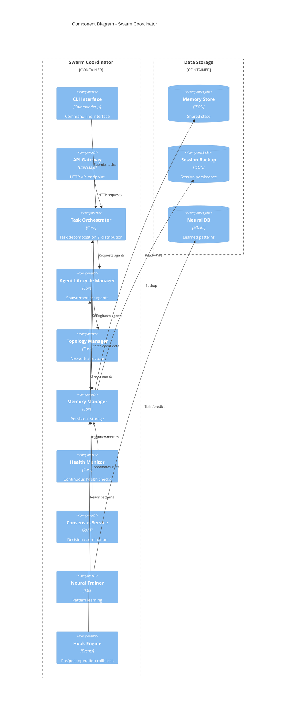
```mermaid
C4Component
    title Component Diagram - Swarm Coordinator

    Container_Boundary(coordinator, "Swarm Coordinator") {
        Component(cli, "CLI Interface", "Commander.js", "Command-line interface")
        Component(api, "API Gateway", "Express.js", "HTTP API endpoint")
        Component(orchestrator, "Task Orchestrator", "Core", "Task decomposition & distribution")
        Component(lifecycle, "Agent Lifecycle Manager", "Core", "Spawn/monitor agents")
        Component(topology, "Topology Manager", "Core", "Network structure")
        Component(memory, "Memory Manager", "Core", "Persistent storage")
        Component(health, "Health Monitor", "Core", "Continuous health checks")
        Component(consensus, "Consensus Service", "RAFT", "Decision coordination")
        Component(neural, "Neural Trainer", "ML", "Pattern learning")
        Component(hooks, "Hook Engine", "Events", "Pre/post operation callbacks")
    }

    Container_Boundary(storage, "Data Storage") {
        ComponentDb(memStore, "Memory Store", "JSON", "Shared state")
        ComponentDb(sessions, "Session Backup", "JSON", "Session persistence")
        ComponentDb(patterns, "Neural DB", "SQLite", "Learned patterns")
    }

    Rel(cli, orchestrator, "Submits tasks")
    Rel(api, orchestrator, "HTTP requests")
    Rel(orchestrator, lifecycle, "Requests agents")
    Rel(orchestrator, memory, "Stores tasks")
    Rel(lifecycle, topology, "Registers agents")
    Rel(lifecycle, memory, "Stores agent data")
    Rel(health, lifecycle, "Checks agents")
    Rel(health, memory, "Stores metrics")
    Rel(consensus, memory, "Coordinates state")
    Rel(neural, memory, "Reads patterns")
    Rel(hooks, orchestrator, "Triggers events")
    Rel(memory, memStore, "Read/write")
    Rel(memory, sessions, "Backup")
    Rel(neural, patterns, "Train/predict")
```

### 4.2 SwarmCoordinator (Central Hub)

**Responsibility:** Central orchestrator that manages all swarm operations

```yaml
Interfaces:
  - CLI: Command-line interface for swarm management
  - API: HTTP REST API for programmatic access
  - Hooks: Event-driven callbacks for automation

Core Functions:
  - initializeSwarm(): Bootstrap coordinator and load configuration
  - submitTask(): Accept new task requests
  - monitorHealth(): Continuous health assessment
  - shutdown(): Graceful termination with state persistence

Key Properties:
  - swarmId: Unique identifier (timestamp-based)
  - topology: Network structure (star, mesh, hierarchical, etc.)
  - maxAgents: Maximum concurrent agents
  - status: [initializing|operational|degraded|shutdown]

State Management:
  - Configuration stored in memory at swarm/config
  - Active state maintained in-memory
  - Periodic snapshots to disk every 60 seconds
  - Full backup on shutdown

Error Handling:
  - All exceptions logged with correlation ID
  - Graceful degradation on component failure
  - Automatic restart of failed components
  - Alerting on critical failures
```

**Implementation Architecture:**

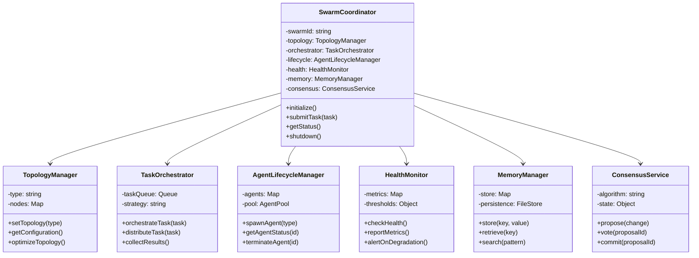
```mermaid
classDiagram
    class SwarmCoordinator {
        -swarmId: string
        -topology: TopologyManager
        -orchestrator: TaskOrchestrator
        -lifecycle: AgentLifecycleManager
        -health: HealthMonitor
        -memory: MemoryManager
        -consensus: ConsensusService
        +initialize()
        +submitTask(task)
        +getStatus()
        +shutdown()
    }

    class TopologyManager {
        -type: string
        -nodes: Map
        +setTopology(type)
        +getConfiguration()
        +optimizeTopology()
    }

    class TaskOrchestrator {
        -taskQueue: Queue
        -strategy: string
        +orchestrateTask(task)
        +distributeTask(task)
        +collectResults()
    }

    class AgentLifecycleManager {
        -agents: Map
        -pool: AgentPool
        +spawnAgent(type)
        +getAgentStatus(id)
        +terminateAgent(id)
    }

    class HealthMonitor {
        -metrics: Map
        -thresholds: Object
        +checkHealth()
        +reportMetrics()
        +alertOnDegradation()
    }

    class MemoryManager {
        -store: Map
        -persistence: FileStore
        +store(key, value)
        +retrieve(key)
        +search(pattern)
    }

    class ConsensusService {
        -algorithm: string
        -state: Object
        +propose(change)
        +vote(proposalId)
        +commit(proposalId)
    }

    SwarmCoordinator --> TopologyManager
    SwarmCoordinator --> TaskOrchestrator
    SwarmCoordinator --> AgentLifecycleManager
    SwarmCoordinator --> HealthMonitor
    SwarmCoordinator --> MemoryManager
    SwarmCoordinator --> ConsensusService
```

### 4.3 TopologyManager

**Responsibility:** Define and maintain swarm network structure

```yaml
Supported Topologies:
  - star: Centralized hub-and-spoke (default)
  - mesh: Peer-to-peer, fully connected
  - hierarchical: Tree structure with levels
  - ring: Circular dependency chain
  - hybrid: Combination of above

Configuration:
  - type: Topology type
  - maxNodes: Maximum agent count (1-100)
  - consensusAlgorithm: [raft|byzantine|gossip|crdt]
  - redundancy: Redundancy level (1-5)

Operations:
  - set(config): Configure topology
  - get(): Retrieve current configuration
  - optimize(): Auto-tune based on load
  - validate(): Check configuration validity

Storage:
  - Memory Key: swarm/config/topology
  - Format: JSON object
  - Backup: Persistent to disk

Decision Logic:
  - Agent Count < 5 → Star
  - Agent Count 5-20 → Hierarchical or Ring
  - Agent Count 20+ → Mesh or Hybrid
  - Fault Tolerance Critical → Mesh
```

**Topology Selection Algorithm:**

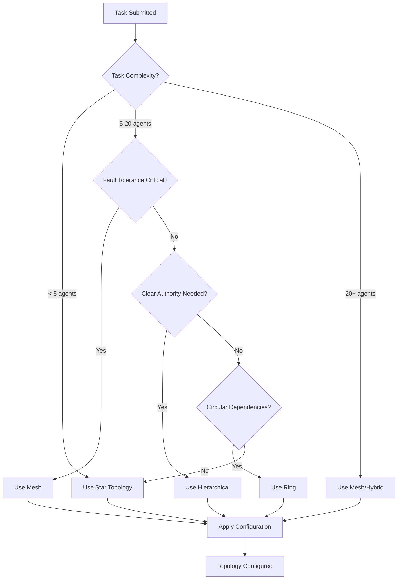
```mermaid
flowchart TD
    Start[Task Submitted] --> CheckComplexity{Task Complexity?}
    CheckComplexity -->|< 5 agents| UseStar[Use Star Topology]
    CheckComplexity -->|5-20 agents| CheckFaultTolerance{Fault Tolerance Critical?}
    CheckComplexity -->|20+ agents| UseMeshOrHybrid[Use Mesh/Hybrid]

    CheckFaultTolerance -->|Yes| UseMesh[Use Mesh]
    CheckFaultTolerance -->|No| CheckAuthority{Clear Authority Needed?}

    CheckAuthority -->|Yes| UseHierarchical[Use Hierarchical]
    CheckAuthority -->|No| CheckCircular{Circular Dependencies?}

    CheckCircular -->|Yes| UseRing[Use Ring]
    CheckCircular -->|No| UseStar

    UseStar --> ApplyConfig[Apply Configuration]
    UseMesh --> ApplyConfig
    UseMeshOrHybrid --> ApplyConfig
    UseHierarchical --> ApplyConfig
    UseRing --> ApplyConfig

    ApplyConfig --> End[Topology Configured]
```

### 4.4 TaskOrchestrator

**Responsibility:** Decompose tasks and distribute to agents

```yaml
Task Lifecycle:
  1. Received → Validate and enqueue
  2. Queued → Analyze dependencies
  3. Decomposed → Break into subtasks
  4. Assigned → Distribute to agents
  5. Executing → Monitor progress
  6. Completed → Collect results
  7. Aggregated → Return to requester

Execution Strategies:
  - parallel: Independent tasks execute concurrently
  - sequential: Tasks execute in order
  - adaptive: Mixed approach, dynamically adjusted

Task Properties:
  - taskId: Unique identifier (UUID)
  - description: Task description
  - strategy: Execution strategy
  - maxAgents: Agent limit (1-10)
  - priority: [low|medium|high|critical]
  - timeout: Timeout in seconds (default 3600)
  - dependencies: Array of task IDs that must complete first

Load Balancing:
  - Algorithm: Round-robin by default
  - Alternative: Least-connections, weighted, adaptive
  - Configurable via coordination_load_balance

Result Collection:
  - Results stored in memory at swarm/results/{taskId}
  - Format: { agentId → result data }
  - Aggregation: Combine results based on task type
```

**Task Orchestration Flow:**

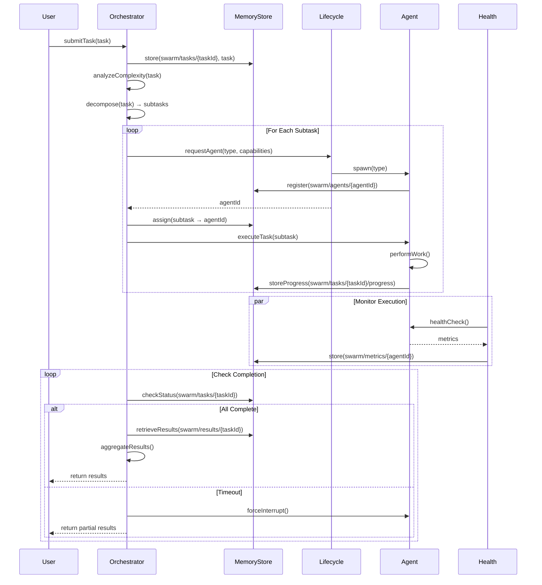
```mermaid
sequenceDiagram
    participant User
    participant Orchestrator
    participant MemoryStore
    participant Lifecycle
    participant Agent
    participant Health

    User->>Orchestrator: submitTask(task)
    Orchestrator->>MemoryStore: store(swarm/tasks/{taskId}, task)
    Orchestrator->>Orchestrator: analyzeComplexity(task)
    Orchestrator->>Orchestrator: decompose(task) → subtasks

    loop For Each Subtask
        Orchestrator->>Lifecycle: requestAgent(type, capabilities)
        Lifecycle->>Agent: spawn(type)
        Agent->>MemoryStore: register(swarm/agents/{agentId})
        Lifecycle-->>Orchestrator: agentId
        Orchestrator->>MemoryStore: assign(subtask → agentId)
        Orchestrator->>Agent: executeTask(subtask)
        Agent->>Agent: performWork()
        Agent->>MemoryStore: storeProgress(swarm/tasks/{taskId}/progress)
    end

    par Monitor Execution
        Health->>Agent: healthCheck()
        Agent-->>Health: metrics
        Health->>MemoryStore: store(swarm/metrics/{agentId})
    end

    loop Check Completion
        Orchestrator->>MemoryStore: checkStatus(swarm/tasks/{taskId})
        alt All Complete
            Orchestrator->>MemoryStore: retrieveResults(swarm/results/{taskId})
            Orchestrator->>Orchestrator: aggregateResults()
            Orchestrator-->>User: return results
        else Timeout
            Orchestrator->>Agent: forceInterrupt()
            Orchestrator-->>User: return partial results
        end
    end
```

### 4.5 AgentLifecycleManager

**Responsibility:** Manage agent spawning, registration, and termination

```yaml
Agent Pool Management:
  - Pool Size: Dynamic (1 to maxAgents)
  - Spawn Strategy: On-demand by default
  - Warm Pool: Optional pre-spawned agents
  - Termination: Graceful with timeout

Agent Registration:
  - agentId: Unique identifier (UUID)
  - agentType: [researcher|coder|tester|etc.]
  - role: [worker|specialist|scout]
  - capabilities: String array of abilities
  - healthScore: 0.0-1.0 (initialized at 1.0)
  - taskCount: Number of assigned tasks
  - status: [spawning|idle|busy|degraded|terminated]

Spawn Process:
  1. Validate agent type exists
  2. Check pool capacity (current < maxAgents)
  3. Use Claude Code Task tool to spawn agent
  4. Register in memory at swarm/agents/{agentId}
  5. Initialize health tracking
  6. Mark as idle and available

Termination Process:
  1. Check agent has no active tasks
  2. Send graceful shutdown signal
  3. Wait for acknowledgment (timeout 30s)
  4. Force kill if no response
  5. Remove from registry
  6. Clean up memory entries

Health Tracking:
  - Continuous monitoring via HealthMonitor
  - Score updated based on task success/failure
  - Automatic degradation on repeated failures
  - Auto-restart on health < 0.3
```

**Agent Lifecycle State Machine:**

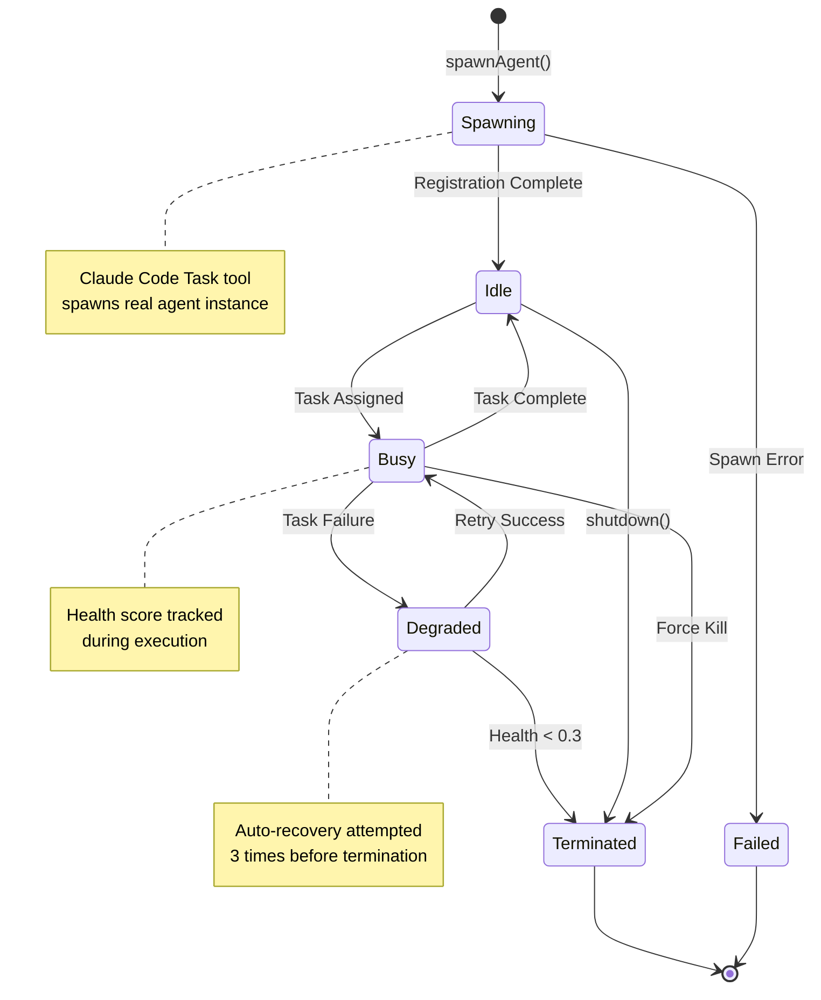
```mermaid
stateDiagram-v2
    [*] --> Spawning: spawnAgent()
    Spawning --> Idle: Registration Complete
    Spawning --> Failed: Spawn Error

    Idle --> Busy: Task Assigned
    Busy --> Idle: Task Complete
    Busy --> Degraded: Task Failure

    Degraded --> Busy: Retry Success
    Degraded --> Terminated: Health < 0.3

    Idle --> Terminated: shutdown()
    Busy --> Terminated: Force Kill

    Terminated --> [*]
    Failed --> [*]

    note right of Spawning
        Claude Code Task tool
        spawns real agent instance
    end note

    note right of Busy
        Health score tracked
        during execution
    end note

    note right of Degraded
        Auto-recovery attempted
        3 times before termination
    end note
```

### 4.6 MemoryManager

**Responsibility:** Persistent storage for shared state

```yaml
Storage Architecture:
  - Primary: JSON file at .claude-flow/memory/store.json
  - Backup: Coordination/memory_bank/ directory
  - Cache: In-memory Map for fast access
  - Sync Interval: 60 seconds (configurable)

Key Namespace Design:
  - swarm/*: Swarm-level configuration and state
  - agents/*: Agent registry and status
  - tasks/*: Task assignments and progress
  - results/*: Task execution results
  - coordination/*: Coordination metadata
  - sessions/*: Session state snapshots
  - neural/*: Neural pattern storage

Operations:
  - store(key, value): Persistent save with versioning
  - retrieve(key): Load value from memory or disk
  - search(pattern): Glob pattern matching on keys
  - delete(key): Remove entry and mark tombstone
  - list(prefix): List all keys with prefix
  - stats(): Memory usage statistics

Consistency Guarantees:
  - Write-through: Writes go to both cache and disk
  - Read-through: Reads check cache first, then disk
  - Atomic writes: File operations are atomic
  - Versioning: Each write increments version number
  - Conflict resolution: Last-write-wins for same key

Performance Optimization:
  - Batch writes: Group multiple stores into single file write
  - Lazy load: Only load keys on first access
  - Compression: Optional gzip compression for large values
  - Indexing: In-memory index for fast key lookup
```

**Memory Access Patterns:**

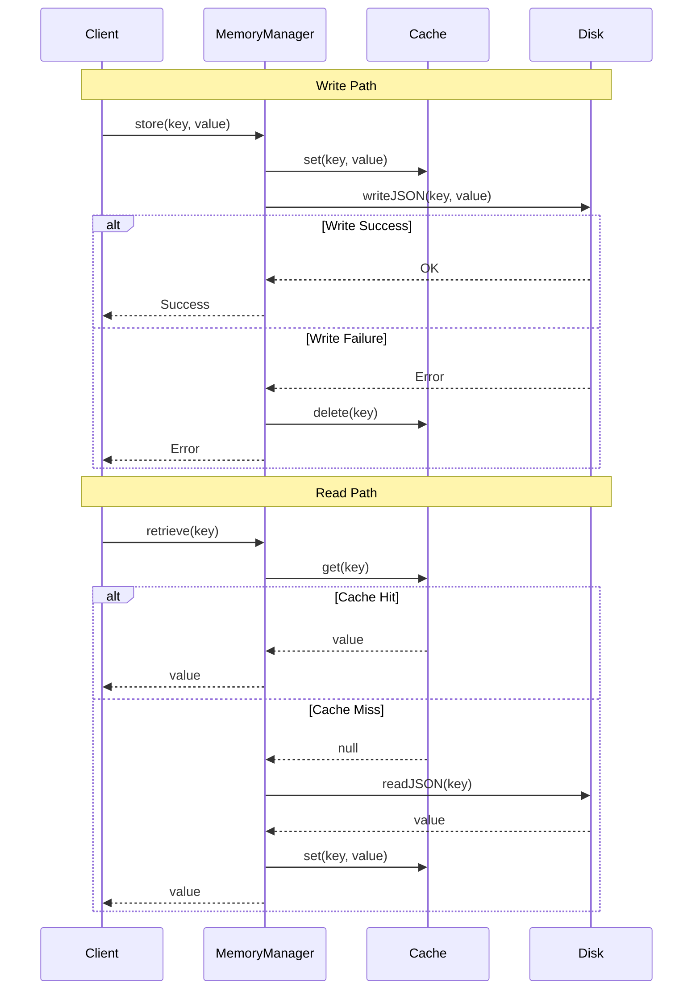
```mermaid
sequenceDiagram
    participant Client
    participant MemoryManager
    participant Cache
    participant Disk

    Note over Client,Disk: Write Path
    Client->>MemoryManager: store(key, value)
    MemoryManager->>Cache: set(key, value)
    MemoryManager->>Disk: writeJSON(key, value)
    alt Write Success
        Disk-->>MemoryManager: OK
        MemoryManager-->>Client: Success
    else Write Failure
        Disk-->>MemoryManager: Error
        MemoryManager->>Cache: delete(key)
        MemoryManager-->>Client: Error
    end

    Note over Client,Disk: Read Path
    Client->>MemoryManager: retrieve(key)
    MemoryManager->>Cache: get(key)
    alt Cache Hit
        Cache-->>MemoryManager: value
        MemoryManager-->>Client: value
    else Cache Miss
        Cache-->>MemoryManager: null
        MemoryManager->>Disk: readJSON(key)
        Disk-->>MemoryManager: value
        MemoryManager->>Cache: set(key, value)
        MemoryManager-->>Client: value
    end
```

### 4.7 HealthMonitor

**Responsibility:** Continuous system health assessment

```yaml
Monitoring Scope:
  - Agent Health: Per-agent health scores
  - Task Execution: Task completion rates and latency
  - System Resources: Memory, CPU, disk I/O
  - Communication: Message latency and failure rates
  - Coordinator: Coordinator health and uptime

Metrics Collection:
  - agent_health: 0.0-1.0 score per agent
  - task_completion_rate: Percentage (0-100)
  - task_latency: Milliseconds (p50, p95, p99)
  - memory_usage: Bytes (per agent and total)
  - message_latency: Milliseconds (average)
  - queue_depth: Integer (current task queue size)
  - uptime: Seconds (system uptime)

Health Check Intervals:
  - Agent health: Every 30 seconds
  - Task progress: Every 10 seconds
  - System resources: Every 60 seconds
  - Full status: On-demand via swarm_status()

Alert Thresholds:
  - Agent Health < 0.5: Warning (log only)
  - Agent Health < 0.3: Critical (auto-restart agent)
  - Memory Usage > 80%: Warning
  - Memory Usage > 95%: Critical (reject new tasks)
  - Queue Depth > 50: Warning
  - Queue Depth > 100: Critical (throttle submissions)
  - Task Latency p99 > 5s: Warning

Health Score Calculation:
  - Initial score: 1.0
  - Task success: +0.1 (capped at 1.0)
  - Task failure: -0.2
  - Timeout: -0.3
  - Communication failure: -0.1
  - Consecutive failures: Exponential penalty

Recovery Actions:
  - Health 0.3-0.5: Reduce task assignment
  - Health < 0.3: Attempt auto-restart (3 retries)
  - Health < 0.1: Terminate and replace agent
  - Queue overflow: Throttle new submissions
  - Memory pressure: Trigger garbage collection
```

**Health Monitoring Flow:**

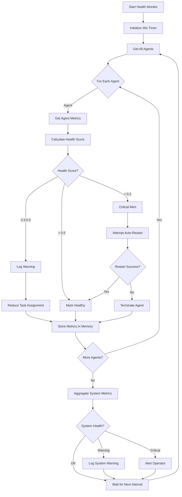
```mermaid
flowchart TD
    Start[Start Health Monitor] --> InitTimer[Initialize 30s Timer]
    InitTimer --> CheckAgents[Get All Agents]

    CheckAgents --> ForEach{For Each Agent}
    ForEach -->|Agent| GetMetrics[Get Agent Metrics]
    GetMetrics --> CalcScore[Calculate Health Score]

    CalcScore --> CheckThreshold{Health Score?}
    CheckThreshold -->|> 0.5| Healthy[Mark Healthy]
    CheckThreshold -->|0.3-0.5| Warning[Log Warning]
    CheckThreshold -->|< 0.3| Critical[Critical Alert]

    Warning --> ReduceTasks[Reduce Task Assignment]
    ReduceTasks --> StoreMetrics

    Critical --> AttemptRestart[Attempt Auto-Restart]
    AttemptRestart --> CheckRestart{Restart Success?}
    CheckRestart -->|Yes| Healthy
    CheckRestart -->|No| TerminateAgent[Terminate Agent]

    Healthy --> StoreMetrics[Store Metrics in Memory]
    TerminateAgent --> StoreMetrics

    StoreMetrics --> CheckMore{More Agents?}
    CheckMore -->|Yes| ForEach
    CheckMore -->|No| AggregateMetrics[Aggregate System Metrics]

    AggregateMetrics --> CheckSystem{System Health?}
    CheckSystem -->|OK| WaitTimer[Wait for Next Interval]
    CheckSystem -->|Warning| LogSystemWarning[Log System Warning]
    CheckSystem -->|Critical| AlertOperator[Alert Operator]

    LogSystemWarning --> WaitTimer
    AlertOperator --> WaitTimer
    WaitTimer --> CheckAgents
```

### 4.8 ConsensusService

**Responsibility:** Maintain consistency across distributed agents

```yaml
Algorithms Supported:
  - RAFT: Leader-based, ordered log, strong consistency
  - Byzantine: Adversarial tolerance, 2f+1 quorum
  - Gossip: Eventually consistent, epidemic dissemination
  - CRDT: Conflict-free replicated data types

RAFT Implementation (Default):
  - Leader Election: Bully algorithm with timeouts
  - Log Replication: Ordered append-only log
  - Commit Index: Track committed entries
  - Term Management: Monotonically increasing term numbers

Consensus Operations:
  - propose(proposal): Submit change for consensus
  - vote(proposalId, vote): Cast vote on proposal
  - commit(proposalId): Finalize and apply decision
  - status(): View current consensus state

Use Cases:
  - Task Assignment: Prevent duplicate assignments
  - Configuration Changes: Coordinate topology updates
  - Resource Allocation: Ensure fair distribution
  - Failure Detection: Agree on agent failures
  - Session Management: Coordinate session state

State Management:
  - Current Term: Integer (monotonic)
  - Voted For: Agent ID in current term
  - Log: Ordered list of committed operations
  - Commit Index: Last committed log entry
  - Last Applied: Last applied log entry

Performance Characteristics:
  - Consensus Latency: <5 seconds (target)
  - Throughput: 100 proposals/second
  - Quorum Size: Majority (N/2 + 1)
  - Leader Election Time: <10 seconds
```

**RAFT Consensus Flow:**

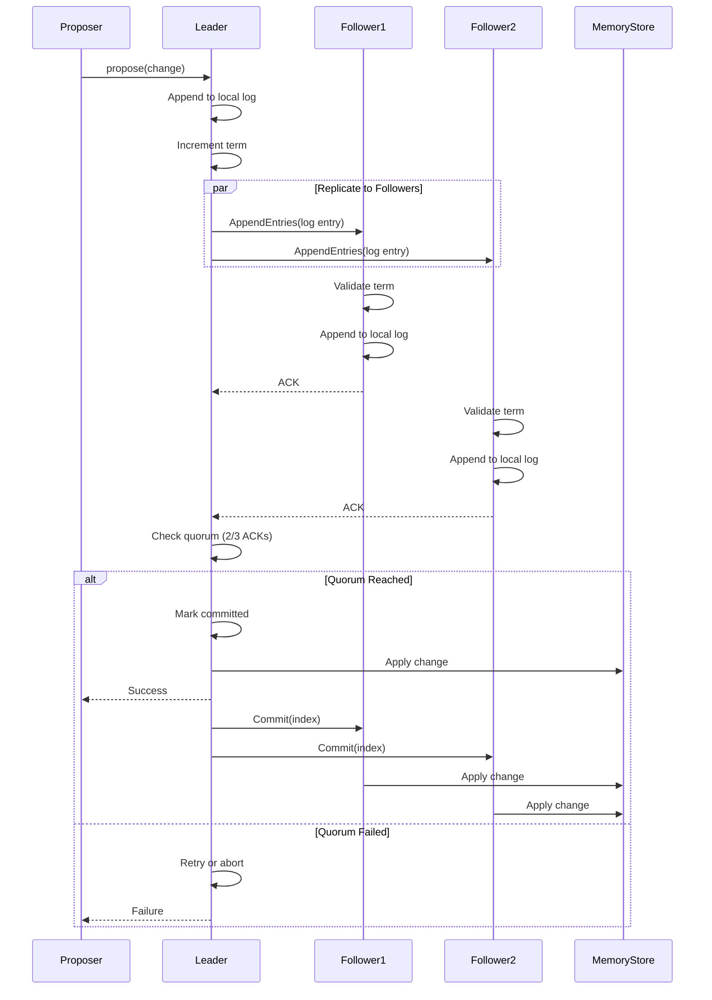
```mermaid
sequenceDiagram
    participant Proposer
    participant Leader
    participant Follower1
    participant Follower2
    participant MemoryStore

    Proposer->>Leader: propose(change)
    Leader->>Leader: Append to local log
    Leader->>Leader: Increment term

    par Replicate to Followers
        Leader->>Follower1: AppendEntries(log entry)
        Leader->>Follower2: AppendEntries(log entry)
    end

    Follower1->>Follower1: Validate term
    Follower1->>Follower1: Append to local log
    Follower1-->>Leader: ACK

    Follower2->>Follower2: Validate term
    Follower2->>Follower2: Append to local log
    Follower2-->>Leader: ACK

    Leader->>Leader: Check quorum (2/3 ACKs)
    alt Quorum Reached
        Leader->>Leader: Mark committed
        Leader->>MemoryStore: Apply change
        Leader-->>Proposer: Success
        Leader->>Follower1: Commit(index)
        Leader->>Follower2: Commit(index)
        Follower1->>MemoryStore: Apply change
        Follower2->>MemoryStore: Apply change
    else Quorum Failed
        Leader->>Leader: Retry or abort
        Leader-->>Proposer: Failure
    end
```

### 4.9 HookEngine

**Responsibility:** Event-driven automation via pre/post operation callbacks

```yaml
Hook Types:
  - pre-task: Before task execution
  - post-task: After task completion
  - pre-edit: Before file modification
  - post-edit: After file modification
  - pre-command: Before command execution
  - post-command: After command execution
  - session-start: Session initialization
  - session-end: Session termination
  - session-restore: Session recovery

Hook Execution Flow:
  1. Event triggered (e.g., task submitted)
  2. HookEngine identifies registered hooks
  3. Hooks executed in priority order
  4. Hook results collected
  5. Original operation continues or aborts based on hook results

Pre-Task Hooks (Automation):
  - Auto-assign agents by file type
  - Validate command for safety
  - Prepare resources (memory, connections)
  - Optimize topology based on complexity
  - Cache common searches

Post-Task Hooks (Automation):
  - Auto-format code (prettier, eslint)
  - Train neural patterns on success
  - Update shared memory with results
  - Analyze performance metrics
  - Track token usage
  - Generate summaries

Session Hooks:
  - session-start: Restore context from backup
  - session-end: Persist state and export metrics
  - session-restore: Reload memory and agents

Hook Configuration:
  - Priority: 1-100 (lower executes first)
  - Async: Run asynchronously without blocking
  - Timeout: Maximum execution time (default 10s)
  - Retry: Retry failed hooks (default 1)

Example Hook Registration:
  - Name: AutoFormatCode
  - Type: post-edit
  - Priority: 50
  - Action: Run prettier on edited files
  - Condition: File extension matches .js, .ts, .jsx, .tsx
```

**Hook Execution Sequence:**

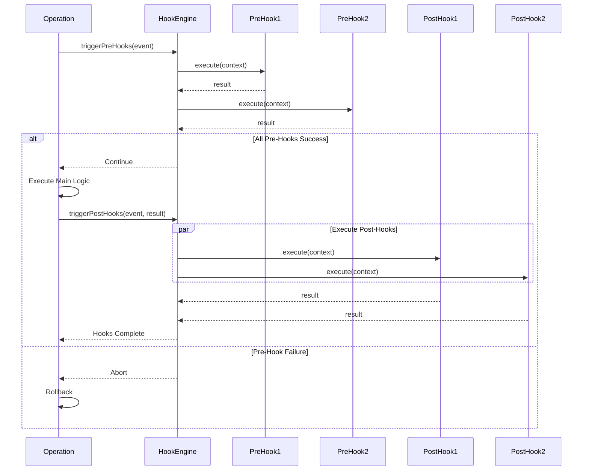
```mermaid
sequenceDiagram
    participant Operation
    participant HookEngine
    participant PreHook1
    participant PreHook2
    participant PostHook1
    participant PostHook2

    Operation->>HookEngine: triggerPreHooks(event)
    HookEngine->>PreHook1: execute(context)
    PreHook1-->>HookEngine: result
    HookEngine->>PreHook2: execute(context)
    PreHook2-->>HookEngine: result

    alt All Pre-Hooks Success
        HookEngine-->>Operation: Continue
        Operation->>Operation: Execute Main Logic
        Operation->>HookEngine: triggerPostHooks(event, result)

        par Execute Post-Hooks
            HookEngine->>PostHook1: execute(context)
            HookEngine->>PostHook2: execute(context)
        end

        PostHook1-->>HookEngine: result
        PostHook2-->>HookEngine: result
        HookEngine-->>Operation: Hooks Complete
    else Pre-Hook Failure
        HookEngine-->>Operation: Abort
        Operation->>Operation: Rollback
    end
```

### 4.10 NeuralTrainer

**Responsibility:** Learn patterns and optimize agent behavior

```yaml
Learning Framework:
  - SONA: Self-Organizing Neural Architecture
  - EWC++: Elastic Weight Consolidation (enhanced)
  - Semantic Drift Detection: Monitor pattern changes
  - Adaptive Learning Rate: Dynamic adjustment

Neural Features:
  - Pattern Storage: Searchable pattern database
  - Trajectory Recording: Track action sequences
  - Embedding Generation: Semantic embeddings for tasks
  - Performance Prediction: Predict task execution time
  - Anomaly Detection: Detect unusual patterns

Training Process:
  1. Start trajectory recording (trajectory-start)
  2. Record each action (trajectory-step)
  3. End trajectory with outcome (trajectory-end)
  4. Extract patterns from successful trajectories
  5. Store patterns in neural database
  6. Train model on collected data

Pattern Types:
  - Task Decomposition: How tasks are broken down
  - Agent Selection: Which agent types work best
  - Execution Strategy: Parallel vs sequential patterns
  - Error Recovery: Common failure recovery paths
  - Performance Optimization: Efficiency improvements

Storage:
  - Database: SQLite at .claude-flow/neural/patterns.db
  - Schema: patterns(id, type, data, score, timestamp)
  - Index: Full-text search on pattern data
  - Versioning: Pattern version tracking

Operations:
  - neural_train(data): Train on dataset
  - neural_predict(input): Predict outcome
  - neural_patterns(action): Store/retrieve patterns
  - neural_status(): View training status
  - neural_optimize(): Optimize model weights

Integration:
  - Auto-learning: Post-task hooks trigger learning
  - Prediction: Pre-task hooks predict performance
  - Optimization: Periodic model optimization
  - Sharing: Patterns shared across swarms
```

**Neural Learning Cycle:**


```mermaid
flowchart LR
    subgraph Collection
        A[Task Execution] --> B[Record Trajectory]
        B --> C[Capture Actions]
        C --> D[Store Outcome]
    end

    subgraph Analysis
        D --> E[Extract Patterns]
        E --> F[Calculate Scores]
        F --> G[Detect Anomalies]
    end

    subgraph Training
        G --> H[Update Model]
        H --> I[Consolidate Weights EWC++]
        I --> J[Validate Performance]
    end

    subgraph Application
        J --> K[Generate Predictions]
        K --> L[Optimize Strategies]
        L --> M[Improve Execution]
    end

    M --> A

    style Collection fill:#e3f2fd
    style Analysis fill:#fff3e0
    style Training fill:#f3e5f5
    style Application fill:#e8f5e9
```

---

## 5. Communication Protocols

### 5.1 Inter-Component Communication

```yaml
Communication Patterns:
  - Coordinator → Agents: Task assignment, commands
  - Agents → Coordinator: Status updates, results
  - Agents → Memory: State persistence
  - Coordinator → Memory: Configuration, coordination
  - Hooks → Components: Event notifications

Message Format:
  type: string               # Message type identifier
  correlationId: string      # Unique request ID
  timestamp: ISO8601        # Message timestamp
  source: string            # Sender identifier
  destination: string       # Receiver identifier
  payload: object           # Message-specific data
  metadata: object          # Optional metadata

Message Types:
  - TASK_ASSIGN: Assign task to agent
  - TASK_UPDATE: Update task progress
  - TASK_COMPLETE: Report task completion
  - HEALTH_CHECK: Request health status
  - HEALTH_REPORT: Report health metrics
  - MEMORY_STORE: Store data in memory
  - MEMORY_RETRIEVE: Retrieve data from memory
  - CONFIG_UPDATE: Configuration change
  - ALERT: System alert notification
```

**Message Flow Example (Task Assignment):**

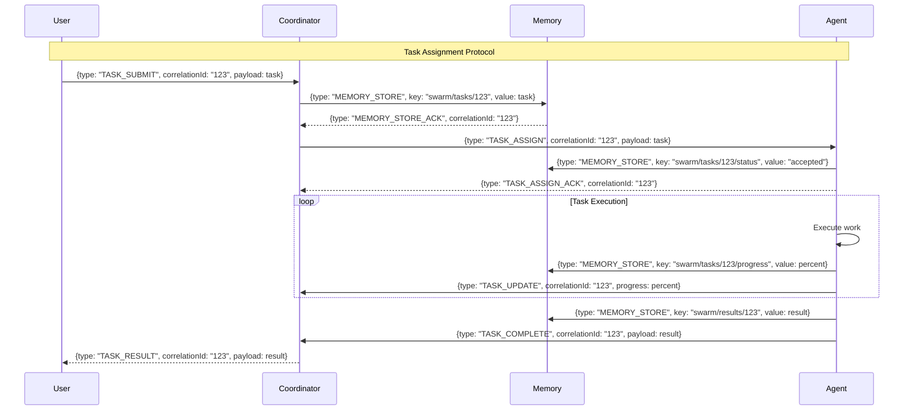
```mermaid
sequenceDiagram
    participant User
    participant Coordinator
    participant Memory
    participant Agent

    Note over User,Agent: Task Assignment Protocol

    User->>Coordinator: {type: "TASK_SUBMIT", correlationId: "123", payload: task}
    Coordinator->>Memory: {type: "MEMORY_STORE", key: "swarm/tasks/123", value: task}
    Memory-->>Coordinator: {type: "MEMORY_STORE_ACK", correlationId: "123"}

    Coordinator->>Agent: {type: "TASK_ASSIGN", correlationId: "123", payload: task}
    Agent->>Memory: {type: "MEMORY_STORE", key: "swarm/tasks/123/status", value: "accepted"}
    Agent-->>Coordinator: {type: "TASK_ASSIGN_ACK", correlationId: "123"}

    loop Task Execution
        Agent->>Agent: Execute work
        Agent->>Memory: {type: "MEMORY_STORE", key: "swarm/tasks/123/progress", value: percent}
        Agent->>Coordinator: {type: "TASK_UPDATE", correlationId: "123", progress: percent}
    end

    Agent->>Memory: {type: "MEMORY_STORE", key: "swarm/results/123", value: result}
    Agent->>Coordinator: {type: "TASK_COMPLETE", correlationId: "123", payload: result}
    Coordinator-->>User: {type: "TASK_RESULT", correlationId: "123", payload: result}
```

### 5.2 Memory-Based Message Passing

```yaml
Mechanism:
  - Shared JSON store acts as message bus
  - Components write messages to specific keys
  - Watchers poll or receive notifications
  - Atomic operations ensure consistency

Key Patterns for Messages:
  - swarm/messages/inbox/{agentId}: Agent-specific inbox
  - swarm/messages/broadcast: Broadcast to all agents
  - swarm/messages/coordinator: Messages to coordinator
  - swarm/messages/archive/{messageId}: Processed messages

Message Lifecycle:
  1. Sender writes message to memory key
  2. Receiver polls key or receives hook notification
  3. Receiver reads and processes message
  4. Receiver archives message (moves to archive key)
  5. Cleanup process removes old archived messages

Retry Strategy:
  - Max Retries: 3
  - Backoff: Exponential (1s, 2s, 4s)
  - Timeout: 30 seconds per attempt
  - Dead Letter: Move to swarm/messages/failed after max retries

Performance:
  - Polling Interval: 5 seconds (configurable)
  - Batch Size: 10 messages per read
  - Archive Retention: 24 hours
  - Cleanup Interval: 1 hour
```

### 5.3 Hook-Based Event Notifications

```yaml
Event Propagation:
  - Synchronous: Blocking until hook completes
  - Asynchronous: Fire-and-forget
  - Priority-based: Execute in priority order

Hook Callback Signature:
  function(context: HookContext): HookResult

  HookContext:
    - event: string (event type)
    - data: object (event data)
    - correlationId: string (request tracking)
    - timestamp: number (event timestamp)

  HookResult:
    - success: boolean
    - modified: object (modified data, optional)
    - abort: boolean (abort operation, optional)
    - error: string (error message, optional)

Pre-Hook Behavior:
  - All pre-hooks must succeed for operation to continue
  - Any pre-hook returning abort=true stops operation
  - Modified data from pre-hooks passed to operation
  - Pre-hooks execute in priority order (blocking)

Post-Hook Behavior:
  - Post-hooks execute after operation completes
  - Post-hooks cannot abort operation
  - Post-hooks execute in parallel (non-blocking)
  - Post-hook failures logged but don't affect operation

Error Handling:
  - Hook timeouts: 10 seconds default
  - Hook exceptions: Caught and logged
  - Critical hooks: Abort on failure
  - Non-critical hooks: Log and continue
```

**Hook Event Flow:**

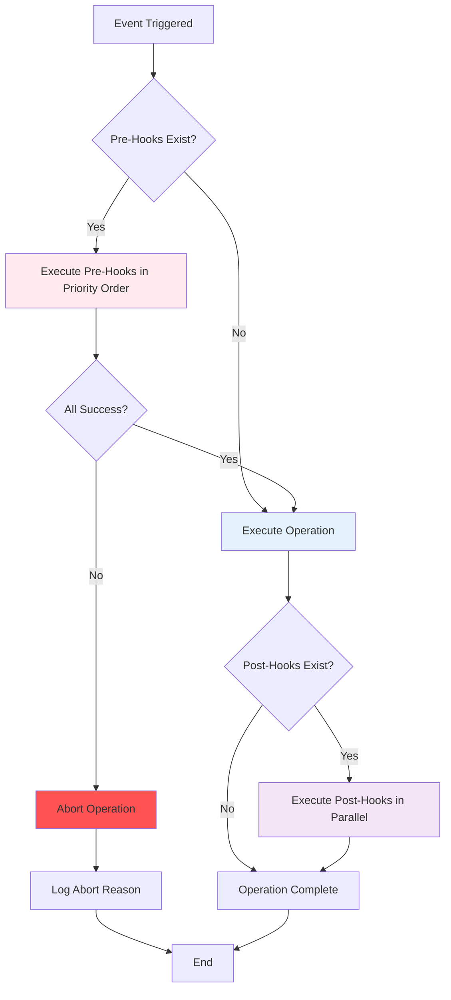
```mermaid
flowchart TD
    Event[Event Triggered] --> PreHooks{Pre-Hooks Exist?}
    PreHooks -->|Yes| ExecutePreHooks[Execute Pre-Hooks in Priority Order]
    PreHooks -->|No| ExecuteOp

    ExecutePreHooks --> CheckPreResult{All Success?}
    CheckPreResult -->|Yes| ExecuteOp[Execute Operation]
    CheckPreResult -->|No| Abort[Abort Operation]

    ExecuteOp --> PostHooks{Post-Hooks Exist?}
    PostHooks -->|Yes| ExecutePostHooks[Execute Post-Hooks in Parallel]
    PostHooks -->|No| Complete

    ExecutePostHooks --> Complete[Operation Complete]
    Abort --> LogAbort[Log Abort Reason]
    LogAbort --> End[End]
    Complete --> End

    style ExecutePreHooks fill:#ffebee
    style ExecuteOp fill:#e3f2fd
    style ExecutePostHooks fill:#f3e5f5
    style Abort fill:#ff5252
```

---

## 6. Data Flow Architecture

### 6.1 Task Execution Data Flow

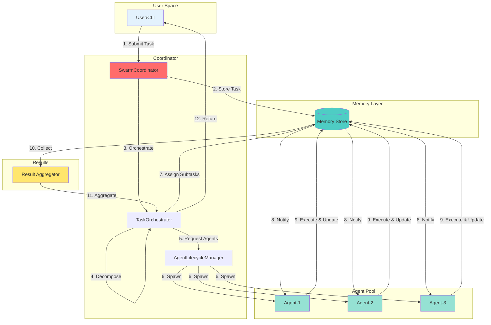
```mermaid
flowchart TB
    subgraph User Space
        U[User/CLI]
    end

    subgraph Coordinator
        C[SwarmCoordinator]
        TO[TaskOrchestrator]
        ALM[AgentLifecycleManager]
    end

    subgraph Memory Layer
        MS[(Memory Store)]
    end

    subgraph Agent Pool
        A1[Agent-1]
        A2[Agent-2]
        A3[Agent-3]
    end

    subgraph Results
        R[Result Aggregator]
    end

    U -->|1. Submit Task| C
    C -->|2. Store Task| MS
    C -->|3. Orchestrate| TO
    TO -->|4. Decompose| TO
    TO -->|5. Request Agents| ALM
    ALM -->|6. Spawn| A1
    ALM -->|6. Spawn| A2
    ALM -->|6. Spawn| A3
    TO -->|7. Assign Subtasks| MS
    MS -->|8. Notify| A1
    MS -->|8. Notify| A2
    MS -->|8. Notify| A3
    A1 -->|9. Execute & Update| MS
    A2 -->|9. Execute & Update| MS
    A3 -->|9. Execute & Update| MS
    MS -->|10. Collect| R
    R -->|11. Aggregate| TO
    TO -->|12. Return| U

    style U fill:#e3f2fd
    style C fill:#ff6b6b
    style MS fill:#4ecdc4
    style A1 fill:#95e1d3
    style A2 fill:#95e1d3
    style A3 fill:#95e1d3
    style R fill:#ffe66d
```

### 6.2 Memory State Transitions

```yaml
State Storage Pattern:
  - Configuration: Write-once, read-many
  - Agent Registry: Frequent updates
  - Task State: Lifecycle updates (queued → executing → completed)
  - Results: Write-once, read-once
  - Metrics: Time-series appends

State Transition Rules:
  Task State:
    - queued → executing (when agent assigned)
    - executing → completed (on success)
    - executing → failed (on error)
    - executing → timeout (on timeout)
    - Any state → cancelled (on manual cancel)

  Agent State:
    - spawning → idle (on registration)
    - idle → busy (on task assignment)
    - busy → idle (on task completion)
    - Any state → degraded (on health drop)
    - degraded → terminated (on critical health)

  Swarm State:
    - initializing → operational (after validation)
    - operational → degraded (on component failure)
    - degraded → operational (on recovery)
    - Any state → shutdown (on shutdown command)

Consistency Maintenance:
  - Atomic Updates: Use file locking for writes
  - Version Tracking: Increment version on each write
  - Conflict Resolution: Last-write-wins by default
  - Validation: Schema validation before writes
  - Rollback: Maintain backup for critical operations
```

**Task State Machine:**

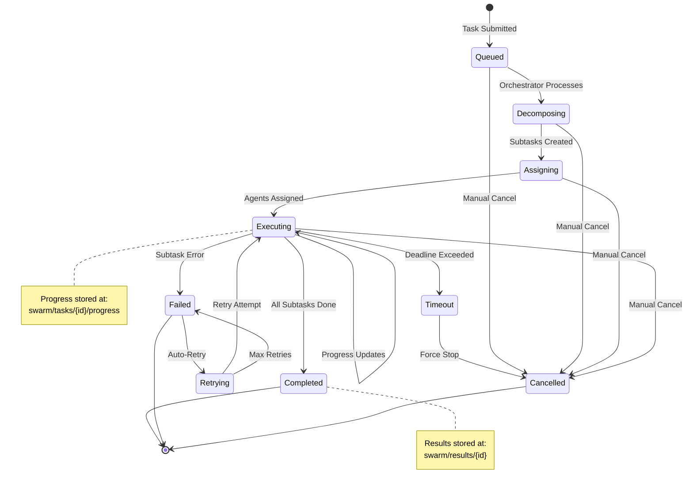
```mermaid
stateDiagram-v2
    [*] --> Queued: Task Submitted
    Queued --> Decomposing: Orchestrator Processes
    Decomposing --> Assigning: Subtasks Created
    Assigning --> Executing: Agents Assigned

    Executing --> Executing: Progress Updates
    Executing --> Completed: All Subtasks Done
    Executing --> Failed: Subtask Error
    Executing --> Timeout: Deadline Exceeded

    Failed --> Retrying: Auto-Retry
    Retrying --> Executing: Retry Attempt
    Retrying --> Failed: Max Retries

    Timeout --> Cancelled: Force Stop

    Queued --> Cancelled: Manual Cancel
    Decomposing --> Cancelled: Manual Cancel
    Assigning --> Cancelled: Manual Cancel
    Executing --> Cancelled: Manual Cancel

    Completed --> [*]
    Failed --> [*]
    Cancelled --> [*]

    note right of Executing
        Progress stored at:
        swarm/tasks/{id}/progress
    end note

    note right of Completed
        Results stored at:
        swarm/results/{id}
    end note
```

### 6.3 Health Metrics Flow

```yaml
Metrics Collection Pipeline:
  1. Source: Agent reports metrics during execution
  2. Storage: Metrics stored in memory at swarm/metrics/{agentId}
  3. Aggregation: HealthMonitor aggregates every 30 seconds
  4. Analysis: Calculate health scores and detect anomalies
  5. Alerting: Trigger alerts on threshold violations
  6. Persistence: Periodic snapshot to disk

Metrics Schema:
  agentId: string
  timestamp: ISO8601
  healthScore: number (0.0-1.0)
  taskCount: number
  successCount: number
  failureCount: number
  avgExecutionTime: number (ms)
  memoryUsage: number (bytes)
  cpuUsage: number (percentage)
  status: string (idle|busy|degraded|terminated)

Time-Series Storage:
  - Granularity: Per-agent, per-interval (30s)
  - Retention: 24 hours detailed, 7 days aggregated
  - Aggregation: Min, max, avg, p50, p95, p99
  - Storage: Append-only JSON array

Query Patterns:
  - Get current health: Latest entry per agent
  - Health history: Time-series query with range
  - System-wide health: Aggregate across all agents
  - Performance trends: Calculate moving averages
```

**Metrics Collection Flow:**

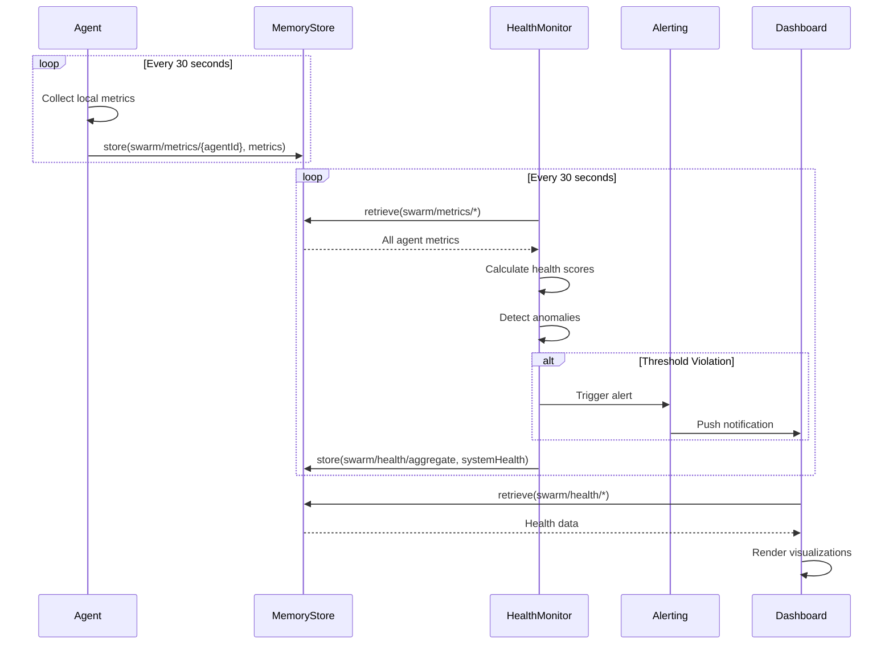
```mermaid
sequenceDiagram
    participant Agent
    participant MemoryStore
    participant HealthMonitor
    participant Alerting
    participant Dashboard

    loop Every 30 seconds
        Agent->>Agent: Collect local metrics
        Agent->>MemoryStore: store(swarm/metrics/{agentId}, metrics)
    end

    loop Every 30 seconds
        HealthMonitor->>MemoryStore: retrieve(swarm/metrics/*)
        MemoryStore-->>HealthMonitor: All agent metrics
        HealthMonitor->>HealthMonitor: Calculate health scores
        HealthMonitor->>HealthMonitor: Detect anomalies

        alt Threshold Violation
            HealthMonitor->>Alerting: Trigger alert
            Alerting->>Dashboard: Push notification
        end

        HealthMonitor->>MemoryStore: store(swarm/health/aggregate, systemHealth)
    end

    Dashboard->>MemoryStore: retrieve(swarm/health/*)
    MemoryStore-->>Dashboard: Health data
    Dashboard->>Dashboard: Render visualizations
```

---

## 7. Deployment Architecture

### 7.1 Deployment Topology

```yaml
Deployment Environment:
  - Runtime: Node.js v18+ process
  - Process Manager: PM2 or systemd
  - Working Directory: /home/delorenj/code/33GOD
  - Data Directory: .claude-flow/
  - Logs Directory: logs/

Process Structure:
  - Main Process: SwarmCoordinator
  - Child Processes: Agent instances (spawned via Task tool)
  - Background Workers: Health monitor, metrics collector
  - Scheduled Jobs: Cleanup, backup, optimization

File Structure:
  .claude-flow/
    ├── memory/
    │   └── store.json              # Primary memory store
    ├── sessions/
    │   └── swarm-*/                # Session backups
    ├── neural/
    │   └── patterns.db             # Neural patterns
    ├── logs/
    │   ├── coordinator.log         # Coordinator logs
    │   └── agents/                 # Per-agent logs
    └── config/
        └── swarm.config.json       # Swarm configuration

Dependencies:
  - Node.js: Runtime environment
  - claude-flow@alpha: MCP coordination tools
  - Claude Code: Agent execution engine
  - SQLite: Neural pattern storage
  - (Optional) RabbitMQ: Event bus integration
  - (Optional) Candybar: Service registry
```

**Deployment Diagram:**

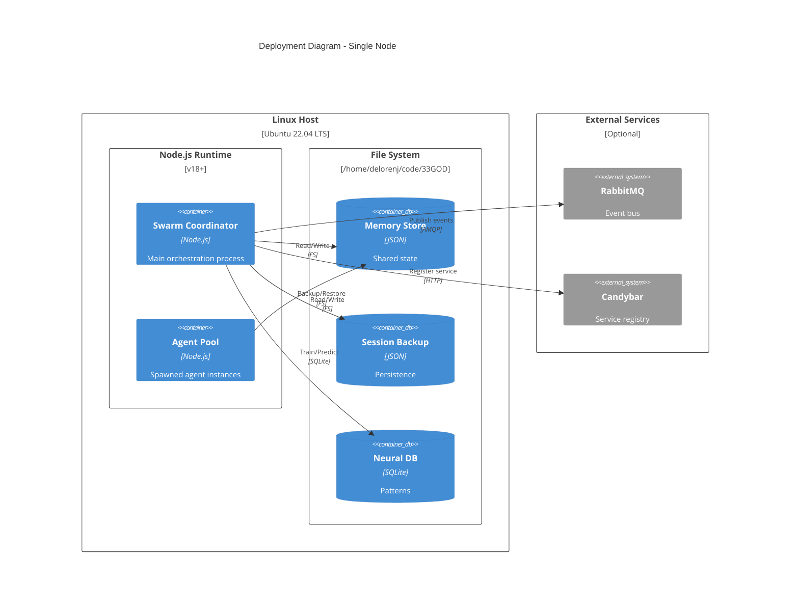
```mermaid
C4Deployment
    title Deployment Diagram - Single Node

    Deployment_Node(host, "Linux Host", "Ubuntu 22.04 LTS") {
        Deployment_Node(nodejs, "Node.js Runtime", "v18+") {
            Container(coordinator, "Swarm Coordinator", "Node.js", "Main orchestration process")
            Container(agents, "Agent Pool", "Node.js", "Spawned agent instances")
        }

        Deployment_Node(filesystem, "File System", "/home/delorenj/code/33GOD") {
            ContainerDb(memory, "Memory Store", "JSON", "Shared state")
            ContainerDb(sessions, "Session Backup", "JSON", "Persistence")
            ContainerDb(neural, "Neural DB", "SQLite", "Patterns")
        }
    }

    Deployment_Node(external, "External Services", "Optional") {
        System_Ext(rabbitmq, "RabbitMQ", "Event bus")
        System_Ext(candybar, "Candybar", "Service registry")
    }

    Rel(coordinator, memory, "Read/Write", "FS")
    Rel(coordinator, sessions, "Backup/Restore", "FS")
    Rel(coordinator, neural, "Train/Predict", "SQLite")
    Rel(agents, memory, "Read/Write", "FS")
    Rel(coordinator, rabbitmq, "Publish events", "AMQP")
    Rel(coordinator, candybar, "Register service", "HTTP")
```

### 7.2 Startup Sequence

```yaml
Phase 1: Initialization
  1. Load configuration from swarm.config.json
  2. Validate required directories exist
  3. Initialize memory store (create if missing)
  4. Restore session if session-id provided
  5. Initialize neural training system

Phase 2: Component Activation
  6. Start TopologyManager and load topology
  7. Start MemoryManager and connect to store
  8. Start ConsensusService and elect leader
  9. Start TaskOrchestrator with strategy
  10. Start AgentLifecycleManager with pool

Phase 3: Monitoring & Hooks
  11. Start HealthMonitor with 30s interval
  12. Register pre/post hooks
  13. Initialize alerting thresholds
  14. Start metrics collection

Phase 4: Validation
  15. Run health checks on all components
  16. Validate memory store accessibility
  17. Test agent spawning (spawn 1 test agent)
  18. Verify hook execution

Phase 5: Go-Live
  19. Mark swarm as operational
  20. Log startup metrics
  21. Register with service registry (if configured)
  22. Begin accepting tasks

Startup Time: <10 seconds (target)
```

**Startup Sequence Diagram:**

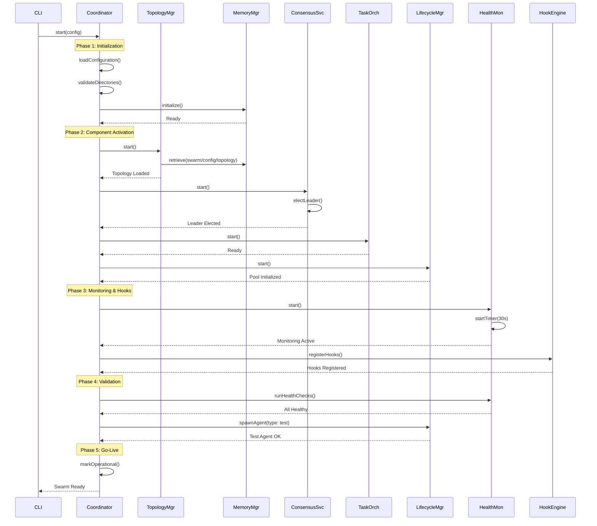
```mermaid
sequenceDiagram
    participant CLI
    participant Coordinator
    participant TopologyMgr
    participant MemoryMgr
    participant ConsensusSvc
    participant TaskOrch
    participant LifecycleMgr
    participant HealthMon
    participant HookEngine

    CLI->>Coordinator: start(config)

    Note over Coordinator: Phase 1: Initialization
    Coordinator->>Coordinator: loadConfiguration()
    Coordinator->>Coordinator: validateDirectories()
    Coordinator->>MemoryMgr: initialize()
    MemoryMgr-->>Coordinator: Ready

    Note over Coordinator: Phase 2: Component Activation
    Coordinator->>TopologyMgr: start()
    TopologyMgr->>MemoryMgr: retrieve(swarm/config/topology)
    TopologyMgr-->>Coordinator: Topology Loaded

    Coordinator->>ConsensusSvc: start()
    ConsensusSvc->>ConsensusSvc: electLeader()
    ConsensusSvc-->>Coordinator: Leader Elected

    Coordinator->>TaskOrch: start()
    TaskOrch-->>Coordinator: Ready

    Coordinator->>LifecycleMgr: start()
    LifecycleMgr-->>Coordinator: Pool Initialized

    Note over Coordinator: Phase 3: Monitoring & Hooks
    Coordinator->>HealthMon: start()
    HealthMon->>HealthMon: startTimer(30s)
    HealthMon-->>Coordinator: Monitoring Active

    Coordinator->>HookEngine: registerHooks()
    HookEngine-->>Coordinator: Hooks Registered

    Note over Coordinator: Phase 4: Validation
    Coordinator->>HealthMon: runHealthChecks()
    HealthMon-->>Coordinator: All Healthy

    Coordinator->>LifecycleMgr: spawnAgent(type: test)
    LifecycleMgr-->>Coordinator: Test Agent OK

    Note over Coordinator: Phase 5: Go-Live
    Coordinator->>Coordinator: markOperational()
    Coordinator-->>CLI: Swarm Ready
```

### 7.3 Shutdown Sequence

```yaml
Graceful Shutdown Process:
  1. Mark swarm as shutting down (reject new tasks)
  2. Wait for active tasks to complete (timeout 60s)
  3. Force interrupt tasks still running after timeout
  4. Collect final metrics and health data
  5. Execute session-end hooks
  6. Persist memory store to disk
  7. Backup session state
  8. Terminate all agents
  9. Stop monitoring and background workers
  10. Deregister from service registry
  11. Close consensus connections
  12. Archive logs
  13. Exit process

Shutdown Timeout: 90 seconds max
Force Shutdown: SIGKILL after timeout

Emergency Shutdown (SIGTERM):
  1. Immediately stop accepting tasks
  2. Persist critical state (memory store)
  3. Terminate all processes
  4. Exit within 10 seconds
```

**Shutdown Sequence Diagram:**

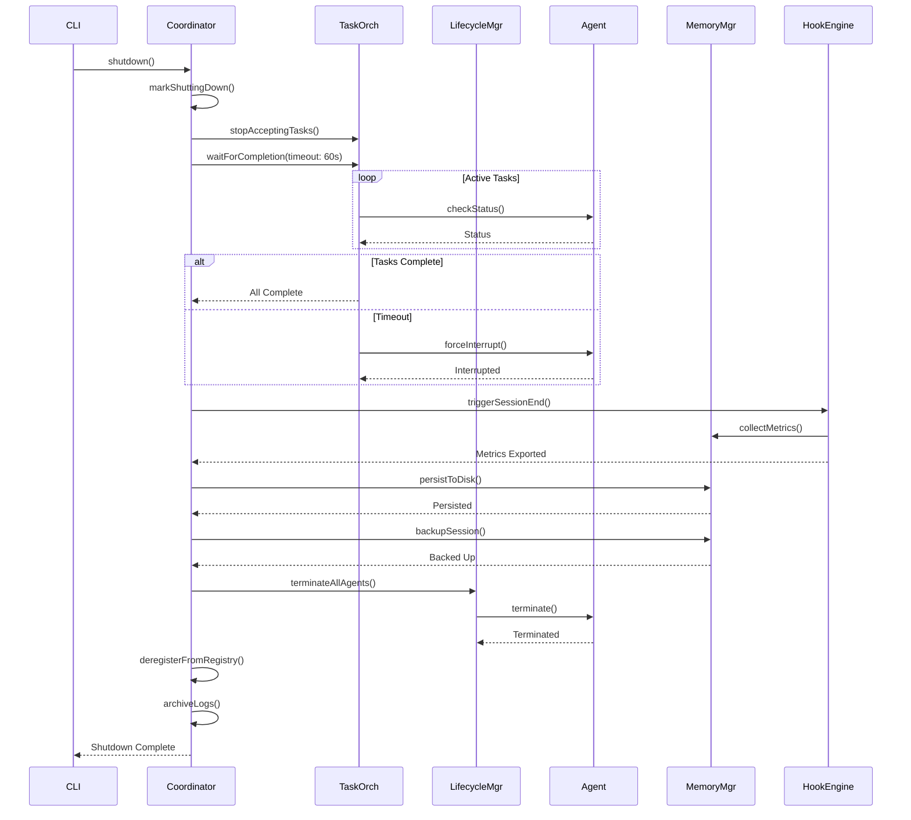
```mermaid
sequenceDiagram
    participant CLI
    participant Coordinator
    participant TaskOrch
    participant LifecycleMgr
    participant Agent
    participant MemoryMgr
    participant HookEngine

    CLI->>Coordinator: shutdown()

    Coordinator->>Coordinator: markShuttingDown()
    Coordinator->>TaskOrch: stopAcceptingTasks()

    Coordinator->>TaskOrch: waitForCompletion(timeout: 60s)
    loop Active Tasks
        TaskOrch->>Agent: checkStatus()
        Agent-->>TaskOrch: Status
    end

    alt Tasks Complete
        TaskOrch-->>Coordinator: All Complete
    else Timeout
        TaskOrch->>Agent: forceInterrupt()
        Agent-->>TaskOrch: Interrupted
    end

    Coordinator->>HookEngine: triggerSessionEnd()
    HookEngine->>MemoryMgr: collectMetrics()
    HookEngine-->>Coordinator: Metrics Exported

    Coordinator->>MemoryMgr: persistToDisk()
    MemoryMgr-->>Coordinator: Persisted

    Coordinator->>MemoryMgr: backupSession()
    MemoryMgr-->>Coordinator: Backed Up

    Coordinator->>LifecycleMgr: terminateAllAgents()
    LifecycleMgr->>Agent: terminate()
    Agent-->>LifecycleMgr: Terminated

    Coordinator->>Coordinator: deregisterFromRegistry()
    Coordinator->>Coordinator: archiveLogs()
    Coordinator-->>CLI: Shutdown Complete
```

---

## 8. Security Architecture

### 8.1 Security Principles

```yaml
Core Principles:
  - Least Privilege: Agents have minimal required permissions
  - Defense in Depth: Multiple layers of security controls
  - Fail Secure: Default to deny on error
  - Auditability: All operations logged with correlation IDs
  - Data Protection: Sensitive data encrypted at rest

Threat Model:
  - Malicious Agent: Agent attempts unauthorized operations
  - Memory Corruption: Attacker corrupts shared memory
  - Resource Exhaustion: DoS via resource consumption
  - Information Disclosure: Sensitive data leaked in logs/memory
  - Privilege Escalation: Agent gains unauthorized permissions

Security Controls:
  - Authentication: Agent identity verification
  - Authorization: Permission-based access control
  - Input Validation: Sanitize all inputs
  - Rate Limiting: Prevent resource exhaustion
  - Encryption: Sensitive data encrypted
  - Audit Logging: Comprehensive operation logs
```

### 8.2 Access Control

```yaml
Agent Permissions:
  - Read Own Tasks: Agent can read assigned tasks
  - Write Own Status: Agent can update own status
  - Read Shared Memory: Agent can read public memory keys
  - Write Restricted Memory: Agent can write to swarm/agents/{agentId}/*
  - No Direct Agent Communication: Agents cannot message each other directly
  - No Configuration Changes: Agents cannot modify topology/config

Coordinator Permissions:
  - Full Memory Access: Coordinator can read/write all memory
  - Agent Management: Spawn, monitor, terminate agents
  - Configuration Management: Modify topology and settings
  - Task Distribution: Assign tasks to agents
  - Metrics Collection: Access all agent metrics

Memory Key Permissions:
  - swarm/config/*: Coordinator only (read-only after init)
  - swarm/agents/{agentId}/*: Owner agent + coordinator
  - swarm/tasks/*: Coordinator write, agents read assigned
  - swarm/results/*: Agents write, coordinator read
  - swarm/metrics/*: Agents write own, coordinator read all
  - coordination/*: Coordinator only

Permission Enforcement:
  - Memory Manager validates permissions on every access
  - Denied operations logged with agent ID and attempted action
  - Repeated violations trigger agent health degradation
  - Critical violations result in immediate agent termination
```

**Access Control Matrix:**

| Principal | swarm/config | swarm/agents/{own} | swarm/agents/{other} | swarm/tasks | swarm/results | swarm/metrics/{own} | swarm/metrics/{other} |
|-----------|--------------|-------------------|---------------------|-------------|---------------|--------------------|--------------------|
| **Coordinator** | RW | RW | RW | RW | RW | R | R |
| **Agent (Self)** | R | RW | - | R (assigned) | W (own) | W | - |
| **Agent (Other)** | R | - | - | - | - | - | - |
| **Anonymous** | - | - | - | - | - | - | - |

### 8.3 Data Protection

```yaml
Encryption:
  - At Rest: Session backups encrypted with AES-256
  - In Transit: Not applicable (local memory, no network)
  - Key Management: Keys stored in environment variables
  - Key Rotation: Manual rotation recommended every 90 days

Sensitive Data Handling:
  - API Keys: Never stored in memory, only in environment
  - User Credentials: Not handled by swarm (external auth)
  - Agent State: Contains task data, treat as confidential
  - Session Backups: Encrypted, restricted file permissions
  - Logs: Sanitized to remove sensitive data

Data Classification:
  - Public: Topology configuration, agent types
  - Internal: Task descriptions, agent status
  - Confidential: Agent metrics, execution results
  - Restricted: Session backups, neural patterns

Data Lifecycle:
  - Retention: 7 days for logs, 30 days for sessions
  - Archival: Compress and archive after retention period
  - Deletion: Secure deletion (shred) for sensitive files
  - Backup: Daily incremental, weekly full backup

File Permissions (Unix):
  - Coordinator: 700 (rwx------)
  - Memory Store: 600 (rw-------)
  - Session Backups: 600 (rw-------)
  - Logs: 644 (rw-r--r--)
  - Configuration: 600 (rw-------)
```

### 8.4 Audit Logging

```yaml
Log Levels:
  - DEBUG: Detailed trace information
  - INFO: General informational messages
  - WARN: Warning conditions
  - ERROR: Error conditions
  - CRITICAL: Critical system failures

Logged Events:
  - Swarm Initialization: Startup parameters and configuration
  - Agent Lifecycle: Spawn, register, terminate
  - Task Management: Submit, assign, complete, fail
  - Memory Operations: Store, retrieve, delete (keys only, not values)
  - Configuration Changes: Topology, consensus, settings
  - Security Events: Permission denials, validation failures
  - Health Events: Agent degradation, system alerts
  - Shutdown: Graceful or forced shutdown

Log Entry Format:
  timestamp: ISO8601
  level: string (DEBUG|INFO|WARN|ERROR|CRITICAL)
  correlationId: string (UUID)
  component: string (e.g., TaskOrchestrator)
  event: string (e.g., TASK_ASSIGN)
  message: string (human-readable)
  metadata: object (structured data)

Log Storage:
  - File: logs/coordinator.log (rotated daily)
  - Retention: 7 days
  - Format: JSON Lines (newline-delimited JSON)
  - Rotation: Daily at midnight, max 10 files
  - Size Limit: 100MB per file

Security:
  - No sensitive data in logs (sanitized)
  - Restricted file permissions (644)
  - Tamper detection (file checksums)
  - Log forwarding to SIEM (optional)
```

**Audit Log Flow:**

```mermaid
flowchart LR
    subgraph Components
        C[Coordinator]
        A[Agent]
        M[MemoryManager]
        H[HealthMonitor]
    end

    subgraph Logger
        L[Log Aggregator]
        F[Filter/Sanitize]
        E[Enrichment]
    end

    subgraph Storage
        LF[(Log File)]
        SIEM[SIEM/External]
    end

    C -->|Log event| L
    A -->|Log event| L
    M -->|Log event| L
    H -->|Log event| L

    L --> F
    F --> E
    E --> LF
    E -.Optional.-> SIEM

    style L fill:#4ecdc4
    style F fill:#ffe66d
    style E fill:#95e1d3
```

---

## 9. Scalability & Performance

### 9.1 Scalability Limits

```yaml
Current Architecture Limits:
  - Maximum Agents: 100 (configurable)
  - Optimal Agent Count: 5-20
  - Task Queue Depth: 1000 max
  - Memory Store Size: 5GB max (file-based limitation)
  - Concurrent Tasks per Agent: 5 max
  - Task Assignment Latency: <500ms (target)
  - Memory Operation Latency: <50ms (target)

Bottleneck Analysis:
  - Coordinator: Single point of coordination (no horizontal scaling)
  - Memory Store: File-based I/O limits throughput
  - Agent Spawning: Sequential spawning limits startup speed
  - Health Monitoring: Polling-based, scales linearly with agent count
  - Consensus: RAFT requires majority quorum, increases latency with size

Scaling Strategies:
  - Vertical Scaling: Increase CPU/memory of host machine
  - Agent Pool: Pre-spawn warm agents to reduce latency
  - Memory Caching: In-memory cache reduces disk I/O
  - Batch Operations: Group operations to reduce overhead
  - Async Communication: Non-blocking message passing
```

**Performance Characteristics by Agent Count:**

| Agent Count | Coordinator CPU | Memory Usage | Task Assignment Latency | Health Check Latency | Throughput (tasks/min) |
|-------------|----------------|--------------|------------------------|---------------------|------------------------|
| 1-5 | <10% | <200MB | <100ms | <1s | 50 |
| 6-10 | 10-20% | 200-500MB | <200ms | <2s | 100 |
| 11-20 | 20-40% | 500MB-1GB | <500ms | <5s | 200 |
| 21-50 | 40-70% | 1-2GB | <1s | <10s | 400 |
| 51-100 | 70-90% | 2-5GB | <2s | <15s | 600 |

### 9.2 Performance Optimization Strategies

```yaml
Memory Optimization:
  - Lazy Loading: Load memory keys on-demand
  - Compression: Gzip large memory values
  - Expiration: Auto-delete old entries (TTL)
  - Batch Reads: Group multiple retrieves into single I/O
  - Indexing: In-memory index for fast key lookup

Agent Optimization:
  - Warm Pool: Pre-spawn 3 agents of common types
  - Task Batching: Group small tasks into batches
  - Resource Pooling: Reuse agent instances
  - Idle Timeout: Terminate idle agents after 5 minutes
  - Priority Queue: High-priority tasks skip queue

Communication Optimization:
  - Async Hooks: Non-blocking post-operation hooks
  - Message Batching: Group messages into batches
  - Polling Optimization: Adaptive polling interval
  - Event Coalescing: Merge duplicate events
  - Buffer Management: Pre-allocate message buffers

Monitoring Optimization:
  - Sampling: Sample metrics instead of collecting all
  - Aggregation: Pre-aggregate metrics before storage
  - Snapshot Compression: Compress historical snapshots
  - Metric Filtering: Only store important metrics
  - Lazy Computation: Compute derived metrics on-demand

Consensus Optimization:
  - Batch Proposals: Group changes into single proposal
  - Read-only Queries: Bypass consensus for reads
  - Lease-based: Leader leases reduce election frequency
  - Pipeline: Pipeline multiple proposals
  - Fast Path: Optimize common case (no conflicts)
```

**Performance Tuning Checklist:**

```mermaid
flowchart TD
    Start[Performance Issue] --> Identify{Identify Bottleneck}

    Identify -->|Coordinator CPU| ReducePolling[Reduce Polling Frequency]
    Identify -->|Memory Usage| EnableCompression[Enable Compression]
    Identify -->|Task Latency| WarmPool[Enable Warm Agent Pool]
    Identify -->|I/O Wait| CacheReads[Increase Memory Cache]
    Identify -->|Agent Spawn Time| PreSpawn[Pre-spawn Common Agents]

    ReducePolling --> Measure[Measure Impact]
    EnableCompression --> Measure
    WarmPool --> Measure
    CacheReads --> Measure
    PreSpawn --> Measure

    Measure --> Check{Performance Improved?}
    Check -->|Yes| Document[Document Change]
    Check -->|No| Rollback[Rollback Change]

    Document --> End[Done]
    Rollback --> Identify

    style Identify fill:#ff6b6b
    style Measure fill:#4ecdc4
    style Check fill:#ffe66d
```

### 9.3 Capacity Planning

```yaml
Resource Requirements per Agent:
  - CPU: 0.5 core (nominal), 1 core (burst)
  - Memory: 100MB (nominal), 500MB (max)
  - Disk I/O: 10 IOPS (nominal), 50 IOPS (burst)
  - Network: Not applicable (local only)

Coordinator Resource Requirements:
  - CPU: 1 core (nominal), 2 cores (peak)
  - Memory: 500MB (base) + (agentCount * 50MB)
  - Disk Space: 1GB (base) + (agentCount * 100MB)
  - Disk I/O: 100 IOPS (nominal), 500 IOPS (peak)

Capacity Planning Formula:
  Total CPU = 1 + (agentCount * 0.5) cores
  Total Memory = 500 + (agentCount * 100) MB
  Total Disk = 1 + (agentCount * 0.1) GB
  Total IOPS = 100 + (agentCount * 10)

Example Configurations:
  Small (5 agents):
    - CPU: 3.5 cores
    - Memory: 1GB
    - Disk: 1.5GB
    - IOPS: 150
    - Host: 4-core, 2GB RAM

  Medium (20 agents):
    - CPU: 11 cores
    - Memory: 2.5GB
    - Disk: 3GB
    - IOPS: 300
    - Host: 16-core, 4GB RAM

  Large (100 agents):
    - CPU: 51 cores
    - Memory: 10.5GB
    - Disk: 11GB
    - IOPS: 1100
    - Host: 64-core, 16GB RAM

Growth Planning:
  - Monitor actual resource usage
  - Plan for 2x growth capacity
  - Scale vertically before horizontally
  - Consider distributed architecture at 50+ agents
```

---

## 10. Resilience & Recovery

### 10.1 Failure Modes

```yaml
Failure Categories:
  1. Agent Failures: Agent crashes, hangs, or becomes unresponsive
  2. Coordinator Failures: Coordinator crashes or becomes unavailable
  3. Memory Corruption: Shared memory becomes inconsistent
  4. Communication Failures: Message passing fails or times out
  5. Resource Exhaustion: CPU, memory, or disk exhausted
  6. External Service Failures: Bloodbank, Candybar unavailable

Failure Detection:
  - Agent Failures: Health checks, task timeouts
  - Coordinator Failures: Process monitoring (PM2/systemd)
  - Memory Corruption: Checksum validation, consistency checks
  - Communication Failures: Message timeouts, retry exhaustion
  - Resource Exhaustion: Threshold-based monitoring
  - External Services: HTTP health endpoints, connection timeouts

Detection Latency:
  - Agent Failures: <30 seconds (health check interval)
  - Coordinator Failures: <10 seconds (process monitor)
  - Memory Corruption: Immediate (on access)
  - Communication Failures: <30 seconds (message timeout)
  - Resource Exhaustion: <60 seconds (monitoring interval)
```

### 10.2 Recovery Strategies

```yaml
Agent Failure Recovery:
  Strategy: Auto-restart with backoff
  Steps:
    1. Detect failure via health check
    2. Mark agent as degraded
    3. Attempt restart (max 3 retries)
    4. Backoff: 1s, 5s, 15s between retries
    5. If all retries fail, terminate agent
    6. Reassign tasks to healthy agents
  Recovery Time: <60 seconds
  Data Loss: Minimal (task progress preserved in memory)

Coordinator Failure Recovery:
  Strategy: Process restart via PM2/systemd
  Steps:
    1. Process monitor detects crash
    2. Automatic restart initiated
    3. Load configuration and topology
    4. Restore session from backup
    5. Reconnect to memory store
    6. Resume monitoring and orchestration
  Recovery Time: <2 minutes
  Data Loss: None (state persisted to disk)

Memory Corruption Recovery:
  Strategy: Rollback to last known good
  Steps:
    1. Detect corruption via checksum
    2. Halt all write operations
    3. Restore from most recent backup
    4. Validate restored data
    5. Resume operations
    6. Log corruption event for analysis
  Recovery Time: <5 minutes
  Data Loss: Up to 60 seconds (last snapshot)

Communication Failure Recovery:
  Strategy: Retry with exponential backoff
  Steps:
    1. Detect timeout on message send
    2. Retry with backoff (1s, 2s, 4s)
    3. If all retries fail, move to dead letter
    4. Alert coordinator of failure
    5. Coordinator reassigns task
  Recovery Time: <30 seconds
  Data Loss: None (idempotent operations)

Resource Exhaustion Recovery:
  Strategy: Throttle and garbage collect
  Steps:
    1. Detect threshold violation
    2. Stop accepting new tasks
    3. Trigger garbage collection
    4. Terminate idle agents
    5. Wait for resources to free
    6. Resume operations when healthy
  Recovery Time: <5 minutes
  Data Loss: None (existing tasks complete)
```

**Failure Recovery Decision Tree:**

```mermaid
flowchart TD
    Failure[Failure Detected] --> Identify{Identify Type}

    Identify -->|Agent Failure| AgentRestart[Auto-restart Agent]
    Identify -->|Coordinator Failure| CoordRestart[Process Restart]
    Identify -->|Memory Corruption| MemRestore[Restore from Backup]
    Identify -->|Communication Failure| Retry[Retry with Backoff]
    Identify -->|Resource Exhaustion| Throttle[Throttle Operations]

    AgentRestart --> CheckAgentRetry{Retry Count < 3?}
    CheckAgentRetry -->|Yes| WaitBackoff[Wait Backoff Period]
    CheckAgentRetry -->|No| TerminateAgent[Terminate Agent]
    WaitBackoff --> AgentRestart
    TerminateAgent --> Reassign[Reassign Tasks]

    CoordRestart --> RestoreSession[Restore Session]
    RestoreSession --> ResumeOps[Resume Operations]

    MemRestore --> Validate[Validate Data]
    Validate --> CheckValid{Data Valid?}
    CheckValid -->|Yes| ResumeOps
    CheckValid -->|No| AlertOperator[Alert Operator]

    Retry --> CheckRetryCount{Retry Count < 3?}
    CheckRetryCount -->|Yes| WaitBackoff
    CheckRetryCount -->|No| DeadLetter[Move to Dead Letter]
    DeadLetter --> Reassign

    Throttle --> GC[Garbage Collection]
    GC --> TerminateIdle[Terminate Idle Agents]
    TerminateIdle --> WaitRecover[Wait for Recovery]
    WaitRecover --> CheckResources{Resources OK?}
    CheckResources -->|Yes| ResumeOps
    CheckResources -->|No| WaitRecover

    Reassign --> End[Recovery Complete]
    ResumeOps --> End
    AlertOperator --> End

    style Identify fill:#ff6b6b
    style End fill:#4ecdc4
```

### 10.3 High Availability Considerations

```yaml
Current Availability:
  - Single Point of Failure: Coordinator (no HA)
  - Estimated Uptime: 99% (3.65 days downtime/year)
  - Recovery Time Objective (RTO): <5 minutes
  - Recovery Point Objective (RPO): <60 seconds

Limitations:
  - No active-passive failover
  - No active-active clustering
  - Manual intervention required for coordinator recovery
  - Session state loss possible if backup fails

Future HA Improvements (Not Implemented):
  - Active-Passive: Standby coordinator with health checks
  - Shared Storage: Network-attached storage for memory
  - Leader Election: Automatic failover via consensus
  - Split-Brain Prevention: Fencing mechanisms
  - Data Replication: Real-time replication to standby

Availability Monitoring:
  - Uptime Tracking: Log startup and shutdown times
  - Failure Tracking: Count and categorize failures
  - MTBF (Mean Time Between Failures): Track average uptime
  - MTTR (Mean Time To Recover): Track recovery duration
  - Availability Percentage: Calculate uptime / (uptime + downtime)

Operational Procedures:
  - Health Checks: Manual health check every 4 hours
  - Backup Verification: Test restore weekly
  - Failure Drills: Practice recovery procedures monthly
  - Documentation: Maintain runbooks for common failures
  - On-Call: Designate on-call engineer for critical deployments
```

---

## 11. Integration Patterns

### 11.1 Bloodbank (Event Bus) Integration

```yaml
Integration Purpose:
  - Publish swarm events to ecosystem event bus
  - Subscribe to external task requests
  - Coordinate with other 33GOD services

Event Publishing:
  Events Published:
    - swarm.initialized: Swarm startup complete
    - swarm.task.submitted: New task received
    - swarm.task.completed: Task execution finished
    - swarm.task.failed: Task execution failed
    - swarm.agent.spawned: New agent created
    - swarm.agent.terminated: Agent terminated
    - swarm.health.degraded: System health warning
    - swarm.health.critical: System health critical
    - swarm.shutdown: Swarm shutting down

  Event Format (CloudEvents):
    specversion: "1.0"
    type: string (e.g., swarm.task.completed)
    source: /swarm/swarm-1769514817000
    id: string (UUID)
    time: ISO8601
    datacontenttype: application/json
    data: object (event-specific payload)

Event Subscription:
  Subscribed Topics:
    - tasks.request.#: External task requests
    - services.config.#: Configuration updates
    - system.health.#: Ecosystem health events

  Message Handler:
    1. Receive message from queue
    2. Validate message format
    3. Extract task details
    4. Submit to TaskOrchestrator
    5. Acknowledge message
    6. Publish task.accepted event

Connection Management:
  - Library: amqplib (Node.js AMQP client)
  - Connection: Single connection, multiple channels
  - Reconnection: Automatic with exponential backoff
  - Heartbeat: 60 seconds
  - Prefetch: 10 messages per channel

Error Handling:
  - Connection Failures: Retry with backoff, fallback to polling
  - Invalid Messages: Log and send to dead letter queue
  - Processing Errors: Nack message for redelivery (max 3 retries)
```

**Bloodbank Integration Architecture:**

```mermaid
sequenceDiagram
    participant ExtService as External Service
    participant Bloodbank as RabbitMQ (Bloodbank)
    participant Coordinator as Swarm Coordinator
    participant TaskOrch as Task Orchestrator

    Note over ExtService,TaskOrch: Task Request Flow
    ExtService->>Bloodbank: publish(tasks.request.compute, task)
    Bloodbank->>Coordinator: deliver(tasks.request.compute, task)
    Coordinator->>Coordinator: validateMessage()
    Coordinator->>TaskOrch: submitTask(task)
    TaskOrch-->>Coordinator: taskId
    Coordinator->>Bloodbank: ack(deliveryTag)
    Coordinator->>Bloodbank: publish(swarm.task.accepted, {taskId})

    Note over Coordinator,Bloodbank: Task Completion Flow
    TaskOrch->>TaskOrch: executeTask()
    TaskOrch-->>Coordinator: taskComplete(result)
    Coordinator->>Bloodbank: publish(swarm.task.completed, {taskId, result})
    Bloodbank->>ExtService: deliver(swarm.task.completed, {taskId, result})

    Note over Coordinator,Bloodbank: Health Event Flow
    Coordinator->>Coordinator: detectHealthDegradation()
    Coordinator->>Bloodbank: publish(swarm.health.degraded, {metrics})
```

### 11.2 Candybar (Service Registry) Integration

```yaml
Integration Purpose:
  - Register swarm as discoverable service
  - Report health and capacity
  - Enable dynamic service discovery

Service Registration:
  Service Metadata:
    serviceId: swarm-1769514817000
    serviceName: SwarmCoordinator
    serviceType: compute
    version: 1.0.0
    endpoint: N/A (local only)
    healthEndpoint: N/A (no HTTP API yet)
    metadata:
      topology: centralized
      agentCount: current agent count
      capacity: available task slots
      healthScore: aggregated health (0.0-1.0)

  Registration Flow:
    1. Swarm starts and completes initialization
    2. POST /api/services/register with metadata
    3. Candybar returns service ID
    4. Store service ID in memory
    5. Begin sending heartbeats every 30 seconds

Heartbeat Protocol:
  - Interval: 30 seconds
  - Endpoint: POST /api/services/{serviceId}/heartbeat
  - Payload: { timestamp, healthScore, capacity }
  - Timeout: Service deregistered after 3 missed heartbeats (90s)

Service Deregistration:
  - Trigger: Graceful shutdown
  - Endpoint: DELETE /api/services/{serviceId}
  - Cleanup: Remove from registry immediately

Health Reporting:
  - Aggregated Health: Average of all agent health scores
  - Capacity: (maxAgents - currentAgents) available slots
  - Status: [healthy|degraded|critical|shutdown]
```

### 11.3 TheBoard (Brainstorming) Integration

```yaml
Integration Purpose:
  - Participate in multi-agent brainstorming sessions
  - Contribute ideas and solutions
  - Leverage collective intelligence

TheBoard Protocol:
  - Transport: WebSocket for real-time communication
  - Session: Join brainstorm session by session ID
  - Roles: Swarm coordinator can be participant or observer

Participation Flow:
  1. Receive brainstorm invitation (via Bloodbank or API)
  2. Extract session ID and topic
  3. Connect to TheBoard via WebSocket
  4. Send join message with swarm metadata
  5. Listen for brainstorm prompts
  6. Generate responses via specialized agents (researcher, planner)
  7. Submit ideas to TheBoard
  8. Participate in convergence detection
  9. Disconnect on session end

Idea Generation:
  - Spawn researcher agents to analyze prompt
  - Spawn planner agents to propose solutions
  - Aggregate agent responses
  - Rank ideas by feasibility and novelty
  - Submit top 3 ideas to TheBoard

Convergence Detection:
  - Monitor consensus metrics from TheBoard
  - Vote on emerging consensus ideas
  - Adapt swarm strategy based on consensus
```

**TheBoard Integration Flow:**

```mermaid
sequenceDiagram
    participant TheBoard
    participant Coordinator
    participant Researcher
    participant Planner

    TheBoard->>Coordinator: brainstorm.invite(sessionId, topic)
    Coordinator->>TheBoard: ws.connect(sessionId)
    Coordinator->>TheBoard: join({swarmId, metadata})

    TheBoard->>Coordinator: brainstorm.prompt(question)
    Coordinator->>Researcher: analyzePrompt(question)
    Coordinator->>Planner: proposeSolutions(question)

    Researcher-->>Coordinator: analysis
    Planner-->>Coordinator: solutions[3]

    Coordinator->>Coordinator: rankIdeas(solutions)

    loop For Top 3 Ideas
        Coordinator->>TheBoard: submitIdea(idea)
    end

    TheBoard->>Coordinator: convergence.detected(consensus)
    Coordinator->>Coordinator: adaptStrategy(consensus)
```

---

## 12. Operational Architecture

### 12.1 Monitoring & Observability

```yaml
Monitoring Stack:
  - Metrics: In-memory counters + periodic snapshots
  - Logs: Structured JSON logs to file
  - Traces: Correlation IDs for distributed tracing
  - Dashboards: (Future) Grafana visualization
  - Alerts: Console alerts + optional webhook notifications

Key Metrics:
  System Metrics:
    - swarm_uptime: System uptime in seconds
    - swarm_agent_count: Current number of agents
    - swarm_task_queue_depth: Number of queued tasks
    - swarm_health_score: Aggregated health (0-1)
    - swarm_memory_usage_bytes: Memory consumption

  Agent Metrics:
    - agent_health_score: Per-agent health (0-1)
    - agent_task_count: Tasks assigned to agent
    - agent_success_count: Successful task completions
    - agent_failure_count: Failed task executions
    - agent_avg_execution_time_ms: Average task duration

  Task Metrics:
    - task_submit_count: Total tasks submitted
    - task_complete_count: Total tasks completed
    - task_failure_count: Total tasks failed
    - task_timeout_count: Total tasks timed out
    - task_latency_ms: Task execution latency (p50, p95, p99)

Log Aggregation:
  - Format: JSON Lines (newline-delimited JSON)
  - Fields: timestamp, level, correlationId, component, event, message, metadata
  - Rotation: Daily, max 10 files
  - Retention: 7 days
  - Export: Optional export to ELK, Splunk, Datadog

Distributed Tracing:
  - Correlation IDs: UUID generated per request
  - Propagation: Passed through all components
  - Trace Context: { correlationId, spanId, parentSpanId, operation }
  - Trace Storage: Logs contain correlation IDs for trace reconstruction

Alert Rules:
  - Critical: Agent health < 0.3, Memory > 95%, Coordinator crash
  - Warning: Agent health < 0.5, Memory > 80%, Queue depth > 50
  - Info: Agent spawn, task completion, configuration change
```

**Monitoring Architecture:**

```mermaid
flowchart TB
    subgraph Components
        C[Coordinator]
        A[Agents]
        M[Memory]
        H[Health Monitor]
    end

    subgraph Metrics Collection
        MC[Metrics Collector]
        MS[(Metrics Store)]
    end

    subgraph Logging
        LA[Log Aggregator]
        LF[(Log Files)]
    end

    subgraph Alerting
        AR[Alert Rules]
        AN[Alert Notifier]
    end

    subgraph Visualization
        D[Dashboard]
    end

    C -->|Metrics| MC
    A -->|Metrics| MC
    M -->|Metrics| MC
    H -->|Metrics| MC

    MC --> MS

    C -->|Logs| LA
    A -->|Logs| LA
    M -->|Logs| LA
    H -->|Logs| LA

    LA --> LF

    MC --> AR
    AR -->|Threshold Violation| AN
    AN -.Email/Webhook.-> External

    MS --> D
    LF --> D

    style MC fill:#4ecdc4
    style LA fill:#ffe66d
    style AR fill:#ff6b6b
```

### 12.2 Operational Runbooks

```yaml
Runbook: Agent Failure
  Symptoms:
    - Agent health score drops below 0.5
    - Tasks timing out repeatedly
    - Agent not responding to health checks

  Diagnosis:
    1. Check agent logs in logs/agents/{agentId}.log
    2. Verify agent status in memory at swarm/agents/{agentId}
    3. Check task assignment at swarm/tasks/*
    4. Review system resource usage (CPU, memory)

  Resolution:
    1. Attempt manual restart: mcp__claude-flow__agent_spawn
    2. If restart fails, terminate and reassign tasks
    3. Investigate root cause (resource exhaustion, code error)
    4. Apply fix and re-deploy agent

  Prevention:
    - Increase health check frequency
    - Set stricter resource limits
    - Improve task timeout handling

Runbook: Memory Corruption
  Symptoms:
    - Checksum validation failures
    - Inconsistent data reads
    - Agent reports mismatched state

  Diagnosis:
    1. Check memory store integrity
    2. Validate backup files exist
    3. Review memory operation logs
    4. Identify corrupted keys

  Resolution:
    1. Stop all write operations
    2. Restore from most recent backup
    3. Validate restored data consistency
    4. Resume operations
    5. Root cause analysis

  Prevention:
    - Increase backup frequency
    - Implement write-ahead logging
    - Add redundant memory replicas

Runbook: Performance Degradation
  Symptoms:
    - Task latency exceeds 1 second
    - Memory operations slow (>200ms)
    - High CPU usage (>80%)

  Diagnosis:
    1. Check system resource usage
    2. Review agent count vs optimal range
    3. Check memory store size
    4. Analyze task queue depth
    5. Review recent configuration changes

  Resolution:
    1. Reduce agent count if excessive
    2. Enable compression if memory large
    3. Terminate idle agents
    4. Increase health check interval
    5. Enable warm agent pool

  Prevention:
    - Capacity planning based on load
    - Regular performance testing
    - Automated scaling policies
```

### 12.3 Deployment Procedures

```yaml
Deployment Checklist:
  Pre-Deployment:
    - [ ] Review code changes and test results
    - [ ] Backup current deployment
    - [ ] Verify resource availability
    - [ ] Schedule maintenance window
    - [ ] Notify stakeholders of deployment

  Deployment Steps:
    1. Pull latest code: git pull origin main
    2. Install dependencies: npm install
    3. Run tests: npm run test
    4. Build artifacts: npm run build
    5. Stop current swarm: npx claude-flow swarm shutdown
    6. Backup memory store: cp -r .claude-flow .claude-flow.backup
    7. Deploy new version: replace coordinator binary
    8. Start swarm: npx claude-flow swarm init
    9. Verify startup: Check logs and status
    10. Run smoke tests: Submit test task
    11. Monitor for 15 minutes: Watch metrics and alerts
    12. Confirm deployment: Mark as complete

  Post-Deployment:
    - [ ] Verify all agents healthy
    - [ ] Confirm tasks executing normally
    - [ ] Check memory store integrity
    - [ ] Review logs for errors
    - [ ] Update deployment documentation

  Rollback Procedure:
    1. Stop new deployment: npx claude-flow swarm shutdown
    2. Restore backup: cp -r .claude-flow.backup .claude-flow
    3. Deploy previous version: replace with old binary
    4. Start swarm: npx claude-flow swarm init
    5. Verify rollback: Check status and logs
    6. Investigate failure: Root cause analysis

Zero-Downtime Deployment (Future):
  - Blue-Green: Maintain two parallel environments
  - Canary: Gradually shift traffic to new version
  - Rolling: Update agents one at a time
```

**Deployment Pipeline:**

```mermaid
flowchart LR
    Dev[Development] --> Test[Testing]
    Test --> Build[Build]
    Build --> Staging[Staging Deploy]
    Staging --> Verify{Verify OK?}
    Verify -->|Yes| Prod[Production Deploy]
    Verify -->|No| Rollback[Rollback]
    Prod --> Monitor[Monitor]
    Monitor --> Check{Healthy?}
    Check -->|Yes| Complete[Complete]
    Check -->|No| RollbackProd[Rollback Production]
    Rollback --> Dev
    RollbackProd --> Staging

    style Dev fill:#e3f2fd
    style Test fill:#fff3e0
    style Build fill:#f3e5f5
    style Staging fill:#e8f5e9
    style Prod fill:#ff6b6b
    style Complete fill:#4ecdc4
```

---

## Conclusion

This architecture document provides a comprehensive blueprint for the centralized swarm coordination system. The design emphasizes:

- **Simplicity:** Centralized star topology reduces coordination complexity
- **Observability:** Rich monitoring and logging for troubleshooting
- **Resilience:** Failure detection and recovery mechanisms
- **Scalability:** Supports 1-100 agents with clear scaling limits
- **Integration:** Seamless integration with 33GOD ecosystem (Bloodbank, Candybar, TheBoard)

### Architecture Summary

| Aspect | Design Choice | Trade-off |
|--------|--------------|-----------|
| **Topology** | Centralized Star | Simple but single point of failure |
| **Persistence** | File-based JSON | Lightweight but limited scale |
| **Communication** | Memory-based + Hooks | Async but polling overhead |
| **Consensus** | RAFT | Strong consistency but latency |
| **Agent Execution** | Claude Code Task Tool | Native support but external dependency |
| **Monitoring** | Push + Poll Hybrid | Comprehensive but resource intensive |

### Next Steps

1. **Review Architecture:** SwarmLead validates architectural decisions
2. **Implementation Planning:** Coder creates implementation plan
3. **Component Development:** Build components in priority order
4. **Integration Testing:** Verify inter-component communication
5. **Performance Testing:** Validate scalability targets
6. **Documentation:** Update operational runbooks

---

**Document Status:** COMPLETE ✓
**Next Agent:** Coder (Implementation Planning)
**Stored in Memory:** swarm/architecture-decisions, swarm/architecture-components, swarm/architecture-flows
