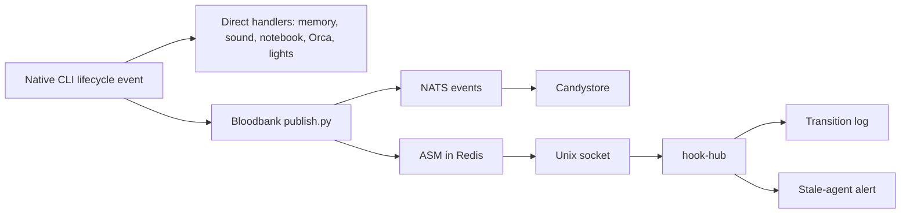

# CLI hook audit — 2026-09-13

The hook-hub exists and is running, but the lifecycle-hook migration has not
been performed. The installed CLIs still launch the original handlers and
Bloodbank publisher directly. The hub currently executes agent-state-machine
(ASM) handlers and a no-op self-test. No inspected native CLI configuration
invokes `bb-hook`.

This is an investigation snapshot, not a migration or a declaration of
exactly-once delivery. Observations were collected on big-chungus between
12:46 and 13:06 UTC on September 13, 2026. Source revisions were root
`16ff868` and Bloodbank `dbef526`. Live files and the installed loaders take
precedence over the older plan, skills, and health cards.

**What is actually running**

- `hook-hub.service` has been active since September 9, 09:45 EDT, PID 9204,
  with zero service restarts. It runs the source checkout's
  `bloodbank/services/hook-hub/hub.py`.
- Its socket is `/run/user/1000/33god/hook-hub.sock`. No process-environment
  override changes its registry or log path.
- `handlers.toml` enables exactly `asm-log`, `asm-stale-alert`, and
  `hub-selftest`. `asm-blocked-amber` is disabled. The Hindsight, notification,
  notebook, and merge-forward handler examples are commented out.
- The daemon **does not publish or subscribe to NATS**. Its source explicitly
  leaves event publishing in `services/agent-hooks/core/publisher.py`.
  `core/asm.py` feeds state transitions into the hub over the socket.
- `bb-hook` exists in `services/hook-hub/client/`, but is absent from the
  command search path and every inspected native registration. The master
  still generates `publish.py --client ... --hook ...` commands.
- The pre-probe hub log contained ASM transitions from Hermes, Codex, and
  Claude. Its `no binding for <cli>/transition` message is normal for these
  native-name handlers, not evidence of a failed dispatch.
- Eight controlled socket requests exercised only the enabled no-op handler:
  Claude, Codex, Copilot, and Hermes session-start requests returned
  `handled: ["hub-selftest"]` in 1.4–2.0 ms. Antigravity `PreInvocation` and
  Kimi/Gemini/OpenCode requests returned `handled: []`. Antigravity has a
  binding, but that role has no active handler; the other three lack bindings.

The approved design in `bloodbank/docs/hook-hub-plan.md` uses CLI → Unix socket
→ hub → handlers and event publication. The broker was deliberately kept off
the synchronous CLI path. Its recorded phase-0 completion and unstarted
phase-1+ cutover agree with the installed state. September's ASM work made the
hub useful without completing that cutover.

**Coverage across CLI families**

PJangler's current `SUPPORTED_CLIS` lists Claude, Codex, Gemini, Copilot,
OpenCode, and Kimi. Bloodbank's master instead lists Claude, Codex, Copilot,
Hermes, Antigravity, and an OpenClaw watcher stub (declared, never implemented): 42 bindings across six
entries, of which only five have publisher adapters. These are different
support inventories.

Counts below are configured registrations, not claims that every event has
been exercised in a live session.

| CLI | Installed wiring | Hub migration | Current evidence / gap |
| --- | --- | --- | --- |
| Claude Code 2.1.269 | `~/.claude/settings.json`: 41 commands across 13 events; 9 Bloodbank registrations, plus Hindsight, skill reminder/lint, CodeGraph, notebook, sound, Nanoleaf, Orca, and merge-forward | None | Recent durable session/prompt/tool events. Root project settings add graph hooks and another merge-forward registration. Merge-forward's worker is missing. |
| Codex 0.154.0 | `~/.codex/hooks.json`: 26 commands across 8 events, plus `config.toml`'s separate `notify` callback | None | Native `hooks/list` confirms all 26 global hooks are enabled and trusted. Live PostToolUse publisher has an edit-only matcher; timeouts use the wrong unit. |
| Copilot 1.0.80 | `~/.copilot/hooks/bloodbank.json`: 8 commands; `orca.json`: 13 commands | None | Publisher telemetry was last seen about 197 hours earlier; no Copilot process was discovered during the sample. No standalone global Hindsight hook in these files. Project settings can add hooks. |
| Kimi Code 0.42.0 | `~/.kimi-code/config.toml`: 26 entries representing 12 distinct event/matcher/command/timeout tuples; Hindsight, reminder, Orca, merge-forward | No adapter or bindings | `kimi doctor config` passes. Each of seven Orca events is registered three times, but identical commands are deduplicated by Kimi's documented loader. No Bloodbank publisher. Legacy `~/.kimi/config.toml` has zero hooks and is not the active Kimi Code config. |
| Gemini CLI | `~/.gemini/settings.json`: 3 Hindsight entries | No adapter or bindings | No `gemini` executable on the audit shell's PATH. The saved hooks use command arrays directly in event groups, without the required nested `hooks` array and command-type/string fields. This does not match the current official schema. |
| OpenCode 1.18.2 | `~/.config/opencode/plugins/hindsight-memory.ts`, `crg-plugin.ts`, and `vox-tts.ts` | No adapter or bindings | The memory plugin launches scripts itself and publishes through the **Claude** adapter. Those events are attributed to `actor.cli=claude`/Anthropic, even though its payload says OpenCode. No live OpenCode session was exercised. |
| Hermes | Default home plus 38 non-backup profile configs, each with six direct Bloodbank hooks and `hooks_auto_accept: true`; most also enable the separate `orca-status` Python plugin | None | Recent durable tool/session events. Running processes mostly use `~/.hermes/profiles/<name>`, while the installer and old checker still discover `<role_dir>/runtime`. One observed TonnyBox process still used its repository runtime. |
| Antigravity | `~/.gemini/config/hooks.json`: 10 commands across four named bundles, including 4 Bloodbank commands, Orca, reminder, and session-end retention | None | Last publisher telemetry about 86 hours earlier; no matching process in the sample. Its native interface has limited prompt/tool data and intentionally omits the permission-gating PreToolUse hook. |
| OpenClaw, legacy | Built-in internal hooks and a configured `hindsight-openclaw` memory plugin; Bloodbank master declares a watcher | No implemented watcher at the configured path | `~/.agents/hooks/openclaw/watch.py` is missing; no OpenClaw user service was listed. Its internal hooks and HTTP webhook settings are separate from this lifecycle publisher. No Bloodbank coverage can be inferred from the master's declared-but-unimplemented stub. |

Kimi's deduplication and active config location are documented in its
[hook reference](https://www.kimi.com/code/docs/en/kimi-code-cli/customization/hooks.html)
and [configuration guide](https://www.kimi.com/code/docs/en/kimi-code-cli/configuration/config-files).
Gemini's required shape is in the
[Gemini hook reference](https://geminicli.com/docs/hooks/reference/).
Copilot supports both camelCase and PascalCase events, user hook directories,
and project `.claude/settings.json` compatibility; the mixed casing of the
Orca registrations is therefore not itself a defect. See the
[Copilot hook reference](https://docs.github.com/en/copilot/reference/hooks-reference).

**Confirmed problems and remaining ambiguities**

| Finding | Evidence and consequence | Confidence |
| --- | --- | --- |
| Central cutover never happened | All five generated CLI runners still call the publisher; behavior remains distributed. Enabling hub handlers without retiring existing owners would introduce duplicate work. | Confirmed configuration and live hub behavior |
| Codex loses most tool-completion events | Master and generated PostToolUse group specify `.*`; installed publisher is inside `Write\|Edit\|MultiEdit`. Native loader preserves that matcher. A 1,000-event Candystore sample spanning approximately 07:33–13:05 UTC contained 237 Codex tool requests and only 4 completions. All 225 Bash requests had no Bash completions in that window; the four completions were `apply_patch`. Claude had 45 requests/44 completions; Hermes 301/301. Window counts are corroboration, not a claim that arbitrary requests always pair within the window. | Confirmed deployed drift plus durable traffic |
| Codex timeout values are 1,000 times the intended size | Installed `hooks/list` returns `timeoutSec=3000` and `5000`, not 3 and 5. Bloodbank master itself sets `default_timeout: 3000`; attention uses 2000. The native loader confirms 50-minute and 83-minute upper bounds for these values. | Confirmed with installed binary |
| Merge-forward silently exits without running its worker | Both global and 33GOD launchers compute `skills/33god-merge-forward/scripts/rebalance.py`. Neither resolved file exists. Their `[[ -f "$WORKER" ]] ... exit 0` branch consumes stdin and returns success. This affects native registrations in Claude, Codex, and Kimi, plus the old 33GOD Hermes runtime. | Confirmed source and missing files |
| Codex retains two completion-related invocation paths | `Stop` launches Hindsight session-end and `claude-notify`; `config.toml`'s `notify` callback also launches both. The notify shell command does not forward its JSON argument into the stdin-reading session-end script. | Confirmed overlapping wiring; duplicate audible or retained side effects were not counted |
| Turn completion and session closure are conflated | Claude and Codex `Stop` map to `bloodbank.agent.session.ended`; true SessionEnd is not a Bloodbank registration. The installed Codex protocol now explicitly supports SessionEnd. Its SessionStart and Stop commands also replace the native payload with `{}`, discarding native session IDs/reasons at ingress. | Confirmed mapping, commands, and installed protocol |
| Three supported CLIs are outside the central contract | Gemini, Kimi, and OpenCode are supported by PJangler but absent from the hook master and adapter registry. OpenCode's legacy Claude wrapper masks that absence in CLI-attributed telemetry. | Confirmed |
| Existing health checks cannot establish migration or exactly-once execution | `sync.py --check --json` is clean despite the deployed Codex matcher drift. The old health check reports 183/200 passing, but five failures are intentional `publish:false` attention bindings. It also inspects obsolete Hermes paths and ignores current auto-accept semantics. A config with zero hooks can pass because it checks only the entries it finds. | Confirmed checker behavior and source |

The old checker specifically reports missing configs for `automatic-ai-pm`,
`condaleeza`, and `delonet-director`, and missing allowlist entries for
`infra-pm`/`ssbnk-pm`. Each has a current profile containing the six publisher
hooks and auto-accept enabled. The installed Hermes shell-hook loader honors
`hooks_auto_accept`; missing old allowlist entries do not prove a current
profile is blocked. The installer needs the same profile-aware discovery as
the running fleet.

There is also **no evidence of duplicate lifecycle publishing by the hub and
CLI together**: the hub has no publishing path enabled. The disabled amber
handler similarly avoids duplicating the publisher's existing Deckard
attention fan-out.

Two other apparent duplicates were checked and excluded from the confirmed
double-execution findings:

- The James Brennan project has additional Hindsight hooks, but
  `global_equivalent_is_active()` returned true for recall, candidate/retain,
  and stop for both Claude and Codex. Those project handlers intentionally
  skip when the trusted global equivalent is present. This is path-specific
  logic that will need updating when the global command becomes `bb-hook`.
- Codex lists four Dompacolypse project hooks, but all four are disabled.
  Counting files or registrations alone would wrongly count them as active.

**Verification performed**

- Read the approved plan, current master/generated artifacts, hub registry,
  publisher/ASM paths, global native configs, applicable project overlays,
  installed Hermes loader, and local OpenCode plugins.
- Queried the installed Codex app server's read-only `hooks/list` API for
  33GOD, James Brennan, and Dompacolypse. It returned respectively 26, 31,
  and 30 hooks with no loading errors; project enablement was inspected
  separately from registration counts. No model session was started.
- Ran `sync.py --check --json`, the old config-health check, and
  `kimi doctor config` without installing new hook projections.
- Ran existing hub tests: **26 passed**. The suite uses isolated daemons and
  fixtures. Eight separately identified live socket probes ran only the
  no-op self-test; they did not publish lifecycle events or run real concerns.
- Read Redis `asm:seen`, selected `/proc` identity/config-home fields, hub/ASM
  logs, and recent Candystore events. ASM observation occurs before network
  publication, so last-seen telemetry alone was not treated as durable proof.
- Searched 88 candidate config/plugin files under `~/code` with runtime and
  dependency exclusions. No additional `bb-hook`/hub registration was found.
  There was an unreadable AnythingLLM storage directory, and ignored files
  and arbitrary custom launcher locations were not exhaustively traversed.
- Did not trigger real notifications, memory retention, notebook writes,
  agent turns, or installer/sync mutations as audit probes. Idle CLIs still
  require real-session acceptance tests before any eventual migration can
  be called complete.

This evidence does not establish exactly-once behavior. The hub's `handled`
reply reports selected handlers, not successful completion receipts. Its
ordinary logs contain failures/configuration messages rather than a complete
per-hook success ledger. Redis last-seen fields are aggregate CLI/type
timestamps, not invocation counts.

**Recommended next unit of work**

1. Repair the measurable gaps: Codex's installed matcher and timeout units,
   missing merge-forward worker paths, and Gemini's saved hook shape. Decide
   the correct Stop versus SessionEnd semantics and preserve native payloads.
2. Establish one CLI support inventory and make discovery include current
   Hermes profile homes, project overlays, notify callbacks, and plugin hooks.
3. Add invocation receipts keyed by CLI, native session/event identity, and
   handler. Count selected, started, completed, failed, skipped, and timed-out
   work separately; a zero exit alone must not certify a handler's work.
4. Move one concern at a time into the hub, changing its old installer/owner
   in the same unit of work. Include Orca, notebook, Nanoleaf, project-hook
   generators, and fallback-detection logic so a later install cannot restore
   a second path. Do not enable a second Deckard emitter.
5. Complete event publishing and missing adapters, then verify one native
   invocation → one handler execution → one expected durable event, across
   all supported CLIs. Check hub-down behavior, synchronous context output,
   attention, normal stop, session exit, tool success/failure, and concurrent
   sessions. Only then retire old dispatch paths and declare migration done.

No native routing configuration was changed in this audit. Two plaintext
legacy OpenClaw webhook credentials encountered during inspection were copied
into the `OpenClaw Legacy Webhook Credentials` item in DeLoSecrets and
read-back verified. Removing the plaintext copies remains pending: the
installed OpenClaw credential-surface document explicitly excludes
`hooks.token` and `hooks.gmail.pushToken` from native SecretRef support, and
the tracked legacy runtime repository has unrelated WIP. A supported
launch-time resolver is needed; replacing those fields with literal `op://`
strings would change their effective credentials rather than resolve them.

The machine-wide `git unpushed` audit was also run. It reported extensive
pre-existing changes and unpushed history across unrelated repositories.
Those were not absorbed into this investigation's documentation commit.
