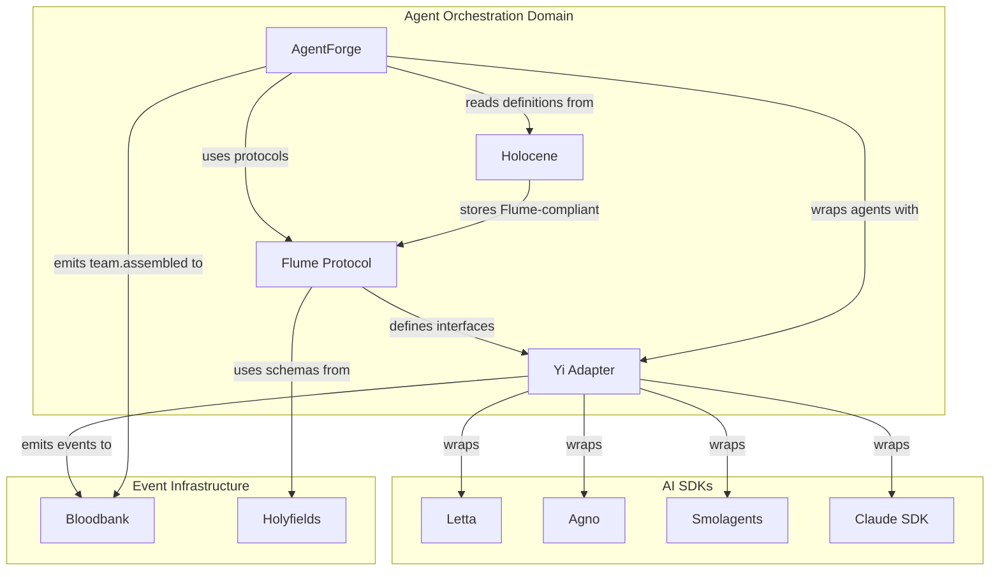

# Domain: Agent Orchestration

> The protocol layer. Defines how agents talk, behave, coordinate, and assemble into teams.

---

## Overview

The Agent Orchestration domain is the **brain and backbone** of the 33GOD agentic ecosystem. It defines:
- **How agents are structured** (roles, hierarchies, interfaces)
- **How agents communicate** (protocols, message envelopes, task handoff)
- **How agents are wrapped** (adapters for different AI SDKs)
- **How teams are assembled** (meta-agent team building)
- **How agent definitions are stored** (centralized repository, Hive Mind)

This domain adopts an **anthropomorphic corporate model** rather than traditional AI chain terminology. Instead of "chains" and "nodes," we use **Employees, Managers, and Contributors**—treating agent collaboration as organizational relationships rather than computational graphs.

---

## Services

| Service | Role | Tech Stack | Status |
|---------|------|------------|--------|
| **Flume** | Agentic Corporate Protocol - Manager/Contributor hierarchy, communication interfaces | TypeScript, npm workspaces (monorepo) | Active |
| **Yi** | Opinionated Agent Adapter - enforces 33GOD conventions on AI SDKs | TypeScript | Active |
| **AgentForge** | Meta-agent team builder - assembles specialized agent rosters | Python, Agno | Active |
| **Holocene** | Hive Mind & Agent Repository - stores agent definitions, control center | TypeScript, Vite, Tailwind | Active |

---

## Component Deep Dives

### 1. Flume - The Agentic Corporate Protocol

**Directory:** `flume/trunk-main/`
**Repository:** `git@github.com:delorenj/flume`
**Tech Stack:** TypeScript, Node.js, npm workspaces (monorepo)

#### Purpose

Flume is the **implementation-agnostic protocol** that defines the structural hierarchy, communication interfaces, and role definitions for the 33GOD Agentic Pipeline. Think of it as the "USB Port" of the agent ecosystem—it defines connection shapes and interfaces without containing any actual inference logic.

#### Core Philosophy

Flume uses **anthropomorphic modeling** instead of traditional AI terminology:

| Traditional Term | Flume Term | Description |
|-----------------|------------|-------------|
| Node | Employee | Active work unit that executes tasks |
| Orchestrator | Manager | Coordinates and delegates work |
| Leaf Node | Contributor | Individual contributor performing specific functions |
| Chain | Workflow | Coordinated sequence of agent activities |

#### Architecture Components

##### Role Definitions

**Manager Interface**
- Assigns tasks to Contributors
- Monitors progress and handles blockers
- Makes delegation decisions
- Aggregates results from team members

**Contributor Interface**
- Executes assigned tasks
- Reports status and progress
- Requests clarification when blocked
- Returns structured WorkResults

##### State Machine

Agents progress through lifecycle states:

```
┌─────────────┐
│ INITIALIZING│ ──► Agent created, loading configuration
└─────┬───────┘
      ▼
┌─────────────┐
│ ONBOARDING  │ ──► Receiving TeamContext, loading memory
└─────┬───────┘
      ▼
┌─────────────┐     ┌─────────────┐
│   WORKING   │ ◄──►│   BLOCKED   │ ──► Waiting for input/resources
└─────────────┘     └─────────────┘
```

##### Unit of Work

**TaskPayload** - Work assignments sent to agents:
```typescript
interface TaskPayload {
  id: string;
  type: TaskType;
  description: string;
  context: Record<string, unknown>;
  priority: Priority;
  deadline?: Date;
  assignedBy: AgentId;
}
```

**WorkResult** - Deliverables returned from completed work:
```typescript
interface WorkResult {
  taskId: string;
  status: 'completed' | 'failed' | 'partial';
  artifacts: Artifact[];
  metrics: ExecutionMetrics;
  nextActions?: TaskPayload[];
}
```

#### Key Packages

```
flume/
├── packages/
│   ├── core/           # Core protocol definitions
│   ├── manager/        # Manager interface implementations
│   ├── contributor/    # Contributor interface implementations
│   └── events/         # Event types for Bloodbank integration
├── bmad/               # Agent implementation
├── database/           # Persistence layer (PostgreSQL)
├── task-session-manager/ # Task lifecycle management
├── docs/               # Documentation
└── tests/              # Test suite
```

#### Integration Points

- **Bloodbank**: Emits task events (`task.assigned`, `task.completed`, `task.blocked`)
- **Yi**: Provides concrete implementations of Flume interfaces
- **AgentForge**: Uses Flume protocols when assembling teams
- **Holocene**: Stores Flume-compliant agent definitions

---

### 2. Yi - The Opinionated Agent Adapter

**Directory:** `yi/trunk-main/`
**Repository:** `git@github.com:delorenj/yi`
**Tech Stack:** TypeScript

#### Purpose

Yi is the **"Suit" for your agents**—the adapter layer that enforces 33GOD conventions on top of the Flume protocol. It wraps various AI SDKs (Letta, Agno, Smolagents) into compliant Manager and Contributor nodes.

Think of Yi as the **HR Department and Bureaucracy** of the 33GOD ecosystem. It ensures all agents, regardless of their underlying implementation, speak the same language and follow the same rules.

#### Core Functions

##### Wrapped Intelligence
Converts unstructured LLM outputs into standardized Flume WorkResults:

```typescript
// Raw LLM output → Structured WorkResult
class YiManager extends FlumeManager {
  async processResponse(raw: string): Promise<WorkResult> {
    const structured = await this.parser.parse(raw);
    return this.transformer.toWorkResult(structured);
  }
}
```

##### Memory Coordination
`YiMemoryStrategy` synchronizes context and "Memory Shards" across team members:

```typescript
interface YiMemoryStrategy {
  sync(teamId: string): Promise<void>;
  getShards(agentId: string): Promise<MemoryShard[]>;
  broadcastContext(context: TeamContext): Promise<void>;
}
```

##### Lifecycle Management
Integration with AgentForge handles:
- **Recruitment**: Creating new agents with appropriate capabilities
- **Onboarding**: Injecting TeamContext before operational deployment
- **Monitoring**: Heartbeat-based health tracking

#### Supported AI SDKs

| SDK | Wrapper Class | Use Case |
|-----|--------------|----------|
| **Letta** | `LettaYiManager` | Persistent memory agents |
| **Agno** | `AgnoYiContributor` | Specialized task agents |
| **Smolagents** | `SmolYiContributor` | Lightweight execution agents |
| **Claude** | `ClaudeYiManager` | General-purpose orchestration |

#### Key Components

**YiManager** - Abstract base class implementing Flume's Manager interface:
```typescript
import { YiManager, YiMemoryStrategy } from '@33god/yi';
import { LettaClient } from 'letta-sdk';

class EngineeringManager extends YiManager {
  constructor(memory: YiMemoryStrategy) {
    super(memory);
    this.brain = new LettaClient();
  }

  // Delegation strategies
  delegationStrategy: 'round-robin' | 'llm-driven' | 'capability-match';
}
```

**OnboardingSpecialist** - Injects TeamContext into new agents:
```typescript
class OnboardingSpecialist {
  async onboard(agent: Agent, context: TeamContext): Promise<void> {
    await agent.loadMemory(context.sharedMemory);
    await agent.setObjectives(context.teamObjectives);
    await agent.acknowledgeRoles(context.roleDefinitions);
  }
}
```

**Bloodbank Integration** - Emits standardized events:
```typescript
// Events emitted by Yi adapters
'agent.initialized'
'agent.onboarded'
'agent.task.started'
'agent.task.completed'
'agent.heartbeat'
'agent.error'
```

#### Yi Conventions

1. **Heartbeat Protocol**: All agents send heartbeats every 30 seconds
2. **Event Emission**: All significant actions emit events to Bloodbank
3. **Memory Management**: Context synchronized via Redis
4. **Error Handling**: Structured error reporting with recovery hints

---

### 3. AgentForge - Meta-Agent Team Builder

**Directory:** `agent-forge/trunk-main/`
**Repository:** `git@github.com:delorenj/agent-forge.git`
**Tech Stack:** Python, Agno

#### Purpose

AgentForge uses a **meta-team of specialized agents** to analyze goals and assemble optimal agent rosters. Instead of manually configuring teams, you describe what you need, and AgentForge's meta-team figures out the best composition.

#### The Meta-Team

AgentForge employs five specialized meta-agents:

| Meta-Agent | Role | Responsibilities |
|-----------|------|------------------|
| **Engineering Manager** | Team Lead | Coordinates the assembly process, makes final decisions |
| **Systems Analyst** | Requirements Analyst | Analyzes the goal, identifies required capabilities |
| **Talent Scout** | Recruiter | Searches agent definitions for best matches |
| **Agent Developer** | Builder | Creates new agent configurations if needed |
| **Integration Architect** | Wiring Expert | Designs communication patterns between team members |

#### Team Assembly Algorithm

```python
# Simplified AgentForge workflow
async def assemble_team(goal: str) -> AgentTeam:
    # 1. Systems Analyst breaks down the goal
    requirements = await systems_analyst.analyze(goal)

    # 2. Talent Scout searches for matching agents
    candidates = await talent_scout.search(
        requirements.capabilities,
        source=holocene.agent_definitions
    )

    # 3. Integration Architect designs the topology
    topology = await integration_architect.design(
        candidates=candidates,
        communication_patterns=requirements.patterns
    )

    # 4. Agent Developer creates any missing pieces
    if topology.gaps:
        new_agents = await agent_developer.create(topology.gaps)
        candidates.extend(new_agents)

    # 5. Engineering Manager approves and finalizes
    team = await engineering_manager.finalize(
        candidates=candidates,
        topology=topology
    )

    return team
```

#### Agent Format Conversion

AgentForge can convert general agent configurations into formats compatible with multiple platforms:

| Platform | Output Format |
|----------|--------------|
| **Claude Code** | `.claude/agents/*.md` |
| **AmazonQ** | Custom JSON format |
| **OpenCode** | YAML configuration |
| **Agno** | Python agent definitions |

#### Capability Matching

AgentForge uses a capability matching system:

```python
class Capability:
    name: str           # e.g., "code_review", "testing", "documentation"
    level: int          # 1-10 proficiency
    domain: str         # e.g., "typescript", "python", "infrastructure"

class AgentProfile:
    capabilities: List[Capability]
    constraints: List[Constraint]  # Time, cost, resource limits
    preferences: Dict[str, Any]    # Working style, communication patterns
```

#### Integration Points

- **Holocene**: Source of agent definitions
- **Yi**: All assembled agents are wrapped with Yi adapters
- **Flume**: Teams follow Flume protocol hierarchies
- **Bloodbank**: Emits `agent.team.assembled` events

---

### 4. Holocene - The Hive Mind & Agent Repository

**Directory:** `holocene/trunk-main/`
**Repository:** `git@github.com:delorenj/holocene.git`
**Tech Stack:** TypeScript, Vite, Tailwind CSS

#### Purpose

Holocene is the **control center** and **collective intelligence repository** for the 33GOD agentic pipeline. It provides:
- Centralized storage for agent definitions
- Mission control dashboard for portfolio visibility
- Hive Mind coordination for collective intelligence

As the repository description says: *"With it, I can see for miles, miles, miles."*

#### Agent Definitions Storage

Agent definitions are stored in `.claude/agents/` format:

```
holocene/
├── .claude/
│   └── agents/
│       ├── engineering-manager.md
│       ├── code-reviewer.md
│       ├── test-engineer.md
│       ├── documentation-writer.md
│       └── ...
├── src/                    # Dashboard source
├── docs/
│   └── Dashboard-and-Service-Deepdive.md
└── .swarm/                 # Coordination configs
```

#### Agent Definition Format

Each agent is defined in Markdown with structured frontmatter:

```markdown
---
name: Code Reviewer
role: contributor
capabilities:
  - code_review: 9
  - security_analysis: 7
  - best_practices: 8
domains:
  - typescript
  - python
  - rust
constraints:
  max_files_per_review: 20
  timeout_minutes: 30
---

# Code Reviewer Agent

## Objective
Review code changes for quality, security, and adherence to best practices.

## Instructions
1. Analyze the diff for potential issues
2. Check for security vulnerabilities
3. Verify coding standards compliance
4. Provide constructive feedback

## Output Format
- Summary of findings
- List of issues with severity
- Suggested improvements
```

#### Mission Control Dashboard

The Holocene dashboard provides:

| Feature | Description |
|---------|-------------|
| **Agent Registry** | Browse all available agent definitions |
| **Team Viewer** | See currently active agent teams |
| **Task Monitor** | Track tasks across all agents |
| **Health Dashboard** | Real-time agent health and status |
| **Portfolio View** | Overview of all projects and their agent teams |

#### Hive Mind Concept

The "Hive Mind" represents the collective intelligence of all agents:

```
┌─────────────────────────────────────────────────┐
│                  HIVE MIND                       │
│                                                  │
│  ┌─────────┐  ┌─────────┐  ┌─────────┐         │
│  │ Agent A │  │ Agent B │  │ Agent C │  ...    │
│  └────┬────┘  └────┬────┘  └────┬────┘         │
│       │            │            │               │
│       ▼            ▼            ▼               │
│  ┌──────────────────────────────────────────┐  │
│  │         SHARED MEMORY LAYER              │  │
│  │   (Redis + Memory Shards via Yi)         │  │
│  └──────────────────────────────────────────┘  │
│                      │                          │
│                      ▼                          │
│  ┌──────────────────────────────────────────┐  │
│  │         COLLECTIVE KNOWLEDGE             │  │
│  │   (Agent definitions + learned patterns) │  │
│  └──────────────────────────────────────────┘  │
└─────────────────────────────────────────────────┘
```

---

## Domain Interconnections



---

## Agent Lifecycle

### 1. Definition Phase
```
Agent definition created in Holocene
    │
    ▼
Stored in .claude/agents/ format
    │
    ▼
Indexed for AgentForge discovery
```

### 2. Assembly Phase
```
AgentForge receives task goal
    │
    ▼
Meta-team analyzes requirements
    │
    ▼
Talent Scout finds matching agents from Holocene
    │
    ▼
Integration Architect designs team topology
    │
    ▼
Team assembled with Flume hierarchy
```

### 3. Initialization Phase
```
Yi wraps each agent with appropriate adapter
    │
    ▼
OnboardingSpecialist injects TeamContext
    │
    ▼
Agents transition: INITIALIZING → ONBOARDING → WORKING
    │
    ▼
Bloodbank receives 'agent.team.ready' event
```

### 4. Execution Phase
```
Manager receives TaskPayload
    │
    ▼
Manager delegates to Contributors
    │
    ▼
Contributors execute and return WorkResults
    │
    ▼
Manager aggregates and reports
    │
    ▼
Events emitted throughout (task.started, task.completed, etc.)
```

### 5. Coordination Phase
```
Heartbeats sent every 30 seconds
    │
    ▼
Memory synchronized via YiMemoryStrategy
    │
    ▼
Blocked agents trigger escalation
    │
    ▼
Health monitored via Holocene dashboard
```

---

## Common Use Cases

### Use Case 1: Assemble a Code Review Team

```bash
# AgentForge assembles the team
agentforge assemble --goal "Review PR #123 for security and quality"

# Result: Team with CodeReviewer, SecurityAnalyst, Manager
```

### Use Case 2: Add Support for New AI Framework

```typescript
// 1. Create Yi adapter
class NewFrameworkYiContributor extends YiContributor {
  constructor(client: NewFrameworkClient) {
    super();
    this.brain = client;
  }

  async execute(task: TaskPayload): Promise<WorkResult> {
    const raw = await this.brain.process(task);
    return this.toWorkResult(raw);
  }
}

// 2. Register with Yi
yi.registerAdapter('new-framework', NewFrameworkYiContributor);
```

### Use Case 3: Define a New Agent

```markdown
<!-- Save as holocene/.claude/agents/my-agent.md -->
---
name: My Custom Agent
role: contributor
capabilities:
  - my_skill: 8
domains:
  - my_domain
---

# My Custom Agent

## Objective
Describe what this agent does.

## Instructions
1. Step one
2. Step two
```

### Use Case 4: Trigger Agent Workflow via Event

```python
# Emit event to Bloodbank
await bloodbank.publish(
    topic="feature.requested",
    payload={
        "feature_id": "FEAT-123",
        "description": "Add dark mode support",
        "priority": "high"
    }
)

# Flume receives and orchestrates
# AgentForge assembles team
# Yi wraps agents
# Work begins
```

---

## API/CLI Reference

### Flume CLI

```bash
# Start Flume orchestrator
npm run start:orchestrator

# Create new task session
npm run task:create -- --description "Build feature X"

# List active sessions
npm run task:list
```

### Yi CLI

```bash
# Register agent with Yi
yi register --adapter letta --agent engineering-manager

# Check agent health
yi health --agent engineering-manager

# Force memory sync
yi sync --team team-123
```

### AgentForge CLI

```bash
# Assemble team for goal
agentforge assemble --goal "Build REST API" --output team.yaml

# List available agents
agentforge agents list

# Convert agent format
agentforge convert --input agent.md --format amazon-q

# Validate agent definition
agentforge validate --agent ./my-agent.md
```

### Holocene Dashboard

```bash
# Start dashboard
cd holocene/trunk-main && npm run dev

# Dashboard available at http://localhost:5173
```

---

## When to Include This Domain Context

Pass this domain when the user's prompt involves:

| Keyword/Concept | Relevance |
|----------------|-----------|
| "agent", "agents" | High - Core domain concept |
| "orchestration", "coordination" | High - Domain purpose |
| "team", "team building" | High - AgentForge focus |
| "roles", "manager", "contributor" | High - Flume hierarchy |
| "protocol", "interface" | High - Flume definition |
| "adapter", "wrapper", "SDK" | High - Yi responsibility |
| "Letta", "Agno", "Smolagents" | High - Yi wraps these |
| "hive mind", "collective" | High - Holocene concept |
| "agent definition", "agent file" | High - Holocene storage |
| "task assignment", "delegation" | Medium - Flume workflow |
| "memory sync", "context sharing" | Medium - Yi functionality |
| "capability matching" | Medium - AgentForge algorithm |
| "workflow", "pipeline" | Medium - May involve orchestration |
| "LLM", "AI framework" | Low-Medium - May need wrapping |

---

## Technical Quick Reference

| Service | Location | Entry Point | Port |
|---------|----------|-------------|------|
| Flume | `flume/trunk-main/` | `packages/core/` | - |
| Yi | `yi/trunk-main/` | `src/` | - |
| AgentForge | `agent-forge/trunk-main/` | `agents/` | - |
| Holocene | `holocene/trunk-main/` | `src/` | 5173 |

---

## Troubleshooting Guide

### Agent Not Responding

**Symptoms:** Agent appears stuck, no heartbeats

**Diagnosis:**
```bash
# Check agent status in Holocene dashboard
# Or query Bloodbank for recent heartbeats
bloodbank query --topic "agent.heartbeat" --agent-id <id>
```

**Solutions:**
1. Check Yi adapter is properly initialized
2. Verify Bloodbank connection
3. Check for memory sync failures
4. Restart agent with fresh context

### Team Assembly Fails

**Symptoms:** AgentForge cannot assemble team for goal

**Diagnosis:**
```bash
agentforge diagnose --goal "your goal here"
```

**Solutions:**
1. Check Holocene has sufficient agent definitions
2. Verify capability requirements are achievable
3. Create missing agent types
4. Relax constraints if too strict

### Task Delegation Stuck

**Symptoms:** Manager not delegating tasks to Contributors

**Diagnosis:**
1. Check Flume logs for delegation decisions
2. Verify Contributors are in WORKING state
3. Check TaskPayload format

**Solutions:**
1. Ensure Contributors are onboarded
2. Verify task type matches Contributor capabilities
3. Check Manager's delegation strategy configuration

### Memory Sync Issues

**Symptoms:** Agents have stale or inconsistent context

**Diagnosis:**
```bash
yi sync-status --team <team-id>
```

**Solutions:**
1. Check Redis connection
2. Force manual sync: `yi sync --force --team <team-id>`
3. Clear and rebuild memory shards
4. Verify YiMemoryStrategy implementation

### Event Not Reaching Agents

**Symptoms:** Published events not triggering agent actions

**Diagnosis:**
1. Check Bloodbank routing
2. Verify event schema matches Holyfields
3. Check agent subscriptions

**Solutions:**
1. Validate event against Holyfields schema
2. Verify topic routing in Bloodbank
3. Check Yi adapter event handlers
4. Review Flume orchestrator subscriptions

---

## Related Domains

- **[Event Infrastructure](./event-infrastructure.md)** - Bloodbank, Holyfields (event transport)
- **[Meeting & Collaboration](./meeting-collaboration.md)** - TheBoard (agent brainstorming)
- **[Workspace Management](./workspace-management.md)** - iMi, Jelmore (agent sessions)

---

## Last Sync

<!-- degenerate:sync-marker -->
Commit: (pending initial sync)
Date: (pending initial sync)
