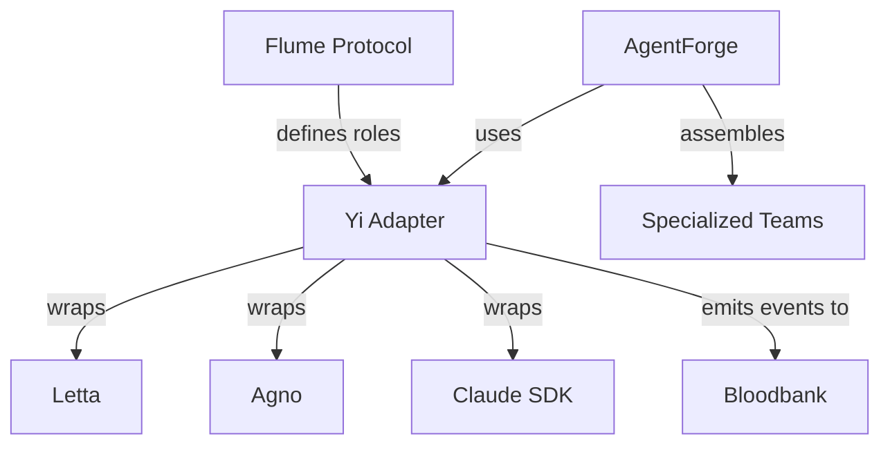

# Domain: Agent Orchestration

> The protocol layer. Defines how agents talk, behave, and coordinate.

## Services

| Service | Role | Tech Stack | Status |
|---------|------|------------|--------|
| **Flume** | Agentic Corporate Protocol - Manager/Contributor hierarchy, communication interfaces | TypeScript, npm workspaces (monorepo) | Active |
| **Yi** | Opinionated Agent Adapter - enforces 33GOD conventions on AI SDKs | TypeScript | Active |
| **AgentForge** | Meta-agent team builder - assembles specialized agent rosters | Python, Agno | Active |

## High-Level Purpose

This domain defines the rules of engagement for AI agents in 33GOD. Flume establishes the structural protocol (roles, communication patterns, task handoff). Yi wraps various AI SDKs (Letta, Agno, Smolagents) with 33GOD-specific conventions. AgentForge uses a meta-team approach to dynamically assemble specialized agent teams.

## Key Contracts

- **Flume Protocol**: Manager/Contributor roles, message envelopes, task lifecycle
- **Yi Adapters**: Standardized interface across Letta, Agno, Claude SDKs
- **Agent Roster**: AgentForge team definitions with capability matching

## Interconnections

## When to Include This Context

Pass this domain when:
- Building new agent workflows or teams
- Debugging agent communication or task handoff
- Adding support for a new AI framework
- Modifying the Flume protocol or Yi conventions

## Technical Quick Reference

| Service | Location | Entry Point |
|---------|----------|-------------|
| Flume | `/home/delorenj/code/33GOD/flume/trunk-main/` | `packages/core/` |
| Yi | `/home/delorenj/code/33GOD/yi/` | `src/` |
| AgentForge | `/home/delorenj/code/33GOD/agent-forge/` | `agents/` |

## Key Concepts

### Flume Roles
- **Manager**: Assigns tasks, monitors progress, makes decisions
- **Contributor**: Executes tasks, reports status, requests clarification

### Yi Conventions
- Heartbeat-based health tracking
- Event emission for all agent actions
- Memory/context management via Redis

### AgentForge Meta-Team
- Engineering Manager, Systems Analyst, Talent Scout
- Agent Developer, Integration Architect
- Dynamic capability matching for task assignment

## Key Files

- `/home/delorenj/code/33GOD/flume/trunk-main/packages/` - Protocol packages
- `/home/delorenj/code/33GOD/yi/src/` - Adapter implementations
- `/home/delorenj/code/33GOD/agent-forge/agents/` - Agent definitions

## Last Sync

<!-- degenerate:sync-marker -->
Commit: (pending initial sync)
Date: (pending initial sync)
