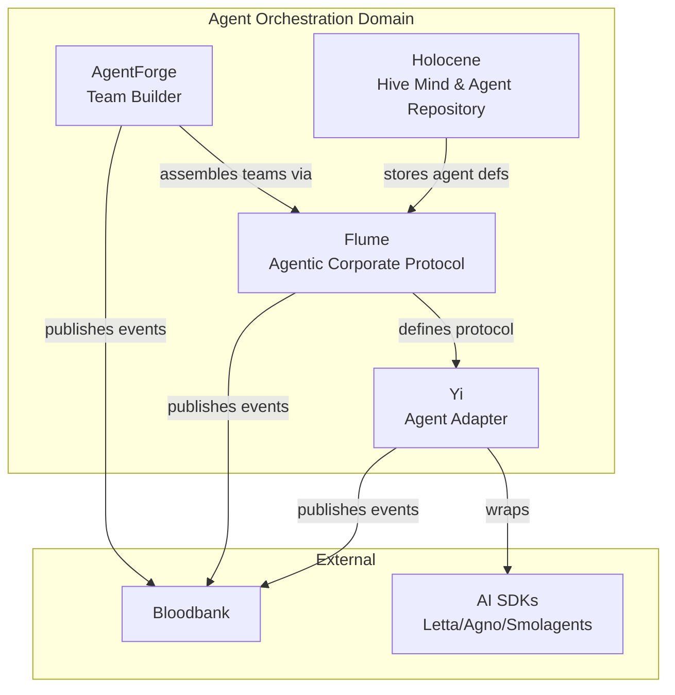
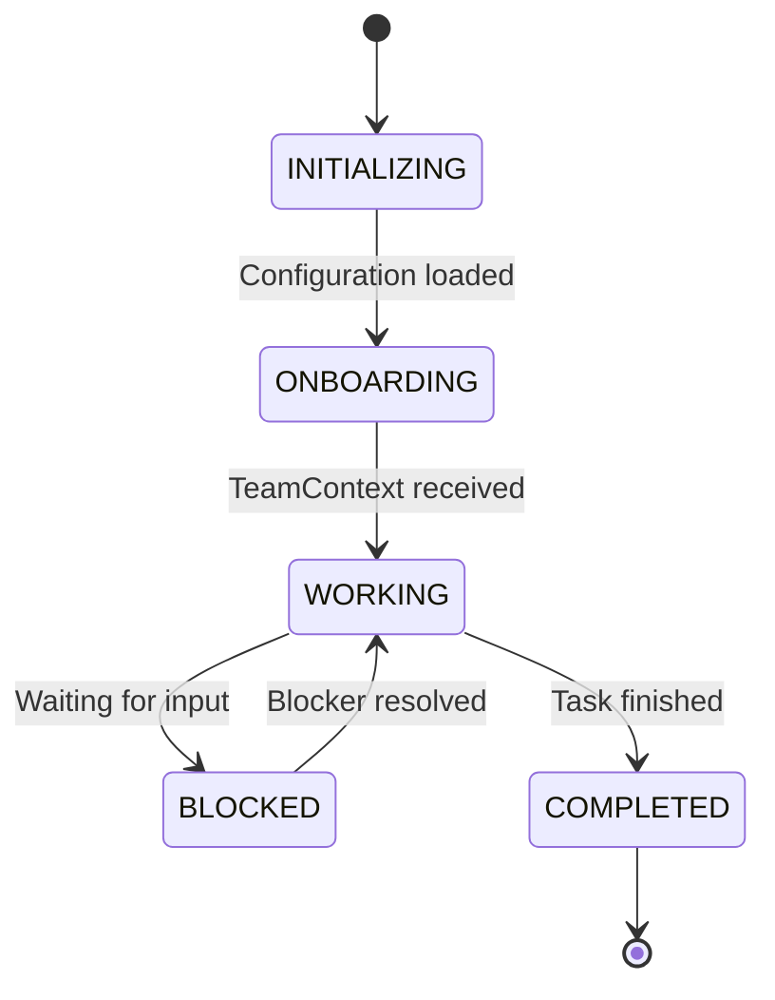

# Agent Orchestration Domain - GOD Document

> **Guaranteed Organizational Document** - Developer-facing reference for the Agent Orchestration domain
>
> **Last Updated**: 2026-02-01
> **Components**: 4

---

## Domain Overview

The Agent Orchestration domain defines **how agents are structured, communicate, and coordinate**. It adopts an anthropomorphic corporate model rather than traditional AI terminology—agents are **Employees**, **Managers**, and **Contributors** operating within defined protocols.

**Core Responsibility**: Provide the protocol layer, team assembly, and agent lifecycle management for the 33GOD agentic ecosystem.

**Architectural Philosophy**: "Agents as Organizational Entities"

---

## Component Map



---

## Components

### Flume

**Purpose**: Implementation-agnostic protocol defining agent hierarchy, communication interfaces, and role definitions

**Type**: Protocol / Framework
**Status**: Active

**Key Events:**
- **Emits**: `flume.agent.onboarded`, `flume.task.assigned`, `flume.result.submitted`
- **Consumes**: `flume.task.created`, `flume.agent.blocked`

**Interfaces:**
- TypeScript SDK: `@33god/flume`
- Roles: `Manager`, `Contributor`

[📄 Component GOD Doc](../../flume/GOD.md) _(To be created)_

---

### Yi

**Purpose**: Opinionated agent adapter that enforces 33GOD conventions on AI SDKs (Letta, Agno, Smolagents)

**Type**: Adapter Layer
**Status**: Active

**Key Events:**
- **Emits**: `yi.agent.wrapped`, `yi.capability.detected`
- **Consumes**: `flume.agent.onboarded`

**Interfaces:**
- TypeScript API: Wraps AI SDK agents
- Config: `yi.config.yaml`

[📄 Component GOD Doc](../../yi/GOD.md) _(To be created)_

---

### AgentForge

**Purpose**: Meta-agent that assembles specialized agent teams based on task requirements

**Type**: Team Builder / Meta-Agent
**Status**: Active

**Key Events:**
- **Emits**: `agentforge.team.assembled`, `agentforge.roster.created`
- **Consumes**: `agentforge.team.requested`

**Interfaces:**
- Python API: `agentforge assemble --task <description>`
- Agent Pool: Queries Holocene for available agents

[📄 Component GOD Doc](../../agentforge/GOD.md) _(To be created)_

---

### Holocene

**Purpose**: Hive Mind repository and mission control dashboard for agent definitions

**Type**: Agent Repository / Dashboard
**Status**: Active

**Key Events:**
- **Emits**: `holocene.agent.registered`, `holocene.agent.status`
- **Consumes**: `agent.*.*` (all agent events for tracking)

**Interfaces:**
- Web UI: `http://localhost:3000`
- REST API: `/agents`, `/teams`

[📄 Component GOD Doc](../../holocene/GOD.md)

---

## Domain Event Contracts

### Cross-Component Events

Events that flow between components within this domain:

| Event | Producer | Consumer(s) | Purpose |
|-------|----------|-------------|---------|
| `flume.agent.onboarded` | Flume | Yi, Holocene | Track agent initialization |
| `yi.agent.wrapped` | Yi | Flume, Holocene | Confirm agent SDK wrapping |
| `agentforge.roster.created` | AgentForge | Flume | Deploy assembled team |
| `holocene.agent.registered` | Holocene | AgentForge | Add agent to pool |

### External Event Interfaces

Events exchanged with other domains:

| Event | Direction | External Domain | Purpose |
|-------|-----------|-----------------|---------|
| `agent.task.*` | Outbound | Infrastructure | Track task execution |
| `worktree.claimed` | Inbound | Workspace Management | Agent claims git worktree |
| `session.started` | Inbound | Development Tools | Agent starts coding session |

---

## Agent Lifecycle States



**State Descriptions:**
- **INITIALIZING**: Agent created, loading configuration
- **ONBOARDING**: Receiving TeamContext, loading memory
- **WORKING**: Actively executing tasks
- **BLOCKED**: Waiting for input, resources, or clarification
- **COMPLETED**: Task execution finished

---

## Role Definitions

### Manager

**Responsibilities:**
- Assign tasks to Contributors
- Monitor progress and handle blockers
- Make delegation decisions
- Aggregate results from team members

**Interface:**
```typescript
interface Manager {
  assignTask(contributor: Contributor, task: TaskPayload): Promise<void>;
  handleBlocker(blocker: Blocker): Promise<Resolution>;
  aggregateResults(results: WorkResult[]): Promise<FinalResult>;
}
```

### Contributor

**Responsibilities:**
- Execute assigned tasks
- Report status and progress
- Request clarification when blocked
- Return structured WorkResults

**Interface:**
```typescript
interface Contributor {
  executeTask(task: TaskPayload): Promise<WorkResult>;
  reportStatus(status: AgentStatus): Promise<void>;
  requestClarification(question: string): Promise<void>;
}
```

---

## Shared Infrastructure

### TeamContext Structure

```typescript
interface TeamContext {
  team_id: string;
  team_name: string;
  mission: string;
  members: AgentMember[];
  shared_memory: Record<string, any>;
  communication_channels: Channel[];
}
```

### Task Assignment Flow

```
1. Manager receives high-level goal
2. Manager decomposes into subtasks
3. Manager identifies required capabilities
4. AgentForge assembles team if needed
5. Manager assigns tasks to Contributors
6. Contributors execute and report progress
7. Manager aggregates results
```

---

## Development Guidelines

### Creating a New Agent

1. Define agent configuration in `holocene/agents/{agent-name}.yaml`
2. Implement agent using Yi adapter: `Yi.wrap(lettaAgent)`
3. Register with Holocene: `POST /agents`
4. Agent appears in AgentForge pool for team assembly

### Implementing a Custom Manager

```typescript
import { Manager, TaskPayload } from '@33god/flume';

class CustomManager extends Manager {
  async assignTask(contributor: Contributor, task: TaskPayload) {
    // Custom delegation logic
    await contributor.executeTask(task);
  }
}
```

### Adding a Capability

Capabilities enable AgentForge to match agents to tasks:

```yaml
# holocene/agents/code-reviewer.yaml
agent_id: code-reviewer
capabilities:
  - code-review
  - security-analysis
  - python
  - typescript
```

---

## References

- **System Doc**: `../../GOD.md`
- **Source Domain Docs**: `agent-orchestration.md`
- **Flume Protocol**: `../../flume/trunk-main/`
- **Holocene UI**: `http://localhost:3000`
