# C4 Component Level: Agent Orchestration Domain

## Overview

The Agent Orchestration domain consists of five major container systems, each containing multiple components that work together to enable framework-agnostic agent management, meta-agent team building, and hierarchical task delegation. This document provides component-level detail for all internal structures within the domain.

**Component Organization:**
- **Flume Protocol Container**: TypeScript interfaces and protocol definitions
- **Yi Adapter Container**: Framework-specific adapter implementations
- **AgentForge Meta-Team Container**: Python meta-agents for team creation
- **Holocene Repository Container**: TypeScript agent storage and portfolio management
- **BMAD Workflow Engine Container**: YAML-based workflow orchestration

---

## 1. Flume Protocol Components

**Container**: Flume Protocol Server (TypeScript/Node.js)

### Component: Employee Interface

- **Name**: Employee Interface
- **Description**: Base protocol interface defining agent lifecycle, state transitions, and identity
- **Type**: TypeScript Interface / Protocol Definition
- **Technology**: TypeScript, Node.js

#### Purpose
Defines the foundational contract that all agents must implement regardless of underlying framework. Establishes the "employee" metaphor with lifecycle states and identity management.

#### Software Features
- **Agent Lifecycle Management**: State transitions (initializing → onboarding → idle → working → blocked → completed)
- **Identity Management**: Unique agent IDs, names, roles, and metadata
- **State Validation**: Ensures valid state transitions and prevents invalid operations
- **Event Emission**: Publishes lifecycle events to Bloodbank event bus

#### Interfaces

##### IEmployee Interface
- **Protocol**: TypeScript Interface
- **Description**: Core agent contract
- **Operations**:
  - `getState(): AgentState` - Get current agent state
  - `setState(state: AgentState): void` - Transition to new state
  - `getId(): string` - Get unique agent identifier
  - `getRole(): string` - Get agent role designation
  - `emitEvent(event: LifecycleEvent): void` - Emit lifecycle event

#### Dependencies

##### Used By
- Yi Adapter Components (implements this interface for all framework adapters)
- Manager Component (extends Employee)
- Contributor Component (extends Employee)

##### External Systems
- **Bloodbank Event Bus**: Receives lifecycle events via AMQP

---

### Component: Manager Interface

- **Name**: Manager Interface
- **Description**: Protocol interface for agents that can delegate work to subordinates and coordinate teams
- **Type**: TypeScript Interface / Protocol Definition
- **Technology**: TypeScript, Node.js

#### Purpose
Defines the contract for "Manager" role agents that can both execute work directly and delegate to subordinate agents. Implements selection strategies for intelligent work distribution.

#### Software Features
- **Task Delegation**: Assign tasks to subordinate agents based on capability matching
- **Selection Strategies**: Multiple strategies (random, round-robin, LLM-driven) for choosing agents
- **Team Coordination**: Manage team of subordinate agents
- **Work Execution**: Can execute tasks directly when appropriate
- **Result Aggregation**: Combine results from multiple subordinates

#### Interfaces

##### IManager Interface (extends IEmployee)
- **Protocol**: TypeScript Interface
- **Description**: Manager agent contract
- **Operations**:
  - `delegate(task: TaskPayload, strategy?: SelectionStrategy): Promise<WorkResult>` - Delegate work to subordinate
  - `addSubordinate(agent: IEmployee): void` - Add agent to team
  - `removeSubordinate(agentId: string): void` - Remove agent from team
  - `getSubordinates(): IEmployee[]` - Get all team members
  - `selectAgent(task: TaskPayload, strategy: SelectionStrategy): IEmployee` - Choose best agent for task
  - `execute(task: TaskPayload): Promise<WorkResult>` - Execute work directly

##### Selection Strategy API
- **Protocol**: Strategy Pattern Interface
- **Description**: Pluggable agent selection algorithms
- **Strategies**:
  - `RandomSelection` - Random subordinate selection
  - `RoundRobinSelection` - Round-robin distribution
  - `LLMSelection` - LLM-driven intelligent matching
  - `CapabilitySelection` - Capability-based matching
  - `LoadBalancingSelection` - Work distribution based on current load

#### Dependencies

##### Uses
- Employee Component (extends base interface)
- TaskPayload Component (accepts work assignments)
- WorkResult Component (produces deliverables)

##### Used By
- Yi Letta Manager Adapter
- Yi Agno Manager Adapter
- AgentForge orchestrator logic

---

### Component: Contributor Interface

- **Name**: Contributor Interface
- **Description**: Protocol interface for leaf-node agents that execute work directly without delegation
- **Type**: TypeScript Interface / Protocol Definition
- **Technology**: TypeScript, Node.js

#### Purpose
Defines the contract for "Individual Contributor" agents that accept tasks, execute work, and return results. These are the worker agents that perform actual tasks.

#### Software Features
- **Task Acceptance**: Evaluate and accept work assignments
- **Capability Matching**: `canHandle()` method for skill-based task matching
- **Work Execution**: Execute assigned tasks and generate results
- **Progress Reporting**: Report status updates during execution
- **Error Handling**: Graceful error reporting and recovery

#### Interfaces

##### IContributor Interface (extends IEmployee)
- **Protocol**: TypeScript Interface
- **Description**: Contributor agent contract
- **Operations**:
  - `acceptTask(task: TaskPayload): void` - Accept work assignment
  - `canHandle(task: TaskPayload): Promise<number>` - Return confidence score (0-1) for handling task
  - `execute(task: TaskPayload): Promise<WorkResult>` - Execute task and return result
  - `reportProgress(progress: ProgressUpdate): void` - Report execution progress
  - `escalate(issue: BlockingIssue): void` - Escalate blocking issues

#### Dependencies

##### Uses
- Employee Component (extends base interface)
- TaskPayload Component (accepts work)
- WorkResult Component (produces deliverables)

##### Used By
- Yi Letta Contributor Adapter
- Yi Agno Contributor Adapter
- Yi Smolagents Contributor Adapter

---

### Component: TaskPayload

- **Name**: TaskPayload
- **Description**: Standardized work assignment structure passed between agents
- **Type**: TypeScript Data Structure
- **Technology**: TypeScript, Zod validation

#### Purpose
Provides consistent data structure for task assignments across all agents and frameworks. Ensures compatibility and enables type-safe task passing.

#### Software Features
- **Task Identification**: Unique task IDs and metadata
- **Requirement Specification**: Clear description of work to be done
- **Context Passing**: Shared context and dependencies
- **Priority Management**: Task prioritization and deadlines
- **Schema Validation**: Runtime validation with Zod

#### Interfaces

##### TaskPayload Structure
- **Protocol**: TypeScript Type / Zod Schema
- **Description**: Validated task assignment data
- **Fields**:
  - `id: string` - Unique task identifier
  - `description: string` - Clear task description
  - `requirements: string[]` - Specific requirements
  - `context: Record<string, any>` - Shared context data
  - `priority: 'low' | 'medium' | 'high' | 'critical'` - Task priority
  - `deadline?: Date` - Optional deadline
  - `assignedTo?: string` - Agent ID if assigned
  - `assignedBy?: string` - Delegating agent ID
  - `metadata: Record<string, any>` - Additional metadata

#### Dependencies

##### Used By
- Manager Component (delegates tasks)
- Contributor Component (accepts tasks)
- All Yi Adapters (task translation)

---

### Component: WorkResult

- **Name**: WorkResult
- **Description**: Standardized deliverable structure returned by agents after task completion
- **Type**: TypeScript Data Structure
- **Technology**: TypeScript, Zod validation

#### Purpose
Provides consistent structure for task results across all agents. Enables result validation, aggregation, and chaining of tasks.

#### Software Features
- **Result Encapsulation**: Structured success/failure results
- **Metadata Tracking**: Execution time, token usage, agent information
- **Error Reporting**: Standardized error formats
- **Result Chaining**: Support for multi-step workflows
- **Schema Validation**: Runtime validation

#### Interfaces

##### WorkResult Structure
- **Protocol**: TypeScript Type / Zod Schema
- **Description**: Validated task result data
- **Fields**:
  - `taskId: string` - Reference to original task
  - `agentId: string` - Agent that completed work
  - `status: 'success' | 'failure' | 'partial'` - Result status
  - `output: any` - Actual work product
  - `error?: string` - Error message if failed
  - `executionTime: number` - Time taken in milliseconds
  - `tokensUsed?: number` - LLM tokens consumed
  - `metadata: Record<string, any>` - Additional metadata
  - `timestamp: Date` - Completion timestamp

#### Dependencies

##### Used By
- Manager Component (receives results from subordinates)
- Contributor Component (returns results)
- All Yi Adapters (result translation)

---

## 2. Yi Adapter Components

**Container**: Yi Framework Adapter Service (TypeScript/Node.js)

### Component: YiAdapter Core

- **Name**: YiAdapter Core
- **Description**: Abstract base class providing common adapter functionality for all framework-specific adapters
- **Type**: TypeScript Abstract Class
- **Technology**: TypeScript, Node.js

#### Purpose
Provides reusable adapter infrastructure including memory synchronization, state management, and Flume protocol compliance. Reduces duplication across framework-specific adapters.

#### Software Features
- **Protocol Enforcement**: Ensures all adapters implement Flume interfaces correctly
- **Memory Synchronization**: Shared memory shard management across frameworks
- **State Management**: Unified agent state tracking
- **Event Publishing**: Standardized event emission to Bloodbank
- **Error Handling**: Common error handling patterns

#### Interfaces

##### AbstractYiAdapter Class
- **Protocol**: TypeScript Abstract Class
- **Description**: Base adapter implementation
- **Methods**:
  - `abstract translateTaskPayload(task: TaskPayload): FrameworkTask` - Framework-specific task translation
  - `abstract translateWorkResult(result: FrameworkResult): WorkResult` - Framework-specific result translation
  - `syncMemory(shard: MemoryShard): Promise<void>` - Sync memory to framework
  - `publishEvent(event: AgentEvent): void` - Publish to Bloodbank
  - `updateState(state: AgentState): void` - Update agent state

#### Dependencies

##### Uses
- Flume Protocol Components (implements interfaces)
- Bloodbank Event Bus (publishes events)

##### Used By
- YiLettaAdapter
- YiAgnoAdapter
- YiSmolAdapter

---

### Component: YiLettaAdapter

- **Name**: YiLettaAdapter
- **Description**: Adapter wrapping Letta agents to implement Flume protocol interfaces
- **Type**: TypeScript Adapter Class
- **Technology**: TypeScript, Letta SDK, Node.js

#### Purpose
Enables Letta-based agents to participate in Flume hierarchical delegation. Translates between Letta's core memory system and Flume's protocol.

#### Software Features
- **Letta Agent Wrapping**: Wraps Letta Agent instances as Flume employees
- **Core Memory Integration**: Maps Flume context to Letta core memory blocks
- **Message Translation**: Converts TaskPayload to Letta messages and back
- **Memory Shard Sync**: Synchronizes TeamContext to Letta core memory
- **Tool Exposure**: Exposes Letta tools as Flume capabilities

#### Interfaces

##### Letta Framework Integration
- **Protocol**: Letta SDK Python/TypeScript Bridge
- **Description**: Integration with Letta service
- **Operations**:
  - `createLettaAgent(config: LettaConfig): LettaAgent` - Create Letta agent
  - `sendMessage(agent: LettaAgent, message: string): LettaResponse` - Send message to Letta
  - `updateCoreMemory(agent: LettaAgent, memory: CoreMemory): void` - Update Letta memory
  - `getTools(agent: LettaAgent): Tool[]` - Get available Letta tools

#### Dependencies

##### Uses
- YiAdapter Core (extends base adapter)
- Letta SDK (framework integration)
- Flume Protocol (implements Manager/Contributor)

##### External Systems
- **Letta Service**: External Letta server for agent execution

---

### Component: YiAgnoAdapter

- **Name**: YiAgnoAdapter
- **Description**: Adapter wrapping Agno agents to implement Flume protocol interfaces
- **Type**: Python/TypeScript Hybrid Adapter
- **Technology**: Python, Agno SDK, TypeScript Bridge

#### Purpose
Enables Agno-based multi-agent workflows to work within Flume hierarchy. Bridges between Agno's workflow patterns and Flume's delegation model.

#### Software Features
- **Agno Agent Wrapping**: Wraps Agno Agent instances as Flume employees
- **AgentFile Integration**: Maps TeamContext to Agno AgentFile storage
- **Workflow Translation**: Converts Flume delegation to Agno workflows
- **Tool Mapping**: Exposes Agno tools as Flume capabilities
- **Reasoning Integration**: Leverages Agno reasoning tools for `canHandle()` logic

#### Interfaces

##### Agno Framework Integration
- **Protocol**: Agno Python SDK / TypeScript Bridge
- **Description**: Integration with Agno framework
- **Operations**:
  - `createAgnoAgent(config: AgnoConfig): AgnoAgent` - Create Agno agent
  - `run(agent: AgnoAgent, prompt: string): AgnoResponse` - Execute Agno agent
  - `updateAgentFile(agent: AgnoAgent, file: AgentFile): void` - Update Agno memory
  - `getTools(agent: AgnoAgent): Tool[]` - Get Agno tools

#### Dependencies

##### Uses
- YiAdapter Core (extends base adapter)
- Agno SDK (framework integration)
- Flume Protocol (implements Manager/Contributor)

##### External Systems
- **Agno Runtime**: Python process for Agno execution

---

### Component: YiSmolAdapter

- **Name**: YiSmolAdapter
- **Description**: Adapter wrapping Smolagents agents to implement Flume protocol interfaces
- **Type**: Python/TypeScript Hybrid Adapter
- **Technology**: Python, Smolagents SDK, TypeScript Bridge

#### Purpose
Enables lightweight Smolagents to participate in Flume delegation. Provides minimal-overhead integration for simple agent tasks.

#### Software Features
- **Smolagents Wrapping**: Wraps Smolagents instances as Flume employees
- **Custom Memory Store**: Implements memory persistence for Smolagents
- **Tool Exposure**: Exposes Smolagents tools as Flume capabilities
- **Lightweight Integration**: Minimal overhead for fast agent execution

#### Interfaces

##### Smolagents Framework Integration
- **Protocol**: Smolagents Python SDK / TypeScript Bridge
- **Description**: Integration with Smolagents framework
- **Operations**:
  - `createSmolAgent(config: SmolConfig): SmolAgent` - Create Smolagents instance
  - `execute(agent: SmolAgent, prompt: string): SmolResponse` - Execute agent
  - `updateMemory(agent: SmolAgent, memory: CustomMemory): void` - Update memory
  - `getTools(agent: SmolAgent): Tool[]` - Get Smolagents tools

#### Dependencies

##### Uses
- YiAdapter Core (extends base adapter)
- Smolagents SDK (framework integration)
- Flume Protocol (implements Contributor)

##### External Systems
- **Smolagents Runtime**: Python process for Smolagents execution

---

### Component: YiMemoryStrategy

- **Name**: YiMemoryStrategy
- **Description**: Cross-agent memory synchronization component enabling shared team knowledge
- **Type**: TypeScript Service / Memory Manager
- **Technology**: TypeScript, Node.js

#### Purpose
Synchronizes context and knowledge across agents running on different frameworks. Enables teams to share learnings and maintain coherent understanding.

#### Software Features
- **Memory Shard Management**: Create, update, and distribute memory shards
- **TeamContext Sync**: Synchronize team-level context to all agents
- **Framework Translation**: Translate memory format to each framework's native format
- **Vector Storage**: Optional vector-based semantic memory search
- **Conflict Resolution**: Handle memory conflicts when agents update shared state

#### Interfaces

##### Memory Synchronization API
- **Protocol**: Internal TypeScript Interface
- **Description**: Memory operations for team coordination
- **Operations**:
  - `createMemoryShard(teamId: string, content: any): MemoryShard` - Create new shard
  - `syncTeamContext(team: Team, context: TeamContext): Promise<void>` - Sync to all team members
  - `injectMemory(agent: IEmployee, shard: MemoryShard): Promise<void>` - Inject memory into agent
  - `recallMemory(agent: IEmployee, query: string): Promise<MemoryShard[]>` - Query agent memory
  - `mergeShards(shards: MemoryShard[]): MemoryShard` - Merge multiple memory shards

#### Dependencies

##### Uses
- YiAdapter Core (memory injection into adapters)
- QDrant Vector Database (semantic memory search)

##### Used By
- All Yi Adapters (memory synchronization)

---

### Component: OnboardingSpecialist

- **Name**: OnboardingSpecialist
- **Description**: Agent context injection service that prepares agents with team knowledge before task acceptance
- **Type**: TypeScript Service
- **Technology**: TypeScript, Node.js

#### Purpose
Ensures all agents have necessary context and knowledge before executing tasks. Reduces task failures due to missing information.

#### Software Features
- **Context Injection**: Load project context into agent memory
- **Skill Verification**: Verify agent has required capabilities
- **Tool Configuration**: Configure agent tools and access
- **Readiness Validation**: Ensure agent is ready for work
- **Onboarding Workflow**: Multi-step onboarding process (initializing → onboarding → ready)

#### Interfaces

##### Onboarding API
- **Protocol**: TypeScript Interface
- **Description**: Agent onboarding operations
- **Operations**:
  - `onboard(agent: IEmployee, team: Team): Promise<void>` - Complete onboarding workflow
  - `injectContext(agent: IEmployee, context: ProjectContext): Promise<void>` - Inject project context
  - `verifySkills(agent: IEmployee, required: string[]): Promise<boolean>` - Verify capabilities
  - `configureTools(agent: IEmployee, tools: Tool[]): Promise<void>` - Configure agent tools
  - `validateReadiness(agent: IEmployee): Promise<boolean>` - Check if agent is ready

#### Dependencies

##### Uses
- YiMemoryStrategy (memory injection)
- All Yi Adapters (onboard agents of any framework)

##### Used By
- HRDepartment (recruits new agents)
- Manager Agents (onboard new team members)

---

### Component: HRDepartment

- **Name**: HRDepartment
- **Description**: Agent lifecycle management service handling recruitment, onboarding, and termination
- **Type**: TypeScript Service
- **Technology**: TypeScript, Node.js

#### Purpose
Manages the full lifecycle of agents from creation to termination. Enables dynamic team scaling and agent recruitment based on needs.

#### Software Features
- **Agent Recruitment**: Create agents based on skill requirements
- **Blueprint Management**: Agent templates and configurations
- **Onboarding Coordination**: Coordinate with OnboardingSpecialist
- **Team Assignment**: Add agents to teams
- **Performance Tracking**: Monitor agent effectiveness
- **Agent Termination**: Gracefully remove agents from teams

#### Interfaces

##### HR Management API
- **Protocol**: TypeScript Interface
- **Description**: Agent lifecycle operations
- **Operations**:
  - `fulfillRequest(request: RecruitmentRequest): Promise<IEmployee>` - Create agent for skill gap
  - `findCandidates(requirements: SkillRequirements): Promise<AgentBlueprint[]>` - Find matching blueprints
  - `createAgent(blueprint: AgentBlueprint): Promise<IEmployee>` - Instantiate agent
  - `assignToTeam(agent: IEmployee, team: Team): Promise<void>` - Add agent to team
  - `terminateAgent(agentId: string): Promise<void>` - Remove agent gracefully

#### Dependencies

##### Uses
- OnboardingSpecialist (onboard new agents)
- AgentForge (create agent blueprints)
- Holocene (store agent metadata)

##### Used By
- Manager Agents (request new team members)
- Director Agents (scale teams)

---

## 3. AgentForge Meta-Team Components

**Container**: AgentForge Meta-Agent Service (Python/Agno)

### Component: Engineering Manager

- **Name**: Engineering Manager
- **Description**: Central orchestrator managing the complete AgentForge workflow from goal intake to final deliverable
- **Type**: Python Agno Agent / Orchestrator
- **Technology**: Python 3.12+, Agno 2.0.2+, OpenRouter

#### Purpose
Coordinates the 5-agent meta-team through a structured workflow. Ensures all steps complete successfully and packages final team deliverables.

#### Software Features
- **Workflow Orchestration**: Manages 6-step workflow (goal intake → packaging)
- **Agent Delegation**: Delegates work to Systems Analyst, Talent Scout, Agent Developer, Integration Architect
- **Progress Tracking**: Maintains workflow history and current step
- **Error Handling**: Fallback strategies when specialist agents fail
- **Package Creation**: Assembles final team package with documentation

#### Interfaces

##### Orchestration API
- **Protocol**: Python Async Interface
- **Description**: Workflow management operations
- **Operations**:
  - `async process(input_goal: InputGoal) -> TeamPackage` - Execute complete workflow
  - `async _delegate_to_systems_analyst(goal: InputGoal) -> StrategyDocument` - Delegate to Systems Analyst
  - `async _delegate_to_talent_scout(goal, strategy) -> ScoutingReport` - Delegate to Talent Scout
  - `async _delegate_to_agent_developer(report) -> List[AgentSpec]` - Delegate to Agent Developer
  - `async _delegate_to_integration_architect(...) -> str` - Delegate to Integration Architect
  - `get_workflow_status() -> Dict` - Get current workflow state

#### Code References
- [agent-forge/trunk-main/agents/engineering_manager.py](/home/delorenj/code/33GOD/agent-forge/trunk-main/agents/engineering_manager.py)

#### Dependencies

##### Uses
- Systems Analyst Component (delegates strategic analysis)
- Talent Scout Component (delegates resource scouting)
- Agent Developer Component (delegates agent creation)
- Integration Architect Component (delegates team assembly)

##### Used By
- MCP Server (exposes via `agentforge_create_team` tool)
- CLI (direct invocation via `main.py`)

---

### Component: Systems Analyst

- **Name**: Systems Analyst
- **Description**: Strategic analysis agent that decomposes complex goals into discrete capabilities and defines ideal team structures
- **Type**: Python Agno Agent / Strategic Planner
- **Technology**: Python 3.12+, Agno 2.0.2+, QDrant, Sentence Transformers

#### Purpose
Analyzes high-level goals and creates comprehensive strategy documents defining optimal team composition. Focuses on WHAT is needed without regard for existing resources.

#### Software Features
- **Goal Decomposition**: Break down complex goals into component parts
- **Role Identification**: Identify required agent roles and capabilities
- **Team Structure Design**: Define optimal team topology and coordination
- **Risk Assessment**: Identify potential risks and mitigation strategies
- **Resource Estimation**: Estimate team size and timeline
- **Knowledge Search**: Query knowledge base for proven patterns

#### Interfaces

##### Strategic Analysis API
- **Protocol**: Python Async Interface
- **Description**: Goal analysis operations
- **Operations**:
  - `async process(input_goal: InputGoal) -> AgentForgeOutput` - Analyze goal and create strategy
  - `search_knowledge(query: str, limit: int) -> List[Dict]` - Search knowledge base
  - `_analyze_goal_systematically(goal, knowledge_context) -> Dict` - Systematic analysis
  - `_decompose_goal(description: str) -> List[str]` - Decompose into components
  - `_identify_required_roles(components, domain) -> List[Dict]` - Identify roles
  - `_assess_risks(description, complexity) -> List[str]` - Assess risks

#### Code References
- [agent-forge/trunk-main/agents/systems_analyst.py](/home/delorenj/code/33GOD/agent-forge/trunk-main/agents/systems_analyst.py)

#### Dependencies

##### Uses
- QDrant Vector Database (knowledge search with sentence-transformers embeddings)
- Sentence Transformers (embedding generation)

##### Used By
- Engineering Manager (delegates goal analysis)

---

### Component: Talent Scout

- **Name**: Talent Scout (Enhanced)
- **Description**: Agent library manager that performs semantic agent discovery, matching, and intelligent reuse through vector similarity search
- **Type**: Python Agno Agent / Agent Search Engine
- **Technology**: Python 3.12+, Agno 2.0.2+, QDrant, Sentence Transformers

#### Purpose
Searches existing agent libraries using semantic matching to find reusable agents. Identifies gaps that require new agent creation and provides inspiration for new agents.

#### Software Features
- **Semantic Agent Search**: Vector similarity search over agent libraries
- **Capability Matching**: Multi-dimensional matching (semantic, capability, domain, complexity)
- **Agent Indexing**: Scan and index agent libraries into QDrant
- **Gap Analysis**: Identify roles with no suitable matches
- **Adaptation Recommendations**: Suggest how to adapt near-match agents
- **Reuse Efficiency Tracking**: Calculate team reuse percentages

#### Interfaces

##### Agent Discovery API
- **Protocol**: Python Async Interface
- **Description**: Agent search and matching operations
- **Operations**:
  - `async process(input: TalentScoutInput) -> TalentScoutOutput` - Complete scouting workflow
  - `async initialize() -> bool` - Initialize QDrant collection
  - `async index_agent_libraries(paths: List[str]) -> Dict` - Index agent libraries
  - `async find_matches_for_role(role: RoleRequirement) -> List[AgentMatch]` - Find matches for role
  - `create_vacant_role(role, matches) -> VacantRole` - Analyze gap for unfilled role

#### Code References
- [agent-forge/trunk-main/agents/talent_scout.py](/home/delorenj/code/33GOD/agent-forge/trunk-main/agents/talent_scout.py)

#### Dependencies

##### Uses
- QDrant Vector Database (agent embeddings storage)
- Sentence Transformers (embedding generation)
- AgentLibraryScanner (filesystem scanning)

##### Used By
- Engineering Manager (delegates agent scouting)

---

### Component: Agent Developer

- **Name**: Agent Developer
- **Description**: Master prompt engineer that creates new specialized agents when capability gaps are identified
- **Type**: Python Agno Agent / Agent Creator
- **Technology**: Python 3.12+, Agno 2.0.2+, QDrant, DeepSeek/Claude

#### Purpose
Creates comprehensive, production-ready agent specifications based on vacant role requirements. Generates system prompts, instructions, tools, and validation tests.

#### Software Features
- **Prompt Engineering**: Master-level system prompt creation
- **Agent Specification**: Complete agent definitions (prompts, tools, tests)
- **Pattern Research**: Search agent patterns knowledge base
- **Validation**: Multi-level validation of agent specifications
- **Code Generation**: Generate implementation files and tests
- **Documentation**: Comprehensive agent documentation

#### Interfaces

##### Agent Creation API
- **Protocol**: Python Async Interface
- **Description**: Agent generation operations
- **Operations**:
  - `async develop_agents(report: ScoutingReport) -> AgentGenerationResult` - Create agents for gaps
  - `async _design_agent_for_role(role: VacantRole) -> AgentSpecification` - Design single agent
  - `async _validate_agent_specifications(specs) -> List[AgentSpec]` - Validate specs
  - `async _generate_agent_files(specs) -> Dict[str, str]` - Generate implementation files
  - `async quick_agent_creation(role_name, capabilities) -> AgentSpec` - Quick single agent

#### Code References
- [agent-forge/trunk-main/agents/agent_developer.py](/home/delorenj/code/33GOD/agent-forge/trunk-main/agents/agent_developer.py)

#### Dependencies

##### Uses
- QDrant Vector Database (agent pattern knowledge)
- OpenRouter/DeepSeek (LLM for agent generation)

##### Used By
- Engineering Manager (delegates agent creation)

---

### Component: Integration Architect

- **Name**: Integration Architect
- **Description**: Team assembly agent that combines existing and new agents into cohesive teams with operational playbooks
- **Type**: Python Agno Agent / Team Coordinator
- **Technology**: Python 3.12+, Agno 2.0.2+, QDrant

#### Purpose
Creates comprehensive operational playbooks defining workflows, communication protocols, and deployment instructions. Ensures teams can operate autonomously.

#### Software Features
- **Team Topology Design**: Define optimal team organization
- **Workflow Definition**: Create detailed step-by-step workflows
- **Communication Protocols**: Define agent-to-agent communication
- **Quality Gates**: Establish validation checkpoints
- **Deployment Instructions**: Complete deployment procedures
- **Troubleshooting Guides**: Common issues and solutions

#### Interfaces

##### Team Integration API
- **Protocol**: Python Async Interface
- **Description**: Team assembly operations
- **Operations**:
  - `async integrate_team(strategy, scouting, new_agents, goal) -> RosterDocumentation` - Assemble team
  - `create_roster_documentation(result, team_name) -> str` - Generate Roster.md
  - `async quick_integration(team_desc, goal, agents) -> str` - Quick integration
  - `_design_communication_protocols(roles) -> Dict` - Design protocols
  - `_create_workflow_steps(strategy, agents) -> List[str]` - Create workflow

#### Code References
- [agent-forge/trunk-main/agents/integration_architect.py](/home/delorenj/code/33GOD/agent-forge/trunk-main/agents/integration_architect.py)

#### Dependencies

##### Uses
- QDrant Vector Database (team pattern knowledge)

##### Used By
- Engineering Manager (delegates team assembly)

---

### Component: QDrant Manager

- **Name**: QDrant Manager
- **Description**: Vector database operations manager for agent embeddings and semantic search
- **Type**: Python Service / Database Client
- **Technology**: Python 3.12+, QDrant Client, Sentence Transformers

#### Purpose
Manages all QDrant vector database operations including collection management, embedding generation, and similarity search across multiple agent components.

#### Software Features
- **Collection Management**: Initialize and manage QDrant collections
- **Embedding Generation**: Generate embeddings with sentence-transformers
- **Agent Indexing**: Store agent metadata with vector embeddings
- **Similarity Search**: Vector-based semantic agent search
- **Collection Statistics**: Query collection metrics

#### Interfaces

##### Vector Database API
- **Protocol**: QDrant Client API
- **Description**: Vector database operations
- **Operations**:
  - `async initialize_collection() -> bool` - Initialize QDrant collection
  - `generate_embedding(text: str) -> List[float]` - Generate embedding vector
  - `async index_agent(agent: AgentMetadata) -> bool` - Index agent in QDrant
  - `async search_similar_agents(query, limit, threshold) -> List[Tuple]` - Semantic search
  - `async get_collection_stats() -> Dict` - Get collection statistics

#### Code References
- [agent-forge/trunk-main/agents/talent_scout.py](/home/delorenj/code/33GOD/agent-forge/trunk-main/agents/talent_scout.py) (QDrantManager class)

#### Dependencies

##### Uses
- QDrant Vector Database (storage backend)
- Sentence Transformers (embedding model)

##### Used By
- Talent Scout (agent search)
- Systems Analyst (knowledge search)
- Agent Developer (pattern search)
- Integration Architect (team pattern search)

---

### Component: Agent Library Scanner

- **Name**: Agent Library Scanner
- **Description**: Filesystem scanner that extracts agent metadata from various file formats
- **Type**: Python Service / File Parser
- **Technology**: Python 3.12+, pathlib, hashlib

#### Purpose
Scans agent library directories and extracts structured metadata from agent definition files. Supports multiple file formats and pattern detection.

#### Software Features
- **Multi-Format Support**: Scan .md, .txt, .py, .json, .yaml files
- **Pattern Detection**: Identify agent files using heuristics
- **Metadata Extraction**: Parse agent name, role, capabilities, tools
- **Domain Inference**: Infer domain from content analysis
- **Hash Calculation**: Track file changes with MD5 hashing

#### Interfaces

##### Library Scanning API
- **Protocol**: Python Interface
- **Description**: Agent library scanning operations
- **Operations**:
  - `async scan_library(library_path: str) -> List[AgentMetadata]` - Scan directory
  - `extract_agent_metadata(file_path: Path) -> Optional[AgentMetadata]` - Extract metadata
  - `extract_field(content: str, field_name: str) -> Optional[str]` - Extract field
  - `infer_role_from_name(name: str) -> str` - Infer role from filename
  - `infer_domain_from_content(content: str) -> str` - Infer domain

#### Code References
- [agent-forge/trunk-main/agents/talent_scout.py](/home/delorenj/code/33GOD/agent-forge/trunk-main/agents/talent_scout.py) (AgentLibraryScanner class)

#### Dependencies

##### Uses
- Python pathlib (filesystem operations)
- hashlib (file hashing)

##### Used By
- Talent Scout (agent library indexing)

---

## 4. Holocene Repository Components

**Container**: Holocene Agent Repository Service (TypeScript/React/PostgreSQL)

### Component: Employee Domain Model

- **Name**: Employee Domain Model
- **Description**: Domain entity representing a "Yi Node" (anthropomorphized agent orchestrator) with lifecycle management
- **Type**: TypeScript Domain Entity
- **Technology**: TypeScript, Domain-Driven Design patterns

#### Purpose
Represents agents as "employees" in the 33GOD ecosystem with salary levels, domains of experience/expertise, and task assignments. Core entity for agent registry.

#### Software Features
- **Agent Identity**: Name, agent type (Letta/Agno/Claude/Custom), unique ID
- **Salary Levels**: Career progression (Junior → Mid → Senior → Principal → Fellow)
- **Task Assignment**: Track active tasks and workload
- **Experience Tracking**: Domains of experience and expertise
- **Lifecycle Management**: Promote, assign tasks, complete tasks
- **Validation**: Domain-level business rule enforcement

#### Interfaces

##### Employee Entity API
- **Protocol**: TypeScript Class Interface
- **Description**: Agent entity operations
- **Operations**:
  - `promote(newLevel: SalaryLevel): void` - Promote agent to higher level
  - `assignTask(taskId: string): void` - Assign task to agent
  - `completeTask(): void` - Mark task as complete
  - `addExperience(domain: string): void` - Add experience in domain
  - `addExpertise(domain: string): void` - Add expertise in domain
  - `toJSON(): Record<string, unknown>` - Serialize to JSON

#### Code References
- [holocene/trunk-main/src/domain/models/Employee.ts](/home/delorenj/code/33GOD/holocene/trunk-main/src/domain/models/Employee.ts)

#### Dependencies

##### Uses
- BaseModel (extends base entity)

##### Used By
- Employee Repository (data persistence)
- Portfolio Service (portfolio aggregation)

---

### Component: Project Domain Model

- **Name**: Project Domain Model
- **Description**: Domain entity representing agent projects with status tracking and momentum calculation
- **Type**: TypeScript Domain Entity
- **Technology**: TypeScript, Domain-Driven Design patterns

#### Purpose
Represents projects that agents work on with status tracking, repository associations, and momentum metrics for portfolio management.

#### Software Features
- **Project Lifecycle**: Status tracking (Planning, Active, OnHold, Completed, Archived)
- **Repository Association**: Link projects to code repositories
- **Momentum Tracking**: Calculate project momentum based on activity
- **Task Management**: Associate tasks with projects
- **Decision History**: Track project decisions

#### Code References
- [holocene/trunk-main/src/domain/models/Project.ts](/home/delorenj/code/33GOD/holocene/trunk-main/src/domain/models/Project.ts)

#### Dependencies

##### Uses
- BaseModel (extends base entity)

##### Used By
- Project Repository (data persistence)
- Portfolio Service (portfolio metrics)

---

### Component: Decision Domain Model

- **Name**: Decision Domain Model
- **Description**: Domain entity representing agent decisions with context and rationale
- **Type**: TypeScript Domain Entity
- **Technology**: TypeScript, Domain-Driven Design patterns

#### Purpose
Captures agent decisions with full context, rationale, and alternatives considered. Enables decision tracking and organizational learning.

#### Software Features
- **Decision Capture**: Record decision title, description, rationale
- **Alternative Tracking**: Document alternatives considered
- **Project Association**: Link decisions to projects
- **Agent Attribution**: Track which agent made decision
- **Timestamp Tracking**: Decision timeline

#### Code References
- [holocene/trunk-main/src/domain/models/Decision.ts](/home/delorenj/code/33GOD/holocene/trunk-main/src/domain/models/Decision.ts)

#### Dependencies

##### Uses
- BaseModel (extends base entity)

##### Used By
- Decision Service (decision management)
- Portfolio Service (decision analytics)

---

### Component: Base Repository

- **Name**: Base PostgreSQL Repository
- **Description**: Abstract repository implementation providing common data access patterns
- **Type**: TypeScript Abstract Class / Repository Pattern
- **Technology**: TypeScript, PostgreSQL, SQL

#### Purpose
Provides reusable repository infrastructure implementing the Repository pattern. Abstracts PostgreSQL operations behind clean interfaces.

#### Software Features
- **CRUD Operations**: Common create, read, update, delete operations
- **Query Building**: Standardized SQL query construction
- **Transaction Support**: Database transaction management
- **Connection Pooling**: Efficient database connection management
- **Error Handling**: Standardized error handling and logging

#### Interfaces

##### IRepository Interface
- **Protocol**: TypeScript Generic Interface
- **Description**: Repository contract for data access
- **Operations**:
  - `findById(id: string): Promise<T | null>` - Find entity by ID
  - `findAll(): Promise<T[]>` - Find all entities
  - `create(entity: T): Promise<T>` - Create new entity
  - `update(id: string, entity: Partial<T>): Promise<T>` - Update entity
  - `delete(id: string): Promise<void>` - Delete entity

#### Code References
- [holocene/trunk-main/src/repositories/postgres/BasePostgresRepository.ts](/home/delorenj/code/33GOD/holocene/trunk-main/src/repositories/postgres/BasePostgresRepository.ts)

#### Dependencies

##### Uses
- PostgreSQL Database (data persistence)

##### Used By
- EmployeeRepository
- ProjectRepository
- DecisionRepository
- RepoRepository

---

### Component: Portfolio Service

- **Name**: Portfolio Service
- **Description**: Business logic service for portfolio-wide operations and aggregations
- **Type**: TypeScript Service Layer
- **Technology**: TypeScript, Clean Architecture patterns

#### Purpose
Provides portfolio-level insights by aggregating data across projects, agents, and repositories. Calculates momentum, identifies top-moving projects, and generates portfolio analytics.

#### Software Features
- **Portfolio Overview**: Aggregate statistics across all projects
- **Momentum Calculation**: Calculate project momentum based on activity
- **Top Moving Projects**: Identify projects with highest momentum
- **Momentum Deltas**: Track momentum changes over time
- **Performance Analytics**: Agent and project performance metrics

#### Interfaces

##### Portfolio Service API
- **Protocol**: TypeScript Service Interface
- **Description**: Portfolio operations
- **Operations**:
  - `async getOverview(): Promise<ServiceResult<PortfolioOverview>>` - Get portfolio overview
  - `async getTopMovingProjects(limit: number): Promise<ServiceResult<ProjectSummary[]>>` - Get top projects
  - `async getMomentumDeltas(): Promise<ServiceResult<Map<string, number>>>` - Get momentum changes
  - `async initialize(): Promise<void>` - Initialize service
  - `async dispose(): Promise<void>` - Cleanup resources

#### Code References
- [holocene/trunk-main/src/services/portfolio/PortfolioService.ts](/home/delorenj/code/33GOD/holocene/trunk-main/src/services/portfolio/PortfolioService.ts)

#### Dependencies

##### Uses
- Project Repository (project data)
- Employee Repository (agent data)
- Repo Repository (repository data)

##### Used By
- API Layer (REST endpoints)
- Web UI (dashboard views)

---

### Component: Decision Service

- **Name**: Decision Service
- **Description**: Business logic service for decision tracking and management
- **Type**: TypeScript Service Layer
- **Technology**: TypeScript, Clean Architecture patterns

#### Purpose
Manages agent decisions including capture, tracking, and analytics. Enables organizational learning from agent decision-making patterns.

#### Software Features
- **Decision Capture**: Record agent decisions with full context
- **Decision Retrieval**: Query decisions by project, agent, or date
- **Decision Analytics**: Analyze decision patterns and outcomes
- **Alternative Tracking**: Document alternatives considered
- **Decision History**: Maintain complete decision audit trail

#### Code References
- [holocene/trunk-main/src/services/decision/DecisionService.ts](/home/delorenj/code/33GOD/holocene/trunk-main/src/services/decision/DecisionService.ts)

#### Dependencies

##### Uses
- Decision Repository (decision data)
- Project Repository (project association)

##### Used By
- API Layer (REST endpoints)
- Web UI (decision views)

---

### Component: Web UI

- **Name**: Holocene Web UI
- **Description**: React-based web interface for agent portfolio management and visualization
- **Type**: React Single-Page Application
- **Technology**: React, TypeScript, Vite

#### Purpose
Provides human-friendly UI for browsing agent portfolios, viewing projects, tracking decisions, and monitoring agent activity. Primary interface for portfolio management.

#### Software Features
- **Agent Portfolio Browser**: View all agents with filtering and search
- **Project Viewer**: Project details and status tracking
- **Decision Tracker**: Decision history and analytics
- **Repository Browser**: Code repository associations
- **Dashboard Views**: Portfolio overview and metrics
- **Real-Time Updates**: WebSocket integration for live updates

#### Dependencies

##### Uses
- Portfolio Service (portfolio data)
- Decision Service (decision data)
- API Layer (REST API client)

##### Used By
- Product Managers (portfolio oversight)
- Developers (agent monitoring)

---

## 5. BMAD Workflow Engine Components

**Container**: BMAD Workflow Configuration Service (YAML/Configuration)

### Component: BMAD Configuration Schema

- **Name**: BMAD Configuration Schema
- **Description**: YAML-based declarative workflow definition schema
- **Type**: Configuration Schema / Data Structure
- **Technology**: YAML, JSON Schema validation

#### Purpose
Provides declarative workflow configuration for project planning and agent coordination. Enables infrastructure-as-code for agent workflows.

#### Software Features
- **Project Metadata**: Define project name, type, level, complexity
- **Agent Overrides**: Custom agent behavior definitions
- **Sprint Configuration**: Sprint planning parameters
- **Workflow Customization**: Phase definitions and transitions
- **Documentation Control**: Output folder and doc generation settings
- **Version Control**: BMAD version specification

#### Interfaces

##### Configuration Structure
- **Protocol**: YAML Schema
- **Description**: Declarative workflow configuration
- **Fields**:
  - `bmad_version: string` - BMAD version (e.g., "1.0")
  - `project_name: string` - Project identifier
  - `project_type: string` - Type (api, web-app, mobile-app, etc.)
  - `project_level: number` - Complexity level (0-4)
  - `output_folder: string` - Documentation output path
  - `agent_overrides_folder: string` - Custom agent directory
  - `sprint_configuration: object` - Sprint planning config

#### Dependencies

##### Used By
- Claude Code (workflow execution)
- AgentForge (can trigger team creation)
- Flume/Yi (agent coordination)

---

### Component: Agent Override Definitions

- **Name**: Agent Override Definitions
- **Description**: Custom agent behavior and prompt definitions for project-specific needs
- **Type**: Configuration Files
- **Technology**: YAML, Markdown, JSON

#### Purpose
Enables project-specific customization of agent behavior without modifying core agent definitions. Supports A/B testing and experimentation.

#### Software Features
- **Behavior Customization**: Override agent prompts and instructions
- **Tool Configuration**: Customize available tools per project
- **Model Selection**: Specify models for different scenarios
- **Personality Tuning**: Adjust agent personality and communication style
- **Validation Rules**: Project-specific validation logic

#### Dependencies

##### Used By
- Agent Execution Layer (applies overrides)
- BMAD Workflow Engine (loads overrides)

---

### Component: Workflow Phase Definitions

- **Name**: Workflow Phase Definitions
- **Description**: Structured workflow phases (brainstorming, documentation, modeling, analysis, development, validation)
- **Type**: Workflow Configuration
- **Technology**: YAML, Process Definition

#### Purpose
Defines standardized workflow phases for agent coordination. Ensures consistent process across projects with clear phase transitions.

#### Software Features
- **Phase Definitions**: Brainstorming, Documentation, Modeling, Analysis, Development, Validation
- **Phase Transitions**: Define when phases complete and next phase begins
- **Gating Criteria**: Quality gates between phases
- **Artifact Tracking**: Track artifacts produced in each phase
- **Duration Estimation**: Estimate phase durations

#### Dependencies

##### Used By
- BMAD Workflow Orchestrator (executes phases)
- Director Agents (coordinate phase transitions)
- Holocene (track phase metrics)

---

## Component Relationships Diagram

```mermaid
C4Component
    title Component Diagram for Agent Orchestration Domain

    Container_Boundary(flume, "Flume Protocol Container") {
        Component(employee_if, "Employee Interface", "TypeScript Interface", "Base agent protocol")
        Component(manager_if, "Manager Interface", "TypeScript Interface", "Delegation protocol")
        Component(contributor_if, "Contributor Interface", "TypeScript Interface", "Worker protocol")
        Component(task_payload, "TaskPayload", "TypeScript Type", "Work assignment structure")
        Component(work_result, "WorkResult", "TypeScript Type", "Deliverable structure")
    }

    Container_Boundary(yi, "Yi Adapter Container") {
        Component(yi_core, "YiAdapter Core", "TypeScript Class", "Base adapter logic")
        Component(yi_letta, "YiLettaAdapter", "TypeScript", "Letta integration")
        Component(yi_agno, "YiAgnoAdapter", "Python/TS", "Agno integration")
        Component(yi_smol, "YiSmolAdapter", "Python/TS", "Smolagents integration")
        Component(yi_memory, "YiMemoryStrategy", "TypeScript Service", "Cross-agent memory sync")
        Component(onboarding, "OnboardingSpecialist", "TypeScript Service", "Agent context injection")
        Component(hr_dept, "HRDepartment", "TypeScript Service", "Agent lifecycle management")
    }

    Container_Boundary(agentforge, "AgentForge Meta-Team Container") {
        Component(eng_mgr, "Engineering Manager", "Python/Agno", "Workflow orchestrator")
        Component(sys_analyst, "Systems Analyst", "Python/Agno", "Goal decomposition")
        Component(talent_scout, "Talent Scout", "Python/Agno", "Agent discovery")
        Component(agent_dev, "Agent Developer", "Python/Agno", "Agent creator")
        Component(int_arch, "Integration Architect", "Python/Agno", "Team assembler")
        Component(qdrant_mgr, "QDrant Manager", "Python Service", "Vector DB ops")
        Component(lib_scanner, "Agent Library Scanner", "Python Service", "Filesystem scanner")
    }

    Container_Boundary(holocene, "Holocene Repository Container") {
        Component(employee_model, "Employee Domain Model", "TypeScript Entity", "Agent entity")
        Component(project_model, "Project Domain Model", "TypeScript Entity", "Project entity")
        Component(decision_model, "Decision Domain Model", "TypeScript Entity", "Decision entity")
        Component(base_repo, "Base Repository", "TypeScript Abstract", "Data access base")
        Component(portfolio_svc, "Portfolio Service", "TypeScript Service", "Portfolio aggregation")
        Component(decision_svc, "Decision Service", "TypeScript Service", "Decision management")
        Component(web_ui, "Web UI", "React SPA", "Portfolio browser")
    }

    Container_Boundary(bmad, "BMAD Workflow Engine Container") {
        Component(bmad_config, "BMAD Config Schema", "YAML Schema", "Workflow definition")
        Component(agent_overrides, "Agent Overrides", "Config Files", "Custom agent behavior")
        Component(workflow_phases, "Workflow Phases", "Process Config", "Phase definitions")
    }

    Container_Ext(letta_service, "Letta Service", "External AI framework")
    Container_Ext(anthropic_api, "Anthropic API", "Claude AI service")
    ContainerDb(postgres, "PostgreSQL", "Agent metadata storage")
    ContainerDb(qdrant, "QDrant", "Vector embeddings")
    Container_Ext(bloodbank, "Bloodbank", "Event bus")

    %% Flume Internal
    Rel(manager_if, employee_if, "Extends")
    Rel(contributor_if, employee_if, "Extends")
    Rel(manager_if, task_payload, "Delegates")
    Rel(contributor_if, task_payload, "Accepts")
    Rel(manager_if, work_result, "Produces")
    Rel(contributor_if, work_result, "Produces")

    %% Yi Internal
    Rel(yi_letta, yi_core, "Extends")
    Rel(yi_agno, yi_core, "Extends")
    Rel(yi_smol, yi_core, "Extends")
    Rel(yi_memory, yi_core, "Injects memory into")
    Rel(onboarding, yi_memory, "Uses")
    Rel(hr_dept, onboarding, "Coordinates")

    %% Yi → Flume
    Rel(yi_core, manager_if, "Implements")
    Rel(yi_core, contributor_if, "Implements")
    Rel(yi_core, bloodbank, "Publishes events", "AMQP")

    %% Yi → External
    Rel(yi_letta, letta_service, "Integrates", "Letta SDK")
    Rel(yi_agno, anthropic_api, "Uses", "API")

    %% AgentForge Internal
    Rel(eng_mgr, sys_analyst, "Delegates to")
    Rel(eng_mgr, talent_scout, "Delegates to")
    Rel(eng_mgr, agent_dev, "Delegates to")
    Rel(eng_mgr, int_arch, "Delegates to")
    Rel(sys_analyst, qdrant_mgr, "Uses")
    Rel(talent_scout, qdrant_mgr, "Uses")
    Rel(talent_scout, lib_scanner, "Uses")
    Rel(agent_dev, qdrant_mgr, "Uses")
    Rel(int_arch, qdrant_mgr, "Uses")

    %% AgentForge → External
    Rel(qdrant_mgr, qdrant, "Manages", "QDrant Client")

    %% AgentForge → Yi
    Rel(eng_mgr, hr_dept, "Requests agents")

    %% Holocene Internal
    Rel(base_repo, postgres, "Queries", "SQL")
    Rel(portfolio_svc, base_repo, "Uses")
    Rel(decision_svc, base_repo, "Uses")
    Rel(web_ui, portfolio_svc, "Calls", "REST")
    Rel(web_ui, decision_svc, "Calls", "REST")
    Rel(portfolio_svc, employee_model, "Aggregates")
    Rel(portfolio_svc, project_model, "Aggregates")
    Rel(decision_svc, decision_model, "Manages")

    %% BMAD Internal
    Rel(workflow_phases, bmad_config, "Defined in")
    Rel(agent_overrides, bmad_config, "Referenced by")

    %% BMAD → Other Containers
    Rel(bmad_config, eng_mgr, "Can trigger")
    Rel(workflow_phases, manager_if, "Coordinates via")

    UpdateLayoutConfig($c4ShapeInRow="4", $c4BoundaryInRow="1")
```

## Technology Stack Summary

### TypeScript/Node.js Components
- **Flume Protocol**: All interface definitions
- **Yi Adapters**: Core adapter logic, memory sync, onboarding, HR
- **Holocene**: Full-stack application (domain models, repositories, services, web UI)

### Python Components
- **AgentForge Meta-Team**: All 5 meta-agents (Engineering Manager, Systems Analyst, Talent Scout, Agent Developer, Integration Architect)
- **QDrant Manager**: Vector database operations
- **Agent Library Scanner**: Filesystem scanning

### Configuration Components
- **BMAD**: YAML-based workflow definitions

### Shared Technologies
- **QDrant Vector Database**: Used by Systems Analyst, Talent Scout, Agent Developer, Integration Architect
- **Sentence Transformers**: Embedding generation across all Python components
- **PostgreSQL**: Holocene data persistence
- **Bloodbank (RabbitMQ)**: Event bus for all state changes

## Deployment Considerations

### Component Deployment Patterns

**Flume Protocol**: NPM packages + optional runtime services
**Yi Adapters**: Docker containers per framework type (scalable horizontally)
**AgentForge Meta-Team**: Docker container with Python runtime (stateful workflows)
**Holocene**: Docker Compose (app + PostgreSQL containers)
**BMAD**: Embedded in project repositories (file-based)

### Scaling Strategy

**Stateless Components** (Horizontal Scaling):
- Yi Letta Adapter
- Yi Agno Adapter
- Yi Smol Adapter
- Holocene API/Web tier

**Stateful Components** (Limited Scaling):
- AgentForge workflows (one instance per workflow, multiple concurrent workflows)
- Holocene PostgreSQL (single instance with replication)
- QDrant Vector DB (single instance, read-heavy workload)

### Communication Patterns

**Synchronous**:
- TypeScript interfaces (in-process)
- REST/JSON HTTP (inter-service)
- PostgreSQL wire protocol (database)

**Asynchronous**:
- RabbitMQ/AMQP (events via Bloodbank)
- WebSocket (potential real-time UI updates)

**Hybrid**:
- Python subprocess bridges (TypeScript ↔ Python for Yi Agno/Smol adapters)

---

## Related Documentation

- [Agent Orchestration Context Documentation](./c4-context.md) - System-level overview
- [Agent Orchestration Container Documentation](./c4-container.md) - Deployment architecture
- [Flume Protocol Specification](../../flume/trunk-main/README.md) - Flume implementation details
- [AgentForge User Guide](../../agent-forge/trunk-main/README.md) - AgentForge usage and API
- [Yi Adapter Guide](../../yi/trunk-main/README.md) - Yi adapter implementation
- [Holocene Architecture](../../holocene/trunk-main/ARCHITECTURE.md) - Holocene design
- [BMAD Workflow Guide](../../bmad/README.md) - BMAD methodology

---

**Document Version**: 1.0.0
**Last Updated**: 2026-01-29
**Status**: Complete
**C4 Level**: Component (Level 3)
**Domain**: Agent Orchestration
**Maintained By**: 33GOD Architecture Team
