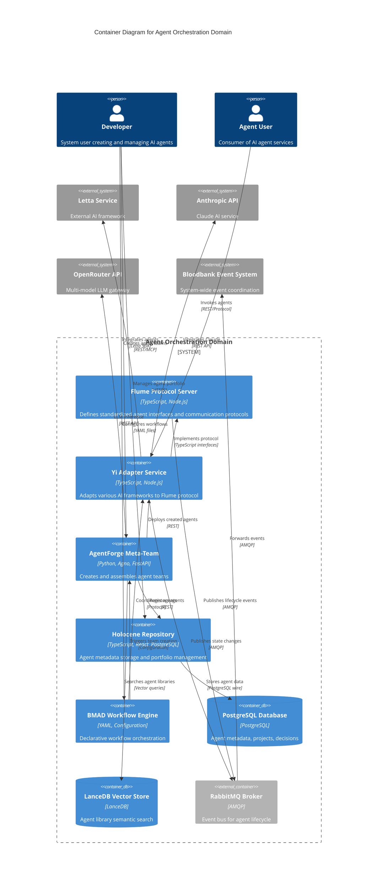

# C4 Container Level: Agent Orchestration Domain

## Overview

The Agent Orchestration domain provides a comprehensive multi-layer architecture for managing AI agents across diverse frameworks. It implements a corporate hierarchy metaphor where agents are "employees" managed through standardized protocols and deployment containers.

**Architecture Layers:**
- **Protocol Layer**: Flume (TypeScript/Node.js interfaces)
- **Adapter Layer**: Yi (Framework adapters for Letta, Agno, Claude, etc.)
- **Meta-Team Layer**: AgentForge (Python/Agno meta-agent system)
- **Repository Layer**: Holocene (TypeScript agent storage and portfolio management)
- **Workflow Engine**: BMAD (YAML-based workflow orchestration)

## Containers

### 1. Flume Protocol Container

- **Name**: Flume Protocol Server
- **Description**: Core protocol layer that defines standardized interfaces for agent communication, hierarchy, and task management
- **Type**: TypeScript/Node.js Library & Runtime
- **Technology**: Node.js 20+, TypeScript, RabbitMQ (event bus)
- **Deployment**: NPM packages (`@flume/core`) + containerized runtime services

#### Purpose
Flume acts as the "USB port" for the agent ecosystem - it defines the shape and contract for agent communication without implementing specific AI logic. It enforces the corporate hierarchy metaphor with Manager, Contributor, and Director roles.

#### Components
This container provides the following core interfaces:

- **Employee Interface**: Base agent contract defining lifecycle states
  - Documentation: Defined in `@flume/core` package
- **Manager Interface**: Delegation and orchestration contract
  - Documentation: Implements delegation strategies and team management
- **Contributor Interface**: Individual contributor (leaf node) contract
  - Documentation: Task execution and result reporting
- **TaskPayload**: Standardized work assignment structure
- **WorkResult**: Standardized deliverable structure
- **State Machine**: Agent lifecycle management (initializing, onboarding, working, blocked)

#### Interfaces

##### Agent Lifecycle Events API
- **Protocol**: RabbitMQ/AMQP Events
- **Description**: Publishes agent state changes and lifecycle events to Bloodbank event bus
- **Event Types**:
  - `flume.agent.initialized` - Agent initialization complete
  - `flume.agent.onboarding` - Agent entering onboarding phase
  - `flume.agent.working` - Agent actively processing task
  - `flume.agent.blocked` - Agent blocked waiting for dependencies
  - `flume.agent.completed` - Task completion event

##### Inter-Agent Communication Protocol
- **Protocol**: TypeScript Interfaces
- **Description**: Defines typed contracts for agent-to-agent communication
- **Key Methods**:
  - `delegate(task: TaskPayload): Promise<WorkResult>` - Delegate work to subordinates
  - `acceptTask(task: TaskPayload): void` - Accept work assignment
  - `reportProgress(status: ProgressUpdate): void` - Report work progress
  - `escalate(issue: BlockingIssue): void` - Escalate blocking issues

#### Dependencies

##### Containers Used
- **RabbitMQ Message Broker**: Event bus for agent state changes and inter-service communication (AMQP)
- **Yi Adapter Container**: Consumes Flume interfaces to implement framework-specific adapters

##### External Systems
- **Bloodbank Event System**: Receives agent lifecycle events for system-wide coordination

#### Infrastructure
- **Deployment Config**: Monorepo structure with workspace packages
- **Scaling**: Stateless protocol layer, scales horizontally with consuming services
- **Resources**:
  - CPU: Minimal (library layer)
  - Memory: Minimal (library layer)
  - Runtime services: 256MB per instance

---

### 2. Yi Adapter Container

- **Name**: Yi Framework Adapter Service
- **Description**: Implementation layer that adapts various AI frameworks (Letta, Agno, Claude) to Flume protocol interfaces
- **Type**: TypeScript/Node.js Service Collection
- **Technology**: Node.js 20+, TypeScript, Letta SDK, Agno SDK, Claude API
- **Deployment**: Multiple NPM packages (`@yi/adapter`, `@yi/letta`, `@yi/agno`) + containerized services

#### Purpose
Yi acts as the "bureaucracy and HR department" - it enforces 33GOD conventions on top of Flume's protocol. Yi provides the machinery to wrap raw LLM outputs into structured Flume-compliant results, manage memory synchronization, and handle agent recruitment/onboarding.

#### Components
This container implements framework-specific adapters:

- **YiAdapter Core**: Abstract base adapter implementation
  - Documentation: Base classes for all framework adapters
- **YiLettaAdapter**: Letta agent framework integration
  - Documentation: Wraps Letta agents as Flume Managers/Contributors
- **YiAgnoAdapter**: Agno agent framework integration (planned)
- **YiClaudeAdapter**: Direct Claude API integration (planned)
- **YiMemoryStrategy**: Cross-agent memory synchronization
  - Documentation: Implements Memory Shards for team context
- **OnboardingSpecialist**: Agent context injection service
  - Documentation: Prepares agents with team context before task acceptance
- **HRDepartment**: Agent lifecycle management service

#### Interfaces

##### Yi Adapter Management API
- **Protocol**: REST/JSON over HTTP
- **Description**: Management API for adapter configuration and agent registration
- **Specification**: See [yi-adapter-api.yaml](#yi-adapter-api-specification)
- **Endpoints**:
  - `POST /adapters/{framework}/agents` - Register new agent with framework
  - `GET /adapters/{framework}/agents/{id}` - Get agent status
  - `PUT /adapters/{framework}/agents/{id}/onboard` - Trigger onboarding
  - `DELETE /adapters/{framework}/agents/{id}` - Deregister agent

##### Memory Shard Synchronization API
- **Protocol**: Internal TypeScript Interfaces
- **Description**: Synchronizes context and memory across team members
- **Key Methods**:
  - `shareContext(shard: MemoryShard): void` - Share context with team
  - `retrieveContext(filter: ContextFilter): MemoryShard[]` - Retrieve team context
  - `mergeContext(shards: MemoryShard[]): MemoryShard` - Merge multiple contexts

##### Framework Integration Interface
- **Protocol**: Framework-specific SDKs
- **Description**: Connects to underlying AI frameworks
- **Frameworks**:
  - Letta: Direct SDK integration
  - Agno: Python subprocess bridge
  - Claude: Anthropic API client

#### Dependencies

##### Containers Used
- **Flume Protocol Container**: Implements Flume interfaces
- **RabbitMQ Message Broker**: Publishes agent events to Bloodbank
- **AgentForge Container**: Requests agent creation when gaps identified

##### External Systems
- **Letta Service**: External Letta server for Letta-based agents
- **Anthropic API**: Claude API for Claude-based agents
- **Bloodbank Event System**: Emits `yi.agent.state.changed` events

#### Infrastructure
- **Deployment Config**: Docker containers per framework adapter
- **Scaling**: Horizontal scaling per framework type
- **Resources**:
  - CPU: 1-2 cores per adapter instance
  - Memory: 512MB-1GB per adapter instance
  - Storage: Minimal (state in Holocene)

---

### 3. AgentForge Meta-Team Container

- **Name**: AgentForge Meta-Agent Service
- **Description**: Python-based meta-agent system that analyzes goals, scouts existing agents, creates new agents, and assembles complete agent teams
- **Type**: Python/Agno Application
- **Technology**: Python 3.12+, Agno 2.0.2+, OpenAI/OpenRouter, LanceDB (vector database), FastAPI
- **Deployment**: Docker container + Python application server

#### Purpose
AgentForge is a meta-agent system that creates other agent systems. Given a high-level goal, it analyzes requirements, scouts existing agent libraries for reusable agents, creates specialized agents to fill gaps, and assembles complete ready-to-deploy agent teams with documentation.

#### Components
This container implements a 5-agent meta-team:

- **Engineering Manager**: Central orchestrator and workflow manager
  - Documentation: [c4-component-engineering-manager.md](./c4-component-engineering-manager.md)
- **Systems Analyst**: Goal decomposition and strategy planning
  - Documentation: [c4-component-systems-analyst.md](./c4-component-systems-analyst.md)
- **Talent Scout**: Agent library search and gap analysis
  - Documentation: [c4-component-talent-scout.md](./c4-component-talent-scout.md)
- **Agent Developer**: Creates new specialized agents
  - Documentation: [c4-component-agent-developer.md](./c4-component-agent-developer.md)
- **Integration Architect**: Team assembly and deployment packaging
  - Documentation: [c4-component-integration-architect.md](./c4-component-integration-architect.md)

#### Interfaces

##### AgentForge Team Creation API
- **Protocol**: REST/JSON over HTTP (FastAPI)
- **Description**: Main API for requesting agent team creation
- **Specification**: See [agentforge-api.yaml](#agentforge-api-specification)
- **Endpoints**:
  - `POST /teams/create` - Create new agent team from goal
  - `GET /teams/{id}` - Get team creation status
  - `GET /teams/{id}/package` - Download complete team package
  - `POST /agents/quick` - Quick single agent creation

##### MCP Integration Interface
- **Protocol**: Model Context Protocol (MCP)
- **Description**: Claude Code/Cline integration via MCP tools
- **MCP Tools**:
  - `agentforge_create_team` - Full team creation workflow
  - `agentforge_analyze_strategy` - Strategic analysis only
  - `agentforge_scout_agents` - Agent discovery only
  - `agentforge_develop_agents` - Create new agents only
  - `agentforge_get_workflow_status` - Monitor workflow progress

##### Agent Library Search API
- **Protocol**: Vector Search (LanceDB)
- **Description**: Semantic search over existing agent libraries
- **Query Methods**:
  - Semantic similarity search
  - Capability-based filtering
  - Domain-specific search

#### Dependencies

##### Containers Used
- **Yi Adapter Container**: Deploys created agents through Yi adapters
- **Holocene Container**: Registers created agents in repository

##### External Systems
- **OpenAI/OpenRouter API**: LLM inference for meta-agents
- **LanceDB**: Vector database for agent library indexing
- **SQLite/PostgreSQL**: Workflow state persistence
- **Agent Library Filesystem**: Scans configured agent library directories

#### Infrastructure
- **Deployment Config**: Docker container with Python 3.12 runtime
- **Scaling**: Single instance per workflow (stateful), can run multiple workflows concurrently
- **Resources**:
  - CPU: 2-4 cores
  - Memory: 2-4GB
  - Storage: 10GB for vector database and agent libraries
  - Typical Processing Time: 30-120 seconds per team creation

---

### 4. Holocene Agent Repository Container

- **Name**: Holocene Agent Repository Service
- **Description**: Full-stack TypeScript application providing persistent storage, portfolio management, and web UI for agent metadata and configurations
- **Type**: Full-Stack Web Application
- **Technology**: Node.js, TypeScript, React, PostgreSQL, Vite
- **Deployment**: Docker container with PostgreSQL database

#### Purpose
Holocene serves as the "agent registry and portfolio manager" - a centralized repository for storing agent metadata, configurations, projects, decisions, and repositories. It provides both programmatic access via REST API and a web-based UI for browsing and managing agents.

#### Components
This container includes:

- **Domain Models**: TypeScript domain entities
  - Employee (Agent metadata)
  - Project (Agent projects)
  - Task (Agent tasks)
  - Decision (Agent decisions)
  - Repo (Code repositories)
- **Repository Layer**: PostgreSQL data access
  - Documentation: Clean architecture repository pattern
- **Service Layer**: Business logic for portfolio management
  - PortfolioService
  - DecisionService
- **Web UI**: React-based frontend
  - Agent portfolio browser
  - Project viewer
  - Decision tracker
- **API Layer**: REST API for programmatic access

#### Interfaces

##### Holocene Agent Repository API
- **Protocol**: REST/JSON over HTTP
- **Description**: CRUD API for agent metadata and portfolio management
- **Specification**: See [holocene-api.yaml](#holocene-api-specification)
- **Endpoints**:
  - `POST /api/agents` - Register new agent
  - `GET /api/agents` - List all agents
  - `GET /api/agents/{id}` - Get agent details
  - `PUT /api/agents/{id}` - Update agent metadata
  - `DELETE /api/agents/{id}` - Remove agent
  - `GET /api/agents/{id}/projects` - Get agent projects
  - `POST /api/agents/{id}/decisions` - Record agent decision
  - `GET /api/agents/{id}/portfolio` - Get complete agent portfolio

##### Web UI Interface
- **Protocol**: HTTPS/Browser
- **Description**: React-based web interface for agent portfolio management
- **Features**:
  - Agent list and search
  - Agent detail views
  - Project tracking
  - Decision history
  - Repository associations

##### Database Interface
- **Protocol**: PostgreSQL wire protocol
- **Description**: Direct database access for repository layer
- **Schema**:
  - `employees` - Agent metadata
  - `projects` - Agent projects
  - `tasks` - Agent tasks
  - `decisions` - Agent decisions
  - `repos` - Code repositories

#### Dependencies

##### Containers Used
- **PostgreSQL Database**: Primary data store
- **Yi Adapter Container**: Receives agent registration events
- **AgentForge Container**: Stores created agent metadata

##### External Systems
- None (self-contained full-stack application)

#### Infrastructure
- **Deployment Config**: Docker Compose with app + PostgreSQL containers
- **Scaling**: Horizontal scaling for API/web tier, single PostgreSQL instance
- **Resources**:
  - CPU: 1-2 cores
  - Memory: 1-2GB (app) + 512MB-1GB (database)
  - Storage: 10-50GB for PostgreSQL data

---

### 5. BMAD Workflow Engine Container

- **Name**: BMAD Workflow Configuration Service
- **Description**: YAML-based workflow orchestration system for project planning and agent coordination
- **Type**: Configuration-Driven Workflow Engine
- **Technology**: YAML configuration files, Claude Code integration
- **Deployment**: File-based configuration system (embedded in projects)

#### Purpose
BMAD (presumably "Business Method for Agile Development") provides declarative workflow configuration for project planning, story generation, and agent task coordination. It serves as a lightweight workflow orchestration layer that can be embedded in any project via YAML configuration.

#### Components
This container provides:

- **Configuration Schema**: YAML-based project configuration
  - Project metadata (name, type, level)
  - Agent behavior overrides
  - Workflow customization
  - Sprint configuration
- **Agent Overrides**: Custom agent behavior definitions
- **Story Management**: Documentation and story generation workflows
- **Integration Layer**: Claude Code workflow integration

#### Interfaces

##### BMAD Configuration API
- **Protocol**: File-based YAML configuration
- **Description**: Declarative workflow definition via `config.yaml`
- **Configuration Structure**:
  - `bmad_version`: BMAD version specification
  - `project_name`: Project identifier
  - `project_type`: Project category (api, web-app, mobile-app, etc.)
  - `project_level`: Complexity level (0-4)
  - `output_folder`: Documentation output location
  - `agent_overrides_folder`: Custom agent behavior directory
  - `sprint_configuration`: Sprint planning parameters

##### Agent Override Interface
- **Protocol**: File-based agent definitions
- **Description**: Custom agent behavior and prompt overrides
- **Location**: `bmad/agent-overrides/` directory
- **Format**: Agent-specific configuration files

##### Workflow Execution Interface
- **Protocol**: Claude Code integration
- **Description**: Triggers workflows via Claude Code commands
- **Commands**:
  - BMAD story generation
  - Sprint planning
  - Documentation generation
  - Agent task coordination

#### Dependencies

##### Containers Used
- **AgentForge Container**: Can trigger agent team creation for complex workflows
- **Flume/Yi Containers**: Coordinates agents for workflow execution

##### External Systems
- **Claude Code**: Primary execution environment
- **Git**: Version control for workflow configurations
- **Issue Trackers**: Optional integration (GitHub, Jira, Linear)

#### Infrastructure
- **Deployment Config**: Embedded in project repositories via `bmad/` directory
- **Scaling**: No runtime scaling (configuration-driven)
- **Resources**:
  - CPU: N/A (file-based)
  - Memory: N/A (file-based)
  - Storage: <1MB per project configuration

---

## Container Diagram



---

## Architecture Patterns

### 1. Protocol-Adapter Pattern
The domain implements a clean separation between protocol definition (Flume) and implementation (Yi). This allows:
- Framework agnostic agent development
- Easy addition of new AI frameworks
- Consistent agent lifecycle management
- Standardized inter-agent communication

### 2. Meta-Agent Pattern
AgentForge demonstrates meta-level agent orchestration:
- Agents that create other agents
- Self-improving agent libraries
- Automated team composition
- Goal-driven agent generation

### 3. Repository Pattern
Holocene implements clean architecture with:
- Domain model isolation
- Repository abstraction for data access
- Service layer for business logic
- Clear separation of concerns

### 4. Event-Driven Coordination
Agent lifecycle and state changes flow through event bus:
- Loose coupling between containers
- Asynchronous communication
- System-wide observability
- Event sourcing for agent history

### 5. Configuration-Driven Workflows
BMAD provides declarative workflow definition:
- Infrastructure as code for agent workflows
- Version-controlled agent behavior
- Project-specific customization
- Reproducible agent coordination

---

## Deployment Architecture

### Technology Stack Summary

**TypeScript/Node.js Stack:**
- Flume Protocol Layer (core interfaces)
- Yi Adapters (framework integration)
- Holocene Repository (full-stack app)

**Python Stack:**
- AgentForge Meta-Team (Agno-based)
- Agent creation and orchestration

**Data Tier:**
- PostgreSQL (agent metadata, relational data)
- LanceDB (vector search, semantic matching)
- RabbitMQ (event bus, async messaging)

**Configuration:**
- YAML (BMAD workflow definitions)
- JSON (agent configurations)

### Communication Protocols

**Internal Communication:**
- TypeScript interfaces (in-process)
- REST/JSON (inter-service HTTP)
- AMQP (asynchronous events)
- PostgreSQL wire protocol (database)

**External Integration:**
- REST APIs (Letta, Anthropic, OpenRouter)
- MCP (Claude Code integration)
- WebSocket (potential real-time updates)

### Deployment Scenarios

**Development:**
- Local Node.js processes
- Docker Compose for dependencies
- File-based BMAD configurations

**Production:**
- Kubernetes pods per container
- Managed PostgreSQL (AWS RDS, Azure Database)
- Managed RabbitMQ (CloudAMQP, AWS MQ)
- Container registry (Docker Hub, ECR)

---

## API Specifications

### Yi Adapter API Specification

```yaml
openapi: 3.1.0
info:
  title: Yi Adapter Management API
  description: Management API for Yi framework adapters and agent registration
  version: 0.1.0
servers:
  - url: https://yi.33god.io
    description: Production Yi Adapter Service
paths:
  /adapters/{framework}/agents:
    post:
      summary: Register new agent with framework
      parameters:
        - name: framework
          in: path
          required: true
          schema:
            type: string
            enum: [letta, agno, claude]
      requestBody:
        content:
          application/json:
            schema:
              type: object
              properties:
                name:
                  type: string
                agentType:
                  type: string
                configuration:
                  type: object
      responses:
        '201':
          description: Agent registered successfully
          content:
            application/json:
              schema:
                type: object
                properties:
                  id:
                    type: string
                  status:
                    type: string
                  frameworkId:
                    type: string

  /adapters/{framework}/agents/{id}:
    get:
      summary: Get agent status
      parameters:
        - name: framework
          in: path
          required: true
          schema:
            type: string
        - name: id
          in: path
          required: true
          schema:
            type: string
      responses:
        '200':
          description: Agent status
          content:
            application/json:
              schema:
                type: object
                properties:
                  id:
                    type: string
                  name:
                    type: string
                  status:
                    type: string
                    enum: [initializing, onboarding, ready, working, blocked]
                  frameworkId:
                    type: string
```

### AgentForge API Specification

```yaml
openapi: 3.1.0
info:
  title: AgentForge Team Creation API
  description: API for creating and managing AI agent teams
  version: 1.0.0
servers:
  - url: https://agentforge.33god.io
    description: Production AgentForge Service
paths:
  /teams/create:
    post:
      summary: Create new agent team from goal
      requestBody:
        content:
          application/json:
            schema:
              type: object
              required:
                - goal_description
                - domain
              properties:
                goal_description:
                  type: string
                  description: High-level goal description
                domain:
                  type: string
                  description: Problem domain (e.g., web development, data analysis)
                complexity_level:
                  type: string
                  enum: [low, medium, high, enterprise]
                  default: medium
                timeline:
                  type: string
                  nullable: true
                constraints:
                  type: array
                  items:
                    type: string
                success_criteria:
                  type: array
                  items:
                    type: string
      responses:
        '202':
          description: Team creation initiated
          content:
            application/json:
              schema:
                type: object
                properties:
                  team_id:
                    type: string
                  status:
                    type: string
                    enum: [queued, analyzing, scouting, developing, integrating, packaging]
                  estimated_completion:
                    type: string
                    format: date-time

  /teams/{id}:
    get:
      summary: Get team creation status
      parameters:
        - name: id
          in: path
          required: true
          schema:
            type: string
      responses:
        '200':
          description: Team status
          content:
            application/json:
              schema:
                type: object
                properties:
                  team_id:
                    type: string
                  status:
                    type: string
                  progress:
                    type: number
                    format: float
                    minimum: 0
                    maximum: 1
                  current_step:
                    type: string
                  new_agents_created:
                    type: integer
                  existing_agents_reused:
                    type: integer
```

### Holocene Repository API Specification

```yaml
openapi: 3.1.0
info:
  title: Holocene Agent Repository API
  description: CRUD API for agent metadata and portfolio management
  version: 1.0.0
servers:
  - url: https://holocene.33god.io
    description: Production Holocene Service
paths:
  /api/agents:
    get:
      summary: List all agents
      parameters:
        - name: type
          in: query
          schema:
            type: string
            enum: [letta, agno, claude, custom]
        - name: salary
          in: query
          schema:
            type: string
            enum: [junior, mid, senior, principal, fellow]
        - name: active
          in: query
          schema:
            type: boolean
      responses:
        '200':
          description: List of agents
          content:
            application/json:
              schema:
                type: array
                items:
                  $ref: '#/components/schemas/Agent'
    post:
      summary: Register new agent
      requestBody:
        content:
          application/json:
            schema:
              $ref: '#/components/schemas/AgentCreate'
      responses:
        '201':
          description: Agent created
          content:
            application/json:
              schema:
                $ref: '#/components/schemas/Agent'

components:
  schemas:
    Agent:
      type: object
      properties:
        id:
          type: string
        name:
          type: string
        agentType:
          type: string
          enum: [letta, agno, claude, custom]
        salary:
          type: string
          enum: [junior, mid, senior, principal, fellow]
        personality:
          type: string
        background:
          type: string
        activeTaskId:
          type: string
          nullable: true
        domainsOfExperience:
          type: array
          items:
            type: string
        domainsOfExpertise:
          type: array
          items:
            type: string
        createdAt:
          type: string
          format: date-time
        updatedAt:
          type: string
          format: date-time

    AgentCreate:
      type: object
      required:
        - name
        - agentType
        - salary
      properties:
        name:
          type: string
        agentType:
          type: string
          enum: [letta, agno, claude, custom]
        salary:
          type: string
          enum: [junior, mid, senior, principal, fellow]
        personality:
          type: string
        background:
          type: string
```

---

## Scalability & Performance Considerations

### Horizontal Scaling

**Stateless Containers (Can Scale Freely):**
- Yi Adapter instances (per framework type)
- Flume Protocol runtime (if deployed as service)
- Holocene API tier

**Stateful Containers (Limited Scaling):**
- AgentForge (workflow state, can run multiple concurrent workflows)
- PostgreSQL (single instance with replication)
- LanceDB (single instance, optimized for read-heavy workload)

### Performance Characteristics

**AgentForge Team Creation:**
- Typical Duration: 30-120 seconds
- Concurrent Teams: Multiple workflows supported
- Bottleneck: LLM API rate limits

**Yi Adapter Response:**
- Agent Registration: <100ms
- Task Delegation: <500ms (excluding LLM inference)
- Memory Synchronization: <50ms

**Holocene Repository:**
- Agent Query: <50ms
- Portfolio Retrieval: <200ms
- Database: Standard PostgreSQL performance

### Resource Requirements

**Development Environment:**
- Total CPU: 4-8 cores
- Total Memory: 8-12GB
- Storage: 20-50GB

**Production Environment:**
- Yi Adapters: 2-4 instances @ 1GB each
- AgentForge: 1-2 instances @ 4GB each
- Holocene: 2-4 instances @ 1GB each
- PostgreSQL: 1 instance @ 2-4GB
- RabbitMQ: 1 instance @ 1GB

---

## Security Considerations

### Authentication & Authorization

- **API Authentication**: Bearer token / API key authentication for all REST endpoints
- **Framework Credentials**: Secure storage of Letta, Anthropic, OpenRouter API keys
- **Database Security**: PostgreSQL role-based access control
- **Event Bus Security**: RabbitMQ user/password authentication

### Data Protection

- **Agent Secrets**: Environment variable injection, never in code
- **Memory Shards**: Encrypted at rest in PostgreSQL
- **API Communication**: TLS/HTTPS for all external communication
- **Vector Database**: Access control on LanceDB queries

### Network Security

- **Internal Communication**: Private network for container-to-container
- **External APIs**: Whitelist IP ranges for external service access
- **Event Bus**: Isolated AMQP channels per service

---

## Monitoring & Observability

### Metrics

**Container Health:**
- CPU/Memory usage per container
- Request latency percentiles (p50, p95, p99)
- Error rates and response codes
- Active connections

**Business Metrics:**
- Agents created per hour
- Agent teams assembled per day
- Average team creation time
- Framework usage distribution (Letta vs Agno vs Claude)

### Logging

**Structured Logging:**
- JSON-formatted logs from all containers
- Correlation IDs for distributed tracing
- Log levels: DEBUG, INFO, WARN, ERROR
- Centralized log aggregation (ELK, CloudWatch)

**Event Logging:**
- All agent lifecycle events to Bloodbank
- API access logs
- Database query logs (slow queries)

### Tracing

**Distributed Tracing:**
- OpenTelemetry instrumentation
- Trace agent requests across containers
- Identify performance bottlenecks
- Debug inter-container communication

---

## Disaster Recovery & Backup

### Data Backup

**PostgreSQL (Holocene):**
- Daily automated backups
- Point-in-time recovery capability
- Backup retention: 30 days

**LanceDB (AgentForge):**
- Periodic vector database snapshots
- Rebuild capability from agent library filesystem

**Configuration (BMAD):**
- Git version control for all configurations
- Infrastructure as code

### Recovery Procedures

**Container Failure:**
- Kubernetes automatic pod restart
- Health check endpoints for all services
- Circuit breaker patterns for external API calls

**Database Failure:**
- PostgreSQL replication (primary-replica)
- Automatic failover to replica
- Manual restore from backup if needed

---

## Future Enhancements

### Planned Features

1. **Additional Framework Adapters:**
   - Yi Agno Adapter (Python subprocess bridge)
   - Yi Claude Adapter (direct API integration)
   - Yi Custom Framework Adapter SDK

2. **Enhanced AgentForge:**
   - Real-time collaboration features
   - Multi-modal agent support
   - A/B testing for generated agents
   - Agent marketplace integration

3. **Holocene Improvements:**
   - GraphQL API option
   - Real-time WebSocket updates
   - Advanced portfolio analytics
   - Agent performance tracking

4. **BMAD Extensions:**
   - Visual workflow designer
   - Git integration for automatic workflow triggers
   - Issue tracker bidirectional sync
   - Sprint automation features

### Architectural Evolution

**Microservices Decomposition:**
- Split Yi adapters into separate microservices per framework
- Extract memory synchronization into dedicated service
- Separate AgentForge meta-agents into individual services

**Event Sourcing:**
- Full event sourcing for agent lifecycle
- Event replay for debugging and analytics
- CQRS pattern for read/write separation

**Distributed Vector Search:**
- Scale LanceDB with distributed vector database (Pinecone, Weaviate)
- Multi-region agent library replication

---

## Related Documentation

- [Agent Orchestration Domain Overview](./README.md)
- [C4 Context Diagram](./c4-context.md)
- [Component-Level Documentation](./c4-component-*.md)
- [Flume Protocol Specification](../../flume/README.md)
- [Yi Adapter Guide](../../yi/README.md)
- [AgentForge User Guide](../../agent-forge/README.md)
- [Holocene Architecture](../../holocene/ARCHITECTURE.md)
- [BMAD Workflow Guide](../../bmad/README.md)

---

**Document Version**: 1.0.0
**Last Updated**: 2026-01-29
**Maintained By**: Agent Orchestration Team
**Review Cycle**: Quarterly
