# C4 Context Level: Agent Orchestration Domain

## System Overview

### Short Description
Protocol-driven agent orchestration system that provides framework-agnostic hierarchical task delegation and meta-agent team building across multiple AI SDKs.

### Long Description
The Agent Orchestration domain provides the foundational protocols and adapters that enable autonomous agent teams to work together regardless of their underlying implementation framework. It combines the Flume protocol (defining corporate-like hierarchies and communication interfaces), Yi adapters (framework-specific implementations for Letta, Agno, and Smolagents), AgentForge (meta-agent system for dynamic team creation), Holocene (observability dashboard), and BMAD methodology (workflow orchestration). The system enables agents to self-organize, delegate tasks intelligently, maintain shared memory, and operate within a corporate hierarchy metaphor that mirrors real-world organizational structures.

## Personas

### Software Developer (Human User)
- **Type**: Human User
- **Description**: Technical users who create agent teams, define tasks, and monitor agent execution through CLI and web interfaces
- **Goals**:
  - Create specialized agent teams for specific projects
  - Monitor agent performance and task completion
  - Integrate agent orchestration into development workflows
  - Debug and optimize agent behavior
- **Key Features Used**: AgentForge team creation, Holocene observability, Flume task delegation, BMAD workflow orchestration

### Product Manager (Human User)
- **Type**: Human User
- **Description**: Non-technical stakeholders who define high-level goals and monitor project progress
- **Goals**:
  - Define project objectives and success criteria
  - Monitor team velocity and task completion
  - Understand system bottlenecks without technical details
  - Track ROI and resource allocation
- **Key Features Used**: Task creation via Plane UI, Holocene dashboards, high-level team status

### Engineering Manager (Meta-Agent)
- **Type**: Programmatic User (Meta-Agent)
- **Description**: Orchestrator agent in AgentForge that coordinates the meta-team to build other agent teams
- **Goals**:
  - Analyze project goals and determine optimal team structure
  - Coordinate Systems Analyst, Talent Scout, Agent Developer, and Integration Architect
  - Package final deliverables and documentation
  - Ensure quality gates are met
- **Key Features Used**: Meta-team orchestration, agent creation workflow, HR integration

### Systems Analyst (Meta-Agent)
- **Type**: Programmatic User (Meta-Agent)
- **Description**: Strategic analysis agent that decomposes complex goals into discrete capabilities
- **Goals**:
  - Break down high-level goals into specific agent roles and capabilities
  - Define ideal team structures and communication patterns
  - Create comprehensive strategy documents
  - Identify skill requirements for each role
- **Key Features Used**: Goal analysis, capability mapping, team structure design

### Talent Scout (Meta-Agent)
- **Type**: Programmatic User (Meta-Agent)
- **Description**: Agent library manager that finds reusable agents and identifies gaps
- **Goals**:
  - Search existing agent libraries using semantic matching
  - Identify reusable agents that match required capabilities
  - Detect gaps that require new agent creation
  - Recommend agent adaptations
- **Key Features Used**: Vector search, agent library indexing, semantic matching

### Agent Developer (Meta-Agent)
- **Type**: Programmatic User (Meta-Agent)
- **Description**: Agent creator that generates specialized agents for identified gaps
- **Goals**:
  - Create new agents optimized for specific roles
  - Follow established agent design patterns
  - Ensure generated agents meet quality standards
  - Adapt existing agents for new contexts
- **Key Features Used**: Agent generation, prompt engineering, quality validation

### Integration Architect (Meta-Agent)
- **Type**: Programmatic User (Meta-Agent)
- **Description**: Team assembly agent that combines existing and new agents into functioning teams
- **Goals**:
  - Assemble final teams from scouted and generated agents
  - Define operational workflows and communication protocols
  - Create deployment documentation and playbooks
  - Ensure team coherence and capability coverage
- **Key Features Used**: Team assembly, workflow design, documentation generation

### Manager Agent (Operational Agent)
- **Type**: Programmatic User (Operational Agent)
- **Description**: Flume Manager role that can both execute tasks and delegate to subordinates (like a Tech Lead)
- **Goals**:
  - Accept tasks from Directors or other Managers
  - Decide whether to execute directly or delegate to Contributor agents
  - Coordinate team of subordinate agents
  - Report status and results up the hierarchy
- **Key Features Used**: Task delegation, selection strategies, team management, work execution

### Contributor Agent (Operational Agent)
- **Type**: Programmatic User (Operational Agent)
- **Description**: Flume Contributor role that executes tasks directly (Individual Contributor)
- **Goals**:
  - Accept tasks matched to their skills and expertise
  - Execute work and produce results
  - Report status and completion
  - Learn from experience through memory
- **Key Features Used**: Task execution, skill matching, work result generation, memory updates

### Director Agent (Operational Agent)
- **Type**: Programmatic User (Operational Agent)
- **Description**: Flume Director role that orchestrates but never executes directly (pure delegator)
- **Goals**:
  - Coordinate high-level project objectives
  - Delegate work to Manager and Contributor agents
  - Monitor team progress
  - Escalate blockers to human users when needed
- **Key Features Used**: Pure delegation, team orchestration, status monitoring

### External LLM Service
- **Type**: External System
- **Description**: AI model providers (OpenAI, Anthropic, DeepSeek, etc.) that power agent intelligence
- **Goals**:
  - Provide natural language understanding and generation
  - Enable agent decision-making and reasoning
  - Support semantic matching and embeddings
- **Key Features Used**: Agent inference, selection strategies, semantic search

### Plane (External System)
- **Type**: External System
- **Description**: Project management UI/API that provides human-friendly task management
- **Goals**:
  - Provide web UI for task creation and management
  - Sync tasks bidirectionally with 33GOD
  - Track sprints, cycles, and modules
  - Enable human oversight and intervention
- **Key Features Used**: Task synchronization, webhook integration, status updates

## System Features

### Meta-Agent Team Building
- **Description**: Automatically analyzes high-level goals and assembles optimal agent teams by reusing existing agents and creating new specialized agents
- **Users**: Software Developer, Engineering Manager, Systems Analyst, Talent Scout, Agent Developer, Integration Architect
- **User Journey**: [Meta-Agent Team Building Journey](#meta-agent-team-building-journey)

### Hierarchical Task Delegation
- **Description**: Protocol-based task assignment system that enables agents to delegate work through corporate-like hierarchies (Directors → Managers → Contributors)
- **Users**: Manager Agent, Contributor Agent, Director Agent, Software Developer
- **User Journey**: [Task Delegation Journey](#task-delegation-journey)

### Framework-Agnostic Agent Adapters
- **Description**: Yi adapter layer that wraps Letta, Agno, and Smolagents into unified Flume protocol, enabling mixed-framework agent teams
- **Users**: All Operational Agents, Software Developer
- **User Journey**: [Multi-Framework Integration Journey](#multi-framework-integration-journey)

### BMAD Workflow Orchestration
- **Description**: Structured workflow system for coordinating complex agent tasks through defined phases (brainstorming, documentation, implementation, validation)
- **Users**: Software Developer, Manager Agent, Director Agent
- **User Journey**: [BMAD Workflow Journey](#bmad-workflow-journey)

### Agent Observability and Monitoring
- **Description**: Real-time dashboard and event tracking system (Holocene) that provides visibility into agent states, task flow, and delegation chains
- **Users**: Software Developer, Product Manager, All Agent Personas
- **User Journey**: [Observability Journey](#observability-journey)

### Dynamic Agent Recruitment
- **Description**: HR Department integration that creates, onboards, and terminates agents based on team needs
- **Users**: Manager Agent, Director Agent, Engineering Manager
- **User Journey**: [Agent Recruitment Journey](#agent-recruitment-journey)

### Shared Team Memory
- **Description**: Unified memory strategy that synchronizes context and knowledge across team members regardless of framework
- **Users**: All Operational Agents, Manager Agent
- **User Journey**: [Memory Synchronization Journey](#memory-synchronization-journey)

### Hive Mind Collective Intelligence
- **Description**: Distributed coordination system where agents share knowledge, build consensus, and operate as a collective unit
- **Users**: All Operational Agents, Director Agent
- **User Journey**: [Hive Mind Coordination Journey](#hive-mind-coordination-journey)

## User Journeys

### Meta-Agent Team Building Journey

**Persona**: Software Developer → Engineering Manager → Systems Analyst → Talent Scout → Agent Developer → Integration Architect

1. **Goal Definition**: Developer provides high-level goal (e.g., "Build a customer support chatbot")
2. **Meta-Team Activation**: Engineering Manager activates the 5-agent meta-team
3. **Strategic Analysis**: Systems Analyst decomposes goal into capabilities (NLP, database, API integration, testing, deployment)
4. **Agent Scouting**: Talent Scout searches existing agent libraries using vector embeddings
5. **Gap Identification**: Talent Scout identifies missing capabilities (e.g., custom CRM integration)
6. **Agent Creation**: Agent Developer generates specialized agents to fill gaps
7. **Team Assembly**: Integration Architect combines scouted and generated agents into cohesive team
8. **Documentation**: Integration Architect creates operational playbook and deployment guide
9. **Delivery**: Engineering Manager packages final team with documentation
10. **Deployment**: Developer deploys ready-to-use agent team

**Touchpoints**:
- CLI: `agentforge_create_team` MCP tool or `python main.py`
- AgentForge API: Programmatic team creation
- Vector Database: Agent library search (QDrant)
- LLM Service: Strategic analysis and agent generation
- File System: Agent definitions and documentation storage

---

### Task Delegation Journey

**Persona**: Software Developer → Director Agent → Manager Agent → Contributor Agent

1. **Task Creation**: Developer creates task in Plane UI or via CLI
2. **Task Sync**: Task synchronized to 33GOD shadow layer with extended metadata
3. **Director Reception**: Director Agent receives task from Bloodbank event
4. **Team Analysis**: Director analyzes subordinate agents and their capabilities
5. **Selection Strategy**: Director uses LLM-driven selection to choose best Manager
6. **Manager Assignment**: Task delegated to Manager Agent with context
7. **Manager Decision**: Manager evaluates task complexity and team capacity
8. **Contributor Matching**: Manager uses `canHandle()` confidence scoring to select Contributor
9. **Task Execution**: Contributor Agent executes work and generates WorkResult
10. **Result Propagation**: WorkResult bubbles up through Manager to Director
11. **Status Update**: Final status synchronized back to Plane
12. **Human Notification**: Developer sees completed task in Plane UI

**Touchpoints**:
- Plane UI: Task creation and status viewing
- Plane API: Bidirectional sync
- Bloodbank: `flume.task.created`, `flume.task.assigned`, `flume.task.completed` events
- PostgreSQL: Task state and assignment records
- Yi Adapters: Framework-specific agent invocation
- LLM Service: Selection strategy execution

---

### Multi-Framework Integration Journey

**Persona**: Manager Agent (Letta-based) → Contributor Agent (Agno-based) → Contributor Agent (Smolagents-based)

1. **Team Formation**: Mixed-framework team assembled (Letta Manager + Agno Contributor + Smolagents Contributor)
2. **Task Acceptance**: Letta Manager receives task through Flume protocol
3. **Memory Injection**: Yi adapter synchronizes TeamContext to all agents via respective memory systems
4. **Skill Assessment**: Letta Manager queries Agno and Smolagents Contributors via `canHandle()`
5. **Framework Translation**: Yi adapters translate Flume `TaskPayload` to framework-specific formats
6. **Parallel Execution**: Agno and Smolagents Contributors work on subtasks simultaneously
7. **Result Collection**: Yi adapters translate framework-specific outputs to Flume `WorkResult`
8. **Memory Update**: Shared learnings synchronized across team memory stores
9. **Aggregation**: Letta Manager combines results into unified WorkResult
10. **Delivery**: Final result delivered through Flume protocol

**Touchpoints**:
- Flume Protocol: Unified interfaces (Manager, Contributor, TaskPayload, WorkResult)
- Yi Adapters: `LettaContributor`, `AgnoContributor`, `SmolContributor` wrappers
- Memory Systems: Letta Core Memory, Agno AgentFile, Smolagents custom storage
- LLM Service: Inference for each framework's agents
- Bloodbank: Agent state change events

---

### BMAD Workflow Journey

**Persona**: Software Developer → Director Agent → Manager Agents (PM, Architect, QA)

1. **Workflow Initialization**: Developer triggers BMAD workflow for feature implementation
2. **Phase 1 - Brainstorming**: Director delegates to Brainstorming Manager for ideation
3. **Artifact Generation**: Brainstorming phase produces ideas document
4. **Phase 2 - Documentation**: Documentation Manager creates PRD from brainstorming output
5. **Gating**: Architect Manager reviews PRD for technical feasibility
6. **Phase 3 - Modeling**: Architecture Manager designs system architecture
7. **Phase 4 - Analysis**: QA Manager defines acceptance criteria and test strategy
8. **Phase 5 - Development**: Engineering Manager orchestrates implementation team
9. **Validation**: QA Manager validates implementation against acceptance criteria
10. **Completion**: Final artifacts (code, docs, tests) packaged and delivered
11. **Metrics Tracking**: All phase durations and artifact quality logged to Holocene

**Touchpoints**:
- BMAD Config: `bmad/config.yaml` defines workflow phases
- Bloodbank: Phase transition events
- PostgreSQL: Artifact storage and phase tracking
- Git: Code commits tracked to tasks
- Holocene: Phase duration metrics and bottleneck analysis

---

### Observability Journey

**Persona**: Product Manager → Holocene Dashboard

1. **Dashboard Access**: Product Manager opens Holocene web dashboard
2. **Agent State View**: Real-time grid showing all agents and their current states
3. **Task Flow View**: Visualization of active tasks and delegation chains
4. **Selection Analysis**: Drill-down into why specific agents were chosen for tasks
5. **Performance Metrics**: View agent throughput, token usage, and completion rates
6. **Delegation Depth**: Analyze delegation chain complexity and bottlenecks
7. **Failure Investigation**: Filter failed tasks and review error reasons
8. **Team Velocity**: Track story points completed over time
9. **Alert Configuration**: Set alerts for blocked agents or long-running tasks
10. **Export Report**: Generate PDF summary for stakeholder review

**Touchpoints**:
- Holocene Web UI: React-based dashboard
- PostgreSQL: Query `agent_state_history`, `tasks`, `sessions`, `artifacts`
- Bloodbank: Subscribe to real-time state change events
- WebSocket: Live updates pushed to dashboard

---

### Agent Recruitment Journey

**Persona**: Manager Agent → HR Department (Agent Forge) → Onboarding Specialist → New Contributor Agent

1. **Skill Gap Detection**: Manager Agent identifies need for specialized agent (e.g., Python expert)
2. **Recruitment Request**: Manager submits `RecruitmentRequest` with required skills
3. **Candidate Search**: HR Department queries Agent Forge for matching blueprints
4. **Blueprint Selection**: HR selects AgentBlueprint with optimal skill match
5. **Agent Creation**: Agent Forge instantiates new agent with system prompt and personality
6. **Onboarding**: Onboarding Specialist injects TeamContext and MemoryShard
7. **Readiness Verification**: Onboarding runs verification steps (context recall, skill confirmation)
8. **Team Integration**: New agent added to Manager's subordinates list
9. **State Transition**: Agent moves from `initializing` → `onboarding` → `idle`
10. **First Assignment**: Manager delegates task to newly recruited agent
11. **Performance Tracking**: HR monitors new agent's initial task completions

**Touchpoints**:
- Yi HR Department: `fulfillRequest()`, `findCandidates()`
- Agent Forge: BMAD-based agent generation
- PostgreSQL: Insert into `employees`, `memory_shards`, `teams`
- Bloodbank: `yi.agent.created`, `yi.agent.onboarding.completed`, `yi.team.member.added`

---

### Memory Synchronization Journey

**Persona**: Manager Agent → Contributor Agents (multiple frameworks)

1. **Project Kickoff**: Manager receives new project with extensive context
2. **Context Storage**: Manager stores project context in team knowledge base
3. **Team Meeting**: Manager broadcasts context update to all subordinates
4. **Memory Injection**: Yi adapter translates context to each framework's memory format
   - Letta: Update core memory blocks
   - Agno: Write to AgentFile
   - Smolagents: Update custom memory store
5. **Task Execution**: Contributor recalls context during task execution
6. **Learning Event**: Contributor discovers new pattern/solution
7. **Memory Update**: Contributor writes learning to personal memory
8. **Team Sharing**: Contributor broadcasts learning to team memory
9. **Synchronization**: Yi adapter propagates learning to all team members
10. **Future Recall**: Other Contributors access shared learning in subsequent tasks

**Touchpoints**:
- Yi Memory Strategy: `syncTeamContext()`, `injectMemory()`, `recallMemory()`
- QDrant: Vector storage for semantic search
- Letta Core Memory: Block-based memory management
- Agno AgentFile: File-based agent context
- Neo4j: Graph-based knowledge relationships (optional)
- Bloodbank: Memory update events

---

### Hive Mind Coordination Journey

**Persona**: Director Agent → Manager Agents (swarm) → Hive Mind System

1. **Swarm Initialization**: Director activates hive mind mode for complex parallel work
2. **Topology Setup**: Mesh topology established for peer-to-peer coordination
3. **Task Distribution**: Director broadcasts tasks to all Manager agents simultaneously
4. **Consensus Building**: Managers use gossip protocol to agree on work partitioning
5. **Parallel Execution**: Each Manager leads a sub-team working on different aspects
6. **Knowledge Broadcasting**: Discoveries shared across entire swarm in real-time
7. **Dynamic Load Balancing**: Overloaded Managers request help from peers
8. **Byzantine Fault Tolerance**: System detects and isolates faulty agents
9. **Result Aggregation**: Hive mind system combines all sub-results using CRDT synchronization
10. **Collective Decision**: Swarm reaches consensus on final output quality
11. **Delivery**: Unified result delivered to Director
12. **Learning Integration**: Collective patterns stored in swarm memory for future use

**Touchpoints**:
- Claude Flow MCP: `swarm_init`, `agent_spawn`, `task_orchestrate`
- RUV Swarm (optional): Enhanced coordination features
- Bloodbank: Swarm coordination events
- Memory System: Shared swarm knowledge base
- Neural Patterns: Collective learning storage

## External Systems and Dependencies

### OpenAI API
- **Type**: API / LLM Service
- **Description**: Provides GPT-4, GPT-4o, and embedding models for agent inference and semantic search
- **Integration Type**: REST API
- **Purpose**: Powers agent reasoning, natural language generation, and vector embeddings for agent library search

### Anthropic API (Claude)
- **Type**: API / LLM Service
- **Description**: Provides Claude models (Opus, Sonnet, Haiku) for agent inference
- **Integration Type**: REST API
- **Purpose**: Alternative LLM provider for agent intelligence, especially for reasoning-heavy tasks

### DeepSeek API
- **Type**: API / LLM Service
- **Description**: Provides DeepSeek models optimized for coding tasks
- **Integration Type**: REST API
- **Purpose**: Cost-effective LLM for agent teams focused on software development

### OpenRouter
- **Type**: API Gateway
- **Description**: Unified API gateway for multiple LLM providers
- **Integration Type**: REST API
- **Purpose**: Enables seamless switching between different LLM providers without code changes

### Letta Framework
- **Type**: Python SDK / Agent Framework
- **Description**: Agent framework with sophisticated core memory management and conversational abilities
- **Integration Type**: Python SDK
- **Purpose**: Enables creation of Letta-based agents with persistent memory and context management

### Agno Framework
- **Type**: Python SDK / Agent Framework
- **Description**: Multi-agent framework with structured workflows and agent coordination
- **Integration Type**: Python SDK
- **Purpose**: Enables creation of Agno-based agents with built-in multi-agent patterns

### Smolagents Framework
- **Type**: Python SDK / Agent Framework
- **Description**: Lightweight agent framework optimized for simple, fast agent interactions
- **Integration Type**: Python SDK
- **Purpose**: Enables creation of Smolagents-based agents for tasks requiring minimal overhead

### PostgreSQL Database
- **Type**: Database (Relational)
- **Description**: Global 33GOD database storing all agent, task, session, and artifact records
- **Integration Type**: Direct database connection (SQLx, SQLAlchemy)
- **Purpose**: Centralized source of truth for system state, enables querying and observability

### QDrant Vector Database
- **Type**: Database (Vector)
- **Description**: Vector storage for agent library indexing and semantic search
- **Integration Type**: REST API / Python SDK
- **Purpose**: Enables Talent Scout to find matching agents using embedding similarity

### LanceDB Vector Database
- **Type**: Database (Vector)
- **Description**: Alternative vector storage for embedded agent knowledge
- **Integration Type**: Python SDK
- **Purpose**: Local vector storage for agent library when QDrant not available

### Neo4j Graph Database
- **Type**: Database (Graph)
- **Description**: Optional graph database for complex knowledge relationships
- **Integration Type**: Bolt Protocol / Python Driver
- **Purpose**: Stores hierarchical agent relationships and knowledge graph

### Bloodbank (RabbitMQ)
- **Type**: Message Queue / Event Bus
- **Description**: Event-driven message bus for all state changes and inter-component communication
- **Integration Type**: AMQP Protocol
- **Purpose**: Decouples components, enables event sourcing, provides audit trail for all agent actions

### Plane
- **Type**: Web Application / API
- **Description**: Open-source project management platform (Jira alternative) for task management
- **Integration Type**: REST API + Webhooks
- **Purpose**: Provides human-friendly UI for task creation, status tracking, and team collaboration

### iMi (Worktree Manager)
- **Type**: Internal Service
- **Description**: Git worktree management service for isolating agent work environments
- **Integration Type**: REST API + Bloodbank Events
- **Purpose**: Creates isolated worktrees for each agent session, prevents conflicts

### Jelmore (Session Manager)
- **Type**: Internal Service
- **Description**: Agent session execution layer managing Zellij terminal sessions
- **Integration Type**: REST API + Bloodbank Events
- **Purpose**: Tracks agent sessions, prompt counts, token usage, and execution context

### ServiceHub (Registry)
- **Type**: Internal Service
- **Description**: Service discovery and registration system
- **Integration Type**: REST API
- **Purpose**: Enables agents to discover and connect to other 33GOD services dynamically

### MCP (Model Context Protocol)
- **Type**: Protocol / API
- **Description**: Standard protocol for exposing agent tools and capabilities
- **Integration Type**: MCP Server
- **Purpose**: Enables AgentForge and other components to expose tools to Claude Code, Cline, etc.

### Redis (Optional)
- **Type**: Cache / Key-Value Store
- **Description**: Optional caching layer for agent state and frequently accessed data
- **Integration Type**: Redis Protocol
- **Purpose**: Improves performance for high-frequency state queries and session data

## System Context Diagram

```mermaid
C4Context
    title Agent Orchestration Domain - System Context

    %% Human Personas
    Person(dev, "Software Developer", "Creates agent teams, monitors execution, integrates with dev workflows")
    Person(pm, "Product Manager", "Defines goals, monitors progress, tracks team velocity")

    %% Core System
    System_Boundary(orchestration, "Agent Orchestration Domain") {
        System(flume, "Flume Protocol", "Protocol-agnostic hierarchy and task delegation interfaces")
        System(yi, "Yi Adapters", "Framework-specific wrappers for Letta, Agno, Smolagents")
        System(agentforge, "AgentForge", "Meta-agent system for dynamic team building")
        System(holocene, "Holocene", "Observability dashboard for agent monitoring")
        System(bmad, "BMAD Orchestrator", "Workflow coordination through structured phases")
    }

    %% Agent Personas (Programmatic Users)
    Person(meta_eng, "Engineering Manager", "Meta-agent orchestrator coordinating team building")
    Person(meta_analyst, "Systems Analyst", "Meta-agent analyzing goals and capabilities")
    Person(meta_scout, "Talent Scout", "Meta-agent finding and matching reusable agents")
    Person(meta_dev, "Agent Developer", "Meta-agent creating specialized agents")
    Person(meta_arch, "Integration Architect", "Meta-agent assembling final teams")

    Person(director, "Director Agent", "Operational agent for pure delegation")
    Person(manager, "Manager Agent", "Operational agent with delegation + execution")
    Person(contributor, "Contributor Agent", "Operational agent for direct work execution")

    %% External Systems - AI/ML Services
    System_Ext(openai, "OpenAI API", "GPT-4 models and embeddings for agent inference")
    System_Ext(anthropic, "Anthropic API", "Claude models for reasoning-heavy tasks")
    System_Ext(deepseek, "DeepSeek API", "Cost-effective coding-focused models")
    System_Ext(openrouter, "OpenRouter", "Unified gateway for multiple LLM providers")

    %% External Systems - Agent Frameworks
    System_Ext(letta_sdk, "Letta Framework", "Agent SDK with core memory management")
    System_Ext(agno_sdk, "Agno Framework", "Multi-agent workflow framework")
    System_Ext(smolagents_sdk, "Smolagents Framework", "Lightweight agent framework")

    %% External Systems - Data Storage
    SystemDb(postgres, "PostgreSQL", "Global 33GOD database for agent/task state")
    SystemDb(qdrant, "QDrant", "Vector database for agent library search")
    SystemDb(lancedb, "LanceDB", "Alternative vector storage")
    SystemDb(neo4j, "Neo4j", "Graph database for knowledge relationships")

    %% External Systems - Infrastructure
    System_Ext(bloodbank, "Bloodbank", "Event bus for all state changes")
    System_Ext(plane, "Plane", "Project management UI/API for tasks")
    System_Ext(imi, "iMi", "Worktree manager for isolated environments")
    System_Ext(jelmore, "Jelmore", "Session execution layer")
    System_Ext(servicehub, "ServiceHub", "Service discovery and registration")

    %% Human → System Relationships
    Rel(dev, agentforge, "Creates agent teams via CLI/MCP", "MCP/API")
    Rel(dev, holocene, "Monitors agents and tasks", "HTTPS")
    Rel(pm, plane, "Creates and tracks tasks", "HTTPS")
    Rel(pm, holocene, "Views dashboards and metrics", "HTTPS")

    %% Meta-Agent → System Relationships
    Rel(meta_eng, agentforge, "Orchestrates meta-team workflow")
    Rel(meta_analyst, agentforge, "Analyzes goals and defines strategies")
    Rel(meta_scout, agentforge, "Searches agent libraries")
    Rel(meta_dev, agentforge, "Creates new specialized agents")
    Rel(meta_arch, agentforge, "Assembles final teams")

    %% Operational Agent → System Relationships
    Rel(director, flume, "Delegates tasks via protocol")
    Rel(manager, flume, "Delegates and executes tasks")
    Rel(contributor, flume, "Executes tasks and returns results")
    Rel(director, yi, "Invokes via framework adapter")
    Rel(manager, yi, "Invokes via framework adapter")
    Rel(contributor, yi, "Invokes via framework adapter")

    %% System Internal Relationships
    Rel(flume, yi, "Defines interfaces implemented by adapters")
    Rel(yi, letta_sdk, "Wraps Letta agents", "Python SDK")
    Rel(yi, agno_sdk, "Wraps Agno agents", "Python SDK")
    Rel(yi, smolagents_sdk, "Wraps Smolagents agents", "Python SDK")

    Rel(agentforge, flume, "Uses protocols for team structure")
    Rel(agentforge, yi, "Instantiates agents via adapters")
    Rel(bmad, flume, "Orchestrates task workflows")
    Rel(holocene, postgres, "Queries for observability", "SQL")

    %% System → LLM Relationships
    Rel(agentforge, openai, "Agent generation and analysis", "HTTPS/REST")
    Rel(yi, openrouter, "Agent inference routing", "HTTPS/REST")
    Rel(flume, openai, "Selection strategy LLM calls", "HTTPS/REST")
    BiRel(yi, anthropic, "Claude model inference")
    BiRel(yi, deepseek, "DeepSeek model inference")

    %% System → Data Storage Relationships
    Rel(flume, postgres, "Stores tasks, agents, sessions", "PostgreSQL")
    Rel(yi, postgres, "Stores agent state and memory", "PostgreSQL")
    Rel(agentforge, qdrant, "Agent library vector search", "HTTPS/REST")
    Rel(agentforge, lancedb, "Alternative vector storage", "Python SDK")
    Rel(yi, neo4j, "Knowledge graph storage", "Bolt")

    %% System → Infrastructure Relationships
    Rel(flume, bloodbank, "Emits task lifecycle events", "AMQP")
    Rel(yi, bloodbank, "Emits agent state events", "AMQP")
    Rel(agentforge, bloodbank, "Emits team building events", "AMQP")
    BiRel(holocene, bloodbank, "Subscribes to real-time events", "AMQP")

    BiRel(flume, plane, "Syncs tasks bidirectionally", "HTTPS/Webhooks")
    Rel(flume, imi, "Requests worktrees", "HTTPS/Events")
    Rel(flume, jelmore, "Tracks execution sessions", "HTTPS/Events")
    Rel(agentforge, servicehub, "Registers team endpoints", "HTTPS")

    UpdateLayoutConfig($c4ShapeInRow="4", $c4BoundaryInRow="2")
```

## Related Documentation

### Container-Level Documentation
- [Agent Orchestration Container Documentation](./c4-container.md) - Deployment architecture, containerization, and runtime environments
- [Flume Container Architecture](../../flume/docs/container-architecture.md) - Flume protocol container structure
- [Yi Adapters Container Architecture](../../yi/docs/container-architecture.md) - Yi adapter containerization

### Component-Level Documentation
- [Agent Orchestration Component Documentation](./c4-component.md) - Internal component structure and relationships
- [Flume Component Architecture](../../flume/docs/component-architecture.md) - Flume protocol components
- [AgentForge Component Architecture](../../agent-forge/docs/component-architecture.md) - AgentForge meta-agents
- [Yi Component Architecture](../../yi/docs/component-architecture.md) - Yi adapter components

### Implementation Documentation
- [Flume Protocol Documentation](../../flume/trunk-main/README.md) - Flume implementation details
- [Flume & Yi Architecture](../../flume/trunk-main/docs/flume-yi-architecture.md) - Comprehensive architecture guide
- [AgentForge README](../../agent-forge/trunk-main/README.md) - AgentForge usage and API
- [Yi Adapter README](../../yi/trunk-main/README.md) - Yi adapter implementation

### Domain Overview
- [Agent Orchestration Domain Overview](../agent-orchestration.md) - High-level domain description
- [Service ERD](../SERVICE_ERD.md) - Entity relationships across 33GOD platform
- [BMAD Methodology](../../bmad/README.md) - Workflow orchestration approach

### Integration Guides
- [MCP Server Guide](../../agent-forge/trunk-main/docs/MCP_SERVER_GUIDE.md) - Exposing AgentForge via MCP
- [Bloodbank Integration](../../bloodbank/trunk-main/docs/EVENT_TYPES.md) - Event schemas and patterns
- [Plane Sync Strategy](../../flume/trunk-main/docs/plane-integration.md) - Task synchronization

---

**Document Version**: 1.0.0
**Last Updated**: 2026-01-29
**Status**: Complete
**C4 Level**: Context (Level 1)
**Domain**: Agent Orchestration
**Maintained By**: 33GOD Architecture Team
