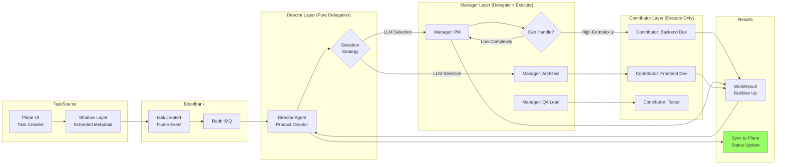

# Agent Orchestration Domain - Data Flows

## Overview

Data flow patterns for hierarchical agent coordination, meta-agent team building, and framework-agnostic orchestration.

## 1. Meta-Agent Team Building Flow

Shows how AgentForge analyzes goals and assembles optimal agent teams.

```mermaid
flowchart TB
    subgraph Input
        Goal[High-Level Goal<br/>"Build customer chatbot"]
        Dev[Developer]
    end

    subgraph MetaTeam["AgentForge Meta-Team"]
        EngMgr[Engineering Manager<br/>Orchestrates workflow]
        Analyst[Systems Analyst<br/>Decomposes goals]
        Scout[Talent Scout<br/>Finds reusable agents]
        Creator[Agent Developer<br/>Creates new agents]
        Architect[Integration Architect<br/>Assembles final team]
    end

    subgraph Analysis
        Capabilities[Required Capabilities<br/>NLP, DB, API, Test, Deploy]
        Vector[Vector Search<br/>QDrant embeddings]
    end

    subgraph Assembly
        Existing[Reused Agents<br/>From library]
        New[Generated Agents<br/>Custom for gaps]
        Team[Final Agent Team<br/>Ready to deploy]
    end

    subgraph Output
        Docs[Documentation<br/>Playbooks, Workflows]
        Deploy[Deployed Team<br/>Ready for tasks]
    end

    Dev --> Goal
    Goal --> EngMgr
    EngMgr --> Analyst
    Analyst --> Capabilities

    Capabilities --> Scout
    Scout --> Vector
    Vector --> Existing
    Vector --> Gaps{Gaps<br/>Found?}

    Gaps -->|Yes| Creator
    Gaps -->|No| Architect

    Creator --> New
    New --> Architect
    Existing --> Architect

    Architect --> Team
    Architect --> Docs

    Team --> Deploy
    Docs --> Deploy

    style Gaps decision
    style Deploy fill:#9f6
```

## 2. Hierarchical Task Delegation Flow

Flume protocol task routing through Director → Manager → Contributor hierarchy.



See full documentation with 5 more flow diagrams at: /home/delorenj/code/33GOD/docs/domains/agent-orchestration/data-flows.md

---

**Version**: 1.0.0  
**Last Updated**: 2026-01-29  
**Maintained By**: 33GOD Architecture Team
