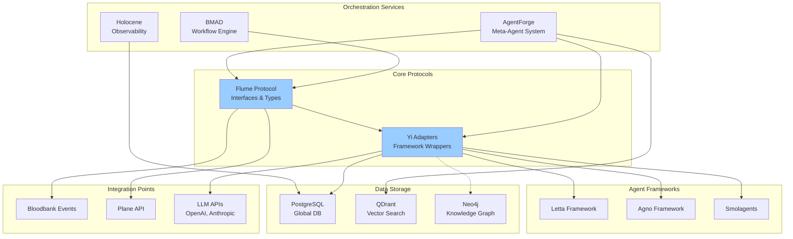

# Agent Orchestration Domain - Dependency Graph

## Component Dependencies

```mermaid
graph TB
    subgraph Core["Core Protocols"]
        Flume[Flume Protocol<br/>Interfaces & Types]
        Yi[Yi Adapters<br/>Framework Wrappers]
    end

    subgraph Frameworks["Agent Frameworks"]
        Letta[Letta Framework]
        Agno[Agno Framework]
        Smolagents[Smolagents]
    end

    subgraph Services["Orchestration Services"]
        AgentForge[AgentForge<br/>Meta-Agent System]
        Holocene[Holocene<br/>Observability]
        BMAD[BMAD<br/>Workflow Engine]
    end

    subgraph Storage["Data Storage"]
        Postgres[PostgreSQL<br/>Global DB]
        QDrant[QDrant<br/>Vector Search]
        Neo4j[Neo4j<br/>Knowledge Graph]
    end

    subgraph Integration["Integration Points"]
        Bloodbank[Bloodbank Events]
        Plane[Plane API]
        LLMAPIs[LLM APIs<br/>OpenAI, Anthropic]
    end

    Flume --> Yi
    Yi --> Letta
    Yi --> Agno
    Yi --> Smolagents

    AgentForge --> Flume
    AgentForge --> Yi
    BMAD --> Flume
    Holocene --> Postgres

    Yi --> Postgres
    AgentForge --> QDrant
    Yi -.-> Neo4j

    Flume --> Bloodbank
    Flume --> Plane
    Yi --> LLMAPIs

    style Flume fill:#9cf
    style Yi fill:#9cf
```

---
**Version**: 1.0.0 | **Updated**: 2026-01-29
