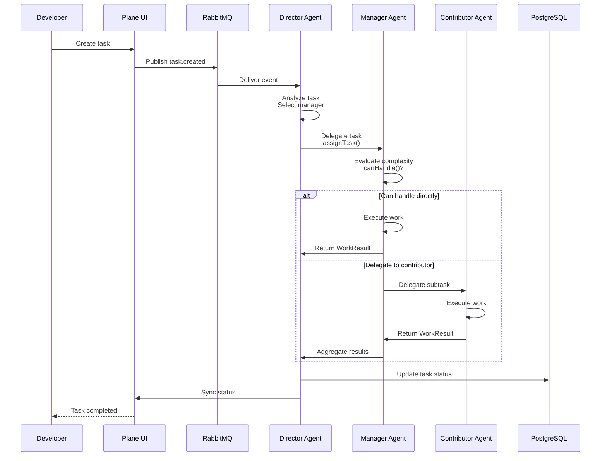

# Agent Orchestration Domain - Sequence Diagrams

## Task Delegation Sequence

```mermaid
sequenceDiagram
    participant Dev as Developer
    participant Plane as Plane UI
    participant RMQ as RabbitMQ
    participant Director as Director Agent
    participant Manager as Manager Agent
    participant Contrib as Contributor Agent
    participant DB as PostgreSQL

    Dev->>Plane: Create task
    Plane->>RMQ: Publish task.created
    RMQ->>Director: Deliver event

    Director->>Director: Analyze task<br/>Select manager
    Director->>Manager: Delegate task<br/>assignTask()

    Manager->>Manager: Evaluate complexity<br/>canHandle()?

    alt Can handle directly
        Manager->>Manager: Execute work
        Manager->>Director: Return WorkResult
    else Delegate to contributor
        Manager->>Contrib: Delegate subtask
        Contrib->>Contrib: Execute work
        Contrib->>Manager: Return WorkResult
        Manager->>Director: Aggregate results
    end

    Director->>DB: Update task status
    Director->>Plane: Sync status
    Plane-->>Dev: Task completed
```

---
**Version**: 1.0.0 | **Updated**: 2026-01-29
