# Domain: Dashboards & Voice

> User-facing interfaces. Where humans interact with the system.

## Services

| Service | Role | Tech Stack | Status |
|---------|------|------------|--------|
| **Holocene** | Mission control dashboard for 33GOD portfolio | React 18, Vite, TypeScript, Zustand, TanStack Query, Tailwind | Active |
| **HeyMa** | Voice-to-text interface with TTS | Python (Whisper), Rust (Tauri), Chrome Extension, ElevenLabs | Active |

## High-Level Purpose

This domain owns the human-facing interfaces. Holocene is the mission control dashboard showing portfolio health, agent collaboration graphs, decision impacts, and project drill-downs. HeyMa provides voice interaction via Whisper transcription and ElevenLabs TTS.

## Key Contracts

- **Holocene Data Sources**: Queries Bloodbank events, service registry, agent state
- **HeyMa Events**: `transcription.voice.completed` → agent processing → `tts.response.completed`

## Interconnections

```mermaid
graph TD
    HOL[Holocene] -->|queries| BB[Bloodbank]
    HOL -->|reads| REG[registry.yaml]
    HOL -->|displays| DASH[Dashboard Views]

    TT[HeyMa] -->|transcribes| WHISPER[Whisper]
    TT -->|emits| BB
    TT -->|receives| TTS[ElevenLabs TTS]
    TONNY[Tonny Agent] -->|processes| TT
```

## When to Include This Context

Pass this domain when:
- Building user-facing dashboard features
- Working on voice interaction or transcription
- Debugging the Holocene data flow
- Extending TTS or STT capabilities

## Technical Quick Reference

| Service | Port/Interface | Tech |
|---------|----------------|------|
| Holocene | Vite dev server | React 18, Zustand |
| HeyMa | Tauri app / Chrome extension | Whisper, ElevenLabs |

## Key Concepts

### Holocene Dashboard Views
- **Portfolio Overview**: Top 3 moving projects, health scores
- **Decision Radar**: Ranked feed of impactful decisions
- **Agent Constellation**: Collaboration graph visualization
- **Plans & Commitments**: Drift detection from planned state
- **Risks & Blockers**: Active issues requiring attention
- **Briefing Mode**: Auto-generated AM/PM summaries

### HeyMa Components
- **Chrome Extension**: Browser-based voice capture
- **Tauri App**: Desktop voice interface
- **WhisperLiveKit**: Real-time transcription
- **Tonny Agent**: Letta-powered response generation
- **ElevenLabs**: Text-to-speech output

## Key Files

- `/home/delorenj/code/33GOD/holocene/trunk-main/` - Mission control dashboard
- `/home/delorenj/code/33GOD/HeyMa/trunk-main/` - Voice interface
- `/home/delorenj/code/33GOD/HeyMa/trunk-main/chrome-extension/` - Browser extension
- `/home/delorenj/code/33GOD/HeyMa/trunk-main/TonnyTray/` - Tauri desktop app

## Last Sync

<!-- degenerate:sync-marker -->
Commit: (pending initial sync)
Date: (pending initial sync)
