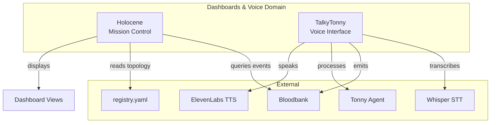
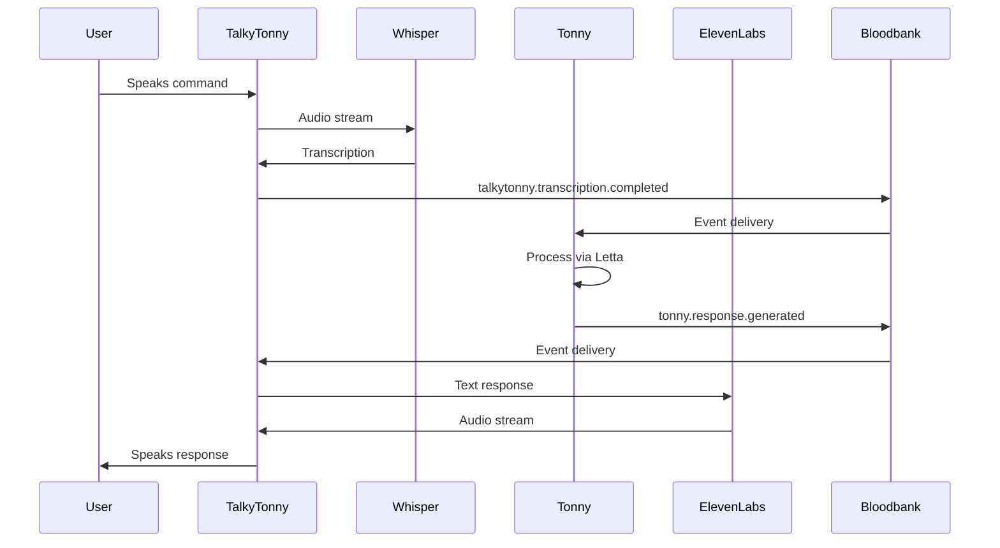

# Dashboards & Voice Domain - GOD Document

> **Guaranteed Organizational Document** - Developer-facing reference for the Dashboards & Voice domain
>
> **Last Updated**: 2026-02-01
> **Components**: 2 (+ Candybar shared with Infrastructure)

---

## Domain Overview

The Dashboards & Voice domain provides **human-facing interfaces** for interacting with the 33GOD ecosystem. Holocene is the mission control dashboard, and TalkyTonny enables voice interaction via Whisper transcription and ElevenLabs TTS.

**Core Responsibility**: Enable human observation and voice-based control of the agent pipeline.

**Architectural Philosophy**: "Humans See and Speak, Agents Listen and Act"

---

## Component Map



---

## Components

### Holocene

**Purpose**: Mission control dashboard showing portfolio health, agent collaboration graphs, and decision impacts

**Type**: Dashboard / UI
**Status**: Active

**Key Events:**
- **Emits**: None (read-only dashboard)
- **Consumes**: `*.*.*` (all events for visualization)

**Interfaces:**
- Web UI: React 18, Vite, Zustand, TanStack Query
- REST API: `/api/portfolio`, `/api/agents`, `/api/events`

[📄 Component GOD Doc](../../holocene/GOD.md)

---

### TalkyTonny

**Purpose**: Voice-to-text interface with AI-powered responses and text-to-speech output

**Type**: Voice Interface (Chrome Extension + Tauri App)
**Status**: Active

**Key Events:**
- **Emits**: `talkytonny.transcription.completed`, `talkytonny.response.generated`
- **Consumes**: `talkytonny.voice.captured`

**Interfaces:**
- Chrome Extension: Browser-based voice capture
- Tauri App: Desktop voice interface
- Whisper: Real-time transcription
- Tonny Agent (Letta): Response generation
- ElevenLabs: Text-to-speech

[📄 Component GOD Doc](../../TalkyTonny/GOD.md)

---

## Domain Event Contracts

### Cross-Component Events

Events that flow between components within this domain:

| Event | Producer | Consumer(s) | Purpose |
|-------|----------|-------------|---------|
| `talkytonny.transcription.completed` | TalkyTonny | Tonny Agent | Process voice input |
| `tonny.response.generated` | Tonny Agent | TalkyTonny | Speak response via TTS |

### External Event Interfaces

Events exchanged with other domains:

| Event | Direction | External Domain | Purpose |
|-------|-----------|-----------------|---------|
| `agent.*.*` | Inbound | Agent Orchestration | Display agent health in Holocene |
| `worktree.*` | Inbound | Workspace Management | Show active worktrees |
| `meeting.*` | Inbound | Meeting & Collaboration | Display meeting status |
| `talkytonny.command.*` | Outbound | All Domains | Voice commands trigger actions |

---

## Holocene Dashboard Views

### Portfolio Overview
- Top 3 moving projects
- Health scores (green/yellow/red)
- Active agent count
- Event throughput

### Decision Radar
- Ranked feed of impactful decisions
- Decision impact scores
- Linked to originating events

### Agent Constellation
- Collaboration graph visualization
- Agent-to-agent communication paths
- Task assignment flows

### Plans & Commitments
- Drift detection from planned state
- Sprint progress tracking
- Milestone completion status

### Risks & Blockers
- Active issues requiring attention
- Blocker age and severity
- Resolution ownership

### Briefing Mode
- Auto-generated AM/PM summaries
- Daily highlights
- Next actions

---

## TalkyTonny Voice Flow



**Voice Command Examples:**
- "Start a meeting about authentication"
- "Show me active worktrees"
- "What's the status of agent-001?"
- "Create a feature worktree for dashboard updates"

---

## Shared Infrastructure

### Holocene Data Sources

**Event Stream:**
- WebSocket connection to Bloodbank
- Real-time event updates
- Event filtering by domain/entity

**Registry:**
- Reads `services/registry.yaml`
- Service topology visualization
- Health status from registry

**APIs:**
- REST endpoints for portfolio data
- Agent status queries
- Historical event queries

### TalkyTonny Components

**Chrome Extension:**
- Browser-based voice capture
- Popup UI for controls
- Background service for event handling

**Tauri Desktop App:**
- System tray presence
- Global hotkey for voice activation
- Local Whisper model (optional)

**Tonny Agent (Letta):**
- Persistent memory across sessions
- Context-aware responses
- Bloodbank event pub/sub

---

## Development Guidelines

### Adding a Dashboard View to Holocene

```typescript
// src/views/NewView.tsx
import { useEventStream } from '@/hooks/useEventStream';

export function NewView() {
  const { events } = useEventStream({ filter: 'agent.task.*' });

  return (
    <div>
      {events.map(event => (
        <EventCard key={event.event_id} event={event} />
      ))}
    </div>
  );
}
```

### Implementing a Voice Command in Tonny

```python
# Tonny agent processes commands via Letta
@agent.on_event("talkytonny.transcription.completed")
async def handle_voice_command(event: EventEnvelope):
    transcription = event.payload["text"]

    # Parse command intent
    if "start a meeting" in transcription:
        topic = extract_topic(transcription)
        await bloodbank.publish("theboard.meeting.trigger", {
            "topic": topic,
            "triggered_by": "voice"
        })

    # Generate response
    response = await letta.generate_response(transcription)
    await bloodbank.publish("tonny.response.generated", {
        "text": response
    })
```

---

## References

- **System Doc**: `../../GOD.md`
- **Source Domain Docs**: `dashboards-voice.md`, `applications.md`
- **Holocene UI**: React 18, Zustand, TanStack Query
- **TalkyTonny**: Tauri + Chrome Extension
