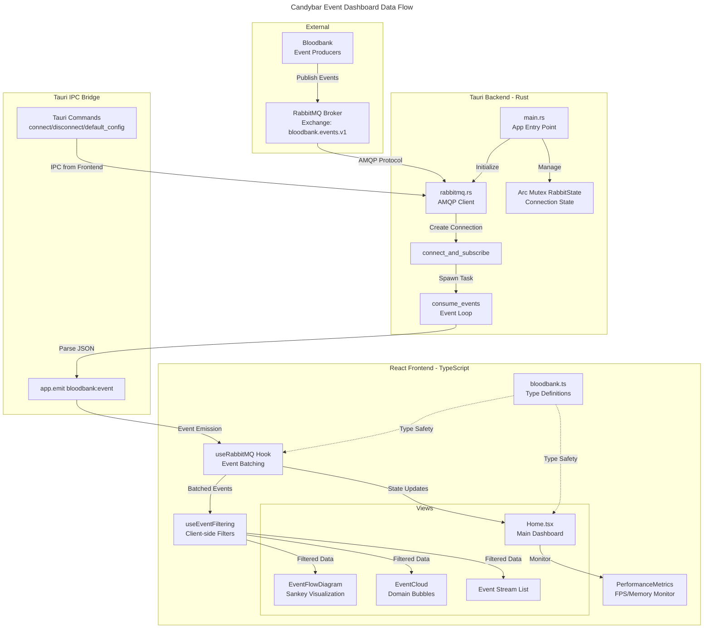
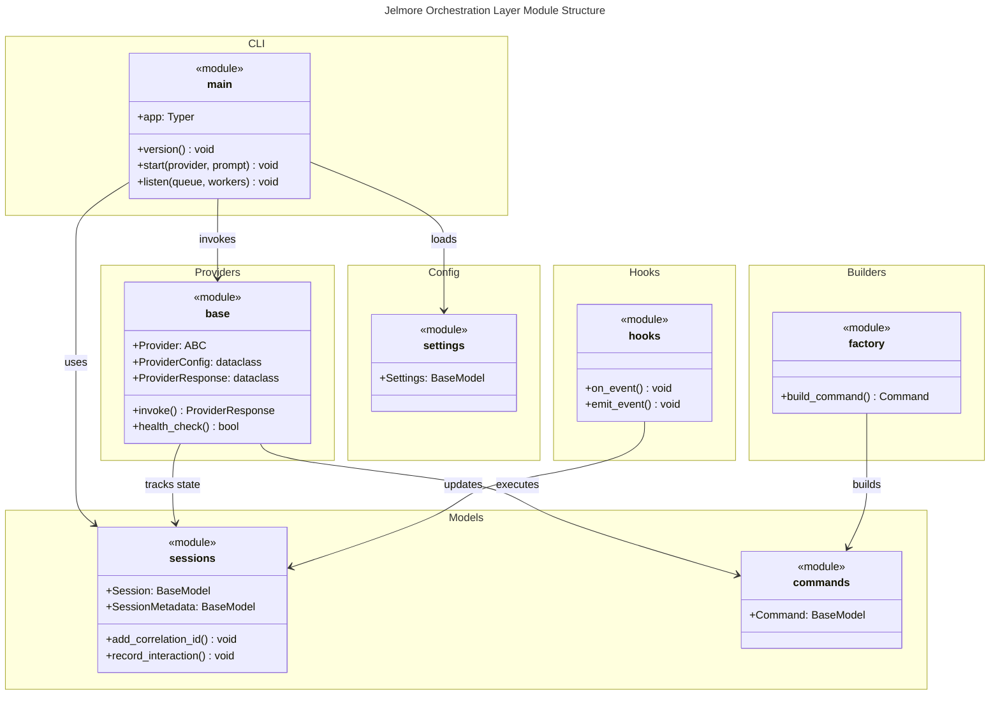
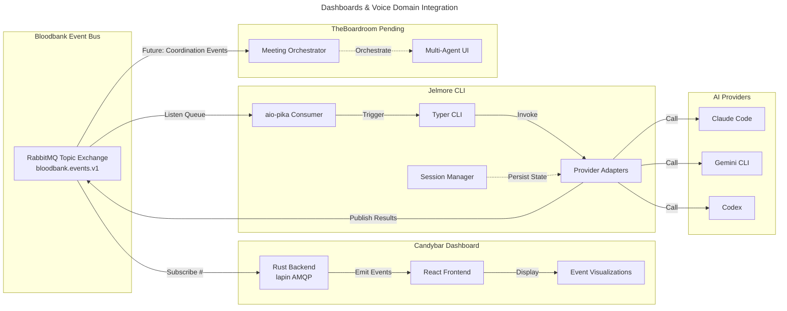

# C4 Code Level: Dashboards & Voice Domain

## Overview
- **Name**: Dashboards & Voice Domain
- **Description**: Real-time event observability dashboards, voice processing integrations, and agentic orchestration tools
- **Location**: [/home/delorenj/code/33GOD](file:///home/delorenj/code/33GOD)
- **Languages**: TypeScript/React (Frontend), Rust (Backend), Python (API)
- **Purpose**: Provides visual monitoring of Bloodbank events, voice command processing, and orchestration of AI coding agents

## Components

### 1. Candybar (Event Dashboard)
Real-time Tauri desktop application for monitoring Bloodbank event streams with rich visualizations.

**Location**: `/candybar/trunk-main/`

**Technology Stack**:
- Frontend: React 19 + TypeScript + Vite + Tailwind CSS
- Backend: Rust + Tauri 2.9
- Event Bus: RabbitMQ (lapin client)
- UI Framework: Radix UI + Framer Motion

### 2. Jelmore (Voice Orchestrator)
Event-driven CLI orchestration layer for agentic coding tools, enabling voice-to-code workflows.

**Location**: `/jelmore/trunk-main/`

**Technology Stack**:
- Python 3.11+
- CLI: Typer + Rich
- Event Bus: RabbitMQ (aio-pika)
- State: Pydantic models

### 3. TheBoardroom (Multi-Agent Coordinator)
Tauri-based desktop application for orchestrating multi-agent meetings and collaborative AI sessions.

**Location**: `/TheBoardroom/` (pending implementation)

**Technology Stack**:
- Frontend: React + TypeScript + Tauri
- Backend: Rust
- Agent Coordination: Bloodbank event bus

---

## Code Elements

### Candybar Code Structure

#### Frontend Components (TypeScript/React)

##### Core Application Components

**`App.tsx`**
- **Description**: Root application component that wraps the entire dashboard
- **Location**: [/home/delorenj/code/33GOD/candybar/trunk-main/src/App.tsx:4-10](file:///home/delorenj/code/33GOD/candybar/trunk-main/src/App.tsx)
- **Dependencies**: ThemeProvider, BloodbankObservability
- **Signature**:
```typescript
function App(): JSX.Element
```

**`Home.tsx` (BloodbankObservability)**
- **Description**: Main dashboard view with event stream, filters, and visualization modes
- **Location**: [/home/delorenj/code/33GOD/candybar/trunk-main/src/pages/Home.tsx:46-517](file:///home/delorenj/code/33GOD/candybar/trunk-main/src/pages/Home.tsx)
- **Dependencies**: useRabbitMQ, useEventFiltering, EventCloud, EventFlowDiagram, EventFilters, JsonViewer
- **State Management**:
  - Connection state (connected, connecting, error)
  - Event filtering and search
  - View modes (cloud, list, flow)
  - Performance metrics tracking
- **Key Functions**:
```typescript
const BloodbankObservability = (): JSX.Element
function handleConnectionToggle(): void
function handleExportEvents(): void
function handleNodeClick(nodeId: string, children?: EventNode[]): void
```

**`EventFlowDiagram.tsx`**
- **Description**: Three-column Sankey-style flow visualization showing Sources → Events → Targets
- **Location**: [/home/delorenj/code/33GOD/candybar/trunk-main/src/components/EventFlowDiagram.tsx:28-285](file:///home/delorenj/code/33GOD/candybar/trunk-main/src/components/EventFlowDiagram.tsx)
- **Dependencies**: BloodbankEvent types, UI components
- **Algorithm**: Builds flow graph from event streams, aggregates by source/type/target
- **Key Functions**:
```typescript
export const EventFlowDiagram = ({
  events,
  maxHeight = '600px'
}: EventFlowDiagramProps): JSX.Element

// Internal computation via useMemo
const { nodes, flows } = useMemo(() => {
  // Build flowMap: source → event_type → target
  // Extract unique nodes (sources, events, targets)
  // Sort by count descending
  return { nodes, flows }
}, [events])
```

**`PerformanceMetrics.tsx`**
- **Description**: Real-time FPS, memory usage, and event count monitoring
- **Location**: [/home/delorenj/code/33GOD/candybar/trunk-main/src/components/PerformanceMetrics.tsx:9-107](file:///home/delorenj/code/33GOD/candybar/trunk-main/src/components/PerformanceMetrics.tsx)
- **Dependencies**: Browser Performance API
- **Key Functions**:
```typescript
export const PerformanceMetrics = ({
  eventCount
}: PerformanceMetricsProps): JSX.Element

function measurePerformance(): void
function getFpsColor(fps: number): string
```

##### Custom Hooks

**`useRabbitMQ.ts`**
- **Description**: RabbitMQ connection management with event batching for performance
- **Location**: [/home/delorenj/code/33GOD/candybar/trunk-main/src/hooks/useRabbitMQ.ts:21-148](file:///home/delorenj/code/33GOD/candybar/trunk-main/src/hooks/useRabbitMQ.ts)
- **Dependencies**: Tauri IPC API, RabbitMQ Tauri commands
- **Features**:
  - Automatic event batching (100ms window, max 50 events)
  - Connection state management
  - Event listener cleanup
- **Key Functions**:
```typescript
export function useRabbitMQ(maxEvents: number = 500): UseRabbitMQReturn

// Returns:
interface UseRabbitMQReturn {
  state: RabbitMQState
  events: BloodbankEvent[]
  connect: (config?: Partial<RabbitMQConfig>) => Promise<void>
  disconnect: () => Promise<void>
  clearEvents: () => void
}
```

**`useEventFiltering.ts`**
- **Description**: Client-side event filtering by domain, type, source, session, time range
- **Location**: [/home/delorenj/code/33GOD/candybar/trunk-main/src/hooks/useEventFiltering.ts](file:///home/delorenj/code/33GOD/candybar/trunk-main/src/hooks/useEventFiltering.ts)
- **Dependencies**: BloodbankEvent types
- **Key Functions**:
```typescript
export function useEventFiltering(
  events: BloodbankEvent[],
  filters: EventFilter
): {
  filteredEvents: BloodbankEvent[]
  availableSources: string[]
  availableSessions: string[]
  filteredCount: number
}
```

##### Type Definitions

**`bloodbank.ts`**
- **Description**: TypeScript definitions for Bloodbank event schema and domain registry
- **Location**: [/home/delorenj/code/33GOD/candybar/trunk-main/src/types/bloodbank.ts:1-178](file:///home/delorenj/code/33GOD/candybar/trunk-main/src/types/bloodbank.ts)
- **Key Types**:
```typescript
interface BloodbankEvent<T = unknown> {
  event_id: string
  event_type: string  // e.g., "agent.thread.prompt"
  timestamp: string
  source: EventSource
  correlation_ids: string[]
  agent_context?: AgentContext
  payload: T
}

interface EventSource {
  host: string
  app: string
  type: 'webhook' | 'api' | 'internal' | 'agent'
}

interface AgentContext {
  agent_name?: string
  session_id?: string
  project?: string
}

interface RabbitMQConfig {
  host: string
  port: number
  username: string
  password: string
  exchange: string
  routingKeys: string[]  // Topic patterns like "#" or "agent.*"
}
```
- **Helper Functions**:
```typescript
function getDomainFromEventType(eventType: string): DomainKey | 'unknown'
function getSubEventFromEventType(eventType: string): string
function getDomainColor(domain: DomainKey | 'unknown'): string
```

#### Backend (Rust + Tauri)

**`main.rs`**
- **Description**: Tauri application entry point with plugin initialization and IPC command registration
- **Location**: [/home/delorenj/code/33GOD/candybar/trunk-main/src-tauri/src/main.rs:11-30](file:///home/delorenj/code/33GOD/candybar/trunk-main/src-tauri/src/main.rs)
- **Dependencies**: Tauri 2.9, RabbitMQ module, system plugins
- **Registered Commands**:
  - `rabbitmq_connect`
  - `rabbitmq_disconnect`
  - `rabbitmq_default_config`
- **State Management**: `Arc<Mutex<RabbitState>>` for thread-safe connection management
- **Key Code**:
```rust
fn main() {
    tauri::Builder::default()
        .plugin(tauri_plugin_global_shortcut::Builder::new().build())
        .plugin(tauri_plugin_http::init())
        .plugin(tauri_plugin_notification::init())
        .manage(Arc::new(Mutex::new(rabbitmq::RabbitState::new())))
        .invoke_handler(tauri::generate_handler![
            rabbitmq::rabbitmq_connect,
            rabbitmq::rabbitmq_disconnect,
            rabbitmq::rabbitmq_default_config,
        ])
        .run(tauri::generate_context!())
        .expect("error while running tauri application");
}
```

**`rabbitmq.rs`**
- **Description**: RabbitMQ client integration using lapin (Rust AMQP client)
- **Location**: [/home/delorenj/code/33GOD/candybar/trunk-main/src-tauri/src/rabbitmq.rs:1-276](file:///home/delorenj/code/33GOD/candybar/trunk-main/src-tauri/src/rabbitmq.rs)
- **Dependencies**: lapin (AMQP), tokio (async), serde (serialization), uuid
- **Key Structures**:
```rust
#[derive(Debug, Clone, Serialize, Deserialize)]
pub struct RabbitConfig {
    pub host: String,
    pub port: u16,
    pub username: String,
    pub password: String,
    pub exchange: String,
    pub routing_keys: Vec<String>,
}

#[derive(Debug, Clone, Serialize, Deserialize)]
pub struct BloodbankEvent {
    pub event_id: String,
    pub event_type: String,
    pub timestamp: String,
    pub source: EventSource,
    pub correlation_ids: Vec<String>,
    pub agent_context: Option<AgentContext>,
    pub payload: serde_json::Value,
}

pub struct RabbitState {
    connection: Option<Connection>,
    channel: Option<Channel>,
    consumer_task: Option<tokio::task::JoinHandle<()>>,
}
```

- **Key Functions**:
```rust
pub async fn connect_and_subscribe(
    config: RabbitConfig,
    app: AppHandle,
    state: Arc<Mutex<RabbitState>>,
) -> Result<(), String>

async fn consume_events(mut consumer: Consumer, app: AppHandle)

pub async fn disconnect(state: Arc<Mutex<RabbitState>>) -> Result<(), String>

#[tauri::command]
pub async fn rabbitmq_connect(
    config: RabbitConfig,
    app: AppHandle,
    state: tauri::State<'_, Arc<Mutex<RabbitState>>>,
) -> Result<(), String>

#[tauri::command]
pub async fn rabbitmq_disconnect(
    state: tauri::State<'_, Arc<Mutex<RabbitState>>>,
) -> Result<(), String>

#[tauri::command]
pub fn rabbitmq_default_config() -> RabbitConfig
```

**IPC Flow (Tauri Commands)**:
1. Frontend calls `invoke('rabbitmq_connect', { config })`
2. Rust command `rabbitmq_connect` receives config
3. Creates AMQP connection to RabbitMQ
4. Declares topic exchange `bloodbank.events.v1`
5. Creates exclusive queue with UUID name
6. Binds queue to exchange with routing keys (e.g., `#` for all events)
7. Spawns tokio task to consume events
8. Events parsed to `BloodbankEvent` and emitted via `app.emit('bloodbank:event', event)`
9. Frontend listens with `listen<BloodbankEvent>('bloodbank:event', handler)`

---

### Jelmore Code Structure

#### CLI Entry Point

**`cli/main.py`**
- **Description**: Typer-based CLI for starting provider sessions and listening to Bloodbank events
- **Location**: [/home/delorenj/code/33GOD/jelmore/trunk-main/src/jelmore/cli/main.py:1-48](file:///home/delorenj/code/33GOD/jelmore/trunk-main/src/jelmore/cli/main.py)
- **Dependencies**: Typer, Rich console
- **Commands**:
```python
@app.command()
def version() -> None:
    """Show Jelmore version."""

@app.command()
def start(
    provider: str = Argument(..., help="Provider to use (claude, gemini, codex)"),
    prompt: str | None = Option(None, "--prompt", "-p", help="Initial prompt"),
    session_id: str | None = Option(None, "--session-id", "-s", help="Resume session"),
    continue_session: bool = Option(False, "--continue", "-c", help="Continue last session"),
) -> None:
    """Start a new provider session."""

@app.command()
def listen(
    queue: str = Option("agent.prompt", "--queue", "-q", help="Bloodbank queue"),
    workers: int = Option(5, "--workers", "-w", help="Number of workers"),
) -> None:
    """Listen for Bloodbank events (daemon mode)."""
```

#### Models (Pydantic)

**`models/sessions.py`**
- **Description**: Pydantic models for session state and metadata
- **Location**: [/home/delorenj/code/33GOD/jelmore/trunk-main/src/jelmore/models/sessions.py:1-87](file:///home/delorenj/code/33GOD/jelmore/trunk-main/src/jelmore/models/sessions.py)
- **Dependencies**: Pydantic, UUID, datetime
- **Key Models**:
```python
class SessionMetadata(BaseModel):
    """Metadata associated with a session."""
    created_by: str | None = None
    source: str = "cli"  # cli, bloodbank
    tags: list[str] = []
    extra: dict[str, Any] = {}

class Session(BaseModel):
    """Session state for a provider conversation."""
    id: str = Field(default_factory=lambda: str(uuid4()))
    provider: str
    created_at: datetime
    updated_at: datetime
    state: dict[str, Any] = {}
    metadata: SessionMetadata
    correlation_ids: list[str] = []
    prompt_count: int = 0
    last_prompt: str | None = None
    last_response: str | None = None

    def add_correlation_id(self, correlation_id: str) -> None
    def touch(self) -> None
    def record_interaction(self, prompt: str, response: str | None) -> None
```

**`models/commands.py`**
- **Description**: Command models for agent invocations (placeholder)
- **Location**: [/home/delorenj/code/33GOD/jelmore/trunk-main/src/jelmore/models/commands.py](file:///home/delorenj/code/33GOD/jelmore/trunk-main/src/jelmore/models/commands.py)

#### Provider Abstraction

**`providers/base.py`**
- **Description**: Abstract base class for provider adapters (Claude Code, Gemini, Codex)
- **Location**: [/home/delorenj/code/33GOD/jelmore/trunk-main/src/jelmore/providers/base.py:1-88](file:///home/delorenj/code/33GOD/jelmore/trunk-main/src/jelmore/providers/base.py)
- **Dependencies**: ABC, dataclasses, typing
- **Key Classes**:
```python
@dataclass
class ProviderConfig:
    """Configuration for a provider."""
    name: str
    enabled: bool = True
    timeout_seconds: int = 300
    max_retries: int = 3
    extra: dict[str, Any] = field(default_factory=dict)

    def get(self, key: str, default: Any = None) -> Any

@dataclass
class ProviderResponse:
    """Response from a provider invocation."""
    success: bool
    output: str | None = None
    error: str | None = None
    session_id: str | None = None
    metadata: dict[str, Any] = field(default_factory=dict)

class Provider(ABC):
    """Abstract base class for provider adapters."""

    def __init__(self, config: ProviderConfig) -> None

    @property
    def name(self) -> str

    @abstractmethod
    async def invoke(
        self,
        prompt: str,
        session_id: str | None = None,
        **kwargs: Any,
    ) -> ProviderResponse:
        """Invoke the provider with the given prompt."""

    @abstractmethod
    async def health_check(self) -> bool:
        """Check if the provider is available."""
```

#### Builders & Hooks (Placeholder Architecture)

**`builders/base.py`**
- **Description**: Factory pattern for building provider commands
- **Location**: [/home/delorenj/code/33GOD/jelmore/trunk-main/src/jelmore/builders/base.py](file:///home/delorenj/code/33GOD/jelmore/trunk-main/src/jelmore/builders/base.py)

**`hooks/base.py`**
- **Description**: Event hooks for Bloodbank integration
- **Location**: [/home/delorenj/code/33GOD/jelmore/trunk-main/src/jelmore/hooks/base.py](file:///home/delorenj/code/33GOD/jelmore/trunk-main/src/jelmore/hooks/base.py)

**`commands/base.py`**
- **Description**: Command execution abstraction
- **Location**: [/home/delorenj/code/33GOD/jelmore/trunk-main/src/jelmore/commands/base.py](file:///home/delorenj/code/33GOD/jelmore/trunk-main/src/jelmore/commands/base.py)

---

## Dependencies

### Candybar Dependencies

#### Internal Dependencies
- Bloodbank event schema (shared TypeScript types)
- RabbitMQ message broker
- Tauri IPC bridge

#### External Dependencies (Frontend)
- **React 19**: UI framework
- **@tauri-apps/api 2.7**: Desktop app API
- **@radix-ui/**: UI primitives (scroll-area, select, separator, slot, switch)
- **framer-motion 12.24**: Animation library
- **lucide-react**: Icon library
- **recharts**: Charting library
- **tailwindcss 4.1**: Styling framework
- **vite 6.3**: Build tool

#### External Dependencies (Backend)
- **tauri 2.9**: Desktop app framework
- **lapin 2.3**: RabbitMQ AMQP client
- **tokio 1.x**: Async runtime
- **serde 1.0**: Serialization
- **uuid 1.0**: UUID generation
- **futures-lite 2.0**: Async utilities

### Jelmore Dependencies

#### Internal Dependencies
- Bloodbank event bus (RabbitMQ)
- Session persistence (future: Redis/filesystem)
- Provider implementations (future: Claude, Gemini, Codex adapters)

#### External Dependencies (Python)
- **pydantic 2.5+**: Data validation and models
- **typer 0.12+**: CLI framework
- **rich 13.7+**: Terminal formatting
- **redis 5.0+**: State storage
- **pika 1.3+**: RabbitMQ sync client
- **aio-pika 9.4+**: RabbitMQ async client
- **tenacity 8.2+**: Retry logic
- **pyyaml 6.0+**: Config parsing
- **python-dotenv 1.0+**: Environment variables
- **structlog 24.1+**: Structured logging

### TheBoardroom Dependencies

#### Planned Stack
- React + TypeScript (Frontend)
- Rust + Tauri 2.x (Backend)
- Bloodbank event bus
- Multi-agent orchestration protocols
- Real-time collaboration features

---

## Relationships

### Candybar Architecture Diagram (Functional Data Flow)



### Jelmore Architecture Diagram (Module Structure)



### Cross-Component Integration



---

## Code Examples

### Example 1: Tauri Command - Connect to RabbitMQ

**Rust Backend** (`src-tauri/src/rabbitmq.rs`):
```rust
#[tauri::command]
pub async fn rabbitmq_connect(
    config: RabbitConfig,
    app: AppHandle,
    state: tauri::State<'_, Arc<Mutex<RabbitState>>>,
) -> Result<(), String> {
    connect_and_subscribe(config, app, state.inner().clone()).await
}

pub async fn connect_and_subscribe(
    config: RabbitConfig,
    app: AppHandle,
    state: Arc<Mutex<RabbitState>>,
) -> Result<(), String> {
    // Build AMQP connection string
    let addr = format!(
        "amqp://{}:{}@{}:{}/%2f",
        config.username, config.password, config.host, config.port
    );

    // Connect with 10s timeout
    let conn = tokio::time::timeout(
        std::time::Duration::from_secs(10),
        Connection::connect(&addr, ConnectionProperties::default()),
    )
    .await
    .map_err(|_| "Connection timed out")?
    .map_err(|e| format!("Failed to connect: {}", e))?;

    // Create channel
    let channel = conn.create_channel().await?;

    // Declare topic exchange
    channel.exchange_declare(
        &config.exchange,
        lapin::ExchangeKind::Topic,
        ExchangeDeclareOptions { durable: true, ..Default::default() },
        FieldTable::default(),
    ).await?;

    // Create exclusive queue
    let queue_name = format!("candybar.{}", uuid::Uuid::new_v4());
    let queue = channel.queue_declare(
        &queue_name,
        QueueDeclareOptions { exclusive: true, auto_delete: true, ..Default::default() },
        FieldTable::default(),
    ).await?;

    // Bind to routing keys
    for routing_key in &config.routing_keys {
        channel.queue_bind(
            queue.name().as_str(),
            &config.exchange,
            routing_key,
            QueueBindOptions::default(),
            FieldTable::default(),
        ).await?;
    }

    // Start consuming
    let consumer = channel.basic_consume(
        queue.name().as_str(),
        "candybar-consumer",
        BasicConsumeOptions::default(),
        FieldTable::default(),
    ).await?;

    // Spawn consumer task
    let consumer_task = tokio::spawn(consume_events(consumer, app.clone()));

    // Store state
    let mut state_guard = state.lock().await;
    state_guard.connection = Some(conn);
    state_guard.channel = Some(channel);
    state_guard.consumer_task = Some(consumer_task);

    // Emit connection event to frontend
    let _ = app.emit("rabbitmq:connected", &config);

    Ok(())
}

async fn consume_events(mut consumer: Consumer, app: AppHandle) {
    while let Some(delivery) = consumer.next().await {
        match delivery {
            Ok(delivery) => {
                let body = String::from_utf8_lossy(&delivery.data);

                // Parse Bloodbank event
                match serde_json::from_str::<BloodbankEvent>(&body) {
                    Ok(event) => {
                        // Emit to frontend
                        if let Err(e) = app.emit("bloodbank:event", &event) {
                            eprintln!("Failed to emit event: {}", e);
                        }
                    }
                    Err(e) => eprintln!("Failed to parse event: {}", e),
                }

                // Acknowledge message
                delivery.ack(BasicAckOptions::default()).await?;
            }
            Err(e) => {
                eprintln!("Consumer error: {}", e);
                break;
            }
        }
    }
}
```

**TypeScript Frontend** (`src/hooks/useRabbitMQ.ts`):
```typescript
const connect = useCallback(async (configOverrides?: Partial<RabbitMQConfig>) => {
  setState((prev) => ({ ...prev, isConnecting: true, error: null }));

  try {
    // Get default config from backend
    const defaultConfig = await invoke<RabbitMQConfig>('rabbitmq_default_config');

    // Merge with overrides
    const config = {
      ...defaultConfig,
      ...configOverrides,
      routing_keys: configOverrides?.routingKeys || defaultConfig.routingKeys || ['#'],
    };

    // Call Rust backend
    await invoke('rabbitmq_connect', { config });

    // State updated via rabbitmq:connected event listener
  } catch (err) {
    setState((prev) => ({
      ...prev,
      isConnecting: false,
      error: err instanceof Error ? err.message : String(err),
    }));
  }
}, []);
```

### Example 2: Event Flow Diagram Computation

**React Component** (`src/components/EventFlowDiagram.tsx`):
```typescript
const { nodes, flows } = useMemo(() => {
  const flowMap = new Map<string, { count: number; events: BloodbankEvent[] }>();

  // Build flows: source → event_type → target
  events.forEach((event) => {
    const source = event.source.app;
    const eventType = event.event_type;
    const target = event.agent_context?.agent_name || 'system';

    const flowKey = `${source}::${eventType}::${target}`;

    if (!flowMap.has(flowKey)) {
      flowMap.set(flowKey, { count: 0, events: [] });
    }

    const flow = flowMap.get(flowKey)!;
    flow.count++;
    flow.events.push(event);
  });

  // Extract unique nodes
  const sourceNodes = new Map<string, FlowNode>();
  const eventNodes = new Map<string, FlowNode>();
  const targetNodes = new Map<string, FlowNode>();

  flowMap.forEach((flow, flowKey) => {
    const [source, eventType, target] = flowKey.split('::');
    const domain = getDomainFromEventType(eventType);
    const color = getDomainColor(domain);

    // Aggregate source node
    if (!sourceNodes.has(source)) {
      sourceNodes.set(source, {
        id: `source-${source}`,
        label: source,
        count: 0,
        color: '#6B7280',
        type: 'source',
      });
    }
    sourceNodes.get(source)!.count += flow.count;

    // Aggregate event node
    if (!eventNodes.has(eventType)) {
      eventNodes.set(eventType, {
        id: `event-${eventType}`,
        label: eventType,
        count: 0,
        color,
        type: 'event',
      });
    }
    eventNodes.get(eventType)!.count += flow.count;

    // Aggregate target node
    if (!targetNodes.has(target)) {
      targetNodes.set(target, {
        id: `target-${target}`,
        label: target,
        count: 0,
        color: '#6B7280',
        type: 'target',
      });
    }
    targetNodes.get(target)!.count += flow.count;
  });

  return {
    nodes: {
      sources: Array.from(sourceNodes.values()).sort((a, b) => b.count - a.count),
      events: Array.from(eventNodes.values()).sort((a, b) => b.count - a.count),
      targets: Array.from(targetNodes.values()).sort((a, b) => b.count - a.count),
    },
    flows: Array.from(flowMap.entries()).sort((a, b) => b[1].count - a[1].count),
  };
}, [events]);
```

### Example 3: Jelmore Session Management

**Python Session Model** (`src/jelmore/models/sessions.py`):
```python
class Session(BaseModel):
    """Session state for a provider conversation."""

    id: str = Field(default_factory=lambda: str(uuid4()))
    provider: str
    created_at: datetime = Field(default_factory=lambda: datetime.now(UTC))
    updated_at: datetime = Field(default_factory=lambda: datetime.now(UTC))
    state: dict[str, Any] = Field(default_factory=dict)
    metadata: SessionMetadata = Field(default_factory=SessionMetadata)
    correlation_ids: list[str] = Field(default_factory=list)
    prompt_count: int = 0
    last_prompt: str | None = None
    last_response: str | None = None

    def add_correlation_id(self, correlation_id: str) -> None:
        """Add a correlation ID to the session history."""
        if correlation_id not in self.correlation_ids:
            self.correlation_ids.append(correlation_id)

    def touch(self) -> None:
        """Update the updated_at timestamp."""
        self.updated_at = datetime.now(UTC)

    def record_interaction(self, prompt: str, response: str | None) -> None:
        """Record a prompt/response interaction."""
        self.prompt_count += 1
        self.last_prompt = prompt
        self.last_response = response
        self.touch()
```

**Python Provider Interface** (`src/jelmore/providers/base.py`):
```python
class Provider(ABC):
    """Abstract base class for provider adapters."""

    def __init__(self, config: ProviderConfig) -> None:
        self._config = config

    @abstractmethod
    async def invoke(
        self,
        prompt: str,
        session_id: str | None = None,
        **kwargs: Any,
    ) -> ProviderResponse:
        """Invoke the provider with the given prompt.

        Args:
            prompt: The prompt to send to the provider
            session_id: Optional session ID for continuation
            **kwargs: Provider-specific options

        Returns:
            ProviderResponse with output and metadata
        """
        ...

    @abstractmethod
    async def health_check(self) -> bool:
        """Check if the provider is available and configured."""
        ...
```

### Example 4: Event Batching for Performance

**TypeScript Hook** (`src/hooks/useRabbitMQ.ts`):
```typescript
useEffect(() => {
  let eventQueue: BloodbankEvent[] = [];
  let batchTimeout: NodeJS.Timeout | null = null;

  const flushEventQueue = () => {
    if (eventQueue.length > 0) {
      setEvents((prev) => {
        const combined = [...eventQueue, ...prev];
        eventQueue = [];
        return combined.slice(0, maxEvents);
      });
    }
    batchTimeout = null;
  };

  const setupListeners = async () => {
    // Listen for bloodbank events with batching
    const unlistenEvent = await listen<BloodbankEvent>('bloodbank:event', (event) => {
      eventQueue.push(event.payload);

      // Batch events within 100ms for performance
      if (!batchTimeout) {
        batchTimeout = setTimeout(flushEventQueue, 100);
      }

      // Force flush if queue gets too large (50 events)
      if (eventQueue.length >= 50) {
        if (batchTimeout) clearTimeout(batchTimeout);
        flushEventQueue();
      }
    });

    // Other listeners...
    unlistenRefs.current = [unlistenEvent, /* ... */];
  };

  setupListeners();

  return () => {
    if (batchTimeout) clearTimeout(batchTimeout);
    flushEventQueue();
    unlistenRefs.current.forEach((unlisten) => unlisten());
  };
}, [maxEvents]);
```

---

## Notes

### Design Patterns

1. **Event-Driven Architecture**: All components communicate via Bloodbank event bus
2. **IPC Bridge Pattern**: Tauri commands expose Rust backend to React frontend
3. **Provider Pattern**: Abstract provider interface allows pluggable AI coding tools
4. **Session Pattern**: Stateful conversations with persistence and correlation tracking
5. **Batching Pattern**: Event batching (100ms window, 50 event max) for UI performance

### Performance Optimizations

1. **Event Batching**: Frontend batches incoming events to reduce React re-renders
2. **Virtual Scrolling**: Event lists use virtual scrolling for large datasets
3. **Memoization**: Heavy computations (flow diagrams, filtering) use `useMemo`
4. **Exclusive Queues**: RabbitMQ queues are exclusive and auto-delete to avoid message buildup
5. **FPS Monitoring**: Performance metrics component tracks frame rate and memory usage

### Future Enhancements

1. **Whisper Integration**: Voice-to-text for voice command processing (TheBoardroom)
2. **Provider Implementations**: Concrete implementations for Claude Code, Gemini, Codex
3. **Session Persistence**: Redis-backed session storage for distributed deployments
4. **Multi-Agent Coordination**: TheBoardroom meeting orchestration protocols
5. **Chrome Extension**: Browser-based voice commands and event monitoring
6. **Advanced Filtering**: GraphQL-style query language for event filtering
7. **Event Replay**: Time-travel debugging by replaying event streams
8. **Export Formats**: CSV, JSON, Parquet export for event data analysis

### Known Limitations

1. **Jelmore Commands**: CLI commands are placeholder implementations (STORY-003, STORY-005)
2. **TheBoardroom**: Component not yet implemented
3. **Session Persistence**: In-memory only, no Redis integration yet
4. **Provider Health Checks**: Not implemented for Claude/Gemini/Codex
5. **Authentication**: No auth layer for RabbitMQ connections (uses guest/guest defaults)
6. **Error Recovery**: Limited retry logic for failed RabbitMQ connections

### Security Considerations

1. **RabbitMQ Credentials**: Currently uses environment variables or defaults (guest/guest)
2. **Event Validation**: Bloodbank events are parsed but not schema-validated
3. **Session Data**: Sessions may contain sensitive prompts/responses, needs encryption
4. **IPC Security**: Tauri IPC commands should implement authorization checks
5. **CORS**: Future API endpoints need proper CORS configuration

---

## Related Documentation

- **C4 Component Level**: See [c4-component-dashboards-voice.md](./c4-component-dashboards-voice.md)
- **Bloodbank Domain**: Event bus architecture and domain definitions
- **Tauri Documentation**: https://tauri.app/v2/
- **RabbitMQ Topic Exchange**: https://www.rabbitmq.com/tutorials/tutorial-five-python.html
- **Pydantic Models**: https://docs.pydantic.dev/
- **Typer CLI**: https://typer.tiangolo.com/

---

**Generated**: 2026-01-29
**Domain**: Dashboards & Voice
**Components**: Candybar, Jelmore, TheBoardroom (pending)
**Languages**: TypeScript/React, Rust, Python
**Paradigm**: Event-Driven, Functional (React), Object-Oriented (Python)
