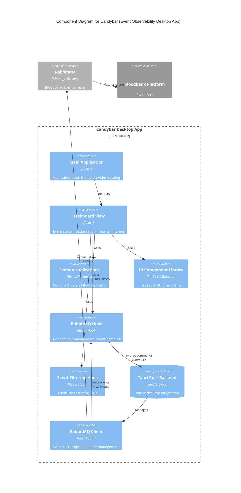
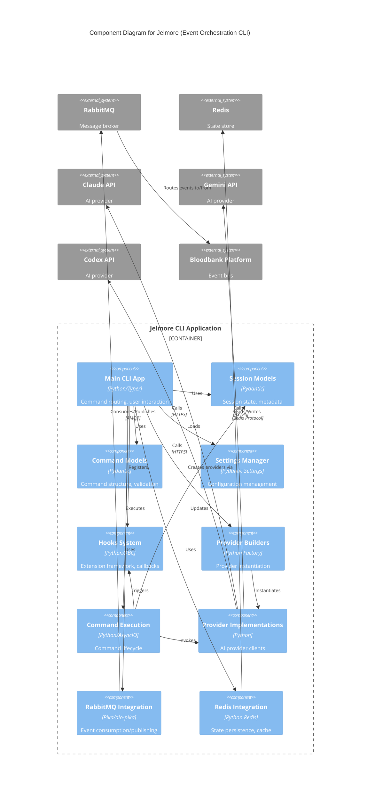

# C4 Component Level: Dashboards & Voice Domain

## Overview

This document describes the component-level architecture for the **Dashboards & Voice** domain within the 33GOD platform. This domain encompasses three major applications:

- **Candybar**: Service registry visualization and event observability dashboard
- **TalkyTonny**: Voice-controlled AI assistant with real-time transcription
- **Jelmore**: Event-driven orchestration layer for agentic coders

## Domain Purpose

The Dashboards & Voice domain provides real-time visualization, voice interaction, and orchestration capabilities for the 33GOD platform. It enables developers to monitor service events, interact with AI through voice, and coordinate multi-agent workflows.

## Technology Stack

### Frontend Technologies
- **React 19**: UI framework
- **TypeScript**: Type-safe development
- **Tauri 2.7**: Desktop application framework
- **Vite**: Build tool and dev server
- **Radix UI**: Component primitives
- **Framer Motion**: Animation library
- **Recharts**: Data visualization
- **TailwindCSS 4**: Utility-first CSS

### Backend Technologies
- **Rust**: Tauri backend and native integrations
- **Python 3.11+**: Backend services and ML pipelines
- **FastAPI**: Web framework for Python services
- **WebSockets**: Real-time communication
- **RabbitMQ (amqplib/aio-pika)**: Event streaming
- **Redis**: State management
- **Pika**: RabbitMQ client

### AI/ML Technologies
- **Faster-Whisper**: Speech-to-text transcription
- **ElevenLabs**: Text-to-speech synthesis
- **PyAudio/SoundDevice**: Audio capture
- **WebRTC VAD**: Voice activity detection
- **Torch/TorchAudio**: Audio processing

## System Components

This domain consists of three major containers, each with their own component architecture:

1. **Candybar**: Event observability dashboard (Tauri + React)
2. **TalkyTonny**: Voice assistant system (Tauri + Python services)
3. **Jelmore**: Event orchestration CLI (Python)

---

## Container 1: Candybar - Event Observability Dashboard

### Container Overview
- **Name**: Candybar
- **Type**: Desktop Application (Tauri)
- **Purpose**: Real-time visualization and monitoring of Bloodbank events
- **Technology**: Tauri (Rust) + React + TypeScript

### Components

#### 1.1 React UI Layer

##### Component: Main Application (App.tsx)
- **Type**: React Application Component
- **Technology**: React 19, TypeScript
- **Responsibilities**:
  - Application initialization and routing
  - Theme management
  - Global state coordination

##### Component: Dashboard View (BloodbankObservability)
- **Type**: React Container Component
- **Technology**: React, Framer Motion, Recharts
- **Responsibilities**:
  - Event stream visualization (list, cloud, flow views)
  - Real-time metrics display (total events, events/min, error rate, domains)
  - Event filtering and search
  - Event detail inspection
  - Connection status management
- **Features**:
  - Multiple visualization modes (list, cloud, flow diagram)
  - Real-time performance metrics with animated tickers
  - Advanced filtering (domain, event type, source app, time range, session ID)
  - JSON export functionality (JSON and CSV formats)
  - Responsive grid layout with sticky event details panel

##### Component: Event Visualizations
- **Type**: React Visualization Components
- **Technology**: Recharts, D3-like interactions
- **Components**:
  - **EventCloud**: Interactive bubble visualization of event domains
  - **EventGraph**: Force-directed graph for event relationships
  - **EventFlowDiagram**: Temporal flow visualization
  - **EventFilters**: Filter control panel
  - **JsonViewer**: Syntax-highlighted JSON inspector
- **Features**:
  - Click-through navigation between domain levels
  - Real-time animation of event nodes
  - Color-coded domain visualization
  - Responsive canvas rendering

##### Component: UI Component Library
- **Type**: Reusable React Components
- **Technology**: Radix UI, TailwindCSS 4
- **Components**:
  - Cards, Badges, Buttons
  - ScrollArea for virtualized event lists
  - NumberTicker for animated metrics
  - MagicUI effects (BorderBeam, ShineBorder, DotPattern)
  - ModeToggle for dark/light theme switching

#### 1.2 React Integration Layer

##### Component: RabbitMQ Hook (useRabbitMQ)
- **Type**: React Custom Hook
- **Technology**: React, Tauri API
- **Responsibilities**:
  - RabbitMQ connection lifecycle management
  - Event batching for performance (100ms window, 50 event max)
  - Event listener registration
  - Connection state management
  - Error handling and retry logic
- **Interface**:
  ```typescript
  interface UseRabbitMQReturn {
    state: RabbitMQState;
    events: BloodbankEvent[];
    connect: (config?: Partial<RabbitMQConfig>) => Promise<void>;
    disconnect: () => Promise<void>;
    clearEvents: () => void;
  }
  ```

##### Component: Event Filtering Hook (useEventFiltering)
- **Type**: React Custom Hook
- **Technology**: React, TypeScript
- **Responsibilities**:
  - Client-side event filtering
  - Filter state management
  - Available sources/sessions extraction
  - Filtered event count tracking

#### 1.3 Tauri Rust Backend

##### Component: RabbitMQ Client (rabbitmq.rs)
- **Type**: Rust Backend Service
- **Technology**: Rust, Lapin (RabbitMQ client)
- **Responsibilities**:
  - Asynchronous RabbitMQ connection management
  - Exchange declaration (topic exchange, "bloodbank.events.v1")
  - Exclusive queue creation with UUID-based naming
  - Routing key binding (supports wildcards)
  - Event consumption with auto-acknowledgment
  - Bloodbank event deserialization
  - Frontend event emission via Tauri event system
  - Graceful disconnection and cleanup
- **Interfaces**:
  - **Commands**:
    - `rabbitmq_connect(config)`: Connect to RabbitMQ
    - `rabbitmq_disconnect()`: Disconnect from RabbitMQ
    - `rabbitmq_default_config()`: Get default configuration
  - **Events**:
    - `bloodbank:event`: Emits parsed BloodbankEvent to frontend
    - `rabbitmq:connected`: Emits connection confirmation
    - `rabbitmq:disconnected`: Emits disconnection notification
- **Data Structures**:
  ```rust
  struct RabbitConfig {
    host: String,
    port: u16,
    username: String,
    password: String,
    exchange: String,
    routing_keys: Vec<String>,
  }

  struct BloodbankEvent {
    event_id: String,
    event_type: String,
    timestamp: String,
    source: EventSource,
    correlation_ids: Vec<String>,
    agent_context: Option<AgentContext>,
    payload: serde_json::Value,
  }
  ```

##### Component: Main Application (main.rs)
- **Type**: Tauri Application Entry Point
- **Technology**: Rust, Tauri 2.7
- **Responsibilities**:
  - Plugin initialization (HTTP, OS, notifications, clipboard, process, shell, fs, dialog)
  - Global shortcut management
  - State management with Arc<Mutex<RabbitState>>
  - IPC command handler registration
  - Application lifecycle management

### Candybar Component Diagram



---

## Container 2: TalkyTonny - Voice Assistant System

### Container Overview
- **Name**: TalkyTonny
- **Type**: Multi-Component Voice System
- **Purpose**: Real-time voice transcription and AI-powered voice interaction
- **Technology**: Tauri (TonnyTray UI) + Python (WhisperLiveKit + Backend Services) + Chrome Extension

### Components

#### 2.1 Desktop UI: TonnyTray (Tauri + React)

##### Component: Tauri Main Application
- **Type**: Desktop Application Entry Point
- **Technology**: Rust, Tauri 2.x
- **Responsibilities**:
  - Application lifecycle management
  - System tray integration
  - IPC command routing
  - Process management for WhisperLiveKit server
  - SQLite database management
  - Keychain integration for API keys
  - Global shortcut handling

##### Component: React Frontend
- **Type**: React Application
- **Technology**: React, TypeScript, Vite
- **Responsibilities**:
  - User interface for transcription control
  - Settings management
  - Transcription history display
  - Audio device selection
  - Recording controls (start/stop/pause)
- **State Management**: Zustand

##### Component: Process Manager
- **Type**: Rust Backend Module
- **Technology**: Rust, Tokio
- **Responsibilities**:
  - WhisperLiveKit server lifecycle management
  - Python subprocess spawning and monitoring
  - Auto-restart on crash
  - Health monitoring
  - Graceful shutdown (SIGTERM)

##### Component: WebSocket Client
- **Type**: Rust Backend Module
- **Technology**: Rust, WebSocket protocol
- **Responsibilities**:
  - WebSocket connection to WhisperLiveKit
  - Audio stream transmission (16kHz, 16-bit PCM)
  - Transcription event reception
  - Connection error handling and reconnection

##### Component: Audio Capture Module
- **Type**: Rust Backend Module
- **Technology**: Rust, CPAL/PortAudio
- **Responsibilities**:
  - Microphone audio capture
  - Audio format conversion
  - Buffer management
  - Device enumeration and selection

##### Component: Database Layer
- **Type**: Rust Backend Module
- **Technology**: Rust, SQLite
- **Responsibilities**:
  - Transcription history persistence
  - User profile management
  - Settings storage
  - Statistics tracking

##### Component: Keychain Integration
- **Type**: Rust Backend Module
- **Technology**: Rust, Secret Service API (Linux)
- **Responsibilities**:
  - Secure API key storage (ElevenLabs, Node-RED)
  - Cross-platform keychain access
  - Credential encryption

#### 2.2 Python Backend: Integration Orchestrator

##### Component: Integration Orchestrator (main.py)
- **Type**: Python CLI Application
- **Technology**: Python 3.11+, Click, AsyncIO
- **Responsibilities**:
  - Service coordination and lifecycle management
  - Health monitoring of all integrations
  - Graceful shutdown handling
  - Integration testing
  - Metrics collection and logging
- **Commands**:
  - `start`: Launch integration service
  - `test`: Test all integrations
  - `health`: Check integration health
  - `audio`: Test audio pipeline
  - `tts`: Test text-to-speech
  - `publish`: Publish to RabbitMQ

##### Component: Audio Pipeline Service (audio_pipeline.py)
- **Type**: Python Audio Processing Service
- **Technology**: Python, PyAudio/SoundDevice, NumPy
- **Responsibilities**:
  - Multi-mode audio capture (continuous, push-to-talk, voice activation)
  - Voice Activity Detection (VAD) with WebRTC
  - Audio level monitoring and normalization
  - Audio device management and hot-swapping
  - Speech boundary detection
  - Audio chunk buffering and batching
- **Interfaces**:
  ```python
  class AudioPipeline:
    async def start() -> None
    async def stop() -> None
    def set_audio_callback(callback: Callable[[bytes], None]) -> None
    def set_speech_callbacks(start_cb, end_cb) -> None
    def set_push_to_talk(active: bool) -> None
    def set_input_device(device_index: int) -> None
    def set_mode(mode: AudioMode) -> None
    def get_audio_devices() -> Dict
    def get_metrics() -> Dict
  ```
- **Metrics**:
  - Total audio captured (seconds)
  - Speech detected (seconds)
  - Audio levels (average, peak, current)
  - VAD activations
  - Device changes
  - Error count

##### Component: RabbitMQ Client
- **Type**: Python Integration Service
- **Technology**: Python, aio-pika
- **Responsibilities**:
  - Asynchronous RabbitMQ connection management
  - Event publishing to Bloodbank exchange
  - Event consumption from queues
  - Circuit breaker pattern for resilience
  - Offline queue for message buffering

##### Component: WhisperLiveKit Client
- **Type**: Python Integration Service
- **Technology**: Python, WebSockets
- **Responsibilities**:
  - WebSocket client for transcription server
  - Audio stream transmission
  - Transcription result handling
  - Connection management and reconnection

##### Component: ElevenLabs Client
- **Type**: Python Integration Service
- **Technology**: Python, HTTP Client
- **Responsibilities**:
  - Text-to-speech synthesis
  - Voice management and selection
  - Audio playback queue management
  - Streaming audio playback

##### Component: Node-RED Client (formerly n8n)
- **Type**: Python Integration Service
- **Technology**: Python, HTTP Client
- **Responsibilities**:
  - Webhook integration with Node-RED
  - Workflow triggering from voice commands
  - Response handling
  - Timeout management

#### 2.3 Python Backend: WhisperLiveKit Server

##### Component: Transcription Engine (core.py)
- **Type**: Python Singleton Service
- **Technology**: Python, Faster-Whisper
- **Responsibilities**:
  - Whisper model loading and initialization
  - Model caching and warmup
  - Backend factory (faster-whisper, simulstreaming)
  - VAD model management (Silero VAD)
  - Diarization model integration (Diart, Sortformer)
  - Configuration management via Namespace
- **Supported Models**: tiny, base, small, medium, large-v3
- **Backends**: faster-whisper (default), simulstreaming

##### Component: Online ASR Processor (online_asr.py)
- **Type**: Python Streaming Processor
- **Technology**: Python, Faster-Whisper
- **Responsibilities**:
  - Online streaming ASR processing
  - Buffer management and trimming
  - Segment-based transcription
  - Confidence validation
  - Timestamp tracking
  - Partial result generation

##### Component: WebSocket Server (basic_server.py)
- **Type**: Python WebSocket Server
- **Technology**: FastAPI, Uvicorn, WebSockets
- **Responsibilities**:
  - WebSocket endpoint (`/asr`) management
  - Client connection handling
  - Binary audio chunk reception (16kHz, 16-bit PCM)
  - JSON transcription event emission
  - Multi-client support
  - Connection lifecycle management
- **Events**:
  - `segments`: Transcription results
  - `transcription`: Full transcription
  - `error`: Error messages

##### Component: Diarization Backends
- **Type**: Python ML Models
- **Technology**: PyAnnote, Sortformer
- **Responsibilities**:
  - Speaker diarization (who spoke when)
  - Speaker embedding generation
  - Online speaker tracking
  - Offline batch processing
- **Backends**:
  - **Sortformer** (recommended): SOTA performance
  - **Diart**: Real-time streaming diarization

##### Component: VAD Processor
- **Type**: Python Audio Processor
- **Technology**: Silero VAD, WebRTC VAD
- **Responsibilities**:
  - Voice activity detection
  - Speech/non-speech classification
  - Chunk-based processing (40ms chunks default)
  - Adaptive threshold management

#### 2.4 Browser: Chrome Extension

##### Component: Chrome Extension
- **Type**: Browser Extension
- **Technology**: JavaScript, WebSocket
- **Responsibilities**:
  - Browser-based audio capture
  - WebSocket connection to WhisperLiveKit
  - Real-time transcription display
  - Extension popup UI

### TalkyTonny Component Diagram

```mermaid
C4Component
    title Component Diagram for TalkyTonny (Voice Assistant System)

    Container_Boundary(tonnytray, "TonnyTray Desktop App") {
        Component(tauriMain, "Tauri Main App", "Rust", "Lifecycle, tray, IPC routing")
        Component(reactUI, "React Frontend", "React/TypeScript", "UI, controls, history")
        Component(processManager, "Process Manager", "Rust", "WhisperLiveKit lifecycle")
        Component(wsClient, "WebSocket Client", "Rust", "Audio streaming to server")
        Component(audioCapture, "Audio Capture", "Rust/CPAL", "Microphone capture")
        Component(database, "Database Layer", "Rust/SQLite", "History, settings")
        Component(keychain, "Keychain Integration", "Rust", "API key storage")
    }

    Container_Boundary(backend, "Python Backend Services") {
        Component(orchestrator, "Integration Orchestrator", "Python/Click", "Service coordination")
        Component(audioPipeline, "Audio Pipeline", "Python", "VAD, audio processing")
        Component(rabbitClient, "RabbitMQ Client", "Python/aio-pika", "Event publishing")
        Component(whisperClient, "WhisperLiveKit Client", "Python/WebSocket", "Transcription client")
        Component(elevenlabs, "ElevenLabs Client", "Python", "TTS synthesis")
        Component(nodered, "Node-RED Client", "Python", "Workflow integration")
    }

    Container_Boundary(whisperlive, "WhisperLiveKit Server") {
        Component(transcriptionEngine, "Transcription Engine", "Python/Faster-Whisper", "Whisper model management")
        Component(onlineASR, "Online ASR Processor", "Python", "Streaming transcription")
        Component(wsServer, "WebSocket Server", "FastAPI/Uvicorn", "WebSocket endpoint")
        Component(diarization, "Diarization Backends", "PyAnnote/Sortformer", "Speaker tracking")
        Component(vadProcessor, "VAD Processor", "Silero VAD", "Voice activity detection")
    }

    Container_Boundary(chrome, "Chrome Extension") {
        Component(extensionUI, "Extension UI", "JavaScript", "Popup interface")
        Component(extensionWS, "WebSocket Client", "JavaScript", "Browser audio streaming")
    }

    System_Ext(rabbitmq, "RabbitMQ", "Message broker")
    System_Ext(elevenlabsAPI, "ElevenLabs API", "TTS service")
    System_Ext(noderedSystem, "Node-RED", "Workflow automation")

    Rel(reactUI, tauriMain, "Invokes", "Tauri IPC")
    Rel(tauriMain, processManager, "Manages")
    Rel(tauriMain, wsClient, "Controls")
    Rel(tauriMain, audioCapture, "Uses")
    Rel(tauriMain, database, "Reads/Writes")
    Rel(tauriMain, keychain, "Uses")
    Rel(wsClient, wsServer, "Streams audio", "WebSocket")

    Rel(orchestrator, audioPipeline, "Coordinates")
    Rel(orchestrator, rabbitClient, "Uses")
    Rel(orchestrator, whisperClient, "Uses")
    Rel(orchestrator, elevenlabs, "Uses")
    Rel(orchestrator, nodered, "Uses")
    Rel(audioPipeline, whisperClient, "Sends audio")
    Rel(whisperClient, wsServer, "Connects to", "WebSocket")

    Rel(wsServer, onlineASR, "Processes audio")
    Rel(onlineASR, transcriptionEngine, "Uses")
    Rel(onlineASR, vadProcessor, "Uses")
    Rel(onlineASR, diarization, "Uses")
    Rel(wsServer, tauriMain, "Sends transcriptions", "WebSocket")

    Rel(extensionWS, wsServer, "Streams audio", "WebSocket")

    Rel(rabbitClient, rabbitmq, "Publishes", "AMQP")
    Rel(elevenlabs, elevenlabsAPI, "Requests TTS", "HTTPS")
    Rel(nodered, noderedSystem, "Triggers webhooks", "HTTPS")
```



---

## Container 3: Jelmore - Event Orchestration CLI

### Container Overview
- **Name**: Jelmore
- **Type**: CLI Application
- **Purpose**: Event-driven orchestration layer for multi-agent coding systems
- **Technology**: Python 3.11+, Typer CLI, Pydantic

### Components

#### 3.1 CLI Layer

##### Component: Main CLI Application (main.py)
- **Type**: Command-Line Interface
- **Technology**: Python, Typer, Rich
- **Responsibilities**:
  - Command-line interface definition
  - Subcommand routing
  - User interaction and output formatting
- **Commands**:
  - `version`: Show version information
  - `start`: Start provider session (claude, gemini, codex)
  - `listen`: Listen for Bloodbank events (daemon mode)
- **Options**:
  - `--prompt`: Initial prompt for session
  - `--session-id`: Resume specific session
  - `--continue`: Continue last session
  - `--queue`: Bloodbank queue name
  - `--workers`: Number of worker processes

#### 3.2 Core Models

##### Component: Session Models (models/sessions.py)
- **Type**: Pydantic Data Models
- **Technology**: Python, Pydantic 2.5+
- **Responsibilities**:
  - Session state management
  - Session metadata tracking
  - Correlation ID management
  - Prompt/response history
- **Data Structures**:
  ```python
  class Session:
    id: str
    provider: str
    created_at: datetime
    updated_at: datetime
    state: dict[str, Any]
    metadata: SessionMetadata
    correlation_ids: list[str]
    prompt_count: int
    last_prompt: str | None
    last_response: str | None

  class SessionMetadata:
    created_by: str | None
    source: str  # "cli" or "bloodbank"
    tags: list[str]
    extra: dict[str, Any]
  ```

##### Component: Command Models (models/commands.py)
- **Type**: Pydantic Data Models
- **Technology**: Python, Pydantic
- **Responsibilities**:
  - Command structure definition
  - Validation rules
  - Serialization/deserialization

#### 3.3 Configuration Layer

##### Component: Settings Manager (config/settings.py)
- **Type**: Configuration Management
- **Technology**: Python, Pydantic Settings
- **Responsibilities**:
  - Environment variable loading
  - Configuration validation
  - Default value management
  - Settings file discovery

#### 3.4 Integration Layer

##### Component: Hooks System (hooks/base.py)
- **Type**: Extension Framework
- **Technology**: Python, ABC (Abstract Base Classes)
- **Responsibilities**:
  - Hook lifecycle management
  - Pre/post command hooks
  - Event callback registration
  - Plugin architecture

##### Component: Provider Builders (builders/)
- **Type**: Provider Factory System
- **Technology**: Python, Factory Pattern
- **Responsibilities**:
  - Provider instantiation (Claude, Gemini, Codex)
  - Provider configuration
  - Common interface abstraction
- **Components**:
  - `base.py`: Base builder interface
  - `factory.py`: Provider factory

##### Component: Command Execution (commands/base.py)
- **Type**: Command Execution Framework
- **Technology**: Python, AsyncIO
- **Responsibilities**:
  - Command lifecycle management
  - Asynchronous execution
  - Error handling and retries
  - Result aggregation

##### Component: Provider Implementations (providers/)
- **Type**: AI Provider Clients
- **Technology**: Python, HTTP Clients
- **Responsibilities**:
  - Provider-specific API integration
  - Authentication management
  - Request/response formatting
  - Rate limiting and retries

#### 3.5 Messaging Layer

##### Component: RabbitMQ Integration
- **Type**: Message Queue Client
- **Technology**: Python, Pika/aio-pika
- **Responsibilities**:
  - Queue consumption (agent.prompt, etc.)
  - Event publishing to Bloodbank
  - Connection management
  - Message acknowledgment
  - Dead letter queue handling

##### Component: Redis Integration
- **Type**: State Store Client
- **Technology**: Python, Redis client
- **Responsibilities**:
  - Session state persistence
  - Distributed locking
  - Pub/sub for coordination
  - Cache management

### Jelmore Component Diagram



---

## Cross-Container Integration

### Shared Infrastructure

#### RabbitMQ Event Bus
All three applications integrate with RabbitMQ for event-driven communication:

- **Candybar**: Consumes from `bloodbank.events.v1` exchange
- **TalkyTonny**: Publishes transcription events, consumes workflow responses
- **Jelmore**: Consumes from `agent.prompt` queue, publishes command events

#### Bloodbank Platform
The domain-wide event schema:

```typescript
interface BloodbankEvent {
  event_id: string;
  event_type: string;  // Domain-prefixed (e.g., "voice.transcription.completed")
  timestamp: string;
  source: {
    host: string;
    app: string;
    type: string;
  };
  correlation_ids: string[];
  agent_context?: {
    agent_name?: string;
    session_id?: string;
    project?: string;
  };
  payload: any;
}
```

### Integration Patterns

#### Pattern 1: Voice Command to Jelmore Orchestration
1. User speaks command into TalkyTonny
2. WhisperLiveKit transcribes speech to text
3. TonnyTray publishes `voice.transcription.completed` event to RabbitMQ
4. Jelmore consumes event from `agent.prompt` queue
5. Jelmore orchestrates AI provider (Claude/Gemini)
6. Jelmore publishes `agent.response.completed` event
7. Node-RED workflows process response
8. Candybar visualizes entire event flow

#### Pattern 2: Multi-Agent Coordination
1. Jelmore CLI starts multi-agent session
2. Jelmore publishes `agent.session.started` event
3. Multiple agent instances consume from shared queues
4. Agents publish progress events (Candybar monitors)
5. Jelmore coordinates responses via Redis locks
6. Final result aggregated and published

#### Pattern 3: Real-Time Monitoring
1. All services publish lifecycle and error events
2. Candybar consumes with wildcard routing key (`#`)
3. Candybar provides real-time dashboard visualization
4. Developers filter by domain, session, or error type
5. Export capabilities for offline analysis

---

## Deployment Considerations

### Desktop Applications
- **Candybar**: Single-file executable (Tauri bundle), auto-update support
- **TonnyTray**: System tray app, auto-start on login, minimal resource usage

### Services
- **WhisperLiveKit**: Docker deployment, Traefik reverse proxy, HTTPS support
- **Jelmore**: CLI tool installed via pip, daemonizable for queue listening

### Resource Requirements

#### Candybar
- Memory: 50-100 MB idle, 200-500 MB with 10K+ events
- CPU: Low (event processing is async, batched)
- Network: Persistent RabbitMQ connection

#### TalkyTonny (TonnyTray + WhisperLiveKit)
- Memory: 500 MB - 2 GB (depends on Whisper model size)
- CPU: GPU-accelerated (CUDA) or CPU-only mode
- Network: WebSocket connection (low bandwidth)
- Disk: Model cache (~200 MB - 3 GB per model)

#### Jelmore
- Memory: 50-100 MB
- CPU: Low (event-driven)
- Network: RabbitMQ + Redis + AI API calls

---

## Technology Decisions and Rationale

### Why Tauri?
- Cross-platform desktop apps with web technologies
- Lower memory footprint than Electron (50-70% less)
- Native performance via Rust backend
- System tray integration
- IPC for frontend-backend communication
- Auto-update built-in

### Why React 19?
- Server components for improved performance
- Concurrent rendering
- Automatic batching
- Modern hooks API
- Large ecosystem

### Why Faster-Whisper?
- 4x faster than OpenAI Whisper
- Lower memory usage (CTranslate2 optimization)
- Streaming support for real-time transcription
- GPU acceleration
- Diarization support

### Why RabbitMQ over Kafka?
- Lower operational complexity
- Topic-based routing (better for event filtering)
- Built-in dead letter queues
- Lower resource requirements
- Excellent Python/Rust client libraries

### Why Redis for Jelmore?
- Fast in-memory state store
- Pub/sub for coordination
- Distributed locking (coordination across agents)
- Simple data structures
- Atomic operations

---

## Security Considerations

### API Key Management
- **TonnyTray**: System keychain integration (Secret Service API on Linux)
- **Jelmore**: Environment variables + .env file support
- **Candybar**: No API keys required (read-only event consumer)

### Network Security
- **WhisperLiveKit**: HTTPS/WSS support via Traefik
- **RabbitMQ**: TLS encryption, authentication required
- **Redis**: Password authentication, TLS support

### Data Privacy
- **TalkyTonny**: Audio processed locally (no cloud transcription)
- **Jelmore**: Session data encrypted at rest in Redis
- **Candybar**: Event data stored in memory only (ephemeral)

---

## Performance Optimizations

### Candybar
- Event batching (100ms window, 50 event max)
- Virtual scrolling for large event lists
- Debounced filtering
- Memoized visualizations
- Canvas rendering for cloud/graph views

### TalkyTonny
- Streaming audio processing (30ms chunks)
- VAD-based silence detection (reduces processing load)
- Model warmup on startup
- Connection pooling
- Circular audio buffers

### Jelmore
- AsyncIO for concurrent request handling
- Connection pooling (Redis + RabbitMQ)
- Request batching for AI APIs
- Circuit breaker pattern (prevent cascade failures)
- Offline queue (buffer when services unavailable)

---

## Testing Strategy

### Unit Tests
- **React Components**: Vitest + React Testing Library
- **Rust Backend**: Cargo test framework
- **Python Services**: pytest + pytest-asyncio

### Integration Tests
- **TonnyTray**: Tauri IPC testing
- **WhisperLiveKit**: WebSocket protocol tests
- **Jelmore**: End-to-end provider integration tests

### E2E Tests
- **Candybar**: Playwright (UI automation)
- **TalkyTonny**: Manual QA + audio pipeline tests
- **Jelmore**: CLI command tests

---

## Monitoring and Observability

### Metrics
- **Candybar**: Event counts, error rates, connection status
- **TalkyTonny**: Audio levels, VAD activations, transcription latency, TTS queue depth
- **Jelmore**: Session count, command latency, provider API latency

### Logging
- **Structured logging** (JSON format)
- **Log levels**: DEBUG, INFO, WARNING, ERROR, CRITICAL
- **Log aggregation**: Centralized via Bloodbank events

### Tracing
- **Correlation IDs**: Track events across service boundaries
- **Session IDs**: Track multi-turn conversations
- **Event sourcing**: Full audit trail via Bloodbank

---

## Future Enhancements

### Planned Features
- **Candybar**:
  - Advanced analytics (event patterns, anomaly detection)
  - Plugin system for custom visualizations
  - Alerting rules (email, webhooks)
  - Historical event replay

- **TalkyTonny**:
  - Multi-language support (60+ languages)
  - Custom wake word detection
  - Offline mode (local TTS)
  - Voice profiles (multi-user support)

- **Jelmore**:
  - Multi-agent swarm coordination
  - Visual workflow builder
  - Provider cost tracking
  - Auto-retries with exponential backoff

### Architecture Evolution
- **Service mesh**: Istio/Linkerd for cross-service communication
- **GraphQL**: Unified query layer for event data
- **gRPC**: High-performance inter-service communication
- **Event sourcing**: Full event history with replay capability

---

## References

### Documentation
- [Candybar Repository](https://github.com/delorenj/candybar)
- [TalkyTonny Repository](https://github.com/delorenj/TalkyTonny)
- [Jelmore Repository](https://github.com/delorenj/jelmore)
- [Tauri Documentation](https://tauri.app/)
- [Faster-Whisper Documentation](https://github.com/SYSTRAN/faster-whisper)
- [RabbitMQ Documentation](https://www.rabbitmq.com/documentation.html)

### Architecture Resources
- [C4 Model](https://c4model.com/)
- [Bloodbank Event Schema](../../../bloodbank/docs/event-schema.md)
- [33GOD Platform Architecture](../../architecture/overview.md)

---

## Conclusion

The Dashboards & Voice domain provides critical observability, voice interaction, and orchestration capabilities for the 33GOD platform. The component-level architecture balances real-time performance, developer experience, and operational simplicity while maintaining extensibility for future enhancements.

Key architectural strengths:
- **Event-driven**: All services communicate via Bloodbank event bus
- **Type-safe**: TypeScript (frontend) + Pydantic (Python) + Rust (native)
- **Real-time**: WebSocket streaming for voice and events
- **Scalable**: Async I/O, connection pooling, batching
- **Observable**: Comprehensive metrics, logging, and tracing
- **Secure**: Keychain integration, TLS encryption, credential management
