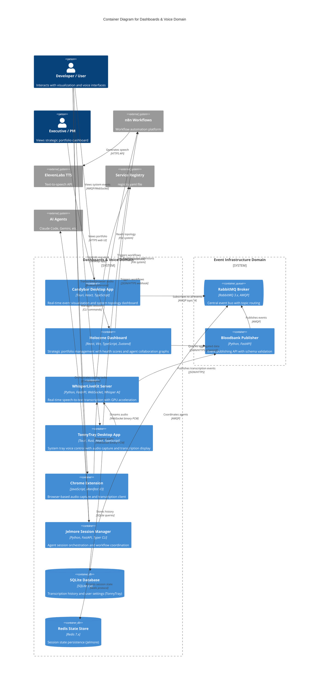

# C4 Container Level: Dashboards & Voice System Deployment

## Containers

### Candybar Visualization Desktop App
- **Name**: Candybar Visualization Desktop App
- **Description**: Real-time event visualization and system observability dashboard for 33GOD platform
- **Type**: Desktop Application
- **Technology**: React 19, Tauri 2.x (Rust backend), Vite, TypeScript, RabbitMQ AMQP client
- **Deployment**: Cross-platform desktop application (Linux, macOS planned, Windows planned)

#### Purpose
Provides real-time visualization and monitoring of the 33GOD event-driven architecture. Displays live event streams from Bloodbank RabbitMQ broker, renders system topology graphs from the service registry, and provides observability into agent collaboration, service health, and event flow patterns. Acts as the primary observability dashboard for developers and operators.

#### Components
This container deploys the following components:
- **React Frontend**: Interactive dashboard UI with real-time event visualization
  - Event stream viewer with filtering and search
  - Registry-based topology graph (network diagram)
  - Service health monitoring dashboard
- **Tauri Rust Backend**: Native desktop integration and system tray functionality
  - WebSocket/AMQP client for Bloodbank connection
  - File system access for registry.yaml parsing
  - System tray integration for quick access
  - Clipboard and notification management

#### Interfaces

##### RabbitMQ Event Stream Interface
- **Protocol**: AMQP 0.9.1 / WebSocket
- **Description**: Subscribes to all events from Bloodbank for real-time visualization
- **Endpoints**:
  - AMQP: `amqp://rabbitmq:5672` (direct connection)
  - WebSocket: `wss://events.delo.sh/ws` (production alternative)
- **Queue Binding**:
  - Exchange: `events`
  - Routing key: `#` (wildcard - all events)
  - Queue: `candybar_visualization_queue`

##### Registry File System Interface
- **Protocol**: Local file system access (Tauri FS plugin)
- **Description**: Reads service registry for topology visualization
- **File**: `/home/delorenj/code/33GOD/services/registry.yaml`
- **Operations**:
  - Read registry definitions
  - Watch for file changes (hot reload)
  - Parse YAML topology structure

##### Tauri IPC Interface
- **Protocol**: Tauri IPC (type-safe commands)
- **Description**: Frontend ↔ Rust backend communication
- **Commands**:
  - `connect_to_bloodbank()` - Establish RabbitMQ connection
  - `disconnect_from_bloodbank()` - Close connection
  - `load_registry()` - Read and parse registry.yaml
  - `get_connection_status()` - Check broker connection health
  - `export_events(format: string)` - Export event history

#### Dependencies

##### Containers Used
- **RabbitMQ Event Broker**: Consumes events via AMQP protocol
- **Service Registry** (file-based): Reads topology definitions

##### External Systems
- File system access for registry.yaml and configuration

#### Infrastructure
- **Deployment Config**:
  - Build: Tauri CLI (`npm run tauri:build`)
  - Config: `/home/delorenj/code/33GOD/candybar/trunk-main/src-tauri/tauri.conf.json`
  - Bundle targets: `all` (Linux, macOS, Windows)
- **Scaling**: Single-user desktop application (not horizontally scalable)
- **Resources**:
  - CPU: 0.5-1 core (idle), 1-2 cores (active visualization)
  - Memory: 50-150MB (idle), 150-300MB (active)
  - Storage: ~100MB application bundle
  - Network: Low bandwidth (event streaming)
- **Configuration**: User settings in `~/.config/candybar/config.json`

---

### Holocene Mission Control Dashboard
- **Name**: Holocene Mission Control Dashboard
- **Description**: Strategic portfolio management dashboard showing project health, agent collaboration, and decision impacts
- **Type**: Web Application (SPA)
- **Technology**: React 18, Vite, TypeScript, Zustand (state), TanStack Query (data fetching), Tailwind CSS
- **Deployment**: Vite development server (local), static hosting (production - Vercel/Netlify planned)

#### Purpose
Provides executive-level visibility into the 33GOD portfolio. Displays top moving projects, health scores, decision radar (ranked feed of impactful decisions), agent constellation (collaboration graph), plans & commitments with drift detection, risks & blockers, and auto-generated AM/PM briefings. Designed for strategic oversight rather than real-time operational monitoring (which is Candybar's role).

#### Components
This container deploys the following components:
- **Portfolio Overview**: Top 3 projects with health indicators
- **Decision Radar**: Ranked feed of high-impact decisions
- **Agent Constellation**: Collaboration graph visualization (D3.js-based)
- **Plans & Commitments**: Drift detection from planned state
- **Risks & Blockers**: Active issues dashboard
- **Briefing Mode**: Auto-generated summaries (AM/PM)

#### Interfaces

##### Bloodbank Query API
- **Protocol**: HTTP REST / GraphQL (planned)
- **Description**: Queries Bloodbank for aggregated event data
- **Endpoints** (planned):
  - `GET /api/v1/portfolio/summary` - Portfolio health summary
  - `GET /api/v1/decisions/recent?limit=20` - Recent decisions
  - `GET /api/v1/agents/collaboration` - Agent interaction graph data
  - `GET /api/v1/plans/drift` - Plan vs. actual drift analysis
  - `GET /api/v1/risks/active` - Active risks and blockers
- **Authentication**: API key (planned)
- **Content-Type**: `application/json`

##### Registry File Read Interface
- **Protocol**: HTTP file serving / Local file access
- **Description**: Reads service registry for topology and service definitions
- **File Path**: `/services/registry.yaml`
- **Operations**: Periodic polling (every 30s) or file watch

##### Data Export Interface
- **Protocol**: Client-side file download
- **Description**: Export dashboard data for reports
- **Formats**:
  - JSON: Structured data export
  - CSV: Tabular data export
  - PDF: Report generation (planned)

#### Dependencies

##### Containers Used
- **Bloodbank Publisher Service**: Queries aggregated event data (via planned API)
- **RabbitMQ Event Broker**: Event data source (indirect via Bloodbank API)

##### External Systems
- **Service Registry** (file-based): Topology and service definitions
- **Obsidian Vault** (DeLoDocs): Knowledge base integration (planned)

#### Infrastructure
- **Deployment Config**:
  - Development: Vite dev server (`npm run dev`, port 5173)
  - Production: Static build (`npm run build` → `dist/`)
  - Config: `/home/delorenj/code/33GOD/holocene/trunk-main/vite.config.ts`
- **Scaling**: Stateless SPA (scales via CDN in production)
- **Resources**:
  - Development: ~200MB memory (Vite server)
  - Production: Static files (~2-5MB gzipped)
  - Build time: 10-30 seconds
- **Configuration**: Environment variables via `.env`
  - `VITE_BLOODBANK_API_URL`: Bloodbank query endpoint
  - `VITE_REGISTRY_PATH`: Registry file path

---

### HeyMa WhisperLiveKit Server
- **Name**: HeyMa WhisperLiveKit Server
- **Description**: Real-time speech-to-text transcription server with WebSocket streaming and Whisper AI integration
- **Type**: Web Application / WebSocket Server
- **Technology**: Python 3.10+, FastAPI, WebSocket, faster-whisper, PyAudio, scipy/numpy
- **Deployment**: Docker container (CPU or GPU), Python virtual environment (uv)

#### Purpose
Provides high-performance real-time speech-to-text transcription using OpenAI's Whisper model. Accepts audio streams via WebSocket, processes audio chunks in real-time, and emits transcription events. Supports multiple concurrent clients, GPU acceleration (optional), and various Whisper model sizes (tiny to large-v3). Acts as the core AI inference engine for voice interaction.

#### Components
This container deploys the following components:
- **FastAPI HTTP Server**: Health checks and HTTP endpoints
- **WebSocket Server**: Real-time audio streaming endpoint (`/asr`)
- **Whisper AI Engine**: faster-whisper inference (quantized for performance)
- **Audio Processing Pipeline**: Audio chunk buffering and preprocessing
- **Event Publisher**: Publishes transcription events to Bloodbank

#### Interfaces

##### WebSocket Audio Streaming Interface
- **Protocol**: WebSocket (RFC 6455)
- **Description**: Real-time bidirectional audio streaming and transcription delivery
- **Endpoints**:
  - Development: `ws://localhost:8888/asr`
  - Production: `wss://whisper.delo.sh/asr`
- **Client Protocol**:
  - Connect to WebSocket endpoint
  - Send binary audio chunks (16kHz, 16-bit PCM, mono)
  - Receive JSON transcription events
- **Server Response Format**:
  ```json
  {
    "text": "transcribed text segment",
    "is_final": true,
    "timestamp": "2024-01-15T10:30:00Z",
    "confidence": 0.95
  }
  ```

##### HTTP Health Check Interface
- **Protocol**: HTTP REST
- **Description**: Server health monitoring
- **Endpoints**:
  - `GET /health` - Health check (200 OK)
  - `GET /models` - List available Whisper models
  - `GET /status` - Server status and model info
- **Base URL**: `http://localhost:8888` (dev), `https://whisper.delo.sh` (prod)

##### Bloodbank Event Publishing Interface
- **Protocol**: HTTP REST
- **Description**: Publishes transcription completion events
- **Integration**: Calls Bloodbank Publisher Service
- **Event Type**: `talkytonny.transcription.completed`
- **Payload**:
  ```json
  {
    "text": "full transcription",
    "duration_seconds": 12.5,
    "model": "medium",
    "timestamp": "2024-01-15T10:30:00Z"
  }
  ```

#### Dependencies

##### Containers Used
- **Bloodbank Publisher Service**: Publishes transcription events

##### External Systems
- **Hugging Face Hub**: Downloads Whisper model weights (cached locally)
- **n8n Workflow Automation**: Receives webhooks (via client integration)

#### Infrastructure
- **Deployment Config**:
  - Docker: `/home/delorenj/code/33GOD/HeyMa/trunk-main/Dockerfile`
  - Docker Compose: `/home/delorenj/code/33GOD/HeyMa/trunk-main/docker-compose.yml`
  - Entry point: `whisperlivekit-server --host 0.0.0.0 --model medium`
  - Base image: `nvidia/cuda:12.9.1-cudnn-devel-ubuntu24.04` (GPU) or CPU variant
- **Scaling**: Horizontal scaling possible (each instance serves ~5-10 concurrent users)
- **Resources**:
  - CPU: 2-4 cores (inference), 1 core (idle)
  - Memory: 500MB-2GB (model size: tiny=500MB, medium=1.5GB, large=3GB)
  - GPU: Optional CUDA acceleration (10x faster)
  - Storage: 1-5GB (model cache at `/root/.cache/huggingface/hub`)
  - Network: WebSocket bandwidth ~32Kbps per client
- **Configuration**: Environment variables via docker-compose.yml
  - `PYTHONUNBUFFERED=1`
  - Model size via command args: `--model [tiny|base|small|medium|large-v3]`
- **Production Access**: Traefik reverse proxy at `whisper.delo.sh`

---

### TonnyTray Desktop Application
- **Name**: TonnyTray Desktop Application
- **Description**: System tray desktop application for voice control with WhisperLiveKit integration
- **Type**: Desktop Application / System Tray Utility
- **Technology**: Tauri 2.x (Rust backend), React 18 (TypeScript frontend), MUI (Material-UI), Zustand, WebSocket client
- **Deployment**: Cross-platform desktop application (Linux primary, macOS/Windows planned)

#### Purpose
Provides a user-friendly desktop interface for voice transcription and control. Lives in the system tray for quick access, manages audio input devices, streams audio to WhisperLiveKit server, displays live transcriptions, and triggers n8n workflows. Includes process management for local WhisperLiveKit server (auto-start/stop), settings management, and transcription history with SQLite persistence.

#### Components
This container deploys the following components:
- **React UI**: Main window and settings interface
  - Transcription display with filtering
  - Audio device selection
  - Workflow trigger configuration
  - History browser (SQLite-backed)
- **Tauri Rust Backend**: Native system integration
  - Audio capture (PyAudio wrapper via subprocess)
  - WebSocket client for WhisperLiveKit connection
  - SQLite database for history and settings
  - System keychain integration (API keys)
  - Process manager (auto-start WhisperLiveKit server)
  - System tray icon and menu
- **Log Tailer Utility**: Separate window for server log monitoring (`log-tailer.html`)

#### Interfaces

##### WebSocket Client Interface
- **Protocol**: WebSocket (client-side)
- **Description**: Connects to WhisperLiveKit server for transcription
- **Connection**:
  - Local: `ws://localhost:8888/asr`
  - Remote: `wss://whisper.delo.sh/asr`
- **Operations**:
  - Send binary audio chunks from microphone
  - Receive JSON transcription events
  - Auto-reconnect on connection loss

##### n8n Webhook Trigger Interface
- **Protocol**: HTTP POST
- **Description**: Triggers n8n workflows with transcription text
- **Endpoint**: Configurable (default: `https://n8n.delo.sh/webhook/transcription`)
- **Payload**:
  ```json
  {
    "text": "transcribed command",
    "timestamp": "2024-01-15T10:30:00Z",
    "source": "tonnytray"
  }
  ```

##### Tauri IPC Commands
- **Protocol**: Tauri IPC (type-safe Rust ↔ TypeScript)
- **Description**: Frontend ↔ Backend communication
- **Commands**:
  - `start_recording()` - Start audio capture
  - `stop_recording()` - Stop audio capture
  - `update_settings(settings)` - Update configuration
  - `get_transcription_history()` - Query SQLite history
  - `manage_server(action)` - Control WhisperLiveKit process
  - `store_api_key(service, key)` - Secure keychain storage

##### SQLite Persistence Interface
- **Protocol**: SQLite database (local file)
- **Description**: Stores transcription history and user settings
- **Location**: `~/.local/share/tonnytray/tonnytray.db`
- **Schema**:
  - `transcriptions` table: history with timestamps
  - `profiles` table: user profiles and permissions
  - `settings` table: configuration key-value store
  - `statistics` table: usage metrics

##### System Keychain Interface
- **Protocol**: Native keychain API (Linux Secret Service, macOS Keychain, Windows Credential Manager)
- **Description**: Secure storage for API keys (ElevenLabs, n8n)
- **Operations**:
  - Store: `keychain.set("elevenlabs_api_key", "sk-...")`
  - Retrieve: `keychain.get("elevenlabs_api_key")`
  - Delete: `keychain.delete("elevenlabs_api_key")`

#### Dependencies

##### Containers Used
- **HeyMa WhisperLiveKit Server**: Connects via WebSocket for transcription

##### External Systems
- **n8n Workflow Automation**: Webhook trigger endpoint
- **ElevenLabs TTS** (planned): Text-to-speech response generation
- **System Audio Devices**: Microphone input capture

#### Infrastructure
- **Deployment Config**:
  - Build: Tauri CLI (`npm run tauri:build`)
  - Config: `/home/delorenj/code/33GOD/HeyMa/trunk-main/TonnyTray/src-tauri/tauri.conf.json`
  - Entry point: `src-tauri/src/lib.rs`
  - Bundle: `.deb` (Linux), `.dmg` (macOS), `.exe` (Windows)
- **Scaling**: Single-user desktop application
- **Resources**:
  - CPU: 0.2-0.5 cores (idle), 0.5-1 core (recording)
  - Memory: 10-20MB (idle), 50-100MB (active)
  - Storage: ~50MB application + 10-100MB database
  - Network: WebSocket ~32Kbps during recording
- **Configuration Files**:
  - Settings: `~/.config/tonnytray/config.json`
  - Database: `~/.local/share/tonnytray/tonnytray.db`
  - Logs: Structured logging to stdout/file
- **System Dependencies** (Linux):
  - `libwebkit2gtk-4.1-0` - WebView rendering
  - `libgtk-3-0` - GTK UI framework
  - `libasound2` - Audio capture (ALSA)

---

### WhisperLiveKit Chrome Extension
- **Name**: WhisperLiveKit Chrome Extension
- **Description**: Browser-based audio capture and transcription client for Chrome/Chromium browsers
- **Type**: Browser Extension (Manifest V3)
- **Technology**: JavaScript (Service Worker), Chrome Extension APIs (tabCapture, offscreen, scripting)
- **Deployment**: Chrome Web Store (planned), manual load unpacked (development)

#### Purpose
Provides voice transcription capabilities directly within the browser without requiring a desktop application. Captures audio from active browser tabs or microphone, streams to WhisperLiveKit server, and displays transcriptions via popup UI. Useful for transcribing web meetings, videos, or voice commands while browsing. Lightweight alternative to TonnyTray for browser-only workflows.

#### Components
This container deploys the following components:
- **Service Worker** (`background.js`): Background script managing extension lifecycle
- **Popup UI** (`popup.html`): User interface for controls and transcription display
- **Offscreen Document**: Audio capture in isolated context (Manifest V3 requirement)
- **Content Scripts**: Tab-level audio capture and injection (via `scripting` API)

#### Interfaces

##### Chrome Extension API Interface
- **Protocol**: Chrome Extension APIs
- **Description**: Browser integration for audio capture and UI
- **Permissions**:
  - `tabCapture` - Capture audio from browser tabs
  - `scripting` - Inject scripts for audio access
  - `offscreen` - Run audio processing in isolated context
  - `activeTab` - Access current tab for capture
  - `storage` - Persist user settings

##### WebSocket Client Interface
- **Protocol**: WebSocket
- **Description**: Connects to WhisperLiveKit server from browser context
- **Connection**: Configurable (default: `ws://localhost:8888/asr`)
- **Operations**:
  - Stream audio from MediaStream API
  - Receive transcription events
  - Display in popup UI

##### Chrome Storage Interface
- **Protocol**: Chrome Storage API
- **Description**: Persist extension settings
- **Storage Type**: `chrome.storage.sync` (sync across devices)
- **Data**:
  - `whisper_server_url`: WhisperLiveKit endpoint
  - `auto_start`: Auto-start transcription setting
  - `language`: Preferred transcription language

#### Dependencies

##### Containers Used
- **HeyMa WhisperLiveKit Server**: Connects via WebSocket for transcription

##### External Systems
- **Chrome Web Store**: Extension distribution (planned)
- **Browser Media APIs**: Audio capture via `getUserMedia()`

#### Infrastructure
- **Deployment Config**:
  - Manifest: `/home/delorenj/code/33GOD/HeyMa/trunk-main/chrome-extension/manifest.json`
  - Version: Manifest V3
  - Install: Manual load unpacked (development)
- **Scaling**: Per-user installation (browser-based)
- **Resources**:
  - Memory: 10-30MB per browser instance
  - CPU: Minimal (audio capture only, no inference)
  - Network: WebSocket ~32Kbps during capture
- **Distribution**:
  - Development: Load unpacked from `chrome://extensions/`
  - Production: Chrome Web Store (planned)

---

### Jelmore Session Manager Service
- **Name**: Jelmore Session Manager Service
- **Description**: Event-driven orchestration layer managing agentic coder sessions and workflows
- **Type**: API Service / Orchestration Layer
- **Technology**: Python 3.11+, FastAPI (planned), Typer CLI, Redis, RabbitMQ (aio-pika), Pydantic
- **Deployment**: Python virtual environment (uv), Docker container (planned)

#### Purpose
Provides session management and orchestration for AI agent coding workflows. Tracks active coding sessions, manages agent state, coordinates between voice input (HeyMa) and agent execution, and persists session context in Redis. Acts as the control plane for agent-driven development, bridging user intent (voice or CLI) with agent execution (Claude, Gemini). Currently CLI-focused with FastAPI HTTP API planned for web integration.

#### Components
This container deploys the following components:
- **CLI Interface**: Typer-based command-line interface (`jelmore` command)
- **Session Manager**: Redis-backed session state management
- **Event Router**: RabbitMQ consumer/producer for agent coordination
- **Agent State Tracker**: Monitors agent health and progress
- **Workflow Orchestrator**: Multi-step task coordination

#### Interfaces

##### CLI Interface
- **Protocol**: Command-line (Typer framework)
- **Description**: Primary interface for session management
- **Commands**:
  - `jelmore session start <name>` - Start new coding session
  - `jelmore session list` - List active sessions
  - `jelmore session attach <id>` - Attach to session
  - `jelmore session end <id>` - End session
  - `jelmore agent status` - Check agent health
  - `jelmore workflow run <workflow>` - Execute workflow
- **Entry Point**: `jelmore = "jelmore.cli.main:app"` (pyproject.toml)

##### Redis State Interface
- **Protocol**: Redis Protocol
- **Description**: Persistent session state storage
- **Operations**:
  - `SET session:{id}:state` - Store session state
  - `GET session:{id}:state` - Retrieve session state
  - `HSET session:{id}:context` - Store context key-value pairs
  - `EXPIRE session:{id}:*` - Auto-cleanup stale sessions
- **Connection**: Configurable via environment (default: `redis://localhost:6379`)

##### RabbitMQ Event Interface
- **Protocol**: AMQP 0.9.1 (via aio-pika)
- **Description**: Agent coordination event bus
- **Publisher**:
  - Exchange: `events`
  - Routing keys: `jelmore.session.started`, `jelmore.workflow.triggered`
- **Consumer**:
  - Queue: `jelmore_coordination_queue`
  - Binding keys: `talkytonny.transcription.completed`, `agent.*.completed`

##### HTTP API Interface (Planned)
- **Protocol**: HTTP REST (FastAPI)
- **Description**: Web-based session management API
- **Endpoints** (planned):
  - `POST /api/v1/sessions` - Create session
  - `GET /api/v1/sessions/{id}` - Get session state
  - `PUT /api/v1/sessions/{id}` - Update session
  - `DELETE /api/v1/sessions/{id}` - End session
  - `POST /api/v1/workflows/{name}` - Trigger workflow
  - `GET /api/v1/health` - Health check
- **Base URL**: `http://localhost:8080` (planned)

#### Dependencies

##### Containers Used
- **RabbitMQ Event Broker**: Event coordination via AMQP
- **HeyMa WhisperLiveKit**: Consumes transcription events for voice commands

##### External Systems
- **Redis**: Session state persistence
- **AI Agent Runtimes**: Claude Code, Gemini (via CLI integration)

#### Infrastructure
- **Deployment Config**:
  - Package: `/home/delorenj/code/33GOD/jelmore/trunk-main/pyproject.toml`
  - Build: Hatchling (`hatch build`)
  - Runtime: uv-managed virtual environment (`.venv/`)
  - Entry point: `jelmore` CLI command
- **Scaling**: Single instance (horizontal scaling planned with Redis-based locking)
- **Resources**:
  - CPU: 0.2-0.5 cores (low usage, mostly I/O)
  - Memory: 50-150MB
  - Storage: Minimal (state in Redis)
  - Network: Low bandwidth (event messages)
- **Configuration**: Environment variables + `.env` file
  - `REDIS_URL`: Redis connection string
  - `RABBITMQ_URL`: RabbitMQ connection string
  - `LOG_LEVEL`: Logging verbosity (structlog)
- **Python Version**: 3.11+ (managed by mise/asdf)

---

## Container Diagram



## Key Architecture Principles

### Technology Choices Rationale

1. **Tauri for Desktop Applications (Candybar, TonnyTray)**
   - Low memory footprint vs Electron (~10-20MB vs ~100-200MB)
   - Native system integration (audio, tray, clipboard, keychain)
   - Type-safe IPC between Rust backend and TypeScript frontend
   - Cross-platform support with single codebase
   - WebView rendering (platform native: WebKit on Linux, WebView2 on Windows)

2. **React 18/19 for Frontend UI**
   - Component-based architecture for reusable UI elements
   - Large ecosystem for charts, graphs, and visualization libraries
   - Zustand for lightweight state management (vs Redux overhead)
   - TanStack Query for server state synchronization
   - TypeScript for type safety across frontend

3. **Whisper AI for Speech Recognition**
   - State-of-the-art accuracy for voice transcription
   - Local inference (no cloud API costs or latency)
   - GPU acceleration support (10x faster with CUDA)
   - Multiple model sizes (tiny to large) for quality/performance tradeoff
   - faster-whisper implementation for production efficiency

4. **WebSocket for Real-time Audio Streaming**
   - Bidirectional communication for low-latency audio streaming
   - Efficient binary data transfer (vs chunked HTTP)
   - Native browser support (Chrome Extension)
   - Auto-reconnect and connection management
   - ~32Kbps bandwidth (16kHz, 16-bit PCM mono)

5. **FastAPI for HTTP Services**
   - Async/await native for high concurrency
   - Automatic OpenAPI/Swagger documentation
   - Type safety via Pydantic models
   - WebSocket support for real-time endpoints
   - Low latency and high throughput

6. **Python for AI Integration (WhisperLiveKit, Jelmore)**
   - Native integration with AI/ML libraries (PyTorch, Whisper)
   - Async support via asyncio/aio-pika
   - Rich ecosystem for data processing (numpy, scipy)
   - uv package manager for fast dependency resolution
   - Type safety via Pydantic and mypy

### Container Responsibility Distribution

1. **Candybar**: Operational observability - real-time event monitoring for developers
2. **Holocene**: Strategic oversight - portfolio health and decision impact for executives
3. **WhisperLiveKit Server**: AI inference - speech-to-text transcription engine
4. **TonnyTray**: End-user voice interface - desktop voice control with session management
5. **Chrome Extension**: Browser voice interface - lightweight alternative for web workflows
6. **Jelmore**: Orchestration control plane - agent session management and workflow coordination

### Communication Patterns

1. **Real-time Streaming (WebSocket)**:
   - Audio streaming (TonnyTray/Chrome Extension → WhisperLiveKit)
   - Live transcription delivery (WhisperLiveKit → Clients)
   - Event visualization (RabbitMQ → Candybar)

2. **Event-Driven (AMQP)**:
   - Transcription events (WhisperLiveKit → Bloodbank → RabbitMQ)
   - Agent coordination (Jelmore ↔ RabbitMQ)
   - System-wide event distribution

3. **Synchronous (HTTP REST)**:
   - Event publishing (WhisperLiveKit → Bloodbank API)
   - Webhook triggers (TonnyTray/WhisperLiveKit → n8n)
   - Health checks and status queries

4. **File System (Local)**:
   - Registry reading (Candybar, Holocene → registry.yaml)
   - Configuration persistence (TonnyTray → config.json)
   - Log monitoring (TonnyTray log tailer)

5. **In-Process IPC**:
   - Tauri commands (React ↔ Rust via type-safe IPC)
   - Chrome Extension messaging (popup ↔ service worker)

### Deployment Strategy

1. **Desktop Applications** (Candybar, TonnyTray):
   - Single-user per-device installation
   - Platform-specific bundles (.deb, .dmg, .exe)
   - Auto-update capability (planned)
   - System tray integration for always-available access

2. **Web Application** (Holocene):
   - Development: Local Vite server (hot reload)
   - Production: Static hosting (CDN distribution)
   - Stateless SPA (scales horizontally via CDN)

3. **Containerized Services** (WhisperLiveKit):
   - Docker deployment with GPU support
   - Traefik reverse proxy for HTTPS
   - Horizontal scaling via load balancer
   - Persistent model cache (Docker volume)

4. **Browser Extension** (Chrome Extension):
   - Per-user browser installation
   - Chrome Web Store distribution (planned)
   - Auto-update via Chrome extension system

5. **Python Services** (Jelmore):
   - Virtual environment deployment (uv)
   - Systemd service (Linux)
   - Docker containerization (planned)

### Tauri Architecture Details

#### Cross-Platform Deployment
Tauri enables true cross-platform desktop applications with a single Rust + Web codebase:

**Build Targets**:
- **Linux**: Bundles into `.deb`, `.AppImage`, or `.rpm` packages
  - Uses WebKit2GTK for rendering (native Linux WebView)
  - System integration via GTK3 APIs
  - ~10-20MB memory footprint (idle)

- **macOS**: Bundles into `.dmg` or `.app` packages (planned)
  - Uses WKWebView (native macOS WebView)
  - System integration via Cocoa APIs
  - Notarization and code signing for distribution

- **Windows**: Bundles into `.exe` or `.msi` installers (planned)
  - Uses WebView2 (Chromium-based native WebView)
  - System integration via Win32 APIs
  - Code signing for Windows SmartScreen

**Build Process**:
```bash
# Development (hot reload)
npm run tauri:dev

# Production build (all targets)
npm run tauri:build

# Platform-specific build
npm run tauri:build -- --target x86_64-unknown-linux-gnu
```

**Configuration** (`tauri.conf.json`):
- Window properties (size, transparency, decorations)
- Bundle settings (icons, identifiers, categories)
- Security policies (CSP, IPC permissions)
- System integrations (tray, notifications, clipboard)

#### IPC Architecture
Tauri provides type-safe communication between frontend (React/TypeScript) and backend (Rust):

**Frontend → Backend (Commands)**:
```typescript
// TypeScript (React component)
import { invoke } from '@tauri-apps/api/core';

const result = await invoke<string>('start_recording', {
  device: 'default'
});
```

**Backend → Frontend (Events)**:
```rust
// Rust (backend handler)
use tauri::Emitter;

app.emit("transcription_received", TranscriptionEvent {
    text: "Hello world".into(),
    timestamp: Utc::now(),
})?;
```

```typescript
// TypeScript (event listener)
import { listen } from '@tauri-apps/api/event';

const unlisten = await listen<TranscriptionEvent>('transcription_received', (event) => {
  console.log('Transcription:', event.payload.text);
});
```

**Type Safety**:
- Rust types (`#[derive(Serialize, Deserialize)]`) ↔ TypeScript interfaces
- Compile-time validation of command names and payloads
- No runtime serialization errors with matching types

#### System Tray Integration
Both Candybar and TonnyTray use Tauri's system tray for always-available access:

**Features**:
- Persistent background process (hidden main window)
- Context menu with custom actions
- Dynamic icon updates (status indicators)
- Click-to-show main window
- Minimal resource usage when idle

**Implementation** (Rust):
```rust
use tauri::menu::{Menu, MenuItem};
use tauri::tray::{TrayIconBuilder, TrayIconEvent};

TrayIconBuilder::new()
    .icon(app.default_window_icon().unwrap().clone())
    .menu(&menu)
    .on_menu_event(|app, event| match event.id.as_ref() {
        "show" => { /* Show main window */ }
        "quit" => { /* Exit application */ }
        _ => {}
    })
    .build(app)?;
```

#### Security Model
Tauri provides multiple security layers:

1. **Content Security Policy (CSP)**:
   - Restricts resource loading origins
   - Prevents XSS attacks
   - Example: `connect-src ipc: http://ipc.localhost ws://localhost:*`

2. **IPC Permissions**:
   - Allowlist of permitted commands
   - Per-command capability system (Tauri v2)
   - Prevents unauthorized backend access

3. **System Keychain Integration**:
   - Secure API key storage (Linux Secret Service, macOS Keychain)
   - Encrypted at rest by OS
   - No plaintext secrets in config files

4. **Sandboxing**:
   - WebView process isolation
   - Rust backend runs with elevated privileges (controlled)
   - No Node.js runtime (eliminates entire attack surface vs Electron)

### API Versioning Strategy

1. **RabbitMQ Event Routing Keys**: Include version in pattern
   - Example: `talkytonny.v1.transcription.completed`
   - Consumers bind to specific versions or wildcards

2. **HTTP APIs** (Bloodbank, Jelmore planned): URL versioning
   - Example: `/api/v1/events/`, `/api/v2/events/`
   - Parallel operation during migration period

3. **WebSocket Protocol**: Version negotiation in handshake
   - Example: `Sec-WebSocket-Protocol: whisper-v1`
   - Server selects compatible version

4. **Tauri IPC**: Command versioning via naming
   - Breaking changes: `start_recording_v2()`
   - Deprecation warnings in TypeScript types

## Operational Considerations

### Monitoring and Observability

1. **Candybar Dashboard**:
   - Real-time event flow visualization
   - Service health indicators from registry
   - Agent collaboration graph
   - Event rate metrics and histograms

2. **WhisperLiveKit Metrics**:
   - Transcription latency (p50, p95, p99)
   - Model inference time per audio chunk
   - WebSocket connection count and health
   - GPU utilization (if enabled)
   - Model cache hit rate

3. **TonnyTray Metrics**:
   - Audio capture quality (sample rate, buffer drops)
   - WebSocket connection stability
   - Transcription accuracy feedback (user ratings)
   - API call success rate (n8n webhooks)

4. **Jelmore Orchestration Metrics**:
   - Active session count
   - Session duration distribution
   - Agent task completion rate
   - Workflow success/failure rate
   - Redis connection health

5. **Holocene Health Indicators**:
   - Project health scores (aggregated from events)
   - Agent collaboration metrics (graph connectivity)
   - Decision impact scores
   - Drift detection alerts (plan vs. actual)

### Performance Targets

1. **WhisperLiveKit Server**:
   - Transcription latency: <500ms (speech end → event emission)
   - Model loading time: <10s (cold start)
   - Concurrent connections: 5-10 per instance (CPU), 20-50 (GPU)
   - Audio processing delay: <100ms (real-time)

2. **TonnyTray Desktop App**:
   - Startup time: <2s (cold start)
   - Memory footprint: <50MB (idle), <150MB (active)
   - Audio capture latency: <50ms
   - IPC call latency: <10ms
   - UI responsiveness: 60fps (React rendering)

3. **Candybar Dashboard**:
   - Event visualization latency: <100ms (RabbitMQ → UI)
   - Registry reload time: <1s
   - Graph rendering: 60fps (up to 100 nodes)
   - Memory footprint: <200MB (with history buffer)

4. **Jelmore Session Manager**:
   - Session creation: <100ms
   - State persistence: <50ms (Redis write)
   - Event routing: <20ms (AMQP publish)
   - CLI command response: <500ms

5. **Chrome Extension**:
   - Memory footprint: <30MB
   - Audio capture latency: <100ms
   - WebSocket connection setup: <500ms
   - Popup UI rendering: <100ms

### Security Considerations

1. **API Keys and Secrets**:
   - TonnyTray: System keychain storage (encrypted)
   - WhisperLiveKit: Environment variables (not committed)
   - n8n webhooks: HTTPS endpoints with optional authentication
   - Jelmore: Redis password via environment

2. **Network Security**:
   - WebSocket: WSS (TLS) in production
   - HTTP APIs: HTTPS only in production
   - AMQP: Optional TLS for RabbitMQ connections
   - Traefik reverse proxy handles TLS termination

3. **Desktop Application Security**:
   - Tauri CSP prevents XSS attacks
   - IPC command allowlist prevents unauthorized backend access
   - No eval() or dynamic code execution in frontend
   - File system access restricted via Tauri capabilities

4. **Browser Extension Security**:
   - Manifest V3 service worker (isolated context)
   - CSP restricts resource loading
   - Storage API for settings (encrypted by browser)
   - No content script injection (scripting API only)

5. **Data Privacy**:
   - Audio data: Streamed in real-time, not persisted by default
   - Transcriptions: Stored locally in SQLite (TonnyTray)
   - Session state: Temporary Redis storage with expiration
   - No telemetry or analytics by default

### Disaster Recovery

1. **Desktop Application State**:
   - TonnyTray: SQLite database backup via file copy
   - Configuration: JSON files in `~/.config/`
   - Keychain: OS-managed, recoverable via system backup

2. **WhisperLiveKit Server**:
   - Stateless service (no persistent data)
   - Model cache in Docker volume (can be rebuilt)
   - Traefik configuration in docker-compose.yml

3. **Jelmore Session State**:
   - Redis backup via RDB snapshots
   - Session state TTL (auto-cleanup after 24h)
   - Event log in RabbitMQ (durable queues)

4. **Configuration Recovery**:
   - All config files in version control
   - Environment variables documented in .env.example
   - Registry.yaml backed by git

### Scaling Considerations

1. **WhisperLiveKit Server**:
   - Horizontal scaling: Deploy multiple instances behind load balancer
   - Sticky sessions: Not required (stateless per connection)
   - Model cache: Shared via Docker volume or network storage
   - GPU scaling: Multiple GPU instances for high throughput

2. **Holocene Dashboard**:
   - Static assets: CDN distribution (Cloudflare, Vercel)
   - API backend: Scale Bloodbank API horizontally
   - Client-side state: No server-side sessions

3. **Candybar**:
   - Not horizontally scalable (desktop app)
   - Performance optimization via event filtering and pagination

4. **Jelmore**:
   - Horizontal scaling: Redis-based distributed locks (planned)
   - Single leader: Coordination via Redis election
   - Worker pool: Multiple Jelmore instances as workers

## API Specifications

### Planned OpenAPI Specifications

Due to the early stage of these services, comprehensive OpenAPI specifications will be created as APIs mature. The following endpoints are prioritized for documentation:

1. **Holocene Bloodbank Query API** (planned):
   - `GET /api/v1/portfolio/summary` - Portfolio aggregation
   - `GET /api/v1/decisions/recent` - Decision feed
   - `GET /api/v1/agents/collaboration` - Agent graph data
   - `GET /api/v1/plans/drift` - Plan drift analysis

2. **Jelmore Orchestration API** (planned):
   - `POST /api/v1/sessions` - Session management
   - `POST /api/v1/workflows/{name}` - Workflow triggers
   - `GET /api/v1/health` - Health checks

3. **WhisperLiveKit HTTP API** (partial):
   - `GET /health` - Server health
   - `GET /models` - Available models
   - `GET /status` - Server status
   - WebSocket: `ws://host:port/asr` (binary audio protocol)

### Existing API Documentation

- **Bloodbank Publisher API**: See [Event Infrastructure Container Documentation](/home/delorenj/code/33GOD/docs/domains/event-infrastructure/c4-container.md)
- **RabbitMQ AMQP Protocol**: Standard AMQP 0.9.1 (topic exchange pattern)
- **Tauri IPC Protocol**: Type-safe commands documented in source code
  - TonnyTray: `/home/delorenj/code/33GOD/HeyMa/trunk-main/TonnyTray/src-tauri/src/lib.rs`
  - Candybar: `/home/delorenj/code/33GOD/candybar/trunk-main/src-tauri/src/lib.rs`

## Related Documentation

### Component Architecture
- [Candybar Components](/home/delorenj/code/33GOD/docs/domains/dashboards-voice/c4-component-candybar.md) (when created)
- [HeyMa Components](/home/delorenj/code/33GOD/docs/domains/dashboards-voice/c4-component-heymama.md) (when created)
- [Jelmore Components](/home/delorenj/code/33GOD/docs/domains/dashboards-voice/c4-component-jelmore.md) (when created)

### System Context
- [Overall 33GOD Architecture](/home/delorenj/code/33GOD/docs/ARCHITECTURE.md)
- [Event Infrastructure Container Documentation](/home/delorenj/code/33GOD/docs/domains/event-infrastructure/c4-container.md)
- [Domain Overview: Dashboards & Voice](/home/delorenj/code/33GOD/docs/domains/dashboards-voice.md)

### Technical References
- [HeyMa CLAUDE.md](/home/delorenj/code/33GOD/HeyMa/trunk-main/CLAUDE.md) - Development guide
- [Jelmore pyproject.toml](/home/delorenj/code/33GOD/jelmore/trunk-main/pyproject.toml) - Python dependencies
- [Candybar package.json](/home/delorenj/code/33GOD/candybar/trunk-main/package.json) - Frontend dependencies
- [Holocene package.json](/home/delorenj/code/33GOD/holocene/trunk-main/package.json) - Dashboard dependencies

## Deployment Quick Reference

| Container | Development Command | Production Deployment | Port/Endpoint |
|-----------|-------------------|----------------------|---------------|
| **Candybar** | `npm run tauri:dev` | Tauri bundle (.deb) | Desktop app (system tray) |
| **Holocene** | `npm run dev` | Static build + CDN | http://localhost:5173 |
| **WhisperLiveKit** | `./scripts/start_server.sh` | Docker Compose | ws://localhost:8888/asr<br>https://whisper.delo.sh |
| **TonnyTray** | `npm run tauri:dev` | Tauri bundle (.deb) | Desktop app (system tray) |
| **Chrome Extension** | Load unpacked | Chrome Web Store (planned) | Browser extension |
| **Jelmore** | `jelmore` CLI | systemd service | CLI + Redis/RabbitMQ |

## Container Technology Summary

| Technology | Containers Using It | Purpose |
|-----------|-------------------|---------|
| **Tauri 2.x** | Candybar, TonnyTray | Cross-platform desktop with low memory footprint |
| **React 18/19** | Candybar, TonnyTray, Holocene | Frontend UI framework |
| **TypeScript** | Candybar, TonnyTray, Holocene, Chrome Ext | Type-safe frontend development |
| **Rust** | Candybar (backend), TonnyTray (backend) | Native system integration and IPC |
| **Python 3.10+** | WhisperLiveKit, Jelmore | AI/ML integration and backend services |
| **FastAPI** | WhisperLiveKit, Jelmore (planned) | High-performance HTTP/WebSocket servers |
| **WebSocket** | WhisperLiveKit, TonnyTray, Chrome Ext | Real-time audio streaming |
| **SQLite** | TonnyTray | Local data persistence |
| **Redis** | Jelmore | Distributed state management |
| **RabbitMQ** | Candybar, Jelmore | Event-driven coordination |
| **Docker** | WhisperLiveKit | Containerized deployment |
| **Chrome Extension API** | Chrome Extension | Browser integration |

## Key Insights

### Why Dashboards & Voice are Grouped as a Domain

This domain represents the **human interface layer** of the 33GOD platform:

1. **Visualization** (Candybar, Holocene): Make complex system behavior observable
2. **Voice Interaction** (HeyMa, TonnyTray, Chrome Ext): Enable natural human-AI collaboration
3. **Orchestration Interface** (Jelmore): Bridge human intent → agent execution

All containers in this domain focus on **human ↔ system interaction** rather than internal system logic.

### Container Deployment Patterns

1. **Desktop-First**: Tauri apps prioritize low resource usage and native integration
2. **Web-Optional**: Holocene as strategic dashboard (less real-time than Candybar)
3. **AI-Powered**: WhisperLiveKit provides centralized AI inference
4. **Event-Driven**: All containers integrate with Bloodbank for coordination
5. **Modular**: Each container can be deployed independently

### Technology Trade-offs

| Choice | Advantage | Trade-off |
|--------|-----------|-----------|
| **Tauri over Electron** | 90% less memory, native APIs | Smaller ecosystem, newer platform |
| **Local Whisper over Cloud API** | No API costs, privacy | GPU required for speed, model size |
| **React over Vue/Svelte** | Larger ecosystem, team familiarity | Larger bundle size |
| **WebSocket over HTTP polling** | Lower latency, efficiency | More complex connection management |
| **Desktop over Web-only** | System integration (audio, tray) | Distribution complexity |
