# C4 Context Level: Dashboards & Voice Domain

## System Overview

### Short Description
User-facing visualization and voice interaction platform providing mission control dashboards and real-time voice-to-text interfaces for the 33GOD agentic development ecosystem.

### Long Description
The Dashboards & Voice domain serves as the primary human-system interface layer for the 33GOD platform. It combines **Holocene** (mission control dashboard) and **HeyMa** (voice interface) to provide comprehensive visibility and voice-driven interaction with the autonomous agent ecosystem. Holocene visualizes portfolio health, agent collaboration graphs, decision impacts, and real-time project status through a React-based dashboard that queries Bloodbank events and the service registry. HeyMa enables hands-free interaction through Whisper-powered speech recognition, Letta-driven intelligent response generation, and ElevenLabs text-to-speech output. Together, these systems democratize access to complex agent orchestration workflows, making them observable and controllable through both visual and conversational interfaces.

## Personas

### Software Developer (Human User)
- **Type**: Human User
- **Description**: Technical users who monitor agent performance, debug workflows, and track project health through dashboards and voice commands
- **Goals**:
  - Monitor real-time agent execution and task delegation chains
  - Visualize system bottlenecks and performance metrics
  - Query project status hands-free while coding
  - Track token usage and LLM costs
  - Debug agent behavior through observability tools
- **Key Features Used**: Portfolio dashboard, decision radar, agent constellation view, voice queries, transcription monitoring

### Product Manager (Human User)
- **Type**: Human User
- **Description**: Non-technical stakeholders who need high-level visibility into project health, agent productivity, and decision impacts
- **Goals**:
  - Understand portfolio health at a glance
  - Track project progress and identify blockers
  - Review impactful decisions without technical details
  - Generate executive summaries and reports
  - Monitor team velocity and story point completion
- **Key Features Used**: Portfolio overview, briefing mode, risks & blockers view, executive dashboards

### System Operator (Human User)
- **Type**: Human User
- **Description**: DevOps and platform engineers who monitor system health, service availability, and infrastructure metrics
- **Goals**:
  - Monitor service registry and deployment status
  - Track Bloodbank event flow and queue health
  - Identify service bottlenecks and failures
  - Respond to system alerts
  - Visualize service topology and dependencies
- **Key Features Used**: Service registry visualization, event flow monitoring, system health dashboards

### Voice User (Human User)
- **Type**: Human User
- **Description**: Users interacting with the system through voice commands via HeyMa (desktop app or browser extension)
- **Goals**:
  - Query project status hands-free
  - Create tasks via voice commands
  - Receive audio responses to queries
  - Capture ideas and notes via voice
  - Control agent workflows conversationally
- **Key Features Used**: Voice transcription, conversational AI (Tonny), text-to-speech responses

### Candybar Monitor (Programmatic User)
- **Type**: Programmatic User (External System)
- **Description**: Real-time event monitoring desktop application that visualizes Bloodbank event streams
- **Goals**:
  - Display real-time transcription events from WhisperLiveKit
  - Show agent state changes and task updates
  - Provide event filtering and search
  - Alert on critical events
- **Key Features Used**: Real-time event streaming, event visualization

### Tonny Agent (Programmatic User)
- **Type**: Programmatic User (AI Agent)
- **Description**: Letta-powered conversational AI agent that processes voice transcriptions and generates intelligent responses
- **Goals**:
  - Understand natural language queries about projects
  - Access agent state and task information
  - Generate contextually relevant responses
  - Route commands to appropriate services
  - Learn from conversation history
- **Key Features Used**: Transcription event consumption, LLM-powered response generation, TTS output

### Holocene Dashboard Client (Programmatic User)
- **Type**: Programmatic User (Frontend Application)
- **Description**: React-based SPA that queries backend services and visualizes agent/project state
- **Goals**:
  - Fetch agent state from PostgreSQL
  - Subscribe to real-time Bloodbank events
  - Render interactive data visualizations
  - Provide responsive user interface
  - Cache queries with TanStack Query
- **Key Features Used**: REST API queries, WebSocket subscriptions, data visualization

## System Features

### Portfolio Overview Dashboard
- **Description**: High-level dashboard showing top moving projects, health scores, velocity metrics, and system-wide statistics
- **Users**: Software Developer, Product Manager, System Operator
- **User Journey**: [Portfolio Monitoring Journey](#portfolio-monitoring-journey)

### Agent Constellation Visualization
- **Description**: Real-time graph visualization of agent collaboration patterns, delegation chains, and team topologies
- **Users**: Software Developer, System Operator
- **User Journey**: [Agent Collaboration Monitoring Journey](#agent-collaboration-monitoring-journey)

### Decision Radar
- **Description**: Ranked feed of impactful architectural and technical decisions with context and rationale
- **Users**: Software Developer, Product Manager
- **User Journey**: [Decision Review Journey](#decision-review-journey)

### Voice-to-Text Transcription
- **Description**: Real-time speech recognition via Whisper models with session tracking and event publishing
- **Users**: Voice User, Software Developer
- **User Journey**: [Voice Transcription Journey](#voice-transcription-journey)

### Conversational AI Assistant
- **Description**: Letta-powered agent that processes voice commands, queries system state, and generates intelligent responses
- **Users**: Voice User, Tonny Agent
- **User Journey**: [Conversational AI Journey](#conversational-ai-journey)

### Text-to-Speech Responses
- **Description**: ElevenLabs-powered audio generation for AI agent responses
- **Users**: Voice User
- **User Journey**: [TTS Response Journey](#tts-response-journey)

### Service Registry Visualization
- **Description**: Interactive visualization of all 33GOD services, their health status, routing keys, and topology
- **Users**: System Operator, Software Developer
- **User Journey**: [Service Discovery Journey](#service-discovery-journey)

### Briefing Mode
- **Description**: Auto-generated AM/PM summaries of project activity, decisions, and blockers
- **Users**: Product Manager, Software Developer
- **User Journey**: [Daily Briefing Journey](#daily-briefing-journey)

### Real-Time Event Monitoring
- **Description**: Live stream visualization of Bloodbank events with filtering, search, and alerting
- **Users**: System Operator, Software Developer
- **User Journey**: [Event Monitoring Journey](#event-monitoring-journey)

## User Journeys

### Portfolio Monitoring Journey

**Persona**: Product Manager → Holocene Dashboard

1. **Dashboard Access**: Product Manager opens Holocene web interface at `http://localhost:3000`
2. **Authentication**: Logs in with credentials (optional, depending on deployment)
3. **Portfolio View**: Lands on Portfolio Overview showing top 3 active projects
4. **Health Metrics**: Reviews project health scores (green/yellow/red indicators)
5. **Velocity Tracking**: Views story points completed this sprint vs. planned
6. **Drill-Down**: Clicks on specific project to view detailed task breakdown
7. **Decision Review**: Navigates to Decision Radar to review recent architectural decisions
8. **Blocker Identification**: Checks Risks & Blockers view for issues requiring attention
9. **Export Report**: Generates PDF summary for stakeholder review
10. **Briefing Mode**: Enables auto-refresh for AM/PM summaries

**Touchpoints**:
- Holocene React UI (Vite dev server or production build)
- PostgreSQL database (agent state, tasks, sessions)
- Bloodbank WebSocket (real-time event updates)
- Service Registry (registry.yaml for topology visualization)

---

### Agent Collaboration Monitoring Journey

**Persona**: Software Developer → Holocene Dashboard → Agent Constellation View

1. **Navigation**: Developer opens Agent Constellation view in Holocene
2. **Graph Rendering**: Interactive force-directed graph shows all active agents
3. **Delegation Chains**: Visualizes Director → Manager → Contributor hierarchies
4. **Agent Selection**: Clicks on specific Manager agent to view details
5. **Task Assignments**: Views active tasks assigned to selected agent
6. **Performance Metrics**: Reviews agent throughput, token usage, completion rate
7. **Team Visualization**: Sees all subordinates and their current states
8. **Historical Analysis**: Scrubs timeline to see agent state changes over time
9. **Bottleneck Detection**: Identifies overloaded agents with long task queues
10. **Alert Configuration**: Sets up alerts for agents in error or blocked states

**Touchpoints**:
- Holocene UI (React + D3.js or similar for graph visualization)
- PostgreSQL (`agent_state_history`, `tasks`, `sessions` tables)
- Bloodbank real-time events (`flume.task.assigned`, `flume.agent.state_changed`)
- WebSocket connection for live updates

---

### Decision Review Journey

**Persona**: Product Manager → Holocene Dashboard → Decision Radar

1. **Access Decision Feed**: Product Manager navigates to Decision Radar view
2. **Ranked Decisions**: Views decisions ranked by impact score (high to low)
3. **Decision Card**: Clicks on specific decision to view full context
4. **Rationale Review**: Reads decision rationale and alternatives considered
5. **Impact Assessment**: Reviews estimated impact on velocity, cost, or risk
6. **Comment Thread**: Reads comments and discussions from team members
7. **Related Tasks**: Views tasks affected by this decision
8. **Filter by Domain**: Filters decisions by domain (infrastructure, frontend, agent orchestration)
9. **Search**: Searches for decisions related to specific technology or pattern
10. **Export**: Exports decision log for compliance or documentation

**Touchpoints**:
- Holocene UI (Decision Radar component)
- PostgreSQL (decisions table, artifacts, comments)
- Bloodbank events (`decision.created`, `decision.impact_assessed`)

---

### Voice Transcription Journey

**Persona**: Voice User → HeyMa (Desktop or Chrome Extension) → WhisperLiveKit

1. **Launch Application**: User opens TonnyTray desktop app or activates Chrome extension
2. **Microphone Access**: Grants microphone permissions to application
3. **WebSocket Connection**: HeyMa connects to WhisperLiveKit at `ws://localhost:8888/asr`
4. **Session Handshake**: Receives session ID from server (UUID v4)
5. **Recording Start**: User presses Push-to-Talk button or enables voice activation
6. **Audio Streaming**: 16kHz PCM audio chunks sent to WhisperLiveKit via WebSocket
7. **Real-Time Transcription**: Whisper model transcribes audio and sends partial results
8. **Finalization**: User stops speaking, final transcription text generated
9. **Event Publishing**: WhisperLiveKit publishes `transcription.voice.completed` event to Bloodbank
10. **Display**: Transcription displayed in HeyMa UI
11. **WAL Persistence**: Event persisted to write-ahead log (`raw_voice_ingest.jsonl`) for durability

**Touchpoints**:
- HeyMa desktop app (Tauri + Rust + React)
- Chrome extension (JavaScript + WebSocket API)
- WhisperLiveKit server (FastAPI + WebSocket + Faster-Whisper)
- Bloodbank (RabbitMQ for event publishing)
- Local file system (WAL for durability)

---

### Conversational AI Journey

**Persona**: Voice User → HeyMa → Tonny Agent (Letta) → ElevenLabs

1. **Transcription Event**: Tonny Agent consumes `transcription.voice.completed` event from Bloodbank
2. **Event Validation**: HolyFields schema validates event payload
3. **Context Loading**: Tonny retrieves user context and conversation history from Letta memory
4. **Intent Recognition**: Letta agent analyzes transcription to determine intent (query, command, note)
5. **System Query**: If query, Tonny accesses PostgreSQL to fetch project/agent state
6. **Response Generation**: Letta generates natural language response using Claude or GPT-4
7. **TTS Request**: Response text sent to ElevenLabs API for audio synthesis
8. **Audio Streaming**: ElevenLabs returns audio stream (MP3 or WAV)
9. **Event Publishing**: Tonny publishes `tts.response.completed` event to Bloodbank
10. **Audio Playback**: HeyMa receives audio and plays through user's speakers
11. **Memory Update**: Letta stores conversation turn in core memory for future context

**Touchpoints**:
- Bloodbank (event queue: `services.tonny.agent`)
- HolyFields (schema validation for events)
- Letta framework (agent runtime with core memory)
- PostgreSQL (query 33GOD state: agents, tasks, projects)
- ElevenLabs API (text-to-speech synthesis)
- OpenAI/Anthropic API (LLM for response generation)

---

### TTS Response Journey

**Persona**: Tonny Agent → ElevenLabs API → HeyMa

1. **Response Text**: Tonny Agent has generated response text (e.g., "Project holocene has 5 active tasks")
2. **Voice Selection**: Tonny selects ElevenLabs voice ID (configured per user or default)
3. **API Request**: Sends HTTP POST to ElevenLabs `/v1/text-to-speech/{voice_id}` endpoint
4. **Audio Generation**: ElevenLabs synthesizes audio (latency: 200-500ms)
5. **Audio Stream**: Receives audio data (MP3 or PCM)
6. **Event Publishing**: Tonny publishes `tts.response.completed` event with audio metadata
7. **Candybar Monitoring**: Event appears in Candybar for observability
8. **HeyMa Subscription**: HeyMa (or client) consumes TTS event
9. **Audio Playback**: Audio played through system speakers or headphones
10. **Transcript Display**: Original text displayed alongside audio in UI

**Touchpoints**:
- ElevenLabs API (`https://api.elevenlabs.io/v1/text-to-speech`)
- Bloodbank (routing key: `tts.response.completed`)
- Candybar desktop app (event monitoring)
- HeyMa clients (desktop app, Chrome extension)

---

### Service Discovery Journey

**Persona**: System Operator → Holocene Dashboard → Service Registry View

1. **Navigate to Registry**: Operator opens Service Registry view in Holocene
2. **Service List**: Sees all services defined in `registry.yaml`
3. **Service Card**: Clicks on "WhisperLiveKit" service card
4. **Service Details**: Views status (active/planned), owner, tags, endpoints
5. **Routing Keys**: Sees subscribed events (`transcription.voice.completed`)
6. **Produces Events**: Sees published events (from service definition)
7. **Health Check**: Clicks "Test Health Endpoint" button
8. **Topology View**: Switches to topology graph showing service layers
9. **Event Flow**: Traces event flow from WhisperLiveKit → Tonny → HeyMa
10. **Dependency Graph**: Views all services consuming transcription events

**Touchpoints**:
- Holocene UI (Service Registry component)
- `registry.yaml` file (parsed at runtime)
- Service health endpoints (HTTP requests)
- Bloodbank topology metadata

---

### Daily Briefing Journey

**Persona**: Product Manager → Holocene Briefing Mode

1. **Morning Check-In**: Product Manager opens Holocene at 9 AM
2. **Briefing Banner**: Dashboard shows "AM Briefing Ready" notification
3. **Briefing View**: Clicks banner to open auto-generated briefing
4. **Overnight Activity**: Reviews commits, PRs, agent tasks completed overnight
5. **Key Decisions**: Sees summary of decisions made since last briefing
6. **Active Blockers**: Views list of issues requiring attention today
7. **Velocity Trend**: Reviews story point burn-down chart
8. **Top Projects**: Sees which projects had most activity
9. **PM Briefing Generation**: Clicks "Generate PM Summary" for stakeholders
10. **Scheduled Refresh**: Briefing auto-refreshes at 5 PM for end-of-day summary

**Touchpoints**:
- Holocene UI (Briefing Mode component)
- PostgreSQL (aggregated metrics queries)
- Bloodbank historical events (since last briefing timestamp)
- Git integration (commit history, PR data)

---

### Event Monitoring Journey

**Persona**: System Operator → Candybar Desktop App

1. **Launch Candybar**: Operator opens Candybar desktop application
2. **Connection**: App connects to Bloodbank RabbitMQ instance
3. **Event Stream**: Real-time events displayed in scrolling feed
4. **Event Filtering**: Filters to show only `transcription.voice.*` events
5. **Event Detail**: Clicks on specific transcription event to view full payload
6. **Schema Validation**: Sees HolyFields schema validation results (pass/fail)
7. **Event Search**: Searches for events from specific session ID
8. **Timeline Scrubbing**: Scrubs timeline to replay events from past hour
9. **Alert Configuration**: Sets alert for `*.failed` events
10. **Export Log**: Exports filtered event log to JSON for debugging

**Touchpoints**:
- Candybar desktop app (Electron or native)
- Bloodbank RabbitMQ (AMQP subscription)
- HolyFields schema registry (validation rules)
- Local storage (event cache for replay)

---

## External Systems and Dependencies

### Whisper (Faster-Whisper)
- **Type**: AI Model / Speech Recognition Engine
- **Description**: OpenAI's Whisper models (tiny, base, small, medium, large-v3) optimized for fast CPU/GPU inference
- **Integration Type**: Python SDK (faster-whisper library)
- **Purpose**: Core transcription engine for HeyMa, converts voice audio to text with high accuracy

### ElevenLabs API
- **Type**: API / Text-to-Speech Service
- **Description**: Cloud-based TTS service providing natural-sounding voice synthesis with emotional range
- **Integration Type**: REST API (HTTPS)
- **Purpose**: Generates audio responses for Tonny Agent conversations, enabling voice output

### Letta Framework
- **Type**: Python SDK / Agent Framework
- **Description**: Agent framework with sophisticated core memory management and conversational abilities
- **Integration Type**: Python SDK
- **Purpose**: Powers Tonny Agent with persistent memory, context management, and LLM orchestration

### Bloodbank (RabbitMQ)
- **Type**: Message Queue / Event Bus
- **Description**: Event-driven message bus for all state changes and inter-component communication
- **Integration Type**: AMQP Protocol
- **Purpose**: Central nervous system for event distribution, connects WhisperLiveKit → Tonny → Candybar → Holocene

### PostgreSQL Database
- **Type**: Database (Relational)
- **Description**: Global 33GOD database storing agent state, tasks, sessions, decisions, artifacts
- **Integration Type**: Direct database connection (SQL queries)
- **Purpose**: Primary data source for Holocene dashboards, provides queryable agent/task state

### Service Registry (registry.yaml)
- **Type**: Configuration File
- **Description**: YAML file defining all 33GOD services, their routing keys, endpoints, and topology
- **Integration Type**: File system read
- **Purpose**: Powers service discovery in Holocene, enables topology visualization

### Candybar (Desktop App)
- **Type**: Desktop Application / Monitoring Tool
- **Description**: Real-time event stream visualizer for Bloodbank events
- **Integration Type**: Bloodbank AMQP subscription
- **Purpose**: Observability tool for monitoring transcription events, agent state changes, and system health

### HolyFields (Schema Registry)
- **Type**: Internal Service / Schema Validation
- **Description**: Centralized JSON schema registry for all Bloodbank event payloads
- **Integration Type**: Python Pydantic models (generated from JSON schemas)
- **Purpose**: Ensures event payload consistency across producers and consumers

### Claude API (Anthropic)
- **Type**: API / LLM Service
- **Description**: Anthropic's Claude models (Opus, Sonnet, Haiku) for natural language understanding and generation
- **Integration Type**: REST API (HTTPS)
- **Purpose**: Powers Tonny Agent's response generation, provides reasoning and context understanding

### OpenAI API
- **Type**: API / LLM Service
- **Description**: OpenAI's GPT-4 models for natural language processing
- **Integration Type**: REST API (HTTPS)
- **Purpose**: Alternative LLM provider for Tonny Agent, used for embeddings and response generation

### Node-RED (Flow Orchestrator)
- **Type**: Workflow Automation Platform
- **Description**: Visual workflow orchestration tool for connecting services and automating processes
- **Integration Type**: HTTP webhooks, Bloodbank exec nodes
- **Purpose**: Bridges external events (Fireflies, file uploads) with Bloodbank event bus

### Tauri Framework
- **Type**: Desktop Application Framework
- **Description**: Rust-based framework for building cross-platform desktop applications with web frontends
- **Integration Type**: Rust SDK + React frontend
- **Purpose**: Powers TonnyTray desktop application, provides system-level audio capture and WebSocket management

### PyAudio
- **Type**: Python Library / Audio Capture
- **Description**: Python bindings for PortAudio, enables low-latency audio device access
- **Integration Type**: Python library (ctypes bindings)
- **Purpose**: Captures microphone input for WhisperLiveKit transcription

### FastAPI
- **Type**: Python Web Framework
- **Description**: Modern async web framework for building high-performance APIs with automatic documentation
- **Integration Type**: Python SDK
- **Purpose**: Powers WhisperLiveKit server, handles WebSocket connections for real-time audio streaming

### React 18
- **Type**: JavaScript UI Library
- **Description**: Component-based UI library for building interactive web interfaces
- **Integration Type**: JavaScript/TypeScript SDK
- **Purpose**: Frontend framework for Holocene dashboard and TonnyTray UI

### Vite
- **Type**: Build Tool / Dev Server
- **Description**: Fast frontend build tool with hot module replacement
- **Integration Type**: Node.js tool
- **Purpose**: Development server and build system for Holocene React application

### Zustand
- **Type**: State Management Library
- **Description**: Lightweight React state management with minimal boilerplate
- **Integration Type**: JavaScript library
- **Purpose**: Global state management for TonnyTray React frontend

### TanStack Query (React Query)
- **Type**: Data Fetching Library
- **Description**: Powerful asynchronous state management for React with caching and automatic refetching
- **Integration Type**: React hooks library
- **Purpose**: Manages data fetching and caching for Holocene dashboard queries

## System Context Diagram

```mermaid
C4Context
    title Dashboards & Voice Domain - System Context

    %% Human Personas
    Person(dev, "Software Developer", "Monitors agents, debugs workflows, queries status via voice")
    Person(pm, "Product Manager", "Reviews portfolio health, decisions, briefings")
    Person(ops, "System Operator", "Monitors services, event flow, system health")
    Person(voice_user, "Voice User", "Interacts via voice commands and speech")

    %% Core Systems
    System_Boundary(dashboards_voice, "Dashboards & Voice Domain") {
        System(holocene, "Holocene", "Mission control dashboard - React 18, Vite, Zustand, TanStack Query")
        System(whisperlivekit, "WhisperLiveKit", "Real-time speech-to-text - Python, FastAPI, WebSocket, Faster-Whisper")
        System(tonnytray, "TonnyTray", "Desktop voice interface - Tauri, Rust, React, TypeScript")
        System(chrome_ext, "Chrome Extension", "Browser voice capture - JavaScript, WebSocket")
    }

    %% Programmatic Users (AI/Services)
    Person(tonny, "Tonny Agent", "Letta-powered conversational AI processing voice input")
    Person(candybar, "Candybar Monitor", "Real-time event stream visualizer")

    %% External AI/ML Services
    System_Ext(whisper_model, "Faster-Whisper", "Speech recognition models (tiny to large-v3)")
    System_Ext(elevenlabs, "ElevenLabs API", "Text-to-speech synthesis service")
    System_Ext(letta_sdk, "Letta Framework", "Agent SDK with core memory and context management")
    System_Ext(claude_api, "Claude API", "Anthropic LLM for natural language understanding")
    System_Ext(openai_api, "OpenAI API", "GPT-4 models for embeddings and generation")

    %% Data & Infrastructure
    SystemDb(postgres, "PostgreSQL", "Agent state, tasks, sessions, decisions, artifacts")
    System_Ext(bloodbank, "Bloodbank", "Event bus for all system events (RabbitMQ)")
    System_Ext(holyfields, "HolyFields", "Schema registry for event validation")
    System_Ext(registry, "Service Registry", "registry.yaml - service definitions and topology")

    %% Supporting Services
    System_Ext(nodered, "Node-RED", "Workflow orchestration - webhooks and file watchers")

    %% Human → System Relationships
    Rel(dev, holocene, "Monitors agents and tasks", "HTTPS")
    Rel(dev, tonnytray, "Queries status via voice", "Desktop App")
    Rel(pm, holocene, "Reviews dashboards and briefings", "HTTPS")
    Rel(ops, holocene, "Monitors service registry and events", "HTTPS")
    Rel(voice_user, tonnytray, "Speaks voice commands", "Desktop App")
    Rel(voice_user, chrome_ext, "Captures voice in browser", "Browser Extension")

    %% System Internal Relationships
    Rel(tonnytray, whisperlivekit, "Streams audio chunks", "WebSocket")
    Rel(chrome_ext, whisperlivekit, "Streams audio chunks", "WebSocket")
    Rel(whisperlivekit, whisper_model, "Transcribes audio", "Python SDK")
    Rel(holocene, postgres, "Queries agent/task state", "SQL")
    Rel(holocene, registry, "Reads service definitions", "File System")

    %% Event Bus Communication
    Rel(whisperlivekit, bloodbank, "Publishes transcription events", "AMQP")
    BiRel(holocene, bloodbank, "Subscribes to real-time events", "AMQP/WebSocket")
    Rel(tonny, bloodbank, "Consumes transcription events", "AMQP")
    Rel(tonny, bloodbank, "Publishes TTS response events", "AMQP")
    Rel(candybar, bloodbank, "Monitors event stream", "AMQP")

    %% AI Agent Workflows
    Rel(tonny, letta_sdk, "Agent runtime and memory", "Python SDK")
    Rel(tonny, claude_api, "Generates responses", "HTTPS/REST")
    Rel(tonny, openai_api, "Alternative LLM inference", "HTTPS/REST")
    Rel(tonny, postgres, "Queries system state", "SQL")
    Rel(tonny, elevenlabs, "Generates audio responses", "HTTPS/REST")

    %% Schema Validation
    Rel(whisperlivekit, holyfields, "Validates event payloads", "Pydantic")
    Rel(tonny, holyfields, "Validates event schemas", "Pydantic")

    %% External Orchestration
    Rel(nodered, bloodbank, "Publishes workflow events", "AMQP/CLI")

    %% Monitoring
    Rel(ops, candybar, "Views event stream", "Desktop App")

    UpdateLayoutConfig($c4ShapeInRow="4", $c4BoundaryInRow="1")
```

## Related Documentation

### Container-Level Documentation
- [Dashboards & Voice Container Documentation](./c4-container.md) - Deployment architecture, containerization, and runtime environments
- [Holocene Container Architecture](../../../holocene/docs/container-architecture.md) - Holocene deployment structure
- [HeyMa Container Architecture](../../../HeyMa/docs/container-architecture.md) - HeyMa deployment and services

### Component-Level Documentation
- [Dashboards & Voice Component Documentation](./c4-component.md) - Internal component structure and relationships
- [Holocene Component Architecture](../../../holocene/docs/component-architecture.md) - Holocene frontend components
- [HeyMa Component Architecture](../../../HeyMa/docs/component-architecture.md) - Voice pipeline components

### Implementation Documentation
- [Holocene README](../../../holocene/trunk-main/README.md) - Holocene setup and development guide
- [HeyMa README](../../../HeyMa/trunk-main/CLAUDE.md) - HeyMa development guide
- [WhisperLiveKit Bloodbank Integration](../../../HeyMa/trunk-main/docs/bloodbank-integration.md) - Event publishing implementation
- [WhisperLiveKit Implementation Report](../../../HeyMa/trunk-main/docs/implementation-report.md) - Detailed implementation analysis

### Domain Overview
- [Dashboards & Voice Domain Overview](../dashboards-voice.md) - High-level domain description
- [Service ERD](../../SERVICE_ERD.md) - Entity relationships across 33GOD platform
- [Service Registry](../../../services/registry.yaml) - Complete service definitions

### Integration Guides
- [Bloodbank Event Types](../../../bloodbank/trunk-main/docs/EVENT_TYPES.md) - Event schemas and patterns
- [HolyFields Schema Documentation](../../../holyfields/trunk-main/docs/schemas/voice/) - Voice event schemas
- [Agent Orchestration Integration](../agent-orchestration/c4-context.md) - How agents interact with voice/dashboard systems

---

**Document Version**: 1.0.0
**Last Updated**: 2026-01-29
**Status**: Complete
**C4 Level**: Context (Level 1)
**Domain**: Dashboards & Voice
**Maintained By**: 33GOD Architecture Team
