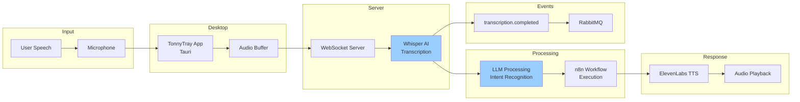
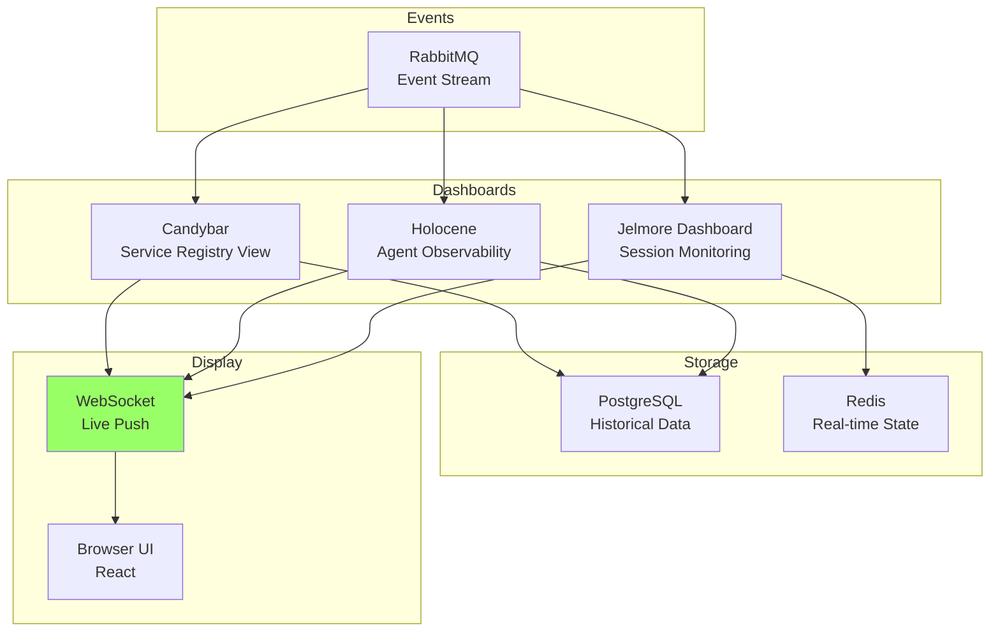

# Dashboards & Voice Domain - Data Flows

## Voice Assistant Flow (HeyMa)

```mermaid
flowchart LR
    subgraph Input
        Mic[Microphone]
        User[User Speech]
    end

    subgraph Desktop
        Tray[TonnyTray App<br/>Tauri]
        Audio[Audio Buffer]
    end

    subgraph Server
        WS[WebSocket Server]
        Whisper[Whisper AI<br/>Transcription]
    end

    subgraph Processing
        LLM[LLM Processing<br/>Intent Recognition]
        Workflow[n8n Workflow<br/>Execution]
    end

    subgraph Events
        TranscriptEvent[transcription.completed]
        RMQ[RabbitMQ]
    end

    subgraph Response
        TTS[ElevenLabs TTS]
        Speaker[Audio Playback]
    end

    User --> Mic
    Mic --> Tray
    Tray --> Audio
    Audio --> WS
    WS --> Whisper

    Whisper --> TranscriptEvent
    TranscriptEvent --> RMQ

    Whisper --> LLM
    LLM --> Workflow
    Workflow --> TTS
    TTS --> Speaker

    style Whisper fill:#9cf
    style LLM fill:#9cf
```

## Dashboard Real-Time Updates (Candybar, Holocene, Jelmore)

```mermaid
flowchart TB
    subgraph Events
        RMQ[RabbitMQ<br/>Event Stream]
    end

    subgraph Dashboards
        Candybar[Candybar<br/>Service Registry View]
        Holocene[Holocene<br/>Agent Observability]
        JelmoreDash[Jelmore Dashboard<br/>Session Monitoring]
    end

    subgraph Storage
        Postgres[PostgreSQL<br/>Historical Data]
        Redis[Redis<br/>Real-time State]
    end

    subgraph Display
        WebSocket[WebSocket<br/>Live Push]
        Browser[Browser UI<br/>React]
    end

    RMQ --> Candybar
    RMQ --> Holocene
    RMQ --> JelmoreDash

    Candybar --> Postgres
    Holocene --> Postgres
    JelmoreDash --> Redis

    Candybar --> WebSocket
    Holocene --> WebSocket
    JelmoreDash --> WebSocket

    WebSocket --> Browser

    style WebSocket fill:#9f6
```

---
**Version**: 1.0.0 | **Updated**: 2026-01-29
