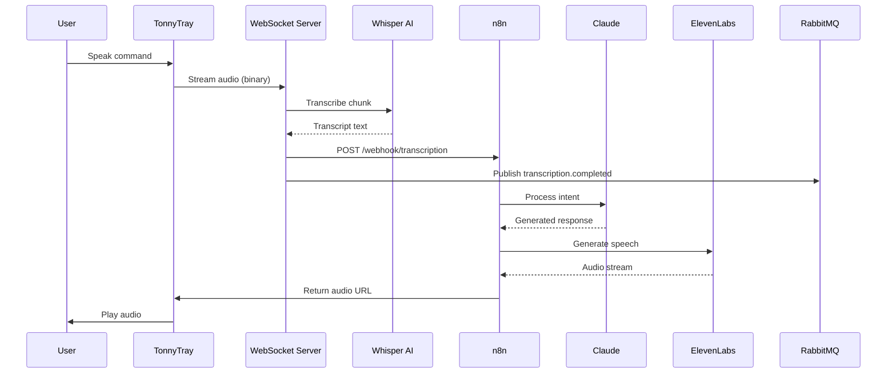
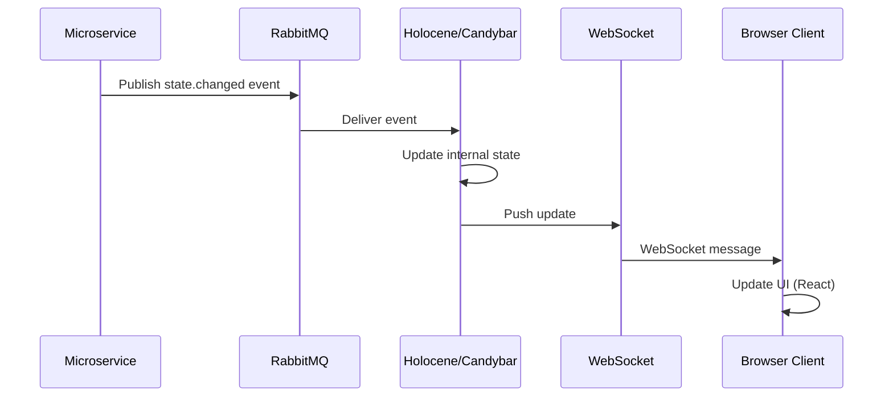

# Dashboards & Voice Domain - Sequences

## Voice Command Sequence

```mermaid
sequenceDiagram
    participant User
    participant Tray as TonnyTray
    participant WS as WebSocket Server
    participant Whisper as Whisper AI
    participant N8N as n8n
    participant LLM as Claude
    participant TTS as ElevenLabs
    participant RMQ as RabbitMQ

    User->>Tray: Speak command
    Tray->>WS: Stream audio (binary)
    WS->>Whisper: Transcribe chunk
    Whisper-->>WS: Transcript text

    WS->>N8N: POST /webhook/transcription
    WS->>RMQ: Publish transcription.completed

    N8N->>LLM: Process intent
    LLM-->>N8N: Generated response

    N8N->>TTS: Generate speech
    TTS-->>N8N: Audio stream
    N8N->>Tray: Return audio URL
    Tray->>User: Play audio
```

## Dashboard Real-Time Update Sequence

```mermaid
sequenceDiagram
    participant Service as Microservice
    participant RMQ as RabbitMQ
    participant Dashboard as Holocene/Candybar
    participant WS as WebSocket
    participant Browser as Browser Client

    Service->>RMQ: Publish state.changed event
    RMQ->>Dashboard: Deliver event
    Dashboard->>Dashboard: Update internal state
    Dashboard->>WS: Push update
    WS->>Browser: WebSocket message
    Browser->>Browser: Update UI (React)
```

---
**Version**: 1.0.0 | **Updated**: 2026-01-29
