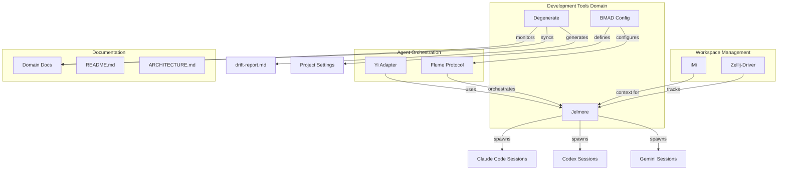
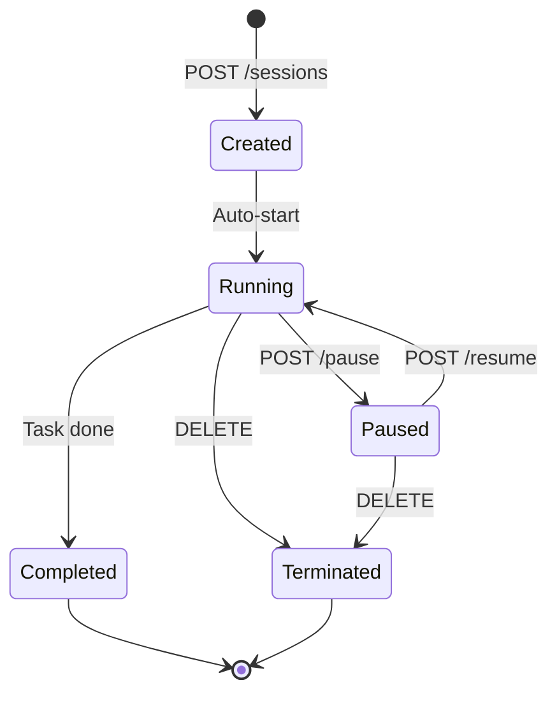
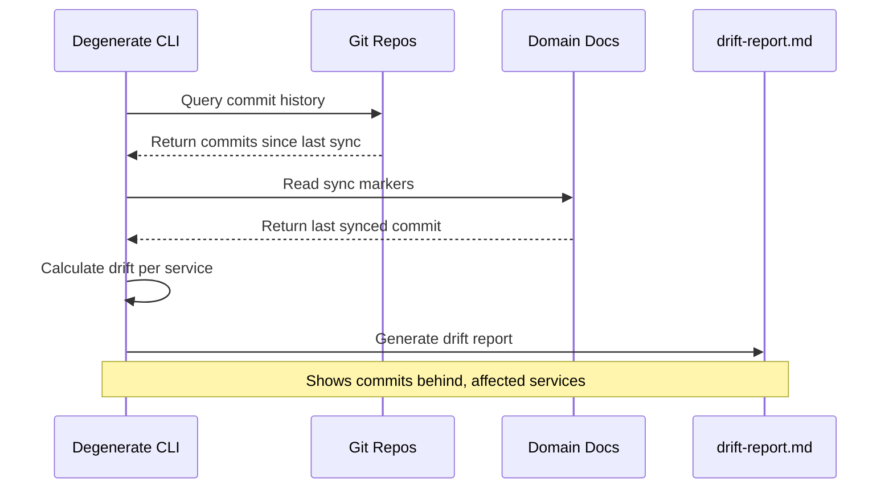
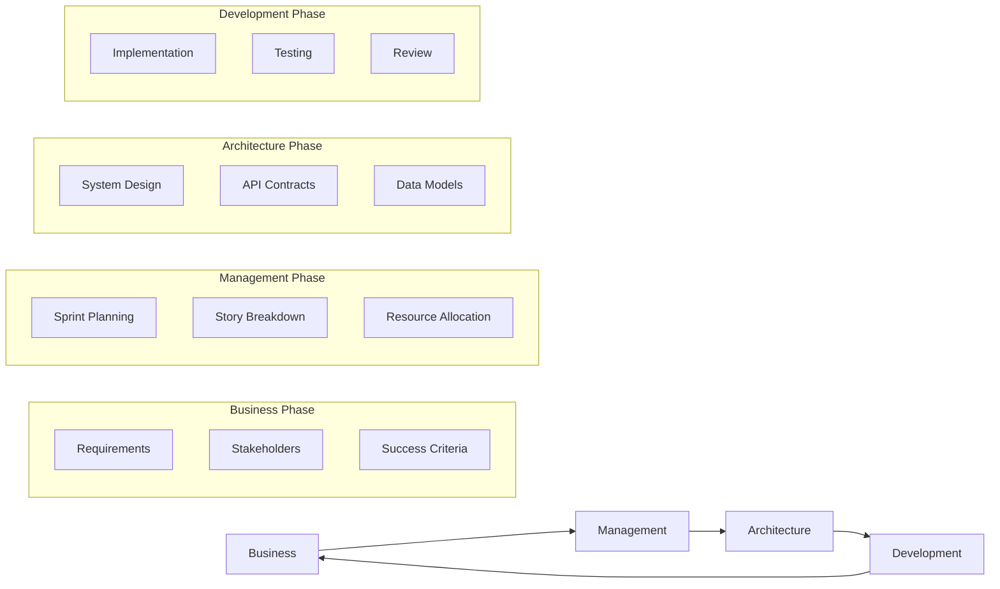

# Domain: Development Tools

> The meta-layer. Tools that support the development workflow itself.

## Services

| Service | Role | Tech Stack | Status |
|---------|------|------------|--------|
| **Jelmore** | Session manager for AI coding assistants (Claude Code, Codex, Gemini, etc.) | FastAPI, Docker, Python 3.11+ | Active |
| **Degenerate** | Documentation sync and drift detection CLI | Rust, Tokio, git2 | Active |
| **BMAD** | Methodology enforcement and orchestration configuration | YAML config, Agent overrides | Active |

## High-Level Purpose

This domain contains meta-tools that support the 33GOD development workflow. Jelmore manages long-lived AI coding sessions programmatically, enabling agents to spawn and control other coding assistants. Degenerate tracks documentation state across the ecosystem, detecting when code changes have drifted from documentation. BMAD enforces the Business, Management, Architecture, Development methodology across all projects.

**Why this domain matters**: As 33GOD scales to dozens of microservices with multiple AI agents working concurrently, keeping documentation in sync and managing coding sessions programmatically becomes critical. This domain provides the tooling layer that makes multi-agent development sustainable.

## Key Contracts

- **Jelmore Session API**: REST endpoints for session lifecycle management
- **Degenerate Sync Markers**: `<!-- degenerate:sync-marker -->` in domain docs for tracking
- **BMAD Config Schema**: `bmad/config.yaml` defines project-level methodology settings

## Interconnections



## When to Include This Context

Pass this domain when the user's prompt involves:

- **AI Coding Sessions**: "start a Claude session", "manage coding agents", "spawn Codex", "AI assistant sessions", "programmatic Claude control"
- **Documentation Sync**: "docs out of sync", "documentation drift", "update domain docs", "sync documentation", "check for drift"
- **Methodology**: "BMAD workflow", "project configuration", "sprint setup", "story points", "methodology enforcement"
- **Development Workflow**: "how do agents code", "multi-agent development", "coding session management"
- **Meta-Tools**: "development infrastructure", "tooling for development", "documentation maintenance"

## Component Deep Dives

---

### Jelmore: AI Session Manager

**Purpose**: Provides a unified interface for managing long-lived AI coding sessions across multiple providers (Claude Code, Codex, Gemini, Auggie, CoPilot, OpenCode).

**Key Capabilities**:
- Create, pause, resume, and terminate AI coding sessions
- Programmatic control via REST API
- Session state persistence
- Multi-provider support with unified interface
- Docker-based isolation for each session

#### API Reference

| Endpoint | Method | Description |
|----------|--------|-------------|
| `/sessions` | GET | List all active sessions |
| `/sessions` | POST | Create new coding session |
| `/sessions/{id}` | GET | Get session details |
| `/sessions/{id}` | DELETE | Terminate session |
| `/sessions/{id}/pause` | POST | Pause session |
| `/sessions/{id}/resume` | POST | Resume session |
| `/sessions/{id}/command` | POST | Send command to session |
| `/health` | GET | Service health check |

#### Session Lifecycle



#### Configuration

**Environment Variables**:
| Variable | Description | Default |
|----------|-------------|---------|
| `JELMORE_PORT` | API server port | 8000 |
| `JELMORE_HOST` | Bind address | 0.0.0.0 |
| `CLAUDE_API_KEY` | Claude API credentials | (required) |
| `OPENAI_API_KEY` | OpenAI/Codex credentials | (optional) |
| `GEMINI_API_KEY` | Google Gemini credentials | (optional) |
| `SESSION_TIMEOUT` | Session idle timeout (seconds) | 3600 |
| `MAX_CONCURRENT_SESSIONS` | Maximum parallel sessions | 10 |

#### Session Management Patterns

**Pattern 1: Single Agent Session**
```python
# Agent spawns a dedicated coding session
response = requests.post("http://jelmore:8000/sessions", json={
    "provider": "claude",
    "project_path": "/path/to/project",
    "agent_id": "feature-agent-001",
    "task": "Implement user authentication"
})
session_id = response.json()["session_id"]
```

**Pattern 2: Parallel Feature Development**
```python
# Multiple agents working on different features
sessions = []
for feature in ["auth", "payments", "notifications"]:
    resp = requests.post("http://jelmore:8000/sessions", json={
        "provider": "claude",
        "project_path": f"/worktrees/feat-{feature}",
        "agent_id": f"feature-agent-{feature}"
    })
    sessions.append(resp.json()["session_id"])
```

**Pattern 3: Session Handoff**
```python
# Pause one agent's session, let another take over
requests.post(f"http://jelmore:8000/sessions/{session_id}/pause")
# ... agent context switch ...
requests.post(f"http://jelmore:8000/sessions/{session_id}/resume", json={
    "new_agent_id": "review-agent-001"
})
```

#### Integration with Yi/Flume

Jelmore integrates with the agent orchestration layer:
- **Yi adapters** use Jelmore to spawn coding sessions for agents
- **Flume protocol** orchestrates session lifecycle across multi-agent workflows
- Sessions emit events to **Bloodbank** for observability

---

### Degenerate: Documentation Drift Detection

**Purpose**: Rust CLI that tracks documentation state across the 33GOD ecosystem, detecting when code changes have drifted from documentation.

**Key Capabilities**:
- Monitor git commits across all component repositories
- Detect documentation drift per domain
- Generate drift reports with commit details
- Sync documentation with current code state
- Domain-level organization and tracking

#### CLI Reference

| Command | Description | Example |
|---------|-------------|---------|
| `degenerate sync` | Sync all domain docs with code state | `mise run docs:sync` |
| `degenerate sync --dry-run` | Preview sync without changes | `mise run docs:sync:dry` |
| `degenerate drift` | Check for documentation drift | `mise run docs:drift` |
| `degenerate drift --show-commits` | Show drift with commit details | `mise run drift` |
| `degenerate domains` | List all domains and services | `mise run docs:domains` |
| `degenerate domains --verbose` | Detailed domain information | - |
| `degenerate report` | Generate drift report to file | `mise run docs:report` |
| `degenerate service <name>` | Show specific service status | `mise run docs:service holyfields` |

#### Drift Detection Flow



#### Sync Markers

Domain documents include sync markers that Degenerate uses to track state:

```markdown
## Last Sync

<!-- degenerate:sync-marker -->
Commit: 7a3f2b1
Date: 2026-01-29T10:00:00Z
```

When `degenerate sync` runs, it updates these markers with the latest commit.

#### Configuration

Degenerate uses the repository structure to discover domains:
- Domains defined in `docs/domains/*.md`
- Services mapped via the `services/registry.yaml`
- Submodule paths define component locations

**mise.toml integration**:
```toml
[tasks."docs:sync"]
description = "Sync all domain documentation with current code state"
run = "cargo run --manifest-path degenerate/Cargo.toml -- sync"

[tasks."docs:drift"]
description = "Check for documentation drift"
run = "cargo run --manifest-path degenerate/Cargo.toml -- drift --show-commits"
```

#### Drift Report Format

The generated report (`docs/sync/drift-report.md`) includes:
- Total domains and drift status
- Per-domain commit counts behind
- Service-level drift details
- Actual commit messages causing drift

---

### BMAD: Methodology & Orchestration

**Purpose**: Enforces the Business, Management, Architecture, Development methodology across the 33GOD ecosystem through configuration and agent overrides.

**Key Capabilities**:
- Project-level methodology configuration
- Sprint and story point management
- Agent behavior overrides
- Output folder standardization
- Document template customization

#### Configuration Schema

**bmad/config.yaml**:
```yaml
# BMAD Method v6 - Project Configuration
bmad_version: "6.0.0"

# Project Information
project_name: "33god-service-registry"
project_type: "api"  # web-app, mobile-app, api, game, library, other
project_level: 2     # 0-4 complexity scale

# Output Configuration
output_folder: "docs"
stories_folder: "docs/stories"

# Language Settings
communication_language: "English"
document_output_language: "English"

# Optional: Override agent behaviors
# agent_overrides_folder: "bmad/agent-overrides"

# Optional: Custom templates
# template_overrides:
#   prd: "bmad/templates/custom-prd.md"
#   tech_spec: "bmad/templates/custom-tech-spec.md"

# Sprint Configuration (optional)
# sprint_duration_days: 14
# story_point_scale: "fibonacci"  # fibonacci, linear, t-shirt
# velocity_target: 20
```

#### Project Levels

| Level | Description | Typical Services |
|-------|-------------|------------------|
| 0 | Trivial | Single-file scripts, utilities |
| 1 | Simple | Small CLIs, single-purpose services |
| 2 | Moderate | Standard microservices, APIs |
| 3 | Complex | Multi-component systems, integrations |
| 4 | Enterprise | Platform-level, multi-team coordination |

#### BMAD Workflow Phases



#### Agent Overrides

Custom agent behaviors can be defined in `bmad/agent-overrides/`:

```yaml
# bmad/agent-overrides/coder.yaml
name: "33GOD Coder"
extends: "base-coder"
rules:
  - "Always emit events to Bloodbank for state changes"
  - "Use iMi for worktree management"
  - "Follow Holyfields schema definitions"
  - "Document drift-prone changes"
```

#### DevLog Structure

BMAD maintains a development log in `bmad/devlog/tasks/`:

```
bmad/
  devlog/
    tasks/
      202601282205-task.md   # Timestamped task files
      202601290904-task.md
```

Task files capture high-level directives and cross-component alignment work.

---

## Common Workflows

### Workflow 1: Sprint Documentation Sync

Run at the end of each sprint to ensure documentation is current:

```bash
# 1. Check drift status
mise run docs:drift

# 2. Review drift report
cat docs/sync/drift-report.md

# 3. Sync documentation
mise run docs:sync

# 4. Verify sync completed
mise run docs:drift  # Should show 0 drift
```

### Workflow 2: New Service Documentation

When adding a new service:

```bash
# 1. Determine which domain the service belongs to
mise run docs:domains

# 2. Update the appropriate domain doc
# Add service to the services table
# Add to interconnections diagram
# Add key files section

# 3. Run sync to update markers
mise run docs:sync
```

### Workflow 3: Multi-Agent Coding Session

Orchestrating parallel development with Jelmore:

```python
import requests
import asyncio

JELMORE_URL = "http://jelmore:8000"

async def spawn_feature_team(features: list[str]):
    """Spawn parallel coding sessions for multiple features."""
    sessions = {}

    for feature in features:
        response = requests.post(f"{JELMORE_URL}/sessions", json={
            "provider": "claude",
            "project_path": f"/worktrees/feat-{feature}",
            "agent_id": f"feature-agent-{feature}",
            "task": f"Implement {feature} feature per spec"
        })
        sessions[feature] = response.json()["session_id"]

    return sessions

async def monitor_sessions(sessions: dict):
    """Monitor session progress."""
    while True:
        for feature, session_id in sessions.items():
            status = requests.get(f"{JELMORE_URL}/sessions/{session_id}").json()
            print(f"{feature}: {status['state']}")

            if status['state'] == 'completed':
                # Emit completion event to Bloodbank
                emit_event("feature.session.completed", {
                    "feature": feature,
                    "session_id": session_id
                })

        await asyncio.sleep(30)
```

### Workflow 4: BMAD Project Setup

Initialize a new project with BMAD methodology:

```bash
# 1. Create BMAD config
cat > bmad/config.yaml << 'EOF'
bmad_version: "6.0.0"
project_name: "new-service"
project_type: "api"
project_level: 2
output_folder: "docs"
stories_folder: "docs/stories"
communication_language: "English"
document_output_language: "English"
EOF

# 2. Create initial task
mkdir -p bmad/devlog/tasks
echo "# TASK\n\nInitial project setup..." > bmad/devlog/tasks/$(date +%Y%m%d%H%M)-task.md

# 3. Create stories folder
mkdir -p docs/stories
```

---

## Integration Points with Other Domains

### Event Infrastructure
- **Jelmore** emits session lifecycle events to Bloodbank
- **Degenerate** can trigger sync events when drift exceeds threshold
- Events: `session.started`, `session.completed`, `documentation.drift.detected`

### Workspace Management
- **Jelmore** sessions operate within iMi-managed worktrees
- **Zellij-Driver** tracks context for Jelmore sessions
- Session paths follow iMi conventions (`trunk-main`, `feat-*`)

### Agent Orchestration
- **Yi adapters** use Jelmore for spawning coding sessions
- **Flume protocol** orchestrates session lifecycle
- **BMAD** defines agent behavior overrides for Flume

### Meeting & Collaboration
- **TheBoard** may trigger Jelmore sessions for implementation
- Post-meeting action items can spawn coding sessions
- Decision events can update BMAD configuration

---

## Troubleshooting Guide

### Jelmore Issues

| Issue | Cause | Solution |
|-------|-------|----------|
| Session fails to start | Missing API key | Check `CLAUDE_API_KEY` env var |
| Session hangs | Network timeout | Check Docker network, increase timeout |
| Max sessions reached | Concurrent limit | Wait for sessions to complete or increase `MAX_CONCURRENT_SESSIONS` |
| Session state lost | Container restart | Enable persistent volume for session state |

**Debug Commands**:
```bash
# Check Jelmore health
curl http://localhost:8000/health

# List active sessions
curl http://localhost:8000/sessions

# View session logs
docker logs jelmore-session-{id}
```

### Degenerate Issues

| Issue | Cause | Solution |
|-------|-------|----------|
| "No submodules found" | Submodules not initialized | Run `git submodule update --init --recursive` |
| Drift shows wrong commits | Stale sync marker | Run `mise run docs:sync` to reset |
| Report generation fails | Missing docs/sync directory | Create `mkdir -p docs/sync` |
| Service not found | Service not in registry | Add to `services/registry.yaml` |

**Debug Commands**:
```bash
# Check degenerate version
cargo run --manifest-path degenerate/Cargo.toml -- --version

# Verbose domain list
mise run docs:domains --verbose

# Check specific service
mise run docs:service bloodbank
```

### BMAD Issues

| Issue | Cause | Solution |
|-------|-------|----------|
| Config not loading | Invalid YAML | Validate with `yq` or online YAML validator |
| Agent overrides ignored | Wrong path | Check `agent_overrides_folder` setting |
| Stories not generated | Missing folder | Create `docs/stories/` directory |

---

## Technical Quick Reference

| Service | Port | Key Commands | Health |
|---------|------|--------------|--------|
| Jelmore | 8000 | REST API | `/health` |
| Degenerate | CLI | `mise run docs:*` | N/A |
| BMAD | Config | `cat bmad/config.yaml` | N/A |

## Key Files

- `jelmore/trunk-main/` - Session manager implementation
- `degenerate/trunk-main/` - Drift detection CLI
- `bmad/config.yaml` - BMAD methodology configuration
- `bmad/devlog/tasks/` - Development task logs
- `mise.toml` - Mise task definitions for Degenerate
- `docs/sync/drift-report.md` - Generated drift report

## Last Sync

<!-- degenerate:sync-marker -->
Commit: (pending initial sync)
Date: (pending initial sync)
