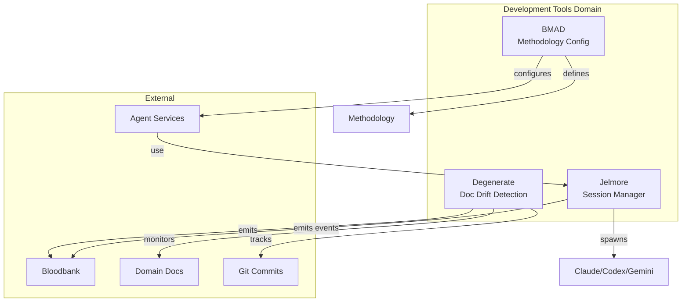
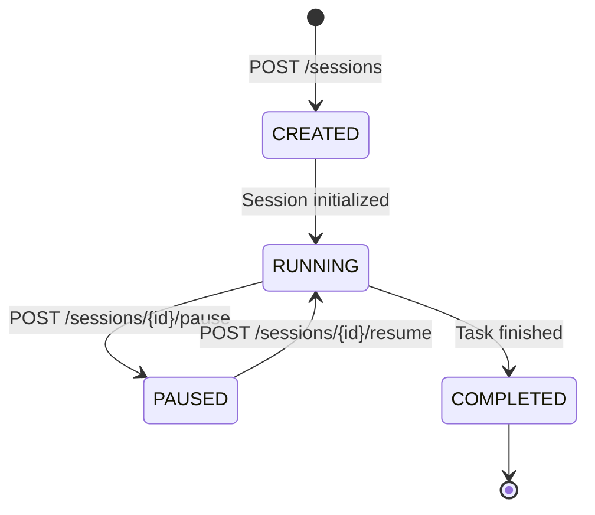

# Development Tools Domain - GOD Document

> **Guaranteed Organizational Document** - Developer-facing reference for the Development Tools domain
>
> **Last Updated**: 2026-02-18
> **Components**: 3

---

## Domain Overview

The Development Tools domain contains **meta-tools that support the 33GOD development workflow**. Jelmore manages AI coding sessions programmatically, Degenerate tracks documentation drift, and BMAD enforces development methodology.

**Core Responsibility**: Enable multi-agent development workflows through session management, documentation tracking, and methodology enforcement.

**Architectural Philosophy**: "Tools That Build Tools"

---

## Component Map



---

## Components

### Jelmore

**Purpose**: Programmatic session manager for AI coding assistants (Claude Code, Codex, Gemini, etc.)

**Type**: API / Session Manager
**Status**: **Retired** (as of 2026-02-13)

**Key Events:**
- **Emits**: `jelmore.session.started`, `jelmore.session.completed`, `jelmore.session.paused`
- **Consumes**: `agent.session.requested`

**Interfaces:**
- REST API: `http://localhost:8000`
- Docker: Isolated sessions per coding assistant
- CLI: `jelmore start --assistant claude-code --task "..."`

[📄 Component GOD Doc](../../jelmore/GOD.md)

---

### Degenerate

**Purpose**: Documentation sync and drift detection CLI that tracks when code changes outpace documentation updates

**Type**: CLI / Drift Detector
**Status**: Active

**Key Events:**
- **Emits**: `degenerate.drift.detected`, `degenerate.sync.completed`
- **Consumes**: `git.commit.created` (monitor for doc-related commits)

**Interfaces:**
- CLI: `degenerate check`, `degenerate sync`
- Sync Markers: `<!-- degenerate:sync-marker -->` in docs

[📄 Component GOD Doc](../../degenerate/GOD.md) _(To be created)_

---

### BMAD

**Purpose**: Business, Management, Architecture, Development methodology configuration and enforcement

**Type**: Configuration / Methodology
**Status**: Production

**Key Events:**
- **Emits**: None (static configuration)
- **Consumes**: None

**Interfaces:**
- YAML Config: `bmad/config.yaml`
- Agent Overrides: Per-agent methodology customization

[📄 Component GOD Doc](../../bmad/GOD.md) _(To be created)_

---

## Domain Event Contracts

### Cross-Component Events

Events that flow between components within this domain:

| Event | Producer | Consumer(s) | Purpose |
|-------|----------|-------------|---------|
| `jelmore.session.started` | Jelmore | Degenerate | Track session for doc sync |
| `degenerate.drift.detected` | Degenerate | Jelmore | Alert agents to doc drift |

### External Event Interfaces

Events exchanged with other domains:

| Event | Direction | External Domain | Purpose |
|-------|-----------|-----------------|---------|
| `agent.session.requested` | Inbound | Agent Orchestration | Spawn coding session for agent |
| `worktree.claimed` | Inbound | Workspace Management | Associate session with worktree |
| `jelmore.session.*` | Outbound | Infrastructure | Track session lifecycle |
| `degenerate.drift.*` | Outbound | Infrastructure | Alert system to documentation drift |

---

## Jelmore Session Management

### Session Lifecycle



### Supported Coding Assistants

| Assistant | CLI Flag | Docker Image | Status |
|-----------|----------|--------------|--------|
| Claude Code | `--assistant claude-code` | `anthropic/claude-code:latest` | Active |
| GitHub Copilot Workspace | `--assistant copilot` | `github/copilot-workspace:latest` | Active |
| Codex | `--assistant codex` | `openai/codex:latest` | Development |
| Gemini Code Assist | `--assistant gemini` | `google/gemini-code:latest` | Development |
| Auggie | `--assistant auggie` | `auggie/auggie:latest` | Planning |
| OpenCode | `--assistant opencode` | `opencode/opencode:latest` | Planning |

### API Reference

```bash
# Create session
POST /sessions
{
  "assistant_type": "claude-code",
  "worktree_path": "/path/to/worktree",
  "task": "Implement user authentication",
  "agent_id": "yi-agent-001"
}

# List sessions
GET /sessions

# Get session status
GET /sessions/{id}

# Pause session
POST /sessions/{id}/pause

# Resume session
POST /sessions/{id}/resume

# Terminate session
DELETE /sessions/{id}
```

---

## Degenerate Drift Detection

### How It Works

1. **Sync Markers**: Docs include `<!-- degenerate:sync-marker -->` with commit hash and date
2. **Git Monitoring**: Degenerate watches for commits that change code without updating docs
3. **Drift Detection**: Compares commit hash in sync marker vs. latest commit
4. **Alerts**: Emits `degenerate.drift.detected` event when drift exceeds threshold

### Example Sync Marker

```markdown
<!-- degenerate:sync-marker -->
Commit: abc123def456
Date: 2026-02-01
<!-- /degenerate:sync-marker -->
```

### CLI Usage

```bash
# Check for drift across all domains
degenerate check

# Sync specific domain doc
degenerate sync docs/domains/infrastructure.md

# Set drift threshold (days)
degenerate config --threshold 7
```

---

## BMAD Methodology

### Configuration Structure

```yaml
# bmad/config.yaml
project_name: "33GOD"
methodology: "BMAD"

phases:
  business:
    focus: "Problem definition, user needs"
    artifacts: ["PRD", "User Stories"]

  management:
    focus: "Sprint planning, task breakdown"
    artifacts: ["Sprint Plan", "Task Board"]

  architecture:
    focus: "System design, technical spec"
    artifacts: ["Architecture Doc", "Tech Spec"]

  development:
    focus: "Implementation, testing"
    artifacts: ["Code", "Tests", "Documentation"]

agent_overrides:
  yi-agent-001:
    skip_phases: ["business"]  # Skip for coding-only agents
    enforce_tests: true
```

### Phase Enforcement

Agents check BMAD config to determine required phases:

```python
# Agent checks BMAD config before starting work
bmad = load_bmad_config()
required_phases = bmad.get_required_phases(agent_id="yi-agent-001")

for phase in required_phases:
    await execute_phase(phase)
```

---

## Shared Infrastructure

### Jelmore Docker Network

All coding sessions run on isolated Docker network:

```yaml
# docker-compose.yml
services:
  jelmore-session-001:
    image: anthropic/claude-code:latest
    networks:
      - jelmore-net
    volumes:
      - /path/to/worktree:/workspace
```

### Degenerate State Tracking

```json
// .degenerate/state.json
{
  "docs": {
    "docs/domains/infrastructure.md": {
      "last_sync_commit": "abc123",
      "last_sync_date": "2026-02-01",
      "drift_days": 0
    }
  }
}
```

---

## Development Guidelines

### Starting a Coding Session Programmatically

```python
import requests

# Agent requests coding session via Jelmore
response = requests.post("http://localhost:8000/sessions", json={
    "assistant_type": "claude-code",
    "worktree_path": "/home/user/33GOD/feat-auth",
    "task": "Implement JWT middleware",
    "agent_id": "yi-agent-001"
})

session_id = response.json()["session_id"]

# Monitor session progress
status = requests.get(f"http://localhost:8000/sessions/{session_id}")
print(status.json())
```

### Adding Sync Markers to Documentation

```markdown
# My Domain Doc

<!-- degenerate:sync-marker -->
Commit: $(git rev-parse HEAD)
Date: $(date -I)
<!-- /degenerate:sync-marker -->

... rest of documentation ...
```

### Configuring BMAD for a New Project

```bash
# Initialize BMAD config
bmad init --project "NewProject"

# Edit config
vim bmad/config.yaml

# Validate config
bmad validate
```

---

## References

- **System Doc**: `../../GOD.md`
- **Source Domain Docs**: `development-tools.md`
- **Jelmore API**: `http://localhost:8000/docs`
- **BMAD Config**: `../../bmad/config.yaml`
