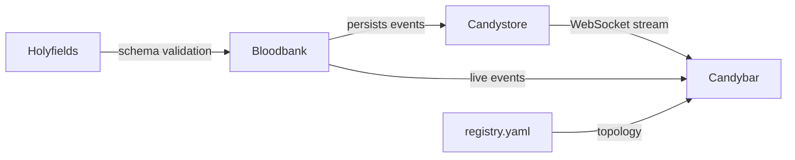

# Domain: Event Infrastructure

> The central nervous system. All state changes flow through here.

## Services

| Service | Role | Tech Stack | Status |
|---------|------|------------|--------|
| **Bloodbank** | Event bus (RabbitMQ topic exchange) | Python 3.11+, FastAPI, aio-pika, FastStream | Active |
| **Holyfields** | Schema registry, cross-language type generation | TypeScript, JSON Schema, Zod, Pydantic codegen | Active |
| **Candystore** | Event persistence layer | Python 3.12+, FastAPI, SQLAlchemy 2.0, PostgreSQL | Active |
| **Candybar** | Service registry visualization, real-time event dashboard | React 19, Vite, Tauri, Socket.io | Active |

## High-Level Purpose

This domain owns the event-driven backbone of 33GOD. Every significant state change (git commits, meeting events, agent thoughts, transcript arrivals) flows through Bloodbank as a typed event. Holyfields defines the canonical schemas. Candystore persists for audit/replay. Candybar visualizes topology and live event streams.

## Key Contracts

- **EventEnvelope**: Defined in Holyfields, validated by Bloodbank
- **Topic Exchange**: `bloodbank.events.v1` with routing key patterns
- **Service Registry**: `services/registry.yaml` defines all consumers/producers

## Interconnections

## When to Include This Context

Pass this domain when:
- Adding or modifying event types
- Debugging event routing or dead-letter queues
- Working on observability, tracing, or event replay
- Changing schema definitions or adding new languages to codegen

## Technical Quick Reference

| Service | Port | Docs | Health |
|---------|------|------|--------|
| Bloodbank | 8682 | /docs | /health |
| Candystore | 8080 | /docs | /health |
| Candybar | (Tauri desktop) | N/A | N/A |

## Key Files

- `/home/delorenj/code/33GOD/bloodbank/trunk-main/` - Event bus implementation
- `/home/delorenj/code/33GOD/holyfields/trunk-main/` - Schema definitions
- `/home/delorenj/code/33GOD/candystore/trunk-main/` - Persistence layer
- `/home/delorenj/code/33GOD/candybar/trunk-main/` - Visualization dashboard
- `/home/delorenj/code/33GOD/services/registry.yaml` - Service topology

## Last Sync

<!-- degenerate:sync-marker -->
Commit: (pending initial sync)
Date: (pending initial sync)
