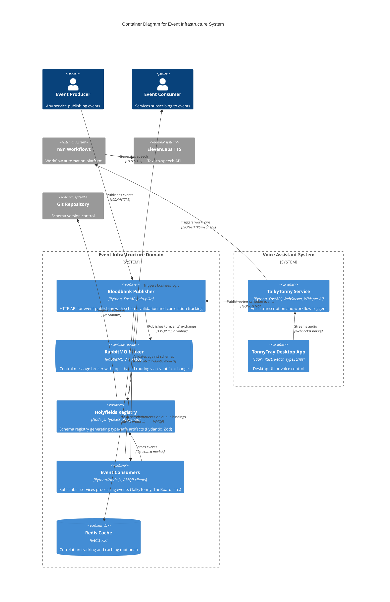

# C4 Container Level: Event Infrastructure System Deployment

## Containers

### RabbitMQ Event Broker
- **Name**: RabbitMQ Event Broker
- **Description**: Central message broker providing topic-based event routing with durable exchanges
- **Type**: Message Queue / Event Broker
- **Technology**: RabbitMQ 3.x (AMQP 0.9.1)
- **Deployment**: Docker container (via docker-compose), can scale horizontally

#### Purpose
Provides the core message routing infrastructure for the 33GOD event-driven architecture. Hosts a single durable topic exchange (`events`) that enables flexible publish-subscribe patterns using routing keys. All event producers publish to this exchange, and all consumers bind queues with routing key patterns to receive relevant events.

#### Components
This container deploys the following infrastructure:
- **Topic Exchange**: Single `events` exchange with topic routing
- **Queue Management**: Auto-created consumer queues with custom bindings
- **Persistence**: Durable messages and queues for reliability

#### Interfaces

##### AMQP Protocol Interface
- **Protocol**: AMQP 0.9.1
- **Description**: Standard AMQP broker interface for publishers and consumers
- **Endpoints**:
  - `amqp://rabbitmq:5672` - AMQP connection endpoint (internal)
  - `amqps://events.delo.sh:5671` - Secure AMQP endpoint (production)
  - Management UI: `http://rabbitmq:15672` (admin interface)
- **Exchange Configuration**:
  - Exchange name: `events`
  - Exchange type: `topic`
  - Durable: `true`
  - Routing pattern: `<component>.<entity>.<action>` (e.g., `theboard.meeting.created`)

#### Dependencies

##### External Systems
- None (standalone broker)

#### Infrastructure
- **Deployment Config**: Standard RabbitMQ Docker image with management plugin
- **Scaling**: Horizontal scaling via clustering (planned)
- **Resources**:
  - CPU: 1-2 cores
  - Memory: 512MB-2GB (depends on message volume)
  - Storage: Persistent volume for message durability
- **High Availability**: Single instance (HA clustering planned)

---

### Holyfields Schema Registry
- **Name**: Holyfields Schema Registry
- **Description**: Event schema registry and contract validation system generating language-specific type-safe artifacts
- **Type**: Schema Registry / Build-time Tool
- **Technology**: Node.js 20+, TypeScript, Python (Bun runtime, uv package manager)
- **Deployment**: Build-time artifact generation, schemas distributed via git repository

#### Purpose
Provides a single source of truth for event schemas shared across 33GOD microservices. Auto-generates language-specific type-safe artifacts (Python Pydantic models, TypeScript Zod schemas) from JSON Schema definitions. Enables independent component development with guaranteed schema compatibility through contract validation. Catches schema mismatches at build time rather than runtime.

#### Components
This container deploys the following components:
- **Schema Definitions**: JSON Schema (Draft 2020-12) event contracts
  - `common/schemas/`: Shared base types and enums
  - `theboard/events/`: TheBoard meeting orchestration events (7 events)
  - `theboardroom/events/`: TheBoardroom visualization consumer events
- **Code Generators**:
  - Python generator using datamodel-code-generator
  - TypeScript generator using json-schema-to-zod
- **Validators**: jsonschema (Python), ajv (TypeScript)
- **Contract Tests**: pytest (Python), vitest (TypeScript)

#### Interfaces

##### Generated Artifact Distribution
- **Protocol**: Git repository / Package distribution
- **Description**: Generated Python and TypeScript artifacts distributed via repository
- **Artifacts**:
  - `generated/python/` - Pydantic models for Python services
  - `generated/typescript/` - Zod schemas + TypeScript types for TS/JS services
- **Import Examples**:
  ```python
  # Python import
  from generated.python.theboard.events import MeetingCreatedEvent
  ```
  ```typescript
  // TypeScript import
  import { MeetingCreatedEventSchema } from './generated/typescript/theboard/events';
  ```

##### Schema Validation API
- **Protocol**: CLI / Build-time validation
- **Description**: Schema validation and code generation commands
- **Commands**:
  - `mise run validate:schemas` - Validate all JSON schemas
  - `mise run generate:all` - Generate Python + TypeScript artifacts
  - `mise run test:all` - Run contract validation tests
  - `mise run ci` - Full CI validation pipeline

##### OpenAPI Specification
See: [holyfields-schema-api.yaml](/home/delorenj/code/33GOD/docs/domains/event-infrastructure/holyfields-schema-api.yaml)

#### Dependencies

##### External Systems
- Git repository for version control and artifact distribution
- CI/CD pipeline (GitHub Actions) for automated validation and generation

#### Infrastructure
- **Deployment Config**: Build-time execution, no runtime deployment
- **Scaling**: Not applicable (build-time tool)
- **Resources**:
  - Build time: 5-30 seconds (depends on schema count)
  - Memory: 100-500MB during generation
- **Versioning**: Semantic versioning per component directory

---

### Bloodbank Publisher Service
- **Name**: Bloodbank Publisher Service
- **Description**: HTTP-based event publishing service with schema validation, correlation tracking, and RabbitMQ integration
- **Type**: Web Application / API Gateway
- **Technology**: Python 3.10+, FastAPI, aio-pika, Redis (optional correlation tracking)
- **Deployment**: Docker container, Python virtual environment (uv), or systemd service

#### Purpose
Provides an HTTP REST API for publishing events to the RabbitMQ broker. Wraps event payloads in standardized `EventEnvelope` format with metadata (timestamp, message ID, source). Validates events against Holyfields schemas, tracks correlation chains across distributed workflows, and publishes to RabbitMQ with persistent message delivery. Gracefully degrades if Redis correlation tracking is unavailable.

#### Components
This container deploys the following components:
- **HTTP API**: FastAPI REST endpoints for event publishing
- **RabbitMQ Publisher**: Async publisher with automatic reconnection
- **Schema Validator**: Runtime schema validation using Holyfields schemas
- **Correlation Tracker**: Redis-based correlation chain tracking
- **Event Envelope**: Standardized event wrapper with metadata

#### Interfaces

##### REST API for Event Publishing
- **Protocol**: HTTP/REST
- **Description**: RESTful API for publishing events from any HTTP client
- **Specification**: See [bloodbank-publisher-api.yaml](/home/delorenj/code/33GOD/docs/domains/event-infrastructure/bloodbank-publisher-api.yaml)
- **Base URL**: `http://localhost:8000` (local), `https://events.delo.sh` (production)
- **Endpoints**:
  - `POST /events/calendar` - Publish calendar event
  - `POST /events/{event_type}` - Generic event publishing endpoint
  - `GET /health` - Health check endpoint
  - `GET /correlation/{message_id}` - Get correlation chain for message
- **Authentication**: API key (planned), currently open
- **Content-Type**: `application/json`

##### RabbitMQ Publisher Interface
- **Protocol**: AMQP 0.9.1
- **Description**: Publishes events to RabbitMQ topic exchange
- **Configuration**:
  - Exchange: `events`
  - Routing key pattern: `{component}.{entity}.{action}`
  - Persistence: Durable messages
  - Delivery mode: Persistent (2)

##### Redis Correlation Interface
- **Protocol**: Redis Protocol
- **Description**: Stores and retrieves correlation chains for event tracing
- **Operations**:
  - `SET correlation:{message_id}` - Store correlation metadata
  - `GET correlation:{message_id}` - Retrieve correlation chain
  - `EXPIRE` - Auto-cleanup after 24 hours

##### OpenAPI Specification
See: [bloodbank-publisher-api.yaml](/home/delorenj/code/33GOD/docs/domains/event-infrastructure/bloodbank-publisher-api.yaml)

#### Dependencies

##### Containers Used
- **RabbitMQ Event Broker**: Publishes events via AMQP protocol
- **Holyfields Schema Registry**: Uses generated Pydantic models for validation

##### External Systems
- **Redis** (optional): Correlation tracking and caching

#### Infrastructure
- **Deployment Config**:
  - Docker: Standard Python 3.10 image
  - Python: uv-managed virtual environment (`.venv/`)
  - Entry point: `whisperlivekit/http.py`
- **Scaling**: Horizontal scaling (multiple publisher instances)
- **Resources**:
  - CPU: 0.5-1 core per instance
  - Memory: 100-200MB per instance
  - Network: Low latency to RabbitMQ
- **Configuration**: Environment variables via `.env`
  - `RABBITMQ_URL`: RabbitMQ connection string
  - `REDIS_URL`: Redis connection string (optional)

---

### Event Consumer Services (Subscriber Pattern)
- **Name**: Event Consumer Services
- **Description**: Pattern for event-driven microservices that subscribe to specific event types via RabbitMQ
- **Type**: Background Service / Event Handler
- **Technology**: Python 3.10+ (aio-pika), TypeScript/Node.js (amqplib), or any AMQP client
- **Deployment**: Multiple independent services, Docker containers or systemd services

#### Purpose
Provides a reusable pattern for building event-driven microservices that react to domain events. Consumers connect to RabbitMQ, declare a queue, bind it to the `events` exchange with routing key patterns, and process events asynchronously. Each consumer is independent and can scale independently. Examples include TalkyTonny voice assistant, TheBoard meeting orchestrator, TheBoardroom visualization service.

#### Components
This container pattern includes:
- **RabbitMQ Consumer**: Async consumer with auto-reconnection
- **Queue Management**: Auto-declared queues with custom binding keys
- **Event Handlers**: Business logic for processing events
- **Dead Letter Queue** (planned): For failed message handling

#### Interfaces

##### RabbitMQ Consumer Interface
- **Protocol**: AMQP 0.9.1
- **Description**: Subscribes to events via queue bindings
- **Configuration**:
  - Queue naming: `{service_name}_{routing_pattern}_queue`
  - Binding patterns:
    - Specific event: `theboard.meeting.created`
    - Wildcard: `theboard.meeting.*` (all meeting events)
    - All events: `#`
  - Acknowledgement: Manual ACK for reliability
  - Prefetch: 10 messages (configurable)

##### Event Processing Interface
- **Protocol**: In-process function calls
- **Description**: Application-specific event handlers
- **Pattern**:
  ```python
  async def on_event(message: dict):
      # Parse EventEnvelope
      # Validate against Holyfields schema
      # Execute business logic
      # ACK message
  ```

#### Dependencies

##### Containers Used
- **RabbitMQ Event Broker**: Consumes events via AMQP protocol
- **Holyfields Schema Registry**: Uses generated models for type-safe event parsing

##### External Systems
- Application-specific databases (PostgreSQL, SQLite, etc.)
- External APIs (ElevenLabs, n8n, etc.)

#### Infrastructure
- **Deployment Config**:
  - Docker: Custom application images
  - Entry point: Application-specific consumer script
  - Example: `subscriber_example.py` (Python template)
- **Scaling**: Horizontal scaling with competing consumers pattern
- **Resources**:
  - CPU: 0.5-2 cores per instance
  - Memory: 100-500MB per instance
  - Network: Low latency to RabbitMQ
- **Configuration**: Environment variables
  - `RABBITMQ_URL`: RabbitMQ connection string
  - `BINDING_KEY`: Routing key pattern for queue binding

---

### TalkyTonny Voice Assistant Service
- **Name**: TalkyTonny Voice Assistant Service
- **Description**: Voice-controlled AI assistant consuming speech-to-text events and producing workflow triggers
- **Type**: Event Consumer / Event Producer
- **Technology**: Python 3.10+ (FastAPI, WebSocket), Tauri/Rust desktop app, Whisper AI
- **Deployment**: Desktop application (Tauri), Docker container (WhisperLiveKit server)

#### Purpose
Provides real-time speech-to-text transcription and voice command processing. Consumes audio input via WebSocket, transcribes using Whisper AI, publishes transcription events to Bloodbank, and triggers n8n workflows. Acts as both event producer (transcription events) and consumer (workflow response events).

#### Components
This container deploys the following components:
- **WhisperLiveKit Server**: WebSocket server for real-time transcription (Python/FastAPI)
- **TonnyTray Desktop App**: System tray application for voice control (Tauri/Rust + React)
- **Audio Processor**: Real-time audio capture and processing
- **Whisper AI Integration**: faster-whisper for speech recognition
- **Event Publisher**: Publishes transcription events to Bloodbank

#### Interfaces

##### WebSocket Transcription Interface
- **Protocol**: WebSocket (RFC 6455)
- **Description**: Real-time audio streaming and transcription delivery
- **Endpoints**:
  - `ws://localhost:8888/asr` - WebSocket connection endpoint
  - `wss://whisper.delo.sh/asr` - Secure WebSocket (production)
- **Protocol**:
  - Client sends: Binary audio chunks (16kHz, 16-bit PCM)
  - Server sends: JSON transcription events
  ```json
  {
    "text": "transcribed text",
    "is_final": true,
    "timestamp": "2024-01-15T10:30:00Z"
  }
  ```

##### Event Publishing Interface
- **Protocol**: HTTP REST
- **Description**: Publishes transcription events to Bloodbank
- **Integration**: Calls Bloodbank Publisher API
- **Event Type**: `talkytonny.transcription.completed`

##### n8n Webhook Interface
- **Protocol**: HTTP POST
- **Description**: Triggers n8n workflows with transcription data
- **Endpoint**: `https://n8n.delo.sh/webhook/transcription`
- **Payload**: Transcription text and metadata

#### Dependencies

##### Containers Used
- **Bloodbank Publisher Service**: Publishes transcription events
- **RabbitMQ Event Broker**: Consumes workflow response events (planned)

##### External Systems
- **n8n Workflow Automation**: Workflow execution
- **ElevenLabs TTS**: Text-to-speech response generation
- **Whisper AI Models**: Speech recognition (local inference)

#### Infrastructure
- **Deployment Config**:
  - Desktop: Tauri application bundle (Linux, macOS planned, Windows planned)
  - Server: Docker container with Dockerfile.cpu
  - Entry point: `whisperlivekit/basic_server.py`
- **Scaling**: Single user (desktop), horizontal for server component
- **Resources**:
  - CPU: 2-4 cores (Whisper inference)
  - Memory: 500MB-2GB (model size dependent)
  - GPU: Optional (CUDA acceleration)
  - Storage: 1-5GB (model files)
- **Configuration**:
  - Desktop: `~/.config/tonnytray/config.json`
  - Server: Environment variables via docker-compose.yml

---

## Container Diagram



## Key Architecture Principles

### Technology Choices Rationale

1. **RabbitMQ for Event Routing**
   - Proven reliability and performance
   - Topic-based routing enables flexible pub/sub patterns
   - Native support for durable messages and queues
   - AMQP protocol widely supported across languages

2. **JSON Schema for Contract Definition**
   - Language-agnostic schema format
   - Strong tooling ecosystem for validation and code generation
   - Supports semantic versioning and evolution
   - Draft 2020-12 provides modern features ($defs, const, etc.)

3. **FastAPI for Publisher Service**
   - Async/await native support for high throughput
   - Automatic OpenAPI generation
   - Type safety via Pydantic models
   - Low latency HTTP endpoints

4. **Redis for Correlation Tracking**
   - Fast in-memory operations
   - Automatic expiration for cleanup
   - Optional dependency (graceful degradation)

5. **Tauri for Desktop Application**
   - Low memory footprint vs Electron
   - Native system integration (audio, tray)
   - Type-safe IPC (Rust ↔ TypeScript)
   - Cross-platform support

### Container Responsibility Distribution

1. **RabbitMQ Broker**: Pure message routing, no business logic
2. **Holyfields Registry**: Build-time contract validation, no runtime execution
3. **Bloodbank Publisher**: HTTP → AMQP gateway with validation
4. **Event Consumers**: Independent business logic execution
5. **TalkyTonny**: Voice transcription and workflow orchestration

### Communication Patterns

1. **Synchronous (HTTP)**:
   - Event publishing (Producer → Bloodbank)
   - Schema validation API (Bloodbank → Holyfields)
   - Webhook triggers (TalkyTonny → n8n)

2. **Asynchronous (AMQP)**:
   - Event distribution (Bloodbank → RabbitMQ → Consumers)
   - Decoupled microservices
   - Retry and dead-letter handling

3. **Real-time (WebSocket)**:
   - Audio streaming (TonnyTray → TalkyTonny)
   - Live transcription delivery

### Deployment Strategy

1. **Stateless Services**: Bloodbank, Consumers (horizontal scaling)
2. **Stateful Services**: RabbitMQ (clustering planned), Redis
3. **Build-time Tools**: Holyfields (no runtime deployment)
4. **Desktop Applications**: TonnyTray (single user)

### API Versioning Strategy

1. **Holyfields Schemas**: Semantic versioning per component
2. **Bloodbank REST API**: URL versioning (e.g., `/v1/events/`)
3. **RabbitMQ Routing Keys**: Includes version in pattern (e.g., `theboard.v1.meeting.created`)
4. **Breaking Changes**: New major version with parallel operation period

## Operational Considerations

### Monitoring and Observability

1. **RabbitMQ Management UI**: Queue depths, message rates, consumer counts
2. **Bloodbank Metrics**: Request latency, validation errors, correlation tracking
3. **Consumer Health Checks**: Message processing rates, error rates
4. **Distributed Tracing**: Correlation IDs across entire event chain

### Security

1. **Authentication**: API keys for Bloodbank (planned)
2. **Authorization**: Queue-level permissions in RabbitMQ
3. **Encryption**: TLS for RabbitMQ AMQP connections (production)
4. **Secret Management**: Environment variables, keychain integration (TonnyTray)

### Disaster Recovery

1. **Message Persistence**: Durable queues and messages
2. **Dead Letter Queues**: For failed message handling (planned)
3. **Correlation Tracking**: 24-hour retention for debugging
4. **Schema Versioning**: Git-based rollback capability

### Performance Targets

1. **Bloodbank Publisher**: <50ms p99 latency for event publishing
2. **RabbitMQ Broker**: 10k+ messages/second throughput
3. **TalkyTonny Transcription**: <500ms latency from speech to event
4. **Consumer Processing**: Application-specific (varies by business logic)

## API Specifications

- [Bloodbank Publisher API (OpenAPI)](/home/delorenj/code/33GOD/docs/domains/event-infrastructure/bloodbank-publisher-api.yaml)
- [Holyfields Schema API (OpenAPI)](/home/delorenj/code/33GOD/docs/domains/event-infrastructure/holyfields-schema-api.yaml)
- [Event Schema Catalog (JSON Schema)](/home/delorenj/code/33GOD/holyfields/trunk-main/docs/catalog/)

## Related Documentation

- [Bloodbank Event-Driven Architecture](/home/delorenj/code/33GOD/bloodbank/trunk-main/EventDrivenArchitecture.md)
- [Holyfields Product Brief](/home/delorenj/code/33GOD/holyfields/trunk-main/docs/product-brief-holyfields-2026-01-14.md)
- [Holyfields Technical Specification](/home/delorenj/code/33GOD/holyfields/trunk-main/docs/tech-spec-holyfields-2026-01-14.md)
- [TalkyTonny Architecture](/home/delorenj/code/33GOD/TalkyTonny/feat-bloodbank-integration/README.md)
