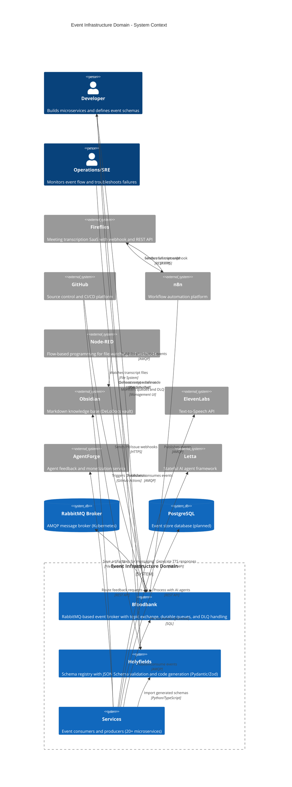

# C4 Context Level: Event Infrastructure Domain

## System Overview

### Short Description
Event Infrastructure provides distributed event streaming, schema validation, and service coordination for the 33GOD ecosystem through RabbitMQ message brokering and contract-based schema management.

### Long Description
The Event Infrastructure domain solves the challenge of decoupled, scalable communication between microservices in a heterogeneous multi-language environment. It enables independent service development while guaranteeing schema compatibility through compile-time contract validation. The system consists of three core components: **Bloodbank** (event broker and routing), **Holyfields** (schema registry and code generation), and **Services** (event consumers and producers). Together, they provide reliable event streaming, automatic schema validation, dead-letter queue handling, and cross-language type safety (Python Pydantic, TypeScript Zod). This infrastructure supports the entire 33GOD ecosystem including AI agent orchestration, meeting transcription processing, voice interaction systems, and multi-agent brainstorming platforms.

## Personas

### Developer (Human User)
- **Type**: Human User
- **Description**: Software engineers building microservices in the 33GOD ecosystem (Python, TypeScript, Node.js)
- **Goals**:
  - Build services that communicate reliably without tight coupling
  - Avoid schema mismatch bugs at runtime
  - Get compile-time safety when publishing/consuming events
  - Quickly integrate with external services (Fireflies, GitHub, Obsidian, n8n)
- **Key Features Used**:
  - Schema definition and validation
  - Code generation (Pydantic/Zod)
  - Event publishing/consuming via Bloodbank
  - Service registry
  - Dead-letter queue monitoring

### External Service (Programmatic User)
- **Type**: Programmatic User / External System
- **Description**: Third-party systems that send webhook events or consume data from the ecosystem
- **Goals**:
  - Deliver webhook events reliably (Fireflies transcripts, GitHub PRs)
  - Trigger workflows based on ecosystem events
  - Integrate with internal services without direct coupling
- **Key Features Used**:
  - Webhook ingestion via n8n/Node-RED
  - Event transformation and routing
  - External API calls triggered by events

### AI Agent Service (Programmatic User)
- **Type**: Programmatic User
- **Description**: Autonomous services that produce and consume events (TheBoard, Tonny, Agent Feedback Router)
- **Goals**:
  - Publish domain events to notify ecosystem of state changes
  - Subscribe to relevant events to trigger workflows
  - Maintain loose coupling with other services
  - Ensure message delivery and retry on failure
- **Key Features Used**:
  - Event publishing (meeting lifecycle, voice transcriptions, agent feedback)
  - Event consumption with retry and DLQ
  - Schema validation at runtime
  - Message acknowledgment and persistence

### Operations/SRE (Human User)
- **Type**: Human User
- **Description**: Platform engineers monitoring system health and troubleshooting integration issues
- **Goals**:
  - Monitor event flow and queue depths
  - Troubleshoot failed messages
  - Analyze service dependencies
  - Ensure message delivery and broker uptime
- **Key Features Used**:
  - RabbitMQ Management UI
  - Dead-letter queue inspection
  - Service registry topology visualization
  - Event tracing and correlation

## System Features

### Event Publishing & Routing
- **Description**: Durable, topic-based event publishing via RabbitMQ exchange with routing key patterns
- **Users**: Developer, AI Agent Service
- **User Journey**: [Publish Event Journey](#publish-event-journey)

### Event Consumption & Processing
- **Description**: Multi-queue event consumption with manual acknowledgment, retry logic, and dead-letter queue routing
- **Users**: Developer, AI Agent Service
- **User Journey**: [Consume Event Journey](#consume-event-journey)

### Schema Registry & Code Generation
- **Description**: JSON Schema-based contract definitions with automatic generation of Python Pydantic models and TypeScript Zod schemas
- **Users**: Developer
- **User Journey**: [Define Schema Journey](#define-schema-journey)

### Webhook Integration
- **Description**: External webhook ingestion via n8n/Node-RED with transformation and routing to internal event bus
- **Users**: External Service, Developer
- **User Journey**: [Webhook Integration Journey](#webhook-integration-journey)

### Service Discovery & Registry
- **Description**: YAML-based service registry defining topology, routing keys, queue names, and inter-service dependencies
- **Users**: Developer, Operations/SRE
- **User Journey**: [Register Service Journey](#register-service-journey)

### Dead-Letter Queue Handling
- **Description**: Failed message routing to DLQ with TTL-based expiration and manual requeue capabilities
- **Users**: Operations/SRE, Developer
- **User Journey**: [Handle Failed Messages Journey](#handle-failed-messages-journey)

## User Journeys

### Publish Event Journey - AI Agent Service
1. **Define Event Schema**: Create JSON Schema in Holyfields repository (`theboard/events/meeting_created.json`)
2. **Generate Code**: Run `mise run generate:python` to create Pydantic models
3. **Import Generated Model**: `from generated.python.theboard.events import MeetingCreatedEvent`
4. **Instantiate Event**: Create typed event object with required fields
5. **Validate Event**: Pydantic validates schema at instantiation time (compile-time safety)
6. **Publish to Bloodbank**: Connect to RabbitMQ and publish to `bloodbank.events.v1` exchange with routing key
7. **Confirm Delivery**: Receive publisher confirmation from broker
8. **Event Routed**: RabbitMQ routes message to subscribed queues based on routing key patterns

### Consume Event Journey - AI Agent Service
1. **Define Routing Keys**: Declare interest in event patterns (e.g., `theboard.meeting.#`, `fireflies.transcript.ready`)
2. **Create Queue**: Establish durable queue with TTL and DLQ configuration
3. **Bind Queue to Exchange**: Create binding with routing key pattern
4. **Start Consumer**: Listen on queue with manual acknowledgment
5. **Receive Message**: Consumer receives message payload
6. **Validate Schema**: Parse message with generated Zod/Pydantic schema
7. **Process Event**: Execute business logic (trigger workflow, store data, call API)
8. **Acknowledge Message**: Send ACK to broker (removes message from queue)
9. **On Failure**: NACK message, retry with exponential backoff (max 3 retries)
10. **DLQ Routing**: After retry exhaustion, message moves to `transcripts.failed` queue

### Define Schema Journey - Developer
1. **Identify Event Type**: Determine event name and semantic meaning (command vs domain event)
2. **Create Schema File**: Add JSON Schema to component directory (`holyfields/theboard/events/`)
3. **Define Properties**: Specify event structure with types, constraints, and required fields
4. **Add Metadata**: Include `$id`, `$schema`, title, and description
5. **Validate Schema**: Run `mise run validate:schemas` (pre-commit hook)
6. **Generate Artifacts**: CI pipeline generates Python and TypeScript code
7. **Run Contract Tests**: `mise run test:all` validates generated code matches schema
8. **Commit Schema**: Schema and generated artifacts committed to repository
9. **Consumers Import**: Dependent services import generated models

### Webhook Integration Journey - External Service (Fireflies)
1. **Fireflies Webhook Trigger**: Fireflies sends webhook when transcription completes
2. **n8n Receives Webhook**: Node-RED/n8n workflow listens on `/webhooks/fireflies` endpoint
3. **Fetch Full Transcript**: Workflow calls Fireflies API to retrieve complete transcript data
4. **Transform Payload**: "Transform for RabbitMQ" node maps Fireflies fields to standardized event schema
5. **Add Metadata**: Enrich with timestamp, workflow ID, execution ID, source identifier
6. **Validate Schema**: Optional JSON Schema validation against Holyfields contract
7. **Publish to Bloodbank**: Send to `fireflies.events` exchange with routing key `fireflies.transcript.ready`
8. **Event Consumption**: Multiple consumers receive event (transcript processor, RAG ingestion, notification service)
9. **Save to Obsidian**: Transcript processor saves markdown to DeLoDocs/Transcriptions
10. **Publish Artifact Event**: Emit `artifact.created` event for downstream consumers

### Register Service Journey - Developer
1. **Create Service**: Implement FastStream/Pika consumer or event producer
2. **Define Queue Config**: Choose queue name, routing keys, durability settings
3. **Update Registry**: Add service entry to `services/registry.yaml`
4. **Specify Metadata**: Document service description, status, owner, tags
5. **Define Routing Keys**: List all event types service consumes/produces
6. **Set Endpoints**: Document health, metrics, API, and websocket URLs
7. **Validate Registry**: YAML linter validates registry structure
8. **Deploy Service**: Service auto-registers on startup (optional)
9. **Topology Visualization**: Candybar generates network graph from registry

### Handle Failed Messages Journey - Operations/SRE
1. **Monitor Queue Depth**: Check RabbitMQ Management UI for queue growth
2. **Inspect DLQ**: View messages in `transcripts.failed` dead-letter queue
3. **Analyze Failure**: Read message payload and error headers (retry count, exception)
4. **Diagnose Issue**: Identify root cause (schema mismatch, downstream API failure, timeout)
5. **Fix Root Cause**: Deploy code fix or update configuration
6. **Requeue Messages**: Use RabbitMQ UI "Get Messages" → "Requeue" feature
7. **Monitor Reprocessing**: Watch messages flow through primary queue successfully
8. **Alert if Persistent**: Set up alert if DLQ depth exceeds threshold

## External Systems and Dependencies

### Fireflies (External API)
- **Type**: SaaS API (Meeting Transcription Service)
- **Description**: Provides webhook notifications and REST API for accessing meeting transcripts, audio, video, and summaries
- **Integration Type**: Webhook (inbound) + REST API (outbound)
- **Purpose**: Capture meeting content for RAG ingestion and artifact storage

### GitHub (External API)
- **Type**: SaaS API (Version Control & CI/CD)
- **Description**: Hosts source code, triggers CI workflows, provides PR and issue webhooks
- **Integration Type**: Webhook (inbound) + GitHub Actions (CI/CD)
- **Purpose**: Version schema definitions, run contract validation, trigger builds, deliver PR events

### n8n (External Workflow Orchestrator)
- **Type**: Workflow Automation Platform (Self-Hosted)
- **Description**: Visual workflow builder for webhook handling, API calls, and event transformation
- **Integration Type**: Webhook receiver + RabbitMQ publisher + REST API client
- **Purpose**: Bridge external services (Fireflies, GitHub) to internal event bus with transformation

### Node-RED (External Workflow Orchestrator)
- **Type**: Flow-Based Programming Platform (Self-Hosted)
- **Description**: File watching, webhook handling, and event bridging via exec node RabbitMQ subscribers
- **Integration Type**: File system watcher + Webhook receiver + RabbitMQ consumer/publisher
- **Purpose**: Automate file-based workflows (Fireflies transcript upload detection) and webhook-to-event routing

### Obsidian (External File System)
- **Type**: Note-Taking Application (Local File System)
- **Description**: Markdown-based knowledge base (DeLoDocs vault) for artifact storage
- **Integration Type**: File system writes (markdown files)
- **Purpose**: Persist transcripts, artifacts, and documentation for long-term retrieval

### RabbitMQ (Message Broker)
- **Type**: Message Queue (Self-Hosted, Kubernetes)
- **Description**: AMQP-compliant message broker providing topic exchange, durable queues, and publisher confirms
- **Integration Type**: AMQP protocol (port 5672) + Management API (port 15672)
- **Purpose**: Core event bus enabling decoupled service communication

### PostgreSQL (Database)
- **Type**: Relational Database (Planned)
- **Description**: Event store for queryable audit trail and event sourcing
- **Integration Type**: SQL connection (PostgreSQL wire protocol)
- **Purpose**: Persist all events for replay, analytics, and compliance (event-store-manager service)

### Trello (External API - Planned)
- **Type**: SaaS API (Project Management)
- **Description**: Card-based project management system
- **Integration Type**: REST API (outbound)
- **Purpose**: Auto-create cards from LLM prompts and artifact events (via n8n workflow)

### Google Sheets (External API - Planned)
- **Type**: SaaS API (Spreadsheet)
- **Description**: Cloud-based spreadsheet for logging and reporting
- **Integration Type**: Google Sheets API (outbound)
- **Purpose**: Event logging and analytics dashboards (optional n8n integration)

### Letta (AI Agent Framework)
- **Type**: Internal Service (Python)
- **Description**: Stateful AI agent framework for memory-enabled conversational agents
- **Integration Type**: REST API (internal)
- **Purpose**: Powers Tonny agent for voice interaction processing (consumes `transcription.voice.completed` events)

### ElevenLabs (External API)
- **Type**: SaaS API (Text-to-Speech)
- **Description**: Neural TTS service for generating voice responses
- **Integration Type**: REST API (outbound)
- **Purpose**: Generate audio responses from Tonny agent text (triggered by agent processing)

### AgentForge (Internal Service)
- **Type**: Internal Service (Agent Management)
- **Description**: Agent monetization and feedback routing system
- **Integration Type**: REST API (internal)
- **Purpose**: Route agent feedback requests and publish responses (agent-feedback-router service)

## System Context Diagram

## Security Boundaries

### Network Isolation
- **RabbitMQ Broker**: Deployed in Kubernetes `messaging` namespace, not directly exposed to internet
- **External Access**: Port-forward required for local development (`kubectl port-forward svc/bloodbank 15672:15672 5673:5672`)
- **In-Cluster Services**: Access RabbitMQ directly via service DNS (`bloodbank.messaging.svc:5672`)

### Authentication & Authorization
- **RabbitMQ Credentials**: Stored in Kubernetes secret (`bloodbank-default-user`)
- **User Isolation**: Separate users per environment (development, staging, production)
- **Vhost Separation**: Default vhost `/` for current deployment, plan for multi-tenant vhosts

### Message Security
- **Encryption in Transit**: TLS required for production deployments
- **Persistent Messages**: Messages marked durable to survive broker restarts
- **Message TTL**: 24-hour TTL on primary queues, 7-day TTL on DLQ to prevent unbounded growth

### Schema Validation
- **Contract Enforcement**: JSON Schema validation at schema definition time (CI)
- **Runtime Validation**: Pydantic/Zod validation in consumers before processing
- **Breaking Change Detection**: CI fails on schema changes that remove required fields or change types

### Webhook Security
- **Webhook Signatures**: Fireflies webhook signature validation (planned)
- **Rate Limiting**: n8n/Node-RED rate limiting on webhook endpoints
- **IP Allowlisting**: Restrict webhook endpoints to known external service IPs

## Event Flow Patterns

### Publish-Subscribe (Topic Exchange)
- **Pattern**: Multiple consumers receive copies of same event based on routing key patterns
- **Example**: `fireflies.transcript.ready` → [transcript-processor, transcript-rag, transcript-notifier]
- **Use Case**: Domain events that multiple services need to react to independently

### Point-to-Point (Single Queue)
- **Pattern**: Single consumer processes each message (load balanced if multiple instances)
- **Example**: `event_store_manager_queue` (single consumer persists all events)
- **Use Case**: Guaranteed single processing for operations like persistence or external API calls

### Dead-Letter Queue (Error Handling)
- **Pattern**: Failed messages routed to DLQ after retry exhaustion
- **Example**: `transcripts.rag.ingestion` → (3 retries) → `transcripts.failed`
- **Use Case**: Prevent message loss while avoiding infinite retry loops

### Routing Key Conventions
- **Namespacing**: `<domain>.<entity>.<action>` (e.g., `theboard.meeting.created`, `fireflies.transcript.ready`)
- **Wildcard Patterns**: `*` (one word), `#` (zero or more words)
- **Examples**:
  - `llm.#` (all LLM events)
  - `theboard.meeting.*` (all meeting lifecycle events)
  - `#` (all events - event store manager)

## Monitoring & Observability

### RabbitMQ Management UI
- **URL**: http://localhost:15672 (port-forwarded) or in-cluster URL
- **Metrics**: Queue depth, message rates, consumer count, connection status
- **Actions**: View messages, purge queues, requeue from DLQ, manage bindings

### Service Health Endpoints
- **Event Store Manager**: `http://localhost:8080/health`
- **TheBoard Producer**: `http://localhost:8000/health`
- **Tonny Agent**: `http://localhost:8000/health`
- **Node-RED**: `http://localhost:1880`

### Event Tracing (Planned)
- **Correlation IDs**: Propagate correlation ID through event chain for distributed tracing
- **OpenTelemetry**: Instrument consumers with spans for event processing
- **Logging**: Structured JSON logs with event metadata (routing key, timestamp, execution ID)

### Metrics (Planned)
- **Queue Depth**: Alert if queue depth exceeds threshold
- **DLQ Growth**: Alert on messages entering dead-letter queue
- **Processing Latency**: Histogram of event processing time per consumer
- **Error Rate**: Count of failed message processing attempts

## Scalability & Performance

### Horizontal Scaling
- **Multiple Consumers**: Each service can run multiple instances (round-robin load balancing)
- **Prefetch Count**: Configure consumer prefetch to batch message delivery
- **Queue Sharding**: Separate queues per consumer type to distribute load

### Message Durability vs Throughput
- **Durable Messages**: Slower but survive broker restarts (default for production)
- **Transient Messages**: Faster but lost on broker restart (optional for non-critical events)
- **Lazy Queues**: Store messages on disk to handle large backlogs without memory pressure

### Publisher Confirms
- **Enabled**: Publishers wait for broker acknowledgment before considering send successful
- **Reliability**: Guarantees message was routed to at least one queue
- **Latency Trade-off**: Adds round-trip overhead but prevents silent message loss

## Data Retention & Compliance

### Message TTL
- **Primary Queues**: 24-hour TTL (messages expire if not consumed)
- **Dead-Letter Queue**: 7-day TTL (allows investigation window)
- **Event Store**: Indefinite retention in PostgreSQL (planned)

### Event Replay
- **Event Store Manager**: Persists all events to PostgreSQL for queryable replay
- **Use Cases**: Debugging, analytics, GDPR compliance, event sourcing

### GDPR Considerations
- **PII in Events**: Avoid embedding PII in event payloads (use references to PII stored in compliant system)
- **Right to Erasure**: Event store tombstoning for deleted entities
- **Audit Trail**: Immutable event log for compliance verification

## Future Enhancements

### Schema Evolution
- **Backward Compatibility**: Allow adding optional fields without breaking consumers
- **Schema Versions**: Support multiple schema versions in parallel during migration
- **Deprecation Warnings**: CI warns on consumption of deprecated event versions

### Multi-Cloud Deployment
- **Federated Brokers**: RabbitMQ federation for cross-region/cloud event replication
- **Cloud-Native Messaging**: Evaluate managed services (AWS SQS, GCP Pub/Sub, Azure Service Bus)

### Event Sourcing Patterns
- **Command-Event Separation**: Distinguish commands (intent) from events (facts)
- **Aggregate Snapshots**: Periodic snapshots to optimize event replay
- **CQRS Integration**: Separate read models optimized for queries

### Advanced Routing
- **Content-Based Routing**: Route based on message payload properties (RabbitMQ headers exchange)
- **Priority Queues**: High-priority events processed before low-priority
- **Delayed Messaging**: Schedule future event delivery (RabbitMQ delayed message plugin)

### Observability Improvements
- **Event Graph Visualization**: Real-time visualization of event flows (Candybar extension)
- **Anomaly Detection**: ML-based detection of unusual event patterns
- **Distributed Tracing**: Full request tracing across service boundaries

## Related Documentation

- [Bloodbank README](/home/delorenj/code/33GOD/bloodbank/trunk-main/event_producers/n8n/README.md) - RabbitMQ setup and n8n integration
- [Fireflies Events](/home/delorenj/code/33GOD/bloodbank/trunk-main/event_producers/n8n/FIREFLIES_EVENTS.md) - Webhook architecture
- [Holyfields README](/home/delorenj/code/33GOD/holyfields/trunk-main/README.md) - Schema registry and code generation
- [Services Registry](/home/delorenj/code/33GOD/services/registry.yaml) - Complete service catalog
- [33GOD Architecture](/home/delorenj/code/33GOD/docs/ARCHITECTURE.md) - System-wide architecture overview
