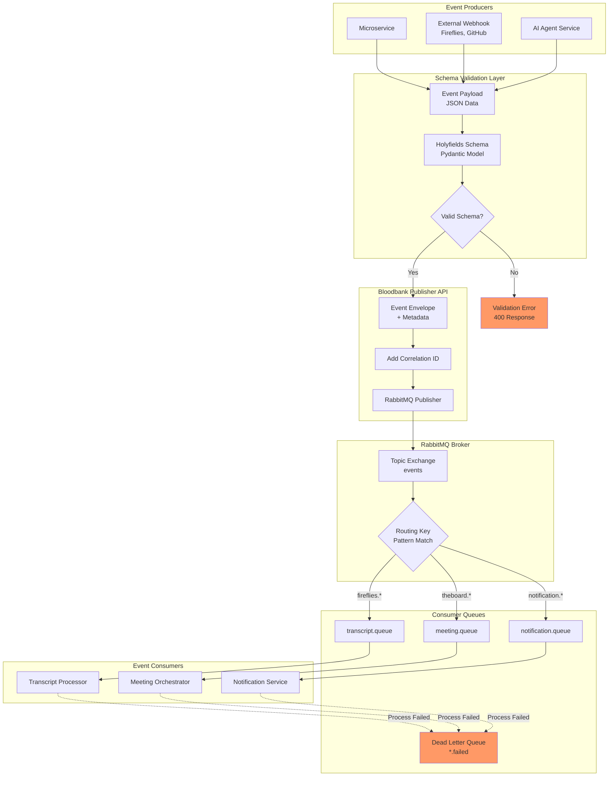
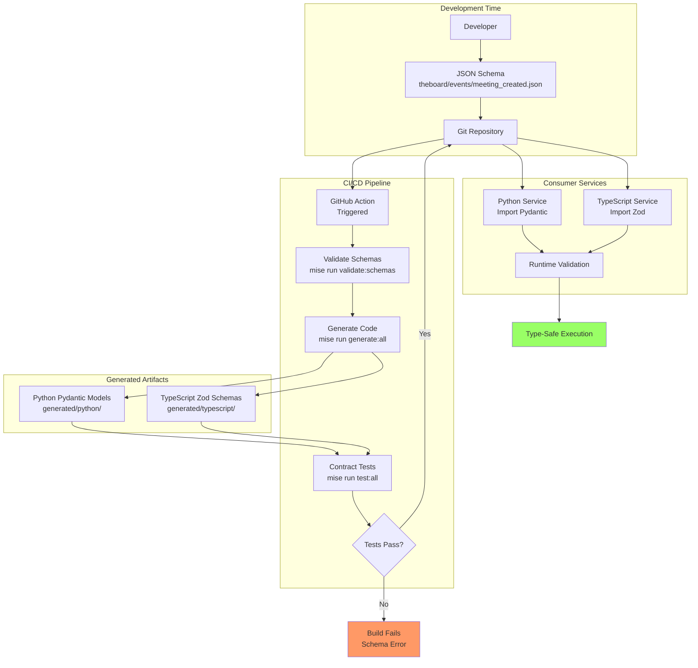
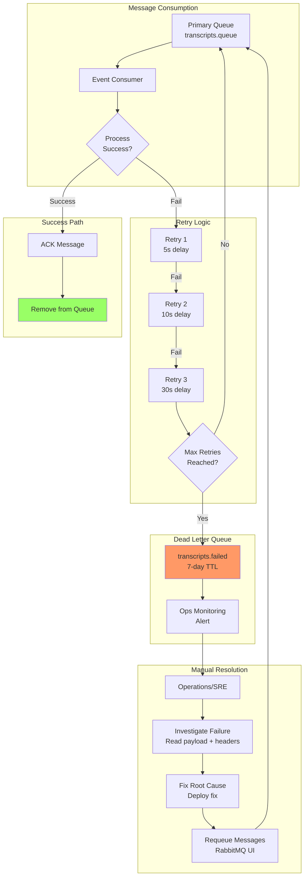
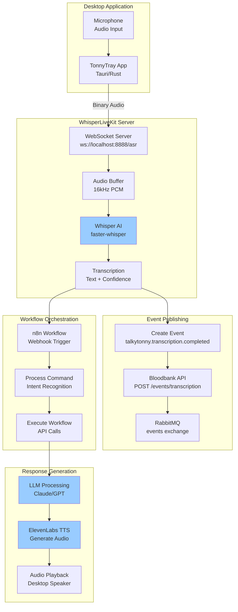

# Event Infrastructure Domain - Data Flows

## Overview

This document visualizes how data flows through the Event Infrastructure domain, showing message routing patterns, schema validation flows, and event processing pipelines.

## 1. Core Event Publishing Flow

Shows how events are published from services through Bloodbank to RabbitMQ and distributed to subscribers.



## 2. Webhook Integration Flow

Detailed flow showing how external webhooks (Fireflies) are transformed and routed to internal event bus.

```mermaid
flowchart LR
    subgraph External["External Service"]
        FF[Fireflies.ai<br/>Transcript Ready]
    end

    subgraph n8n["n8n Workflow Orchestrator"]
        WH[Webhook Endpoint<br/>/webhooks/fireflies]
        Fetch[Fetch Full Transcript<br/>API Call]
        Transform[Transform Payload<br/>Map to Schema]
        Enrich[Add Metadata<br/>timestamp, workflow_id]
        Publish[Publish to Bloodbank<br/>POST /events/transcript]
    end

    subgraph Bloodbank["Bloodbank"]
        Validate[Schema Validation<br/>Pydantic]
        Envelope[Create Envelope]
        ToRMQ[To RabbitMQ]
    end

    subgraph RabbitMQ["RabbitMQ"]
        Exchange[events exchange]
        Routes{Route by Key}
        TranscriptQ[transcript.queue]
        RAGQ[rag.ingestion.queue]
    end

    subgraph Subscribers["Subscribers"]
        SaveMD[Save to Obsidian<br/>Markdown]
        RAG[RAG Ingestion<br/>Vector DB]
        Notify[Notification Service]
    end

    FF -->|HTTPS POST| WH
    WH --> Fetch
    Fetch --> Transform
    Transform --> Enrich
    Enrich --> Publish

    Publish --> Validate
    Validate --> Envelope
    Envelope --> ToRMQ

    ToRMQ --> Exchange
    Exchange --> Routes
    Routes -->|fireflies.transcript.ready| TranscriptQ
    Routes -->|fireflies.transcript.ready| RAGQ

    TranscriptQ --> SaveMD
    RAGQ --> RAG
    TranscriptQ --> Notify

    style Validate fill:#9f6
    style Routes decision
```



## 3. Schema Generation and Distribution Flow

Shows the build-time flow of schema validation and code generation from Holyfields.



## 4. Dead Letter Queue Processing Flow

Shows how failed messages are handled and requeued.



## 5. Event Correlation and Tracing Flow

Shows how correlation IDs propagate through distributed event chains.

```mermaid
flowchart LR
    subgraph Request["Initial Request"]
        User[User Action]
        GenID[Generate<br/>Correlation ID<br/>uuid-123]
    end

    subgraph Event1["Event 1: Meeting Created"]
        E1Publish[theboard.meeting.created<br/>correlation_id: uuid-123]
        E1Queue[meeting.queue]
        E1Process[Meeting Processor]
    end

    subgraph Event2["Event 2: Notification Sent"]
        E2Publish[notification.sent<br/>correlation_id: uuid-123<br/>parent: meeting.created]
        E2Queue[notification.queue]
        E2Process[Notification Service]
    end

    subgraph Event3["Event 3: Email Delivered"]
        E3Publish[notification.email.delivered<br/>correlation_id: uuid-123<br/>parent: notification.sent]
        E3Queue[email.queue]
        E3Process[Email Service]
    end

    subgraph Tracking["Correlation Tracking"]
        Redis[Redis Cache<br/>24h TTL]
        Chain[Correlation Chain<br/>uuid-123 → [e1, e2, e3]]
        Query[GET /correlation/uuid-123]
    end

    User --> GenID
    GenID --> E1Publish
    E1Publish --> E1Queue
    E1Queue --> E1Process

    E1Process --> E2Publish
    E2Publish --> E2Queue
    E2Queue --> E2Process

    E2Process --> E3Publish
    E3Publish --> E3Queue
    E3Queue --> E3Process

    E1Publish -.->|Store| Redis
    E2Publish -.->|Store| Redis
    E3Publish -.->|Store| Redis

    Redis --> Chain
    Chain --> Query
    Query --> DebugTool[Distributed Tracing<br/>Debug Tool]

    style Chain fill:#9cf
    style DebugTool fill:#9f6
```

## 6. Voice Assistant Event Flow (TalkyTonny)

Shows the real-time voice transcription and event publishing pipeline.



## Data Flow Patterns Summary

### 1. **Publish-Subscribe Pattern**
- **Use Case**: Domain events requiring multiple independent consumers
- **Example**: `fireflies.transcript.ready` → [processor, RAG, notifier]
- **Characteristics**: Decoupled, scalable, asynchronous

### 2. **Request-Reply Pattern** (Async)
- **Use Case**: Command events expecting acknowledgment
- **Example**: `agent.task.assign` → `agent.task.accepted`
- **Characteristics**: Correlation IDs, reply queues

### 3. **Event Sourcing Pattern**
- **Use Case**: Audit trail and event replay
- **Example**: All events persisted to PostgreSQL event store
- **Characteristics**: Immutable log, queryable history

### 4. **Dead Letter Queue Pattern**
- **Use Case**: Failed message handling
- **Example**: Retry exhaustion → `transcripts.failed` queue
- **Characteristics**: TTL, manual requeue, alerting

### 5. **Content-Based Routing**
- **Use Case**: Route by routing key patterns
- **Example**: `theboard.meeting.*` → meeting queue
- **Characteristics**: Topic exchange, wildcard patterns

## Message Format Standards

### Event Envelope Structure
```json
{
  "event_id": "uuid-v4",
  "event_type": "theboard.meeting.created",
  "timestamp": "2026-01-29T10:30:00Z",
  "correlation_id": "uuid-v4",
  "source": "theboard-service",
  "payload": {
    // Holyfields-validated event data
  },
  "metadata": {
    "version": "1.0",
    "schema_version": "2.0.0"
  }
}
```

### Routing Key Convention
```
<domain>.<entity>.<action>
│        │        └─ action: created, updated, deleted, ready
│        └─ entity: meeting, transcript, agent
└─ domain: theboard, fireflies, talkytonny, flume
```

## Performance Metrics

| Flow | Latency Target | Throughput |
|------|---------------|------------|
| Event Publishing | < 50ms p99 | 10k+ msg/s |
| Schema Validation | < 10ms | In-memory |
| Webhook → Event | < 2s | Rate limited |
| Voice Transcription → Event | < 500ms | Real-time |
| DLQ Requeue | Manual | N/A |

## Related Documentation

- [Dependency Graph](./dependencies.md) - Component dependencies and integration points
- [Sequence Diagrams](./sequences.md) - Interaction patterns and message flows
- [C4 Context](./c4-context.md) - System context and personas
- [C4 Container](./c4-container.md) - Container deployment architecture

---

**Version**: 1.0.0
**Last Updated**: 2026-01-29
**Maintained By**: 33GOD Architecture Team
