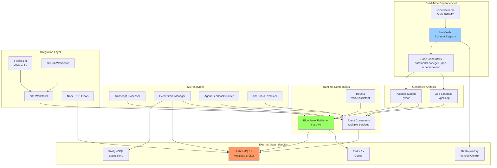
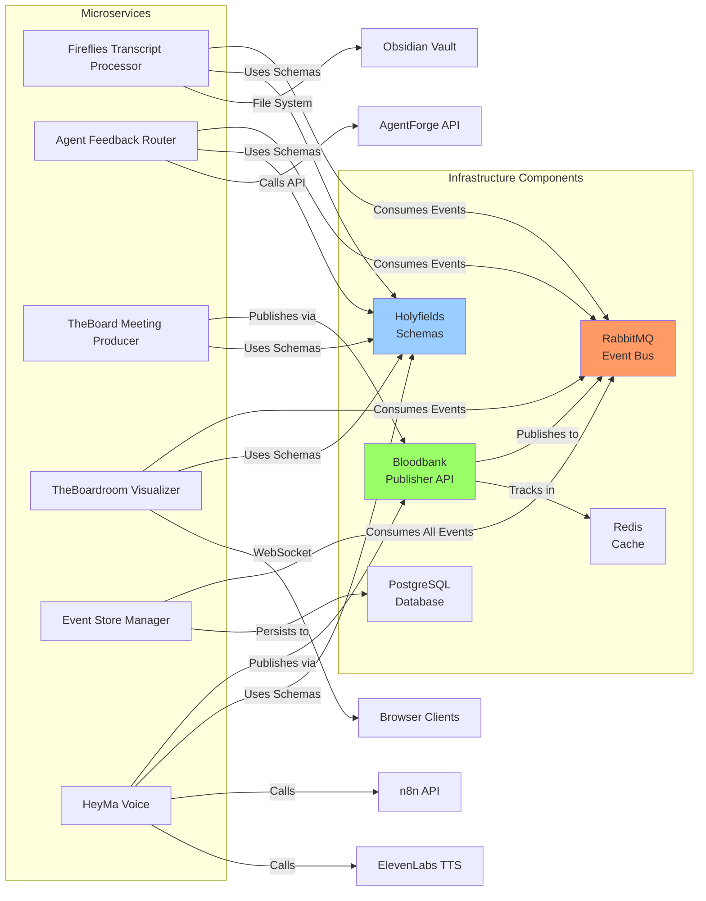
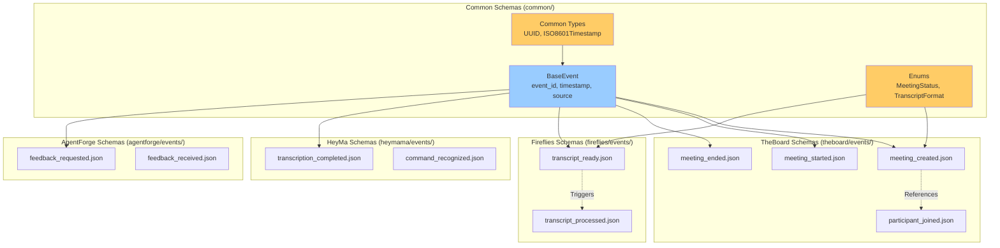
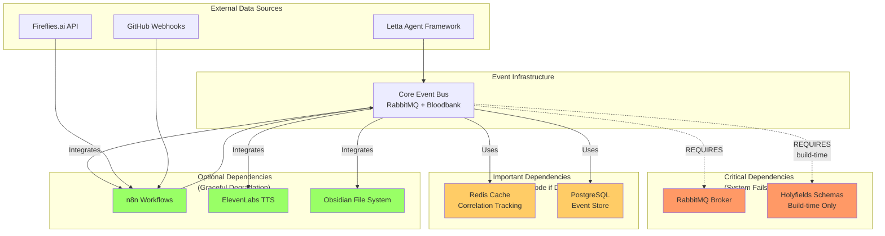
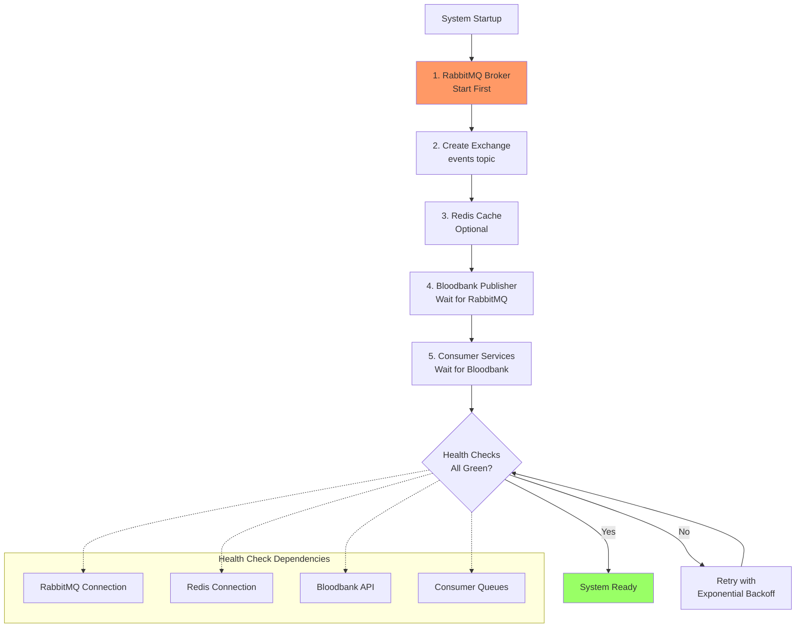
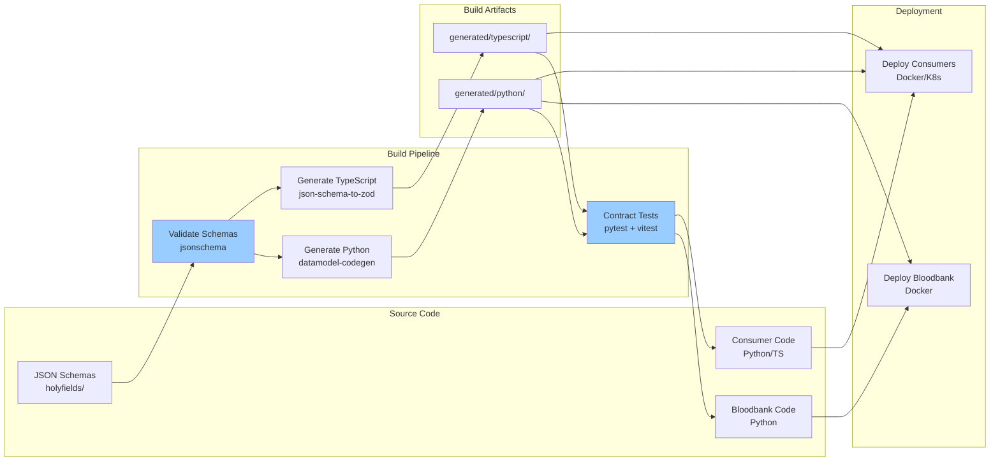

# Event Infrastructure Domain - Dependency Graph

## Overview

This document visualizes the dependency relationships between components in the Event Infrastructure domain, showing build-time dependencies, runtime dependencies, and service integration points.

## 1. Component Dependency Graph

Shows the hierarchical dependencies between all Event Infrastructure components.

## 2. Service Dependency Matrix

Detailed matrix showing which services depend on which infrastructure components.

## 3. Schema Dependency Tree

Shows how schemas inherit from common base types and depend on each other.

## 4. External System Integration Dependencies

Maps external system dependencies and their failure impact.

## 5. Runtime Dependency Graph

Shows the order of startup dependencies and health check chains.

## 6. Build Pipeline Dependencies

Shows CI/CD build order and artifact dependencies.

## Dependency Impact Analysis

### High Impact (System Failure if Unavailable)

| Dependency | Impact | Mitigation |
|------------|--------|------------|
| RabbitMQ Broker | Complete system failure | RabbitMQ clustering, persistent queues |
| Holyfields Schemas | Build failure (runtime unaffected) | Schema validation in CI, cached artifacts |

### Medium Impact (Degraded Performance)

| Dependency | Impact | Mitigation |
|------------|--------|------------|
| Redis Cache | Lost correlation tracking | Graceful degradation, optional feature |
| PostgreSQL Event Store | Lost event history | Event store is optional, async writes |

### Low Impact (Feature Loss Only)

| Dependency | Impact | Mitigation |
|------------|--------|------------|
| n8n Workflows | Lost webhook automation | Direct consumer integration |
| ElevenLabs TTS | No voice responses | Fallback to text-only |
| Obsidian Vault | Lost transcript storage | Alternative storage backends |

## Versioning Strategy

### Schema Versioning
- **Format**: Semantic Versioning (2.1.0)
- **Breaking Change**: Major version bump (1.x.x → 2.0.0)
- **New Field**: Minor version bump (1.1.x → 1.2.0)
- **Bug Fix**: Patch version bump (1.1.1 → 1.1.2)

### API Versioning
- **Bloodbank REST API**: URL-based (`/v1/events/`, `/v2/events/`)
- **RabbitMQ Events**: Routing key includes version (`theboard.v1.meeting.created`)

### Compatibility Matrix

| Component | Python Schemas | TypeScript Schemas | RabbitMQ |
|-----------|---------------|-------------------|----------|
| Bloodbank Publisher | 2.0+ | N/A | 3.x |
| Python Consumers | 2.0+ | N/A | 3.x |
| TypeScript Consumers | N/A | 2.0+ | 3.x |
| Event Store Manager | 2.0+ | N/A | 3.x |

## Circular Dependency Prevention

### Avoided Patterns
- **No Consumer → Bloodbank**: Consumers never publish via Bloodbank API (direct RabbitMQ)
- **No Schema → Service Code**: Services import generated schemas, never raw JSON
- **No Build-time → Runtime**: Holyfields runs at build-time only

### Dependency Rules
1. **Acyclic Graph**: All dependencies form a Directed Acyclic Graph (DAG)
2. **Layered Architecture**: Clear separation between build-time and runtime
3. **Interface Segregation**: Services depend on interfaces (Pydantic/Zod), not implementations

## Related Documentation

- [Data Flow Diagrams](./data-flows.md) - Message routing and processing flows
- [Sequence Diagrams](./sequences.md) - Interaction patterns
- [C4 Container](./c4-container.md) - Container deployment architecture

---

**Version**: 1.0.0
**Last Updated**: 2026-01-29
**Maintained By**: 33GOD Architecture Team
