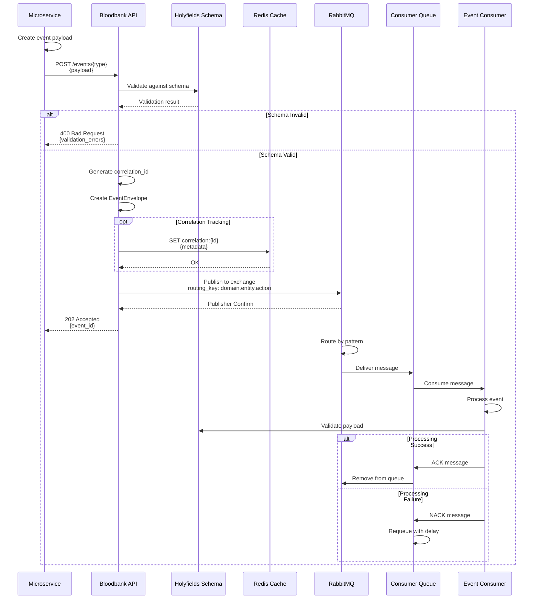
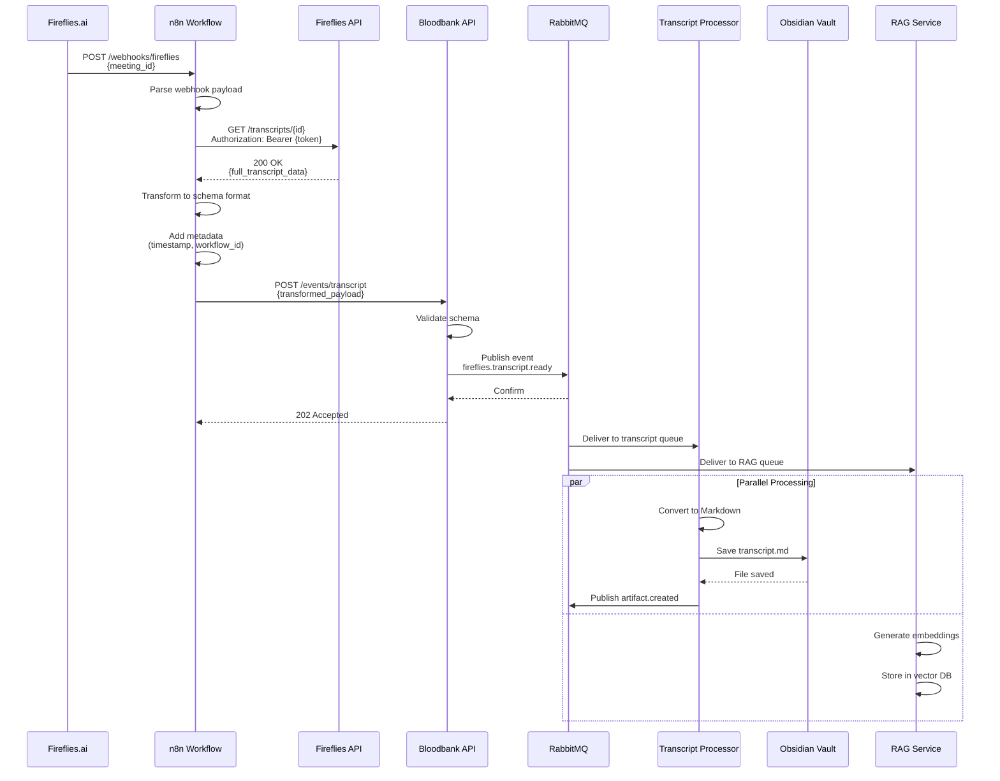
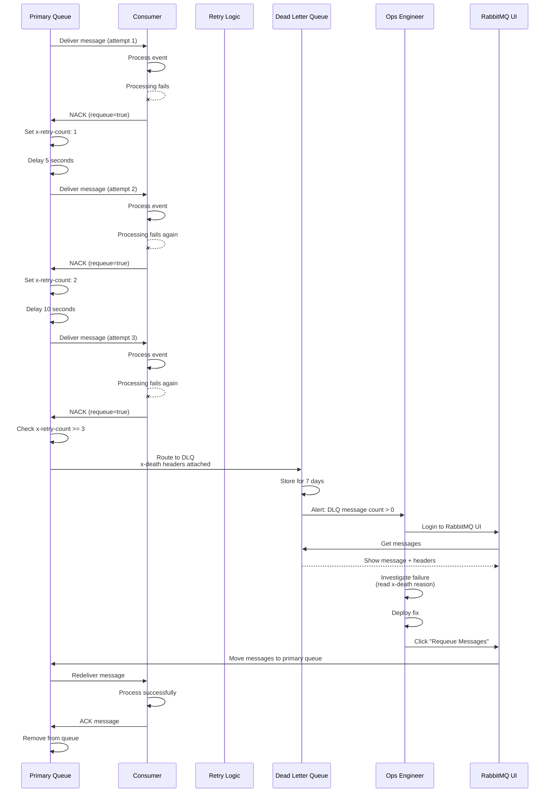
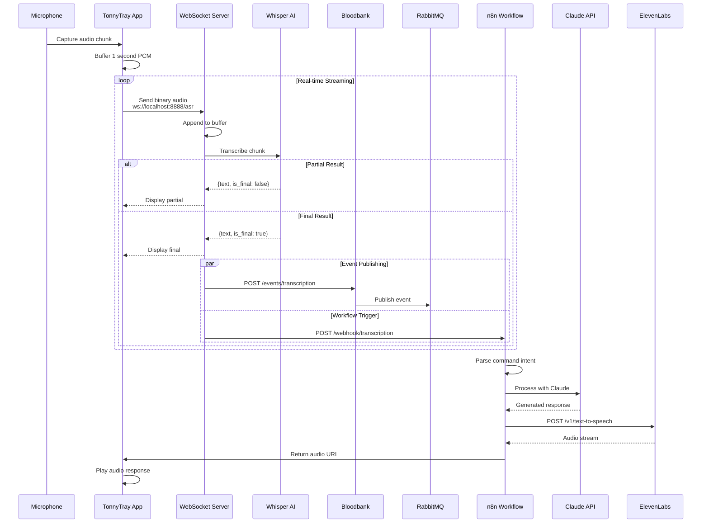
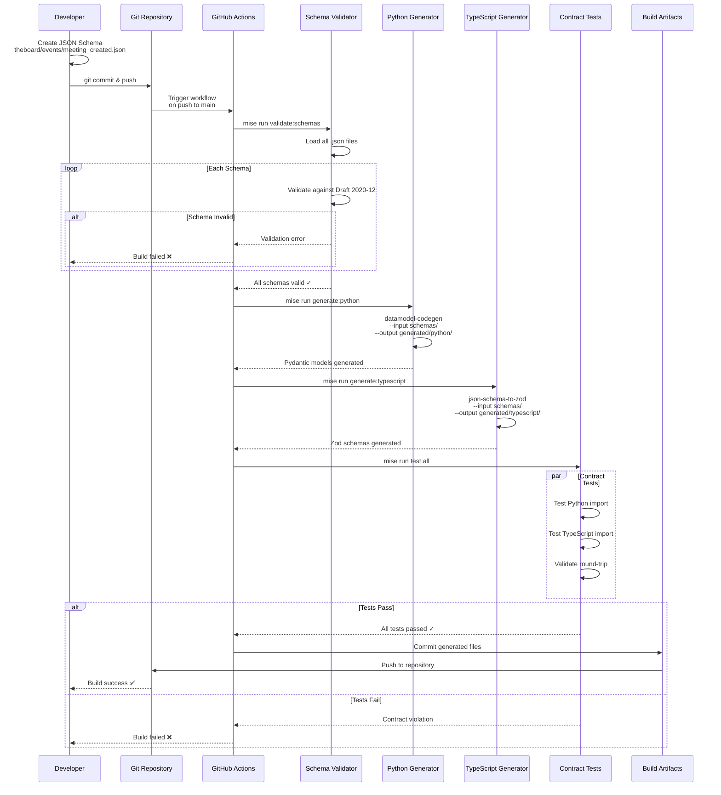
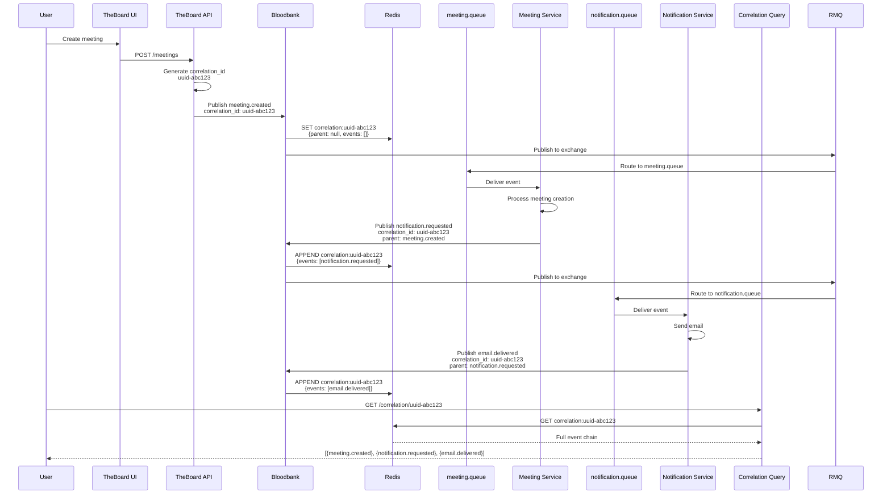
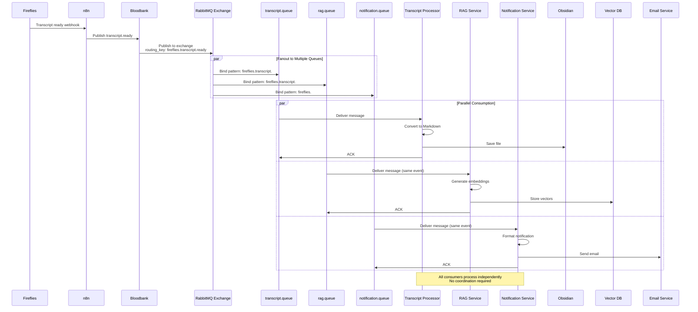
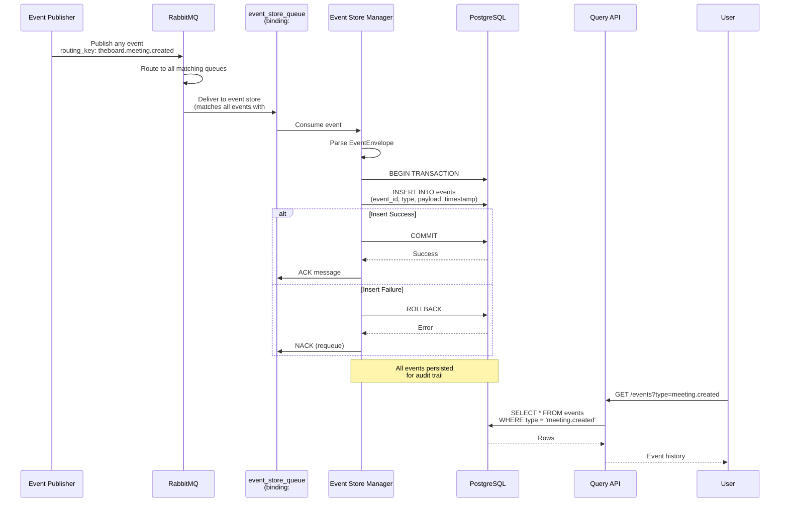

# Event Infrastructure Domain - Sequence Diagrams

## Overview

This document provides detailed sequence diagrams showing key interaction patterns and message flows in the Event Infrastructure domain.

## 1. Event Publishing Sequence

Standard sequence for publishing an event from a service through Bloodbank to consumers.

## 2. Webhook Integration Sequence (Fireflies)

Detailed sequence showing how external webhooks are transformed and published.

## 3. Dead Letter Queue Handling Sequence

Shows the retry logic and DLQ routing flow.

## 4. Voice Transcription Real-Time Sequence

Shows the real-time audio streaming and event publishing flow for TalkyTonny.

## 5. Schema Validation and Code Generation Sequence

Build-time sequence for schema processing and artifact generation.

## 6. Correlation Tracking Sequence

Shows how correlation IDs propagate through distributed workflows.

## 7. Multi-Consumer Event Distribution Sequence

Shows how a single event is distributed to multiple consumers in parallel.

## 8. Event Store Persistence Sequence

Shows how all events are persisted to PostgreSQL for event sourcing.

## Interaction Patterns Summary

### 1. **Fire-and-Forget**
- Publisher sends event, does not wait for consumer processing
- Example: `meeting.created` → notification service
- Characteristics: Fast, decoupled, no backpressure

### 2. **Request-Correlation**
- Publisher includes correlation ID for distributed tracing
- Example: User action → multiple microservices → aggregated result
- Characteristics: Traceable, debuggable, async

### 3. **Competing Consumers**
- Multiple instances of same consumer share a queue
- Example: 3x transcript processor instances
- Characteristics: Load balanced, scalable, round-robin

### 4. **Publish-Subscribe Fanout**
- Single event delivered to multiple independent consumers
- Example: `transcript.ready` → [processor, RAG, notifier]
- Characteristics: Parallel processing, independent failures

### 5. **Dead Letter Queue Recovery**
- Failed messages routed to DLQ after retry exhaustion
- Example: Processing failure → 3 retries → DLQ → manual fix → requeue
- Characteristics: Fault tolerant, operator intervention

## Timing Characteristics

| Sequence | Latency | Throughput |
|----------|---------|------------|
| Event Publishing | 10-50ms | 10k+ events/sec |
| Webhook Integration | 500ms-2s | 100 webhooks/sec |
| Schema Validation | 1-10ms | In-memory |
| Voice Transcription | 200-500ms | Real-time streaming |
| DLQ Requeue | Manual | N/A |
| Correlation Query | 5-20ms | 1k+ queries/sec |

## Related Documentation

- [Data Flow Diagrams](./data-flows.md) - Message routing patterns
- [Dependency Graph](./dependencies.md) - Component dependencies
- [C4 Context](./c4-context.md) - System context and personas

---

**Version**: 1.0.0
**Last Updated**: 2026-01-29
**Maintained By**: 33GOD Architecture Team
