# Infrastructure Domain - GOD Document

> **Guaranteed Organizational Document** - Developer-facing reference for the Infrastructure domain
>
> **Last Updated**: 2026-02-12
> **Components**: 5

---

## Domain Overview

The Infrastructure Domain is the **central nervous system** of 33GOD. Every state change in the ecosystem flows through this domain as typed events with schema validation.

**Core Responsibility**: Enable asynchronous, decoupled communication between all 33GOD components through event-driven messaging.

**Architectural Philosophy**: "Everything is an Event"

---

## Component Map

```mermaid
graph TB
    subgraph "Infrastructure Domain"
        HF[Holyfields<br/>Schema Registry]
        BB[Bloodbank<br/>Event Bus]
        CS[Candystore<br/>Event Persistence]
        CB[Candybar<br/>Service Registry UI]
        ID[Infra Dispatcher<br/>Plane → OpenClaw]
    end

    subgraph "External Systems"
        AGENTS[Agent Services]
        WM[Workspace Mgmt]
        DEV[Dev Tools]
        PLANE[Plane]
        OPENCLAW[OpenClaw]
    end

    HF -->|generates types| AGENTS
    HF -->|generates types| WM
    HF -->|validates schemas| BB

    AGENTS -->|publish/subscribe| BB
    WM -->|publish/subscribe| BB
    DEV -->|publish/subscribe| BB

    BB -->|persists| CS
    BB -->|streams to| CB
    CB -->|reads| REG[registry.yaml]
    
    PLANE -->|webhooks| BB
    BB -->|webhook.plane.*| ID
    ID -->|/hooks/agent| OPENCLAW
```



---

## Components

### Bloodbank

**Purpose**: Central RabbitMQ-based event bus with schema validation and correlation tracking

**Type**: Event Bus / Message Broker
**Status**: Production

**Key Events:**
- **Emits**: `bloodbank.health.status`, `bloodbank.message.dlq`
- **Consumes**: All system events for routing

**Interfaces:**
- AMQP: `amqp://localhost:5672`
- Management UI: `http://localhost:15672`
- Health API: `/health` (FastAPI)

[📄 Component GOD Doc](../../bloodbank/GOD.md)

---

### Holyfields

**Purpose**: Schema registry and type generation system for event contracts

**Type**: Code Generator / Schema Registry
**Status**: Production

**Key Events:**
- **Emits**: `holyfields.schema.updated`
- **Consumes**: None (generates schemas, doesn't consume events)

**Interfaces:**
- CLI: `holyfields generate`
- Schema Directory: `/holyfields/schemas/`

[📄 Component GOD Doc](../../holyfields/GOD.md)

---

### Candystore

**Purpose**: Event persistence layer for audit trails and replay

**Type**: Event Store
**Status**: Development

**Key Events:**
- **Emits**: `candystore.event.persisted`
- **Consumes**: `*.*.*` (all events for persistence)

**Interfaces:**
- API: `/events` (query historical events)

[📄 Component GOD Doc](../../candystore/GOD.md) _(To be created)_

---

### Candybar

**Purpose**: Real-time service topology visualization and event stream monitor

**Type**: Dashboard / Visualization
**Status**: Development

**Key Events:**
- **Emits**: None (read-only visualization)
- **Consumes**: `*.*.*` (all events for visualization)

**Interfaces:**
- Web UI: `http://localhost:3000`
- WebSocket: Live event stream

[📄 Component GOD Doc](../../candybar/GOD.md)

---

### Infra Dispatcher

**Purpose**: Bloodbank consumer that dispatches Plane webhook events to OpenClaw Team Infra workers. Implements the "Ready Gate" pattern for ticket automation.

**Type**: Event Consumer / Dispatcher
**Status**: Production

**Key Behavior:**
1. Consumes `webhook.plane.#` events from Bloodbank
2. Applies ready-gate: state=unstarted + labels=[ready, automation:go]
3. Runs component health checks (M2 gate) before dispatch
4. Forwards qualifying tickets to OpenClaw `/hooks/agent` endpoint

**Default Component Health Checks:**
| Component | Check Command |
|-----------|---------------|
| bloodbank | `pytest tests/test_infra_dispatcher.py` |
| candystore | `pytest` |
| candybar | `bun run lint && bun run build` |
| holyfields | `mise run test:all` |
| pjangler | `bun run build` |

**Configuration:**
- Environment: `~/.config/openclaw/infra-dispatch.env`
- State File: `~/.config/openclaw/infra-dispatch-state.json` (deduplication)
- Container: `infra-dispatcher` in compose.yml

**Environment Variables:**
- `OPENCLAW_HOOK_TOKEN` (required)
- `OPENCLAW_HOOK_URL` (default: `http://host.docker.internal:18789/hooks/agent`)
- `INFRA_READY_STATES` (default: `unstarted`)
- `INFRA_READY_LABELS` (default: `ready,automation:go`)
- `INFRA_COMPONENT_LABEL_PREFIX` (default: `comp:`)
- `INFRA_RUN_CHECKS` (default: `true`)
- `INFRA_CHECK_TIMEOUT_SECONDS` (default: `900`)

**Deployment:**
```bash
# Containerized (recommended)
docker-compose up -d infra-dispatcher

# Legacy systemd (disable after migration)
systemctl --user disable infra-dispatch.service
```

---

## Domain Event Contracts

### Cross-Component Events

Events that flow between components within this domain:

| Event | Producer | Consumer(s) | Purpose |
|-------|----------|-------------|---------|
| `holyfields.schema.updated` | Holyfields | Bloodbank | Reload schema validation rules |
| `bloodbank.message.dlq` | Bloodbank | Candystore, Candybar | Track failed message routing |
| `bloodbank.health.status` | Bloodbank | Candybar | Display health metrics |

### External Event Interfaces

Events exchanged with other domains:

| Event | Direction | External Domain | Purpose |
|-------|-----------|-----------------|---------|
| `worktree.*` | Inbound | Workspace Management | Track git worktree lifecycle |
| `agent.task.*` | Inbound | Agent Orchestration | Track agent task execution |
| `meeting.*` | Inbound | Meeting & Collaboration | Track meeting lifecycle |
| `session.*` | Inbound | Development Tools | Track coding session activity |
| `*.*.dlq` | Outbound | All Domains | Dead-letter queue notifications |

---

## Event Envelope Structure

All events in 33GOD are wrapped in a standardized `EventEnvelope`:

```python
class EventEnvelope(BaseModel):
    event_id: UUID                      # Unique event identifier
    event_type: str                     # e.g., 'worktree.created'
    timestamp: datetime                 # Event creation timestamp
    version: str                        # Schema version (e.g., 'v1')
    source: dict[str, Any]              # Source metadata
    correlation_id: UUID | None         # For event chain tracing
    payload: dict[str, Any]             # Event-specific data
```

**Routing Key Pattern**: `{domain}.{entity}.{action}`

Examples:
- `agent.task.completed`
- `worktree.created`
- `meeting.converged`

---

## Shared Infrastructure

### RabbitMQ Configuration

- **Exchange**: `bloodbank.events` (topic exchange)
- **Durable Queues**: All service queues are durable
- **Dead Letter Exchange**: `bloodbank.dlx`
- **Message TTL**: 24 hours (configurable per queue)

### Schema Generation Pipeline

1. **Define**: Write JSON Schema in `holyfields/schemas/`
2. **Generate Python**: `make generate-python` → Pydantic models
3. **Generate TypeScript**: `make generate-typescript` → Zod schemas
4. **Validate**: Bloodbank validates against schemas at publish time

### Correlation ID Propagation

All events carry `correlation_id` for distributed tracing:
- Originating event generates correlation ID
- All downstream events inherit the ID
- Candybar visualizes event chains

---

## Development Guidelines

### Adding a New Event Type

1. Define schema in `holyfields/schemas/{domain}/{event}.json`
2. Run `make generate` to create Pydantic/Zod types
3. Import generated types in publisher service
4. Publish via Bloodbank Publisher API
5. Update domain GOD.md with event contract

### Event Naming Convention

**Pattern**: `{domain}.{entity}.{action}`

**Rules**:
- Use lowercase
- Use dots as separators
- Action is past tense: `created`, `updated`, `deleted`, `completed`
- Avoid abbreviations

**Examples**:
- ✅ `worktree.created`
- ✅ `agent.task.completed`
- ❌ `WorktreeCreated`
- ❌ `wt.create`

### Testing Event Flow

```bash
# Publish test event
curl -X POST http://localhost:8000/publish \
  -H "Content-Type: application/json" \
  -d '{
    "event_type": "test.event.created",
    "payload": {"message": "test"}
  }'

# Monitor in Candybar
open http://localhost:3000

# Check RabbitMQ Management UI
open http://localhost:15672
```

---

## References

- **System Doc**: `../../GOD.md`
- **Source Domain Docs**: `infrastructure.md`, `event-infrastructure.md`
- **Services Registry**: `../../services/registry.yaml`
