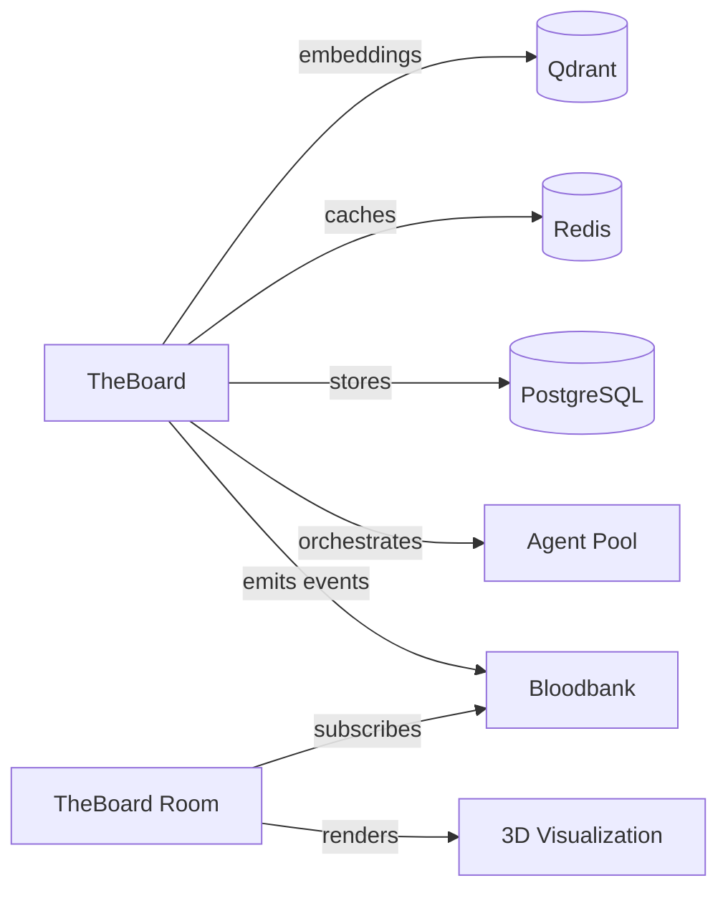

# Domain: Meeting & Collaboration

> Multi-agent brainstorming. Where ideas converge (or don't).

## Services

| Service | Role | Tech Stack | Status |
|---------|------|------------|--------|
| **TheBoard** | Multi-agent brainstorming simulation system | Python 3.12+, FastAPI, Agno, PostgreSQL, Redis, Qdrant | Active |
| **TheBoard Room** | Real-time 3D visualization for meetings | TypeScript, PlayCanvas, Vite, Bun | Active |

## High-Level Purpose

This domain handles multi-agent collaborative sessions. TheBoard orchestrates multi-round agent discussions with convergence detection, context compression, and cost tracking. TheBoard Room provides an immersive 3D visualization of meetings in progress (circular table, avatars, speaking indicators).

## Key Contracts

- **Meeting Lifecycle**: created → started → round_completed → converged → completed
- **Event Types**: `theboard.meeting.*` published to Bloodbank
- **Visualization Protocol**: WebSocket events for real-time 3D updates

## Interconnections

## When to Include This Context

Pass this domain when:
- Working on meeting features or agent coordination
- Debugging convergence detection or context compression
- Extending the 3D visualization
- Adding new meeting trigger types

## Technical Quick Reference

| Service | Port | Docs | Database |
|---------|------|------|----------|
| TheBoard | 8000 | /docs | PostgreSQL:5433, Redis:6380, Qdrant:6333 |
| TheBoard Room | (Vite dev) | N/A | N/A |

## Key Concepts

### TheBoard Meeting Flow
1. **Creation**: CLI wizard or trigger event
2. **Rounds**: Agents contribute in turns
3. **Compression**: 3-tier context reduction (clustering, LLM merge, outlier removal)
4. **Convergence**: Automatic detection when consensus reached
5. **Completion**: Final summary and cost report

### Context Compression Tiers
- **Tier 1**: Semantic clustering of similar contributions
- **Tier 2**: LLM-based summarization of clusters
- **Tier 3**: Outlier removal for noise reduction

### Trigger Events
- `theboard.meeting.trigger`
- `feature.brainstorm.requested`
- `architecture.review.needed`
- `incident.postmortem.scheduled`
- `decision.analysis.required`

## Key Files

- `/home/delorenj/code/33GOD/theboard/trunk-main/` - Meeting orchestration
- `/home/delorenj/code/33GOD/theboardroom/trunk-main/` - 3D visualization

## Last Sync

<!-- degenerate:sync-marker -->
Commit: (pending initial sync)
Date: (pending initial sync)
