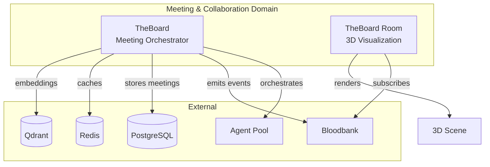
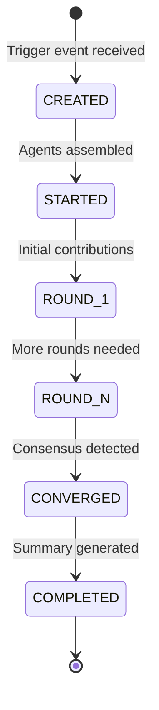

# Meeting & Collaboration Domain - GOD Document

> **Guaranteed Organizational Document** - Developer-facing reference for the Meeting & Collaboration domain
>
> **Last Updated**: 2026-02-01
> **Components**: 2

---

## Domain Overview

The Meeting & Collaboration domain orchestrates **multi-agent brainstorming sessions** with convergence detection, context compression, and immersive 3D visualization.

**Core Responsibility**: Enable structured multi-agent discussions that converge on decisions while managing context and cost.

**Architectural Philosophy**: "Ideas Converge Through Rounds"

---

## Component Map



---

## Components

### TheBoard

**Purpose**: Multi-agent brainstorming orchestrator with convergence detection and context compression

**Type**: Orchestrator / Meeting Manager
**Status**: Active

**Key Events:**
- **Emits**: `theboard.meeting.started`, `theboard.round.completed`, `theboard.meeting.converged`, `theboard.meeting.ended`
- **Consumes**: `theboard.meeting.trigger`, `feature.brainstorm.requested`, `architecture.review.needed`

**Interfaces:**
- CLI: `theboard start --topic "<description>"`
- REST API: `http://localhost:8000`
- Database: PostgreSQL (meetings), Redis (cache), Qdrant (embeddings)

[📄 Component GOD Doc](../../theboard/GOD.md) _(To be created)_

---

### TheBoard Room

**Purpose**: Real-time 3D visualization of meetings in progress (circular table, avatars, speaking indicators)

**Type**: UI / Visualization
**Status**: Active

**Key Events:**
- **Emits**: None (read-only visualization)
- **Consumes**: `theboard.*.*` (all TheBoard events)

**Interfaces:**
- Web UI: Vite dev server
- 3D Engine: PlayCanvas
- WebSocket: Live event stream for updates

[📄 Component GOD Doc](../../theboardroom/GOD.md)

---

## Domain Event Contracts

### Cross-Component Events

Events that flow between components within this domain:

| Event | Producer | Consumer(s) | Purpose |
|-------|----------|-------------|---------|
| `theboard.meeting.started` | TheBoard | TheBoard Room | Initialize 3D visualization |
| `theboard.round.completed` | TheBoard | TheBoard Room | Update agent speaking indicators |
| `theboard.meeting.converged` | TheBoard | TheBoard Room | Display convergence animation |

### External Event Interfaces

Events exchanged with other domains:

| Event | Direction | External Domain | Purpose |
|-------|-----------|-----------------|---------|
| `feature.brainstorm.requested` | Inbound | Agent Orchestration | Trigger feature brainstorm meeting |
| `architecture.review.needed` | Inbound | Development Tools | Trigger architecture review meeting |
| `theboard.meeting.*` | Outbound | Infrastructure | Track meeting lifecycle |
| `theboard.summary.generated` | Outbound | Development Tools | Store meeting notes |

---

## Meeting Lifecycle



**Convergence Detection:**
- Semantic similarity of contributions (Qdrant embeddings)
- Outlier removal (contributions far from consensus)
- Cost threshold (meeting budget exhausted)

---

## Context Compression Tiers

TheBoard uses a 3-tier compression strategy to manage token costs:

### Tier 1: Semantic Clustering
- Cluster similar contributions using Qdrant
- Identify central themes
- Group redundant ideas

### Tier 2: LLM-Based Summarization
- Summarize each cluster with LLM
- Extract key points from grouped contributions
- Reduce token count while preserving meaning

### Tier 3: Outlier Removal
- Remove contributions far from consensus
- Filter noise and tangential ideas
- Focus on converging themes

**Compression Trigger**: Token count exceeds threshold (default: 10k tokens)

---

## Meeting Trigger Events

TheBoard can be triggered by multiple event types:

| Event | Purpose | Example Use Case |
|-------|---------|------------------|
| `theboard.meeting.trigger` | Generic manual trigger | CLI: `theboard start` |
| `feature.brainstorm.requested` | Feature design discussion | Agent needs input on feature approach |
| `architecture.review.needed` | Architecture review | Major system change requires review |
| `incident.postmortem.scheduled` | Post-incident analysis | Production incident retrospective |
| `decision.analysis.required` | Decision tree exploration | Critical decision with multiple options |

---

## Shared Infrastructure

### PostgreSQL Schema

```sql
CREATE TABLE meetings (
    id UUID PRIMARY KEY,
    topic TEXT NOT NULL,
    status TEXT NOT NULL,  -- CREATED, STARTED, CONVERGED, COMPLETED
    created_at TIMESTAMP,
    completed_at TIMESTAMP,
    total_cost DECIMAL,
    convergence_score FLOAT
);

CREATE TABLE rounds (
    id UUID PRIMARY KEY,
    meeting_id UUID REFERENCES meetings(id),
    round_number INT,
    contributions JSONB,  -- Agent contributions
    compression_applied BOOLEAN
);
```

### Qdrant Collection

```python
# Contributions embeddings for semantic clustering
collection_name = "meeting_contributions"
vector_size = 1536  # OpenAI ada-002 embeddings
distance_metric = "Cosine"
```

---

## Development Guidelines

### Starting a Meeting via CLI

```bash
# Manual trigger
theboard start --topic "Redesign authentication flow" \
               --agents "architect,security-expert,backend-dev,frontend-dev" \
               --rounds 5

# Triggered by event
# Event: feature.brainstorm.requested
# Payload: { "feature": "user authentication", "context": "..." }
```

### Implementing a Custom Trigger

```python
# Define trigger event in holyfields/schemas/
{
  "event_type": "custom.trigger.type",
  "payload": {
    "meeting_topic": "string",
    "required_roles": ["string"],
    "max_rounds": "integer"
  }
}

# Subscribe in TheBoard
@bloodbank.subscribe("custom.trigger.type")
async def handle_custom_trigger(event: EventEnvelope):
    await start_meeting(
        topic=event.payload["meeting_topic"],
        agents=event.payload["required_roles"],
        max_rounds=event.payload["max_rounds"]
    )
```

### Visualizing Meetings in TheBoard Room

```javascript
// TheBoard Room subscribes to events via WebSocket
const ws = new WebSocket('ws://localhost:8000/events');

ws.on('message', (event) => {
  if (event.type === 'theboard.round.completed') {
    updateAgentSpeakingIndicator(event.agent_id);
    renderContributions(event.contributions);
  }
});
```

---

## References

- **System Doc**: `../../GOD.md`
- **Source Domain Docs**: `meeting-collaboration.md`, `applications.md`
- **TheBoard API**: `http://localhost:8000/docs`
