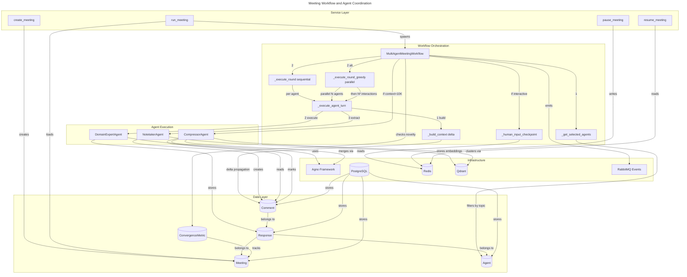
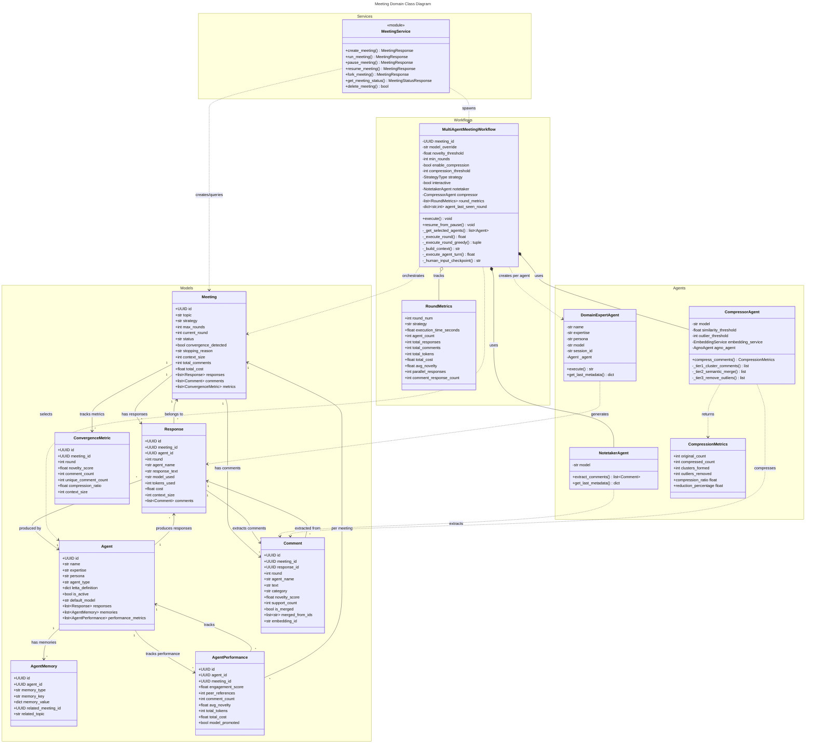

# C4 Code Level: Meeting & Collaboration Domain

## Overview
- **Name**: Meeting & Collaboration Domain
- **Description**: Multi-agent brainstorming system orchestrating AI agents through structured meeting workflows with convergence detection, context compression, and event-driven coordination
- **Location**: `/home/delorenj/code/33GOD/theboard/trunk-main/src/theboard`
- **Language**: Python 3.12+
- **Purpose**: Enable collaborative AI agent discussions with intelligent context management, semantic compression, and real-time event streaming

## Code Elements

### Core Domain Models (`models/meeting.py`)

#### `Meeting` Class
```python
class Meeting(Base):
    # Primary attributes
    id: UUID
    topic: str  # 10-500 chars
    strategy: str  # "sequential" | "greedy"
    max_rounds: int  # 1-10
    current_round: int
    status: str  # "created" | "running" | "paused" | "completed" | "failed"
    convergence_detected: bool
    stopping_reason: str | None
    model_override: str | None  # CLI --model flag

    # Metrics
    context_size: int
    total_comments: int
    total_cost: float

    # Relationships
    responses: list["Response"]
    comments: list["Comment"]
    convergence_metrics: list["ConvergenceMetric"]
```
- **Description**: Represents a brainstorming meeting session with multi-round execution tracking
- **Location**: `/home/delorenj/code/33GOD/theboard/trunk-main/src/theboard/models/meeting.py:21-73`
- **Key Features**:
  - State machine pattern (created → running → paused/completed/failed)
  - Supports sequential and greedy execution strategies
  - Convergence detection via novelty threshold
  - Cost and token usage tracking
- **Dependencies**: SQLAlchemy Base, PostgreSQL UUID support

#### `Agent` Class
```python
class Agent(Base):
    # Identity
    id: UUID
    name: str  # unique
    expertise: str
    persona: str | None
    background: str | None

    # Configuration
    agent_type: str  # "plaintext" | "letta"
    letta_definition: dict | None  # JSONB
    is_active: bool
    default_model: str

    # Relationships
    responses: list["Response"]
    memories: list["AgentMemory"]
    performance_metrics: list["AgentPerformance"]
```
- **Description**: AI agent definition with expertise, persona, and configuration
- **Location**: `/home/delorenj/code/33GOD/theboard/trunk-main/src/theboard/models/meeting.py:75-116`
- **Key Features**:
  - Topic-based selection using keyword matching
  - Letta integration support (future: stateful agents)
  - Performance tracking per meeting
  - Model preference hierarchy
- **Dependencies**: SQLAlchemy, JSONB for structured config

#### `Response` Class
```python
class Response(Base):
    # Foreign keys
    meeting_id: UUID
    agent_id: UUID

    # Content
    round: int
    agent_name: str
    response_text: str

    # Metrics
    model_used: str
    tokens_used: int
    cost: float
    context_size: int

    # Relationships
    meeting: Meeting
    agent: Agent
    comments: list["Comment"]
```
- **Description**: Single agent response in a meeting round with token tracking
- **Location**: `/home/delorenj/code/33GOD/theboard/trunk-main/src/theboard/models/meeting.py:118-159`
- **Dependencies**: Meeting, Agent (cascade on delete)

#### `Comment` Class
```python
class Comment(Base):
    # Foreign keys
    meeting_id: UUID
    response_id: UUID

    # Content
    round: int
    agent_name: str
    text: str
    category: str  # "technical_decision" | "risk" | "implementation_detail" | "question" | "concern" | "suggestion" | "other"

    # Metrics
    novelty_score: float  # 0-1, for convergence detection
    support_count: int  # >1 for merged comments
    is_merged: bool
    merged_from_ids: list[str] | None
    embedding_id: str | None  # Qdrant vector ID
```
- **Description**: Extracted structured insight from agent response with novelty tracking
- **Location**: `/home/delorenj/code/33GOD/theboard/trunk-main/src/theboard/models/meeting.py:161-209`
- **Key Features**:
  - Semantic categories for structured analysis
  - Novelty scoring for convergence detection
  - Support count for merged comments (compression tier 2)
  - Vector embedding reference for similarity search
- **Dependencies**: Response (cascade delete), Qdrant for embeddings

#### `ConvergenceMetric` Class
```python
class ConvergenceMetric(Base):
    meeting_id: UUID
    round: int
    novelty_score: float
    comment_count: int
    unique_comment_count: int
    compression_ratio: float | None
    context_size: int
```
- **Description**: Tracks convergence metrics per meeting round for early stopping
- **Location**: `/home/delorenj/code/33GOD/theboard/trunk-main/src/theboard/models/meeting.py:211-241`

#### `AgentMemory` Class
```python
class AgentMemory(Base):
    agent_id: UUID
    memory_type: str  # "previous_meeting" | "learned_pattern" | "decision"
    memory_key: str
    memory_value: dict  # JSONB
    related_meeting_id: UUID | None
    related_topic: str | None
```
- **Description**: Cross-meeting agent memory for learning and context retention
- **Location**: `/home/delorenj/code/33GOD/theboard/trunk-main/src/theboard/models/meeting.py:243-280`
- **Future**: Letta integration for persistent agent state

#### `AgentPerformance` Class
```python
class AgentPerformance(Base):
    agent_id: UUID
    meeting_id: UUID
    engagement_score: float
    peer_references: int
    comment_count: int
    avg_novelty: float
    total_tokens: int
    total_cost: float
    model_promoted: bool  # Promoted to higher-tier model
    promoted_at_round: int | None
```
- **Description**: Tracks agent performance metrics per meeting for model promotion
- **Location**: `/home/delorenj/code/33GOD/theboard/trunk-main/src/theboard/models/meeting.py:282-320`

### Service Layer (`services/meeting_service.py`)

#### `create_meeting()`
```python
def create_meeting(
    topic: str,
    strategy: StrategyType,
    max_rounds: int,
    agent_count: int,
    auto_select: bool,
    model_override: str | None = None,
) -> MeetingResponse:
```
- **Description**: Creates new brainstorming meeting with validation
- **Location**: `/home/delorenj/code/33GOD/theboard/trunk-main/src/theboard/services/meeting_service.py:28-91`
- **Validation**:
  - Topic: 10-500 characters
  - Max rounds: 1-10
  - Agent count: 1-10
- **Dependencies**: Database session, Meeting model

#### `run_meeting()`
```python
def run_meeting(
    meeting_id: UUID,
    interactive: bool,
    rerun: bool = False
) -> MeetingResponse:
```
- **Description**: Executes meeting workflow with session management
- **Location**: `/home/delorenj/code/33GOD/theboard/trunk-main/src/theboard/services/meeting_service.py:93-223`
- **Key Pattern**: Close DB session before workflow execution to prevent connection pool exhaustion
- **Dependencies**: MultiAgentMeetingWorkflow, SimpleMeetingWorkflow

#### `resume_meeting()`
```python
def resume_meeting(
    meeting_id: UUID,
    steering_context: str | None = None,
    interactive: bool = True,
) -> MeetingResponse:
```
- **Description**: Resumes paused meeting with optional human steering
- **Location**: `/home/delorenj/code/33GOD/theboard/trunk-main/src/theboard/services/meeting_service.py:225-305`
- **Sprint 4 Story 12**: Human-in-the-loop functionality
- **Dependencies**: Redis pause state, MultiAgentMeetingWorkflow

#### `pause_meeting()`
```python
def pause_meeting(meeting_id: UUID) -> MeetingResponse:
```
- **Description**: Pauses running meeting via Redis action flag
- **Location**: `/home/delorenj/code/33GOD/theboard/trunk-main/src/theboard/services/meeting_service.py:307-347`

#### `add_steering_context()`
```python
def add_steering_context(meeting_id: UUID, steering_text: str) -> bool:
```
- **Description**: Adds human steering text to paused or running meeting
- **Location**: `/home/delorenj/code/33GOD/theboard/trunk-main/src/theboard/services/meeting_service.py:349-387`

#### `fork_meeting()`
```python
def fork_meeting(meeting_id: UUID) -> MeetingResponse:
```
- **Description**: Creates new meeting with same parameters (experimental branching)
- **Location**: `/home/delorenj/code/33GOD/theboard/trunk-main/src/theboard/services/meeting_service.py:389-441`

#### `get_meeting_status()`
```python
def get_meeting_status(meeting_id: UUID) -> MeetingStatusResponse:
```
- **Description**: Retrieves detailed meeting state with responses, comments, metrics
- **Location**: `/home/delorenj/code/33GOD/theboard/trunk-main/src/theboard/services/meeting_service.py:471-551`
- **Dependencies**: SQLAlchemy joinedload for relationship eager loading

### Workflow Orchestration

#### `MultiAgentMeetingWorkflow` Class
```python
class MultiAgentMeetingWorkflow:
    def __init__(
        self,
        meeting_id: UUID,
        model_override: str | None = None,
        novelty_threshold: float = 0.3,
        min_rounds: int = 2,
        enable_compression: bool = True,
        compression_threshold: int = 10000,
        strategy: StrategyType = StrategyType.SEQUENTIAL,
        interactive: bool = False,
        human_input_timeout: int = 300,
    ):
        # Agents
        self.notetaker: NotetakerAgent
        self.compressor: CompressorAgent | None

        # Tracking
        self.round_metrics: list[RoundMetrics]
        self.agent_last_seen_round: dict[str, int]  # Delta propagation
        self.steering_context: str | None
```
- **Description**: Multi-agent orchestration with convergence detection and compression
- **Location**: `/home/delorenj/code/33GOD/theboard/trunk-main/src/theboard/workflows/multi_agent_meeting.py:89-178`
- **Key Features**:
  - Sequential vs greedy execution strategies
  - Context compression (lazy, threshold-based)
  - Delta context propagation (40% token savings)
  - Human-in-the-loop checkpoints
  - Performance benchmarking

##### `execute()` Method
```python
async def execute(self) -> None:
```
- **Description**: Main workflow execution loop with session management
- **Location**: `/home/delorenj/code/33GOD/theboard/trunk-main/src/theboard/workflows/multi_agent_meeting.py:453-725`
- **Workflow**:
  1. Load meeting and select agents (topic-based keyword matching)
  2. For each round (1 to max_rounds):
     - Build context (full or delta)
     - Execute agents (sequential or greedy)
     - Extract and store comments
     - Compress if context > threshold (lazy compression)
     - Check convergence (novelty < threshold after min_rounds)
     - Human checkpoint if interactive
  3. Update meeting status
  4. Emit events
- **Session Pattern**: Close DB session before LLM calls, reopen for storage

##### `_get_selected_agents()` Method
```python
async def _get_selected_agents(self, db, topic: str) -> list[Agent]:
```
- **Description**: Topic-based agent selection using keyword matching
- **Location**: `/home/delorenj/code/33GOD/theboard/trunk-main/src/theboard/workflows/multi_agent_meeting.py:726-824`
- **Algorithm**:
  1. Extract keywords from topic (remove stopwords)
  2. Tokenize agent expertise/persona/background
  3. Count keyword matches using word boundaries
  4. Calculate relevance score (matches / total_keywords)
  5. Return agents sorted by relevance (highest first)

##### `_execute_round()` Method (Sequential)
```python
async def _execute_round(
    self,
    agents: list[Agent],
    round_num: int
) -> float:
```
- **Description**: Sequential execution (agents take turns)
- **Location**: `/home/delorenj/code/33GOD/theboard/trunk-main/src/theboard/workflows/multi_agent_meeting.py:825-930`
- **Complexity**: O(N) where N = agent count

##### `_execute_round_greedy()` Method
```python
async def _execute_round_greedy(
    self,
    agents: list[Agent],
    round_num: int
) -> tuple[float, RoundMetrics]:
```
- **Description**: Greedy parallel execution with asyncio.gather
- **Location**: `/home/delorenj/code/33GOD/theboard/trunk-main/src/theboard/workflows/multi_agent_meeting.py:1173-1459`
- **Sprint 4 Story 11**: Parallel execution strategy
- **Phases**:
  1. **Parallel Response Phase**: All N agents respond simultaneously
  2. **Comment-Response Phase**: N² interactions (each agent responds to others)
- **Complexity**: O(N²) responses, but faster wall-clock time due to parallelism
- **Trade-off**: 2.8-4.4x faster execution, but higher token cost

##### `_build_context()` Method
```python
async def _build_context(
    self,
    current_round: int,
    agent_id: str | None = None
) -> str:
```
- **Description**: Builds cumulative context with delta propagation
- **Location**: `/home/delorenj/code/33GOD/theboard/trunk-main/src/theboard/workflows/multi_agent_meeting.py:931-1005`
- **Sprint 5 Story 16**: Delta propagation for token efficiency
- **Formula**:
  - **Full context**: Topic + Σ(Comments from rounds 1 to r-1)
  - **Delta context**: Topic + Σ(Comments from rounds last_seen+1 to r-1)
- **Optimization**: 40% token reduction in multi-round meetings

##### `_execute_agent_turn()` Method
```python
async def _execute_agent_turn(
    self,
    agent: Agent,
    context: str,
    round_num: int
) -> float:
```
- **Description**: Single agent turn with LLM call and comment extraction
- **Location**: `/home/delorenj/code/33GOD/theboard/trunk-main/src/theboard/workflows/multi_agent_meeting.py:1006-1172`
- **Session Pattern**:
  1. Extract agent data (no session needed)
  2. Execute LLM calls WITHOUT holding session
  3. Store results in new session
- **Dependencies**: DomainExpertAgent (Agno), NotetakerAgent, EmbeddingService

##### `_human_input_checkpoint()` Method
```python
async def _human_input_checkpoint(
    self,
    round_num: int,
    avg_novelty: float,
    topic: str
) -> str:
```
- **Description**: Waits for human input with timeout (Sprint 4 Story 12)
- **Location**: `/home/delorenj/code/33GOD/theboard/trunk-main/src/theboard/workflows/multi_agent_meeting.py:229-319`
- **Actions**: "continue" | "stop" | "paused" | "modify_context"
- **Dependencies**: Redis for action state

#### `SimpleMeetingWorkflow` Class
```python
class SimpleMeetingWorkflow:
    def __init__(
        self,
        meeting_id: UUID,
        model_override: str | None = None
    ):
        self.notetaker: NotetakerAgent
```
- **Description**: Sprint 1 MVP workflow (single agent, single round)
- **Location**: `/home/delorenj/code/33GOD/theboard/trunk-main/src/theboard/workflows/simple_meeting.py:23-262`
- **Use Case**: Testing and development only

### Agent Layer

#### `DomainExpertAgent` Class
```python
class DomainExpertAgent:
    def __init__(
        self,
        name: str,
        expertise: str,
        persona: str | None = None,
        background: str | None = None,
        model: str | None = None,
        session_id: str | None = None,
    ):
        self._agent: Agent  # Agno Agent instance
```
- **Description**: Expert agent using Agno framework for brainstorming
- **Location**: `/home/delorenj/code/33GOD/theboard/trunk-main/src/theboard/agents/domain_expert.py:22-98`
- **Framework**: Agno (automatic session persistence, conversation history)
- **Dependencies**: Agno Agent, PreferencesManager

##### `execute()` Method
```python
async def execute(self, context: str, **kwargs: Any) -> str:
```
- **Description**: Generates expert response using Agno Agent.run()
- **Location**: `/home/delorenj/code/33GOD/theboard/trunk-main/src/theboard/agents/domain_expert.py:99-161`
- **Pattern**: Agno handles conversation history automatically via session_id
- **Returns**: Response text string

##### `get_last_metadata()` Method
```python
def get_last_metadata(self) -> dict[str, Any]:
```
- **Description**: Extracts token usage and cost from last execution
- **Location**: `/home/delorenj/code/33GOD/theboard/trunk-main/src/theboard/agents/domain_expert.py:162-176`
- **Returns**: `{"tokens_used", "cost", "model", "input_tokens", "output_tokens"}`

#### `NotetakerAgent` Class
```python
class NotetakerAgent:
    async def extract_comments(
        self,
        response_text: str,
        agent_name: str
    ) -> list[Comment]:
```
- **Description**: Extracts structured comments from agent responses
- **Location**: `/home/delorenj/code/33GOD/theboard/trunk-main/src/theboard/agents/notetaker.py`
- **Categories**: `technical_decision`, `risk`, `implementation_detail`, `question`, `concern`, `suggestion`, `other`
- **Novelty**: Scores 0-1 for convergence detection

#### `CompressorAgent` Class
```python
class CompressorAgent:
    def __init__(
        self,
        model: str | None = None,
        similarity_threshold: float = 0.85,
        outlier_threshold: int = 2,
    ):
        self.agno_agent: AgnoAgent | None
        self.embedding_service: EmbeddingService
```
- **Description**: Three-tier context compression (Sprint 3 Story 9)
- **Location**: `/home/delorenj/code/33GOD/theboard/trunk-main/src/theboard/agents/compressor.py:76-125`

##### `compress_comments()` Method
```python
def compress_comments(
    self,
    meeting_id: UUID,
    round_num: int,
) -> CompressionMetrics:
```
- **Description**: Compresses comments using three-tier strategy
- **Location**: `/home/delorenj/code/33GOD/theboard/trunk-main/src/theboard/agents/compressor.py:122-202`
- **Three-Tier Strategy**:
  1. **Tier 1 - Graph Clustering**: Cosine similarity ≥ 0.85 using NetworkX connected components
  2. **Tier 2 - LLM Semantic Merge**: Merge clusters using Claude Haiku
  3. **Tier 3 - Outlier Removal**: Remove comments with support_count < 2
- **Result**: 40-60% token reduction, preserves information quality

##### `_tier1_cluster_comments()` Method
```python
def _tier1_cluster_comments(
    self,
    comments: list[Comment],
) -> list[list[Comment]]:
```
- **Description**: Graph-based clustering using embeddings
- **Location**: `/home/delorenj/code/33GOD/theboard/trunk-main/src/theboard/agents/compressor.py:203-258`
- **Algorithm**:
  1. Compute pairwise similarity matrix (Qdrant)
  2. Model as graph: nodes = comments, edges = similarity ≥ threshold
  3. Find connected components (NetworkX)
  4. Return multi-comment clusters + singletons
- **Complexity**: O(N+E) where N = comments, E = similar pairs

##### `_tier2_semantic_merge()` Method
```python
def _tier2_semantic_merge(
    self,
    clusters: list[list[Comment]],
    meeting_id: UUID,
    round_num: int,
    db,
) -> list[Comment]:
```
- **Description**: LLM-based semantic merging of clusters
- **Location**: `/home/delorenj/code/33GOD/theboard/trunk-main/src/theboard/agents/compressor.py:259-308`
- **Pattern**: Skip singleton clusters (optimization)

##### `_merge_cluster_with_llm()` Method
```python
def _merge_cluster_with_llm(
    self,
    cluster: list[Comment],
    meeting_id: UUID,
    round_num: int,
    db,
) -> Comment:
```
- **Description**: Merges single cluster using Agno LLM call
- **Location**: `/home/delorenj/code/33GOD/theboard/trunk-main/src/theboard/agents/compressor.py:309-388`
- **Output**: New Comment with `support_count = len(cluster)`

##### `_tier3_remove_outliers()` Method
```python
def _tier3_remove_outliers(
    self,
    comments: list[Comment],
) -> list[Comment]:
```
- **Description**: Removes comments with support_count < threshold
- **Location**: `/home/delorenj/code/33GOD/theboard/trunk-main/src/theboard/agents/compressor.py:389-417`

### Meeting Trigger Service (`services/theboard-meeting-trigger`)

#### `MeetingCreator` Class
```python
class MeetingCreator:
    def __init__(self):
        self.engine: Engine  # SQLAlchemy engine
        self.SessionLocal: sessionmaker
```
- **Description**: Creates meetings via direct database access (service-to-service)
- **Location**: `/home/delorenj/code/33GOD/services/theboard-meeting-trigger/src/theboard_meeting_trigger/meeting_creator.py:27-41`

##### `create_meeting_from_trigger()` Method
```python
def create_meeting_from_trigger(
    self,
    payload: MeetingTriggerPayload
) -> tuple[UUID, str]:
```
- **Description**: Creates meeting from event payload
- **Location**: `/home/delorenj/code/33GOD/services/theboard-meeting-trigger/src/theboard_meeting_trigger/meeting_creator.py:42-84`
- **Dependencies**: TheBoard database (direct access pattern)

#### `MeetingTriggerPayload` Model
```python
class MeetingTriggerPayload(BaseModel):
    topic: str  # 10-500 chars
    strategy: Literal["sequential", "greedy"]
    max_rounds: int  # 1-10
    agent_count: int  # 1-10
    model: str | None
    requester: str | None
    context: dict[str, str] | None
```
- **Description**: Pydantic model for event-driven meeting creation
- **Location**: `/home/delorenj/code/33GOD/services/theboard-meeting-trigger/src/theboard_meeting_trigger/models.py:9-51`

## Dependencies

### Internal Dependencies
- **Database Layer**: `theboard.database.get_sync_db()` - Session management
- **Models**: `theboard.models.meeting` - SQLAlchemy ORM models
- **Schemas**: `theboard.schemas` - Pydantic validation models
- **Preferences**: `theboard.preferences.PreferencesManager` - Model selection hierarchy
- **Events**: `theboard.events` - Event emission (RabbitMQ/null)
- **Utils**: `theboard.utils.redis_manager` - Pause state, caching

### External Dependencies
- **Agno**: Agent framework for LLM orchestration
  - `agno.agent.Agent` - Base agent with session persistence
  - Handles conversation history, token tracking
- **SQLAlchemy 2.0+**: ORM for PostgreSQL
  - Async support (partial migration)
  - JSONB columns for structured data
- **PostgreSQL**: Primary database (port 5433 locally)
- **Redis**: Cache, pause state (port 6380 locally)
- **RabbitMQ**: Event bus (port 5673 locally)
- **Qdrant**: Vector database for embeddings (ports 6333/6334)
- **sentence-transformers**: `all-MiniLM-L6-v2` for embeddings
- **NetworkX**: Graph algorithms for clustering

## Relationships

### Meeting Lifecycle and Agent Coordination



### Object-Oriented Class Relationships



### Data Flow: Meeting Execution

```mermaid
---
title: Meeting Execution Data Pipeline
---
flowchart LR
    subgraph Input
        topic[Topic String]
        strategy[Strategy sequential/greedy]
        params[Parameters max_rounds, agent_count]
    end

    subgraph "Agent Selection"
        keywords[Extract Keywords]
        match[Match Agent Expertise]
        rank[Rank by Relevance]
    end

    subgraph "Round Execution"
        context[Build Context topic + prior comments]
        execute[Execute Agents]
        extract[Extract Comments]
        embed[Generate Embeddings]
        check[Check Convergence]
        compress[Compress if needed]
    end

    subgraph "Agent Turn"
        prompt[Build Prompt]
        llm[LLM Call Agno]
        parse[Parse Response]
        categorize[Categorize Comments]
        score[Score Novelty]
    end

    subgraph "Compression"
        cluster[Tier 1: Cluster]
        merge[Tier 2: LLM Merge]
        filter[Tier 3: Remove Outliers]
    end

    subgraph Output
        responses[(Responses)]
        comments[(Comments)]
        metrics[(Metrics)]
        events[Events]
    end

    topic --> keywords
    params --> match
    keywords --> match
    match --> rank
    rank --> context

    context --> execute
    execute --> prompt
    prompt --> llm
    llm --> parse
    parse --> extract

    extract --> categorize
    categorize --> score
    score --> embed
    embed --> check

    check -->|novelty high| context
    check -->|context>10K| compress

    compress --> cluster
    cluster --> merge
    merge --> filter
    filter --> comments

    execute --> responses
    check --> metrics
    responses --> events
    comments --> events
    metrics --> events
```



## Code Examples

### Example 1: Creating and Running a Meeting

```python
from uuid import UUID
from theboard.services.meeting_service import create_meeting, run_meeting
from theboard.schemas import StrategyType

# Create meeting
meeting = create_meeting(
    topic="Design a scalable microservices architecture for e-commerce platform",
    strategy=StrategyType.SEQUENTIAL,
    max_rounds=5,
    agent_count=5,
    auto_select=True,
    model_override="anthropic/claude-sonnet-4"
)

print(f"Created meeting {meeting.id}")

# Run meeting (synchronous from CLI perspective, async internally)
result = run_meeting(
    meeting_id=meeting.id,
    interactive=False,
    rerun=False
)

print(f"Meeting completed: {result.stopping_reason}")
print(f"Total comments: {result.total_comments}")
print(f"Total cost: ${result.total_cost:.4f}")
```

### Example 2: Agent Selection Algorithm

```python
from theboard.workflows.multi_agent_meeting import MultiAgentMeetingWorkflow
from theboard.database import get_sync_db
from sqlalchemy import select
from theboard.models.meeting import Agent
import re

# Topic-based selection algorithm
topic = "Implement distributed tracing and observability for microservices"

# Extract keywords
stopwords = {"a", "and", "for", "the", "in", "of", "to"}
words = re.findall(r'\b\w+\b', topic.lower())
keywords = [w for w in words if w not in stopwords and len(w) > 2]
# Result: ["implement", "distributed", "tracing", "observability", "microservices"]

with get_sync_db() as db:
    agents = db.scalars(select(Agent).where(Agent.is_active == True)).all()

    agent_scores = []
    for agent in agents:
        agent_text = f"{agent.expertise.lower()} {agent.persona.lower() if agent.persona else ''}"
        agent_words = set(re.findall(r'\b\w+\b', agent_text))

        # Count keyword matches
        matches = sum(1 for keyword in keywords if keyword in agent_words)
        relevance_score = matches / len(keywords)

        if matches > 0:
            agent_scores.append((agent, relevance_score, matches))

    # Sort by relevance
    agent_scores.sort(key=lambda x: (x[1], x[2]), reverse=True)
    selected = [agent for agent, score, matches in agent_scores]

    print(f"Selected {len(selected)} agents:")
    for agent, score, matches in agent_scores:
        print(f"  {agent.name}: {matches} matches, {score:.2f} relevance")
```

### Example 3: Multi-Agent Turn with Delta Context

```python
from theboard.workflows.multi_agent_meeting import MultiAgentMeetingWorkflow
from theboard.agents.domain_expert import DomainExpertAgent
from theboard.agents.notetaker import NotetakerAgent

# Initialize workflow
workflow = MultiAgentMeetingWorkflow(
    meeting_id=meeting_id,
    strategy=StrategyType.SEQUENTIAL,
    interactive=False
)

# Agent last seen tracking (delta propagation)
agent_id = "550e8400-e29b-41d4-a716-446655440000"
workflow.agent_last_seen_round[agent_id] = 2  # Agent last saw round 2

# Build delta context for round 4
context = await workflow._build_context(
    current_round=4,
    agent_id=agent_id  # Only include comments from rounds 3-4
)

# Execute agent turn
expert = DomainExpertAgent(
    name="Security Architect",
    expertise="Cybersecurity, threat modeling, secure architecture design",
    model="anthropic/claude-sonnet-4",
    session_id=str(meeting_id)
)

response_text = await expert.execute(context, round_num=4)
metadata = expert.get_last_metadata()

# Extract comments
notetaker = NotetakerAgent(model="anthropic/claude-sonnet-4")
comments = await notetaker.extract_comments(response_text, "Security Architect")

print(f"Generated response: {len(response_text)} chars")
print(f"Token usage: {metadata['tokens_used']} (${metadata['cost']:.4f})")
print(f"Extracted {len(comments)} comments")
for comment in comments:
    print(f"  [{comment.category}] {comment.text[:50]}... (novelty={comment.novelty_score:.2f})")
```

### Example 4: Greedy Parallel Execution

```python
import asyncio
from theboard.workflows.multi_agent_meeting import MultiAgentMeetingWorkflow

# Greedy strategy with parallel execution
workflow = MultiAgentMeetingWorkflow(
    meeting_id=meeting_id,
    strategy=StrategyType.GREEDY,
    interactive=False
)

agents = [agent1, agent2, agent3, agent4, agent5]
round_num = 1

# Phase 1: Parallel responses (N agents simultaneously)
shared_context = await workflow._build_context(round_num, agent_id=None)

async def execute_agent_parallel(agent):
    novelty = await workflow._execute_agent_turn(agent, shared_context, round_num)
    return (agent, novelty)

# Execute all agents in parallel using asyncio.gather
results = await asyncio.gather(
    *[execute_agent_parallel(agent) for agent in agents],
    return_exceptions=True
)

print(f"Phase 1: {len(results)} agents completed in parallel")

# Phase 2: Comment-response (N² interactions)
# Each agent responds to every other agent's comments
comment_response_count = len(agents) * (len(agents) - 1)
print(f"Phase 2: {comment_response_count} comment-responses")

# Result: 2.8-4.4x faster execution, but higher token cost (N → N²)
```

### Example 5: Three-Tier Compression

```python
from theboard.agents.compressor import CompressorAgent

# Initialize compressor
compressor = CompressorAgent(
    model="anthropic/claude-3-haiku-20240307",
    similarity_threshold=0.85,
    outlier_threshold=2
)

# Compress comments for round (only when context > 10K chars)
metrics = compressor.compress_comments(
    meeting_id=meeting_id,
    round_num=3
)

print(f"Compression metrics:")
print(f"  Original comments: {metrics.original_count}")
print(f"  Compressed comments: {metrics.compressed_count}")
print(f"  Clusters formed: {metrics.clusters_formed}")
print(f"  Outliers removed: {metrics.outliers_removed}")
print(f"  Compression ratio: {metrics.compression_ratio:.2f}")
print(f"  Reduction: {metrics.reduction_percentage:.1f}%")

# Example output:
# Original comments: 45
# Compressed comments: 22
# Clusters formed: 8
# Outliers removed: 5
# Compression ratio: 0.49
# Reduction: 51.1%
```

### Example 6: Human-in-the-Loop Checkpoints

```python
from theboard.workflows.multi_agent_meeting import MultiAgentMeetingWorkflow
from theboard.utils.redis_manager import get_redis_manager

# Create interactive workflow
workflow = MultiAgentMeetingWorkflow(
    meeting_id=meeting_id,
    interactive=True,
    human_input_timeout=300  # 5 minutes
)

# Execute with checkpoints after each round
await workflow.execute()

# In another process/terminal, human can interact:
redis = get_redis_manager()

# Option 1: Pause the meeting
action_key = f"meeting:{meeting_id}:human_action"
redis.client.setex(action_key, 300, "pause")

# Option 2: Add steering context
steering_text = "Focus more on scalability concerns and less on security"
redis.client.setex(action_key, 300, f"modify_context:{steering_text}")

# Option 3: Stop the meeting
redis.client.setex(action_key, 300, "stop")

# Resume paused meeting with steering
from theboard.services.meeting_service import resume_meeting

result = resume_meeting(
    meeting_id=meeting_id,
    steering_context="Emphasize cost optimization in next round",
    interactive=True
)
```

### Example 7: Event-Driven Meeting Triggers

```python
from theboard_meeting_trigger.models import MeetingTriggerPayload
from theboard_meeting_trigger.meeting_creator import MeetingCreator

# Service receives event from RabbitMQ
payload = MeetingTriggerPayload(
    topic="Design microservices event bus using Apache Kafka",
    strategy="sequential",
    max_rounds=5,
    agent_count=6,
    model="anthropic/claude-sonnet-4",
    requester="feature-planning-service",
    context={
        "priority": "high",
        "deadline": "2026-02-15"
    }
)

# Create meeting via direct database access
creator = MeetingCreator()
meeting_id, topic = creator.create_meeting_from_trigger(payload)

print(f"Created meeting {meeting_id} from trigger")
print(f"Topic: {topic}")

# Meeting can now be executed by TheBoard service
```

## Architecture Patterns

### Session Management Pattern
**Critical**: Database sessions must be closed before LLM calls to prevent connection pool exhaustion.

```python
# ✓ CORRECT: Short-lived sessions
with get_sync_db() as db:
    meeting = db.query(Meeting).filter_by(id=meeting_id).first()
    topic = meeting.topic
    # Session closes here

# LLM call happens WITHOUT database session
result = await agent.execute(topic)

# New session for storing results
with get_sync_db() as db:
    db.add(Response(...))
    db.commit()
```

### Event-Driven Architecture Pattern
All critical workflow events are emitted to RabbitMQ for external consumers:
- `theboard.meeting.created` - New meeting initialized
- `theboard.meeting.started` - Execution began
- `theboard.meeting.round_completed` - Round finished
- `theboard.meeting.converged` - Convergence detected
- `theboard.meeting.completed` - Meeting finished

### Lazy Compression Pattern
Compression is only triggered when context exceeds threshold (10K chars), reducing unnecessary LLM calls.

### Delta Context Propagation Pattern
Agents track last seen round and only receive new comments, saving 40% tokens in multi-round meetings.

### Model Selection Hierarchy Pattern
Models are resolved in precedence order:
1. CLI `--model` argument
2. Meeting-level `model_override`
3. Agent-level `preferred_model`
4. User preferences (Redis)
5. System default

## Performance Characteristics

### Sequential Strategy
- **Complexity**: O(N×R) where N=agents, R=rounds
- **Execution Time**: Linear in agent count
- **Token Cost**: Optimized with delta context
- **Best For**: Cost-sensitive, deep discussion

### Greedy Strategy
- **Complexity**: O(N²×R) due to comment-response phase
- **Execution Time**: 2.8-4.4x faster (parallel execution)
- **Token Cost**: Higher (N² interactions)
- **Best For**: Time-sensitive, rich agent interaction

### Compression
- **Tier 1 (Clustering)**: O(N²) similarity matrix, O(N+E) graph clustering
- **Tier 2 (LLM Merge)**: O(K) where K=number of clusters
- **Tier 3 (Outlier Removal)**: O(N)
- **Overall**: 40-60% token reduction

## Notes

### Sprint Progression
- **Sprint 1**: Single agent, single round MVP
- **Sprint 2**: Multi-agent orchestration, topic-based selection
- **Sprint 3**: Context compression, embedding service
- **Sprint 4**: Greedy execution, human-in-the-loop
- **Sprint 5**: Delta context propagation, lazy compression

### Future Enhancements
- **Letta Integration**: Stateful agents with cross-meeting memory
- **Real-time 3D Visualization**: PlayCanvas integration (planned in `theboardroom` component)
- **Agent Pool Expansion**: Community-contributed agent definitions
- **Advanced Compression**: GPT-4 for higher quality merging
- **Multi-Model Support**: Dynamic pricing table for accurate cost tracking

### Security Considerations
- Model override only via CLI `--model` flag (no user-facing API)
- Agent definitions validated via Pydantic schemas
- Database connection pooling prevents resource exhaustion
- Redis keys expire automatically (TTL 300s for pause state)

### Known Limitations
- **Async/Sync Boundary**: Partial async migration, some blocking calls remain
- **Bloodbank Path**: Fragile `sys.path.insert` for event emission
- **Model Pricing**: Hardcoded Claude Sonnet 4 pricing, needs dynamic table
- **Coverage**: 28% test coverage, target 70%
