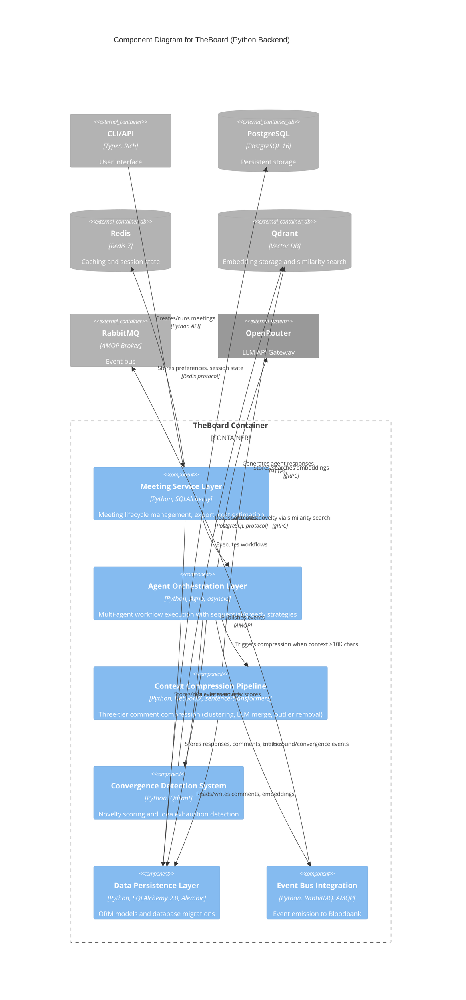
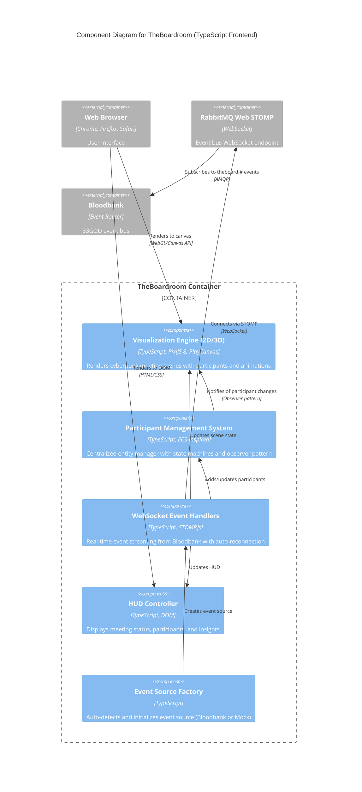
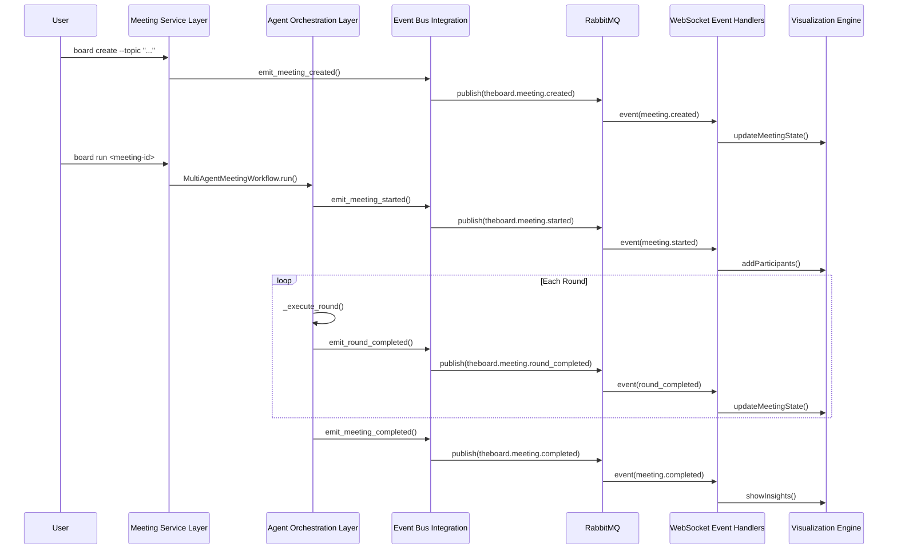

# C4 Component Level: Meeting & Collaboration Domain

## Domain Overview

The Meeting & Collaboration domain orchestrates AI-powered multi-agent brainstorming sessions with real-time 3D/2D visualization. It consists of two primary containers: **TheBoard** (Python backend) and **TheBoardroom** (TypeScript frontend).

---

## Container 1: TheBoard (Python Backend)

### Component Architecture

TheBoard implements a layered architecture with 6 primary components orchestrating multi-agent meetings.

---

## C4 Component 1: Meeting Service Layer

### Overview
- **Name**: Meeting Service Layer
- **Description**: Business logic for meeting lifecycle management
- **Type**: Service Layer
- **Technology**: Python 3.12+, SQLAlchemy 2.0, Pydantic

### Purpose
The Meeting Service Layer manages the complete lifecycle of brainstorming meetings, from creation through execution to completion. It coordinates between the CLI, workflows, and data persistence layers while ensuring proper validation and state management.

### Software Features
- **Meeting Creation**: Create meetings with topic validation (10-500 chars), strategy selection, and model overrides
- **Meeting Execution**: Run meetings with rerun/fork capabilities and status tracking
- **Status Management**: Track meeting status (CREATED, STARTED, ACTIVE, CONVERGED, COMPLETED, FAILED)
- **Export Services**: Export meetings to Markdown, JSON, HTML, or custom Jinja2 templates
- **Cost Estimation**: Calculate meeting costs based on token usage and model pricing
- **Session Safety**: Short-lived database sessions to prevent connection pool exhaustion

### Code Elements
- `src/theboard/services/meeting_service.py` - Core meeting lifecycle management
- `src/theboard/services/export_service.py` - Multi-format export functionality
- `src/theboard/services/cost_estimator.py` - Token cost calculation
- `src/theboard/cli.py` - Typer-based CLI commands (create, run, status, export)
- `src/theboard/cli_commands/wizard.py` - Interactive meeting setup wizard
- `src/theboard/preferences.py` - Model selection hierarchy and user preferences

### Interfaces

#### MeetingManagementAPI
- **Protocol**: Python API (function calls)
- **Description**: Core meeting operations
- **Operations**:
  - `create_meeting(topic, strategy, max_rounds, agent_count, auto_select, model_override): MeetingResponse` - Creates new meeting
  - `run_meeting(meeting_id, interactive, rerun): MeetingResponse` - Executes meeting workflow
  - `get_meeting_status(meeting_id, include_comments, include_metrics): MeetingStatusResponse` - Retrieves status
  - `export_meeting(meeting_id, format, output_file, template): Path` - Exports meeting data
  - `fork_meeting(meeting_id): MeetingResponse` - Creates copy with same configuration

### Dependencies

#### Components Used
- **Agent Orchestration Layer**: Invokes workflow execution
- **Data Persistence Layer**: Stores meetings, agents, responses, comments
- **Event Bus Integration**: Emits meeting lifecycle events to Bloodbank

#### External Systems
- **PostgreSQL**: Meeting data persistence (port 5433)
- **Redis**: User preferences and state caching (port 6380)

---

## C4 Component 2: Agent Orchestration Layer

### Overview
- **Name**: Agent Orchestration Layer
- **Description**: Multi-agent workflow execution with compression and convergence
- **Type**: Workflow Orchestration
- **Technology**: Python 3.12+, Agno Framework, asyncio

### Purpose
Orchestrates multi-round brainstorming sessions with multiple AI agents, implementing sequential and greedy execution strategies. Handles context accumulation, compression, convergence detection, and human-in-the-loop interactions.

### Software Features
- **Sequential Execution**: Agents take turns each round (thorough exploration)
- **Greedy Execution**: Parallel agent responses using asyncio.gather (n² interactions)
- **Multi-Round Orchestration**: Execute 1-10 rounds with context accumulation
- **Agent Selection**: Auto-select relevant agents based on topic embeddings
- **Delta Context Propagation**: Only send new comments since agent's last turn (40-60% token reduction)
- **Human-in-the-Loop**: Interactive steering and feedback during execution
- **Pause/Resume**: Pause meetings and resume from last checkpoint via Redis
- **Performance Benchmarking**: Track token efficiency and execution time across strategies

### Code Elements
- `src/theboard/workflows/multi_agent_meeting.py` - Multi-agent, multi-round workflow orchestration
- `src/theboard/workflows/simple_meeting.py` - Single-agent, single-round workflow (deprecated)
- `src/theboard/agents/base.py` - Base agent interface using Agno framework
- `src/theboard/agents/domain_expert.py` - Domain expert agents for brainstorming
- `src/theboard/agents/notetaker.py` - Notetaker agent for comment extraction
- `src/theboard/services/agent_service.py` - Agent pool management and selection

### Interfaces

#### WorkflowExecutionAPI
- **Protocol**: Python API (async/sync)
- **Description**: Workflow execution and orchestration
- **Operations**:
  - `MultiAgentMeetingWorkflow.__init__(meeting_id, model_override, novelty_threshold, strategy, interactive)` - Initialize workflow
  - `MultiAgentMeetingWorkflow.run(): ExecutionBenchmark` - Execute complete workflow with benchmarks
  - `MultiAgentMeetingWorkflow._execute_round(round_num, agents): RoundMetrics` - Execute single round
  - `MultiAgentMeetingWorkflow._execute_sequential_round(round_num, agents): RoundMetrics` - Sequential strategy
  - `MultiAgentMeetingWorkflow._execute_greedy_round(round_num, agents): RoundMetrics` - Greedy parallel strategy
  - `MultiAgentMeetingWorkflow._check_convergence(round_num): bool` - Detect idea exhaustion

#### AgentAPI
- **Protocol**: Agno Agent Framework
- **Description**: AI agent interface via Agno
- **Operations**:
  - `create_agno_agent(name, role, expertise, instructions, model_id, session_id, output_schema): Agent` - Create configured agent
  - `agent.run(prompt): str | dict` - Execute agent with prompt
  - `extract_agno_metrics(agent): dict` - Extract token usage and costs

### Dependencies

#### Components Used
- **Context Compression Pipeline**: Compresses context when >10K chars
- **Convergence Detection System**: Calculates novelty scores and detects convergence
- **Meeting Service Layer**: Stores responses, comments, metrics
- **Event Bus Integration**: Emits round completion and convergence events

#### External Systems
- **OpenRouter**: LLM API for agent responses (via Agno)
- **PostgreSQL**: Agent pool and response storage
- **Redis**: Session state and pause/resume functionality

---

## C4 Component 3: Context Compression Pipeline

### Overview
- **Name**: Context Compression Pipeline
- **Description**: Three-tier intelligent comment compression system
- **Type**: Data Processing Pipeline
- **Technology**: Python 3.12+, NetworkX, sentence-transformers, Qdrant

### Purpose
Reduces context size by 40-60% while preserving information quality through graph-based clustering, LLM semantic merging, and outlier removal. Prevents token overflow in multi-round meetings.

### Software Features
- **Tier 1 - Graph Clustering**: Embeddings via sentence-transformers with cosine similarity (≥0.85) and NetworkX community detection
- **Tier 2 - LLM Semantic Merge**: CompressorAgent merges clusters using Claude Sonnet, skips singletons
- **Tier 3 - Outlier Removal**: Support-count threshold filters low-signal comments (support <2)
- **Lazy Compression**: Only triggers when context exceeds 10K characters
- **Non-Destructive**: Original comments marked `is_merged=True`, never deleted (audit trail)
- **Metrics Tracking**: Compression ratio, reduction percentage, clusters formed, outliers removed

### Code Elements
- `src/theboard/agents/compressor.py` - CompressorAgent for semantic merging
- `src/theboard/services/embedding_service.py` - Embedding generation and similarity search
- `src/theboard/workflows/multi_agent_meeting.py` - Compression integration and triggering logic

### Interfaces

#### CompressionAPI
- **Protocol**: Python API (sync)
- **Description**: Comment compression operations
- **Operations**:
  - `CompressorAgent.__init__(model, similarity_threshold, outlier_threshold)` - Initialize compressor
  - `CompressorAgent.compress_comments(meeting_id): CompressionMetrics` - Execute full compression pipeline
  - `CompressorAgent._cluster_by_similarity(comments): list[list[Comment]]` - Tier 1: Graph clustering
  - `CompressorAgent._merge_cluster(cluster, meeting_id): Comment` - Tier 2: LLM semantic merge
  - `CompressorAgent._remove_outliers(meeting_id): int` - Tier 3: Outlier removal

#### EmbeddingAPI
- **Protocol**: Python API (sync)
- **Description**: Vector embedding operations
- **Operations**:
  - `EmbeddingService.embed_comments(meeting_id, comments): list[str]` - Generate embeddings in batches
  - `EmbeddingService.find_similar_comments(comment_id, meeting_id, limit, threshold): list[tuple]` - Cosine similarity search
  - `EmbeddingService.get_similarity_matrix(comment_ids): np.ndarray` - Calculate pairwise similarity

### Dependencies

#### Components Used
- **Agent Orchestration Layer**: Invokes compression when threshold exceeded
- **Data Persistence Layer**: Reads/writes comments, embeddings

#### External Systems
- **Qdrant**: Vector storage and similarity search (ports 6333, 6334)
- **OpenRouter**: LLM API for semantic merging

---

## C4 Component 4: Convergence Detection System

### Overview
- **Name**: Convergence Detection System
- **Description**: Embedding-based novelty scoring for idea exhaustion detection
- **Type**: Analytics System
- **Technology**: Python 3.12+, Qdrant, sentence-transformers

### Purpose
Automatically detects when brainstorming ideas are exhausted by calculating novelty scores via cosine similarity between new comments and existing context. Prevents wasted LLM calls when no new insights emerge.

### Software Features
- **Novelty Scoring**: Embeddings via sentence-transformers, cosine similarity with Qdrant vector search
- **Threshold Detection**: Convergence when avg novelty <0.3 (configurable)
- **Minimum Round Protection**: Requires ≥2 rounds before convergence detection
- **Per-Round Metrics**: Tracks avg novelty, convergence score, and comment quality
- **Database Persistence**: Stores convergence metrics for analysis and export
- **Event Emission**: Emits convergence detection events to Bloodbank

### Code Elements
- `src/theboard/workflows/multi_agent_meeting.py` - Convergence detection logic (`_check_convergence()`)
- `src/theboard/services/embedding_service.py` - Novelty score calculation via vector search
- `src/theboard/models/meeting.py` - ConvergenceMetric model for persistence

### Interfaces

#### ConvergenceAPI
- **Protocol**: Python API (internal to workflow)
- **Description**: Convergence detection operations
- **Operations**:
  - `_check_convergence(round_num): bool` - Evaluate convergence conditions
  - `_calculate_novelty_scores(comments): list[float]` - Calculate per-comment novelty
  - `_store_convergence_metrics(round_num, avg_novelty, converged): None` - Persist metrics

#### NoveltyAPI
- **Protocol**: Python API (embedding service)
- **Description**: Novelty score calculation
- **Operations**:
  - `calculate_novelty(comment_text, meeting_id, top_k): float` - Calculate novelty via similarity search
  - `get_novelty_batch(comments, meeting_id): list[float]` - Batch novelty calculation

### Dependencies

#### Components Used
- **Context Compression Pipeline**: Uses embedding service for similarity calculations
- **Data Persistence Layer**: Stores convergence metrics

#### External Systems
- **Qdrant**: Vector similarity search for novelty scoring

---

## C4 Component 5: Data Persistence Layer

### Overview
- **Name**: Data Persistence Layer
- **Description**: SQLAlchemy ORM models with Alembic migrations
- **Type**: Data Access Layer
- **Technology**: Python 3.12+, SQLAlchemy 2.0, PostgreSQL 16, Alembic

### Purpose
Provides persistent storage for meetings, agents, responses, comments, and metrics with type-safe ORM models, database migrations, and short-lived session management.

### Software Features
- **SQLAlchemy 2.0 Models**: Meeting, Agent, Response, Comment, ConvergenceMetric
- **Alembic Migrations**: Version-controlled schema evolution
- **Session Management**: Short-lived sessions with context managers (`get_sync_db()`)
- **Foreign Key Relationships**: Cascade deletes, lazy loading, joinedload optimization
- **Audit Trail**: Timestamps, soft deletes (`is_merged` flag), response metadata
- **Indexing**: Optimized queries for meeting_id, agent_id, round_num

### Code Elements
- `src/theboard/models/meeting.py` - ORM models (Meeting, Agent, Response, Comment, ConvergenceMetric)
- `src/theboard/models/base.py` - Base model with timestamps
- `src/theboard/database.py` - Database connection and session management
- `alembic/versions/*.py` - Database migration scripts

### Interfaces

#### DatabaseAPI
- **Protocol**: Python API (SQLAlchemy ORM)
- **Description**: Data persistence operations
- **Operations**:
  - `get_sync_db(): ContextManager[Session]` - Get database session (short-lived)
  - `Meeting, Agent, Response, Comment, ConvergenceMetric` - ORM models with CRUD operations
  - CRUD operations via SQLAlchemy queries (select, insert, update, delete)

### Dependencies

#### External Systems
- **PostgreSQL**: Primary data store (port 5433, custom port to avoid conflicts)

---

## C4 Component 6: Event Bus Integration

### Overview
- **Name**: Event Bus Integration
- **Description**: RabbitMQ event emission to Bloodbank
- **Type**: Event Producer
- **Technology**: Python 3.12+, RabbitMQ, AMQP

### Purpose
Emits meeting lifecycle events to the 33GOD Bloodbank event bus for real-time visualization, human-in-the-loop orchestration, and external system integration.

### Software Features
- **Event Types**: meeting.created, meeting.started, round_completed, comment_extracted, converged, completed, failed
- **Event Schemas**: Pydantic models for type-safe event payloads
- **Emitter Strategies**: RabbitMQ (production), InMemory (testing), Null (disabled)
- **Correlation IDs**: Request tracing across system boundaries
- **Graceful Fallback**: Falls back to null emitter if RabbitMQ unavailable
- **Fire-and-Forget**: Async emission doesn't block workflow execution

### Code Elements
- `src/theboard/events/emitter.py` - Base event emitter interface
- `src/theboard/events/bloodbank_emitter.py` - RabbitMQ emitter implementation
- `src/theboard/events/schemas.py` - Pydantic event schemas
- `src/theboard/events/__init__.py` - Event factory and convenience functions

### Interfaces

#### EventEmissionAPI
- **Protocol**: Python API (async)
- **Description**: Event publishing operations
- **Operations**:
  - `get_event_emitter(): EventEmitter` - Get configured emitter instance
  - `EventEmitter.emit_meeting_created(meeting_id, topic, max_rounds, strategy)` - Meeting creation event
  - `EventEmitter.emit_meeting_started(meeting_id, selected_agents)` - Meeting start event
  - `EventEmitter.emit_round_completed(meeting_id, round_num, avg_novelty, top_comments)` - Round completion
  - `EventEmitter.emit_meeting_converged(meeting_id, final_round, convergence_score)` - Convergence detected
  - `EventEmitter.emit_meeting_completed(meeting_id, total_rounds, total_comments)` - Meeting completed

### Dependencies

#### External Systems
- **RabbitMQ**: Event bus (port 5673, management 15673, custom ports)
- **Bloodbank**: Event consumer and router in 33GOD ecosystem

---

## TheBoard Component Diagram (Container-Level View)

---

## Container 2: TheBoardroom (TypeScript Frontend)

### Component Architecture

TheBoardroom implements an ECS-inspired architecture with 5 primary components for real-time visualization.

---

## C4 Component 7: Visualization Engine (2D/3D)

### Overview
- **Name**: Visualization Engine (2D/3D)
- **Description**: Rendering engine with PixiJS (2D) and PlayCanvas (3D) support
- **Type**: Rendering System
- **Technology**: TypeScript, PixiJS 8, PlayCanvas, Vite

### Purpose
Renders real-time cyberpunk-themed meeting visualizations showing participants seated around a circular table with visual indicators for speaking state, turn type, and meeting progress.

### Software Features
- **Dual Rendering Modes**: PixiJS for 2D sprite-based rendering (default), PlayCanvas for 3D (legacy)
- **Cyberpunk Aesthetics**: Neon glow effects, grid floors, particle systems, pulsing animations
- **Circular Table Layout**: Participants arranged in circle with 220px radius
- **State-Based Rendering**: Visual states (idle, listening, speaking) with smooth transitions
- **Animation System**: Custom easing functions (pulse, wave), smooth scale/color transitions
- **Performance Optimized**: RequestAnimationFrame loop, batched sprite rendering

### Code Elements
- `src/scenes/BoardroomScene2D.ts` - PixiJS 2D scene with sprite-based rendering
- `src/scenes/BoardroomScene.ts` - PlayCanvas 3D scene (legacy, demo only)
- `src/utils/animations.ts` - Animation manager with easing functions
- `src/main.ts` - Application entry point and mode selection

### Interfaces

#### SceneAPI
- **Protocol**: TypeScript API (class methods)
- **Description**: Scene lifecycle and rendering operations
- **Operations**:
  - `BoardroomScene2D.initialize(canvas: HTMLCanvasElement): Promise<void>` - Initialize PixiJS app
  - `BoardroomScene2D.setParticipantManager(manager: ParticipantManager): void` - Wire up ECS manager
  - `BoardroomScene2D.addParticipant(config): Promise<void>` - Add participant sprite
  - `BoardroomScene2D.updateMeetingState(state): void` - Update meeting status
  - `BoardroomScene2D.render(): void` - Main render loop (called by PixiJS ticker)

#### AnimationAPI
- **Protocol**: TypeScript API
- **Description**: Animation and easing operations
- **Operations**:
  - `AnimationManager.start(id, startValue, endValue, duration, easing, onUpdate)` - Start animation
  - `AnimationManager.stop(id)` - Stop animation
  - `AnimationManager.update()` - Update all active animations (called each frame)
  - `pulse(t): number` - Pulse easing function
  - `wave(t, amplitude, frequency): number` - Wave easing function

### Dependencies

#### Components Used
- **Participant Management System**: Subscribes to participant state changes
- **WebSocket Event Handlers**: Receives state updates from event sources

#### External Systems
- **PixiJS 8**: 2D sprite rendering engine
- **PlayCanvas**: 3D rendering engine (legacy mode)

---

## C4 Component 8: Participant Management System

### Overview
- **Name**: Participant Management System
- **Description**: ECS-inspired participant entity management with observer pattern
- **Type**: Entity Manager
- **Technology**: TypeScript, ECS-inspired architecture

### Purpose
Centralized manager for participant entities with lifecycle management, state machines, circular positioning, and event subscription for renderer decoupling.

### Software Features
- **Entity Lifecycle**: Add, remove, clear participants with automatic position recalculation
- **State Management**: State machines for visual states (idle, listening, speaking)
- **Observer Pattern**: Scenes subscribe to participant changes (added, removed, state_changed, position_changed, cleared)
- **Circular Positioning**: Automatic arrangement in circle with configurable radius
- **Entity-Component System**: Participant entities with position, state, entity components
- **Statistics Tracking**: Participant counts by state (speaking, listening, idle)

### Code Elements
- `src/managers/ParticipantManager.ts` - Central ECS manager for participants
- `src/entities/ParticipantState.ts` - Participant entity, components, state machine
- `src/entities/Participant.ts` - Legacy participant entity (deprecated)

### Interfaces

#### ParticipantManagerAPI
- **Protocol**: TypeScript API (class methods)
- **Description**: Participant lifecycle and state operations
- **Operations**:
  - `ParticipantManager.subscribe(handler): () => void` - Subscribe to changes, returns unsubscribe function
  - `ParticipantManager.addParticipant(config): Participant` - Add participant, triggers 'added' event
  - `ParticipantManager.removeParticipant(name): boolean` - Remove participant, triggers 'removed' event
  - `ParticipantManager.setSpeaking(name, turnType, roundNum): void` - Set speaking state, triggers 'state_changed' event
  - `ParticipantManager.clearParticipants(): void` - Clear all participants, triggers 'cleared' event
  - `ParticipantManager.getAllParticipants(): Participant[]` - Get all participants
  - `ParticipantManager.getStatistics(): Stats` - Get participant statistics

### Dependencies

#### Components Used
- **Visualization Engine**: Notifies scenes of participant changes
- **WebSocket Event Handlers**: Receives participant lifecycle events

---

## C4 Component 9: WebSocket Event Handlers

### Overview
- **Name**: WebSocket Event Handlers
- **Description**: Real-time event streaming from Bloodbank via STOMP-over-WebSocket
- **Type**: Event Consumer
- **Technology**: TypeScript, STOMP.js, RabbitMQ Web STOMP

### Purpose
Connects to Bloodbank RabbitMQ event bus via WebSocket to receive real-time meeting events and update scene/HUD state with auto-reconnection and graceful fallback.

### Software Features
- **STOMP-over-WebSocket**: RabbitMQ Web STOMP plugin connection (port 15674)
- **Event Subscription**: Subscribe to `theboard.#` routing pattern
- **Auto-Reconnection**: Exponential backoff with max 30s delay
- **Graceful Fallback**: Falls back to MockEventSource if Bloodbank unavailable
- **Connection Status**: Reports status to HUD (connecting, connected, disconnected)
- **Event Filtering**: Processes only theboard.* events
- **Demo Mode**: Mock event source for development without Bloodbank

### Code Elements
- `src/events/BloodbankEventSource.ts` - STOMP WebSocket connection to Bloodbank
- `src/events/MockEventSource2D.ts` - Demo mode event simulation (PixiJS)
- `src/events/MockEventSource.ts` - Demo mode event simulation (PlayCanvas, legacy)
- `src/events/EventSourceFactory.ts` - Auto-selects Bloodbank or Mock based on config

### Interfaces

#### EventSourceAPI
- **Protocol**: TypeScript API (class methods)
- **Description**: Event source lifecycle operations
- **Operations**:
  - `BloodbankEventSource.connect(): Promise<void>` - Connect to Bloodbank WebSocket
  - `BloodbankEventSource.disconnect(): void` - Disconnect from Bloodbank
  - `BloodbankEventSource.connected: boolean` - Connection status property
  - `MockEventSource2D.startDemo(): void` - Start demo event loop
  - `createEventSource(scene, hud, manager, options): Promise<EventSource>` - Factory function

#### EventProcessingAPI
- **Protocol**: Internal TypeScript methods
- **Description**: Event processing operations
- **Operations**:
  - `handleMessage(message: IMessage): Promise<void>` - Parse STOMP message
  - `processEvent(envelope: EventEnvelope): Promise<void>` - Process event by type
  - Event handlers for: meeting.created, meeting.started, participant.added, participant.turn.completed, round_completed, converged, completed, failed

### Dependencies

#### Components Used
- **Visualization Engine**: Updates scene state based on events
- **Participant Management System**: Adds/removes/updates participants
- **HUD Controller**: Updates meeting info and status

#### External Systems
- **RabbitMQ Web STOMP**: WebSocket connection (port 15674)
- **Bloodbank**: Event producer in 33GOD ecosystem

---

## C4 Component 10: HUD Controller

### Overview
- **Name**: HUD Controller
- **Description**: DOM-based heads-up display for meeting status and insights
- **Type**: UI Controller
- **Technology**: TypeScript, Vanilla DOM, CSS

### Purpose
Displays real-time meeting information, participant list, speaker status, progress indicators, and post-meeting insights in a cyberpunk-themed overlay.

### Software Features
- **Meeting Info Panel**: Topic, round counter, status indicator
- **Participant List**: Live-updating list with speaking indicators
- **Speaker Indicator**: Shows current speaker and turn type (response/turn)
- **Novelty Meter**: Visual progress bar for convergence tracking
- **Connection Status**: Bloodbank connection indicator (connected/connecting/disconnected)
- **Insights Panel**: Post-meeting analytics (top comments, category distribution, agent participation)
- **Cyberpunk Styling**: Neon colors, glitch effects, monospace fonts

### Code Elements
- `src/ui/HUDController.ts` - DOM-based HUD management

### Interfaces

#### HUDAPI
- **Protocol**: TypeScript API (class methods)
- **Description**: HUD update operations
- **Operations**:
  - `HUDController.setMeetingInfo(topic, maxRounds): void` - Update meeting header
  - `HUDController.setRound(round): void` - Update round counter
  - `HUDController.setMeetingStatus(status): void` - Update status indicator
  - `HUDController.addParticipant(name, role): void` - Add participant to list
  - `HUDController.setSpeaker(name, turnType): void` - Update speaking indicator
  - `HUDController.setNovelty(novelty): void` - Update novelty meter
  - `HUDController.setConnectionStatus(status): void` - Update connection indicator
  - `HUDController.showInsights(insights): void` - Display post-meeting analytics
  - `HUDController.clearParticipants(): void` - Clear participant list

### Dependencies

#### Components Used
- **WebSocket Event Handlers**: Receives HUD update commands from event processing

---

## C4 Component 11: Event Source Factory

### Overview
- **Name**: Event Source Factory
- **Description**: Auto-detects and initializes appropriate event source (Bloodbank or Mock)
- **Type**: Factory / Configuration
- **Technology**: TypeScript, Environment Variables

### Purpose
Automatically selects and initializes the appropriate event source based on environment configuration, with graceful fallback to demo mode when Bloodbank is unavailable.

### Software Features
- **Auto-Detection**: Checks `VITE_BLOODBANK_WS_URL` environment variable
- **Graceful Fallback**: Falls back to MockEventSource if WebSocket URL empty or connection fails
- **URL Parameter Override**: `?source=mock` forces demo mode
- **Demo Badge**: Shows "DEMO MODE" indicator when using mock source
- **Connection Testing**: Attempts Bloodbank connection with timeout before fallback

### Code Elements
- `src/events/EventSourceFactory.ts` - Event source factory and auto-detection

### Interfaces

#### FactoryAPI
- **Protocol**: TypeScript API (functions)
- **Description**: Event source creation operations
- **Operations**:
  - `createEventSource(scene, hud, manager, options): Promise<EventSource>` - Create and initialize event source
  - `isDemoMode(): boolean` - Check if running in demo mode
  - `showDemoBadge(): void` - Display demo mode indicator

### Dependencies

#### Components Used
- **WebSocket Event Handlers**: Creates BloodbankEventSource or MockEventSource2D

---

## TheBoardroom Component Diagram (Container-Level View)

---

## Cross-Container Component Interactions

### Meeting Lifecycle Flow

---

## Technology Stack Summary

### TheBoard (Python Backend)
- **Python 3.12+**: Core language
- **Agno**: Multi-agent framework with session management
- **SQLAlchemy 2.0**: ORM with async support
- **Alembic**: Database migrations
- **Typer + Rich**: CLI with terminal UI
- **sentence-transformers**: Embedding generation
- **NetworkX**: Graph clustering
- **RabbitMQ (pika)**: Event emission
- **PostgreSQL 16**: Persistent storage
- **Redis 7**: Caching and session state
- **Qdrant**: Vector database

### TheBoardroom (TypeScript Frontend)
- **TypeScript**: Type-safe development
- **PixiJS 8**: 2D sprite rendering (primary)
- **PlayCanvas**: 3D rendering (legacy)
- **STOMP.js**: WebSocket client for RabbitMQ
- **Vite**: Build tooling and dev server
- **Bun**: Runtime and package manager
- **HTML5 Canvas**: Rendering target

---

## Deployment Considerations

### TheBoard
- **Docker Compose**: All services containerized
- **Port Mapping**: Custom ports to avoid conflicts (PostgreSQL 5433, Redis 6380, RabbitMQ 5673/15673)
- **Environment Variables**: API keys, connection strings, emitter selection
- **Session Safety**: Short-lived database sessions prevent connection pool exhaustion
- **Event Emitter Strategy**: Configurable (RabbitMQ, InMemory, Null)

### TheBoardroom
- **Static Hosting**: Built assets served via Vite dev server or static CDN
- **Environment Configuration**: `VITE_BLOODBANK_WS_URL`, `VITE_RENDER_MODE`
- **WebSocket Connection**: Direct connection to RabbitMQ Web STOMP (port 15674)
- **Fallback Strategy**: Graceful degradation to demo mode if Bloodbank unavailable

---

## Related Documentation

- **TheBoard**:
  - `theboard/trunk-main/README.md` - Installation, features, usage
  - `theboard/trunk-main/CLAUDE.md` - Development guide for Claude Code
  - `theboard/trunk-main/docs/USER_GUIDE.md` - CLI tutorials and examples
  - `theboard/trunk-main/docs/DEVELOPER.md` - Architecture deep-dive

- **TheBoardroom**:
  - `theboardroom/trunk-main/README.md` - Setup and architecture
  - `theboardroom/trunk-main/CLAUDE.md` - Development guide

- **Domain Documentation**:
  - `docs/domains/meeting-collaboration/c4-code-*.md` - Code-level documentation
  - `docs/domains/meeting-collaboration/c4-container.md` - Container-level architecture (future)
