# C4 Context Level: Meeting & Collaboration System Context

## System Overview

### Short Description
An AI-driven multi-agent brainstorming and meeting orchestration system that simulates collaborative discussions with convergence detection and real-time 3D visualization.

### Long Description
The Meeting & Collaboration domain provides a sophisticated platform for conducting multi-agent brainstorming sessions where specialized AI agents collaborate to explore topics, generate insights, and reach convergence. TheBoard orchestrates multi-round discussions with intelligent agents (Claude, Gemini), extracting and categorizing comments, managing context compression, and detecting when consensus emerges. TheBoardroom provides immersive real-time 3D/2D visualization of meeting participants, speaking indicators, and discussion progress. The system integrates with external transcript sources (Fireflies.ai), manages agent participation patterns, and emits comprehensive event streams for system-wide coordination through the Bloodbank event bus.

## Personas

### Developer/Data Scientist (Human User)
- **Type**: Human User
- **Description**: Technical professionals who need to conduct brainstorming sessions, explore design alternatives, or analyze complex problems using AI agent collaboration
- **Goals**:
  - Conduct efficient multi-agent brainstorming sessions
  - Extract high-quality insights from AI discussions
  - Visualize meeting dynamics and convergence patterns
  - Track costs and performance metrics
- **Key Features Used**: Meeting creation, agent selection, workflow execution, visualization, export

### CLI Operator (Human User)
- **Type**: Human User
- **Description**: Users who manage meetings through command-line interface for automation and scripting
- **Goals**:
  - Automate meeting workflows
  - Integrate with CI/CD pipelines
  - Script batch processing of topics
  - Monitor system health
- **Key Features Used**: CLI commands, configuration management, status monitoring

### Human Meeting Steerer (Human User)
- **Type**: Human User
- **Description**: Active meeting participants who provide real-time steering, constraints, and context modifications during AI discussions
- **Goals**:
  - Influence discussion direction mid-meeting
  - Pause meetings for review
  - Add constraints and requirements
  - Override convergence decisions
- **Key Features Used**: Human-in-the-loop checkpoints, context modification, meeting pause/resume

### Meeting Observer (Human User)
- **Type**: Human User
- **Description**: Stakeholders who monitor live meetings through visualization to understand discussion dynamics
- **Goals**:
  - Observe agent participation patterns
  - Track convergence in real-time
  - Understand discussion flow
  - Review meeting insights
- **Key Features Used**: TheBoardroom 3D/2D visualization, real-time event streaming

### System Administrator (Human User)
- **Type**: Human User
- **Description**: Technical staff responsible for system deployment, monitoring, and maintenance
- **Goals**:
  - Ensure system availability
  - Monitor resource usage
  - Manage infrastructure
  - Troubleshoot issues
- **Key Features Used**: Docker deployment, health monitoring, database management, configuration

### AI Domain Expert Agents (Programmatic User)
- **Type**: Programmatic User (AI Agent)
- **Description**: Specialized AI agents (Claude, Gemini, DeepSeek) that participate in meetings as domain experts with specific expertise areas
- **Goals**:
  - Provide expert perspectives on discussion topics
  - Generate novel insights
  - Build on other agents' contributions
  - Maintain consistent personas
- **Key Features Used**: Agent execution framework, context accumulation, memory persistence

### Notetaker Agent (Programmatic User)
- **Type**: Programmatic User (AI Agent)
- **Description**: Specialized AI agent that extracts structured comments from agent responses and categorizes them
- **Goals**:
  - Extract meaningful comments from raw responses
  - Categorize insights (ideas, questions, concerns, recommendations, observations, technical decisions, risks)
  - Generate novelty scores
  - Maintain extraction consistency
- **Key Features Used**: Comment extraction, categorization, novelty scoring

### Compressor Agent (Programmatic User)
- **Type**: Programmatic User (AI Agent)
- **Description**: Specialized AI agent that reduces context size through semantic clustering and merging while preserving meaning
- **Goals**:
  - Compress meeting context when size exceeds thresholds
  - Maintain semantic fidelity
  - Optimize token usage
  - Enable longer discussions
- **Key Features Used**: Graph-based clustering, semantic merging, outlier removal

### External Event Consumers (Programmatic User)
- **Type**: Programmatic User (External System)
- **Description**: Services that subscribe to meeting events via Bloodbank for analytics, monitoring, and downstream processing
- **Goals**:
  - Receive real-time meeting events
  - Process meeting insights
  - Trigger downstream workflows
  - Aggregate analytics
- **Key Features Used**: Bloodbank event subscription, meeting lifecycle events

### Fireflies.ai Integration (Programmatic User)
- **Type**: Programmatic User (External System)
- **Description**: Meeting transcription service that triggers brainstorming sessions based on real meeting transcripts
- **Goals**:
  - Send meeting transcripts to TheBoard
  - Trigger brainstorming on transcript topics
  - Provide context from human meetings
- **Key Features Used**: Event-driven meeting creation, transcript ingestion

## System Features

### Multi-Agent Brainstorming Orchestration
- **Description**: Coordinates multi-round discussions with 10+ AI agents using sequential or parallel (greedy) execution strategies
- **Users**: Developer/Data Scientist, CLI Operator, AI Domain Expert Agents
- **User Journey**: [Create and Run Multi-Agent Meeting](#create-and-run-multi-agent-meeting---developersdata-scientist-journey)

### Intelligent Comment Extraction and Categorization
- **Description**: Automatically extracts structured insights from agent responses and categorizes them (ideas, questions, concerns, recommendations, observations, technical decisions, risks)
- **Users**: Notetaker Agent, Developer/Data Scientist
- **User Journey**: [Comment Extraction and Analysis](#comment-extraction-and-analysis---notetaker-agent-journey)

### Context Compression and Management
- **Description**: Three-tier compression strategy (graph clustering, LLM semantic merge, outlier removal) reduces token usage by 40-60% while preserving meaning
- **Users**: Compressor Agent, System Administrator
- **User Journey**: [Context Compression Workflow](#context-compression-workflow---compressor-agent-journey)

### Convergence Detection
- **Description**: Automatically detects when meeting has reached consensus using novelty score thresholds and minimum round requirements
- **Users**: Developer/Data Scientist, Human Meeting Steerer
- **User Journey**: [Convergence Detection and Meeting Completion](#convergence-detection-and-meeting-completion---ai-driven-workflow)

### Real-Time 3D/2D Visualization
- **Description**: Immersive visualization of meeting participants, speaking indicators, turn types, and discussion progress using PlayCanvas (3D) or PixiJS (2D)
- **Users**: Meeting Observer, Developer/Data Scientist
- **User Journey**: [Real-Time Meeting Visualization](#real-time-meeting-visualization---meeting-observer-journey)

### Human-in-the-Loop Steering
- **Description**: Interactive checkpoints allow humans to pause meetings, add constraints, modify context, or stop execution
- **Users**: Human Meeting Steerer
- **User Journey**: [Human-in-the-Loop Steering](#human-in-the-loop-steering---human-meeting-steerer-journey)

### Event-Driven Architecture Integration
- **Description**: Comprehensive event emission to Bloodbank for system-wide coordination, analytics, and monitoring
- **Users**: External Event Consumers, System Administrator
- **User Journey**: [Event-Driven Integration](#event-driven-integration---external-consumers-journey)

### Agent Pool Management
- **Description**: Topic-based agent selection using keyword matching, agent expertise, and relevance scoring
- **Users**: Developer/Data Scientist, System Administrator
- **User Journey**: [Agent Selection and Pool Management](#agent-selection-and-pool-management---systemadmin-journey)

### Cost Tracking and Optimization
- **Description**: Tracks token usage, model costs, and provides hybrid model strategy for cost optimization (60%+ savings)
- **Users**: Developer/Data Scientist, System Administrator
- **User Journey**: [Cost Monitoring and Optimization](#cost-monitoring-and-optimization---developeradmin-journey)

### Meeting Lifecycle Management
- **Description**: Create, run, pause, resume, fork, and export meetings with comprehensive status tracking
- **Users**: Developer/Data Scientist, CLI Operator
- **User Journey**: [Complete Meeting Lifecycle](#complete-meeting-lifecycle---cli-operator-journey)

## User Journeys

### Create and Run Multi-Agent Meeting - Developer/Data Scientist Journey
1. **Select Topic**: Developer identifies a brainstorming topic (e.g., "API design: REST vs GraphQL vs gRPC")
2. **Configure Meeting**: Set max rounds (1-10), strategy (sequential/greedy), agent count
3. **Agent Selection**: System automatically selects relevant agents based on topic keywords and expertise
4. **Meeting Creation**: TheBoard creates meeting record in PostgreSQL, emits `meeting.created` event to Bloodbank
5. **Meeting Start**: Developer runs meeting via CLI (`board run <meeting-id>`)
6. **Execution**: Agents execute in rounds, Notetaker extracts comments, Compressor manages context
7. **Convergence**: System detects convergence when novelty scores fall below threshold
8. **Completion**: Meeting completes, final insights emitted via `meeting.completed` event
9. **Export**: Developer exports results as Markdown, JSON, or HTML

### Comment Extraction and Analysis - Notetaker Agent Journey
1. **Response Received**: Domain Expert Agent completes turn, returns raw response text
2. **Comment Extraction**: Notetaker Agent parses response using LLM-based extraction
3. **Categorization**: Each comment categorized (idea, question, concern, recommendation, observation, technical_decision, risk)
4. **Novelty Scoring**: System generates embeddings, calculates cosine similarity against previous comments
5. **Storage**: Comments stored in PostgreSQL with metadata (category, novelty_score, round, agent_name)
6. **Event Emission**: `comment_extracted` event published to Bloodbank for each comment
7. **Embedding Storage**: Comment embeddings stored in Qdrant for similarity search
8. **Context Update**: Meeting context_size updated, triggers compression if threshold exceeded

### Context Compression Workflow - Compressor Agent Journey
1. **Threshold Check**: After each round, system checks if context_size > 10,000 characters (lazy compression)
2. **Embedding Retrieval**: Fetch comment embeddings from Qdrant for current meeting
3. **Graph Clustering**: Build cosine similarity graph, apply community detection (NetworkX)
4. **Semantic Merging**: Compressor Agent merges clusters using LLM, preserves singleton clusters
5. **Outlier Removal**: Remove comments with support_count < 2 (low-signal filtering)
6. **Database Update**: Mark original comments as `is_merged=True`, store merged comments
7. **Metrics Tracking**: Record compression ratio (40-60% token reduction), update meeting cost
8. **Context Refresh**: Next round uses compressed context, agents receive delta propagation

### Convergence Detection and Meeting Completion - AI-Driven Workflow
1. **Round Completion**: All agents complete turns, Notetaker extracts comments
2. **Novelty Calculation**: Calculate average novelty score for round
3. **Convergence Check**: If round >= min_rounds (default 2) AND avg_novelty < threshold (default 0.3)
4. **Convergence Detected**: System marks meeting as converged, emits `meeting.converged` event
5. **Insight Extraction**: Extract top 5 comments, category distribution, agent participation
6. **Meeting Completion**: Update meeting status to COMPLETED, emit `meeting.completed` with insights
7. **Visualization Update**: TheBoardroom displays convergence state, final metrics
8. **Event Broadcast**: All downstream consumers receive completion event with analytics

### Real-Time Meeting Visualization - Meeting Observer Journey
1. **Launch TheBoardroom**: Observer opens browser to TheBoardroom web interface
2. **Connection**: TheBoardroom connects to Bloodbank WebSocket (STOMP over RabbitMQ port 15674)
3. **Meeting Created**: Receives `meeting.created` event, displays topic and max rounds
4. **Meeting Started**: Receives `meeting.started` event with agent list, spawns participant avatars in 3D/2D scene
5. **Agent Turns**: Receives `participant.turn.completed` events, highlights speaking agent, shows turn type (response/turn)
6. **Round Progress**: Receives `round_completed` events, updates round counter and novelty meter
7. **Convergence**: Receives `meeting.converged` event, displays convergence animation
8. **Completion**: Receives `meeting.completed` event with insights, shows final summary panel
9. **Demo Mode Fallback**: If Bloodbank unavailable, switches to MockEventSource for simulation

### Human-in-the-Loop Steering - Human Meeting Steerer Journey
1. **Interactive Meeting**: Developer runs meeting with `--interactive` flag
2. **Round Completion Checkpoint**: After each round, system emits `human.input.needed` event
3. **Human Prompt**: CLI displays current state (round, novelty, comment count) and waits for input
4. **Action Selection**: Human chooses: continue, pause, modify_context, or stop
5. **Modify Context**: Human provides steering text (e.g., "Focus on security concerns")
6. **Context Applied**: System accumulates steering context, emits `context.modified` event
7. **Next Round**: Agents receive enhanced context with steering constraints
8. **Pause/Resume**: If paused, meeting state saved to Redis, resumed via `board resume <meeting-id>`
9. **Timeout Auto-Continue**: If no input within 300 seconds (configurable), meeting auto-continues

### Event-Driven Integration - External Consumers Journey
1. **Consumer Subscription**: External service subscribes to `theboard.#` routing pattern on Bloodbank
2. **Meeting Lifecycle**: Consumer receives all meeting events (created, started, round_completed, converged, completed)
3. **Real-Time Processing**: Consumer processes events as they arrive (e.g., analytics aggregation)
4. **Correlation Tracking**: Events include meeting_id for correlation chains
5. **Insight Consumption**: `meeting.completed` event provides top_comments, category_distribution, agent_participation
6. **Downstream Triggers**: Consumer triggers workflows (e.g., Fireflies transcription, Candybar visualization)
7. **Failure Handling**: `meeting.failed` events provide error context for debugging

### Agent Selection and Pool Management - System/Admin Journey
1. **Pool Definition**: Admin defines agent pool in `data/agents/initial_pool.yaml`
2. **Agent Seeding**: Run `scripts/seed_agents.py` to populate PostgreSQL agents table
3. **Topic Submission**: Developer creates meeting with topic (e.g., "design API for mobile app")
4. **Keyword Extraction**: System extracts keywords from topic (removes stopwords, min 3 chars)
5. **Relevance Scoring**: For each agent, count keyword matches in expertise/persona/background
6. **Ranking**: Agents ranked by relevance_score (matches / total_keywords)
7. **Selection**: Return top N agents (configurable, default 5) with highest relevance
8. **Fallback**: If no matches, return all active agents
9. **Meeting Start**: Selected agents participate in meeting rounds

### Cost Monitoring and Optimization - Developer/Admin Journey
1. **Model Configuration**: Configure preferred models per agent in user preferences (`~/.config/theboard/config.yml`)
2. **Meeting Creation**: Set optional `--model` CLI flag for meeting-level override
3. **Hybrid Strategy**: System uses deepseek for initial rounds (cheap), promotes to Claude Sonnet 4 if engagement high
4. **Token Tracking**: Each agent response tracks tokens_used, cost calculated from pricing table
5. **Compression Impact**: Context compression reduces tokens by 40-60%, lowering costs
6. **Cost Aggregation**: Meeting.total_cost accumulates domain expert + notetaker + compressor costs
7. **Export Analytics**: `board export` includes cost breakdown per agent, per round
8. **Optimization**: Delta propagation reduces token usage by 40% in multi-round meetings
9. **Monitoring**: Admin tracks cost trends via Bloodbank events and Candybar dashboards

### Complete Meeting Lifecycle - CLI Operator Journey
1. **Create**: `board create --topic "..." --max-rounds 5 --strategy sequential`
2. **Status Check**: `board status <meeting-id>` shows current state, comments, metrics
3. **Run**: `board run <meeting-id>` executes workflow
4. **Pause**: During interactive mode, pause meeting for review
5. **Resume**: `board resume <meeting-id>` continues from paused state
6. **Fork**: `board run <meeting-id> --fork` creates new meeting with same config
7. **Rerun**: `board run <meeting-id> --rerun` resets and reruns completed meeting
8. **Export**: `board export <meeting-id> --format markdown --output report.md`
9. **Cleanup**: Meetings persist in PostgreSQL with full audit trail

## External Systems and Dependencies

### Bloodbank (RabbitMQ Event Bus)
- **Type**: Message Broker / Event Bus
- **Description**: Central event bus for 33GOD ecosystem, routes events between services
- **Integration Type**: AMQP messaging (pika library), STOMP-over-WebSocket (TheBoardroom)
- **Purpose**:
  - Publish meeting lifecycle events for system-wide coordination
  - Enable real-time event streaming to TheBoardroom visualization
  - Integrate with external consumers (Candybar, Fireflies, analytics)
- **Event Patterns**:
  - TheBoard publishes to topic exchange with routing keys `theboard.meeting.*`
  - TheBoardroom subscribes via WebSocket on `/exchange/events/theboard.#`
  - Supports event correlation via meeting_id
- **Ports**: 5673 (AMQP), 15674 (WebSocket/STOMP)

### PostgreSQL Database
- **Type**: Relational Database
- **Description**: Primary persistent storage for meetings, agents, responses, comments, and metrics
- **Integration Type**: SQLAlchemy 2.0 ORM with async support, Alembic migrations
- **Purpose**:
  - Store meeting configurations and lifecycle state
  - Persist agent pool definitions and performance metrics
  - Archive agent responses and extracted comments
  - Track convergence metrics and compression history
  - Enable cross-meeting analytics
- **Schema Highlights**:
  - meetings: id, topic, strategy, max_rounds, status, convergence_detected, total_cost
  - agents: id, name, expertise, persona, background, agent_type, default_model
  - responses: id, meeting_id, agent_id, round, response_text, tokens_used, cost
  - comments: id, meeting_id, response_id, text, category, novelty_score, is_merged
- **Port**: 5433 (custom to avoid conflicts)

### Redis Cache
- **Type**: In-Memory Cache
- **Description**: Fast key-value store for session state, pause state, and user preferences
- **Integration Type**: redis-py client
- **Purpose**:
  - Store meeting pause state for human-in-the-loop workflows
  - Cache user preferences (model selections, configuration)
  - Manage session TTLs (tiered: short-term, medium-term, long-term)
  - Enable fast lookups without database hits
- **Use Cases**:
  - Pause state: `meeting:<meeting_id>:pause_state` (round_num, steering_context, timeout)
  - Preferences: `user:preferences` (model overrides, event emitter config)
  - Session data: `meeting:<meeting_id>:session` (temporary execution state)
- **Port**: 6380 (custom to avoid conflicts)

### Qdrant Vector Database
- **Type**: Vector Database
- **Description**: Stores comment embeddings for novelty detection and similarity search
- **Integration Type**: qdrant-client Python SDK
- **Purpose**:
  - Generate embeddings for comments using sentence-transformers (all-MiniLM-L6-v2)
  - Calculate novelty scores via cosine similarity against previous comments
  - Enable semantic clustering for context compression (graph-based community detection)
  - Support future semantic search features
- **Collections**:
  - comments: Stores comment embeddings with metadata (meeting_id, round_num, agent_name, category)
- **Ports**: 6333 (HTTP), 6334 (gRPC)

### OpenRouter API (LLM Gateway)
- **Type**: External API / LLM Gateway
- **Description**: Unified API for accessing multiple LLM providers (Claude, GPT, DeepSeek, Gemini)
- **Integration Type**: HTTP REST API (LiteLLM client wrapper)
- **Purpose**:
  - Execute domain expert agent responses (multi-turn conversations)
  - Run notetaker comment extraction (structured output)
  - Perform compressor semantic merging (context reduction)
  - Enable hybrid model strategy (cost optimization)
- **Supported Models**:
  - anthropic/claude-sonnet-4 (high quality, expensive)
  - anthropic/claude-haiku-3.5 (fast, cheap)
  - deepseek/deepseek-chat (very cheap, good quality)
  - google/gemini-2.0-flash-thinking-exp (experimental)
- **Configuration**: OPENROUTER_API_KEY environment variable

### Agno Agent Framework
- **Type**: Python Library / Agent Framework
- **Description**: Multi-agent orchestration framework with session persistence and tool support
- **Integration Type**: Python SDK (agno package)
- **Purpose**:
  - Manage agent sessions across rounds (memory persistence)
  - Handle tool calling and structured outputs
  - Provide agent lifecycle management
  - Enable multi-turn conversations with context
- **Features Used**:
  - Session persistence per meeting (session_id=meeting_id)
  - Structured output extraction (Pydantic models)
  - Model abstraction (supports multiple LLM backends)

### Letta Agent Memory (Optional)
- **Type**: External Service / Memory System
- **Description**: Cross-meeting memory and agent persistence for learning patterns
- **Integration Type**: REST API (letta-client)
- **Purpose**:
  - Store agent memories across meetings (learned patterns, decisions)
  - Enable agents to recall previous meeting insights
  - Support long-term agent evolution
  - Provide cross-meeting analytics
- **Status**: Implemented but optional (can be disabled)

### Fireflies.ai (External Trigger)
- **Type**: External Service / Meeting Transcription
- **Description**: Meeting transcription service that can trigger TheBoard brainstorming sessions
- **Integration Type**: Webhook (future) / Event-driven
- **Purpose**:
  - Send meeting transcripts to TheBoard
  - Trigger brainstorming based on real meeting topics
  - Provide human meeting context to AI sessions
  - Enable meeting-to-meeting workflows
- **Status**: Planned integration (architecture supports webhook ingestion)

### Candybar Monitoring Dashboard (33GOD Ecosystem)
- **Type**: Monitoring UI / Visualization
- **Description**: Real-time visualization and observability dashboard for 33GOD ecosystem
- **Integration Type**: Event subscription via Bloodbank
- **Purpose**:
  - Display meeting lifecycle events in real-time
  - Visualize event flows and correlation chains
  - Monitor system health and performance
  - Provide analytics and insights
- **Event Consumption**: Subscribes to `theboard.#` events from Bloodbank

### Docker Infrastructure
- **Type**: Containerization Platform
- **Description**: Container orchestration for local development and deployment
- **Integration Type**: Docker Compose (compose.yml)
- **Purpose**:
  - Package TheBoard application with all dependencies
  - Orchestrate multi-container deployment (app, postgres, redis, rabbitmq, qdrant)
  - Enable reproducible development environments
  - Simplify production deployment
- **Containers**:
  - theboard: Main application (Python 3.12, uv package manager)
  - postgres: PostgreSQL 16 database
  - redis: Redis 7 cache
  - rabbitmq: RabbitMQ 3.12 with management plugin and web_stomp
  - qdrant: Qdrant vector database

## System Context Diagram

```mermaid
C4Context
    title Meeting & Collaboration System Context

    Person(developer, "Developer/Data Scientist", "Creates and runs brainstorming meetings, analyzes insights")
    Person(operator, "CLI Operator", "Manages meetings via command-line, automates workflows")
    Person(steerer, "Meeting Steerer", "Provides real-time steering and context modifications")
    Person(observer, "Meeting Observer", "Monitors live meetings via 3D/2D visualization")
    Person(admin, "System Administrator", "Deploys and monitors infrastructure")

    System_Boundary(meeting_collab, "Meeting & Collaboration Domain") {
        System(theboard, "TheBoard", "Multi-agent brainstorming orchestration with convergence detection, context compression, and event emission")
        System(theboardroom, "TheBoardroom", "Real-time 3D/2D meeting visualization with WebSocket event streaming")
    }

    Person(domain_agent, "AI Domain Expert", "Specialized agent participating in meetings")
    Person(notetaker_agent, "Notetaker Agent", "Extracts and categorizes comments")
    Person(compressor_agent, "Compressor Agent", "Compresses context using semantic clustering")

    System_Ext(bloodbank, "Bloodbank Event Bus", "RabbitMQ-based central event router for 33GOD ecosystem")
    System_Ext(openrouter, "OpenRouter API", "Unified LLM gateway (Claude, GPT, DeepSeek, Gemini)")
    System_Ext(fireflies, "Fireflies.ai", "Meeting transcription service (webhook trigger)")
    System_Ext(candybar, "Candybar Dashboard", "Real-time monitoring and visualization UI")
    System_Ext(external_consumers, "External Event Consumers", "Analytics, workflows, integrations")

    SystemDb(postgres, "PostgreSQL Database", "Meetings, agents, responses, comments, metrics")
    SystemDb(redis, "Redis Cache", "Pause state, preferences, session TTLs")
    SystemDb(qdrant, "Qdrant Vector DB", "Comment embeddings, novelty scoring, clustering")

    Rel(developer, theboard, "Creates meetings, runs workflows, exports results", "CLI / Typer")
    Rel(operator, theboard, "Automates meetings, scripts workflows", "CLI / Bash")
    Rel(steerer, theboard, "Pauses meetings, adds steering context", "CLI Interactive Mode")
    Rel(observer, theboardroom, "Watches live meetings", "Web Browser")
    Rel(admin, theboard, "Deploys, monitors, configures", "Docker Compose / CLI")

    Rel(theboard, domain_agent, "Orchestrates agent turns", "Agno Framework")
    Rel(theboard, notetaker_agent, "Extracts comments", "LLM API")
    Rel(theboard, compressor_agent, "Compresses context", "LLM API")

    Rel(domain_agent, openrouter, "Generates responses", "HTTPS / OpenRouter API")
    Rel(notetaker_agent, openrouter, "Extracts structured insights", "HTTPS / OpenRouter API")
    Rel(compressor_agent, openrouter, "Merges comment clusters", "HTTPS / OpenRouter API")

    Rel(theboard, bloodbank, "Publishes meeting lifecycle events", "AMQP / pika")
    Rel(bloodbank, theboardroom, "Streams events", "WebSocket / STOMP")
    Rel(bloodbank, candybar, "Streams events", "WebSocket / STOMP")
    Rel(bloodbank, external_consumers, "Routes events", "AMQP")

    Rel(theboard, postgres, "Stores meetings, responses, comments", "SQLAlchemy ORM")
    Rel(theboard, redis, "Stores pause state, preferences", "redis-py")
    Rel(theboard, qdrant, "Stores comment embeddings", "qdrant-client")

    Rel(fireflies, bloodbank, "Sends transcripts (future)", "Webhook / HTTPS")
    Rel(bloodbank, theboard, "Triggers meetings from transcripts (future)", "Event Subscription")

    UpdateLayoutConfig($c4ShapeInRow="4", $c4BoundaryInRow="2")
```

## Key System Characteristics

### Event-Driven Architecture
TheBoard is a core participant in the 33GOD ecosystem's event-driven architecture. All meeting lifecycle events are published to Bloodbank for system-wide coordination, enabling:
- Real-time visualization in TheBoardroom and Candybar
- Analytics aggregation by external consumers
- Workflow triggers from external systems (e.g., Fireflies transcripts)
- Full event traceability and correlation chains
- Asynchronous integration patterns

### AI-First Collaboration
The system treats AI agents as first-class collaborators, not just tools. Agents:
- Maintain persistent sessions across meeting rounds
- Build on each other's contributions through context accumulation
- Develop specialized expertise through persona and background
- Generate novel insights through embedding-based novelty scoring
- Participate in both sequential and parallel (greedy) execution strategies

### Human-AI Interaction Patterns
Multiple interaction modes support different user needs:
- **Hands-Off**: Create meeting, run, export results (fully automated)
- **Interactive Steering**: Pause after rounds, modify context, influence direction
- **Real-Time Observation**: Watch meetings unfold in 3D/2D visualization
- **Post-Meeting Analysis**: Export insights, review convergence metrics, analyze costs

### Intelligent Resource Management
The system implements sophisticated optimization strategies:
- **Context Compression**: Three-tier strategy reduces tokens by 40-60% while preserving meaning
- **Delta Propagation**: Agents receive only new comments since last turn (40% token reduction)
- **Lazy Compression**: Only compresses when context exceeds thresholds (efficient triggering)
- **Hybrid Model Strategy**: Auto-promotes agents to better models based on engagement (60%+ cost savings)
- **Session Isolation**: Prevents database connection pool exhaustion during LLM calls

### Convergence Detection
Automatic convergence detection prevents wasteful execution:
- Novelty scoring using sentence-transformer embeddings and cosine similarity
- Configurable thresholds (default: avg_novelty < 0.3 after min 2 rounds)
- Early stopping when consensus reached
- Human override capability in interactive mode

## Related Documentation

- [Container Documentation](./c4-container.md) - Deployment architecture and container interactions
- [Component Documentation](./c4-component.md) - Internal component structure and workflows
- [Domain Overview](./meeting-collaboration.md) - High-level domain summary
- [TheBoard README](/theboard/trunk-main/README.md) - Installation and quick start
- [TheBoard AGENTS.md](/theboard/trunk-main/AGENTS.md) - Comprehensive agent development guide
- [TheBoardroom README](/theboardroom/trunk-main/CLAUDE.md) - Visualization setup
- [33GOD Architecture](/docs/ARCHITECTURE.md) - Ecosystem-wide architecture
- [Bloodbank Integration](/theboard/trunk-main/BLOODBANK_INTEGRATION.md) - Event bus integration details

## System Metrics and Performance

### Key Performance Indicators
- **Meeting Execution Time**: 2-10 minutes for 5 agents, 3 rounds (sequential)
- **Greedy Speedup**: 2.8-4.4x faster than sequential (parallel execution)
- **Token Reduction**: 40-60% via context compression + delta propagation
- **Cost Optimization**: 60%+ savings via hybrid model strategy
- **Convergence Detection**: Typically 2-4 rounds before consensus
- **Embedding Generation**: ~100ms per comment (all-MiniLM-L6-v2)

### Scalability Characteristics
- **Agent Pool**: Supports 50+ agents in database, auto-selects top N per meeting
- **Meeting Rounds**: Configurable 1-10 rounds (typical: 3-5)
- **Concurrent Meetings**: Limited by PostgreSQL connection pool (default 20)
- **Context Size**: Lazy compression enables meetings with 100+ comments
- **Event Throughput**: RabbitMQ handles 1000+ events/sec (Bloodbank dependency)

### Resource Requirements
- **Database**: PostgreSQL with 2GB RAM minimum
- **Cache**: Redis with 512MB RAM minimum
- **Vector DB**: Qdrant with 1GB RAM minimum
- **Application**: Python 3.12 with 512MB RAM per meeting
- **LLM API**: OpenRouter with rate limits (varies by model)

## Security and Privacy Considerations

### Data Sensitivity
- **Meeting Content**: Stored in PostgreSQL, may contain sensitive discussion topics
- **API Keys**: OpenRouter keys stored in environment variables or user config
- **Agent Responses**: Complete LLM responses persisted for audit trail
- **Embeddings**: Comment vectors stored in Qdrant (semantic fingerprints)

### Access Control
- **CLI Access**: Local user authentication (no multi-tenancy in v1.0)
- **Database**: Password-protected PostgreSQL (configurable credentials)
- **Redis**: Unauthenticated local access (production requires AUTH)
- **Bloodbank**: Guest credentials (production requires proper auth)

### Security Best Practices
- Use Docker secrets for production API keys (not environment variables)
- Enable Redis AUTH in production deployments
- Configure PostgreSQL SSL for remote connections
- Implement RabbitMQ user authentication and ACLs
- Rotate OpenRouter API keys regularly
- Review `.env` files for accidental commits (use `.env.example` templates)
