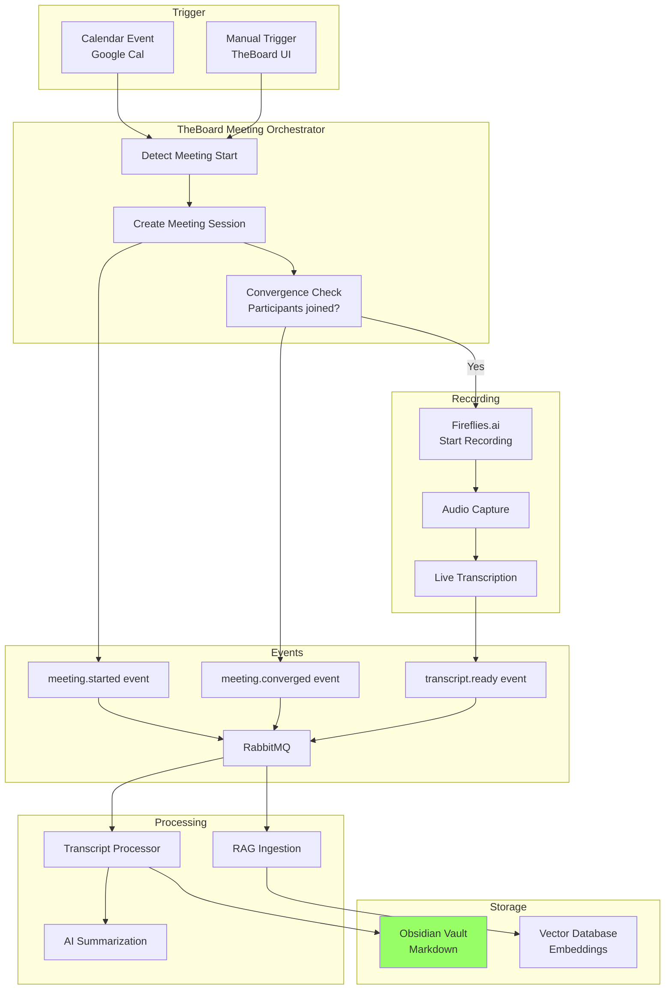

# Meeting Collaboration Domain - Data Flows

## Meeting Lifecycle Flow

```mermaid
flowchart TB
    subgraph Trigger
        Calendar[Calendar Event<br/>Google Cal]
        Manual[Manual Trigger<br/>TheBoard UI]
    end

    subgraph TheBoard["TheBoard Meeting Orchestrator"]
        Detect[Detect Meeting Start]
        CreateSession[Create Meeting Session]
        Converge[Convergence Check<br/>Participants joined?]
    end

    subgraph Recording
        Fireflies[Fireflies.ai<br/>Start Recording]
        Audio[Audio Capture]
        LiveTranscript[Live Transcription]
    end

    subgraph Events
        MeetingStarted[meeting.started event]
        MeetingConverged[meeting.converged event]
        TranscriptReady[transcript.ready event]
        RMQ[RabbitMQ]
    end

    subgraph Processing
        Processor[Transcript Processor]
        RAG[RAG Ingestion]
        Summary[AI Summarization]
    end

    subgraph Storage
        Obsidian[Obsidian Vault<br/>Markdown]
        VectorDB[Vector Database<br/>Embeddings]
    end

    Calendar --> Detect
    Manual --> Detect
    Detect --> CreateSession
    CreateSession --> MeetingStarted
    MeetingStarted --> RMQ

    CreateSession --> Converge
    Converge -->|Yes| Fireflies
    Fireflies --> Audio
    Audio --> LiveTranscript

    Converge --> MeetingConverged
    MeetingConverged --> RMQ

    LiveTranscript --> TranscriptReady
    TranscriptReady --> RMQ
    RMQ --> Processor
    RMQ --> RAG

    Processor --> Obsidian
    RAG --> VectorDB
    Processor --> Summary

    style Converge decision
    style Obsidian fill:#9f6
```

---
**Version**: 1.0.0 | **Updated**: 2026-01-29
