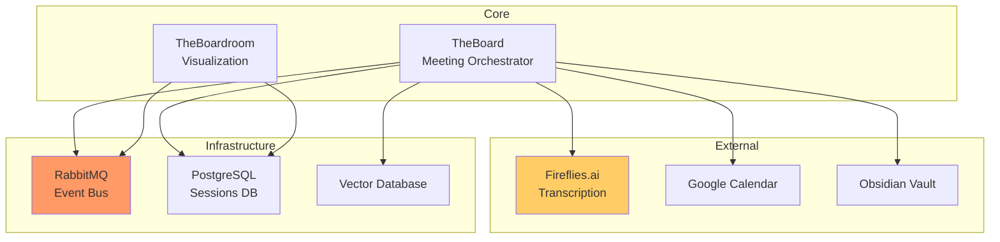

# Meeting Collaboration Domain - Dependencies

## Component Dependencies

```mermaid
graph TB
    subgraph Core
        TheBoard[TheBoard<br/>Meeting Orchestrator]
        Boardroom[TheBoardroom<br/>Visualization]
    end

    subgraph External
        Fireflies[Fireflies.ai<br/>Transcription]
        Calendar[Google Calendar]
        Obsidian[Obsidian Vault]
    end

    subgraph Infrastructure
        RMQ[RabbitMQ<br/>Event Bus]
        Postgres[PostgreSQL<br/>Sessions DB]
        VectorDB[Vector Database]
    end

    TheBoard --> Fireflies
    TheBoard --> Calendar
    TheBoard --> RMQ
    TheBoard --> Postgres

    Boardroom --> RMQ
    Boardroom --> Postgres

    TheBoard --> Obsidian
    TheBoard --> VectorDB

    style RMQ fill:#f96
    style Fireflies fill:#fc6
```

---
**Version**: 1.0.0 | **Updated**: 2026-01-29
