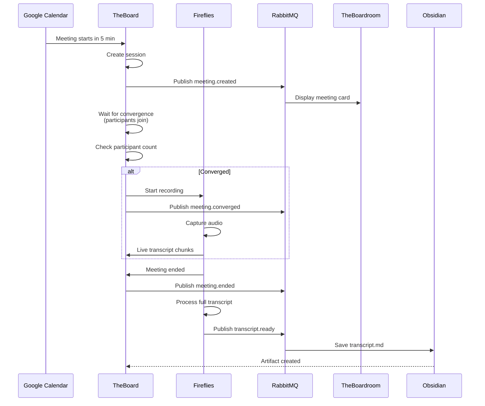

# Meeting Collaboration Domain - Sequences

## Meeting Convergence Sequence

```mermaid
sequenceDiagram
    participant Cal as Google Calendar
    participant Board as TheBoard
    participant FF as Fireflies
    participant RMQ as RabbitMQ
    participant Room as TheBoardroom
    participant Obs as Obsidian

    Cal->>Board: Meeting starts in 5 min
    Board->>Board: Create session
    Board->>RMQ: Publish meeting.created
    RMQ->>Room: Display meeting card

    Board->>Board: Wait for convergence<br/>(participants join)
    Board->>Board: Check participant count

    alt Converged
        Board->>FF: Start recording
        Board->>RMQ: Publish meeting.converged
        FF->>FF: Capture audio
        FF->>Board: Live transcript chunks
    end

    FF->>Board: Meeting ended
    Board->>RMQ: Publish meeting.ended
    FF->>FF: Process full transcript
    FF->>RMQ: Publish transcript.ready

    RMQ->>Obs: Save transcript.md
    Obs-->>Board: Artifact created
```

---
**Version**: 1.0.0 | **Updated**: 2026-01-29
