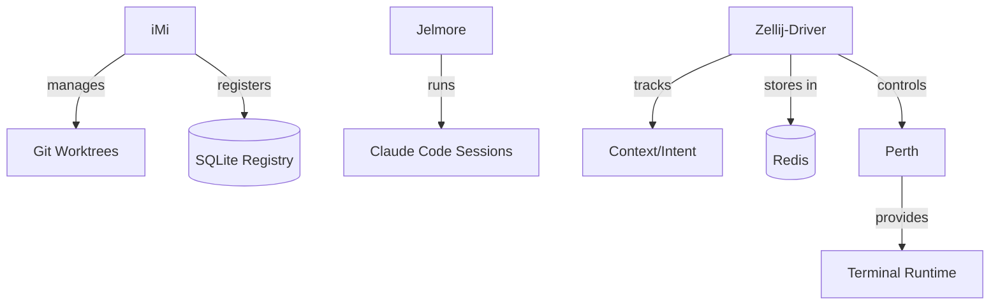

# Domain: Workspace Management

> The execution context. Where agents do their actual work.

## Services

| Service | Role | Tech Stack | Status |
|---------|------|------------|--------|
| **iMi** | Decentralized git worktree manager, project registry | Rust, Tokio, SQLite, git2 | Active |
| **Jelmore** | Session manager for Claude Code AI | FastAPI, Docker | Active |
| **Zellij-Driver** | Context manager for Zellij terminal multiplexer | Rust, Tokio, Redis | Active |
| **Perth** | Customized Zellij distribution for 33GOD | Rust (Zellij fork) | Active |

## High-Level Purpose

This domain manages the physical execution environment for agents. iMi handles git worktrees with agent claiming/releasing semantics. Jelmore manages long-lived Claude Code sessions. Zellij-Driver tracks intent and milestones across terminal sessions. Perth provides the terminal multiplexer runtime.

## Key Contracts

- **Worktree Lifecycle**: `imi add` → claim → work → commit → release
- **Session State**: Jelmore session IDs map to active agent work
- **Context Persistence**: Zellij-Driver stores intent/milestones in Redis

## Interconnections

## When to Include This Context

Pass this domain when:
- Managing git state or agent execution context
- Debugging worktree conflicts or claim issues
- Working on session lifecycle or persistence
- Extending terminal integration features

## Technical Quick Reference

| Service | Port/Interface | Key Command |
|---------|----------------|-------------|
| iMi | CLI | `imi add feat <name>` |
| Jelmore | 8000 | REST API |
| Zellij-Driver | CLI | `zellij-driver` |
| Perth | Terminal | Zellij fork |

## Key Concepts

### iMi Worktree Semantics
- **trunk-main**: Main branch worktree (never delete)
- **feat-***: Feature worktrees (claim → work → merge)
- **agent_id**: Currently assigned agent (exclusive access)
- **metadata**: Task source links (Plane, Bloodbank, Yi)

### Jelmore Sessions
- Long-lived Claude Code instances
- Programmatic control via REST API
- Session state persistence

### Zellij-Driver Context
- Intent tracking per terminal session
- Milestone logging for progress
- Redis-backed persistence

## Key Files

- `/home/delorenj/code/33GOD/iMi/trunk-main/src/` - Worktree manager
- `/home/delorenj/code/33GOD/jelmore/trunk-main/` - Session manager
- `/home/delorenj/code/33GOD/zellij-driver/` - Context tracker
- `/home/delorenj/code/33GOD/perth/trunk-main/` - Terminal fork

## Last Sync

<!-- degenerate:sync-marker -->
Commit: (pending initial sync)
Date: (pending initial sync)
