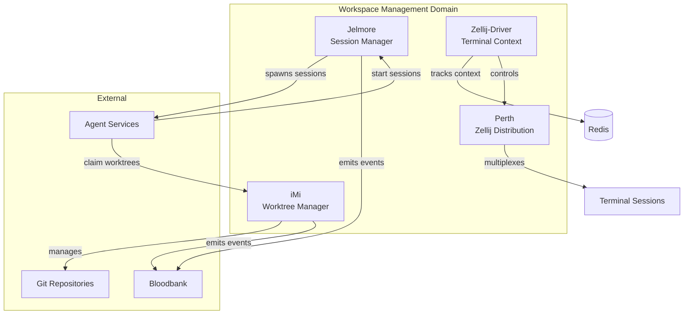
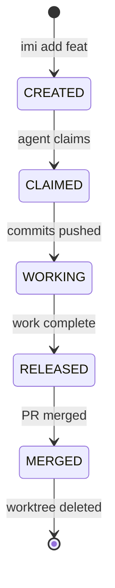

# Workspace Management Domain - GOD Document

> **Guaranteed Organizational Document** - Developer-facing reference for the Workspace Management domain
>
> **Last Updated**: 2026-02-01
> **Components**: 4

---

## Domain Overview

The Workspace Management domain provides **the physical execution context for agents**. It handles git worktrees with agent claiming semantics, manages long-lived AI coding sessions, and tracks intent/milestones across terminal sessions.

**Core Responsibility**: Isolate agent workspaces, manage git state, and persist execution context.

**Architectural Philosophy**: "Each Agent Gets Their Own Sandbox"

---

## Component Map



---

## Components

### iMi

**Purpose**: Decentralized git worktree manager with agent claiming/releasing semantics and project registry

**Type**: CLI / Git Manager
**Status**: Production

**Key Events:**
- **Emits**: `imi.worktree.created`, `imi.worktree.claimed`, `imi.worktree.released`
- **Consumes**: `agent.task.assigned` (auto-claim worktree)

**Interfaces:**
- CLI: `imi add feat <name>`, `imi claim <worktree>`, `imi release <worktree>`
- SQLite Registry: Project metadata, workspace isolation

[📄 Component GOD Doc](../../iMi/GOD.md)

---

### Jelmore

**Purpose**: Programmatic session manager for AI coding assistants (Claude Code, Codex, Gemini, etc.)

**Type**: API / Session Manager
**Status**: Development

**Key Events:**
- **Emits**: `jelmore.session.started`, `jelmore.session.completed`, `jelmore.session.paused`
- **Consumes**: `agent.session.requested`

**Interfaces:**
- REST API: `http://localhost:8000`
- Docker: Isolated sessions per coding assistant

[📄 Component GOD Doc](../../jelmore/GOD.md)

---

### Zellij-Driver

**Purpose**: Context manager for Zellij terminal multiplexer with intent tracking and milestone logging

**Type**: CLI / Context Tracker
**Status**: Development

**Key Events:**
- **Emits**: `zellij.context.updated`, `zellij.milestone.logged`
- **Consumes**: `session.context.request`

**Interfaces:**
- CLI: `zellij-driver track-intent "<description>"`
- Redis: Context persistence

[📄 Component GOD Doc](../../zellij-driver/GOD.md) _(To be created)_

---

### Perth

**Purpose**: Customized Zellij distribution tailored for 33GOD terminal workflows

**Type**: Terminal Multiplexer (Zellij Fork)
**Status**: Development

**Key Events:**
- **Emits**: None (terminal emulator)
- **Consumes**: None

**Interfaces:**
- Binary: `perth` (Zellij fork)
- Config: `.perth/config.kdl`

[📄 Component GOD Doc](../../perth/GOD.md) _(To be created)_

---

## Domain Event Contracts

### Cross-Component Events

Events that flow between components within this domain:

| Event | Producer | Consumer(s) | Purpose |
|-------|----------|-------------|---------|
| `imi.worktree.created` | iMi | Jelmore, Zellij-Driver | Initialize execution context |
| `jelmore.session.started` | Jelmore | Zellij-Driver | Track session in terminal |
| `zellij.context.updated` | Zellij-Driver | iMi, Jelmore | Update workspace metadata |

### External Event Interfaces

Events exchanged with other domains:

| Event | Direction | External Domain | Purpose |
|-------|-----------|-----------------|---------|
| `agent.task.assigned` | Inbound | Agent Orchestration | Auto-claim worktree for agent |
| `session.coding.completed` | Outbound | Development Tools | Report coding session results |
| `worktree.*` | Outbound | Infrastructure | Track worktree lifecycle |

---

## Worktree Lifecycle



**Worktree Types:**
- **trunk-main**: Main branch worktree (never delete)
- **feat-{name}**: Feature worktrees (claim → work → merge)
- **fix-{name}**: Bugfix worktrees
- **exp-{name}**: Experimental worktrees

---

## iMi Workspace Isolation

**Entity-Based Workspaces:**

Each entity (human or Yi agent) has an isolated workspace directory:

```
/home/delorenj/.imi/workspaces/{entity_id}/{project_uuid}/
```

**Authentication:**
- All entities authenticate via `$IMI_IDENTITY_TOKEN`
- Token-based access control (humans and agents treated equally)
- Projects registered in SQLite with UUIDs

**Claiming Semantics:**
- Worktree claimed by `agent_id` or `entity_id`
- Exclusive access during claim period
- Released explicitly or on timeout

---

## Jelmore Session Management

**Session Lifecycle:**

```
1. POST /sessions → Create session (Claude Code, Codex, etc.)
2. GET /sessions/{id} → Monitor session status
3. POST /sessions/{id}/pause → Pause execution
4. POST /sessions/{id}/resume → Resume execution
5. DELETE /sessions/{id} → Terminate session
```

**Docker Isolation:**
- Each session runs in isolated container
- Mounted worktree from iMi
- Session state persisted across restarts

**Supported Coding Assistants:**
- Claude Code
- GitHub Copilot Workspace
- Codex
- Google Gemini Code Assist
- Auggie
- OpenCode

---

## Shared Infrastructure

### Redis Context Store

Zellij-Driver stores intent and milestones in Redis:

```redis
# Intent tracking
SET zellij:session:{id}:intent "Implement user authentication"

# Milestone logging
LPUSH zellij:session:{id}:milestones "Completed schema migration"
```

### Git Worktree Layout

```
/home/delorenj/code/33GOD/
├── trunk-main/           # Main branch (never delete)
├── feat-auth/            # Feature worktree (agent-claimable)
├── feat-dashboard/       # Feature worktree
└── fix-bloodbank/        # Bugfix worktree
```

---

## Development Guidelines

### Creating a Worktree for Agent Work

```bash
# Create feature worktree
imi add feat authentication

# Claim worktree for agent
imi claim feat-authentication --agent-id yi-agent-001

# Agent works in isolated workspace
cd ~/.imi/workspaces/yi-agent-001/33god-uuid/feat-authentication

# Release when done
imi release feat-authentication
```

### Starting an AI Coding Session

```bash
# Via Jelmore API
curl -X POST http://localhost:8000/sessions \
  -H "Content-Type: application/json" \
  -d '{
    "assistant_type": "claude-code",
    "worktree_path": "/home/delorenj/code/33GOD/feat-authentication",
    "task": "Implement JWT authentication middleware"
  }'
```

### Tracking Intent in Zellij

```bash
# Track intent for terminal session
zellij-driver track-intent "Debugging RabbitMQ connection issues"

# Log milestone
zellij-driver log-milestone "Identified root cause: port mismatch"
```

---

## References

- **System Doc**: `../../GOD.md`
- **Source Domain Docs**: `workspace-management.md`, `worktree-terminal.md`
- **iMi Registry**: SQLite database in `~/.imi/registry.db`
