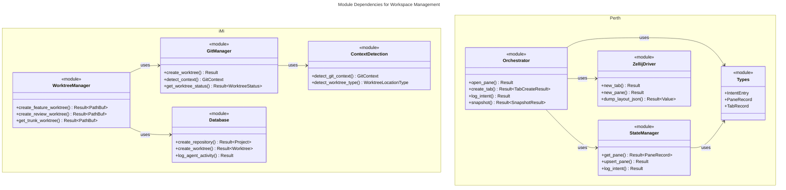
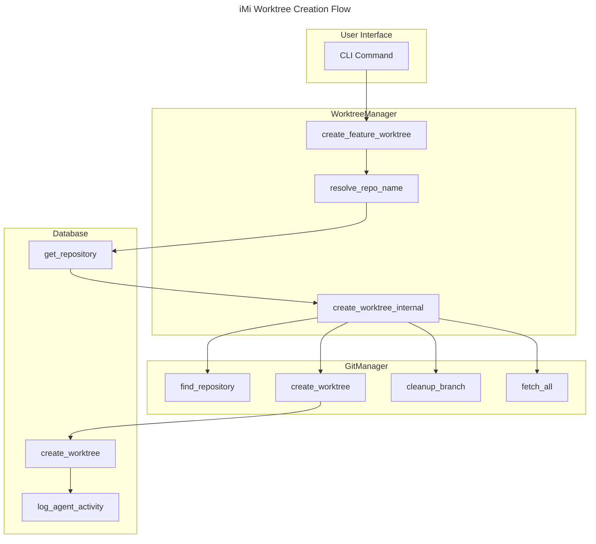
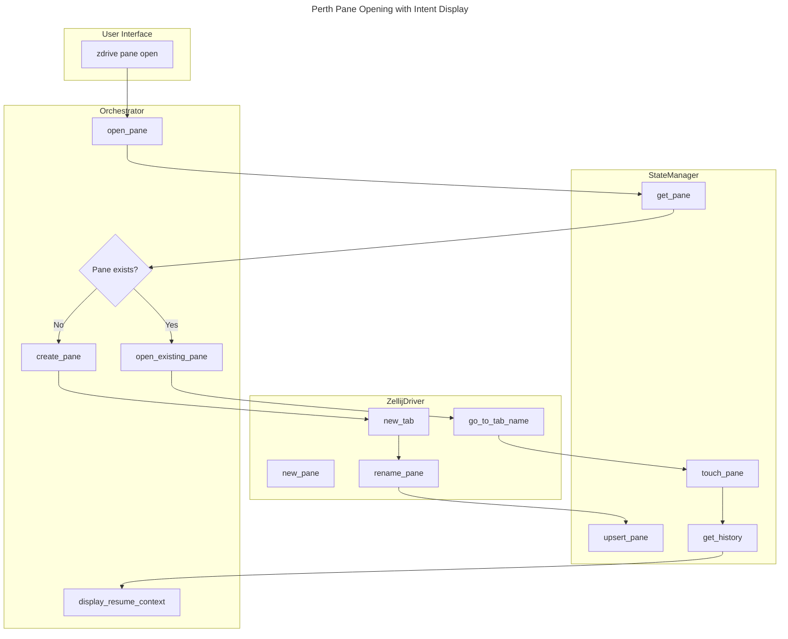

# C4 Code Level: Workspace Management Domain

## Overview
- **Name**: Workspace Management Domain (iMi + Perth + Zellij Driver)
- **Description**: Git worktree management system integrated with terminal session orchestration and cognitive context preservation
- **Location**:
  - iMi: `/home/delorenj/code/33GOD/iMi/trunk-main/src/`
  - Perth (Zellij Driver): `/home/delorenj/code/33GOD/perth/trunk-main/` and `/home/delorenj/code/33GOD/zellij-driver/trunk-main/src/`
- **Primary Language**: Rust
- **Purpose**: Enable multi-agent asynchronous workflows through Git worktree isolation and terminal session state management

## Architecture Summary

The Workspace Management domain consists of three tightly-integrated Rust components:

1. **iMi**: Git worktree manager with opinionated naming conventions and PostgreSQL state tracking
2. **Perth/Zellij Driver**: Terminal session orchestrator with Redis-based pane tracking and intent history
3. **Bloodbank** (dependency): Event publishing for cross-component coordination

These components work together to provide workspace isolation (Git worktrees), session management (Zellij tabs/panes), and cognitive context preservation (intent tracking).

---

## Component 1: iMi (Git Worktree Manager)

### Core Modules

#### 1. Context Detection (`context.rs`)

Enumerations and logic for detecting workspace location:

```rust
// Enums for Git context detection
pub enum GitContext {
    InWorktree { repo_path: PathBuf, worktree_path: PathBuf },
    InTrunk { repo_path: PathBuf },
    InRepository { repo_path: PathBuf },
    Outside,
}

pub enum LocationContext {
    InRepository { repo_path: PathBuf, git_context: GitContext },
    InRoot { root_path: PathBuf },
    Outside,
}

pub enum WorktreeLocationType {
    Trunk,     // main/master branch
    Feature,   // feat/* branches
    Fix,       // fix/* branches
    Review,    // review-pr-* branches
    Aiops,     // aiops/* branches
    Devops,    // devops/* branches
    Other,
}
```

**Key Functions**:
- `GitContext::is_in_worktree() -> bool`
- `GitContext::is_in_trunk() -> bool`
- `GitContext::repo_path() -> Option<&PathBuf>`
- `WorktreeLocationType::from_branch_name(branch: &str) -> Self`

#### 2. Git Operations (`git.rs`)

The `GitManager` struct provides Git operations via libgit2:

```rust
pub struct GitManager;

impl GitManager {
    pub fn new() -> Self;

    // Context detection
    pub fn detect_context(&self, path: Option<&Path>) -> GitContext;
    pub fn is_in_repository(&self, path: &Path) -> bool;
    pub fn detect_worktree_type(&self, repo: &Repository) -> WorktreeLocationType;

    // Repository operations
    pub fn find_repository(&self, path: Option<&Path>) -> Result<Repository>;
    pub fn get_repository_name(&self, repo: &Repository) -> Result<String>;
    pub async fn get_remote_url(&self, path: &Path) -> Result<String>;
    pub async fn get_default_branch(&self, path: &Path) -> Result<String>;

    // Worktree management
    pub fn create_worktree(
        &self,
        repo: &Repository,
        name: &str,
        path: &Path,
        branch: &str,
        base_branch: Option<&str>,
    ) -> Result<()>;

    pub fn remove_worktree(&self, repo: &Repository, name: &str) -> Result<()>;
    pub fn prune_worktrees(&self, repo: &Repository) -> Result<()>;
    pub fn cleanup_worktree_artifacts(&self, repo: &Repository, name: &str, path: &Path) -> Result<()>;
    pub fn list_git_worktrees(&self, repo_path: &Path) -> Result<Vec<GitWorktree>>;

    // Branch operations
    pub fn delete_local_branch(&self, repo: &Repository, branch_name: &str) -> Result<()>;
    pub async fn delete_remote_branch(&self, repo: &Repository, branch_name: &str) -> Result<()>;

    // Status and sync
    pub fn get_worktree_status(&self, repo_path: &Path) -> Result<WorktreeStatus>;
    pub fn get_current_branch(&self, repo_path: &Path) -> Result<String>;
    pub fn fetch_all(&self, repo: &Repository) -> Result<()>;

    // Merge operations
    pub fn merge_branch(&self, repo: &Repository, source_branch: &str, target_branch: &str) -> Result<()>;
    pub fn push_to_remote(&self, repo: &Repository, branch_name: &str) -> Result<()>;

    // PR workflow (via gh CLI)
    pub fn validate_pr_exists(&self, repo_path: &Path, pr_number: u32) -> Result<bool>;
    pub fn checkout_pr(&self, repo_path: &Path, pr_number: u32, worktree_path: &Path) -> Result<()>;

    // Authentication
    pub fn check_github_auth(&self) -> bool;
    pub fn show_auth_help(&self);
}
```

**Data Structures**:

```rust
pub struct GitWorktree {
    pub path: String,
    pub branch: String,
    pub commit: String,
}

pub struct WorktreeStatus {
    pub modified_files: Vec<String>,
    pub new_files: Vec<String>,
    pub deleted_files: Vec<String>,
    pub commits_ahead: usize,
    pub commits_behind: usize,
    pub clean: bool,
}
```

**Authentication Flow**:
- Checks environment variables: `GITHUB_PERSONAL_ACCESS_TOKEN`, `GITHUB_TOKEN`, `GH_TOKEN`
- SSH key detection from `~/.ssh/` (prefers `id_ed25519`, `id_rsa`, `id_ecdsa`)
- Callback-based credential provider for libgit2

#### 3. Database Layer (`database.rs`)

PostgreSQL persistence using SQLx:

```rust
pub struct Database {
    pool: PgPool,
}

impl Database {
    pub async fn new<P: AsRef<Path>>(database_path: P) -> Result<Self>;
    pub async fn ensure_tables(&self) -> Result<()>;

    // Project operations
    pub async fn create_repository(
        &self,
        name: &str,
        path: &str,
        remote_url: &str,
        default_branch: &str,
    ) -> Result<Project>;

    pub async fn get_repository(&self, name: &str) -> Result<Option<Project>>;
    pub async fn get_repository_by_id(&self, id: &Uuid) -> Result<Option<Project>>;
    // ... additional repository methods

    // Worktree operations
    pub async fn create_worktree(
        &self,
        project_id: &Uuid,
        type_id: i32,
        name: &str,
        branch_name: &str,
        path: &str,
    ) -> Result<Worktree>;

    pub async fn get_worktree(&self, project_id: &Uuid, name: &str) -> Result<Option<Worktree>>;
    pub async fn update_worktree_status(&self, worktree_id: &Uuid, status: &WorktreeStatus) -> Result<()>;

    // Agent activity tracking
    pub async fn log_agent_activity(
        &self,
        agent_id: &str,
        worktree_id: &Uuid,
        activity_type: &str,
        description: &str,
    ) -> Result<()>;
}
```

**Database Models**:

```rust
#[derive(Debug, Clone, Serialize, Deserialize, sqlx::FromRow)]
pub struct Project {
    pub id: Uuid,
    pub name: String,
    pub remote_url: String,      // remote_origin in schema
    pub default_branch: String,
    pub path: String,             // trunk_path in schema
    pub description: Option<String>,
    pub metadata: serde_json::Value,
    pub created_at: DateTime<Utc>,
    pub updated_at: DateTime<Utc>,
    pub active: bool,
}

#[derive(Debug, Clone, Serialize, Deserialize, sqlx::FromRow)]
pub struct Worktree {
    pub id: Uuid,
    pub project_id: Uuid,
    pub type_id: i32,
    pub name: String,
    pub branch_name: String,
    pub path: String,
    pub agent_id: Option<String>,

    // In-flight work tracking
    pub has_uncommitted_changes: Option<bool>,
    pub uncommitted_files_count: Option<i32>,
    pub ahead_of_trunk: Option<i32>,
    pub behind_trunk: Option<i32>,
    pub last_commit_hash: Option<String>,
    pub last_commit_message: Option<String>,
    pub last_sync_at: Option<DateTime<Utc>>,

    // Merge tracking
    pub merged_at: Option<DateTime<Utc>>,
    pub merged_by: Option<String>,
    pub merge_commit_hash: Option<String>,

    pub metadata: serde_json::Value,
    pub created_at: DateTime<Utc>,
    pub updated_at: DateTime<Utc>,
    pub active: bool,
}

#[derive(Debug, Clone, Serialize, Deserialize, sqlx::FromRow)]
pub struct AgentActivity {
    pub id: Uuid,
    pub agent_id: String,
    pub worktree_id: Uuid,
    pub activity_type: String,
    pub file_path: Option<String>,
    pub description: String,
    pub metadata: serde_json::Value,
    pub created_at: DateTime<Utc>,
}

#[derive(Debug, Clone, Serialize, Deserialize, sqlx::FromRow)]
pub struct WorktreeType {
    pub id: i32,
    pub name: String,
    pub branch_prefix: String,
    pub worktree_prefix: String,
    pub description: Option<String>,
    pub is_builtin: bool,
    pub color: Option<String>,
    pub icon: Option<String>,
    pub metadata: serde_json::Value,
    pub created_at: DateTime<Utc>,
}
```

#### 4. Worktree Manager (`worktree.rs`)

High-level worktree operations combining Git and database:

```rust
pub struct WorktreeManager {
    pub git: GitManager,
    pub db: Database,
    pub config: Config,
    pub repo_path: Option<PathBuf>,
}

impl WorktreeManager {
    pub fn new(git: GitManager, db: Database, config: Config, repo_path: Option<PathBuf>) -> Self;

    // Type-specific worktree creation
    pub async fn create_feature_worktree(&self, name: &str, repo: Option<&str>) -> Result<PathBuf>;
    pub async fn create_fix_worktree(&self, name: &str, repo: Option<&str>) -> Result<PathBuf>;
    pub async fn create_review_worktree(&self, pr_number: u32, repo: Option<&str>) -> Result<PathBuf>;
    pub async fn create_aiops_worktree(&self, name: &str, repo: Option<&str>) -> Result<PathBuf>;
    pub async fn create_devops_worktree(&self, name: &str, repo: Option<&str>) -> Result<PathBuf>;
    pub async fn create_custom_worktree(&self, name: &str, worktree_type: &str, repo: Option<&str>) -> Result<PathBuf>;

    // Trunk operations
    pub async fn get_trunk_worktree(&self, repo: Option<&str>) -> Result<PathBuf>;

    // Internal implementation
    async fn create_worktree_internal(
        &self,
        repo: Option<&str>,
        worktree_name: &str,
        branch_name: &str,
        worktree_type: &str,
        base_branch: Option<&str>,
    ) -> Result<PathBuf>;
}
```

**Naming Conventions**:
- Feature: `feat-<name>` → branch `feat/<name>`
- Fix: `fix-<name>` → branch `fix/<name>`
- Review: `review-pr-<number>` → branch from PR
- Aiops: `aiops-<name>` → branch `aiops/<name>`
- Devops: `devops-<name>` → branch `devops/<name>`
- Trunk: `trunk-<default-branch>` → branch `main` or `master`

#### 5. Error Handling (`error.rs`)

```rust
#[derive(Error, Debug)]
pub enum ImiError {
    #[error("Git operation failed: {0}")]
    GitError(#[from] git2::Error),

    #[error("Database error: {0}")]
    DatabaseError(#[from] sqlx::Error),

    #[error("IO error: {0}")]
    IoError(#[from] std::io::Error),

    #[error("Configuration error: {0}")]
    ConfigError(String),

    #[error("Worktree not found: {repo}/{name}")]
    WorktreeNotFound { repo: String, name: String },

    #[error("Repository not found: {name}")]
    RepositoryNotFound { name: String },

    #[error("Worktree already exists: {repo}/{name}")]
    WorktreeAlreadyExists { repo: String, name: String },

    #[error("Invalid worktree name: {name}")]
    InvalidWorktreeName { name: String },

    #[error("Git repository not found at path: {path}")]
    GitRepositoryNotFound { path: String },

    #[error("Branch not found: {branch}")]
    BranchNotFound { branch: String },

    #[error("Symlink creation failed: {source} -> {target}: {io_error}")]
    SymlinkCreationFailed { source: String, target: String, io_error: io::Error },
}

pub type Result<T> = std::result::Result<T, ImiError>;
```

---

## Component 2: Perth/Zellij Driver (Terminal Session Manager)

### Core Modules

#### 1. Orchestrator (`orchestrator.rs`)

Central coordination between Zellij, Redis state, and Bloodbank events:

```rust
pub struct Orchestrator {
    state: StateManager,
    zellij: ZellijDriver,
    events: EventPublisher,
}

impl Orchestrator {
    pub fn new(state: StateManager, zellij: ZellijDriver, events: EventPublisher) -> Self;

    // Pane operations
    pub async fn open_pane(
        &mut self,
        pane_name: String,
        tab: Option<String>,
        session: Option<String>,
        meta: HashMap<String, String>,
        show_last_intent: bool,
    ) -> Result<()>;

    pub async fn pane_info(&mut self, pane_name: String) -> Result<PaneInfoOutput>;

    pub async fn batch_panes(
        &mut self,
        tab_name: String,
        pane_names: Vec<String>,
        cwds: Vec<String>,
        vertical: bool,
    ) -> Result<BatchResult>;

    // Tab operations
    pub async fn ensure_tab(&self, tab_name: &str) -> Result<bool>;

    pub async fn create_tab(
        &mut self,
        tab_name: String,
        correlation_id: Option<String>,
        meta: HashMap<String, String>,
    ) -> Result<TabCreateResult>;

    pub async fn tab_info(&mut self, tab_name: &str) -> Result<Option<TabRecord>>;

    // State reconciliation
    pub async fn reconcile(&mut self) -> Result<()>;

    // Intent history (v2.0)
    pub async fn log_intent(&mut self, pane_name: &str, entry: &IntentEntry) -> Result<()>;
    pub async fn get_history(&mut self, pane_name: &str, limit: Option<usize>) -> Result<Vec<IntentEntry>>;

    pub async fn snapshot(
        &mut self,
        pane_name: &str,
        llm_config: &LLMConfig,
        consent_given: bool,
    ) -> Result<SnapshotResult>;

    // Keyspace migration
    pub async fn migrate_keyspace(&mut self, dry_run: bool) -> Result<MigrationResult>;

    // Visualization
    pub async fn visualize(&mut self) -> Result<()>;

    // Session snapshots
    pub async fn save_snapshot(&self, snapshot: &SessionSnapshot) -> Result<()>;
    pub async fn list_session_snapshots(&self) -> Result<Vec<SessionSnapshot>>;
    pub async fn get_snapshot(&self, name: &str) -> Result<SessionSnapshot>;
    pub async fn delete_snapshot(&self, name: &str) -> Result<()>;
    pub async fn restore_snapshot(&self, snapshot: &SessionSnapshot, dry_run: bool) -> Result<RestoreReport>;
}
```

**Result Types**:

```rust
pub struct SnapshotResult {
    pub summary: String,
    pub entry_type: IntentType,
    pub key_files: Vec<String>,
    pub tokens_used: Option<u32>,
}

pub struct TabCreateResult {
    pub tab_name: String,
    pub correlation_id: Option<String>,
    pub created: bool,
    pub session: String,
}

pub struct BatchResult {
    pub tab_name: String,
    pub panes_created: Vec<String>,
    pub panes_skipped: Vec<String>,
    pub session: String,
}
```

#### 2. State Manager (`state.rs`)

Redis persistence layer:

```rust
pub struct StateManager {
    conn: MultiplexedConnection,
}

impl StateManager {
    pub async fn new(redis_url: &str) -> Result<Self>;
    pub fn now_string() -> String;

    // Pane operations
    pub async fn get_pane(&mut self, pane_name: &str) -> Result<Option<PaneRecord>>;
    pub async fn upsert_pane(&mut self, record: &PaneRecord) -> Result<()>;
    pub async fn touch_pane(&mut self, pane_name: &str, meta_updates: &HashMap<String, String>) -> Result<()>;
    pub async fn mark_seen(&mut self, pane_name: &str) -> Result<()>;
    pub async fn mark_stale(&mut self, pane_name: &str) -> Result<()>;
    pub async fn list_pane_names(&mut self) -> Result<Vec<String>>;
    pub async fn list_all_panes(&mut self) -> Result<Vec<PaneRecord>>;

    // Tab operations
    pub async fn upsert_tab(&mut self, record: &TabRecord) -> Result<()>;
    pub async fn get_tab(&mut self, tab_name: &str, session: &str) -> Result<Option<TabRecord>>;
    pub async fn touch_tab(&mut self, tab_name: &str, session: &str) -> Result<()>;

    // Intent history (v2.0)
    pub async fn log_intent(&mut self, pane_name: &str, entry: &IntentEntry) -> Result<()>;
    pub async fn get_history(&mut self, pane_name: &str, limit: Option<usize>) -> Result<Vec<IntentEntry>>;

    // Snapshots
    pub async fn save_snapshot(&mut self, snapshot: &SessionSnapshot) -> Result<()>;
    pub async fn list_snapshots(&mut self, session: &str) -> Result<Vec<SessionSnapshot>>;
    pub async fn get_snapshot(&mut self, session: &str, name: &str) -> Result<SessionSnapshot>;
    pub async fn delete_snapshot(&mut self, session: &str, name: &str) -> Result<()>;
}
```

**Redis Key Patterns**:
- Panes: `perth:pane:<pane_name>` (Hash)
- Pane history: `perth:history:<pane_name>` (List, LPUSH)
- Tabs: `perth:tab:<session>:<tab_name>` (Hash)
- Snapshots: `perth:snapshot:<session>:<name>` (Hash)

#### 3. Types (`types.rs`)

Core data structures:

```rust
#[derive(Debug, Clone, Copy, PartialEq, Eq, Serialize, Deserialize)]
#[serde(rename_all = "lowercase")]
pub enum IntentType {
    Milestone,    // Major accomplishment
    Checkpoint,   // Regular progress marker (default)
    Exploration,  // Investigative activity
}

#[derive(Debug, Clone, Copy, PartialEq, Eq, Serialize, Deserialize)]
#[serde(rename_all = "lowercase")]
pub enum IntentSource {
    Manual,      // User-logged (default)
    Automated,   // System-generated
    Agent,       // AI agent-created
}

#[derive(Debug, Clone, Serialize, Deserialize)]
pub struct IntentEntry {
    pub id: Uuid,
    pub timestamp: DateTime<Utc>,
    pub summary: String,
    pub entry_type: IntentType,
    pub artifacts: Vec<String>,
    pub commands_run: Option<usize>,
    pub goal_delta: Option<String>,
    pub source: IntentSource,
}

impl IntentEntry {
    pub fn new(summary: impl Into<String>) -> Self;
    pub fn with_type(mut self, entry_type: IntentType) -> Self;
    pub fn with_artifacts(mut self, artifacts: Vec<String>) -> Self;
    pub fn with_source(mut self, source: IntentSource) -> Self;
    pub fn with_goal_delta(mut self, delta: impl Into<String>) -> Self;
    pub fn with_commands_run(mut self, count: usize) -> Self;
}

#[derive(Debug, Clone, Serialize, Deserialize)]
pub struct PaneRecord {
    pub pane_name: String,
    pub session: String,
    pub tab: String,
    pub pane_id: Option<String>,
    pub created_at: String,
    pub last_seen: String,
    pub last_accessed: String,
    pub meta: HashMap<String, String>,
    pub stale: bool,
}

#[derive(Debug, Clone, Serialize, Deserialize)]
pub struct TabRecord {
    pub tab_name: String,
    pub session: String,
    pub correlation_id: Option<String>,
    pub created_at: String,
    pub last_accessed: String,
    pub meta: HashMap<String, String>,
}

impl TabRecord {
    pub fn new(tab_name: String, session: String, now: String) -> Self;
    pub fn with_correlation_id(mut self, correlation_id: impl Into<String>) -> Self;
    pub fn with_meta(mut self, meta: HashMap<String, String>) -> Self;
}
```

#### 4. Zellij Driver (`zellij.rs`)

Subprocess-based Zellij control:

```rust
pub struct ZellijDriver;

impl ZellijDriver {
    pub fn new() -> Self;

    // Version management
    pub async fn check_version(&self) -> Result<Version>;

    // Session detection
    pub fn active_session_name(&self) -> Option<String>;

    // Tab operations
    pub async fn query_tab_names(&self, session: Option<&str>) -> Result<Vec<String>>;
    pub async fn new_tab(&self, session: Option<&str>, name: &str) -> Result<()>;
    pub async fn go_to_tab_name(&self, session: Option<&str>, name: &str) -> Result<()>;

    // Pane operations
    pub async fn new_pane(&self, session: Option<&str>) -> Result<()>;
    pub async fn new_pane_vertical(&self, session: Option<&str>) -> Result<()>;
    pub async fn new_pane_horizontal(&self, session: Option<&str>) -> Result<()>;
    pub async fn new_pane_with_cwd(&self, session: Option<&str>, cwd: &str, direction: &str) -> Result<()>;
    pub async fn rename_pane(&self, session: Option<&str>, name: &str) -> Result<()>;
    pub async fn focus_next_pane(&self, session: Option<&str>) -> Result<()>;
    pub async fn focus_pane_by_index(&self, session: Option<&str>, index: usize) -> Result<()>;

    // Layout introspection
    pub async fn dump_layout_json(&self, session: Option<&str>) -> Result<Option<Value>>;

    // Session management
    pub async fn attach_session(&self, name: &str) -> Result<()>;
}
```

**Version Requirements**:
- Minimum Zellij version: `>=0.39.0`
- Uses `zellij action` command for control

**Layout Parsing**:
- Converts KDL layout format to JSON for programmatic access
- Extracts pane names from `tab` and `pane` nodes

---

## Component 3: Perth Main (Zellij Integration)

### Perth Source Tree

**Location**: `/home/delorenj/code/33GOD/perth/trunk-main/src/`

```rust
// main.rs - CLI entry point
fn main() {
    configure_logger();
    create_config_and_cache_folders();
    let opts = CliArgs::parse();

    // Session commands (attach, run, edit, pipe, etc.)
    // Web server commands (start, stop, status, tokens)
    // Convert commands (config, layout, theme)

    // Dispatch to start_client(), start_server(), or start_web_server()
}

// commands.rs - Command implementations
pub fn kill_all_sessions(yes: bool);
pub fn delete_all_sessions(yes: bool, force: bool);
pub fn kill_session(target_session: &Option<String>);
pub fn delete_session(target_session: &Option<String>, force: bool);

pub fn start_server(path: PathBuf, debug: bool);
pub fn start_web_server(opts: CliArgs, run_daemonized: bool, ip: Option<IpAddr>, port: Option<u16>, cert: Option<PathBuf>, key: Option<PathBuf>);
pub fn start_client(opts: CliArgs);

pub fn send_action_to_session(cli_action: CliAction, requested_session_name: Option<String>, config: Option<Config>);

pub fn list_aliases(opts: CliArgs);
pub fn watch_session(session_name: Option<String>, opts: CliArgs);
```

---

## Dependencies Between Components

### Internal Dependencies



### External Dependencies

**iMi**:
- `git2`: Git operations via libgit2 FFI
- `sqlx`: PostgreSQL async database driver
- `anyhow`: Error handling
- `colored`: Terminal colorization
- `dialoguer`: Interactive prompts
- `clap`: CLI argument parsing
- `serde`, `serde_json`: Serialization

**Perth/Zellij Driver**:
- `redis`: Redis async client
- `tokio`: Async runtime
- `serde_json`: JSON parsing for layout data
- `semver`: Version checking for Zellij compatibility
- `uuid`: Unique identifiers for intent entries
- `chrono`: Timestamp handling
- `chrono-humanize`: Human-readable time deltas

**Perth (Zellij itself)**:
- `zellij-utils`: Core Zellij types and utilities
- `zellij-client`: Client-side session management
- `zellij-server`: Server-side session hosting

---

## Relationships

### iMi Data Flow



### Perth Pane Opening Flow



### Circuit Breaker Pattern for LLM Calls

```rust
// Global circuit breaker prevents cascading failures
static LLM_CIRCUIT_BREAKER: LazyLock<CircuitBreaker> = LazyLock::new(CircuitBreaker::new);

// In Orchestrator::snapshot()
pub async fn snapshot(&mut self, pane_name: &str, llm_config: &LLMConfig, consent_given: bool) -> Result<SnapshotResult> {
    // Check circuit state before expensive operations
    LLM_CIRCUIT_BREAKER.allow_request()?;

    // Call LLM with timeout
    let result = timeout(Duration::from_secs(30), provider.summarize(&context)).await;

    match result {
        Ok(Ok(_)) => {
            LLM_CIRCUIT_BREAKER.record_success();  // Close circuit
            // ... process result
        }
        Ok(Err(_)) | Err(_) => {
            LLM_CIRCUIT_BREAKER.record_failure();  // Open after 3 failures
            return Err(...);
        }
    }
}
```

**Circuit States**:
- **Closed**: Normal operation, requests allowed
- **Open**: After 3 consecutive failures, all requests rejected
- **Half-Open**: After 5-minute cooldown, single test request allowed

---

## Implementation Patterns

### 1. Builder Pattern for Intent Entries

```rust
let entry = IntentEntry::new("Implemented user authentication")
    .with_type(IntentType::Milestone)
    .with_source(IntentSource::Automated)
    .with_artifacts(vec![
        "src/auth/login.rs".to_string(),
        "src/auth/session.rs".to_string(),
    ])
    .with_commands_run(42);

state_manager.log_intent("backend-dev", &entry).await?;
```

### 2. Async/Await Error Propagation

```rust
// Using ? operator for early returns with context
pub async fn create_tab(&mut self, tab_name: String, correlation_id: Option<String>) -> Result<TabCreateResult> {
    let session = self.zellij
        .active_session_name()
        .ok_or_else(|| anyhow!("no active session; must be inside a Zellij session"))?;

    self.zellij
        .new_tab(None, &tab_name)
        .await
        .context("failed to create tab in Zellij")?;

    // ... more operations
}
```

### 3. Metadata Storage Pattern

Both iMi and Perth use `HashMap<String, String>` for metadata:

```rust
// iMi - Store position in metadata
let mut meta = HashMap::new();
meta.insert("position".to_string(), idx.to_string());
meta.insert("cwd".to_string(), abs_cwd);

let record = PaneRecord::new(pane_name, session, tab_name, now, meta);
```

This allows extensibility without schema changes.

### 4. Opinionated Naming Conventions

```rust
// iMi enforces naming patterns
fn create_feature_worktree(&self, name: &str) -> Result<PathBuf> {
    let worktree_name = format!("feat-{}", name);      // feat-auth-system
    let branch_name = format!("feat/{}", name);        // feat/auth-system
    self.create_worktree_internal(None, &worktree_name, &branch_name, "feat", None).await
}

fn create_review_worktree(&self, pr_number: u32) -> Result<PathBuf> {
    let worktree_name = format!("review-pr-{}", pr_number);  // review-pr-42
    // Uses gh CLI to fetch actual PR branch
    self.create_pr_worktree_with_gh(pr_number, None).await
}
```

### 5. Redis List-Based History

```rust
// LPUSH for newest-first ordering
pub async fn log_intent(&mut self, pane_name: &str, entry: &IntentEntry) -> Result<()> {
    let history_key = format!("perth:history:{}", pane_name);
    let json = serde_json::to_string(entry)?;

    // Add to head of list (newest first)
    self.conn.lpush(&history_key, &json).await?;

    // Maintain max 100 entries
    self.conn.ltrim(&history_key, 0, 99).await?;

    Ok(())
}

// LRANGE 0 to N gets newest entries
pub async fn get_history(&mut self, pane_name: &str, limit: Option<usize>) -> Result<Vec<IntentEntry>> {
    let limit = limit.unwrap_or(100);
    let entries: Vec<String> = self.conn.lrange(&history_key, 0, (limit - 1) as isize).await?;

    entries.iter()
        .map(|json| serde_json::from_str(json))
        .collect()
}
```

### 6. Event Publishing (Bloodbank Integration)

```rust
// Perth publishes events for cross-component coordination
impl Orchestrator {
    pub async fn create_tab(&mut self, tab_name: String, correlation_id: Option<String>) -> Result<TabCreateResult> {
        // ... create tab in Zellij and Redis

        // Publish event with correlation ID for traceability
        self.events.tab_created(&record).await;

        Ok(result)
    }

    pub async fn log_intent(&mut self, pane_name: &str, entry: &IntentEntry) -> Result<()> {
        self.state.log_intent(pane_name, entry).await?;

        // Publish event (milestone.recorded if Milestone type)
        let session = self.zellij.active_session_name();
        self.events.intent_logged(pane_name, entry, session.as_deref()).await;

        Ok(())
    }
}
```

---

## Key Algorithms

### 1. Worktree Branch Cleanup Algorithm

From `git.rs`:

```rust
pub fn create_worktree(&self, repo: &Repository, name: &str, path: &Path, branch: &str, base_branch: Option<&str>) -> Result<()> {
    // 1. Fetch latest from remote
    self.fetch_all(repo)?;

    // 2. Clean up conflicting branches
    let potential_branch_names = vec![
        branch.to_string(),
        branch.replace('/', "-"),  // Handle slash confusion
        name.to_string(),          // Handle name vs branch confusion
    ];

    for branch_to_check in &potential_branch_names {
        if let Ok(mut existing_branch) = repo.find_branch(branch_to_check, BranchType::Local) {
            // Check if branch is in use by a worktree
            let is_in_use = self.is_branch_in_use_by_worktree(repo, branch_to_check)?;

            if !is_in_use && !existing_branch.is_head() {
                println!("Removing existing branch: {}", branch_to_check);
                existing_branch.delete()?;
            } else if branch_to_check == branch {
                return Err(anyhow!("Cannot recreate branch '{}' as it is in use", branch));
            }
        }
    }

    // 3. Create new branch from base
    let base_commit = repo.revparse_single(&base_ref)?.peel_to_commit()?;
    repo.branch(branch, &base_commit, false)?;

    // 4. Clean up existing worktree artifacts if needed
    if self.worktree_exists(repo, name) || path.exists() {
        self.cleanup_worktree_artifacts(repo, name, path)?;
    }

    // 5. Create worktree and set HEAD
    let worktree = repo.worktree(name, path, Some(&mut options))?;
    let worktree_repo = Repository::open_from_worktree(&worktree)?;

    if name != branch {
        // Auto-created branch differs from intended branch - switch to correct one
        let branch_ref = repo.find_branch(branch, BranchType::Local)?;
        let commit = branch_ref.get().peel_to_commit()?;
        worktree_repo.set_head_detached(commit.id())?;
        worktree_repo.checkout_head(Some(CheckoutBuilder::new().force()))?;

        let branch_refname = format!("refs/heads/{}", branch);
        worktree_repo.set_head(&branch_refname)?;

        // Delete auto-created branch if different
        if let Ok(mut auto_branch) = repo.find_branch(name, BranchType::Local) {
            if !auto_branch.is_head() {
                auto_branch.delete()?;
            }
        }
    }

    Ok(())
}
```

### 2. Pane Reconciliation Algorithm

From `orchestrator.rs`:

```rust
pub async fn reconcile(&mut self) -> Result<()> {
    let current_session = self.zellij.active_session_name()
        .ok_or_else(|| anyhow!("not inside a zellij session"))?;

    // 1. Get current layout from Zellij
    let mut layout_panes = HashSet::new();
    let mut layout_confident = false;

    if let Some(layout) = self.zellij.dump_layout_json(None).await? {
        collect_pane_names(&layout, &mut layout_panes, false);
        if !layout_panes.is_empty() {
            layout_confident = true;
        }
    }

    // 2. Get all tracked panes from Redis
    let pane_names = self.state.list_pane_names().await?;

    let mut total = 0;
    let mut seen = 0;
    let mut stale = 0;
    let mut skipped = 0;

    // 3. Reconcile each pane
    for pane_name in pane_names {
        total += 1;

        let Some(record) = self.state.get_pane(&pane_name).await? else {
            skipped += 1;
            continue;
        };

        // Skip panes from other sessions
        if record.session != current_session {
            skipped += 1;
            continue;
        }

        // Only reconcile if we have confident layout data
        if !layout_confident {
            skipped += 1;
            continue;
        }

        // 4. Mark as seen or stale based on presence in layout
        if layout_panes.contains(&record.pane_name) {
            self.state.mark_seen(&record.pane_name).await?;
            seen += 1;
        } else {
            self.state.mark_stale(&record.pane_name).await?;
            stale += 1;
        }
    }

    println!("reconcile: session={} total={} seen={} stale={} skipped={}",
             current_session, total, seen, stale, skipped);

    Ok(())
}
```

### 3. Layout Parsing (KDL to JSON)

From `zellij.rs`:

```rust
fn parse_kdl_to_json(&self, kdl: &str) -> Result<Value> {
    let mut tabs = Vec::new();
    let mut current_tab_name = None;
    let mut current_panes = Vec::new();

    // Regex patterns for KDL parsing
    let tab_re = Regex::new(r#"tab\s+name="([^"]+)""#)?;
    let pane_re = Regex::new(r#"^\s*pane\b"#)?;

    for line in kdl.lines() {
        let line = line.trim();

        // Detect tab boundaries
        if let Some(caps) = tab_re.captures(line) {
            // Save previous tab
            if let Some(name) = current_tab_name.take() {
                let mut tab = serde_json::Map::new();
                tab.insert("name".to_string(), Value::String(name));
                tab.insert("panes".to_string(), Value::Array(current_panes));
                tabs.push(Value::Object(tab));
                current_panes = Vec::new();
            }
            current_tab_name = Some(caps[1].to_string());
        }
        // Detect pane nodes
        else if pane_re.is_match(line) {
            let mut pane = serde_json::Map::new();
            pane.insert("name".to_string(), Value::String("unnamed".to_string()));
            current_panes.push(Value::Object(pane));
        }
    }

    // Save final tab
    if let Some(name) = current_tab_name {
        let mut tab = serde_json::Map::new();
        tab.insert("name".to_string(), Value::String(name));
        tab.insert("panes".to_string(), Value::Array(current_panes));
        tabs.push(Value::Object(tab));
    }

    // Build final layout structure
    let mut layout = serde_json::Map::new();
    layout.insert("tabs".to_string(), Value::Array(tabs));

    Ok(Value::Object(layout))
}
```

---

## Testing Patterns

### iMi Test Structure

From `trunk-main/tests/`:

- `init_tests.rs` - Initialization and configuration tests
- `git_tests.rs` - Git operations (worktree creation, branch management)
- `database_tests.rs` - PostgreSQL persistence layer
- `worktree_tests.rs` - End-to-end worktree workflows
- `integration_tests_comprehensive.rs` - Full system integration

### Perth Test Stub

From `trunk-main/tests/intent_history.rs`:

```rust
#[tokio::test]
async fn test_intent_logging() {
    let mut state = StateManager::new("redis://127.0.0.1:6379").await.unwrap();

    let entry = IntentEntry::new("Implemented authentication")
        .with_type(IntentType::Milestone)
        .with_artifacts(vec!["src/auth.rs".to_string()]);

    state.log_intent("backend-dev", &entry).await.unwrap();

    let history = state.get_history("backend-dev", Some(10)).await.unwrap();
    assert_eq!(history.len(), 1);
    assert_eq!(history[0].summary, "Implemented authentication");
}
```

---

## Notes

### iMi Design Decisions

1. **Opinionated Naming**: Enforces consistent worktree/branch naming patterns to reduce cognitive load in multi-agent workflows
2. **PostgreSQL over SQLite**: Enables concurrent access from multiple agents without file locking issues
3. **Path Validation**: `validate_and_repair_repository_path()` handles repositories moved or accessed via symlinks
4. **Trunk Separation**: Trunk worktree (`trunk-main`) is kept separate from feature worktrees to prevent accidental commits

### Perth Design Decisions

1. **Redis for Speed**: In-memory storage for sub-millisecond pane lookups during rapid context switching
2. **Intent History as List**: LPUSH + LTRIM provides O(1) append and automatic retention enforcement
3. **Circuit Breaker for LLM**: Prevents cascading failures when AI providers are degraded or rate-limited
4. **Correlation IDs**: Bloodbank event traceability enables debugging of agentic workflows across components
5. **Consent Model**: Explicit user consent required before sending context to external LLM providers

### Integration Points

- **iMi ↔ Perth**: Perth can trigger `imi feat <name>` to create worktrees, then open panes in those paths
- **Perth ↔ Bloodbank**: Perth publishes `pane.created`, `tab.created`, `milestone.recorded` events for coordination
- **Perth ↔ Zellij**: Subprocess-based control via `zellij action` commands with JSON/KDL parsing

### Future Considerations

- **iMi Auto-Sync**: Background daemon to keep worktree status in sync with Git state
- **Perth LLM Providers**: Support for local models (Ollama) to reduce latency and enable offline snapshots
- **Session Restoration**: Perth snapshots enable full session reconstruction after crashes or upgrades
- **Zellij Plugin**: Native Zellij plugin for Perth could eliminate subprocess overhead

---

## References

- iMi Source: `/home/delorenj/code/33GOD/iMi/trunk-main/src/`
- Perth Source: `/home/delorenj/code/33GOD/perth/trunk-main/`
- Zellij Driver Source: `/home/delorenj/code/33GOD/zellij-driver/trunk-main/src/`
- libgit2 Rust Bindings: https://github.com/rust-lang/git2-rs
- Zellij Documentation: https://zellij.dev/documentation/
- PostgreSQL Schema: `/home/delorenj/code/33GOD/iMi/trunk-main/migrations/`
- Redis Key Patterns: See StateManager implementation in `state.rs`
